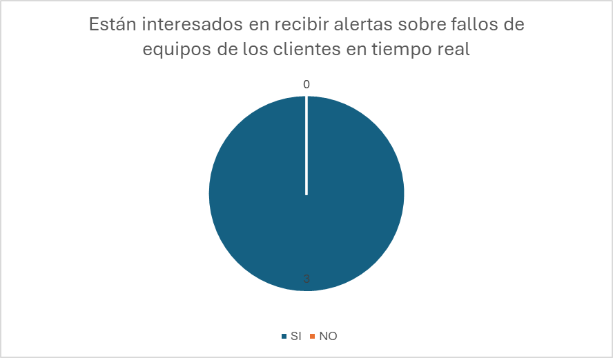
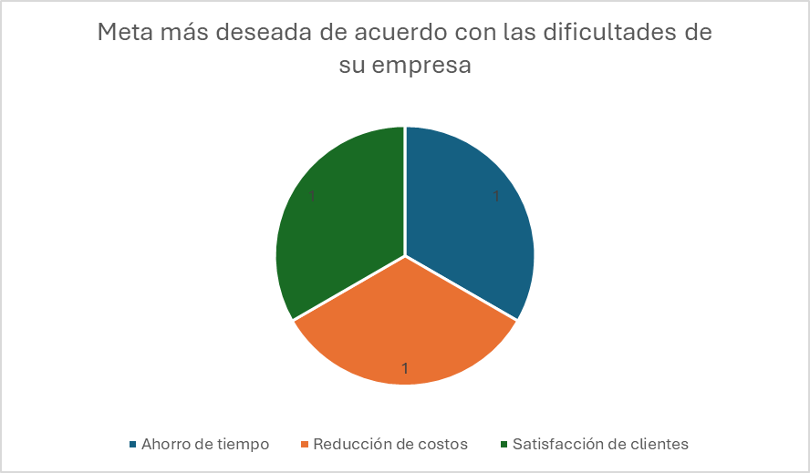
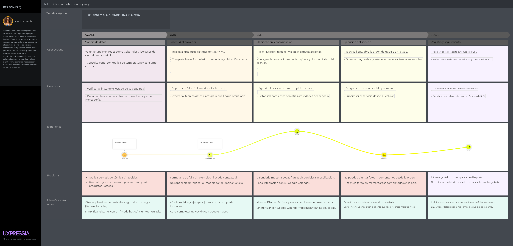



 <h1>Universidad Peruana de Ciencias Aplicadas</h1>
 
  <h2>Carrera: Ingeniería de Software</h2>
  <h2>Ciclo: 2025-20</h2>
 
  <h2>Curso: 1ASI0732 Diseño de Experimentos de Ingeniería de Software</h2>
  <h2>Sección: 2520</h2>
  <h2>Profesor: Juan Carlos Tinoco Licas</h2>
 
 <h1>Informe TB1</h1>
  <h2>Startup: IA: TechBear</h2>
  <h2>Producto: OsitoPolar</h2>
 
  <h2>Integrantes</h2>
<ul style="list-style: none;">
  <li><h3>U202220250 Hardie Alfonso Holguin Gamarra</h3></li>
  <li><h3>U20211G499 Angelo Stephano Moscoso Bejar</h3></li>
  <li><h3></h3></li>
  <li><h3></h3></li>
  <li><h3></h3></li>
</ul>
 
   <h3>Abril 2025</h3>

## Registro de Versiones del Informe

| Versión | Fecha      | Autor               | Descripción de modificación                                     |
|---------|------------|----------------------|-----------------------------------------------------------------|
| 0.1     | xx/xx/xxxx | xxxxxxx       | Desarrollo del Capítulo 1 y sección 2.1                         |
| 0.2     | xx/xx/xxxx | xxxxxxx     | Desarrollo del Capítulo 2 (entrevistas, competidores, segmentación) |
| 0.2.1   | xx/xx/xxxx | xxxxxxx        | Desarrollo del Capítulo 3 (To-Be, User Stories, Backlog)        |
| 0.3     | xx/xx/xxxx | xxxxxxx        | Desarrollo del Capítulo 4 (diseño UI/UX, arquitectura, BD)      |
| 0.4     | xx/xx/xxxx | xxxxxxx         | Desarrollo del Capítulo 5.1 y prototipado                       |
| 0.4.1   | xx/xx/xxxx | xxxxxxx     | Desarrollo del Capítulo 5.2.1 al 5.2.2                          |
| 0.4.2   | xx/xx/xxxx | xxxxxxx        | Desarrollo del Capítulo 5.2.3                                   |

## Project Report Collaboration Insights *(POR MODIFICAR POR CADA ENTREGA)
- **URL de la organización del proyecto:**  
  [https://github.com/Inteligencia-Artesanal-Aplicaciones-Web](https://github.com/Inteligencia-Artesanal-Aplicaciones-Web)

- **URL del repositorio del informe del proyecto:**  
  [https://github.com/Inteligencia-Artesanal-Aplicaciones-Web/upc-AppWeb-Inteligencia-Artesanal-Report_v2](https://github.com/Inteligencia-Artesanal-Aplicaciones-Web/upc-AppWeb-Inteligencia-Artesanal-Report_v2)

- **URL del repositorio del landing page del proyecto:**  
  [https://github.com/Inteligencia-Artesanal-Aplicaciones-Web/Landing-Page](https://github.com/Inteligencia-Artesanal-Aplicaciones-Web/Landing-Page)

  

- **URL del repositorio del frontend del proyecto:**  
  [https://github.com/Inteligencia-Artesanal-Aplicaciones-Web/OsitoPolar-Frontend](https://github.com/Inteligencia-Artesanal-Aplicaciones-Web/OsitoPolar-Frontend)

- **URL del repositorio del backend del proyecto:**  
  [https://github.com/Inteligencia-Artesanal-Aplicaciones-Web/OsitoPolar-Platform](https://github.com/Inteligencia-Artesanal-Aplicaciones-Web/OsitoPolar-Platform)

## Contenido

- [Student Outcome](#student-outcome)

- [Capítulo I: Introducción](#c1)
    - [1.1. Startup Profile](#11-startup-profile)
        - [1.1.1. Descripción de la Startup](#111-descripción-de-la-startup)
        - [1.1.2. Perfiles de integrantes del equipo](#112-perfiles-de-integrantes-del-equipo)
    - [1.2. Solution Profile](#12-solution-profile)
        - [1.2.1 Antecedentes y problemática](#121-antecedentes-y-problemática)
        - [1.2.2 Lean UX Process](#122-lean-ux-process)
            - [1.2.2.1. Lean UX Problem Statements](#1221-lean-ux-problem-statements)
            - [1.2.2.2. Lean UX Assumptions](#1222-lean-ux-assumptions)
            - [1.2.2.3. Lean UX Hypothesis Statements](#1223-lean-ux-hypothesis-statements)
            - [1.2.2.4. Lean UX Canvas](#1224-lean-ux-canvas)
    - [1.3. Segmentos objetivo](#13-segmentos-objetivo)

- [Capítulo II: Requirements Elicitation & Analysis](#c2)
    - [2.1. Competidores](#21-competidores)
        - [2.1.1. Análisis competitivo](#211-análisis-competitivo)
        - [2.1.2. Estrategias y tácticas frente a competidores](#212-estrategias-y-tácticas-frente-a-competidores)
    - [2.2. Entrevistas](#22-entrevistas)
        - [2.2.1. Diseño de entrevistas](#221-diseño-de-entrevistas)
        - [2.2.2. Registro de entrevistas](#222-registro-de-entrevistas)
        - [2.2.3. Análisis de entrevistas](#223-análisis-de-entrevistas)
    - [2.3. Needfinding](#23-needfinding)
        - [2.3.1. User Personas](#231-user-personas)
        - [2.3.2. User Task Matrix](#232-user-task-matrix)
        - [2.3.3. User Journey Mapping](#233-user-journey-mapping)
        - [2.3.4. Empathy Mapping](#234-empathy-mapping)
        - [2.3.5. As-is Scenario Mapping](#235-as-is-scenario-mapping)
    - [2.4. Ubiquitous Language](#24-ubiquitous-language)

- [Capítulo III: Requirements Specification](#c3)
    - [3.1. To-Be Scenario Mapping](#31-to-be-scenario-mapping)
    - [3.2. User Stories](#32-user-stories)
    - [3.3. Impact Mapping](#33-impact-mapping)
    - [3.4. Product Backlog](#34-product-backlog)

- [Capítulo IV: Product Design](#c4)
    - [4.1. Style Guidelines](#41-style-guidelines)
        - [4.1.1. General Style Guidelines](#411-general-style-guidelines)
        - [4.1.2. Web Style Guidelines](#412-web-style-guidelines)
    - [4.2. Information Architecture](#42-information-architecture)
        - [4.2.1. Organization Systems](#421-organization-systems)
        - [4.2.2. Labeling Systems](#422-labeling-systems)
        - [4.2.3. SEO Tags and Meta Tags](#423-seo-tags-and-meta-tags)
        - [4.2.4. Searching Systems](#424-searching-systems)
        - [4.2.5. Navigation Systems](#425-navigation-systems)
    - [4.3. Landing Page UI Design](#43-landing-page-ui-design)
        - [4.3.1. Landing Page Wireframe](#431-landing-page-wireframe)
        - [4.3.2. Landing Page Mock-up](#432-landing-page-mock-up)
    - [4.4. Web Applications UX/UI Design](#44-web-applications-uxui-design)
        - [4.4.1. Web Applications Wireframes](#441-web-applications-wireframes)
        - [4.4.2. Web Applications Wireflow Diagrams](#442-web-applications-wireflow-diagrams)
        - [4.4.3. Web Applications Mock-ups](#443-web-applications-mock-ups)
        - [4.4.4. Web Applications User Flow Diagrams](#444-web-applications-user-flow-diagrams)
    - [4.5. Web Applications Prototyping](#45-web-applications-prototyping)
    - [4.6. Domain-Driven Software Architecture](#46-domain-driven-software-architecture)
        - [4.6.1. Software Architecture Context Diagram](#461-software-architecture-context-diagram)
        - [4.6.2. Software Architecture Container Diagrams](#462-software-architecture-container-diagrams)
        - [4.6.3. Software Architecture Components Diagrams](#463-software-architecture-components-diagrams)
    - [4.7. Software Object-Oriented Design](#47-software-object-oriented-design)
        - [4.7.1. Class Diagrams](#471-class-diagrams)
        - [4.7.2. Class Dictionary](#472-class-dictionary)
    - [4.8. Database Design](#48-database-design)
        - [4.8.1. Database Diagram](#481-database-diagram)

- [Capítulo V: Product Implementation, Validation & Deployment](#c5)
    - [5.1. Software Configuration Management](#51-software-configuration-management)
        - [5.1.1. Software Development Environment Configuration](#511-software-development-environment-configuration)
        - [5.1.2. Source Code Management](#512-source-code-management)
        - [5.1.3. Source Code Style Guide & Conventions](#513-source-code-style-guide--conventions)
        - [5.1.4. Software Deployment Configuration](#514-software-deployment-configuration)
    - [5.2. Landing Page, Services & Applications Implementation](#52-landing-page-services--applications-implementation)
        - [5.2.1. Sprint 1](#521-sprint-1)
            - [5.2.1.1. Sprint Planning 1](#5211-sprint-planning-1)
            - [5.2.1.2. Aspect Leaders and Collaborators](#5212-aspect-leaders-and-collaborators)
            - [5.2.1.3. Sprint Backlog 1](#5213-sprint-backlog-1)
            - [5.2.1.4. Development Evidence for Sprint Review](#5214-development-evidence-for-sprint-review)
            - [5.2.1.5. Execution Evidence for Sprint Review](#5215-execution-evidence-for-sprint-review)
            - [5.2.1.6. Services Documentation Evidence for Sprint Review](#5216-services-documentation-evidence-for-sprint-review)
            - [5.2.1.7. Software Deployment Evidence for Sprint Review](#5217-software-deployment-evidence-for-sprint-review)
            - [5.2.1.8. Team Collaboration Insights during Sprint](#5218-team-collaboration-insights-during-sprint)
        - [5.2.2. Sprint 2](#522-sprint-2)
            - [5.2.2.1. Sprint Planning 2](#5221-sprint-planning-2)
            - [5.2.2.2. Aspect Leaders and Collaborators](#5222-aspect-leaders-and-collaborators)
            - [5.2.2.3. Sprint Backlog 2](#5223-sprint-backlog-2)
            - [5.2.2.4. Development Evidence for Sprint Review](#5224-development-evidence-for-sprint-review)
            - [5.2.2.5. Execution Evidence for Sprint Review](#5225-execution-evidence-for-sprint-review)
            - [5.2.2.6. Services Documentation Evidence for Sprint Review](#5226-services-documentation-evidence-for-sprint-review)
            - [5.2.2.7. Software Deployment Evidence for Sprint Review](#5227-software-deployment-evidence-for-sprint-review)
            - [5.2.2.8. Team Collaboration Insights during Sprint](#5228-team-collaboration-insights-during-sprint)
        - [5.2.3. Sprint 3](#523-sprint-3)
            - [5.2.3.1. Sprint Planning 3](#5231-sprint-planning-3)
            - [5.2.3.2. Aspect Leaders and Collaborators](#5232-aspect-leaders-and-collaborators)
            - [5.2.3.3. Sprint Backlog 3](#5233-sprint-backlog-3)
            - [5.2.3.4. Development Evidence for Sprint Review](#5234-development-evidence-for-sprint-review)
            - [5.2.3.5. Execution Evidence for Sprint Review](#5235-execution-evidence-for-sprint-review)
            - [5.2.3.6. Services Documentation Evidence for Sprint Review](#5236-services-documentation-evidence-for-sprint-review)
            - [5.2.3.7. Software Deployment Evidence for Sprint Review](#5237-software-deployment-evidence-for-sprint-review)
            - [5.2.3.8. Team Collaboration Insights during Sprint](#5238-team-collaboration-insights-during-sprint)
        - [5.2.4. Sprint 4](#524-sprint-4)
            - [5.2.4.1. Sprint Planning 4](#5241-sprint-planning-4)
            - [5.2.4.2. Aspect Leaders and Collaborators](#5242-aspect-leaders-and-collaborators)
            - [5.2.4.3. Sprint Backlog 4](#5243-sprint-backlog-4)
            - [5.2.4.4. Development Evidence for Sprint Review](#5244-development-evidence-for-sprint-review)
            - [5.2.4.5. Execution Evidence for Sprint Review](#5245-execution-evidence-for-sprint-review)
            - [5.2.4.6. Services Documentation Evidence for Sprint Review](#5246-services-documentation-evidence-for-sprint-review)
            - [5.2.4.7. Software Deployment Evidence for Sprint Review](#5247-software-deployment-evidence-for-sprint-review)
            - [5.2.4.8. Team Collaboration Insights during Sprint](#5248-team-collaboration-insights-during-sprint)
    - [5.3. Validation Interviews](#53-validation-interviews)
        - [5.3.1. Diseño de Entrevistas](#531-diseño-de-entrevistas)
        - [5.3.2. Registro de Entrevistas](#532-registro-de-entrevistas)
        - [5.3.3. Evaluaciones según heurísticas](#533-evaluaciones-según-heurísticas)
    - [5.4. Video About-the-Product](#54-video-about-the-product)
- [Conclusiones](#conclusiones)
- [Bibliografía](#bibliografía)
- [Anexos](#anexos)

## Student Outcome
El curso contribuye al cumplimiento del Student Outcome ABET:

**ABET – EAC - Student Outcome 4**

**Criterio**: *La capacidad de reconocer responsabilidades éticas y 
profesionales en situaciones de ingeniería y hacer juicios informados, que deben 
considerar el impacto de las soluciones de ingeniería en contextos globales, económicos, 
ambientales y sociales.*

En el siguiente cuadro se describe las acciones realizadas y enunciados de
conclusiones por parte del grupo, que permiten sustentar el haber alcanzado el logro
del ABET – EAC - Student Outcome 4.

| Criterio específico | Acciones realizadas | Conclusiones |
|---------------------|--------------------|--------------|
| Trabaja en equipo para proporcionar liderazgo en forma conjunta | <ul><li><b>Kenyi Efraín Ramírez Cabrera</b>  <b>TB1</b>: En esta entrega, durante el desarrollo de este informe, he tomado el rol de lider del equipo asignando tareas a todo el equipo y apoyando en todo lo posible. Me encargué de varias secciones que tenían que ver con el segmento objetivo 2, User Stories y gran parte del capítulo 5. <b>TP1</b>: En esta entrega, durante el desarrollo de este informe, he ayudado a mis compañeros a realizar ciertas labores y resolver algunas dudas. Me encargué de corregir algunas secciones de la TB1 como User Stories y Product Backlog, también aporté en el desarrollo del Sprint 2 y algunos puntos más del capítulo 5. <b>TB2</b>: En esta entrega me encargué de corregir algunas secciones del TP como User Stories y Product Backlog, también aporté en el desarrollo del Sprint 3 y algunos puntos más del capítulo 5.</li><li><b>Wilder Gonzalo Aliaga Urbina</b>  <b>TB1</b>: Realizó en la identificación de los competidores. <b>TP1</b>: Elaboración y mejora de wireframes para optimizar la experiencia de usuario. <b>TB2</b>: Colaboré activamente en la gestión de equipos y activos, desarrollando todos los servicios relacionados a técnicos. Apoyé al equipo con soluciones técnicas y en la coordinación para cumplir los objetivos del sprint.</li><li><b>Victor Manuel Rojas Reategui</b>  <b>TB1</b>: Participé en las reuniones acordadas por el equipo y brindó apoyo para definir la estructura del proyecto. <b>TP1</b>: Me aseguré de organizar las tareas pendientes para decidir la distribución entre los miembros del equipo. <b>TB2</b>: Colabore activamente con el equipo para poder desarrollar esta entrega, me encargue de la implementación de los planes y subscripciones tanto en el frontend como en el backend.</li><li><b>Italo Sebastián Verona Flores</b>  <b>TB1</b>: Se elaboraron de manera coordinada los entregables asegurando retroalimentación continua entre los miembros. <b>TP1</b>: Identificación de fallas y observaciones.</li><li><b>Joseph Rodríguez</b>  <b>TB1</b>: Aporté ideas clave en la construcción del prototipo, colaboré en la redacción del informe y asistí a todas las reuniones para coordinar las tareas del equipo. <b>TP1</b>: Participé de manera constante en las reuniones, ayudando a mantener la coordinación del equipo, y tomé decisiones en conjunto con mis compañeros, fortaleciendo el liderazgo compartido del grupo. <b>TB2</b>: Realicé el despliegue del backend, corregí errores del frontend y colaboré en el informe del equipo, apoyando en la integración técnica y el cumplimiento de tareas clave.</li></ul> | <ul><li><b>TB1</b>: Se trabajó en equipo en reuniones remotas, proporcionamos conjuntamente un liderazgo de equipo íntegro para la elaboración de nuestro producto y el desarrollo profesional de cada miembro del equipo.</li><li><b>TP1</b>: El liderazgo fue compartido entre los integrantes, y la participación de los miembros del equipo contribuyó a mantener la organización y el cumplimiento de los objetivos mediante una planificación clara y comunicación constante.</li><li><b>TB2</b>: El compromiso y la efectiva colaboración del equipo permitieron no solo la finalización integral del informe, sino también el desarrollo cohesionado y la exitosa integración de las funcionalidades de la plataforma. La claridad en la comunicación fue fundamental para alinear esfuerzos y cumplir con los objetivos técnicos y documentales.</li></ul> |
| Participación y colaboración en plataformas y herramientas de trabajo | <ul><li><b>Kenyi Efraín Ramírez Cabrera</b>  <b>TB1</b>: En esta entrega he colaborado junto con mi equipo en múltiples puntos a través de diferentes plataformas como Trello (para asignación de tareas), Miro (As-is y To-Be Scenarios), Figma (Algunos mockups) <b>TP1</b>: En esta entrega me encargué de informar y resaltar algunos puntos por corregir. Diseñé el formato en Trello y definí junto con mi equipo los bounded context a realizar en la aplicación web. <b>TB2</b>: En esta entrega me encargué de informar y resaltar algunos puntos por corregir. Organicé al equipo de trabajo para realizar tareas individuales y colaborativas. Definí junto con mi equipo los bounded context a realizar en la aplicación web.</li><li><b>Wilder Gonzalo Aliaga Urbina</b>  <b>TB1</b>: Realizó los mockups de la app web y DDD. <b>TP1</b>: Desarrollo de prototipos visuales y mockups interactivos para facilitar la comunicación con desarrollo de app frontend. <b>TB2</b>: Documenté las evidencias del Sprint 3 y realicé correcciones al informe final. Estas acciones contribuyeron a mantener la organización, trazabilidad y cumplimiento de las metas del equipo.</li><li><b>Victor Manuel Rojas Reategui</b>  <b>TB1</b>: Me encargé de la elaboración de los wireframes para la Landing Page, además de organizar las ramas y la estructura del repositorio Github. <b>TP1</b>: Me encargé de desarrllar los wireflows y userflows siguendo los principios de UX Design. <b>TB2</b>: Me encargué de verificar y realizar el despliegue del frontend y del backend en los sesrvicios externos especificados</li><li><b>Italo Sebastián Verona Flores</b>  <b>TB1</b>: Se organizó mediante planificación conjunta, estableciendo plazos claros y distribuyendo tareas. <b>TP1</b>: Me encargé de arreglar el Database diagram, class diagram y Lean ux assumptions.</li><li><b>Joseph Rodriguez</b>  <b>TB1</b>: Me aseguré de cumplir puntualmente mis tareas asignadas, trabajé con mis compañeros en definir objetivos claros y realistas, y mantuve una comunicación constante a través de las plataformas acordadas. <b>TP1</b>: Fortalecí el ambiente colaborativo del equipo brindando apoyo a mis compañeros, aportando soluciones a problemas técnicos y ayudando a cumplir las metas semanales según la planificación establecida. <b>TB2</b>: Actualicé el frontend para consumir datos desde la API desplegada y mejoré la Landing Page, contribuyendo a la integración de componentes y al cumplimiento de los objetivos técnicos del equipo.</li></ul> | <ul><li><b>TB1</b>: Creamos un entorno de trabajo colaborativo mediante el uso de medios de comunicación eficaces, donde cada integrante del equipo mostró compromiso y apoyo mutuo a través de reuniones, entregas anticipadas y revisiones constantes del informe del proyecto. Nos reunimos de manera periódica para aportar ideas y colaborar en cada etapa del desarrollo de nuestro producto y su documentación.</li><li><b>TP1</b>: Se logró un buen entorno de trabajo e inclusivo donde cada integrante se sintió escuchado y valorado. Gracias a la planificación conjunta, cumplimos con los entregables y se fortaleció el compromiso de equipo.</li><li><b>TB2</b>: Completamos exitosamente el informe del proyecto, consolidando todos los hallazgos y avances. Simultáneamente, finalizamos la implementación tanto del frontend como del backend de OsitoPolar. La colaboración constante y la comunicación fluida entre el equipo fueron cruciales para asegurar la integración efectiva de todos los componentes y la coherencia del informe.</li></ul> |

# Capitulo 1: Introducción

## 1.1 Startup Profile

### 1.1.1 Descripción de la Startup

OsitoPolar es una aplicación web orientada a mejorar la gestión y el mantenimiento de equipos de congelación en negocios que dependen críticamente del frío, como supermercados, minimarkets, laboratorios, restaurantes y empresas del sector alimentario o farmacéutico. La solución conecta a estos negocios con técnicos y proveedores especializados en refrigeración, permitiendo una gestión integral, preventiva y automatizada de sus sistemas de congelación.

La plataforma ofrece funcionalidades clave como monitoreo en tiempo real de temperatura, consumo energético y tiempo de uso, generación de reportes técnicos, alertas automatizadas por fallas, historial de rendimiento y programación inteligente de mantenimientos. Estas herramientas están diseñadas para ayudar a negocios que dependen del uso de sistemas de refrigeración, técnicos especializados en refrigeración y proveedores de equipos a optimizar sus operaciones, evitar pérdidas económicas por fallas inesperadas y mantener un registro completo del estado y uso de sus equipos.

Misión: Nuestra misión en OsitoPolar es proporcionar una solución tecnológica inteligente que permita a los negocios proteger su inventario y optimizar la gestión de sus equipos de refrigeración, ofreciendo al mismo tiempo herramientas especializadas para mejorar la eficiencia operativa de los técnicos y proveedores del sector.

Visión: Queremos ser la empresa lider en gestión y mantenimiento de equipos de refrigeración, empezando por Lima y prontamente expandirnos a más lugares del Perú.

### 1.1.2 Perfiles de integrantes del equipo

| **Integrante** | **Joseph Pablo Rodriguez Parco** |
|----------------|----------------------------------|
| **Código del Estudiante** | U202223286 |
| **Carrera** | Ingeniería de Software |
| **Descripción** | Estudiante de Ingeniería de Software con afinidad por proyectos Web, Interesado en ML, Data Science y aprender por sobre todas las cosas. |
| **Foto** |  |

---

| **Integrante** | **Hardie Alfonso Holguín Gamarra** |
|----------------|----------------------------------|
| **Código del Estudiante** | U202220250 |
| **Carrera** | Ingeniería de Software |
| **Descripción** | Estudiante de Ingeniería de Software en la Universidad Peruana de Ciencias Aplicadas (UPC), con una sólida orientación hacia la tecnología y el aprendizaje continuo. Cuento con experiencia en el desarrollo de aplicaciones modernas, seguras y escalables, integrando frameworks y herramientas que permiten optimizar procesos y fomentar la innovación. Me caracterizo por asumir nuevos desafíos que potencien tanto mi crecimiento profesional como el perfeccionamiento de mis habilidades técnicas. |
| **Foto** |  |

---

| **Integrante** | **** |
|----------------|----------------------------------|
| **Código del Estudiante** | U20211G499 |
| **Carrera** | Ingeniería de Software |
| **Descripción** | Tengo 20 años estoy estudiando actualmente en la Univeridad Peruana de Ciencias Aplicadas. Me ha interasado mucho la creación de paginas web para diversos objetivos. Manejo algunos lenguajes de programación como javascript, C++, C+, Python, entre otros. Considero que tengo las habilidades de comunicación efectiva, organización, proactividad, resolución de problemas, entre otras. Espero aportar de manera satisfactoria en mi grupo para terminar de manera exitosa el proyecto. |
| **Foto** |  |

---

| **Integrante** | **** |
|----------------|----------------------------------|
| **Código del Estudiante** | Uxxx |
| **Carrera** | Ingeniería de Software |
| **Descripción** | xxx |
| **Foto** |  |

---

## 1.2 Solution Profile

### 1.2.1 Antecedentes y Problematica

| Las 5Ws y 2Hs | Pregunta                                           | Descripción                                                                                                                                                                                                                                                                                                                                                                                    |
|---------------|----------------------------------------------------|------------------------------------------------------------------------------------------------------------------------------------------------------------------------------------------------------------------------------------------------------------------------------------------------------------------------------------------------------------------------------------------------|
| What?         | ¿Cuál es el problema?                              | Actualmente, los negocios que dependen de equipos de congelación enfrentan grandes desafíos operativos ante fallas inesperadas o falta de mantenimiento. Las fallas térmicas, los altos consumos energéticos no detectados a tiempo y la ausencia de un monitoreo constante pueden derivar en la pérdida de productos, reducción de la calidad del servicio y pérdidas económicas importantes. |
| When?         | ¿Cuándo sucede este problema?                      | Estas situaciones ocurren principalmente durante horarios de operación continua, especialmente en momentos donde no hay personal técnico disponible de forma inmediata, o cuando no se ha realizado un seguimiento adecuado del estado del equipo a lo largo del tiempo.                                                                                                                       |
| Where?        | ¿Dónde se produce este suceso?                     | El problema afecta a negocios ubicados en todo el país, principalmente en Lima, donde la cadena de frío es esencial en sectores como alimentación, medicina y distribución. También impacta a empresas proveedoras de refrigeración que atienden múltiples clientes sin una plataforma centralizada de control.                                                                                |
| Who?          | ¿Quiénes están involucrados?                       | Están involucrados tanto los administradores y dueños de negocios que utilizan congeladoras como los técnicos y empresas proveedoras de servicios de refrigeración.                                                                                                                                                                                                                            |
| Why?          | ¿Cuál es la causa del problema?                    | La causa principal es la falta de soluciones tecnológicas accesibles que integren monitoreo, alertas, historial y programación automática en un solo lugar. Muchas empresas aún dependen de sistemas manuales o no tienen control de lo que sucede con sus equipos hasta que ocurre una falla crítica.                                                                                         |
| How?          | ¿Qué llevó a la persona a llegar a esta situación? | Lo que llevó a los negocios y técnicos a este punto ha sido la acumulación de imprevistos y la falta de digitalización en el mantenimiento preventivo, que genera una alta dependencia de intervenciones reactivas en vez de planificadas. Esto incrementa los costos, los tiempos de respuesta y el desgaste operativo.                                                                       |
| How much?     | ¿Cuánto es el impacto financiero?                  | Aunque el impacto económico varía según el tipo de negocio, la pérdida por una falla en un equipo de refrigeración puede ascender desde cientos hasta miles de soles en productos dañados, sin considerar el tiempo operativo perdido, la pérdida de clientes y la inversión en reparación o reposición de equipos.                                                                            |

### 1.2.2 Lean UX Process

#### 1.2.2.1 Lean UX Problem Statements

El estado actual de la industria de la refrigeración comercial y técnica enfrenta importantes desafíos relacionados con la gestión, el mantenimiento y la trazabilidad de los equipos de congelación. Negocios que dependen críticamente del frío —como supermercados, minimarkets, laboratorios, restaurantes y empresas del sector alimentario o farmacéutico— aún lidian con la falta de monitoreo en tiempo real y con procesos de mantenimiento reactivos. Esto genera pérdidas económicas, ineficiencia energética y riesgos para el inventario.

Lo que las soluciones actuales no logran abordar es la necesidad de una plataforma confiable y automatizada que permita una gestión centralizada, predictiva y transparente tanto para los negocios como para los técnicos y proveedores de refrigeración. La falta de historial técnico accesible, reportes detallados y alertas preventivas limita la capacidad de respuesta ante fallas y deteriora la calidad del servicio técnico ofrecido.

**OsitoPolar** cierra esta brecha al ofrecer una solución tecnológica integral que conecta negocios con técnicos especializados, brindando funcionalidades como monitoreo en tiempo real de temperatura y consumo, programación inteligente de mantenimientos, alertas por fallas, reportes automáticos y trazabilidad completa de cada equipo. Además, proporciona a los proveedores de servicios un módulo para visualizar y gestionar eficientemente los equipos que atienden, organizar visitas y acceder al historial técnico de manera ágil.

Nuestro enfoque inicial está en los negocios de Lima que necesitan asegurar el funcionamiento óptimo de sus sistemas de congelación, así como en los proveedores que buscan profesionalizar y escalar su servicio con herramientas digitales modernas.

Sabremos que hemos tenido éxito cuando observemos una reducción en fallas imprevistas, una optimización del consumo energético, mayor eficiencia operativa por parte de los técnicos especializados y un incremento en la satisfacción de los clientes finales. Esto se evidenciará en la continuidad del servicio y en la fidelización de los negocios que dependen de sistemas de refrigeración, técnicos especializados y proveedores de equipos que utilizan la plataforma.

#### 1.2.2.2 Lean UX Assumption

# Business Outcomes

- Aumentar en al menos un 15% la cantidad de negocios que dependen del uso de sistemas de refrigeración, técnicos especializados en refrigeración y proveedores de equipos activos dentro de la aplicación.

- Lograr una mayor visibilidad de la plataforma OsitoPolar a través de redes sociales, especialmente entre negocios de alimentos y técnicos de refrigeración.

- Generar confianza y seguridad en estos actores respecto al monitoreo y mantenimiento automatizado de sus sistemas de refrigeración.

- Mantener informados a los usuarios finales —negocios, técnicos y proveedores— sobre incidentes recientes como fallas térmicas, cortes de energía o uso irregular de los equipos.

- Alcanzar una base sólida de clientes dispuestos a pagar por una membresía premium que incluya mantenimiento predictivo, reportes personalizados y soporte técnico prioritario.

- Establecer alianzas estratégicas con plataformas como Google Maps o servicios de geolocalización para ampliar el alcance de cobertura y optimizar la programación de visitas técnicas.

- Fomentar la participación activa de negocios, técnicos y proveedores mediante encuestas, valoraciones de técnicos y comentarios sobre el desempeño de los equipos.

- Diseñar una interfaz limpia, simple e intuitiva que garantice una experiencia fluida y atractiva para nuevos usuarios del sector, evitando la sobrecarga visual o de funcionalidades.

- Implementar inteligencia artificial que permita trazar estrategias de mantenimiento inteligente, rutas eficientes para los técnicos y recomendaciones proactivas ante posibles fallos.

# User Outcomes

## ¿Quién será nuestro usuario?

- **Negocios que dependen críticamente del uso de sistemas de refrigeración** como supermercados, minimarkets, restaurantes, laboratorios y empresas del rubro alimentario y farmacéutico.
- **Técnicos especializados en refrigeración** que brindan mantenimiento a dichos sistemas.
- **Proveedores de equipos de refrigeración** que desean ofrecer un servicio posventa más eficiente.

## ¿Dónde encaja nuestro producto en su vida?

- En situaciones donde los negocios necesitan garantizar la continuidad operativa de sus equipos de frío, evitando pérdidas económicas por fallas imprevistas.
- En el día a día de técnicos de refrigeración que deben gestionar múltiples clientes, visitas y mantenimientos.
- En la operación diaria de los negocios que necesitan registros y reportes precisos del desempeño de sus sistemas de refrigeración.

## ¿Qué problemas tiene nuestro producto y cómo se pueden resolver?

- El principal desafío es asegurar que los datos de monitoreo (temperatura, consumo energético, fallas, etc.) sean precisos, actualizados y confiables.
    -   Solución: Se debe integrar sensores calibrados y sistemas de verificación automática que validen las lecturas antes de almacenarlas.

- Otro problema puede ser la adopción inicial de la plataforma por parte de negocios que dependen del uso de sistemas de refrigeración, técnicos especializados en refrigeración y proveedores de equipos que no están familiarizados con la tecnología.
    - Solución: Esto se abordará con una interfaz sencilla, explicaciones paso a paso y soporte técnico accesible.

## ¿Cómo y Cuándo es usado nuestro producto?

- Se accede desde la aplicación web, tanto desde computadoras como dispositivos móviles.
- Se utiliza diariamente para monitorear el estado de los equipos de frío, recibir alertas, programar mantenimientos o revisar el historial técnico.
- También se activa automáticamente en segundo plano cuando se integran sensores de monitoreo con la plataforma.

## ¿Qué problemas tiene nuestro producto?

- En sus etapas iniciales, puede carecer de ciertas integraciones con hardware de terceros.
- Algunos negocios que dependen del uso de sistemas de refrigeración, técnicos especializados o proveedores de equipos pueden requerir capacitación para comprender todas las funcionalidades avanzadas.
- También podría haber desafíos para que los técnicos adopten el uso digital en lugar del método tradicional.

## ¿Qué características son importantes para la app?

- Monitoreo en tiempo real de temperatura, consumo energético y tiempo de uso.
- Alertas automáticas por fallas detectadas en los equipos.
- Historial técnico completo con reportes exportables en PDF.
- Calendario de mantenimiento preventivo con notificaciones programadas.
- Módulo exclusivo para técnicos con gestión de visitas y clientes.
- Soporte técnico inteligente y recomendaciones predictivas mediante IA.
- Registro de múltiples ubicaciones y usuarios con distintos roles.
- Interfaz intuitiva y minimalista para garantizar fácil adopción.

## ¿Cómo debe verse nuestro producto y cómo comportarse?

- **Interfaz amigable y confiable**: Negocios que dependen del uso de sistemas de refrigeración, así como, técnicos especializados y proveedores de equipos deben sentirse seguros al usar la aplicación. La interfaz debe ser clara, ordenada y fácil de navegar, sin sobrecargar de información, con gráficos e indicadores intuitivos.
- **Diseño centrado en tareas críticas**: Desde el primer acceso, negocios que dependen del uso de sistemas de refrigeración, técnicos especializados y proveedores de equipos deben poder ver si hay fallas, cuándo es la próxima visita técnica, y acceder rápidamente a los reportes y al historial de sus equipos.
- **Accesibilidad multiplataforma**: Disponible en web y móvil, adaptable para quienes trabajan tanto en oficina como en campo. Notificaciones inmediatas ante cualquier problema detectado.
- **Simplicidad**: La app debe permitirles gestionar sus negocios, equipos en riesgo y visitas programadas, todo desde un panel centralizado. También pueden agendar visitas y generar reportes técnicos en segundos.

## ¿Qué valor busca el cliente?

- **Gestión técnica simplificada**: Los proveedores y técnicos buscan dejar de ser reactivos. OsitoPolar los vuelve proactivos con mantenimiento predictivo, historiales claros y clientes organizados.
- **Seguridad operativa y cero sorpresas**: Los negocios quieren evitar pérdidas por fallas en frío. OsitoPolar les da monitoreo constante, alertas automáticas y control total sobre sus equipos.
- **Eficiencia energética y trazabilidad**: Los dueños quieren saber si sus equipos consumen de más, si están rindiendo mal, o si un componente ya debería ser reemplazado. El sistema lo identifica antes que ocurra el fallo.

## ¿Qué beneficios adicionales obtendrá el cliente?

- Visibilidad total del estado de sus equipos, desde cualquier lugar, en cualquier momento.
- Soporte técnico más ágil gracias al historial previo y alertas automáticas.
- Menores costos operativos gracias a mantenimientos a tiempo y mayor eficiencia energética.
- Reportes personalizados y exportables.
- Automatización de visitas técnicas cuando se detectan patrones de falla.

## ¿Cómo atraeremos usuarios?

- **Marketing dirigido a nichos clave**: Supermercados, restaurantes y empresas de frío serán contactados directamente mediante LinkedIn, correos y llamadas estratégicas.
- **Alianzas con proveedores de equipos**: Trabajaremos con empresas que venden congeladoras o cámaras frigoríficas para que incluyan OsitoPolar en sus paquetes posventa.
- **Prueba gratuita de versiones de pago**: Un modelo de 14 días gratis con monitoreo limitado para mostrar el valor de la plataforma en tiempo real.

## ¿Cómo generaremos ingresos?

- **Suscripción mensual de negocios**: Por el uso de la plataforma, según número de equipos, tipo de reportes y funcionalidades.
- **Modelo freemium**: Habrá una versión gratuita que brindará algunas funciones limitadas, pero con anuncios, lo que generará ingresos adicionales.
- **Publicidad dirigida (opcional)**: Marcas de refrigeración podrían pagar por visibilidad dentro de la plataforma si se llega a una masa crítica de técnicos y negocios.

## ¿Cuál es nuestra competencia y cómo la superamos?

- **Competencia**: Las principales competidoras son aplicaciones relacionadas con la gestión de datos y orientada al servicio técnico de mantenimiento de equipos de refrigeración.
- **Nuestra ventaja**: OsitoPolar fue diseñado exclusivamente para negocios que dependen de equipos de frío. No somos una herramienta genérica, somos expertos en el nicho. No solo registramos visitas o mantenimientos, también detectamos anomalías en tiempo real, generamos alertas y automatizamos acciones.

## ¿Cuál es nuestro mayor riesgo?

- **Adopción lenta por parte del personal tradicional**: Algunos proveedores aún dependen de agendas físicas o Excel y podrían resistirse al cambio.
- **Falta de adopción inicial**: La dificultad para convencer a los negocios que dependen del uso de sistemas de refrigeración, técnicos especializados y proveedores de equipos de que la app es útil y confiable puede retrasar su adopción.
- **Desconfianza en la precisión de los sensores**: Si los datos no son confiables, la plataforma pierde valor

## ¿Cómo lo resolveremos?

- **Algoritmos de validación**: Implementaremos algoritmos de IA que verifiquen la información y filtren los reportes ambiguos o antiguos, garantizando solo datos confiables y actuales.
- **Capacitación y soporte**: Para resolver la falta de adopción, ofreceremos tutoriales interactivos, videos explicativos y soporte técnico accesible para que negocios que dependen del uso de sistemas de refrigeración, técnicos especializados y proveedores de equipos se familiaricen con las funciones.
- **Estrategia progresiva de integraciones**: Comenzaremos con los equipos más usados y luego ampliaremos compatibilidad mediante APIs y alianzas con fabricantes.
- **Sensores certificados**: Solo se integrarán sensores probados.

#### 1.2.2.2 Lean UX Hypothesis Statements

**Hipótesis 1: Eficiencia operativa y reducción de fallas inesperadas**

Creemos que al ofrecer una plataforma integral que unifique todas las funciones de monitoreo, mantenimiento y gestión técnica de equipos de refrigeración, aumentaremos la eficiencia operativa de los negocios y proveedores del sector, reduciendo la complejidad y el riesgo de fallas inesperadas.  
Sabremos que estamos en lo correcto cuando veamos un aumento en la cantidad de negocios que reportan menos incidencias por fallas térmicas, así como una mejora en la planificación de sus mantenimientos preventivos.

---

**Hipótesis 2: Control de pérdidas operativas y consumo energético**

Creemos que el control de pérdidas operativas y el consumo energético es una prioridad para los negocios que dependen del uso de sistemas de refrigeración, técnicos especializados y proveedores de equipos; por lo tanto, al proporcionar herramientas de análisis de rendimiento y alertas automatizadas, mejoraremos su capacidad para actuar de manera preventiva y reducir costos innecesarios.  
Sabremos que estamos en lo correcto cuando observemos una adopción creciente de nuestras funcionalidades de monitoreo en tiempo real y reportes técnicos, así como una disminución en las pérdidas económicas por interrupciones del sistema de refrigeración.

---

**Hipótesis 3: Mejora en el servicio técnico personalizado y predictivo**

Creemos que al proporcionar reportes técnicos automáticos, históricos de uso y rendimiento por equipo, permitiremos a los técnicos y empresas proveedoras ofrecer un servicio personalizado y predictivo, mejorando la calidad del soporte brindado a sus clientes.  
Sabremos que estamos en lo correcto cuando recibamos retroalimentación positiva de técnicos sobre la utilidad de los reportes y el historial, y cuando sus clientes reporten mayor satisfacción con la rapidez y eficacia del servicio técnico.

---

**Hipótesis 4: Trazabilidad y protección de la información técnica**

Creemos que al garantizar la trazabilidad de todas las acciones realizadas sobre cada unidad de refrigeración, así como la protección de la información técnica en la plataforma, construiremos confianza entre negocios y proveedores de servicios.  

---

**Hipótesis 5: Transición a una gestión moderna de refrigeración**

Creemos que al ofrecer una solución digital intuitiva y especializada tanto para negocios como para técnicos, facilitaremos la transición hacia una gestión moderna de refrigeración, minimizando la curva de aprendizaje.  
Sabremos que estamos en lo correcto cuando observemos una rápida adopción de nuestra plataforma, baja tasa de abandono y una mayor frecuencia de uso de las funcionalidades clave por parte de usuarios nuevos y recurrentes.

#### 1.2.2.4 Lean UX Canvas

El presente Lean UX Canvas se ha desarrollado para ofrecer una visión estratégica y concisa de la solución OsitoPolar. Este marco nos permite alinear rápidamente los objetivos de negocio con las necesidades de nuestros usuarios y las hipótesis clave que guían nuestro desarrollo.
A través de este lienzo, hemos desglosado el problema central que enfrentan los negocios que dependen de equipos de refrigeración, definido las soluciones propuestas y anticipado los resultados que esperamos alcanzar.
Asimismo, hemos identificado a nuestros usuarios clave y sus beneficios, y hemos establecido una serie de hipótesis que nos permitirán validar nuestro enfoque con la mínima inversión de tiempo y recursos posible, asegurando que cada paso que demos esté centrado en generar valor real.

<figure style="page-break-inside: avoid; text-align: center;">
  
  <figcaption style="font-size: 0.9em; color: #555;">
    <strong>Figura 1:</strong> Lean UX Canvas.
  </figcaption>
</figure>

## 1.3 Segmentos objetivos

**Segmento Objetivo #1: Negocios que utilizan equipos de refrigeración**

**Aspectos demográficos:**
- **Tipo de negocio**: Pequeñas, medianas y grandes empresas
- **Rubro**: Alimentario, farmacéutico, restauración y comercio minorista
- **Nivel de necesidad**: Alta dependencia de sistemas de refrigeración

**Aspectos geográficos:**
- **Nacionalidad**: Peruana
- **Zona geográfica**: Urbana
- **Departamento**: Lima (con proyección de expansión nacional)

**Aspectos psicográficos:**
- Empresas que buscan evitar pérdidas económicas por fallas en refrigeración.
- Negocios que requieren control eficiente del consumo energético.
- Administradores interesados en implementar tecnología para optimizar sus operaciones y mantener la calidad del inventario.

---

**Segmento Objetivo #2: Empresas proveedoras de servicios y equipos de refrigeración**

**Aspectos demográficos:**
- **Tipo de empresa**: Técnicos independientes, PYMES y proveedores especializados en refrigeración.
- **Rol**: Técnicos de mantenimiento, instaladores, empresas de soporte técnico.

**Aspectos geográficos:**
- **Nacionalidad**: Peruana
- **Zona geográfica**: Urbana
- **Departamento**: Lima (con visión de expansión a nivel nacional)

**Aspectos psicográficos:**
- Técnicos que desean organizar sus visitas de forma eficiente y centralizada.
- Empresas que buscan mejorar la trazabilidad de sus servicios y ofrecer reportes automáticos.
- Profesionales que desean brindar un servicio más personalizado y predictivo a sus clientes.

## Capítulo II: Requirements Elicitation & Analysis 

### 2.1. Competidores

**Competidor 1: ServiceTitan**
ServiceTitan es una plataforma de gestión de servicios basada en la nube que ofrece soluciones de software para empresas de servicios, incluidos técnicos de HVAC, fontaneros y electricistas. Proporciona funcionalidades de programación, gestión de trabajos, facturación y más. Esta plataforma es conocida por su facilidad de uso y por ayudar a las empresas a optimizar sus operaciones de servicio técnico en tiempo real.

---

**Competidor 2: CoolMaster**
CoolMaster es una solución de software diseñada específicamente para el sector de refrigeración comercial. Ofrece monitoreo remoto de sistemas de refrigeración, alertas tempranas de fallas y gestión eficiente del consumo energético. La plataforma está orientada a optimizar la eficiencia operativa de negocios que dependen críticamente de sistemas de frío, como supermercados y centros de distribución.

---

**Competidor 3: TempGenius**
TempGenius es un software de monitoreo de temperatura y humedad en tiempo real para diversas industrias, incluida la de la refrigeración comercial. Permite a los usuarios realizar un seguimiento de sus equipos de refrigeración mediante sensores conectados a la nube, generar reportes y recibir alertas automáticas por variaciones en los niveles de temperatura. Su principal enfoque es mejorar la visibilidad y control de las operaciones de refrigeración para evitar pérdidas económicas.

#### 2.1.1. Análisis competitivo

<table> 
  <tr>
    <th colspan="7"> Competitive Analysis Landscape </th>
  </tr>
  <tr>
    <td colspan="2" rowspan="2">¿Por qué llevar acabo este análisis? </td>
    <td colspan="5"> Pregunta </td>
  </tr>
  <tr>
    <td colspan="5"> Respuesta </td>
  </tr>
  <tr>
    <td colspan="2"> Productos </td>
    <td> OsitoPolar </td>
    <td> ServiceTitan </td>
    <td> CoolMaster </td>
    <td> TempGenius </td>
  </tr>
  <tr>
    <td rowspan="2">Perfil</td>
    <td>Overview</td>
    <td> OsitoPolar es una plataforma integral de monitoreo y gestión para sistemas de refrigeración, que conecta negocios con técnicos especializados. Ofrece monitoreo en tiempo real, alertas automáticas, mantenimiento preventivo, y trazabilidad de cada equipo. </td>
    <td> ServiceTitan es una plataforma de gestión de servicios basada en la nube que ofrece soluciones de software para empresas de servicios, incluidos técnicos de HVAC, fontaneros y electricistas. </td>
    <td> CoolMaster es una solución de software diseñada específicamente para el sector de refrigeración comercial. Ofrece monitoreo remoto de sistemas de refrigeración, alertas preventivas y gestión energética. </td>
    <td> TempGenius es un software de monitoreo de temperatura y humedad en tiempo real para diversas industrias, incluida la refrigeración comercial. Permite a los usuarios gestionar y recibir alertas automáticas sobre sus equipos. </td>
  </tr>
  <tr>
    <td>Ventaja competitiva ¿Qué valor ofrece a los clientes?</td>
    <td> Ofrece una solución automatizada y centralizada para negocios que necesitan monitorear y gestionar sus equipos de refrigeración. Permite a los técnicos optimizar sus visitas y el mantenimiento preventivo, mejorando la eficiencia operativa. </td>
    <td> Ofrece una plataforma todo-en-uno para la gestión de servicios con características como la programación de citas, facturación y seguimiento en tiempo real de proyectos. </td>
    <td> Ofrece soluciones específicas para la gestión de sistemas de refrigeración, con funcionalidades avanzadas de monitoreo, alertas y análisis de consumo energético. </td>
    <td> Ofrece monitoreo preciso en tiempo real de la temperatura y humedad, con alertas automáticas, y un enfoque especial en la fiabilidad y precisión de los datos. </td>
  </tr>
  <tr>
    <td rowspan="2">Perfil de Marketing</td>
    <td> Mercado Objetivo </td>
    <td> Negocios que dependen de sistemas de refrigeración, como supermercados, minimarkets, laboratorios, restaurantes, entre otros. También incluye técnicos de refrigeración y proveedores de equipos. </td>
    <td> Empresas de servicios como HVAC, fontaneros, electricistas, y otros proveedores de servicios técnicos. </td>
    <td> Negocios que dependen de sistemas de refrigeración como supermercados, laboratorios, restaurantes y otros en el sector alimentario y farmacéutico. </td>
    <td> Usuarios de diversas industrias, especialmente en áreas que requieren monitoreo continuo de temperatura y humedad, como el sector alimentario y farmacéutico. </td>
  </tr>
  <tr>
    <td> Estrategias de Marketing </td>
    <td> Marketing digital, colaboraciones estratégicas con empresas del sector alimentario y farmacéutico, demostraciones gratuitas y promociones en redes sociales. </td>
    <td> Marketing digital, colaboraciones con empresas de servicios y promoción en plataformas de negocio. </td>
    <td> Marketing dirigido a negocios en el sector alimentario y farmacéutico, con énfasis en la reducción de fallas y el ahorro energético. </td>
    <td> Marketing en redes sociales, promociones para nuevos usuarios y colaboraciones con industrias reguladas como la farmacéutica y alimentaria. </td>
  </tr>
  <tr>
    <td rowspan="3">Perfil de Producto</td>
    <td> Productos & Servicios </td>
    <td> Gestión de equipos de refrigeración en tiempo real, alertas automáticas, mantenimiento preventivo, reportes técnicos automáticos y trazabilidad de cada equipo. </td>
    <td> Plataforma de gestión de servicios que incluye programación de citas, gestión de personal, facturación, y seguimiento de proyectos en tiempo real. </td>
    <td> Plataforma de monitoreo y gestión de sistemas de refrigeración, con alertas preventivas, informes automáticos y análisis de rendimiento energético. </td>
    <td> Plataforma de monitoreo de temperatura y humedad en tiempo real, con alertas automáticas, reportes detallados y gestión de datos históricos. </td>
  </tr>
  <tr>
    <td> Precios & Costos </td>
    <td> Modelo basado en comisiones bajas por cada reserva o cita pagada para negocios, con una versión gratuita para usuarios. </td>
    <td> Suscripción mensual o anual, con tarifas adicionales por características avanzadas o soporte personalizado. </td>
    <td> Varía según el plan y características seleccionadas, con opciones para negocios grandes o pequeños. </td>
    <td> Varía según la cantidad de equipos monitoreados y las características seleccionadas, con modelos de suscripción mensual o anual. </td>
  </tr>
  <tr> 
    <td>Canales de distribución (Web y/o Móvil)</td>
    <td> Plataforma en línea y aplicación móvil disponible para dispositivos iOS y Android. </td>
    <td> Plataforma en línea y aplicación móvil disponible para dispositivos iOS y Android. </td>
    <td> Plataforma en línea y aplicación móvil. </td>
    <td> Aplicación móvil disponible en tiendas de aplicaciones y plataforma en línea. </td>
  </tr>
  <tr>
    <td rowspan="4"> Análisis SWOT </td>
    <td> Fortalezas </td>
    <td> Monitoreo en tiempo real, alertas automáticas y mantenimiento preventivo para evitar fallas críticas. Función de trazabilidad completa de los equipos. </td>
    <td> Amplia funcionalidad para gestión de servicios y seguimiento en tiempo real de proyectos. </td>
    <td> Especialización en el monitoreo y la gestión de sistemas de refrigeración, con enfoque en ahorro energético. </td>
    <td> Precisión en el monitoreo de temperatura y humedad, con alertas automáticas y un enfoque flexible en diferentes industrias. </td>
  </tr>
  <tr>
    <td> Debilidades </td>
    <td> Dependencia de la adopción inicial por parte de los usuarios, lo que podría afectar la expansión. </td>
    <td> Puede ser más complejo de usar para pequeñas empresas sin experiencia en gestión de software. </td>
    <td> Enfoque limitado al sector de refrigeración, lo que puede dificultar la expansión a otros mercados. </td>
    <td> Puede resultar costoso para pequeñas empresas debido a las suscripciones y los costos adicionales por dispositivos. </td>
  </tr>
  <tr>
    <td> Oportunidades </td>
    <td> Expansión en el sector de la gestión de refrigeración, con foco en la eficiencia operativa y la reducción de costos. </td>
    <td> Expansión a nuevos mercados, introducción de nuevos servicios, mejorar la experiencia del usuario. </td>
    <td> Expansión a nuevos mercados, mejora continua de características y funciones, colaboraciones estratégicas con otros servicios. </td>
    <td> Expansión a nuevos mercados, introducción de nuevas características y servicios, colaboraciones estratégicas con marcas de belleza. </td>
  </tr>
  <tr>
    <td> Amenazas </td>
    <td> Competencia de aplicaciones ya establecidas en la gestión de refrigeración y mantenimiento. </td>
    <td> Competencia de otras plataformas de gestión de servicios que ofrecen características similares. </td>
    <td> Alta competencia en el mercado de soluciones para refrigeración y dependencia de la infraestructura de clientes. </td>
    <td> Competencia de otras plataformas de monitoreo de temperatura y humedad, con características similares y precios más bajos. </td>
  </tr>
</table>

#### 2.1.2. Estrategias y tácticas frente a competidores

Hemos identificado diversas estrategias y tácticas para diferenciarse y competir efectivamente con otros actores del mercado de la gestión y monitoreo de sistemas de refrigeración. A continuación se detallan las principales:

---

**1. Estrategias de Diferenciación:**

- **Automatización y Mantenimiento Preventivo**: A diferencia de los competidores, **OsitoPolar** se enfoca en ofrecer una solución integral con monitoreo en tiempo real, alertas automáticas y un sistema de mantenimiento preventivo. Esto permite a los negocios reducir las incidencias por fallas inesperadas y gestionar sus equipos de refrigeración de manera proactiva.

- **Trazabilidad Completa de Equipos**: Ofrecemos una plataforma que proporciona un historial técnico detallado de cada equipo, algo que competidores como **ServiceTitan** no ofrecen de forma especializada para el sector de refrigeración. Esto garantiza un mayor control sobre los activos y la calidad del servicio.

- **Interfaz Intuitiva y Fácil de Usar**: A diferencia de **CoolMaster**, que se centra más en el sector de refrigeración sin necesariamente pensar en la accesibilidad del usuario, **OsitoPolar** prioriza la simplicidad de uso, lo que facilita la adopción rápida por parte de los negocios y técnicos, independientemente de su experiencia tecnológica.

---

**2. Tácticas de Marketing:**

- **Marketing Digital y Demostraciones Gratuitas**: Enfocaremos nuestras campañas en redes sociales, demostraciones en vivo, y colaboraciones con negocios del sector alimentario y farmacéutico, destacando nuestra capacidad para reducir fallas y ahorrar costos en operaciones. Esta táctica se diferencia de **TempGenius**, que aún no ha adoptado un enfoque digital tan agresivo.

- **Fidelización de Usuarios a Largo Plazo**: Implementaremos programas de fidelización y un sistema de recompensas para los técnicos y negocios que continúen usando nuestra plataforma y colaboren con nosotros para mejorar el servicio. De esta forma, buscamos aumentar la lealtad, algo que muchos competidores no han logrado gestionar adecuadamente.

---

**3. Estrategias de Precios:**

- **Modelo Freemium**: Ofrecemos una versión básica gratuita para atraer a pequeños negocios y usuarios que no están seguros de pagar por un servicio premium de inmediato. Este modelo es más flexible que el de **ServiceTitan**, que depende de suscripciones pagadas desde el principio.

- **Comisiones Bajas por Reserva**: Para los negocios, aplicamos comisiones reducidas por cada cita reservada a través de nuestra plataforma, lo que facilita la adopción, especialmente en comparación con otros competidores como **CoolMaster**, que tiene costos fijos más elevados.

---

**4. Expansión y Adaptabilidad:**

- **Enfoque Regional Inicial y Expansión Nacional**: A diferencia de competidores como **TempGenius**, que tiene un enfoque global, **OsitoPolar** comenzará en Lima con planes de expansión a otras ciudades del Perú. Esto nos permite adaptarnos mejor a las necesidades locales antes de expandirnos a nivel internacional.

- **Colaboraciones con Proveedores Locales**: Formaremos alianzas estratégicas con proveedores de equipos de refrigeración y servicios técnicos en Perú, lo que nos diferenciará de la competencia al contar con un sistema robusto y adaptado específicamente para el mercado peruano.

---

### 2.2. Entrevistas.

#### 2.2.1. Diseño de entrevistas

**Segmento 1: Negocios que utilizan equipos de refrigeración**

1. ¿Qué edad tiene?
2. ¿De dónde es y a qué se dedica?
3. ¿Qué tipo de negocio tiene y qué productos necesita mantener en frío?
4. ¿Cuántos equipos de refrigeración tiene actualmente?
5. ¿Ha tenido pérdidas por fallas en sus equipos? ¿Qué impacto tuvo?
6. ¿Cómo monitorea hoy el estado (temperatura, consumo, fallas) de esos equipos?
7. ¿Con qué frecuencia realiza mantenimiento y quién se encarga?
8. ¿Utiliza alguna herramienta digital para la gestión de estos equipos?
9. ¿Qué tan útil le parecería recibir alertas automáticas por fallas o variaciones de temperatura?
10. ¿Le interesaría tener un historial técnico y reportes automáticos por cada equipo?
11. ¿Estaría dispuesto a pagar una suscripción si esto evita pérdidas y mejora la eficiencia?
12. ¿Qué funcionalidades sí o sí debería tener una herramienta de este tipo para que usted la use?
13. ¿Preferiría acceder a la herramienta desde su celular o computadora?
14. ¿Qué le haría dejar de usar una aplicación de este tipo?

**Segmento 2: Empresas proveedoras de servicios y equipos de refrigeración**

1. ¿Qué edad tiene?
2. ¿De dónde es?
3. ¿A qué se dedica específicamente y hace cuánto trabaja en el rubro?
4. ¿Cuántos clientes o negocios atiende regularmente?
5. ¿Cómo organiza sus visitas técnicas y mantenimientos?
6. ¿Lleva un historial técnico de los equipos que repara? ¿Cómo lo gestiona?
7. ¿Cuáles son las principales dificultades que enfrenta su empresa al coordinar servicios técnicos?
8. ¿Cómo coordina hoy sus rutas o visitas? ¿Utiliza alguna herramienta o lo hace manualmente?
9. ¿Qué tan útil le sería tener una app donde pueda ver todos los equipos que provee o atiende?
10. ¿Le interesaría recibir alertas sobre fallas en los equipos de sus clientes en el momento en el que suceden?
11. ¿Qué tanto valora poder generar reportes automáticos y mantener trazabilidad de cada intervención?
12. ¿Estaría dispuesto a usar una plataforma que le ayude a organizarse mejor y escalar su servicio?
13. ¿Ha probado alguna solución parecida antes? ¿Por qué la dejó de usar (si la dejó)?
14. ¿Qué beneficios cree que podría tener la implementación de una solución digital como OsitoPolar a su empresa?

---
#### 2.2.2. Registro de entrevistas

## Segmento objetivo #1: Negocios que utilizan equipos de refrigeración

### Entrevista 1:

- **Nombres y apellidos:** Adriana Moloche
- **Edad:** 32
- **Distrito:** San Martín de Porres
- **Dispositivo móvil:** iPhone 11
- **Navegador preferido:** Safari
- **Marcas/influencias:** Tiendas de conveniencia Tambo, refrigeradores Samsung

- **Inicio:** 0:02
- **Duración:** 3:18 min
- **URL:** [https://bit.ly/4j6lCpZ](https://bit.ly/4j6lCpZ)
- **Resumen:** Adriana es una emprendedora que administra una bodega tipo mini market en San Martín de Porres. Su actividad diaria depende del correcto funcionamiento de sus equipos de refrigeración, ya que conserva productos perecibles como embutidos, bebidas y lácteos. Durante la entrevista, manifestó haber experimentado pérdidas económicas debido a fallas inesperadas en sus congeladoras, y recalcó la ausencia de mecanismos digitales que le ayuden a prevenir esos eventos. Actualmente, revisa la temperatura manualmente y realiza mantenimientos periódicos cada 20 días, lo cual considera una tarea rutinaria pero propensa a errores. Se mostró muy interesada en la idea de contar con una solución tecnológica que le notifique fallas de manera automática, que le brinde un historial técnico detallado y reportes por cada servicio realizado. Además, resaltó la importancia de tener opciones de suscripción accesibles, adaptadas a negocios pequeños como el suyo. Mencionó que estaría dispuesta a pagar por el servicio si se le garantiza una reducción significativa en las pérdidas operativas. Para ella, una herramienta como OsitoPolar representa una alternativa innovadora que podría profesionalizar su gestión sin exigir conocimientos técnicos complejos. Esta entrevista refleja claramente la necesidad de digitalizar los procesos de mantenimiento en pequeños negocios que dependen críticamente del frío.

---
#### Entrevista 2:
- **Nombres y apellidos:** Luis Mamani Torres
- **Edad:** 37
- **Distrito:** Comas
- **Dispositivo móvil:** Samsung Galaxy A53
- **Navegador preferido:** Chrome
- **Marcas/influencias:** Locales gastronómicos con alta calificación, Sheraton, equipos de refrigeración industrial LG

- **Inicio:** 0:25
- **Duración:** 9:03 min
- **URL:** [https://bit.ly/45c4QlW](https://bit.ly/45c4QlW)
- **Resumen:** Luis es un empresario del rubro gastronómico especializado en cevichería, con experiencia previa como coordinador de cocina en hoteles de prestigio como el Sheraton. Actualmente administra un solo local en el distrito de Comas, donde emplea equipos de refrigeración para conservar insumos altamente sensibles como pescados y mariscos. Recalcó que en su rubro la cadena de frío es esencial, ya que un solo error podría implicar pérdidas económicas y riesgos sanitarios. Aunque reconoce que puede gestionar su negocio manualmente por su tamaño actual, también admite que una herramienta como OsitoPolar sería vital si decidiera expandirse. Indicó que empresas del sector avícola cuentan con sistemas similares, aunque menos sofisticados. En ese sentido, considera que OsitoPolar presenta una propuesta más completa y especializada. Destacó que funcionalidades como alertas automáticas, reportes de consumo y planificación de mantenimiento le permitirían optimizar sus operaciones, especialmente si tuviera varios locales. A pesar de no usar una solución digital actualmente, Luis mostró una actitud muy abierta a la adopción de tecnología si esta garantiza eficiencia y prevención de pérdidas. Esta entrevista demuestra que incluso negocios con una sola sede reconocen el valor de la digitalización y están dispuestos a invertir en soluciones escalables.

##### Segmento objetivo #2: Empresas proveedoras de servicios y equipos de refrigeración

### Entrevista 1:

- **Nombres y apellidos:** Wilder Canchan
- **Edad:** 45
- **Distrito:** Los Olivos
- **Dispositivo móvil:** Xiaomi Redmi Note 10
- **Navegador preferido:** Chrome
- **Marcas/influencias:** Empresas de refrigeración comercial, Coldex, Miray

- **Inicio:** 0:43
- **Duración:** 7:03 min
- **URL:** [https://bit.ly/4jS816Q](https://bit.ly/4jS816Q)
- **Resumen:** Wilder es técnico especializado en refrigeración y aire acondicionado, con más de 7 años de experiencia atendiendo aproximadamente a 25 clientes al mes. Durante la entrevista, comentó que su principal dificultad radica en la coordinación con los clientes para las visitas técnicas, especialmente por errores en la ubicación o en los horarios acordados. Actualmente, gestiona sus servicios vía telefónica y utiliza Google Maps como apoyo para las rutas. Consideró que una plataforma como OsitoPolar le permitiría centralizar su operación, recibir alertas sobre fallas, y mejorar tanto la planificación de su agenda como la comunicación con los clientes. También destacó la posibilidad de llevar un historial técnico de cada equipo atendido, lo cual le ayudaría a prepararse mejor antes de cada visita. En su opinión, el uso de una app profesional elevaría la imagen de su empresa, mejorando la confianza y fidelización del cliente. Esta entrevista muestra cómo la tecnología puede mejorar considerablemente el desempeño de empresas técnicas, sobre todo en aspectos logísticos y de trazabilidad.

---

#### Entrevista 2:

- **Nombres y apellidos:** Jackeline Bravo
- **Edad:** 36
- **Distrito:** Comas
- **Dispositivo móvil:** iPhone 12
- **Navegador preferido:** Safari
- **Marcas/influencias:** Microsoft Office, empresas con software de gestión integrado, servicios de refrigeración premium

- **Inicio:** 0:30
- **Duración:** 5:48 min
- **URL:** [https://bit.ly/43iyR14](https://bit.ly/43iyR14)
- **Resumen:** Jackeline tiene 13 años de experiencia en el rubro de servicios y mantenimiento de refrigeración, y se desempeña en el área administrativa de una empresa que atiende tanto a clientes fijos como temporales. Actualmente, gestiona los reportes técnicos con Excel y planifica las rutas a través de cronogramas manuales y aplicaciones móviles como Google Maps. Destacó que una herramienta como OsitoPolar podría marcar una diferencia sustancial en la organización de su equipo, ya que centralizaría toda la información de los equipos atendidos y permitiría la visualización en tiempo real del estado de cada unidad. Subrayó la importancia de poder ingresar datos desde el lugar de trabajo, facilitando el flujo de información y reduciendo errores administrativos. También recalcó el valor de las alertas automáticas, ya que permitirían actuar de forma inmediata ante cualquier incidente. Concluyó que una solución digital como esta no solo optimizaría procesos, sino que elevaría el estándar del servicio ofrecido. Su testimonio confirma la necesidad de profesionalización de procesos técnicos mediante tecnología accesible y especializada.

---

#### Entrevista 3:

- **Nombres y apellidos:** Santiago Vique
- **Edad:** 48
- **Distrito:** San Martín de Porres
- **Dispositivo móvil:** Samsung Galaxy S21
- **Navegador preferido:** Firefox
- **Marcas/influencias:** Grupo Backus, Grupo Mambrino, sistemas de refrigeración industrial europeos

- **Inicio:** 0:11
- **Duración:** 7:09 min
- **URL:** [https://bit.ly/43gc8T9](https://bit.ly/43gc8T9)
- **Resumen:**  Santiago es dueño de una empresa de instalación y mantenimiento de sistemas de refrigeración industrial. Cuenta con más de una década de experiencia y trabaja con clientes de gran envergadura como el Grupo Backus y Mambrino. En la entrevista, señaló que una de sus principales dificultades es la falta de información previa sobre las fallas de los equipos al momento de coordinar servicios, lo que repercute en la preparación del personal técnico y en la eficiencia de las visitas. Actualmente emplea archivos PDF y hojas de cálculo, lo cual limita el acceso ágil y compartido de los datos. Opinó que OsitoPolar facilitaría la organización de rutas, mejoraría la trazabilidad del historial técnico de cada unidad, y permitiría preparar los materiales de forma más precisa antes de la atención. También valoró que una app así agilizaría la comunicación con los clientes, lo que podría traducirse en una mejora sustancial en la calidad del servicio. Finalmente, destacó que la digitalización le permitiría optimizar recursos, reducir tiempos de respuesta y aumentar la satisfacción del cliente. Esta entrevista confirma la demanda de herramientas profesionales que automaticen procesos críticos en empresas con operaciones complejas.
---

## 2.2.3. Análisis de entrevistas

Basándonos en las entrevistas, hemos llevado a cabo un análisis en el que destacamos los puntos compartidos y tendencias comunes entre los usuarios.

### Hallazgos para el Segmento #1: NEGOCIOS QUE UTILIZAN EQUIPOS DE REFRIGERACIÓN

- Los entrevistados administran negocios donde la refrigeración es crítica para la calidad de sus productos.
- Monitorean manualmente las temperaturas y el consumo de energía sin utilizar herramientas digitales.
- Han experimentado pérdidas económicas directas debido a fallas en los equipos de refrigeración.
- Muestran interés en recibir alertas por fallas, variaciones de temperatura o consumo energético.
- El precio es un factor decisivo para la adopción de una nueva tecnología.
- Valoran la posibilidad de probar un demo antes de comprometerse con una suscripción.
- Los negocios de mayor escala perciben mayor valor en una solución de monitoreo digital.

**Hypothesis Statement para Segmento #1:**
"Los negocios pequeños y medianos que dependen de equipos de refrigeración para mantener la calidad de sus productos sufren pérdidas económicas significativas debido a la falta de monitoreo automatizado. Una solución digital que ofrezca alertas en tiempo real sobre fallas y variaciones de temperatura, con un modelo de precios flexible, reduciría estas pérdidas y mejoraría la eficiencia operativa."

### Hallazgos para el Segmento #2: EMPRESAS PROVEEDORAS DE SERVICIOS Y EQUIPOS DE REFRIGERACIÓN

- Algunos tienen más de 10 años de experiencia en el rubro.
- Todos los entrevistados tienen como motivación principal brindar equipos de calidad y mejorar la eficiencia del servicio que ofrecen a sus clientes. Buscan optimizar los tiempos de respuesta y asegurar la satisfacción del cliente, especialmente en sectores que requieren atención técnica frecuente, como la refrigeración y el mantenimiento de equipos.
- Los entrevistados comparten una motivación común, aunque sus prioridades varían en áreas como la optimización de la gestión de datos, la precisión en las intervenciones y la atención al cliente.
- Todos mencionan que la coordinación de rutas es una dificultad, ya que actualmente se realiza de manera manual mediante WhatsApp, Google Maps, o cronogramas proporcionados por los clientes.
- La mayoría cree que a veces la labor ineficiente de coordinación del cliente es un problema, tanto para brindar su ubicación como para precisar la falla o problema de su equipo de refrigeración.
- La falta de un sistema digital que centralice y facilite el acceso a los datos de los equipos y las intervenciones es otra limitante que impacta en la eficiencia de sus operaciones.
- La mayoría de los entrevistados utilizan métodos tradicionales como Excel para gestionar el historial técnico de los equipos.
- Todos creen que una solución digital tendría un impacto positivo en su empresa.
- Ninguno ha probado antes una solución digital que mejore la venta, gestión y mantenimiento de equipos de refrigeración más allá de herramientas tradicionales.

**Análisis estadístico**

<figure style="page-break-inside: avoid; text-align: center;">
  
  <figcaption style="font-size: 0.9em; color: #555;">
    <strong>Figura 1:</strong> Gráfico Circular - Segmento 2.
  </figcaption>
</figure>

- Más del 50% de los empresarios tiene un número mayor a 10 años de experiencia en el rubro.

---

<figure style="page-break-inside: avoid; text-align: center;">
  
  <figcaption style="font-size: 0.9em; color: #555;">
    <strong>Figura 2:</strong> Gráfico Circular 2 - Segmento 2.
  </figcaption>
</figure>

- Los empresarios tienen diferentes frecuencias de ciertas dificultades, a pesar de que tienen casi los mismos problemas.

---
<figure style="page-break-inside: avoid; text-align: center;">
  
  <figcaption style="font-size: 0.9em; color: #555;">
    <strong>Figura 3:</strong> Gráfico Circular 3 - Segmento 2.
  </figcaption>
</figure>

- El 67% de los empresarios creen que el cliente es parcialmente causante de su problema de mayor frecuencia. Algunos de ellos han expresado su inconformidad respecto a los clientes que no explican bien las fallas de sus equipos.

---

<figure style="page-break-inside: avoid; text-align: center;">
  
  <figcaption style="font-size: 0.9em; color: #555;">
    <strong>Figura 4:</strong> Gráfico Circular 4 - Segmento 2.
  </figcaption>
</figure>

- El 100% está interesado en recibir notificaciones sobre fallos que ocurren en equipos de refrigeración. Ellos creen que con dicha funcionalidad podrían hacer un mantenimiento preventivo más eficiente y lograr la satisfacción del cliente.

---
<figure style="page-break-inside: avoid; text-align: center;">
  
  <figcaption style="font-size: 0.9em; color: #555;">
    <strong>Figura 5:</strong> Gráfico Circular 5 - Segmento 2.
  </figcaption>
</figure>

- Ni uno de los empresarios ha usado una plataforma digital que se asemeje a la que se muestran interesados. Ellos usaron aplicaciones para mejorar la eficiencia de su trabajo como WhatsApp y Maps o programas como Microsoft Excel. Sin embargo, estos no poseen todas las funcionalidades que necesitan.

---
<figure style="page-break-inside: avoid; text-align: center;">
  
  <figcaption style="font-size: 0.9em; color: #555;">
    <strong>Figura 6:</strong> Gráfico Circular 6 - Segmento 2.
  </figcaption>
</figure>

- Cada empresario tiene una meta deseada de mayor prioridad diferente al resto a pesar de que todos ellos comparten los mismos deseos y esperan que una plataforma digital pueda ayudarles a obtenerlos.

---

### 2.3. Needfinding.

#### 2.3.1. User Personas.
En esta sección se presentan las fichas de User Personas construidas a partir de los datos recogidos del análisis de entrevistas al segmento #1: "Negocios que utilizan equipos de refrigeración" y al segmento #2: "Empresas proveedoras de servicios y equipos de refrigeración". Estas fichas permiten representar de forma clara y estratégica los perfiles del segmento objetivo, considerando sus metas, habilidades, motivaciones y dificultades. Al integrar tanto la perspectiva del usuario como las tendencias del sector, estas representaciones sirven como una herramienta clave para el diseño de soluciones digitales centradas en el usuario y alineadas con las oportunidades del mercado.

##### Segmento objetivo #1: Negocios que utilizan equipos de refrigeración
<figure style="page-break-inside: avoid; text-align: center;">
  
  <figcaption style="font-size: 0.9em; color: #555;">
    <strong>Figura 1:</strong> User Persona - Carolina García.
  </figcaption>
</figure>

##### Segmento objetivo #2: Empresas proveedoras de servicios y equipos de refrigeración
<figure style="page-break-inside: avoid; text-align: center;">
  
  <figcaption style="font-size: 0.9em; color: #555;">
    <strong>Figura 2:</strong> User Persona - Luis Rojas.
  </figcaption>
</figure>

#### 2.3.2. User Task Matrix.

En esta sección se presenta el User Task Matrix, construido a partir de los User Persona que representan a los dos segmentos clave identificados:

Segmento 1: Negocios que utilizan equipos de refrigeración (representado por Carolina García).

Segmento 2: Empresas proveedoras de servicios y equipos de refrigeración (representado por Luis Rojas).

Las tareas fueron identificadas a partir del análisis cualitativo de entrevistas, y cada una fue evaluada según su frecuencia y nivel de importancia para los respectivos perfiles.

<table>
  <tr>
    <th rowspan="2">Tarea / Task</th>
    <th colspan="2">Carolina García</th>
    <th colspan="2">Luis Rojas</th>
  </tr>
  <tr>
    <th>Frecuencia</th>
    <th>Importancia</th>
    <th>Frecuencia</th>
    <th>Importancia</th>
  </tr>
  <tr>
    <td>Detectar o identificar fallas en los equipos</td>
    <td>Baja</td>
    <td>Alta</td>
    <td>Alta</td>
    <td>Alta</td>
  </tr>
  <tr>
    <td>Coordinar servicios de mantenimiento</td>
    <td>Media</td>
    <td>Alta</td>
    <td>Alta</td>
    <td>Alta</td>
  </tr>
  <tr>
    <td>Planificar rutas de llegada al punto de atención</td>
    <td>Alta</td>
    <td>Media</td>
    <td>Baja</td>
    <td>Alta</td>
  </tr>
  <tr>
    <td>Realizar mantenimiento preventivo o solicitarlo</td>
    <td>Media</td>
    <td>Alta</td>
    <td>Alta</td>
    <td>Alta</td>
  </tr>
  <tr>
    <td>Gestionar datos de los equipos de refrigeración</td>
    <td>Baja</td>
    <td>Alta</td>
    <td>Alta</td>
    <td>Alta</td>
  </tr>
  <tr>
    <td>Gestionar costos por pérdidas de productos</td>
    <td>Alta</td>
    <td>Alta</td>
    <td>Media</td>
    <td>Media</td>
  </tr>
  <tr>
    <td>Evaluar la calidad de los equipos y servicios brindados</td>
    <td>Media</td>
    <td>Alta</td>
    <td>Media</td>
    <td>Alta</td>
  </tr>
  <tr>
    <td>Monitorear el desempeño de los técnicos</td>
    <td>Baja</td>
    <td>Media</td>
    <td>Alta</td>
    <td>Alta</td>
  </tr>
  <tr>
    <td>Monitorear el desempeño de los equipos brindados</td>
    <td>Alta</td>
    <td>Alta</td>
    <td>Baja</td>
    <td>Alta</td>
  </tr>
  <tr>
    <td>Usar reportes técnicos para tomar decisiones</td>
    <td>Baja</td>
    <td>Alta</td>
    <td>Media</td>
    <td>Alta</td>
  </tr>
  <tr>
    <td>Comunicar fallas al técnico o proveedor</td>
    <td>Alta</td>
    <td>Alta</td>
    <td>Media</td>
    <td>Alta</td>
  </tr>
</table>

**Análisis**

#### 2.3.3. User Journey Mapping.
**Segmento objetivo #1: Negocios que utilizan equipos de refrigeración**
Este User Journey Map representa el recorrido actual de Carolina García. El mapa ilustra su experiencia completa desde que maneja continuamente los datos registrados de la empresa hasta su seguimiento luego de la realización de la venta o servicio.
Esta sección refleja la situación actual sin intervención de soluciones tecnológicas, mostrando los puntos de contacto, tareas clave, emociones y posibles fricciones que enfrenta en su día a día. Este recorrido permite entender los desafíos que enfrenta Carolina.

<figure style="page-break-inside: avoid; text-align: center;">
  
  <figcaption style="font-size: 0.9em; color: #555;">
    <strong>Figura 1:</strong> Segmento 1 del Journey Map.
  </figcaption>
</figure>

**Segmento objetivo #2: EMPRESAS PROVEEDORAS DE SERVICIOS Y EQUIPOS DE REFRIGERACIÓN**

Este User Journey Map representa el recorrido actual de Luis Rojas. El mapa ilustra su experiencia completa desde que maneja continuamente los datos registrados de la empresa hasta su seguimiento luego de la realización de la venta o servicio.
Esta sección refleja la situación actual sin intervención de soluciones tecnológicas, mostrando los puntos de contacto, tareas clave, emociones y posibles fricciones que enfrenta en su día a día. Este recorrido permite entender los desafíos que enfrenta Luis.
<figure style="page-break-inside: avoid; text-align: center;">
  
  <figcaption style="font-size: 0.9em; color: #555;">
    <strong>Figura 2:</strong> Segmento 2 del Journey Map.
  </figcaption>
</figure>

#### 2.3.4. Empathy Mapping.

**Segmento objetivo #1: Negocios que utilizan equipos de refrigeración**
<figure style="page-break-inside: avoid; text-align: center;">
  
  <figcaption style="font-size: 0.9em; color: #555;">
    <strong>Figura 1:</strong> Segmento 1 del Mapa de Empatía.
  </figcaption>
</figure>

**Segmento objetivo #2: EMPRESAS PROVEEDORAS DE SERVICIOS Y EQUIPOS DE REFRIGERACIÓN**
<figure style="page-break-inside: avoid; text-align: center;">
  
  <figcaption style="font-size: 0.9em; color: #555;">
    <strong>Figura 2:</strong> Segmento 2 del Mapa de Empatía.
  </figcaption>
</figure>

#### 2.3.5. As-is Scenario Mapping.

En esta sección, nuestro equipo tomó en cuenta las etapas para su desarrollo. Iniciamos con la recolección de información proveniente de las entrevistas y análisis de estas de cada segmento respectivo, seguida de una lluvia de ideas, una revisión en conjunto e identificación de las fases y las áreas positivas y negativas.
Una vez definido todo, procedimos a crear los As-is Scenario Mapping vinculados a cada User Persona en la plataforma Miro.
Desde la perspectiva del usuario, este mapa nos permite visualizar su situación real: acciones actuales, emociones, pensamientos, puntos de dolor, etc.

**Segmento objetivo #2: EMPRESAS PROVEEDORAS DE SERVICIOS Y EQUIPOS DE REFRIGERACIÓN**
<figure style="page-break-inside: avoid; text-align: center;">
  
  <figcaption style="font-size: 0.9em; color: #555;">
    <strong>Figura 1:</strong> Segmento 2 del Escenario As-Is.
  </figcaption>
</figure>

### 2.4. Ubiquitous Language.

1. **User Profile (Perfil de Usuario):** Datos e información operativa que OsitoPolar recopila de cada usuario para personalizar su experiencia.

2. **Smart Dashboard (Panel Inteligente):** Interfaz central donde los usuarios monitorean el estado de sus equipos, reciben alertas y gestionan sus servicios.

3. **Performance Report (Reporte de Rendimiento):** Informe técnico con historial de uso, consumo energético, temperatura y fallas de cada equipo.

4. **Maintenance Schedule (Agenda de Mantenimientos):** Calendario inteligente para programar mantenimientos preventivos o correctivos.

5. **Failure Alert (Alerta de Falla):** Notificación automática ante anomalías críticas como sobrecalentamiento o cortes de energía.

6. **Equipment Inventory (Inventario de Equipos):** Registro de todos los equipos de congelación con sus datos técnicos y ubicación.

7. **Service Provider (Proveedor de Servicio):** Técnico o empresa que brinda mantenimiento, instalación o reparación de equipos de refrigeración.

8. **Technical History (Historial Técnico):** Registro detallado de todas las intervenciones realizadas a un equipo.

9. **Work Order (Orden de Trabajo):** Documento digital con las tareas asignadas a un técnico para una visita de servicio.

10. **Service Coordination (Coordinación de Servicio):** Proceso de conexión entre clientes y proveedores según disponibilidad, ubicación y necesidad.

11. **Automatic Report Generation (Generación Automática de Reportes):** Función que crea informes técnicos sin intervención manual.

12. **Real-Time Monitoring (Monitoreo en Tiempo Real):** Supervisión constante del estado operativo del equipo (temperatura, consumo, uso).

13. **Service Zone (Zona de Servicio):** Área donde un proveedor puede atender equipos con rapidez y eficiencia.

14. **Client Portfolio (Cartera de Clientes):** Lista de negocios atendidos por un proveedor, con sus datos y equipos registrados.

15. **Cold Equipment (Equipo de Congelación):** Unidad de refrigeración usada para conservar productos, como congeladoras, cámaras o vitrinas.

16. **Energy Consumption (Consumo Energético):** Registro del uso eléctrico de los equipos para detectar anomalías y optimizar recursos.

17. **Preventive Maintenance (Mantenimiento Preventivo):** Servicio planificado para evitar fallas y extender la vida útil del equipo.

18. **Corrective Maintenance (Mantenimiento Correctivo):** Servicio realizado para solucionar una falla existente en un equipo.

19. **Notification (Notificación):** Mensajes enviados automáticamente para informar sobre mantenimientos, fallas o cambios importantes.

