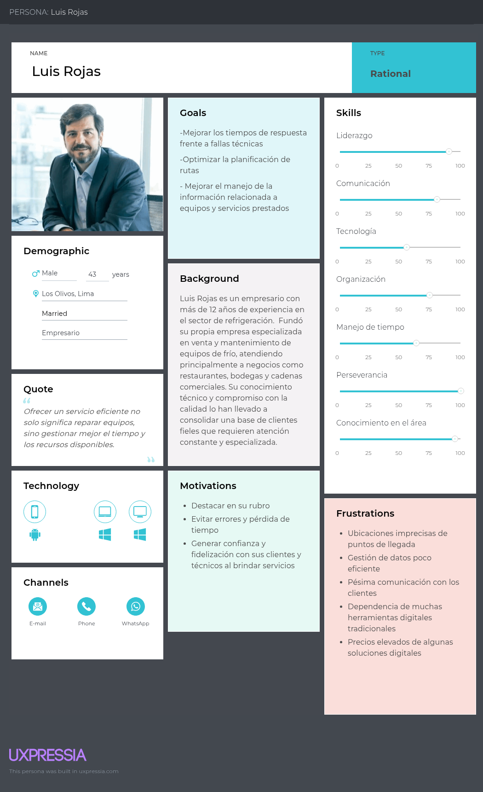
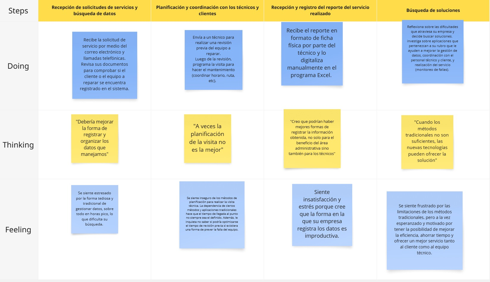

 <h1>Universidad Peruana de Ciencias Aplicadas</h1>
 
  <h2>Carrera: Ingeniería de Software</h2>
  <h2>Ciclo: 2025-20</h2>
 
  <h2>Curso: 1ASI0732 Diseño de Experimentos de Ingeniería de Software</h2>
  <h2>Sección: 2520</h2>
  <h2>Profesor: Juan Carlos Tinoco Licas</h2>
 
 <h1>Informe TB1</h1>
  <h2>Startup: IA: TechBear</h2>
  <h2>Producto: OsitoPolar</h2>
 
  <h2>Integrantes</h2>
<ul style="list-style: none;">
  <li><h3>U202220250 Hardie Alfonso Holguin Gamarra</h3></li>
  <li><h3>U20191E562 - Paulo Percy Quincho Gamarra</h3></li>
  <li><h3>U20211G499 - Angelo Stephano Moscoso Bejar</h3></li>
  <li><h3></h3></li>
  <li><h3></h3></li>
</ul>
 
   <h3>Abril 2025</h3>

## Registro de Versiones del Informe

| Versión | Fecha      | Autor               | Descripción de modificación                                     |
|---------|------------|----------------------|-----------------------------------------------------------------|
| 0.1     | xx/xx/xxxx | xxxxxxx       | Desarrollo del Capítulo 1 y sección 2.1                         |
| 0.2     | xx/xx/xxxx | xxxxxxx     | Desarrollo del Capítulo 2 (entrevistas, competidores, segmentación) |
| 0.2.1   | 18/09/2025 | Paulo Percy Quincho Gamarra        | Desarrollo del Capítulo 3 (To-Be, User Stories, Backlog)        |
| 0.3     | xx/xx/xxxx | xxxxxxx        | Desarrollo del Capítulo 4 (diseño UI/UX, arquitectura, BD)      |
| 0.4     | xx/xx/xxxx | xxxxxxx         | Desarrollo del Capítulo 5.1 y prototipado                       |
| 0.4.1   | xx/xx/xxxx | xxxxxxx     | Desarrollo del Capítulo 5.2.1 al 5.2.2                          |
| 0.4.2   | xx/xx/xxxx | xxxxxxx        | Desarrollo del Capítulo 5.2.3                                   |

## Project Report Collaboration Insights *(POR MODIFICAR POR CADA ENTREGA)
- **URL de la organización del proyecto:**  
  [https://github.com/Inteligencia-Artesanal-Aplicaciones-Web](https://github.com/Inteligencia-Artesanal-Aplicaciones-Web)

- **URL del repositorio del informe del proyecto:**  
  [https://github.com/Inteligencia-Artesanal-Aplicaciones-Web/upc-AppWeb-Inteligencia-Artesanal-Report_v2](https://github.com/Inteligencia-Artesanal-Aplicaciones-Web/upc-AppWeb-Inteligencia-Artesanal-Report_v2)

- **URL del repositorio del landing page del proyecto:**  
  [https://github.com/Inteligencia-Artesanal-Aplicaciones-Web/Landing-Page](https://github.com/Inteligencia-Artesanal-Aplicaciones-Web/Landing-Page)

  

- **URL del repositorio del frontend del proyecto:**  
  [https://github.com/Inteligencia-Artesanal-Aplicaciones-Web/OsitoPolar-Frontend](https://github.com/Inteligencia-Artesanal-Aplicaciones-Web/OsitoPolar-Frontend)

- **URL del repositorio del backend del proyecto:**  
  [https://github.com/Inteligencia-Artesanal-Aplicaciones-Web/OsitoPolar-Platform](https://github.com/Inteligencia-Artesanal-Aplicaciones-Web/OsitoPolar-Platform)

## Contenido

- [Student Outcome](#student-outcome)

- [Capítulo I: Introducción](#c1)
    - [1.1. Startup Profile](#11-startup-profile)
        - [1.1.1. Descripción de la Startup](#111-descripción-de-la-startup)
        - [1.1.2. Perfiles de integrantes del equipo](#112-perfiles-de-integrantes-del-equipo)
    - [1.2. Solution Profile](#12-solution-profile)
        - [1.2.1 Antecedentes y problemática](#121-antecedentes-y-problemática)
        - [1.2.2 Lean UX Process](#122-lean-ux-process)
            - [1.2.2.1. Lean UX Problem Statements](#1221-lean-ux-problem-statements)
            - [1.2.2.2. Lean UX Assumptions](#1222-lean-ux-assumptions)
            - [1.2.2.3. Lean UX Hypothesis Statements](#1223-lean-ux-hypothesis-statements)
            - [1.2.2.4. Lean UX Canvas](#1224-lean-ux-canvas)
    - [1.3. Segmentos objetivo](#13-segmentos-objetivo)

- [Capítulo II: Requirements Elicitation & Analysis](#c2)
    - [2.1. Competidores](#21-competidores)
        - [2.1.1. Análisis competitivo](#211-análisis-competitivo)
        - [2.1.2. Estrategias y tácticas frente a competidores](#212-estrategias-y-tácticas-frente-a-competidores)
    - [2.2. Entrevistas](#22-entrevistas)
        - [2.2.1. Diseño de entrevistas](#221-diseño-de-entrevistas)
        - [2.2.2. Registro de entrevistas](#222-registro-de-entrevistas)
        - [2.2.3. Análisis de entrevistas](#223-análisis-de-entrevistas)
    - [2.3. Needfinding](#23-needfinding)
        - [2.3.1. User Personas](#231-user-personas)
        - [2.3.2. User Task Matrix](#232-user-task-matrix)
        - [2.3.3. User Journey Mapping](#233-user-journey-mapping)
        - [2.3.4. Empathy Mapping](#234-empathy-mapping)
        - [2.3.5. As-is Scenario Mapping](#235-as-is-scenario-mapping)
    - [2.4. Ubiquitous Language](#24-ubiquitous-language)

- [Capítulo III: Requirements Specification](#c3)
    - [3.1. To-Be Scenario Mapping](#31-to-be-scenario-mapping)
    - [3.2. User Stories](#32-user-stories)
    - [3.3. Impact Mapping](#33-impact-mapping)
    - [3.4. Product Backlog](#34-product-backlog)

- [Capítulo IV: Product Design](#c4)
    - [4.1. Style Guidelines](#41-style-guidelines)
        - [4.1.1. General Style Guidelines](#411-general-style-guidelines)
        - [4.1.2. Web Style Guidelines](#412-web-style-guidelines)
    - [4.2. Information Architecture](#42-information-architecture)
        - [4.2.1. Organization Systems](#421-organization-systems)
        - [4.2.2. Labeling Systems](#422-labeling-systems)
        - [4.2.3. SEO Tags and Meta Tags](#423-seo-tags-and-meta-tags)
        - [4.2.4. Searching Systems](#424-searching-systems)
        - [4.2.5. Navigation Systems](#425-navigation-systems)
    - [4.3. Landing Page UI Design](#43-landing-page-ui-design)
        - [4.3.1. Landing Page Wireframe](#431-landing-page-wireframe)
        - [4.3.2. Landing Page Mock-up](#432-landing-page-mock-up)
    - [4.4. Web Applications UX/UI Design](#44-web-applications-uxui-design)
        - [4.4.1. Web Applications Wireframes](#441-web-applications-wireframes)
        - [4.4.2. Web Applications Wireflow Diagrams](#442-web-applications-wireflow-diagrams)
        - [4.4.3. Web Applications Mock-ups](#443-web-applications-mock-ups)
        - [4.4.4. Web Applications User Flow Diagrams](#444-web-applications-user-flow-diagrams)
    - [4.5. Web Applications Prototyping](#45-web-applications-prototyping)
    - [4.6. Domain-Driven Software Architecture](#46-domain-driven-software-architecture)
        - [4.6.1. Software Architecture Context Diagram](#461-software-architecture-context-diagram)
        - [4.6.2. Software Architecture Container Diagrams](#462-software-architecture-container-diagrams)
        - [4.6.3. Software Architecture Components Diagrams](#463-software-architecture-components-diagrams)
    - [4.7. Software Object-Oriented Design](#47-software-object-oriented-design)
        - [4.7.1. Class Diagrams](#471-class-diagrams)
        - [4.7.2. Class Dictionary](#472-class-dictionary)
    - [4.8. Database Design](#48-database-design)
        - [4.8.1. Database Diagram](#481-database-diagram)

- [Capítulo V: Product Implementation, Validation & Deployment](#c5)
    - [5.1. Software Configuration Management](#51-software-configuration-management)
        - [5.1.1. Software Development Environment Configuration](#511-software-development-environment-configuration)
        - [5.1.2. Source Code Management](#512-source-code-management)
        - [5.1.3. Source Code Style Guide & Conventions](#513-source-code-style-guide--conventions)
        - [5.1.4. Software Deployment Configuration](#514-software-deployment-configuration)
    - [5.2. Landing Page, Services & Applications Implementation](#52-landing-page-services--applications-implementation)
        - [5.2.1. Sprint 1](#521-sprint-1)
            - [5.2.1.1. Sprint Planning 1](#5211-sprint-planning-1)
            - [5.2.1.2. Aspect Leaders and Collaborators](#5212-aspect-leaders-and-collaborators)
            - [5.2.1.3. Sprint Backlog 1](#5213-sprint-backlog-1)
            - [5.2.1.4. Development Evidence for Sprint Review](#5214-development-evidence-for-sprint-review)
            - [5.2.1.5. Execution Evidence for Sprint Review](#5215-execution-evidence-for-sprint-review)
            - [5.2.1.6. Services Documentation Evidence for Sprint Review](#5216-services-documentation-evidence-for-sprint-review)
            - [5.2.1.7. Software Deployment Evidence for Sprint Review](#5217-software-deployment-evidence-for-sprint-review)
            - [5.2.1.8. Team Collaboration Insights during Sprint](#5218-team-collaboration-insights-during-sprint)
        - [5.2.2. Sprint 2](#522-sprint-2)
            - [5.2.2.1. Sprint Planning 2](#5221-sprint-planning-2)
            - [5.2.2.2. Aspect Leaders and Collaborators](#5222-aspect-leaders-and-collaborators)
            - [5.2.2.3. Sprint Backlog 2](#5223-sprint-backlog-2)
            - [5.2.2.4. Development Evidence for Sprint Review](#5224-development-evidence-for-sprint-review)
            - [5.2.2.5. Execution Evidence for Sprint Review](#5225-execution-evidence-for-sprint-review)
            - [5.2.2.6. Services Documentation Evidence for Sprint Review](#5226-services-documentation-evidence-for-sprint-review)
            - [5.2.2.7. Software Deployment Evidence for Sprint Review](#5227-software-deployment-evidence-for-sprint-review)
            - [5.2.2.8. Team Collaboration Insights during Sprint](#5228-team-collaboration-insights-during-sprint)
        - [5.2.3. Sprint 3](#523-sprint-3)
            - [5.2.3.1. Sprint Planning 3](#5231-sprint-planning-3)
            - [5.2.3.2. Aspect Leaders and Collaborators](#5232-aspect-leaders-and-collaborators)
            - [5.2.3.3. Sprint Backlog 3](#5233-sprint-backlog-3)
            - [5.2.3.4. Development Evidence for Sprint Review](#5234-development-evidence-for-sprint-review)
            - [5.2.3.5. Execution Evidence for Sprint Review](#5235-execution-evidence-for-sprint-review)
            - [5.2.3.6. Services Documentation Evidence for Sprint Review](#5236-services-documentation-evidence-for-sprint-review)
            - [5.2.3.7. Software Deployment Evidence for Sprint Review](#5237-software-deployment-evidence-for-sprint-review)
            - [5.2.3.8. Team Collaboration Insights during Sprint](#5238-team-collaboration-insights-during-sprint)
        - [5.2.4. Sprint 4](#524-sprint-4)
            - [5.2.4.1. Sprint Planning 4](#5241-sprint-planning-4)
            - [5.2.4.2. Aspect Leaders and Collaborators](#5242-aspect-leaders-and-collaborators)
            - [5.2.4.3. Sprint Backlog 4](#5243-sprint-backlog-4)
            - [5.2.4.4. Development Evidence for Sprint Review](#5244-development-evidence-for-sprint-review)
            - [5.2.4.5. Execution Evidence for Sprint Review](#5245-execution-evidence-for-sprint-review)
            - [5.2.4.6. Services Documentation Evidence for Sprint Review](#5246-services-documentation-evidence-for-sprint-review)
            - [5.2.4.7. Software Deployment Evidence for Sprint Review](#5247-software-deployment-evidence-for-sprint-review)
            - [5.2.4.8. Team Collaboration Insights during Sprint](#5248-team-collaboration-insights-during-sprint)
    - [5.3. Validation Interviews](#53-validation-interviews)
        - [5.3.1. Diseño de Entrevistas](#531-diseño-de-entrevistas)
        - [5.3.2. Registro de Entrevistas](#532-registro-de-entrevistas)
        - [5.3.3. Evaluaciones según heurísticas](#533-evaluaciones-según-heurísticas)
    - [5.4. Video About-the-Product](#54-video-about-the-product)
- [Conclusiones](#conclusiones)
- [Bibliografía](#bibliografía)
- [Anexos](#anexos)

## Student Outcome
El curso contribuye al cumplimiento del Student Outcome ABET:

**ABET – EAC - Student Outcome 4**

**Criterio**: *La capacidad de reconocer responsabilidades éticas y 
profesionales en situaciones de ingeniería y hacer juicios informados, que deben 
considerar el impacto de las soluciones de ingeniería en contextos globales, económicos, 
ambientales y sociales.*

En el siguiente cuadro se describe las acciones realizadas y enunciados de
conclusiones por parte del grupo, que permiten sustentar el haber alcanzado el logro
del ABET – EAC - Student Outcome 4.

# Student Outcome

| **Criterio específico** | **Acciones realizadas** | **Conclusiones** |
|--------------------------|--------------------------|------------------|
| Reconoce responsabilidad ética y profesional en situaciones de ingeniería de software | **TB1: Paulo Percy Quincho Gamarra (U20191E562)**   Durante el proyecto demostré responsabilidad al cumplir con las tareas asignadas a tiempo, asegurando que cada entrega refleje buenas prácticas de programación y comunicación clara con el equipo. | **TB1: Paulo Percy Quincho Gamarra (U20191E562)**   La participación permitió reforzar la importancia de la ética profesional en el desarrollo de software, mostrando que cumplir con los compromisos fortalece la confianza del equipo y garantiza resultados de calidad. |
| Emite juicios informados considerando el impacto de las soluciones de ingeniería de software en contextos globales, económicos, ambientales y sociales | **TB1: Paulo Percy Quincho Gamarra (U20191E562)**   Analicé los requerimientos de la aplicación evaluando su impacto en la reducción de pérdidas económicas y en la optimización del consumo energético de los negocios dependientes de la refrigeración. | **TB1: Paulo Percy Quincho Gamarra (U20191E562)**   Reconocí que las decisiones técnicas en software influyen directamente en la sostenibilidad y en la eficiencia de los procesos de negocio, reforzando la necesidad de diseñar soluciones con responsabilidad social y económica. |

# Capitulo 1: Introducción

## 1.1 Startup Profile

### 1.1.1 Descripción de la Startup

OsitoPolar es una aplicación web orientada a mejorar la gestión y el mantenimiento de equipos de congelación en negocios que dependen críticamente del frío, como supermercados, minimarkets, laboratorios, restaurantes y empresas del sector alimentario o farmacéutico. La solución conecta a estos negocios con técnicos y proveedores especializados en refrigeración, permitiendo una gestión integral, preventiva y automatizada de sus sistemas de congelación.

La plataforma ofrece funcionalidades clave como monitoreo en tiempo real de temperatura, consumo energético y tiempo de uso, generación de reportes técnicos, alertas automatizadas por fallas, historial de rendimiento y programación inteligente de mantenimientos. Estas herramientas están diseñadas para ayudar a negocios que dependen del uso de sistemas de refrigeración, técnicos especializados en refrigeración y proveedores de equipos a optimizar sus operaciones, evitar pérdidas económicas por fallas inesperadas y mantener un registro completo del estado y uso de sus equipos.

Misión: Nuestra misión en OsitoPolar es proporcionar una solución tecnológica inteligente que permita a los negocios proteger su inventario y optimizar la gestión de sus equipos de refrigeración, ofreciendo al mismo tiempo herramientas especializadas para mejorar la eficiencia operativa de los técnicos y proveedores del sector.

Visión: Queremos ser la empresa lider en gestión y mantenimiento de equipos de refrigeración, empezando por Lima y prontamente expandirnos a más lugares del Perú.

### 1.1.2 Perfiles de integrantes del equipo

| **Integrante** | **Joseph Pablo Rodriguez Parco** |
|----------------|---------------------------------|
| **Código del Estudiante** | U202223286 |
| **Carrera** | Ingeniería de Software |
| **Descripción** | Estudiante de Ingeniería de Software con afinidad por proyectos Web, Interesado en ML, Data Science y aprender por sobre todas las cosas. |
| **Foto** | |

---

| **Integrante** | **Hardie Alfonso Holguín Gamarra** |
|----------------|----------------------------------|
| **Código del Estudiante** | U202220250 |
| **Carrera** | Ingeniería de Software |
| **Descripción** | Estudiante de Ingeniería de Software en la Universidad Peruana de Ciencias Aplicadas (UPC), con una sólida orientación hacia la tecnología y el aprendizaje continuo. Cuento con experiencia en el desarrollo de aplicaciones modernas, seguras y escalables, integrando frameworks y herramientas que permiten optimizar procesos y fomentar la innovación. Me caracterizo por asumir nuevos desafíos que potencien tanto mi crecimiento profesional como el perfeccionamiento de mis habilidades técnicas. |
| **Foto** |  |

---

| **Integrante** | **Paulo Percy Quincho Gamarra** |
|----------------|----------------------------------|
| **Código del Estudiante** | U20191E562 |
| **Carrera** | Ingeniería de Software |
| **Descripción** | Conocimiento en python, javascript, typescript, sql y nosql. Disfruto tener mis trabajos lo que mejor posible y una buena comunicación con el grupo |
| **Foto** |  |

---

| **Integrante** | **Angelo Stephano Moscoso Bejar** |
|----------------|----------------------------------|
| **Código del Estudiante** | U20211G499 |
| **Carrera** | Ingeniería de Software |
| **Descripción** | Tengo 21 años estoy estudiando actualmente en la Univeridad Peruana de Ciencias Aplicadas. Me ha interasado mucho la creación de paginas web para diversos objetivos. Manejo algunos lenguajes de programación como javascript, C++, C+, Python, entre otros. Considero que tengo las habilidades de comunicación efectiva, organización, proactividad, resolución de problemas, entre otras.|
| **Foto** |  |

---

## 1.2 Solution Profile

### 1.2.1 Antecedentes y Problematica

| Las 5Ws y 2Hs | Pregunta                                           | Descripción                                                                                                                                                                                                                                                                                                                                                                                    |
|---------------|----------------------------------------------------|------------------------------------------------------------------------------------------------------------------------------------------------------------------------------------------------------------------------------------------------------------------------------------------------------------------------------------------------------------------------------------------------|
| What?         | ¿Cuál es el problema?                              | Actualmente, los negocios que dependen de equipos de congelación enfrentan grandes desafíos operativos ante fallas inesperadas o falta de mantenimiento. Las fallas térmicas, los altos consumos energéticos no detectados a tiempo y la ausencia de un monitoreo constante pueden derivar en la pérdida de productos, reducción de la calidad del servicio y pérdidas económicas importantes. |
| When?         | ¿Cuándo sucede este problema?                      | Estas situaciones ocurren principalmente durante horarios de operación continua, especialmente en momentos donde no hay personal técnico disponible de forma inmediata, o cuando no se ha realizado un seguimiento adecuado del estado del equipo a lo largo del tiempo.                                                                                                                       |
| Where?        | ¿Dónde se produce este suceso?                     | El problema afecta a negocios ubicados en todo el país, principalmente en Lima, donde la cadena de frío es esencial en sectores como alimentación, medicina y distribución. También impacta a empresas proveedoras de refrigeración que atienden múltiples clientes sin una plataforma centralizada de control.                                                                                |
| Who?          | ¿Quiénes están involucrados?                       | Están involucrados tanto los administradores y dueños de negocios que utilizan congeladoras como los técnicos y empresas proveedoras de servicios de refrigeración.                                                                                                                                                                                                                            |
| Why?          | ¿Cuál es la causa del problema?                    | La causa principal es la falta de soluciones tecnológicas accesibles que integren monitoreo, alertas, historial y programación automática en un solo lugar. Muchas empresas aún dependen de sistemas manuales o no tienen control de lo que sucede con sus equipos hasta que ocurre una falla crítica.                                                                                         |
| How?          | ¿Qué llevó a la persona a llegar a esta situación? | Lo que llevó a los negocios y técnicos a este punto ha sido la acumulación de imprevistos y la falta de digitalización en el mantenimiento preventivo, que genera una alta dependencia de intervenciones reactivas en vez de planificadas. Esto incrementa los costos, los tiempos de respuesta y el desgaste operativo.                                                                       |
| How much?     | ¿Cuánto es el impacto financiero?                  | Aunque el impacto económico varía según el tipo de negocio, la pérdida por una falla en un equipo de refrigeración puede ascender desde cientos hasta miles de soles en productos dañados, sin considerar el tiempo operativo perdido, la pérdida de clientes y la inversión en reparación o reposición de equipos.                                                                            |

### 1.2.2 Lean UX Process

#### 1.2.2.1 Lean UX Problem Statements

El estado actual de la industria de la refrigeración comercial y técnica enfrenta importantes desafíos relacionados con la gestión, el mantenimiento y la trazabilidad de los equipos de congelación. Negocios que dependen críticamente del frío —como supermercados, minimarkets, laboratorios, restaurantes y empresas del sector alimentario o farmacéutico— aún lidian con la falta de monitoreo en tiempo real y con procesos de mantenimiento reactivos. Esto genera pérdidas económicas, ineficiencia energética y riesgos para el inventario.

Lo que las soluciones actuales no logran abordar es la necesidad de una plataforma confiable y automatizada que permita una gestión centralizada, predictiva y transparente tanto para los negocios como para los técnicos y proveedores de refrigeración. La falta de historial técnico accesible, reportes detallados y alertas preventivas limita la capacidad de respuesta ante fallas y deteriora la calidad del servicio técnico ofrecido.

**OsitoPolar** cierra esta brecha al ofrecer una solución tecnológica integral que conecta negocios con técnicos especializados, brindando funcionalidades como monitoreo en tiempo real de temperatura y consumo, programación inteligente de mantenimientos, alertas por fallas, reportes automáticos y trazabilidad completa de cada equipo. Además, proporciona a los proveedores de servicios un módulo para visualizar y gestionar eficientemente los equipos que atienden, organizar visitas y acceder al historial técnico de manera ágil.

Nuestro enfoque inicial está en los negocios de Lima que necesitan asegurar el funcionamiento óptimo de sus sistemas de congelación, así como en los proveedores que buscan profesionalizar y escalar su servicio con herramientas digitales modernas.

Sabremos que hemos tenido éxito cuando observemos una reducción en fallas imprevistas, una optimización del consumo energético, mayor eficiencia operativa por parte de los técnicos especializados y un incremento en la satisfacción de los clientes finales. Esto se evidenciará en la continuidad del servicio y en la fidelización de los negocios que dependen de sistemas de refrigeración, técnicos especializados y proveedores de equipos que utilizan la plataforma.

#### 1.2.2.2 Lean UX Assumption

# Business Outcomes

- Aumentar en al menos un 15% la cantidad de negocios que dependen del uso de sistemas de refrigeración, técnicos especializados en refrigeración y proveedores de equipos activos dentro de la aplicación.

- Lograr una mayor visibilidad de la plataforma OsitoPolar a través de redes sociales, especialmente entre negocios de alimentos y técnicos de refrigeración.

- Generar confianza y seguridad en estos actores respecto al monitoreo y mantenimiento automatizado de sus sistemas de refrigeración.

- Mantener informados a los usuarios finales —negocios, técnicos y proveedores— sobre incidentes recientes como fallas térmicas, cortes de energía o uso irregular de los equipos.

- Alcanzar una base sólida de clientes dispuestos a pagar por una membresía premium que incluya mantenimiento predictivo, reportes personalizados y soporte técnico prioritario.

- Establecer alianzas estratégicas con plataformas como Google Maps o servicios de geolocalización para ampliar el alcance de cobertura y optimizar la programación de visitas técnicas.

- Fomentar la participación activa de negocios, técnicos y proveedores mediante encuestas, valoraciones de técnicos y comentarios sobre el desempeño de los equipos.

- Diseñar una interfaz limpia, simple e intuitiva que garantice una experiencia fluida y atractiva para nuevos usuarios del sector, evitando la sobrecarga visual o de funcionalidades.

- Implementar inteligencia artificial que permita trazar estrategias de mantenimiento inteligente, rutas eficientes para los técnicos y recomendaciones proactivas ante posibles fallos.

# User Outcomes

## ¿Quién será nuestro usuario?

- **Negocios que dependen críticamente del uso de sistemas de refrigeración** como supermercados, minimarkets, restaurantes, laboratorios y empresas del rubro alimentario y farmacéutico.
- **Técnicos especializados en refrigeración** que brindan mantenimiento a dichos sistemas.
- **Proveedores de equipos de refrigeración** que desean ofrecer un servicio posventa más eficiente.

## ¿Dónde encaja nuestro producto en su vida?

- En situaciones donde los negocios necesitan garantizar la continuidad operativa de sus equipos de frío, evitando pérdidas económicas por fallas imprevistas.
- En el día a día de técnicos de refrigeración que deben gestionar múltiples clientes, visitas y mantenimientos.
- En la operación diaria de los negocios que necesitan registros y reportes precisos del desempeño de sus sistemas de refrigeración.

## ¿Qué problemas tiene nuestro producto y cómo se pueden resolver?

- El principal desafío es asegurar que los datos de monitoreo (temperatura, consumo energético, fallas, etc.) sean precisos, actualizados y confiables.
    -   Solución: Se debe integrar sensores calibrados y sistemas de verificación automática que validen las lecturas antes de almacenarlas.

- Otro problema puede ser la adopción inicial de la plataforma por parte de negocios que dependen del uso de sistemas de refrigeración, técnicos especializados en refrigeración y proveedores de equipos que no están familiarizados con la tecnología.
    - Solución: Esto se abordará con una interfaz sencilla, explicaciones paso a paso y soporte técnico accesible.

## ¿Cómo y Cuándo es usado nuestro producto?

- Se accede desde la aplicación web, tanto desde computadoras como dispositivos móviles.
- Se utiliza diariamente para monitorear el estado de los equipos de frío, recibir alertas, programar mantenimientos o revisar el historial técnico.
- También se activa automáticamente en segundo plano cuando se integran sensores de monitoreo con la plataforma.

## ¿Qué problemas tiene nuestro producto?

- En sus etapas iniciales, puede carecer de ciertas integraciones con hardware de terceros.
- Algunos negocios que dependen del uso de sistemas de refrigeración, técnicos especializados o proveedores de equipos pueden requerir capacitación para comprender todas las funcionalidades avanzadas.
- También podría haber desafíos para que los técnicos adopten el uso digital en lugar del método tradicional.

## ¿Qué características son importantes para la app?

- Monitoreo en tiempo real de temperatura, consumo energético y tiempo de uso.
- Alertas automáticas por fallas detectadas en los equipos.
- Historial técnico completo con reportes exportables en PDF.
- Calendario de mantenimiento preventivo con notificaciones programadas.
- Módulo exclusivo para técnicos con gestión de visitas y clientes.
- Soporte técnico inteligente y recomendaciones predictivas mediante IA.
- Registro de múltiples ubicaciones y usuarios con distintos roles.
- Interfaz intuitiva y minimalista para garantizar fácil adopción.

## ¿Cómo debe verse nuestro producto y cómo comportarse?

- **Interfaz amigable y confiable**: Negocios que dependen del uso de sistemas de refrigeración, así como, técnicos especializados y proveedores de equipos deben sentirse seguros al usar la aplicación. La interfaz debe ser clara, ordenada y fácil de navegar, sin sobrecargar de información, con gráficos e indicadores intuitivos.
- **Diseño centrado en tareas críticas**: Desde el primer acceso, negocios que dependen del uso de sistemas de refrigeración, técnicos especializados y proveedores de equipos deben poder ver si hay fallas, cuándo es la próxima visita técnica, y acceder rápidamente a los reportes y al historial de sus equipos.
- **Accesibilidad multiplataforma**: Disponible en web y móvil, adaptable para quienes trabajan tanto en oficina como en campo. Notificaciones inmediatas ante cualquier problema detectado.
- **Simplicidad**: La app debe permitirles gestionar sus negocios, equipos en riesgo y visitas programadas, todo desde un panel centralizado. También pueden agendar visitas y generar reportes técnicos en segundos.

## ¿Qué valor busca el cliente?

- **Gestión técnica simplificada**: Los proveedores y técnicos buscan dejar de ser reactivos. OsitoPolar los vuelve proactivos con mantenimiento predictivo, historiales claros y clientes organizados.
- **Seguridad operativa y cero sorpresas**: Los negocios quieren evitar pérdidas por fallas en frío. OsitoPolar les da monitoreo constante, alertas automáticas y control total sobre sus equipos.
- **Eficiencia energética y trazabilidad**: Los dueños quieren saber si sus equipos consumen de más, si están rindiendo mal, o si un componente ya debería ser reemplazado. El sistema lo identifica antes que ocurra el fallo.

## ¿Qué beneficios adicionales obtendrá el cliente?

- Visibilidad total del estado de sus equipos, desde cualquier lugar, en cualquier momento.
- Soporte técnico más ágil gracias al historial previo y alertas automáticas.
- Menores costos operativos gracias a mantenimientos a tiempo y mayor eficiencia energética.
- Reportes personalizados y exportables.
- Automatización de visitas técnicas cuando se detectan patrones de falla.

## ¿Cómo atraeremos usuarios?

- **Marketing dirigido a nichos clave**: Supermercados, restaurantes y empresas de frío serán contactados directamente mediante LinkedIn, correos y llamadas estratégicas.
- **Alianzas con proveedores de equipos**: Trabajaremos con empresas que venden congeladoras o cámaras frigoríficas para que incluyan OsitoPolar en sus paquetes posventa.
- **Prueba gratuita de versiones de pago**: Un modelo de 14 días gratis con monitoreo limitado para mostrar el valor de la plataforma en tiempo real.

## ¿Cómo generaremos ingresos?

- **Suscripción mensual de negocios**: Por el uso de la plataforma, según número de equipos, tipo de reportes y funcionalidades.
- **Modelo freemium**: Habrá una versión gratuita que brindará algunas funciones limitadas, pero con anuncios, lo que generará ingresos adicionales.
- **Publicidad dirigida (opcional)**: Marcas de refrigeración podrían pagar por visibilidad dentro de la plataforma si se llega a una masa crítica de técnicos y negocios.

## ¿Cuál es nuestra competencia y cómo la superamos?

- **Competencia**: Las principales competidoras son aplicaciones relacionadas con la gestión de datos y orientada al servicio técnico de mantenimiento de equipos de refrigeración.
- **Nuestra ventaja**: OsitoPolar fue diseñado exclusivamente para negocios que dependen de equipos de frío. No somos una herramienta genérica, somos expertos en el nicho. No solo registramos visitas o mantenimientos, también detectamos anomalías en tiempo real, generamos alertas y automatizamos acciones.

## ¿Cuál es nuestro mayor riesgo?

- **Adopción lenta por parte del personal tradicional**: Algunos proveedores aún dependen de agendas físicas o Excel y podrían resistirse al cambio.
- **Falta de adopción inicial**: La dificultad para convencer a los negocios que dependen del uso de sistemas de refrigeración, técnicos especializados y proveedores de equipos de que la app es útil y confiable puede retrasar su adopción.
- **Desconfianza en la precisión de los sensores**: Si los datos no son confiables, la plataforma pierde valor

## ¿Cómo lo resolveremos?

- **Algoritmos de validación**: Implementaremos algoritmos de IA que verifiquen la información y filtren los reportes ambiguos o antiguos, garantizando solo datos confiables y actuales.
- **Capacitación y soporte**: Para resolver la falta de adopción, ofreceremos tutoriales interactivos, videos explicativos y soporte técnico accesible para que negocios que dependen del uso de sistemas de refrigeración, técnicos especializados y proveedores de equipos se familiaricen con las funciones.
- **Estrategia progresiva de integraciones**: Comenzaremos con los equipos más usados y luego ampliaremos compatibilidad mediante APIs y alianzas con fabricantes.
- **Sensores certificados**: Solo se integrarán sensores probados.

#### 1.2.2.2 Lean UX Hypothesis Statements

**Hipótesis 1: Eficiencia operativa y reducción de fallas inesperadas**

Creemos que al ofrecer una plataforma integral que unifique todas las funciones de monitoreo, mantenimiento y gestión técnica de equipos de refrigeración, aumentaremos la eficiencia operativa de los negocios y proveedores del sector, reduciendo la complejidad y el riesgo de fallas inesperadas.  
Sabremos que estamos en lo correcto cuando veamos un aumento en la cantidad de negocios que reportan menos incidencias por fallas térmicas, así como una mejora en la planificación de sus mantenimientos preventivos.

---

**Hipótesis 2: Control de pérdidas operativas y consumo energético**

Creemos que el control de pérdidas operativas y el consumo energético es una prioridad para los negocios que dependen del uso de sistemas de refrigeración, técnicos especializados y proveedores de equipos; por lo tanto, al proporcionar herramientas de análisis de rendimiento y alertas automatizadas, mejoraremos su capacidad para actuar de manera preventiva y reducir costos innecesarios.  
Sabremos que estamos en lo correcto cuando observemos una adopción creciente de nuestras funcionalidades de monitoreo en tiempo real y reportes técnicos, así como una disminución en las pérdidas económicas por interrupciones del sistema de refrigeración.

---

**Hipótesis 3: Mejora en el servicio técnico personalizado y predictivo**

Creemos que al proporcionar reportes técnicos automáticos, históricos de uso y rendimiento por equipo, permitiremos a los técnicos y empresas proveedoras ofrecer un servicio personalizado y predictivo, mejorando la calidad del soporte brindado a sus clientes.  
Sabremos que estamos en lo correcto cuando recibamos retroalimentación positiva de técnicos sobre la utilidad de los reportes y el historial, y cuando sus clientes reporten mayor satisfacción con la rapidez y eficacia del servicio técnico.

---

**Hipótesis 4: Trazabilidad y protección de la información técnica**

Creemos que al garantizar la trazabilidad de todas las acciones realizadas sobre cada unidad de refrigeración, así como la protección de la información técnica en la plataforma, construiremos confianza entre negocios y proveedores de servicios.  

---

**Hipótesis 5: Transición a una gestión moderna de refrigeración**

Creemos que al ofrecer una solución digital intuitiva y especializada tanto para negocios como para técnicos, facilitaremos la transición hacia una gestión moderna de refrigeración, minimizando la curva de aprendizaje.  
Sabremos que estamos en lo correcto cuando observemos una rápida adopción de nuestra plataforma, baja tasa de abandono y una mayor frecuencia de uso de las funcionalidades clave por parte de usuarios nuevos y recurrentes.

#### 1.2.2.4 Lean UX Canvas

El presente Lean UX Canvas se ha desarrollado para ofrecer una visión estratégica y concisa de la solución OsitoPolar. Este marco nos permite alinear rápidamente los objetivos de negocio con las necesidades de nuestros usuarios y las hipótesis clave que guían nuestro desarrollo.
A través de este lienzo, hemos desglosado el problema central que enfrentan los negocios que dependen de equipos de refrigeración, definido las soluciones propuestas y anticipado los resultados que esperamos alcanzar.
Asimismo, hemos identificado a nuestros usuarios clave y sus beneficios, y hemos establecido una serie de hipótesis que nos permitirán validar nuestro enfoque con la mínima inversión de tiempo y recursos posible, asegurando que cada paso que demos esté centrado en generar valor real.

<figure style="page-break-inside: avoid; text-align: center;">
  
  <figcaption style="font-size: 0.9em; color: #555;">
    <strong>Figura 1:</strong> Lean UX Canvas.
  </figcaption>
</figure>

## 1.3 Segmentos objetivos

**Segmento Objetivo #1: Negocios que utilizan equipos de refrigeración**

**Aspectos demográficos:**
- **Tipo de negocio**: Pequeñas, medianas y grandes empresas
- **Rubro**: Alimentario, farmacéutico, restauración y comercio minorista
- **Nivel de necesidad**: Alta dependencia de sistemas de refrigeración

**Aspectos geográficos:**
- **Nacionalidad**: Peruana
- **Zona geográfica**: Urbana
- **Departamento**: Lima (con proyección de expansión nacional)

**Aspectos psicográficos:**
- Empresas que buscan evitar pérdidas económicas por fallas en refrigeración.
- Negocios que requieren control eficiente del consumo energético.
- Administradores interesados en implementar tecnología para optimizar sus operaciones y mantener la calidad del inventario.

---

**Segmento Objetivo #2: Empresas proveedoras de servicios y equipos de refrigeración**

**Aspectos demográficos:**
- **Tipo de empresa**: Técnicos independientes, PYMES y proveedores especializados en refrigeración.
- **Rol**: Técnicos de mantenimiento, instaladores, empresas de soporte técnico.

**Aspectos geográficos:**
- **Nacionalidad**: Peruana
- **Zona geográfica**: Urbana
- **Departamento**: Lima (con visión de expansión a nivel nacional)

**Aspectos psicográficos:**
- Técnicos que desean organizar sus visitas de forma eficiente y centralizada.
- Empresas que buscan mejorar la trazabilidad de sus servicios y ofrecer reportes automáticos.
- Profesionales que desean brindar un servicio más personalizado y predictivo a sus clientes.

## Capítulo II: Requirements Elicitation & Analysis 

### 2.1. Competidores

**Competidor 1: ServiceTitan**
ServiceTitan es una plataforma de gestión de servicios basada en la nube que ofrece soluciones de software para empresas de servicios, incluidos técnicos de HVAC, fontaneros y electricistas. Proporciona funcionalidades de programación, gestión de trabajos, facturación y más. Esta plataforma es conocida por su facilidad de uso y por ayudar a las empresas a optimizar sus operaciones de servicio técnico en tiempo real.

---

**Competidor 2: CoolMaster**
CoolMaster es una solución de software diseñada específicamente para el sector de refrigeración comercial. Ofrece monitoreo remoto de sistemas de refrigeración, alertas tempranas de fallas y gestión eficiente del consumo energético. La plataforma está orientada a optimizar la eficiencia operativa de negocios que dependen críticamente de sistemas de frío, como supermercados y centros de distribución.

---

**Competidor 3: TempGenius**
TempGenius es un software de monitoreo de temperatura y humedad en tiempo real para diversas industrias, incluida la de la refrigeración comercial. Permite a los usuarios realizar un seguimiento de sus equipos de refrigeración mediante sensores conectados a la nube, generar reportes y recibir alertas automáticas por variaciones en los niveles de temperatura. Su principal enfoque es mejorar la visibilidad y control de las operaciones de refrigeración para evitar pérdidas económicas.

#### 2.1.1. Análisis competitivo

<table> 
  <tr>
    <th colspan="7"> Competitive Analysis Landscape </th>
  </tr>
  <tr>
    <td colspan="2" rowspan="2">¿Por qué llevar acabo este análisis? </td>
    <td colspan="5"> Pregunta </td>
  </tr>
  <tr>
    <td colspan="5"> Respuesta </td>
  </tr>
  <tr>
    <td colspan="2"> Productos </td>
    <td> OsitoPolar </td>
    <td> ServiceTitan </td>
    <td> CoolMaster </td>
    <td> TempGenius </td>
  </tr>
  <tr>
    <td rowspan="2">Perfil</td>
    <td>Overview</td>
    <td> OsitoPolar es una plataforma integral de monitoreo y gestión para sistemas de refrigeración, que conecta negocios con técnicos especializados. Ofrece monitoreo en tiempo real, alertas automáticas, mantenimiento preventivo, y trazabilidad de cada equipo. </td>
    <td> ServiceTitan es una plataforma de gestión de servicios basada en la nube que ofrece soluciones de software para empresas de servicios, incluidos técnicos de HVAC, fontaneros y electricistas. </td>
    <td> CoolMaster es una solución de software diseñada específicamente para el sector de refrigeración comercial. Ofrece monitoreo remoto de sistemas de refrigeración, alertas preventivas y gestión energética. </td>
    <td> TempGenius es un software de monitoreo de temperatura y humedad en tiempo real para diversas industrias, incluida la refrigeración comercial. Permite a los usuarios gestionar y recibir alertas automáticas sobre sus equipos. </td>
  </tr>
  <tr>
    <td>Ventaja competitiva ¿Qué valor ofrece a los clientes?</td>
    <td> Ofrece una solución automatizada y centralizada para negocios que necesitan monitorear y gestionar sus equipos de refrigeración. Permite a los técnicos optimizar sus visitas y el mantenimiento preventivo, mejorando la eficiencia operativa. </td>
    <td> Ofrece una plataforma todo-en-uno para la gestión de servicios con características como la programación de citas, facturación y seguimiento en tiempo real de proyectos. </td>
    <td> Ofrece soluciones específicas para la gestión de sistemas de refrigeración, con funcionalidades avanzadas de monitoreo, alertas y análisis de consumo energético. </td>
    <td> Ofrece monitoreo preciso en tiempo real de la temperatura y humedad, con alertas automáticas, y un enfoque especial en la fiabilidad y precisión de los datos. </td>
  </tr>
  <tr>
    <td rowspan="2">Perfil de Marketing</td>
    <td> Mercado Objetivo </td>
    <td> Negocios que dependen de sistemas de refrigeración, como supermercados, minimarkets, laboratorios, restaurantes, entre otros. También incluye técnicos de refrigeración y proveedores de equipos. </td>
    <td> Empresas de servicios como HVAC, fontaneros, electricistas, y otros proveedores de servicios técnicos. </td>
    <td> Negocios que dependen de sistemas de refrigeración como supermercados, laboratorios, restaurantes y otros en el sector alimentario y farmacéutico. </td>
    <td> Usuarios de diversas industrias, especialmente en áreas que requieren monitoreo continuo de temperatura y humedad, como el sector alimentario y farmacéutico. </td>
  </tr>
  <tr>
    <td> Estrategias de Marketing </td>
    <td> Marketing digital, colaboraciones estratégicas con empresas del sector alimentario y farmacéutico, demostraciones gratuitas y promociones en redes sociales. </td>
    <td> Marketing digital, colaboraciones con empresas de servicios y promoción en plataformas de negocio. </td>
    <td> Marketing dirigido a negocios en el sector alimentario y farmacéutico, con énfasis en la reducción de fallas y el ahorro energético. </td>
    <td> Marketing en redes sociales, promociones para nuevos usuarios y colaboraciones con industrias reguladas como la farmacéutica y alimentaria. </td>
  </tr>
  <tr>
    <td rowspan="3">Perfil de Producto</td>
    <td> Productos & Servicios </td>
    <td> Gestión de equipos de refrigeración en tiempo real, alertas automáticas, mantenimiento preventivo, reportes técnicos automáticos y trazabilidad de cada equipo. </td>
    <td> Plataforma de gestión de servicios que incluye programación de citas, gestión de personal, facturación, y seguimiento de proyectos en tiempo real. </td>
    <td> Plataforma de monitoreo y gestión de sistemas de refrigeración, con alertas preventivas, informes automáticos y análisis de rendimiento energético. </td>
    <td> Plataforma de monitoreo de temperatura y humedad en tiempo real, con alertas automáticas, reportes detallados y gestión de datos históricos. </td>
  </tr>
  <tr>
    <td> Precios & Costos </td>
    <td> Modelo basado en comisiones bajas por cada reserva o cita pagada para negocios, con una versión gratuita para usuarios. </td>
    <td> Suscripción mensual o anual, con tarifas adicionales por características avanzadas o soporte personalizado. </td>
    <td> Varía según el plan y características seleccionadas, con opciones para negocios grandes o pequeños. </td>
    <td> Varía según la cantidad de equipos monitoreados y las características seleccionadas, con modelos de suscripción mensual o anual. </td>
  </tr>
  <tr> 
    <td>Canales de distribución (Web y/o Móvil)</td>
    <td> Plataforma en línea y aplicación móvil disponible para dispositivos iOS y Android. </td>
    <td> Plataforma en línea y aplicación móvil disponible para dispositivos iOS y Android. </td>
    <td> Plataforma en línea y aplicación móvil. </td>
    <td> Aplicación móvil disponible en tiendas de aplicaciones y plataforma en línea. </td>
  </tr>
  <tr>
    <td rowspan="4"> Análisis SWOT </td>
    <td> Fortalezas </td>
    <td> Monitoreo en tiempo real, alertas automáticas y mantenimiento preventivo para evitar fallas críticas. Función de trazabilidad completa de los equipos. </td>
    <td> Amplia funcionalidad para gestión de servicios y seguimiento en tiempo real de proyectos. </td>
    <td> Especialización en el monitoreo y la gestión de sistemas de refrigeración, con enfoque en ahorro energético. </td>
    <td> Precisión en el monitoreo de temperatura y humedad, con alertas automáticas y un enfoque flexible en diferentes industrias. </td>
  </tr>
  <tr>
    <td> Debilidades </td>
    <td> Dependencia de la adopción inicial por parte de los usuarios, lo que podría afectar la expansión. </td>
    <td> Puede ser más complejo de usar para pequeñas empresas sin experiencia en gestión de software. </td>
    <td> Enfoque limitado al sector de refrigeración, lo que puede dificultar la expansión a otros mercados. </td>
    <td> Puede resultar costoso para pequeñas empresas debido a las suscripciones y los costos adicionales por dispositivos. </td>
  </tr>
  <tr>
    <td> Oportunidades </td>
    <td> Expansión en el sector de la gestión de refrigeración, con foco en la eficiencia operativa y la reducción de costos. </td>
    <td> Expansión a nuevos mercados, introducción de nuevos servicios, mejorar la experiencia del usuario. </td>
    <td> Expansión a nuevos mercados, mejora continua de características y funciones, colaboraciones estratégicas con otros servicios. </td>
    <td> Expansión a nuevos mercados, introducción de nuevas características y servicios, colaboraciones estratégicas con marcas de belleza. </td>
  </tr>
  <tr>
    <td> Amenazas </td>
    <td> Competencia de aplicaciones ya establecidas en la gestión de refrigeración y mantenimiento. </td>
    <td> Competencia de otras plataformas de gestión de servicios que ofrecen características similares. </td>
    <td> Alta competencia en el mercado de soluciones para refrigeración y dependencia de la infraestructura de clientes. </td>
    <td> Competencia de otras plataformas de monitoreo de temperatura y humedad, con características similares y precios más bajos. </td>
  </tr>
</table>

#### 2.1.2. Estrategias y tácticas frente a competidores

Hemos identificado diversas estrategias y tácticas para diferenciarse y competir efectivamente con otros actores del mercado de la gestión y monitoreo de sistemas de refrigeración. A continuación se detallan las principales:

---

**1. Estrategias de Diferenciación:**

- **Automatización y Mantenimiento Preventivo**: A diferencia de los competidores, **OsitoPolar** se enfoca en ofrecer una solución integral con monitoreo en tiempo real, alertas automáticas y un sistema de mantenimiento preventivo. Esto permite a los negocios reducir las incidencias por fallas inesperadas y gestionar sus equipos de refrigeración de manera proactiva.

- **Trazabilidad Completa de Equipos**: Ofrecemos una plataforma que proporciona un historial técnico detallado de cada equipo, algo que competidores como **ServiceTitan** no ofrecen de forma especializada para el sector de refrigeración. Esto garantiza un mayor control sobre los activos y la calidad del servicio.

- **Interfaz Intuitiva y Fácil de Usar**: A diferencia de **CoolMaster**, que se centra más en el sector de refrigeración sin necesariamente pensar en la accesibilidad del usuario, **OsitoPolar** prioriza la simplicidad de uso, lo que facilita la adopción rápida por parte de los negocios y técnicos, independientemente de su experiencia tecnológica.

---

**2. Tácticas de Marketing:**

- **Marketing Digital y Demostraciones Gratuitas**: Enfocaremos nuestras campañas en redes sociales, demostraciones en vivo, y colaboraciones con negocios del sector alimentario y farmacéutico, destacando nuestra capacidad para reducir fallas y ahorrar costos en operaciones. Esta táctica se diferencia de **TempGenius**, que aún no ha adoptado un enfoque digital tan agresivo.

- **Fidelización de Usuarios a Largo Plazo**: Implementaremos programas de fidelización y un sistema de recompensas para los técnicos y negocios que continúen usando nuestra plataforma y colaboren con nosotros para mejorar el servicio. De esta forma, buscamos aumentar la lealtad, algo que muchos competidores no han logrado gestionar adecuadamente.

---

**3. Estrategias de Precios:**

- **Modelo Freemium**: Ofrecemos una versión básica gratuita para atraer a pequeños negocios y usuarios que no están seguros de pagar por un servicio premium de inmediato. Este modelo es más flexible que el de **ServiceTitan**, que depende de suscripciones pagadas desde el principio.

- **Comisiones Bajas por Reserva**: Para los negocios, aplicamos comisiones reducidas por cada cita reservada a través de nuestra plataforma, lo que facilita la adopción, especialmente en comparación con otros competidores como **CoolMaster**, que tiene costos fijos más elevados.

---

**4. Expansión y Adaptabilidad:**

- **Enfoque Regional Inicial y Expansión Nacional**: A diferencia de competidores como **TempGenius**, que tiene un enfoque global, **OsitoPolar** comenzará en Lima con planes de expansión a otras ciudades del Perú. Esto nos permite adaptarnos mejor a las necesidades locales antes de expandirnos a nivel internacional.

- **Colaboraciones con Proveedores Locales**: Formaremos alianzas estratégicas con proveedores de equipos de refrigeración y servicios técnicos en Perú, lo que nos diferenciará de la competencia al contar con un sistema robusto y adaptado específicamente para el mercado peruano.

---

### 2.2. Entrevistas.

#### 2.2.1. Diseño de entrevistas

**Segmento 1: Negocios que utilizan equipos de refrigeración**

1. ¿Qué edad tiene?
2. ¿De dónde es y a qué se dedica?
3. ¿Qué tipo de negocio tiene y qué productos necesita mantener en frío?
4. ¿Cuántos equipos de refrigeración tiene actualmente?
5. ¿Ha tenido pérdidas por fallas en sus equipos? ¿Qué impacto tuvo?
6. ¿Cómo monitorea hoy el estado (temperatura, consumo, fallas) de esos equipos?
7. ¿Con qué frecuencia realiza mantenimiento y quién se encarga?
8. ¿Utiliza alguna herramienta digital para la gestión de estos equipos?
9. ¿Qué tan útil le parecería recibir alertas automáticas por fallas o variaciones de temperatura?
10. ¿Le interesaría tener un historial técnico y reportes automáticos por cada equipo?
11. ¿Estaría dispuesto a pagar una suscripción si esto evita pérdidas y mejora la eficiencia?
12. ¿Qué funcionalidades sí o sí debería tener una herramienta de este tipo para que usted la use?
13. ¿Preferiría acceder a la herramienta desde su celular o computadora?
14. ¿Qué le haría dejar de usar una aplicación de este tipo?

**Segmento 2: Empresas proveedoras de servicios y equipos de refrigeración**

1. ¿Qué edad tiene?
2. ¿De dónde es?
3. ¿A qué se dedica específicamente y hace cuánto trabaja en el rubro?
4. ¿Cuántos clientes o negocios atiende regularmente?
5. ¿Cómo organiza sus visitas técnicas y mantenimientos?
6. ¿Lleva un historial técnico de los equipos que repara? ¿Cómo lo gestiona?
7. ¿Cuáles son las principales dificultades que enfrenta su empresa al coordinar servicios técnicos?
8. ¿Cómo coordina hoy sus rutas o visitas? ¿Utiliza alguna herramienta o lo hace manualmente?
9. ¿Qué tan útil le sería tener una app donde pueda ver todos los equipos que provee o atiende?
10. ¿Le interesaría recibir alertas sobre fallas en los equipos de sus clientes en el momento en el que suceden?
11. ¿Qué tanto valora poder generar reportes automáticos y mantener trazabilidad de cada intervención?
12. ¿Estaría dispuesto a usar una plataforma que le ayude a organizarse mejor y escalar su servicio?
13. ¿Ha probado alguna solución parecida antes? ¿Por qué la dejó de usar (si la dejó)?
14. ¿Qué beneficios cree que podría tener la implementación de una solución digital como OsitoPolar a su empresa?

---
#### 2.2.2. Registro de entrevistas

## Segmento objetivo #1: Negocios que utilizan equipos de refrigeración

### Entrevista 1:

- **Nombres y apellidos:** Adriana Moloche
- **Edad:** 32
- **Distrito:** San Martín de Porres
- **Dispositivo móvil:** iPhone 11
- **Navegador preferido:** Safari
- **Marcas/influencias:** Tiendas de conveniencia Tambo, refrigeradores Samsung

- **Inicio:** 0:02
- **Duración:** 3:18 min
- **URL:** [https://bit.ly/4j6lCpZ](https://bit.ly/4j6lCpZ)
- **Resumen:** Adriana es una emprendedora que administra una bodega tipo mini market en San Martín de Porres. Su actividad diaria depende del correcto funcionamiento de sus equipos de refrigeración, ya que conserva productos perecibles como embutidos, bebidas y lácteos. Durante la entrevista, manifestó haber experimentado pérdidas económicas debido a fallas inesperadas en sus congeladoras, y recalcó la ausencia de mecanismos digitales que le ayuden a prevenir esos eventos. Actualmente, revisa la temperatura manualmente y realiza mantenimientos periódicos cada 20 días, lo cual considera una tarea rutinaria pero propensa a errores. Se mostró muy interesada en la idea de contar con una solución tecnológica que le notifique fallas de manera automática, que le brinde un historial técnico detallado y reportes por cada servicio realizado. Además, resaltó la importancia de tener opciones de suscripción accesibles, adaptadas a negocios pequeños como el suyo. Mencionó que estaría dispuesta a pagar por el servicio si se le garantiza una reducción significativa en las pérdidas operativas. Para ella, una herramienta como OsitoPolar representa una alternativa innovadora que podría profesionalizar su gestión sin exigir conocimientos técnicos complejos. Esta entrevista refleja claramente la necesidad de digitalizar los procesos de mantenimiento en pequeños negocios que dependen críticamente del frío.

---
#### Entrevista 2:
- **Nombres y apellidos:** Luis Mamani Torres
- **Edad:** 37
- **Distrito:** Comas
- **Dispositivo móvil:** Samsung Galaxy A53
- **Navegador preferido:** Chrome
- **Marcas/influencias:** Locales gastronómicos con alta calificación, Sheraton, equipos de refrigeración industrial LG

- **Inicio:** 0:25
- **Duración:** 9:03 min
- **URL:** [https://bit.ly/45c4QlW](https://bit.ly/45c4QlW)
- **Resumen:** Luis es un empresario del rubro gastronómico especializado en cevichería, con experiencia previa como coordinador de cocina en hoteles de prestigio como el Sheraton. Actualmente administra un solo local en el distrito de Comas, donde emplea equipos de refrigeración para conservar insumos altamente sensibles como pescados y mariscos. Recalcó que en su rubro la cadena de frío es esencial, ya que un solo error podría implicar pérdidas económicas y riesgos sanitarios. Aunque reconoce que puede gestionar su negocio manualmente por su tamaño actual, también admite que una herramienta como OsitoPolar sería vital si decidiera expandirse. Indicó que empresas del sector avícola cuentan con sistemas similares, aunque menos sofisticados. En ese sentido, considera que OsitoPolar presenta una propuesta más completa y especializada. Destacó que funcionalidades como alertas automáticas, reportes de consumo y planificación de mantenimiento le permitirían optimizar sus operaciones, especialmente si tuviera varios locales. A pesar de no usar una solución digital actualmente, Luis mostró una actitud muy abierta a la adopción de tecnología si esta garantiza eficiencia y prevención de pérdidas. Esta entrevista demuestra que incluso negocios con una sola sede reconocen el valor de la digitalización y están dispuestos a invertir en soluciones escalables.

##### Segmento objetivo #2: Empresas proveedoras de servicios y equipos de refrigeración

### Entrevista 1:

- **Nombres y apellidos:** Wilder Canchan
- **Edad:** 45
- **Distrito:** Los Olivos
- **Dispositivo móvil:** Xiaomi Redmi Note 10
- **Navegador preferido:** Chrome
- **Marcas/influencias:** Empresas de refrigeración comercial, Coldex, Miray

- **Inicio:** 0:43
- **Duración:** 7:03 min
- **URL:** [https://bit.ly/4jS816Q](https://bit.ly/4jS816Q)
- **Resumen:** Wilder es técnico especializado en refrigeración y aire acondicionado, con más de 7 años de experiencia atendiendo aproximadamente a 25 clientes al mes. Durante la entrevista, comentó que su principal dificultad radica en la coordinación con los clientes para las visitas técnicas, especialmente por errores en la ubicación o en los horarios acordados. Actualmente, gestiona sus servicios vía telefónica y utiliza Google Maps como apoyo para las rutas. Consideró que una plataforma como OsitoPolar le permitiría centralizar su operación, recibir alertas sobre fallas, y mejorar tanto la planificación de su agenda como la comunicación con los clientes. También destacó la posibilidad de llevar un historial técnico de cada equipo atendido, lo cual le ayudaría a prepararse mejor antes de cada visita. En su opinión, el uso de una app profesional elevaría la imagen de su empresa, mejorando la confianza y fidelización del cliente. Esta entrevista muestra cómo la tecnología puede mejorar considerablemente el desempeño de empresas técnicas, sobre todo en aspectos logísticos y de trazabilidad.

---

#### Entrevista 2:

- **Nombres y apellidos:** Jackeline Bravo
- **Edad:** 36
- **Distrito:** Comas
- **Dispositivo móvil:** iPhone 12
- **Navegador preferido:** Safari
- **Marcas/influencias:** Microsoft Office, empresas con software de gestión integrado, servicios de refrigeración premium

- **Inicio:** 0:30
- **Duración:** 5:48 min
- **URL:** [https://bit.ly/43iyR14](https://bit.ly/43iyR14)
- **Resumen:** Jackeline tiene 13 años de experiencia en el rubro de servicios y mantenimiento de refrigeración, y se desempeña en el área administrativa de una empresa que atiende tanto a clientes fijos como temporales. Actualmente, gestiona los reportes técnicos con Excel y planifica las rutas a través de cronogramas manuales y aplicaciones móviles como Google Maps. Destacó que una herramienta como OsitoPolar podría marcar una diferencia sustancial en la organización de su equipo, ya que centralizaría toda la información de los equipos atendidos y permitiría la visualización en tiempo real del estado de cada unidad. Subrayó la importancia de poder ingresar datos desde el lugar de trabajo, facilitando el flujo de información y reduciendo errores administrativos. También recalcó el valor de las alertas automáticas, ya que permitirían actuar de forma inmediata ante cualquier incidente. Concluyó que una solución digital como esta no solo optimizaría procesos, sino que elevaría el estándar del servicio ofrecido. Su testimonio confirma la necesidad de profesionalización de procesos técnicos mediante tecnología accesible y especializada.

---

#### Entrevista 3:

- **Nombres y apellidos:** Santiago Vique
- **Edad:** 48
- **Distrito:** San Martín de Porres
- **Dispositivo móvil:** Samsung Galaxy S21
- **Navegador preferido:** Firefox
- **Marcas/influencias:** Grupo Backus, Grupo Mambrino, sistemas de refrigeración industrial europeos

- **Inicio:** 0:11
- **Duración:** 7:09 min
- **URL:** [https://bit.ly/43gc8T9](https://bit.ly/43gc8T9)
- **Resumen:**  Santiago es dueño de una empresa de instalación y mantenimiento de sistemas de refrigeración industrial. Cuenta con más de una década de experiencia y trabaja con clientes de gran envergadura como el Grupo Backus y Mambrino. En la entrevista, señaló que una de sus principales dificultades es la falta de información previa sobre las fallas de los equipos al momento de coordinar servicios, lo que repercute en la preparación del personal técnico y en la eficiencia de las visitas. Actualmente emplea archivos PDF y hojas de cálculo, lo cual limita el acceso ágil y compartido de los datos. Opinó que OsitoPolar facilitaría la organización de rutas, mejoraría la trazabilidad del historial técnico de cada unidad, y permitiría preparar los materiales de forma más precisa antes de la atención. También valoró que una app así agilizaría la comunicación con los clientes, lo que podría traducirse en una mejora sustancial en la calidad del servicio. Finalmente, destacó que la digitalización le permitiría optimizar recursos, reducir tiempos de respuesta y aumentar la satisfacción del cliente. Esta entrevista confirma la demanda de herramientas profesionales que automaticen procesos críticos en empresas con operaciones complejas.
---

## 2.2.3. Análisis de entrevistas

Basándonos en las entrevistas, hemos llevado a cabo un análisis en el que destacamos los puntos compartidos y tendencias comunes entre los usuarios.

### Hallazgos para el Segmento #1: NEGOCIOS QUE UTILIZAN EQUIPOS DE REFRIGERACIÓN

- Los entrevistados administran negocios donde la refrigeración es crítica para la calidad de sus productos.
- Monitorean manualmente las temperaturas y el consumo de energía sin utilizar herramientas digitales.
- Han experimentado pérdidas económicas directas debido a fallas en los equipos de refrigeración.
- Muestran interés en recibir alertas por fallas, variaciones de temperatura o consumo energético.
- El precio es un factor decisivo para la adopción de una nueva tecnología.
- Valoran la posibilidad de probar un demo antes de comprometerse con una suscripción.
- Los negocios de mayor escala perciben mayor valor en una solución de monitoreo digital.

**Hypothesis Statement para Segmento #1:**
"Los negocios pequeños y medianos que dependen de equipos de refrigeración para mantener la calidad de sus productos sufren pérdidas económicas significativas debido a la falta de monitoreo automatizado. Una solución digital que ofrezca alertas en tiempo real sobre fallas y variaciones de temperatura, con un modelo de precios flexible, reduciría estas pérdidas y mejoraría la eficiencia operativa."

### Hallazgos para el Segmento #2: EMPRESAS PROVEEDORAS DE SERVICIOS Y EQUIPOS DE REFRIGERACIÓN

- Algunos tienen más de 10 años de experiencia en el rubro.
- Todos los entrevistados tienen como motivación principal brindar equipos de calidad y mejorar la eficiencia del servicio que ofrecen a sus clientes. Buscan optimizar los tiempos de respuesta y asegurar la satisfacción del cliente, especialmente en sectores que requieren atención técnica frecuente, como la refrigeración y el mantenimiento de equipos.
- Los entrevistados comparten una motivación común, aunque sus prioridades varían en áreas como la optimización de la gestión de datos, la precisión en las intervenciones y la atención al cliente.
- Todos mencionan que la coordinación de rutas es una dificultad, ya que actualmente se realiza de manera manual mediante WhatsApp, Google Maps, o cronogramas proporcionados por los clientes.
- La mayoría cree que a veces la labor ineficiente de coordinación del cliente es un problema, tanto para brindar su ubicación como para precisar la falla o problema de su equipo de refrigeración.
- La falta de un sistema digital que centralice y facilite el acceso a los datos de los equipos y las intervenciones es otra limitante que impacta en la eficiencia de sus operaciones.
- La mayoría de los entrevistados utilizan métodos tradicionales como Excel para gestionar el historial técnico de los equipos.
- Todos creen que una solución digital tendría un impacto positivo en su empresa.
- Ninguno ha probado antes una solución digital que mejore la venta, gestión y mantenimiento de equipos de refrigeración más allá de herramientas tradicionales.

**Análisis estadístico**

<figure style="page-break-inside: avoid; text-align: center;">
  
  <figcaption style="font-size: 0.9em; color: #555;">
    <strong>Figura 1:</strong> Gráfico Circular - Segmento 2.
  </figcaption>
</figure>

- Más del 50% de los empresarios tiene un número mayor a 10 años de experiencia en el rubro.

---

<figure style="page-break-inside: avoid; text-align: center;">
  
  <figcaption style="font-size: 0.9em; color: #555;">
    <strong>Figura 2:</strong> Gráfico Circular 2 - Segmento 2.
  </figcaption>
</figure>

- Los empresarios tienen diferentes frecuencias de ciertas dificultades, a pesar de que tienen casi los mismos problemas.

---
<figure style="page-break-inside: avoid; text-align: center;">
  
  <figcaption style="font-size: 0.9em; color: #555;">
    <strong>Figura 3:</strong> Gráfico Circular 3 - Segmento 2.
  </figcaption>
</figure>

- El 67% de los empresarios creen que el cliente es parcialmente causante de su problema de mayor frecuencia. Algunos de ellos han expresado su inconformidad respecto a los clientes que no explican bien las fallas de sus equipos.

---

<figure style="page-break-inside: avoid; text-align: center;">
  
  <figcaption style="font-size: 0.9em; color: #555;">
    <strong>Figura 4:</strong> Gráfico Circular 4 - Segmento 2.
  </figcaption>
</figure>

- El 100% está interesado en recibir notificaciones sobre fallos que ocurren en equipos de refrigeración. Ellos creen que con dicha funcionalidad podrían hacer un mantenimiento preventivo más eficiente y lograr la satisfacción del cliente.

---
<figure style="page-break-inside: avoid; text-align: center;">
  
  <figcaption style="font-size: 0.9em; color: #555;">
    <strong>Figura 5:</strong> Gráfico Circular 5 - Segmento 2.
  </figcaption>
</figure>

- Ni uno de los empresarios ha usado una plataforma digital que se asemeje a la que se muestran interesados. Ellos usaron aplicaciones para mejorar la eficiencia de su trabajo como WhatsApp y Maps o programas como Microsoft Excel. Sin embargo, estos no poseen todas las funcionalidades que necesitan.

---
<figure style="page-break-inside: avoid; text-align: center;">
  
  <figcaption style="font-size: 0.9em; color: #555;">
    <strong>Figura 6:</strong> Gráfico Circular 6 - Segmento 2.
  </figcaption>
</figure>

- Cada empresario tiene una meta deseada de mayor prioridad diferente al resto a pesar de que todos ellos comparten los mismos deseos y esperan que una plataforma digital pueda ayudarles a obtenerlos.

---

### 2.3. Needfinding.

#### 2.3.1. User Personas.
En esta sección se presentan las fichas de User Personas construidas a partir de los datos recogidos del análisis de entrevistas al segmento #1: "Negocios que utilizan equipos de refrigeración" y al segmento #2: "Empresas proveedoras de servicios y equipos de refrigeración". Estas fichas permiten representar de forma clara y estratégica los perfiles del segmento objetivo, considerando sus metas, habilidades, motivaciones y dificultades. Al integrar tanto la perspectiva del usuario como las tendencias del sector, estas representaciones sirven como una herramienta clave para el diseño de soluciones digitales centradas en el usuario y alineadas con las oportunidades del mercado.

##### Segmento objetivo #1: Negocios que utilizan equipos de refrigeración
<figure style="page-break-inside: avoid; text-align: center;">
  
  <figcaption style="font-size: 0.9em; color: #555;">
    <strong>Figura 1:</strong> User Persona - Carolina García.
  </figcaption>
</figure>

##### Segmento objetivo #2: Empresas proveedoras de servicios y equipos de refrigeración
<figure style="page-break-inside: avoid; text-align: center;">
  
  <figcaption style="font-size: 0.9em; color: #555;">
    <strong>Figura 2:</strong> User Persona - Luis Rojas.
  </figcaption>
</figure>

#### 2.3.2. User Task Matrix.

En esta sección se presenta el User Task Matrix, construido a partir de los User Persona que representan a los dos segmentos clave identificados:

Segmento 1: Negocios que utilizan equipos de refrigeración (representado por Carolina García).

Segmento 2: Empresas proveedoras de servicios y equipos de refrigeración (representado por Luis Rojas).

Las tareas fueron identificadas a partir del análisis cualitativo de entrevistas, y cada una fue evaluada según su frecuencia y nivel de importancia para los respectivos perfiles.

<table>
  <tr>
    <th rowspan="2">Tarea / Task</th>
    <th colspan="2">Carolina García</th>
    <th colspan="2">Luis Rojas</th>
  </tr>
  <tr>
    <th>Frecuencia</th>
    <th>Importancia</th>
    <th>Frecuencia</th>
    <th>Importancia</th>
  </tr>
  <tr>
    <td>Detectar o identificar fallas en los equipos</td>
    <td>Baja</td>
    <td>Alta</td>
    <td>Alta</td>
    <td>Alta</td>
  </tr>
  <tr>
    <td>Coordinar servicios de mantenimiento</td>
    <td>Media</td>
    <td>Alta</td>
    <td>Alta</td>
    <td>Alta</td>
  </tr>
  <tr>
    <td>Planificar rutas de llegada al punto de atención</td>
    <td>Alta</td>
    <td>Media</td>
    <td>Baja</td>
    <td>Alta</td>
  </tr>
  <tr>
    <td>Realizar mantenimiento preventivo o solicitarlo</td>
    <td>Media</td>
    <td>Alta</td>
    <td>Alta</td>
    <td>Alta</td>
  </tr>
  <tr>
    <td>Gestionar datos de los equipos de refrigeración</td>
    <td>Baja</td>
    <td>Alta</td>
    <td>Alta</td>
    <td>Alta</td>
  </tr>
  <tr>
    <td>Gestionar costos por pérdidas de productos</td>
    <td>Alta</td>
    <td>Alta</td>
    <td>Media</td>
    <td>Media</td>
  </tr>
  <tr>
    <td>Evaluar la calidad de los equipos y servicios brindados</td>
    <td>Media</td>
    <td>Alta</td>
    <td>Media</td>
    <td>Alta</td>
  </tr>
  <tr>
    <td>Monitorear el desempeño de los técnicos</td>
    <td>Baja</td>
    <td>Media</td>
    <td>Alta</td>
    <td>Alta</td>
  </tr>
  <tr>
    <td>Monitorear el desempeño de los equipos brindados</td>
    <td>Alta</td>
    <td>Alta</td>
    <td>Baja</td>
    <td>Alta</td>
  </tr>
  <tr>
    <td>Usar reportes técnicos para tomar decisiones</td>
    <td>Baja</td>
    <td>Alta</td>
    <td>Media</td>
    <td>Alta</td>
  </tr>
  <tr>
    <td>Comunicar fallas al técnico o proveedor</td>
    <td>Alta</td>
    <td>Alta</td>
    <td>Media</td>
    <td>Alta</td>
  </tr>
</table>

**Análisis**

#### 2.3.3. User Journey Mapping.
**Segmento objetivo #1: Negocios que utilizan equipos de refrigeración**
Este User Journey Map representa el recorrido actual de Carolina García. El mapa ilustra su experiencia completa desde que maneja continuamente los datos registrados de la empresa hasta su seguimiento luego de la realización de la venta o servicio.
Esta sección refleja la situación actual sin intervención de soluciones tecnológicas, mostrando los puntos de contacto, tareas clave, emociones y posibles fricciones que enfrenta en su día a día. Este recorrido permite entender los desafíos que enfrenta Carolina.

<figure style="page-break-inside: avoid; text-align: center;">
  
  <figcaption style="font-size: 0.9em; color: #555;">
    <strong>Figura 1:</strong> Segmento 1 del Journey Map.
  </figcaption>
</figure>

**Segmento objetivo #2: EMPRESAS PROVEEDORAS DE SERVICIOS Y EQUIPOS DE REFRIGERACIÓN**

Este User Journey Map representa el recorrido actual de Luis Rojas. El mapa ilustra su experiencia completa desde que maneja continuamente los datos registrados de la empresa hasta su seguimiento luego de la realización de la venta o servicio.
Esta sección refleja la situación actual sin intervención de soluciones tecnológicas, mostrando los puntos de contacto, tareas clave, emociones y posibles fricciones que enfrenta en su día a día. Este recorrido permite entender los desafíos que enfrenta Luis.
<figure style="page-break-inside: avoid; text-align: center;">
  
  <figcaption style="font-size: 0.9em; color: #555;">
    <strong>Figura 2:</strong> Segmento 2 del Journey Map.
  </figcaption>
</figure>

#### 2.3.4. Empathy Mapping.

**Segmento objetivo #1: Negocios que utilizan equipos de refrigeración**
<figure style="page-break-inside: avoid; text-align: center;">
  
  <figcaption style="font-size: 0.9em; color: #555;">
    <strong>Figura 1:</strong> Segmento 1 del Mapa de Empatía.
  </figcaption>
</figure>

**Segmento objetivo #2: EMPRESAS PROVEEDORAS DE SERVICIOS Y EQUIPOS DE REFRIGERACIÓN**
<figure style="page-break-inside: avoid; text-align: center;">
  
  <figcaption style="font-size: 0.9em; color: #555;">
    <strong>Figura 2:</strong> Segmento 2 del Mapa de Empatía.
  </figcaption>
</figure>

#### 2.3.5. As-is Scenario Mapping.

En esta sección, nuestro equipo tomó en cuenta las etapas para su desarrollo. Iniciamos con la recolección de información proveniente de las entrevistas y análisis de estas de cada segmento respectivo, seguida de una lluvia de ideas, una revisión en conjunto e identificación de las fases y las áreas positivas y negativas.
Una vez definido todo, procedimos a crear los As-is Scenario Mapping vinculados a cada User Persona en la plataforma Miro.
Desde la perspectiva del usuario, este mapa nos permite visualizar su situación real: acciones actuales, emociones, pensamientos, puntos de dolor, etc.

**Segmento objetivo #2: EMPRESAS PROVEEDORAS DE SERVICIOS Y EQUIPOS DE REFRIGERACIÓN**
<figure style="page-break-inside: avoid; text-align: center;">
  
  <figcaption style="font-size: 0.9em; color: #555;">
    <strong>Figura 1:</strong> Segmento 2 del Escenario As-Is.
  </figcaption>
</figure>

### 2.4. Ubiquitous Language.

1. **User Profile (Perfil de Usuario):** Datos e información operativa que OsitoPolar recopila de cada usuario para personalizar su experiencia.

2. **Smart Dashboard (Panel Inteligente):** Interfaz central donde los usuarios monitorean el estado de sus equipos, reciben alertas y gestionan sus servicios.

3. **Performance Report (Reporte de Rendimiento):** Informe técnico con historial de uso, consumo energético, temperatura y fallas de cada equipo.

4. **Maintenance Schedule (Agenda de Mantenimientos):** Calendario inteligente para programar mantenimientos preventivos o correctivos.

5. **Failure Alert (Alerta de Falla):** Notificación automática ante anomalías críticas como sobrecalentamiento o cortes de energía.

6. **Equipment Inventory (Inventario de Equipos):** Registro de todos los equipos de congelación con sus datos técnicos y ubicación.

7. **Service Provider (Proveedor de Servicio):** Técnico o empresa que brinda mantenimiento, instalación o reparación de equipos de refrigeración.

8. **Technical History (Historial Técnico):** Registro detallado de todas las intervenciones realizadas a un equipo.

9. **Work Order (Orden de Trabajo):** Documento digital con las tareas asignadas a un técnico para una visita de servicio.

10. **Service Coordination (Coordinación de Servicio):** Proceso de conexión entre clientes y proveedores según disponibilidad, ubicación y necesidad.

11. **Automatic Report Generation (Generación Automática de Reportes):** Función que crea informes técnicos sin intervención manual.

12. **Real-Time Monitoring (Monitoreo en Tiempo Real):** Supervisión constante del estado operativo del equipo (temperatura, consumo, uso).

13. **Service Zone (Zona de Servicio):** Área donde un proveedor puede atender equipos con rapidez y eficiencia.

14. **Client Portfolio (Cartera de Clientes):** Lista de negocios atendidos por un proveedor, con sus datos y equipos registrados.

15. **Cold Equipment (Equipo de Congelación):** Unidad de refrigeración usada para conservar productos, como congeladoras, cámaras o vitrinas.

16. **Energy Consumption (Consumo Energético):** Registro del uso eléctrico de los equipos para detectar anomalías y optimizar recursos.

17. **Preventive Maintenance (Mantenimiento Preventivo):** Servicio planificado para evitar fallas y extender la vida útil del equipo.

18. **Corrective Maintenance (Mantenimiento Correctivo):** Servicio realizado para solucionar una falla existente en un equipo.

19. **Notification (Notificación):** Mensajes enviados automáticamente para informar sobre mantenimientos, fallas o cambios importantes.

# Capítulo III: Requirements Specification

## 3.1. To-Be Scenario Mapping
 **Segmento objetivo #1: CLIENTES (DUEÑOS DE EQUIPOS DE REFRIGERACIÓN)** 

 

 **Segmento objetivo #1: CLIENTES (DUEÑOS DE EQUIPOS DE REFRIGERACIÓN)** 

 

## 3.2. User Stories

Las historias de usuario desarrolladas en este proyecto fueron elaboradas en conjunto por el equipo de desarrollo de **OsitoPolar**, considerando las necesidades y funcionalidades clave tanto para los **clientes** (dueños de equipos de refrigeración) como para los **empresarios** (proveedores de equipos y servicios de mantenimiento y refrigeración).  

Las historias fueron organizadas bajo **épicas** que agrupan funcionalidades similares.  
Los criterios de aceptación de todas las historias siguen la sintaxis **Gherkin**.  
El trabajo fue realizado de manera colaborativa, priorizando la comprensión del problema desde la perspectiva del usuario final.  

Para facilitar la organización, priorización y trazabilidad de las tareas, se utilizó la plataforma **Trello**.

---

### Historias de Usuario

| Story ID | Título                       | Descripción                                                                                                               | Criterios de Aceptación                                                                                                                                                                                                                                      | Epic ID |
|----------|------------------------------|---------------------------------------------------------------------------------------------------------------------------|---------------------------------------------------------------------------------------------------------------------------------------------------------------------------------------------------------------------------------------------------------------|---------|
| US01     | Registro de usuario          | Como nuevo usuario, quiero registrarme para acceder a la plataforma y empezar a gestionar mis equipos de refrigeración     | **Escenario 1: Crear cuenta exitosamente** Dado que el nuevo usuario tiene todos los datos correctos, cuando completa el registro, entonces su cuenta es creada correctamente.  **Escenario 2: Intento de crear cuenta con email ya registrado** Dado que el nuevo usuario intenta registrarse con un correo ya registrado, cuando envía el formulario, entonces el sistema muestra un mensaje indicando que el correo ya existe. | EP-01   |
| US02     | Inicio de sesión             | Como usuario, quiero acceder a mi cuenta en la plataforma de manera rápida y segura para utilizar sus funcionalidades.     | **Escenario 1: Iniciar sesión correctamente** Dado que el usuario tiene una cuenta activa, cuando ingresa sus datos correctamente, entonces accede a su panel de control.  **Escenario 2: Intento de iniciar sesión con datos incorrectos** Dado que el usuario ingresa datos incorrectos, cuando intenta iniciar sesión, entonces el sistema muestra un mensaje de error.  **Escenario 3: Acceso fácil al formulario de login** Dado que el usuario está en el Landing Page, cuando selecciona la opción de inicio de sesión, entonces es redirigido al formulario de autenticación. | EP-01   |
| US03     | Solicitar servicio de reparación | Como cliente, quiero solicitar un servicio de reparación para mis equipos de refrigeración cuando detecto fallas.          | **Escenario 1: Solicitar servicio de reparación** Dado que el cliente ha identificado una falla, cuando solicita el servicio desde la plataforma, entonces se genera la solicitud de servicio.  **Escenario 2: Confirmación de solicitud de servicio** Dado que el cliente ha solicitado el servicio, cuando el sistema recibe la solicitud, entonces muestra un mensaje confirmando la recepción. | EP-03   |
| US04     | Ver estado del servicio solicitado | Como cliente, quiero ver el estado actual de mi solicitud de servicio para estar informado sobre el avance del proceso.    | **Escenario 1: Verificación del estado de la solicitud** Dado que el cliente ha solicitado el servicio, cuando ingresa a la plataforma, entonces puede ver el estado actualizado de su solicitud.  **Escenario 2: Actualización de estado en tiempo real** Dado que el cliente está visualizando su solicitud, cuando el técnico inicia el trabajo, entonces el estado se actualiza. | EP-03   |
| US05     | Ver reporte de servicio realizado | Como cliente, quiero ver el reporte de servicio detallado para saber qué reparaciones se hicieron en mi equipo.            | **Escenario 1: Generación del reporte de servicio** Dado que el servicio ha sido completado, cuando el técnico termina, entonces el sistema genera un reporte detallado.  **Escenario 2: Enviar reporte al cliente por correo** Dado que el reporte ha sido generado, cuando se ha finalizado el servicio, entonces el sistema envía el reporte al cliente por correo electrónico. | EP-04   |
| US06     | Agregar equipos              | Como cliente, quiero agregar mis equipos de refrigeración en la plataforma para llevar un control.                         | **Escenario 1: Agregar equipo de refrigeración** Dado que el cliente quiere agregar un equipo, cuando ingresa los detalles del equipo, entonces el sistema lo registra correctamente.  **Escenario 2: Editar información del equipo** Dado que el cliente desea editar la información del equipo, cuando realiza los cambios, entonces el sistema actualiza la información del equipo. | EP-02   |
| US07     | Recibir alerta de falla en equipo | Como cliente, quiero recibir una alerta automática cuando mi equipo de refrigeración presente una falla para tomar acción rápidamente. | **Escenario 1: Alerta de falla detectada** Dado que el equipo de refrigeración está funcionando mal, cuando se detecta una falla, entonces el sistema envía una alerta al cliente.  **Escenario 2: Alerta de mantenimiento preventivo** Dado que el equipo está funcionando correctamente, cuando el sistema detecta una necesidad de mantenimiento preventivo, entonces envía una alerta preventiva al cliente. | EP-05   |
| US08     | Solicitar mantenimiento preventivo    | Como cliente, quiero solicitar mantenimiento preventivo para evitar fallas futuras en mis equipos de refrigeración.      | **Escenario 1: Solicitar mantenimiento preventivo** Dado que el cliente quiere programar mantenimiento preventivo, cuando selecciona la opción, entonces puede elegir la fecha y hora.  **Escenario 2: Confirmación de solicitud de mantenimiento** Dado que el cliente ha solicitado el mantenimiento, cuando el sistema lo registra, entonces le envía una confirmación con los detalles. | EP-03   |
| US09     | Ver consumo energético de equipos     | Como cliente, quiero ver un informe del consumo energético de mis equipos para analizar su eficiencia.                    | **Escenario 1: Visualización de consumo energético** Dado que el cliente tiene equipos registrados, cuando ingresa a la plataforma, entonces puede ver el informe de consumo energético de cada equipo.  **Escenario 2: Comparación del consumo energético** Dado que el cliente quiere comparar, cuando selecciona dos equipos, entonces el sistema genera una comparación de su consumo energético. | EP-04   |
| US10     | Recepción de alertas automáticas para servicio | Como empresario, quiero recibir alertas automáticas cuando un cliente solicite un servicio de reparación o mantenimiento para brindar el servicio inmediatamente. | **Escenario 1: Recepción de solicitud de servicio** Dado que el cliente ha solicitado un servicio, cuando se recibe la solicitud, entonces el sistema envía una alerta al empresario.  **Escenario 2: Alerta de mantenimiento preventivo solicitado** Dado que un cliente ha solicitado mantenimiento preventivo, cuando se registra la solicitud, entonces el sistema envía una alerta automática al empresario. | EP-05   |
| US11     | Asignar técnico a solicitud de servicio | Como empresario, quiero asignar un técnico a una solicitud de servicio para garantizar que se realice el trabajo adecuado. | **Escenario 1: Asignar técnico a servicio** Dado que el empresario recibe una solicitud de servicio, cuando elige un técnico, entonces el sistema asigna al técnico seleccionado a la solicitud.  **Escenario 2: Confirmación de asignación de técnico** Dado que el técnico ha sido asignado, cuando el empresario lo confirma, entonces el sistema envía una notificación al técnico con los detalles. | EP-03   |
| US12     | Ver historial de servicios realizados | Como empresario, quiero ver el historial de servicios realizados para cada cliente y equipo, para llevar un control adecuado. | **Escenario 1: Visualizar historial de servicios** Dado que el empresario tiene acceso al historial de servicios, cuando accede a la plataforma, entonces puede ver el historial completo de servicios realizados.  **Escenario 2: Filtrar historial por cliente o equipo** Dado que el empresario quiere filtrar los servicios, cuando selecciona un cliente o equipo, entonces el sistema filtra los servicios realizados según el filtro seleccionado. | EP-04   |
| US13     | Realizar seguimiento a solicitudes de servicio | Como empresario, quiero realizar un seguimiento detallado a las solicitudes de servicio de mis técnicos, para saber cómo van. | **Escenario 1: Ver estado de la solicitud de servicio** Dado que el empresario tiene acceso a solicitudes, cuando ingresa al sistema, entonces puede ver el estado actualizado de cada solicitud de servicio.  **Escenario 2: Actualización del estado de la solicitud** Dado que el empresario quiere seguir el progreso, cuando un técnico actualiza el estado de la solicitud, entonces el sistema muestra el estado en tiempo real. | EP-03   |
| US14     | Generar reporte de desempeño de técnicos | Como empresario, quiero generar reportes sobre el desempeño de mis técnicos para evaluar su eficiencia y productividad.   | **Escenario 1: Generar reporte de desempeño** Dado que el empresario quiere evaluar el desempeño de sus técnicos, cuando selecciona la opción de generar reporte, entonces el sistema crea un informe con los datos.  **Escenario 2: Descargar reporte de desempeño** Dado que el reporte ha sido generado, cuando el empresario quiere descargarlo, entonces el sistema permite descargar el archivo en formato PDF. | EP-04   |
| US15     | Configurar alertas de mantenimiento   | Como empresario, quiero configurar alertas automáticas para el mantenimiento preventivo de los equipos.                   | **Escenario 1: Configuración de alerta de mantenimiento** Dado que el empresario quiere configurar alertas, cuando ingresa los parámetros, entonces el sistema configura la alerta correctamente.  **Escenario 2: Modificación de alerta configurada** Dado que el empresario ha configurado una alerta, cuando decide cambiar la frecuencia, entonces el sistema actualiza la alerta. | EP-05   |
| US16     | Visualizar clientes y servicios asociados | Como empresario, quiero ver todos los clientes que han solicitado servicio para organizar el trabajo de los técnicos.      | **Escenario 1: Ver clientes y servicios asociados** Dado que el empresario quiere visualizar la información, cuando accede a la funcionalidad correspondiente, entonces puede consultar los clientes con sus servicios relacionados.  **Escenario 2: Filtrar por estado de servicio** Dado que el empresario necesita filtrar resultados, cuando aplica el filtro por estado, entonces el sistema muestra los datos correspondientes. | EP-04   |
| US17     | Visualizar equipos entregados a clientes | Como empresario, quiero ver todos los equipos que fueron entregados a clientes para realizar su seguimiento.                | **Escenario 1: Ver equipos asociados** Dado que el empresario quiere visualizar la información de equipos, cuando accede al listado de equipos, entonces puede consultar los que están asociados a clientes.  **Escenario 2: Filtrar por estado y tipo de equipo** Dado que el empresario necesita filtrar los resultados, cuando aplica los criterios, entonces el sistema muestra los equipos correspondientes. | EP-02   |
| US18     | Recibir notificaciones de eventos importantes | Como cliente, quiero recibir notificaciones sobre eventos importantes como el progreso del servicio para mantenerme informado. | **Escenario 1: Problema reportado durante el servicio** Dado que el técnico detecta una complicación o requiere aprobación, cuando se genera un evento interno, entonces el sistema envía una notificación que requiere acción del cliente.  **Escenario 2: Notificación sobre progreso del servicio** Dado que el servicio está en ejecución, cuando el estado cambia, entonces se envía una notificación al cliente. | EP-05   |
| US19     | Realizar evaluación de servicio       | Como cliente, quiero evaluar el servicio para mostrar mi conformidad.                                                      | **Escenario 1: Evaluar el servicio una vez finalizado** Dado que el cliente ha recibido el servicio, cuando accede a la opción de evaluación, entonces puede registrar una calificación del 1 al 5.  **Escenario 2: Corrección de evaluación del servicio** Dado que el cliente ya evaluó el servicio, cuando realiza una modificación dentro del plazo permitido, entonces el sistema actualiza la calificación registrada. | EP-06   |
| US20     | Registrar técnicos                    | Como empresario, quiero registrar técnicos en la plataforma para integrarlos a mi red de soporte técnico.                  | **Escenario 1: Registro exitoso de un técnico** Dado que el empresario desea registrar un técnico, cuando completa los datos requeridos y confirma, entonces el sistema lo registra correctamente.  **Escenario 2: Intento de registro con datos incompletos** Dado que faltan datos obligatorios, cuando intenta registrar al técnico, entonces el sistema impide la operación hasta que se completen los campos necesarios. | EP-01   |
| US21     | Visualizar perfil del técnico         | Como empresario, quiero visualizar el perfil de cada técnico, incluyendo sus datos personales y métricas de desempeño, para evaluar su rendimiento. | **Escenario 1: Acceso a información completa del técnico** Dado que el empresario selecciona un técnico, cuando accede a su información, entonces puede consultar datos personales, historial de servicios y calificaciones.  **Escenario 2: Técnico sin evaluaciones registradas** Dado que el técnico aún no ha sido evaluado, cuando se consulta su perfil, entonces no se muestran métricas de desempeño. | EP-01   |
 | US22     | Recibir alertas de fallas en equipos  | Como empresario, quiero recibir alertas cuando alguno de los equipos de mis clientes presenta fallas, para notificar al cliente y organizar atención. | **Escenario 1: Recepción de alerta automática por sensor** Dado que un equipo monitoreado presenta una falla, cuando el sistema la detecta, entonces genera una alerta inmediata para el empresario.  **Escenario 2: Comunicación con el cliente** Dado que el empresario ha recibido una alerta, cuando revisa el equipo afectado, entonces puede iniciar una notificación directa al cliente desde la plataforma. | EP-05   |
| US23     | Visualizar propuesta de valor principal | Como visitante, quiero conocer la propuesta de valor de OsitoPolar, para entender si la plataforma se ajusta a mis necesidades. | **Escenario 1: Propuesta visible al ingresar** Dado que estoy en la página oficial de OsitoPolar, cuando la página carga, entonces debo acceder inmediatamente a una frase que explique claramente la propuesta de valor.  **Escenario 2: Propuesta orientada a gestión de refrigeración** Dado que soy un visitante del segmento 1, cuando reviso la propuesta de valor, entonces esta debe mencionar conceptos relacionados con gestión inteligente y monitoreo de equipos. | EP-07   |
| US24     | Explorar soluciones específicas para mi rubro | Como visitante, quiero conocer las soluciones específicas que ofrece OsitoPolar para mi tipo de negocio, para saber si se ajusta a mis necesidades. | **Escenario 1: Acceso a información para negocios** Dado que accedo a las soluciones ofrecidas, cuando reviso el contenido disponible, entonces debo encontrar descripciones específicas dirigidas a negocios que utilizan o gestionan equipos de refrigeración.  **Escenario 2: Acceso a información para empresas proveedoras** Dado que accedo a las soluciones ofrecidas, cuando reviso el contenido disponible, entonces debo encontrar información específica para empresas proveedoras de equipos o servicios de mantenimiento. | EP-07   |
| US25     | Comprender funcionalidades destacadas | Como visitante, quiero comprender las funcionalidades clave de la plataforma, para evaluar si se adapta a mi operación.     | **Escenario 1: Acceso a funcionalidades principales** Dado que consulto las características de la plataforma, cuando reviso la lista de funcionalidades, entonces debo identificar opciones clave como monitoreo en tiempo real, automatización de alertas y gestión remota.  **Escenario 2: Descripciones orientadas a valor** Dado que leo las descripciones de las funcionalidades, cuando evalúo cada una, entonces debo entender el beneficio que aporta para operaciones de refrigeración o mantenimiento. | EP-07   |
| US26     | Solicitar una demo fácilmente         | Como visitante, quiero solicitar una demo de la plataforma, para iniciar contacto con OsitoPolar.                          | **Escenario 1: Disponibilidad de opción para solicitar demo** Dado que estoy explorando la plataforma, cuando busco cómo solicitar una demostración, entonces debo encontrar una opción clara y accesible para iniciar el proceso.  **Escenario 2: Acceso a canal de contacto** Dado que selecciono la opción de solicitar una demo, cuando soy redirigido, entonces debo acceder a un canal funcional de contacto como un formulario, correo electrónico o enlace directo. | EP-07   |
| US27     | Conocer misión y visión de la startup | Como visitante, quiero conocer la misión y visión de OsitoPolar, para entender su enfoque y propuesta de valor.             | **Escenario 1: Acceso a la misión de la empresa** Dado que accedo a la información institucional de OsitoPolar, cuando reviso su contenido corporativo, entonces debo encontrar una descripción clara de su misión.  **Escenario 2: Acceso a la visión de la empresa** Dado que accedo a la información institucional, cuando reviso su contenido estratégico, entonces debo encontrar una descripción clara de su visión a futuro. | EP-07   |
| US28     | Contactar fácilmente con ventas       | Como visitante empresario, quiero contactar fácilmente con el equipo de ventas, para iniciar una posible relación comercial. | **Escenario 1: Disponibilidad de medio de contacto comercial** Dado que estoy interesado en contactar al equipo de ventas, cuando busco información de contacto, entonces debo encontrar una opción clara para iniciar la comunicación.  **Escenario 2: Redirección al canal adecuado** Dado que selecciono la opción de contacto, cuando soy redirigido, entonces debo llegar a un canal funcional como un formulario, dirección de correo o número de contacto. | EP-07   |
| US29     | Acceder fácilmente a la plataforma    | Como visitante, quiero acceder fácilmente al inicio de sesión, para ingresar rápidamente a mi cuenta.                       | **Escenario 1: Acceso al inicio de sesión** Dado que soy un usuario registrado, cuando busco cómo ingresar a mi cuenta, entonces debo encontrar una opción claramente identificable para iniciar sesión.  **Escenario 2: Redirección al formulario de autenticación** Dado que selecciono la opción de inicio de sesión, cuando soy redirigido, entonces debo llegar al formulario correspondiente para ingresar mis credenciales. | EP-07   |
| US30     | Descargar la app móvil desde la web   | Como visitante interesado en usar OsitoPolar desde el celular, quiero descargar fácilmente la app móvil, para instalarla y comenzar a usarla. | **Escenario 1: Acceso a opciones de descarga móvil** Dado que estoy interesado en utilizar la aplicación en mi celular, cuando exploro la plataforma, entonces debo encontrar un enlace o referencia a la descarga de la app móvil.  **Escenario 2: Redirección a la tienda correspondiente** Dado que selecciono el enlace de descarga, cuando soy redirigido, entonces debo acceder a la tienda de aplicaciones correspondiente según mi sistema operativo. | EP-07   |
| US31     | Controlar encendido y apagado del equipo | Como cliente, quiero poder encender y apagar remotamente mis equipos de refrigeración desde la plataforma, para tener un mayor control operativo. | **Escenario 1: Encendido remoto del equipo** Dado que el cliente tiene un equipo registrado, cuando ejecuta una acción de encendido sobre el equipo, entonces el sistema transmite la instrucción y cambia el estado del equipo a encendido.  **Escenario 2: Apagado remoto del equipo** Dado que el cliente tiene un equipo activo, cuando ejecuta una acción de apagado, entonces el sistema transmite la instrucción y cambia el estado del equipo a apagado. | EP-02   |
| US32     | Ajustar temperatura del equipo        | Como cliente, quiero ajustar la temperatura de mis equipos de refrigeración desde la plataforma, para mantener condiciones óptimas según mi operación. | **Escenario 1: Aumentar temperatura** Dado que el cliente tiene acceso a un equipo, cuando incrementa el valor de temperatura deseada, entonces el sistema actualiza la configuración del equipo con el nuevo valor.  **Escenario 2: Disminuir temperatura** Dado que el cliente tiene acceso a un equipo, cuando reduce el valor de temperatura deseada, entonces el sistema actualiza la configuración del equipo con el nuevo valor. | EP-02   |
| US33     | Ver video explicativo sobre el producto en el Landing Page | Como visitante, quiero ver un video explicativo sobre el producto para entender sus funcionalidades y beneficios rápidamente. | **Escenario 1: Acceso al video del producto** Dado que estoy en el Landing Page de OsitoPolar, cuando la página carga, entonces puedo ver un video explicativo sobre el producto.  **Escenario 2: Reproducción correcta del video** Dado que selecciono el video del producto, cuando lo reproduzco, entonces se ejecuta sin interrupciones en mi dispositivo. | EP-07   |
| US34     | Ver video sobre el equipo en el Landing Page | Como visitante, quiero ver un video sobre el equipo detrás del producto para conocer a las personas responsables y confiar en la empresa. | **Escenario 1: Acceso al video del equipo** Dado que estoy en el Landing Page de OsitoPolar, cuando la página carga, entonces puedo ver un video sobre el equipo detrás del producto.  **Escenario 2: Reproducción correcta del video** Dado que selecciono el video del equipo, cuando lo reproduzco, entonces se ejecuta sin interrupciones en mi dispositivo. | EP-07   |
| US35   | Barra de navegación actualizada tras inicio de sesión | Como usuario autenticado, quiero que la barra de navegación refleje mi estado de sesión para acceder a las funcionalidades de la aplicación sin interrupciones. | **Escenario 1: Visualización de opciones autenticadas** Dado que he iniciado sesión correctamente, cuando accedo a la barra de navegación, entonces veo opciones específicas para usuarios autenticados.  **Escenario 2: Actualización automática de la barra** Dado que inicio sesión, cuando la página se carga, entonces la barra de navegación se actualiza automáticamente con las opciones correspondientes. | EP-01   |
| TS-36  | Integrar sistema IAM en el backend     | Como equipo de desarrollo, queremos integrar un sistema de Identity Access Management (IAM) en el backend para gestionar de forma segura el acceso de los usuarios a los endpoints del frontend. | **Escenario 1: Protección de endpoints con IAM** Dado que el sistema IAM está configurado, cuando un usuario autenticado accede a un endpoint protegido, entonces recibe una respuesta exitosa.  **Escenario 2: Acceso denegado sin autenticación** Dado que un usuario no autenticado intenta acceder a un endpoint protegido, cuando realiza la solicitud, entonces recibe un error de acceso denegado. | EP-01   |
| TS-37  | Implementar autenticación en el backend | Como equipo de desarrollo, queremos implementar autenticación en el backend para permitir a los usuarios iniciar sesión de manera segura. | **Escenario 1: Validación exitosa de credenciales** Dado que un usuario envía credenciales válidas, cuando el backend procesa la solicitud, entonces genera un token de autenticación.  **Escenario 2: Error en credenciales inválidas** Dado que un usuario envía credenciales incorrectas, cuando el backend procesa la solicitud, entonces devuelve un mensaje de error. | EP-01   |
| TS-39  | Usar llave secreta para crear usuarios | Como administrador, quiero usar una llave secreta para crear usuarios en el backend para garantizar que solo personal autorizado pueda registrar nuevos usuarios. | **Escenario 1: Creación de usuario con llave válida** Dado que el administrador usa una llave secreta válida, cuando envía la solicitud de creación de usuario, entonces el usuario se crea correctamente.  **Escenario 2: Intento con llave inválida** Dado que el administrador usa una llave secreta inválida, cuando envía la solicitud, entonces el sistema devuelve un error de acceso denegado. | EP-01   |
| TS-40  | Registrar nuevo usuario a través de API RESTful | Como desarrollador, quiero exponer un endpoint para registrar nuevos usuarios en la plataforma, validando datos como correo único y formato de contraseña, para permitir el acceso seguro de nuevos usuarios. | **Escenario 1: Registro exitoso** Dado que el endpoint /api/v1/users está disponible, cuando se envía una solicitud POST con datos válidos (nombre, email único, contraseña válida), entonces el sistema responde con 201 y devuelve el usuario registrado.  **Escenario 2: Registro con email existente** Dado un correo ya registrado, cuando se intenta registrar nuevamente, entonces se devuelve un 400 con mensaje "Email already registered". | EP-01   |
| TS-41  | Consultar estado de solicitud de servicio por API | Como desarrollador, quiero exponer un endpoint para consultar el estado de una solicitud de servicio, permitiendo a clientes y empresarios hacer seguimiento en tiempo real desde la plataforma. | **Escenario 1: Consulta exitosa del estado** Dado que el endpoint /api/v1/requests/{id} está disponible, cuando se envía una solicitud GET con un ID válido, entonces el sistema responde con 200 y devuelve el estado actual de la solicitud.  **Escenario 2: Consulta con ID inexistente** Dado que el ID no existe, entonces se devuelve 404 con mensaje "Request not found". | EP-03   |
| TS-42  | Solicitar mantenimiento preventivo vía API | Como desarrollador, quiero implementar un endpoint para registrar solicitudes de mantenimiento preventivo, diferenciadas de las solicitudes por reparación. | **Escenario 1: Solicitud exitosa de mantenimiento preventivo** Dado que el endpoint /api/v1/preventive-maintenance está disponible, cuando se envía una solicitud POST con datos válidos (equipo, fecha deseada), entonces el sistema responde con 201 y guarda la solicitud.  **Escenario 2: Solicitud con datos incompletos** Dado que falta un campo obligatorio, entonces se responde con 400 y mensaje de error. | EP-03   |
| TS-43  | Asignar técnico a solicitud de servicio por API | Como desarrollador, quiero crear un endpoint que permita asignar un técnico a una solicitud de servicio, para gestionar la ejecución técnica desde la plataforma. | **Escenario 1: Asignación exitosa** Dado que el endpoint /api/v1/requests/{id}/assigntechnician está disponible, cuando se envía una solicitud PUT con un técnico válido, entonces se devuelve 200 y se actualiza la solicitud.  **Escenario 2: Técnico no existente** Dado un ID de técnico inválido, entonces se responde con 404 y mensaje "Technician not found". | EP-03   |
| TS-44  | Consultar historial de servicios por API | Como desarrollador, quiero exponer un endpoint para consultar el historial de servicios por cliente o equipo, permitiendo búsquedas y filtrado desde el panel de control. | **Escenario 1: Historial completo por cliente** Dado que el endpoint /api/v1/service-history?client_id={id} está disponible, cuando se hace la consulta, entonces se responde con 200 y la lista de servicios asociados.  **Escenario 2: Historial filtrado por equipo** Dado que se agrega un parámetro de equipo, entonces el sistema devuelve solo los servicios asociados a ese equipo. | EP-04   |
| TS-45  | Generar y exportar reporte de desempeño técnico | Como desarrollador, quiero implementar la generación de reportes de desempeño técnico, incluyendo número de servicios, evaluaciones y tiempos promedio, y permitir su descarga en PDF. | **Escenario 1: Generar reporte exitosamente** Dado que el endpoint /api/v1/reports/performance está disponible, cuando se hace una solicitud GET, entonces se devuelve un resumen con métricas.  **Escenario 2: Descargar reporte PDF** Dado que el reporte ya fue generado, cuando se solicita la descarga, entonces el sistema entrega un archivo PDF con los datos generados. | EP-04   |
| TS-46  | Consultar clientes con sus servicios asociados por API | Como desarrollador, quiero implementar un endpoint que permita listar clientes junto con los servicios que tienen registrados, para facilitar la planificación desde el panel empresarial. | **Escenario 1: Consulta de clientes con servicios** Dado que el endpoint /api/v1/clients/services está disponible, cuando se realiza una solicitud GET, entonces se devuelve la lista de clientes y sus servicios.  **Escenario 2: Filtro por estado de servicio** Dado un parámetro de estado (ej. "in progress"), entonces el sistema devuelve solo los clientes con servicios en ese estado. | EP-04   |
| TS-47  | Consultar equipos entregados y su estado por API | Como desarrollador, quiero exponer un endpoint para visualizar los equipos entregados a clientes, junto con su estado y tipo, para mantener un registro accesible desde el sistema empresarial. | **Escenario 1: Listado de equipos entregados** Dado que el endpoint /api/v1/delivered-devices está disponible, cuando se hace una solicitud GET, entonces se devuelve una lista con los equipos y sus estados.  **Escenario 2: Filtro por tipo y estado** Dado que se agregan parámetros de tipo o estado, entonces se devuelve la lista filtrada según los criterios. | EP-02   |
| TS-48  | Sistema de envío de notificaciones por eventos relevantes | Como desarrollador, quiero que el sistema pueda enviar notificaciones automáticas o manuales ante eventos clave (problemas detectados, cambios de estado), para mantener informados a clientes y técnicos. | **Escenario 1: Envío automático de notificación por cambio de estado** Dado que una solicitud cambia a "in progress", entonces el sistema envía una notificación al cliente.  **Escenario 2: Envío manual por parte del técnico** Dado que un técnico detecta una situación crítica, cuando registra un evento, entonces se notifica al cliente automáticamente. | EP-05   |
| TS-49  | Consultar perfil del técnico con métricas por API | Como desarrollador, quiero crear un endpoint que muestre el perfil completo de un técnico incluyendo datos personales, historial y métricas de desempeño, para su visualización por el empresario. | **Escenario 1: Visualización del perfil completo** Dado que el endpoint /api/v1/technicians/{id} está disponible, cuando se realiza una consulta GET, entonces se devuelve la información personal, servicios realizados y evaluación promedio.  **Escenario 2: Técnico sin historial** Dado que el técnico aún no ha realizado servicios, el sistema informa que no hay datos de desempeño aún. | EP-01   |
| TS-50 | Arreglar conexión entre endpoints y frontend  | Como equipo de desarrollo, queremos arreglar la conexión entre los endpoints del backend y el frontend para garantizar un flujo de datos estable y sin errores. | **Escenario 1: Conexión exitosa entre frontend y backend** Dado que los endpoints están configurados, cuando el frontend realiza una solicitud, entonces recibe una respuesta exitosa sin errores.  **Escenario 2: Manejo de errores de conexión** Dado que hay un fallo en la conexión, cuando el frontend realiza una solicitud, entonces el sistema devuelve un mensaje de error claro. | EP-01   |

| Epic ID | Título                         | Descripción                                                                                                                                  | 
|---------|--------------------------------|----------------------------------------------------------------------------------------------------------------------------------------------|
| EP-01   | Gestión de Usuarios            | Esta epic se enfoca en la creación, autenticación y gestión de las cuentas de usuario en la plataforma. Incluye el registro de nuevos usuarios, inicio de sesión, y la administración de los perfiles. |                          |                 |
| EP-02   | Gestión de Equipos             | Esta epic cubre las funcionalidades relacionadas con la gestión de los equipos de refrigeración. Permite a los clientes agregar, editar, y visualizar sus equipos registrados en la plataforma.        |                          |                 |
| EP-03   | Solicitudes de Servicio        | Esta epic abarca todo lo relacionado con la solicitud de servicios de reparación y mantenimiento por parte de los clientes, así como el seguimiento de esas solicitudes hasta su resolución.           |                          |                 |
| EP-04   | Informes y Reportes            | Esta epic se refiere a la generación, visualización y envío de informes detallados sobre los servicios realizados, el consumo energético de los equipos y el desempeño de los técnicos.                 |                          |                 |
| EP-05   | Alertas y Notificaciones       | Esta epic se encarga de la creación de alertas automáticas y notificaciones para clientes y empresarios, relacionadas con fallas de equipos, mantenimiento preventivo y el progreso de los servicios. |                          |                 |
| EP-06   | Evaluación de Servicios        | Esta epic está orientada a permitir que los clientes puedan evaluar los servicios recibidos, para proporcionar retroalimentación y permitir que se realicen correcciones si es necesario.             |                          |                 |
| EP-07   | Sitio Web y Experiencia Web    | Esta epic se enfoca en las funcionalidades de la página de aterrizaje, incluyendo la visualización de la propuesta de valor, la facilidad para solicitar demos, y el acceso a canales de contacto directo con el equipo de ventas. |                          |                 |

## 3.3. Impact Mapping

El siguiente Impact Mapping fue desarrollado en UXPressia de manera colaborativa por el equipo de OsitoPolar para alinear los objetivos de negocio con los requerimientos funcionales de la plataforma.

## 3.4. Product Backlog

A continuación, presentaremos el **Product Backlog**, el cual contiene todas las funcionalidades y características necesarias para el desarrollo de la plataforma. Este listado incluye tanto las **historias de usuario** como las **tareas técnicas** que facilitarán el progreso del proyecto. 

Para priorizar las tareas, se ha utilizado la **escala Fibonacci (1, 2, 3, 5, 8, 13, 21)**, la cual ayuda a estimar el esfuerzo relativo requerido para completar cada tarea. Además, hemos asignado cada ítem a un **sprint**, de acuerdo con su relevancia y dependencias.

**Escala de Story Points (Fibonacci):**
- **1**: Tareas pequeñas que se pueden completar rápidamente.  
- **2**: Tareas de tamaño moderado.  
- **3**: Tareas que requieren más tiempo y esfuerzo.  
- **5**: Tareas complejas o con dependencia de otras tareas.  
- **8**: Tareas muy complejas o que afectan a múltiples áreas.  
- **13**: Tareas críticas que requieren planeación especial.  
- **21**: Épicas o grandes bloques de trabajo que deben dividirse en tareas más pequeñas.  

A continuación se presenta el Product Backlog con las historias de usuario priorizadas, sus descripciones y estimaciones en Story Points (escala Fibonacci).

| Orden | User Story ID | Título                                | Descripción                                                                                                                                       | Story Points |
|-------|---------------|---------------------------------------|---------------------------------------------------------------------------------------------------------------------------------------------------|--------------|
| 1     | US-01         | Registro de usuario                   | Como nuevo usuario, quiero registrarme para acceder a la plataforma y empezar a gestionar mis equipos de refrigeración.                            | 5            |
| 2     | US-02         | Inicio de sesión                      | Como usuario, quiero iniciar sesión con mi cuenta para acceder a la plataforma.                                                                   | 3            |
| 3     | US-03         | Solicitar servicio de reparación       | Como cliente, quiero poder solicitar un servicio de reparación para mis equipos de refrigeración cuando detecto fallas.                            | 5            |
| 4     | US-04         | Ver estado del servicio solicitado     | Como cliente, quiero ver el estado actual de mi solicitud de servicio para estar informado sobre el avance del proceso.                           | 3            |
| 5     | US-05         | Ver reporte de servicio realizado      | Como cliente, quiero ver el reporte de servicio detallado para saber qué reparaciones se hicieron en mi equipo.                                   | 3            |
| 6     | US-06         | Agregar equipos                       | Como cliente, quiero poder agregar mis equipos de refrigeración en la plataforma para llevar un control.                                          | 5            |
| 7     | US-07         | Recibir alerta de falla en equipo      | Como cliente, quiero recibir una alerta automática cuando mi equipo de refrigeración presente una falla para tomar acción rápidamente.             | 8            |
| 8     | US-08         | Solicitar mantenimiento preventivo     | Como cliente, quiero poder solicitar mantenimiento preventivo para evitar fallas futuras en mis equipos de refrigeración.                         | 5            |
| 9     | US-09         | Ver consumo energético de equipos      | Como cliente, quiero ver un informe del consumo energético de mis equipos para poder analizar su eficiencia.                                       | 5            |
| 10    | US-09         | Recepción de alertas automáticas       | Como empresario, quiero recibir alertas automáticas cuando un cliente solicite un servicio de reparación o mantenimiento.                         | 8            |
| 11    | US-10         | Asignar técnico a solicitud de servicio| Como empresario, quiero poder asignar un técnico a una solicitud de servicio para garantizar que se realice el trabajo adecuado.                   | 5            |
| 12    | US-11         | Ver historial de servicios realizados  | Como empresario, quiero ver el historial de servicios realizados para cada cliente y equipo, para llevar un control adecuado.                      | 5            |
| 13    | US-12         | Realizar seguimiento a solicitudes     | Como empresario, quiero realizar un seguimiento detallado a las solicitudes de servicio de mis técnicos, para saber cómo van.                      | 8            |
| 14    | US-13         | Generar reporte de desempeño de técnicos| Como empresario, quiero generar reportes sobre el desempeño de mis técnicos para evaluar su eficiencia y productividad.                            | 5            |
| 15    | US-14         | Configurar alertas de mantenimiento   | Como empresario, quiero poder configurar alertas automáticas para el mantenimiento preventivo de los equipos.                                     | 8            |
| 16    | US-15         | Visualizar clientes y servicios        | Como empresario, quiero ver todos los clientes que han solicitado servicio para organizar el trabajo de los técnicos.                             | 5            |
| 17    | US-16         | Visualizar equipos entregados          | Como empresario, quiero ver todos los equipos que fueron entregados a clientes para realizar su seguimiento.                                       | 5            |
| 18    | US-17         | Recibir notificaciones de eventos      | Como cliente, quiero recibir notificaciones sobre eventos importantes como el progreso del servicio, etc.                                         | 8            |
| 19    | US-18         | Realizar evaluación de servicio        | Como cliente, quiero poder evaluar el servicio para mostrar mi conformidad.                                                                       | 3            |
| 20    | US-19         | Registrar técnicos                    | Como empresario, quiero poder registrar técnicos en la plataforma para integrarlos a mi red de soporte técnico.                                   | 5            |
| 21    | US-21         | Visualizar perfil del técnico          | Como empresario, quiero visualizar el perfil de cada técnico, incluyendo sus datos personales y métricas de desempeño, para evaluar su rendimiento.| 5            |
| 22    | US-22         | Visualizar propuesta de valor principal| Como empresario, quiero recibir alertas cuando alguno de los equipos de mis clientes presenta fallas, para notificar al cliente y organizar la atención técnica. | 8 |
| 23    | US-23         | Explorar soluciones específicas        | Como visitante, quiero ver claramente la propuesta de valor en la landing page, para saber si OsitoPolar puede ayudarme.                          | 3            |
| 24    | US-24         | Comprender funcionalidades destacadas  | Como visitante, quiero encontrar una sección con soluciones específicas para negocios como el mío, para saber si OsitoPolar se ajusta a mis necesidades.| 5        |
| 25    | US-25         | Solicitar una demo fácilmente          | Como visitante, quiero ver funcionalidades clave presentadas de forma clara, para evaluar si la plataforma se adapta a mi operación.              | 5            |
| 26    | US-26         | Solicitar demo desde landing           | Como visitante, quiero poder solicitar una demo desde el landing page, para iniciar contacto con OsitoPolar.                                      | 3            |
| 27    | US-27         | Conocer misión y visión                | Como visitante, quiero ver la misión y visión de OsitoPolar, para entender su enfoque y confianza en su propuesta.                                | 2            |
| 28    | US-28         | Contactar fácilmente con ventas        | Como visitante empresario, quiero un botón claro para contactar con ventas, para iniciar una posible relación comercial.                          | 3            |
| 29    | US-29         | Acceder fácilmente al inicio de sesión | Como visitante, quiero encontrar un botón de “Iniciar sesión” visible en el Landing Page, para acceder rápidamente a mi cuenta.                   | 3            |
| 30    | US-30         | Descargar app móvil desde la web       | Como visitante interesado en usar OsitoPolar desde el celular, quiero ver un enlace claro para descargar la app móvil desde el Landing Page.      | 5            |
| 31    | US-31         | Registrar nuevo equipo (API)           | Como desarrollador, quiero permitir que los usuarios registren nuevos equipos mediante una API para facilitar el control y monitoreo.             | 5            |
| 32    | US-32         | Eliminar técnico asignado (API)        | Como desarrollador, quiero poder eliminar un técnico del sistema desde la API para gestionar la asignación de servicios y roles técnicos.          | 5            |
| 33    | US-33         | Notificación automática por alerta crítica | Como desarrollador, quiero implementar un sistema de notificaciones automáticas que se activen cuando se detecten fallas críticas en los equipos. | 8            |
| 34    | US-34         | Crear solicitud de mantenimiento (API) | Como desarrollador, quiero implementar una API que permita crear solicitudes de mantenimiento para que los negocios reporten necesidades de soporte.| 5            |
| 35    | US-35         | Crear registro de intervención técnica | Como desarrollador, quiero permitir registrar intervenciones técnicas realizadas a través de la API, para llevar seguimiento del mantenimiento.   | 5            |
| 36    | US-36         | Registrar evento de alerta manual      | Como desarrollador, quiero permitir registrar una alerta manual vía API para que los técnicos puedan ingresar incidentes detectados en campo.     | 3            |
| 37    | US-37         | Evaluar servicio (API)                 | Como desarrollador, quiero implementar un endpoint RESTful que permita a los clientes registrar y actualizar una evaluación de servicio.           | 8            |

  ## Capítulo IV: Product Design 

### 4.1. Style Guidelines
#### 4.1.1. General Style Guidelines

Se busca que el tono sea equilibrado, entre lo profesional y lo accesible, con un lenguaje claro, empático y respetuoso para atraer usuarios potenciales y mantener a nuestros usuarios.
Se eligió una paleta de colores fría pero amigable, y una tipografía moderna que combine profesionalismo y accesibilidad.

**Branding**

La identidad visual de OsitoPolar busca transmitir seguridad, innovación y cercanía.

**Logo:** Representa un oso polar con un ícono de refrigeración, combinando lo técnico con lo amigable. Disponible en versiones para fondos claros y oscuros, monocromático, horizontal y vertical.

**Typography**

Para mantener la formalidad y accesibilidad de la interfaz de usuario de OsitoPolar se establecerá las tipografías Helvetica y Open Sans por sus características funcionales, estéticas y por su alta compatibilidad en interfaces digitales, siendo Helvetica la primaria.

<figure style="page-break-inside: avoid; text-align: center;">
  
  <figcaption style="font-size: 0.9em; color: #555;">
    <strong>Figura 1:</strong> Tipografía Helvetica.
  </figcaption>
</figure>

<figure style="page-break-inside: avoid; text-align: center;">
  
  <figcaption style="font-size: 0.9em; color: #555;">
    <strong>Figura 2:</strong> Tipografía Open Sans.
  </figcaption>
</figure>

**Colors**

La paleta fue diseñada para representar ambientes fríos y tecnológicos, transmitiendo confianza y limpieza visual.

El color principal elegido es el celeste, pues es el que más se acopla a las características que describimos. Se optó por los colores negro, blanco y gris como neutros, los cuales serán utilizados para fondos o textos.
Se eligieron variantes de color verde, rojo, azul y amarillo para ciertos fondos y estados (alertas, servicio, calificaciones).

<figure style="page-break-inside: avoid; text-align: center;">
  
  <figcaption style="font-size: 0.9em; color: #555;">
    <strong>Figura 3:</strong> Guías Generales de Estilo - Colores.
  </figcaption>
</figure>

**Spacing**

Se establecerá un espaciado de 8 px y un margen mínimo de 16 px. Para el diseño modular, se implementarán grids flexibles que se adaptarán tanto a web como a dispositivos móviles, utilizando configuraciones de 12 y 4 columnas respectivamente.

#### 4.1.2. Web Style Guidelines

En esta sección definimos los estándares visuales y de interacción para la versión web de OsitoPolar, asegurando una experiencia de usuario coherente, profesional y accesible en todos los dispositivos.
Es necesario que las interfaces web sean responsivas porque nos trae muchas ventajas tanto para el usuario como para el equipo desarrollador, entre las cuales tenemos: usabilidad en cualquier dispositivo, mejor eficiencia de costos y tiempo en el desarrollo y satisfacción del usuario.

Adoptando un enfoque mobile-first, usamos un sistema de grid de 12 columnas para que la interfaz se adapte a cualquier dispositivo.

**Tipografía**
Tomando en cuenta la guía de estilos, se usará la tipografía Helvetica en la mayoría de los textos de la aplicación, pues esta proyecta profesionalismo y claridad. Para que la visualización de los textos sea óptima, el tamaño de la fuente debe ajustarse automáticamente y adaptarse al dispositivo que se esté usando.

**Colores**
De acuerdo al rubro al que está orientado OsitoPolar, los colores deben reflejar tecnología, frescura y confianza. La elección de colores es la siguiente:

- Celeste (#0884C4): Se usará para el header y algunos botones.
- Blanco (#FFFFFF): Se usará para fondos neutros.
- Negro (#000000): Se usará en algunos botones y bordes.
- Gris claro (#808080): Se usará para líneas, bordes, separadores y botones deshabilitados.
- Blanco azul mar (#F4FCFC): Se usará para algunos fondos.
- Verde medio primavera (#00CC66): Se usará para notificaciones y estados positivos.
- Rojo claro (#FF4B4B): Se usará para alertas, errores y fallas críticas.
- Amarillo mandarina (#FFCC00): Se usará para ciertos agregados (notificaciones, calificaciones).

Sin embargo, la variación de botones y fondos que tendrá la plataforma hace que no siempre se elija la misma tonalidad, por lo que optamos por una paleta de celeste.

<figure style="page-break-inside: avoid; text-align: center;">
  
  <figcaption style="font-size: 0.9em; color: #555;">
    <strong>Figura 1:</strong> Guías de Estilo Web - Color Sky Blue.
  </figcaption>
</figure>

De la misma forma se opta por una paleta de rojo claro para diferenciar ventanas, fondos o íconos que muestren algún tipo de error en el sistema, alertas o estados.

<figure style="page-break-inside: avoid; text-align: center;">
  
  <figcaption style="font-size: 0.9em; color: #555;">
    <strong>Figura 22:</strong> Guías de Estilo Web - Color Rojo.
  </figcaption>
</figure>

#### 4.1.3. Mobile Style Guidelines.

##### 4.1.3.1. iOS Mobile Style Guidelines.

##### 4.1.3.2. Android Mobile Style Guidelines.

### 4.2. Information Architecture

#### 4.2.1. Organization Systems

En esta sección, hemos implementado diferentes sistemas de organización basados en los grupos de información relevantes. La disposición visual del contenido se ha realizado de las siguientes maneras:

- **Jerárquica (visual hierarchy)**: Para resaltar los elementos más importantes, facilitando que los usuarios accedan de manera intuitiva a la información clave.

- **Organización secuencial (step-by-step)**: Utilizada en procesos que requieren una guía detallada, como la compra de maquinas, asegurando un flujo lógico y fácil de seguir.

- **Organización matricial**: Aplicada en áreas donde es necesario comparar o analizar datos relacionados, proporcionando al usuario una visión clara y estructurada de las opciones disponibles.

#### 4.2.2. Labeling Systems

En nuestra empresa, aplicamos estos sistemas de organización visual de la siguiente manera:

Jerarquía Visual: Destacamos información clave como el estado de los equipos y alertas críticas para facilitar su rápida identificación.

Organización Secuencial: El proceso de agendar mantenimiento o visitas técnicas se organiza paso a paso para guiar al usuario.

Organización Matricial: Usamos tablas comparativas para mostrar claramente las diferencias entre planes de suscripción y servicios, facilitando la elección del usuario.

#### 4.2.3. SEO Tags and Meta Tags

**Landing Page**
-Title: OsitoPolar - Monitorea y Gestiona tus Equipos de Congelación en Tiempo Real
-Meta Description: OsitoPolar te permite monitorear y gestionar el estado de tus equipos de congelación, optimizando su rendimiento y evitando fallas. Mantén tu inventario seguro con alertas y mantenimiento predictivo.
-Meta Keywords: monitoreo de congeladoras, gestión de equipos de frío, mantenimiento preventivo, OsitoPolar, alerta de fallas, eficiencia energética
-Meta Author: OsitoPolar

**Aplicación Web**
-Title: OsitoPolar - Plataforma de Gestión de Equipos de Congelación
-Meta Description: OsitoPolar facilita el monitoreo, mantenimiento y eficiencia de tus equipos de congelación. Gestiona en tiempo real el estado y rendimiento de tus equipos con facilidad.
-Meta Keywords: gestión de equipos de frío, monitoreo en tiempo real, mantenimiento predictivo, OsitoPolar, alerta de fallas, reporte de eficiencia
-Meta Author: OsitoPolar

#### 4.2.4. Searching Systems

Estas decisiones están orientadas a facilitar la navegación eficiente, evitando que los usuarios se sientan abrumados por grandes volúmenes de datos y asegurando que encuentren rápidamente lo que necesitan.

**Opciones de Búsqueda**  
**Barra de Búsqueda**  
La barra de búsqueda permite a los usuarios ingresar términos específicos, como el nombre de un equipo, tipo de servicio o estado del equipo, para encontrar rápidamente información relevante. Los resultados se muestran instantáneamente a medida que se escriben los términos.

**Categorías**  
Los usuarios pueden seleccionar entre diferentes categorías de servicios y equipos, como "Congeladoras", "Refrigeradores", "Mantenimiento Preventivo", "Alertas de Fallas" y "Historial de Consumo", para limitar los resultados a un grupo específico.

**Etiquetas Populares**  
Las etiquetas populares, como "Mantenimiento Programado" o "Alertas Críticas", permiten a los usuarios buscar servicios o equipos relacionados con términos comunes, facilitando la localización de opciones populares o especializadas.

**Filtros Disponibles**  
**Filtros por Tipo de Equipo**
- Congeladoras
- Refrigeradores
- Equipos de Frío Industrial

**Filtros por Estado del Equipo**
- En Funcionamiento
- En Reparación
- Necesita Mantenimiento

**Filtro por Fecha de Última Revisión**  
Los usuarios pueden ajustar el filtro para ver los equipos que han sido revisados en un periodo específico, como "Últimos 7 días", "Últimos 30 días", etc.

**Filtro por Consumo Energético**  
Los usuarios pueden ajustar el rango de consumo energético para encontrar equipos dentro de un rango de eficiencia energética deseado.

**Apariencia de los Datos Después de la Búsqueda**  
**Listados de Resultados**  
Los resultados de búsqueda se muestran en una lista ordenada con información clave, como el nombre del equipo, estado actual, próximas fechas de mantenimiento y consumo energético. Además, se incluyen opciones para ver más detalles o agendar visitas de mantenimiento.

**Resumen y Descripción**  
Cada resultado incluye un resumen que resalta la información más relevante, como el historial de mantenimiento o las alertas generadas, permitiendo a los usuarios realizar una evaluación rápida.

**Opciones de Ordenación y Filtros Aplicados**  
Los resultados pueden ordenarse por criterios como relevancia, estado del equipo o consumo energético. Los filtros aplicados se muestran claramente para que los usuarios puedan ajustar su búsqueda según sea necesario.

**Revisiones y Comentarios**  
Los usuarios pueden ver un resumen de las revisiones y comentarios de los técnicos o clientes anteriores sobre el equipo o servicio, lo que les ayuda a evaluar la calidad del servicio y tomar decisiones informadas.

#### 4.2.5. Navigation Systems

La estructura de navegación y las opciones disponibles en **OsitoPolar** están diseñadas para ofrecer una experiencia de usuario fluida y eficiente. A continuación, se resumen las secciones y elementos clave:

1. **Páginas Principales**
    - **Inicio**: Página principal del sitio web.
    - **Funcionalidades**: Detalles sobre las herramientas y servicios que ofrece OsitoPolar.
    - **Beneficios**: Información sobre las ventajas para empresas y proveedores.
    - **Nosotros**: Información sobre la empresa y su misión.
    - **Contacto**: Información de contacto y formulario.

2. **Opciones de Usuario**
    - **Login**: Acceso a cuentas de usuario.
    - **Sign-up**: Registro de nuevos usuarios.
    - **Iniciar sesión / Registrarse**: Alternativa para acceso o creación de cuenta.

3. **Búsqueda y Navegación**
    - **Búsqueda**: Barra de búsqueda para encontrar equipos, servicios o reportes.
    - **Categorías**: Filtros por tipo de equipo (Congeladoras, Refrigeradores, etc.).
    - **Explorar**: Opciones para navegar por diferentes secciones de la plataforma.

4. **Branding y Identidad**
    - **OsitoPolar**: Logo y nombre de la marca, repetidos en varias secciones para mantener la identidad visual de la plataforma.

### 4.3. Landing Page UI Design
#### 4.3.1. Landing Page Wireframe

El wireframe de la página de inicio de OsitoPolar organiza los elementos clave para ofrecer una navegación intuitiva. Incluye un encabezado con el logo y un menú de navegación, seguido de una propuesta de valor clara con botones de acción destacados como "Solicitar Demo" y "¿Cómo Funciona?". La página cuenta con secciones para describir a los usuarios objetivo, las funcionalidades clave del sistema, y los beneficios que ofrece OsitoPolar. Al final, se encuentra un formulario de contacto para que los usuarios soliciten una demo, junto con enlaces legales en el pie de página.

<figure style="page-break-inside: avoid; text-align: center;">
  
  <figcaption style="font-size: 0.9em; color: #555;">
    <strong>Figura 1:</strong> Wireframe de la Landing Page.
  </figcaption>
</figure>

#### 4.3.2. Landing Page Mockup

El Landing Page Mock-up de OsitoPolar muestra un diseño limpio y organizado, con una estructura intuitiva que guía a los usuarios a través de la plataforma. Incluye una propuesta de valor destacada en la parte superior, seguida de secciones clave como las funcionalidades del sistema, los beneficios para empresas y proveedores, y una explicación clara de cómo funciona el servicio. También cuenta con testimonios de clientes, detalles sobre la empresa y un formulario para solicitar una demo, todo con un enfoque en facilitar la conversión de visitantes a usuarios activos.

- Esta es la primera sección, llamada "Inicio". En esta se puede ver la propuesta de valor que ofrece nuestra plataforma junto con un "Call to Action" que se agregará a futuro.

<figure style="page-break-inside: avoid; text-align: center;">
  
  <figcaption style="font-size: 0.9em; color: #555;">
    <strong>Figura 1:</strong> Mockup 1 - Inicio - Landing Page.
  </figcaption>
</figure>

- Esta segunda sección hace una breve descripción de a quiénes está dirigido la plataforma.

<figure style="page-break-inside: avoid; text-align: center;">
  
  <figcaption style="font-size: 0.9em; color: #555;">
    <strong>Figura 2:</strong> Mockup 2  - ¿Para quién es? - Landing Page.
  </figcaption>
</figure>

- En "Funcionalidades Clave" se presentan las principales funcionalidades que ofrece la plataforma.

<figure style="page-break-inside: avoid; text-align: center;">
  
  <figcaption style="font-size: 0.9em; color: #555;">
    <strong>Figura 3:</strong> Mockup 3 - Funcionalidades - Landing Page.
  </figcaption>
</figure>

- En "Beneficios" se presentan los beneficios que ofrece la plataforma para empresas y proveedores.

<figure style="page-break-inside: avoid; text-align: center;">
  
  <figcaption style="font-size: 0.9em; color: #555;">
    <strong>Figura 4:</strong> Mockup 4 - Beneficios para negocios - Landing Page.
  </figcaption>
</figure>

- En "Beneficios" se presentan los beneficios que ofrece la plataforma para proveedores.

<figure style="page-break-inside: avoid; text-align: center;">
  
  <figcaption style="font-size: 0.9em; color: #555;">
    <strong>Figura 5:</strong> Mockup 5 - Beneficios para proveedores - Landing Page.
  </figcaption>
</figure>

- En "Como funciona" se describe el flujo del funcionamiento de la plataforma.
<figure style="page-break-inside: avoid; text-align: center;">
  
  <figcaption style="font-size: 0.9em; color: #555;">
    <strong>Figura 6:</strong> Mockup 6 - ¿Como funciona? - Landing Page.
  </figcaption>
</figure>

- En "Sobre Nosotros" se presenta nuestra Misión y Visión como startup. 

<figure style="page-break-inside: avoid; text-align: center;">
  
  <figcaption style="font-size: 0.9em; color: #555;">
    <strong>Figura 7:</strong> Mockup 7 - Sobre Nosotros - Landing Page.
  </figcaption>
</figure>

- En "Lo que dicen nuestros clientes" se visualizan las reseñas de los usuarios que usaron nuestra plataforma.

<figure style="page-break-inside: avoid; text-align: center;">
  
  <figcaption style="font-size: 0.9em; color: #555;">
    <strong>Figura 8:</strong> Mockup 8 - Lo que dicen nuestros clientes - Landing Page.
  </figcaption>
</figure>

<figure style="page-break-inside: avoid; text-align: center;">
  
  <figcaption style="font-size: 0.9em; color: #555;">
    <strong>Figura 9:</strong> Mockup 9 - Lo que dicen nuestros clientes - Landing Page.
  </figcaption>
</figure>

<figure style="page-break-inside: avoid; text-align: center;">
  
  <figcaption style="font-size: 0.9em; color: #555;">
    <strong>Figura 10:</strong> Mockup 10 - Lo que dicen nuestros clientes - Landing Page.
  </figcaption>
</figure>

- En "Contacto" se presenta un formulario de contacto para que los usuarios puedan solicitar una demo.

<figure style="page-break-inside: avoid; text-align: center;">
  
  <figcaption style="font-size: 0.9em; color: #555;">
    <strong>Figura 11:</strong> Mockup 11 - Contacto - Landing Page.
  </figcaption>
</figure>

## 4.4. Mobile Applications UX/UI Design

#### 4.4.1. Mobile Applications Wireframes

Los wireframes de las aplicaciones web de OsitoPolar delinean la estructura y organización de las pantallas principales, especificando la ubicación de los elementos de la interfaz de usuario y la navegación. Estos esquemas visuales sirven como una guía precisa para el diseño final, asegurando una experiencia de usuario fluida e intuitiva. Los wireframes están enfocados en la funcionalidad y facilidad de uso, permitiendo que diseñadores y desarrolladores visualicen cómo los usuarios interactúan con la aplicación, optimizando la disposición de los elementos para crear una experiencia eficiente y atractiva.

<figure style="page-break-inside: avoid; text-align: center;">
  
  <figcaption style="font-size: 0.9em; color: #555;">
    <strong>Figura 1:</strong> Wireframe - Alquilar Equipos (Clientes).
  </figcaption>
</figure>

<figure style="page-break-inside: avoid; text-align: center;">
  
  <figcaption style="font-size: 0.9em; color: #555;">
    <strong>Figura 2:</strong> Wireframe - Contacto (Clientes).
  </figcaption>
</figure>

<figure style="page-break-inside: avoid; text-align: center;">
  
  <figcaption style="font-size: 0.9em; color: #555;">
    <strong>Figura 3:</strong> Wireframe - Contacto (Empresa).
  </figcaption>
</figure>

<figure style="page-break-inside: avoid; text-align: center;">
  
  <figcaption style="font-size: 0.9em; color: #555;">
    <strong>Figura 4:</strong> Wireframe - Control (Clientes).
  </figcaption>
</figure>

<figure style="page-break-inside: avoid; text-align: center;">
  
  <figcaption style="font-size: 0.9em; color: #555;">
    <strong>Figura 5:</strong> Wireframe - Estado de Cuenta (Clientes).
  </figcaption>
</figure>

<figure style="page-break-inside: avoid; text-align: center;">
  
  <figcaption style="font-size: 0.9em; color: #555;">
    <strong>Figura 6:</strong> Wireframe - Estado de Cuenta (Empresa).
  </figcaption>
</figure>

<figure style="page-break-inside: avoid; text-align: center;">
  
  <figcaption style="font-size: 0.9em; color: #555;">
    <strong>Figura 7:</strong> Wireframe - Analíticas Completas (Clientes).
  </figcaption>
</figure>

<figure style="page-break-inside: avoid; text-align: center;">
  
  <figcaption style="font-size: 0.9em; color: #555;">
    <strong>Figura 8:</strong> Wireframe - Inicio (Clientes).
  </figcaption>
</figure>

<figure style="page-break-inside: avoid; text-align: center;">
  
  <figcaption style="font-size: 0.9em; color: #555;">
    <strong>Figura 9:</strong> Wireframe - Inicio (Empresa).
  </figcaption>
</figure>

<figure style="page-break-inside: avoid; text-align: center;">
  
  <figcaption style="font-size: 0.9em; color: #555;">
    <strong>Figura 10:</strong> Wireframe - Inicio de la Aplicación.
  </figcaption>
</figure>

<figure style="page-break-inside: avoid; text-align: center;">
  
  <figcaption style="font-size: 0.9em; color: #555;">
    <strong>Figura 11:</strong> Wireframe - Inicio de Sesión (Clientes).
  </figcaption>
</figure>

<figure style="page-break-inside: avoid; text-align: center;">
  
  <figcaption style="font-size: 0.9em; color: #555;">
    <strong>Figura 12:</strong> Wireframe - Inicio de Sesión (Empresa).
  </figcaption>
</figure>

<figure style="page-break-inside: avoid; text-align: center;">
  
  <figcaption style="font-size: 0.9em; color: #555;">
    <strong>Figura 13:</strong> Wireframe - Mi Cuenta (Clientes).
  </figcaption>
</figure>

<figure style="page-break-inside: avoid; text-align: center;">
  
  <figcaption style="font-size: 0.9em; color: #555;">
    <strong>Figura 14:</strong> Wireframe - Mi Cuenta (Empresa).
  </figcaption>
</figure>

<figure style="page-break-inside: avoid; text-align: center;">
  
  <figcaption style="font-size: 0.9em; color: #555;">
    <strong>Figura 15:</strong> Wireframe - Mis Clientes y Técnicos (Empresa).
  </figcaption>
</figure>

<figure style="page-break-inside: avoid; text-align: center;">
  
  <figcaption style="font-size: 0.9em; color: #555;">
    <strong>Figura 16:</strong> Wireframe - Mis Equipos (Clientes).
  </figcaption>
</figure>

<figure style="page-break-inside: avoid; text-align: center;">
  
  <figcaption style="font-size: 0.9em; color: #555;">
    <strong>Figura 17:</strong> Wireframe - Mis Equipos (Clientes, Detalle 1).
  </figcaption>
</figure>

<figure style="page-break-inside: avoid; text-align: center;">
  
  <figcaption style="font-size: 0.9em; color: #555;">
    <strong>Figura 18:</strong> Wireframe - Mis Equipos (Clientes, Detalle 2).
  </figcaption>
</figure>

<figure style="page-break-inside: avoid; text-align: center;">
  
  <figcaption style="font-size: 0.9em; color: #555;">
    <strong>Figura 19:</strong> Wireframe - Mis Equipos (Empresa).
  </figcaption>
</figure>

<figure style="page-break-inside: avoid; text-align: center;">
  
  <figcaption style="font-size: 0.9em; color: #555;">
    <strong>Figura 20:</strong> Wireframe - Notificaciones (Clientes).
  </figcaption>
</figure>

<figure style="page-break-inside: avoid; text-align: center;">
  
  <figcaption style="font-size: 0.9em; color: #555;">
    <strong>Figura 21:</strong> Wireframe - Notificaciones (Empresa).
  </figcaption>
</figure>

<figure style="page-break-inside: avoid; text-align: center;">
  
  <figcaption style="font-size: 0.9em; color: #555;">
    <strong>Figura 22:</strong> Wireframe - Registro (Clientes).
  </figcaption>
</figure>

<figure style="page-break-inside: avoid; text-align: center;">
  
  <figcaption style="font-size: 0.9em; color: #555;">
    <strong>Figura 23:</strong> Wireframe - Registro (Empresa).
  </figcaption>
</figure>

<figure style="page-break-inside: avoid; text-align: center;">
  
  <figcaption style="font-size: 0.9em; color: #555;">
    <strong>Figura 24:</strong> Wireframe - Solicitudes (Empresa).
  </figcaption>
</figure>

<figure style="page-break-inside: avoid; text-align: center;">
  
  <figcaption style="font-size: 0.9em; color: #555;">
    <strong>Figura 25:</strong> Wireframe - Órdenes de Trabajo (Empresa).
  </figcaption>
</figure>

#### 4.4.2. Mobile Applications Wireflow Diagrams
En esta sección se presentan los Wireflows para cada objetivo del usuario, teniendo en cuenta los User Personas relevantes. Cada diagrama ilustra el flujo de interacción del usuario y cómo las acciones realizadas afectan las pantallas dentro de la aplicación.

### **User Goal 1**: 
Como dueño de un negocio que utiliza equipos de refrigeración quiero estar pendiente del estado de cada equipo registrado.

**Task Flow**
<figure style="page-break-inside: avoid; text-align: center;">
  
  <figcaption style="font-size: 0.9em; color: #555;">
    <strong>Figura 1:</strong> Taskflow 1.
  </figcaption>
</figure>

**Wireflow**
<figure style="page-break-inside: avoid; text-align: center;">
  
  <figcaption style="font-size: 0.9em; color: #555;">
    <strong>Figura 2:</strong> Wireflow 1.
  </figcaption>
</figure>

### **User Goal 2**:
Como dueño de un negocio que utiliza equipos de refrigeración quiero lograr administrar los nuevos equipos que registre.

**Task Flow**
<figure style="page-break-inside: avoid; text-align: center;">
  
  <figcaption style="font-size: 0.9em; color: #555;">
    <strong>Figura 3:</strong> Taskflow 2.
  </figcaption>
</figure>

**Wireflow**
<figure style="page-break-inside: avoid; text-align: center;">
  
  <figcaption style="font-size: 0.9em; color: #555;">
    <strong>Figura 4:</strong> Wireflow 2.
  </figcaption>
</figure>

### **User Goal 3**:
Como dueño de un negocio que utiliza equipos de refrigeración quiero revisar las estadísticas completas de mis equipos.

**Task Flow**
<figure style="page-break-inside: avoid; text-align: center;">
  
  <figcaption style="font-size: 0.9em; color: #555;">
    <strong>Figura 5:</strong> Taskflow 3.
  </figcaption>
</figure>

**Wireflow**
<figure style="page-break-inside: avoid; text-align: center;">
  
  <figcaption style="font-size: 0.9em; color: #555;">
    <strong>Figura 6:</strong> Wireflow 3.
  </figcaption>
</figure>

### **User Goal 4**:
Como dueño de un negocio que utiliza equipos de refrigeración quiero pedir nuevos equipos a un proveedor de manera sencilla.

**Task Flow**
<figure style="page-break-inside: avoid; text-align: center;">
  
  <figcaption style="font-size: 0.9em; color: #555;">
    <strong>Figura 7:</strong> Taskflow 4.
  </figcaption>
</figure>

**Wireflow**
<figure style="page-break-inside: avoid; text-align: center;">
  
  <figcaption style="font-size: 0.9em; color: #555;">
    <strong>Figura 8:</strong> Wireflow 4.
  </figcaption>
</figure>

### **User Goal 5**:
Como proveedor de equipos de refrigeración quiero estar pendiente de los ordenes de pedios de mis clientes.

**Task Flow**
<figure style="page-break-inside: avoid; text-align: center;">
  
  <figcaption style="font-size: 0.9em; color: #555;">
    <strong>Figura 9:</strong> Taskflow 5.
  </figcaption>
</figure>

**Wireflow**
<figure style="page-break-inside: avoid; text-align: center;">
  
  <figcaption style="font-size: 0.9em; color: #555;">
    <strong>Figura 10:</strong> Wireflow 5.
  </figcaption>
</figure>

#### 4.4.3. Mobile Applications Mock-ups
En esta sección se presentan y detallan los mock-ups de las aplicaciones de OsitoPolar. Se resalta la aplicación de los principios de diseño, la arquitectura de la información, el diseño inclusivo y el Design System implementado en los productos digitales. Cada mock-up muestra cómo estos conceptos se integran en la interfaz de usuario. A continuación, se mostrarán las maquetas de la aplicación web, que representan visualmente cómo se verá y funcionará la plataforma OsitoPolar. Estas maquetas son fundamentales para comunicar el diseño a los desarrolladores y clientes, asegurando que la experiencia del usuario se alinee con la visión del proyecto.

<figure style="page-break-inside: avoid; text-align: center;">
  
  <figcaption style="font-size: 0.9em; color: #555;">
    <strong>Figura 1:</strong> Mockup - Inicio General de la App.
  </figcaption>
</figure>

<figure style="page-break-inside: avoid; text-align: center;">
  
  <figcaption style="font-size: 0.9em; color: #555;">
    <strong>Figura 2:</strong> Mockup - Registro (Clientes).
  </figcaption>
</figure>

<figure style="page-break-inside: avoid; text-align: center;">
  
  <figcaption style="font-size: 0.9em; color: #555;">
    <strong>Figura 3:</strong> Mockup - Inicio de Sesión (Clientes).
  </figcaption>
</figure>

<figure style="page-break-inside: avoid; text-align: center;">
  
  <figcaption style="font-size: 0.9em; color: #555;">
    <strong>Figura 4:</strong> Mockup - Inicio (Clientes).
  </figcaption>
</figure>

<figure style="page-break-inside: avoid; text-align: center;">
  
  <figcaption style="font-size: 0.9em; color: #555;">
    <strong>Figura 5:</strong> Mockup - Mis Equipos (Clientes).
  </figcaption>
</figure>

<figure style="page-break-inside: avoid; text-align: center;">
  
  <figcaption style="font-size: 0.9em; color: #555;">
    <strong>Figura 6:</strong> Mockup - Mis Equipos (Clientes, Detalle 1).
  </figcaption>
</figure>

<figure style="page-break-inside: avoid; text-align: center;">
  
  <figcaption style="font-size: 0.9em; color: #555;">
    <strong>Figura 7:</strong> Mockup - Mis Equipos (Clientes, Detalle 2).
  </figcaption>
</figure>

<figure style="page-break-inside: avoid; text-align: center;">
  
  <figcaption style="font-size: 0.9em; color: #555;">
    <strong>Figura 8:</strong> Mockup - Alquilar Equipos (Clientes).
  </figcaption>
</figure>

<figure style="page-break-inside: avoid; text-align: center;">
  
  <figcaption style="font-size: 0.9em; color: #555;">
    <strong>Figura 9:</strong> Mockup - Contacto (Clientes).
  </figcaption>
</figure>

<figure style="page-break-inside: avoid; text-align: center;">
  
  <figcaption style="font-size: 0.9em; color: #555;">
    <strong>Figura 10:</strong> Mockup - Notificaciones (Clientes).
  </figcaption>
</figure>

<figure style="page-break-inside: avoid; text-align: center;">
  
  <figcaption style="font-size: 0.9em; color: #555;">
    <strong>Figura 11:</strong> Mockup - Control (Clientes).
  </figcaption>
</figure>

<figure style="page-break-inside: avoid; text-align: center;">
  
  <figcaption style="font-size: 0.9em; color: #555;">
    <strong>Figura 12:</strong> Mockup - Estado de Cuenta (Clientes).
  </figcaption>
</figure>

<figure style="page-break-inside: avoid; text-align: center;">
  
  <figcaption style="font-size: 0.9em; color: #555;">
    <strong>Figura 13:</strong> Mockup - Mi Cuenta (Clientes).
  </figcaption>
</figure>

<figure style="page-break-inside: avoid; text-align: center;">
  
  <figcaption style="font-size: 0.9em; color: #555;">
    <strong>Figura 14:</strong> Mockup - Analíticas Completas (Clientes).
  </figcaption>
</figure>

- **Mockups Empresa:**

<figure style="page-break-inside: avoid; text-align: center;">
  
  <figcaption style="font-size: 0.9em; color: #555;">
    <strong>Figura 15:</strong> Mockup - Inicio de Sesión (Empresa).
  </figcaption>
</figure>

<figure style="page-break-inside: avoid; text-align: center;">
  
  <figcaption style="font-size: 0.9em; color: #555;">
    <strong>Figura 16:</strong> Mockup - Registro (Empresa).
  </figcaption>
</figure>

<figure style="page-break-inside: avoid; text-align: center;">
  
  <figcaption style="font-size: 0.9em; color: #555;">
    <strong>Figura 17:</strong> Mockup - Inicio (Empresa).
  </figcaption>
</figure>

<figure style="page-break-inside: avoid; text-align: center;">
  
  <figcaption style="font-size: 0.9em; color: #555;">
    <strong>Figura 18:</strong> Mockup - Contacto (Empresa).
  </figcaption>
</figure>

<figure style="page-break-inside: avoid; text-align: center;">
  
  <figcaption style="font-size: 0.9em; color: #555;">
    <strong>Figura 19:</strong> Mockup - Estado de Cuenta (Empresa).
  </figcaption>
</figure>

<figure style="page-break-inside: avoid; text-align: center;">
  
  <figcaption style="font-size: 0.9em; color: #555;">
    <strong>Figura 20:</strong> Mockup - Mi Cuenta (Empresa).
  </figcaption>
</figure>

<figure style="page-break-inside: avoid; text-align: center;">
  
  <figcaption style="font-size: 0.9em; color: #555;">
    <strong>Figura 21:</strong> Mockup - Mis Clientes y Técnicos (Empresa).
  </figcaption>
</figure>

<figure style="page-break-inside: avoid; text-align: center;">
  
  <figcaption style="font-size: 0.9em; color: #555;">
    <strong>Figura 22:</strong> Mockup - Mis Equipos (Empresa).
  </figcaption>
</figure>

<figure style="page-break-inside: avoid; text-align: center;">
  
  <figcaption style="font-size: 0.9em; color: #555;">
    <strong>Figura 23:</strong> Mockup - Notificaciones (Empresa).
  </figcaption>
</figure>

<figure style="page-break-inside: avoid; text-align: center;">
  
  <figcaption style="font-size: 0.9em; color: #555;">
    <strong>Figura 24:</strong> Mockup - Solicitudes (Empresa).
  </figcaption>
</figure>

<figure style="page-break-inside: avoid; text-align: center;">
  
  <figcaption style="font-size: 0.9em; color: #555;">
    <strong>Figura 25:</strong> Mockup - Órdenes de Trabajo (Empresa).
  </figcaption>
</figure>

Link de los mockups: https://shorturl.at/jMDBY

#### 4.4.4. Mobile Applications User Flow Diagrams
### User Goal 1: 
- Como dueño de un negocio que utiliza equipos de refrigeración quiero estar pendiente del estado de cada equipo registrado.

### User Goal 2:
- Como dueño de un negocio que utiliza equipos de refrigeración quiero revisar las estadisticas completas de mis equipos.
  

### User Goal 3:
- Como dueño de un negocio que utiliza equipos de refrigeración quiero lograr administrar los nuevos equipos que registre.
  

### 4.5. Mobile Applications Prototyping
A continuación se presenta el prototipo de la aplicación web de OsitoPolar, el cual permite a los usuarios interactuar con la interfaz y explorar las diversas secciones de la plataforma. Este prototipo incluye las funcionalidades clave y características de la aplicación, proporcionando una vista preliminar de la experiencia del usuario. Además, facilita la evaluación y prueba de la interfaz antes de su implementación final, asegurando que el diseño sea intuitivo y eficiente.
Link del prototipo: https://shorturl.at/oIUJN

#### 4.5.1 Android Mobile Applications Prototyping

#### 4.5.2. iOS Mobile Applications Prototyping.

### 4.6. Web Applications UX/UI Design.

#### 4.6.1. Web Applications Wireframes.

#### 4.6.2. Web Applications Wireflow Diagrams

#### 4.6.3. Web Applications Mock-ups.

#### 4.6.4. Web Applications User Flow Diagrams.

### 4.7. Web Applications Prototyping.
 
### 4.8 Domain Driven Software Architecture
En esta sección se presenta la arquitectura de software basada en el dominio para OsitoPolar. Se detallan los diferentes diagramas que ilustran la estructura y organización del sistema, así como los componentes clave que lo integran, mostrando cómo se interconectan para proporcionar una solución eficiente y escalable.

#### 4.8.1. Software Architecture Context Diagram
Este diagrama muestra cómo interactúan los usuarios (Clientes y Empresas Proveedoras) con OsitoPolar. Los usuarios usan la plataforma para gestionar y monitorear equipos de refrigeración. Además, OsitoPolar se conecta con los servicios de correo para enviar notificaciones y con el servicio de pago para procesar transacciones.

#### 4.8.2. Software Architecture Container Diagrams
Este diagrama ilustra los diferentes contenedores dentro de OsitoPolar y cómo interactúan entre sí. Los contenedores representan las diferentes capas y servicios que componen la plataforma, como la interfaz de usuario (webapp), la API y la base de datos.

#### 4.8.3. Software Architecture Components Diagrams

**Mi Equipo Bounded Context**

Este diagrama representa los componentes encargados de la gestión de equipos. Los usuarios pueden agregar equipos, monitorearlos en tiempo real y ver el estado de los mismos.

**Notificaciones Bounded Context**

Este diagrama describe los componentes que gestionan las notificaciones, esenciales para mantener a los usuarios informados sobre el estado de los equipos y otros eventos importantes.

**Ordenes de trabajo Bounded Context**

Este diagrama se centra en la gestión de las órdenes de trabajo. Aquí se muestran los componentes involucrados en el proceso de crear, gestionar y completar órdenes de trabajo.

### 4.9. Software Object-Oriented Design.
En esta sección se presenta el diseño de software orientado a objetos para OsitoPolar. Se incluyen diagramas de clases y un diccionario de clases que detallan la estructura y los atributos de las principales entidades del sistema, ofreciendo una visión clara de cómo se organizan y gestionan los componentes clave dentro de la plataforma.

#### 4.9.1. Class Diagrams.

El diagrama de clases proporciona una representación visual de las clases del sistema, sus atributos y las relaciones entre ellas.

#### 4.9.2. Class Dictionary.

## Clase: Solicitud
| Nº | Nombre de atributo | Descripción                                              | Tipo de dato      |
|----|--------------------|----------------------------------------------------------|-------------------|
| 1  | name_equipo        | Almacena el nombre del equipo solicitado.                | Equipo            |
| 2  | name_usuario       | Almacena el nombre del usuario que realiza la solicitud. | Usuario           |
| 3  | orden              | Almacena el número de orden de la solicitud.             | unsigned long int |
| 4  | description        | Almacena la descripción de la solicitud.                 | varchar           |
| 5  | time               | Almacena el tiempo estimado o requerido.                 | float             |
| 6  | status             | Almacena el estado de la solicitud.                      | char              |

## Clase: Equipo
| Nº | Nombre de atributo | Descripción                             | Tipo de dato      |
|----|--------------------|-----------------------------------------|-------------------|
| 1  | name               | Almacena el nombre del equipo.          | string            |
| 2  | cost               | Almacena el costo del equipo.           | float             |
| 3  | details_tecnicos   | Almacena detalles técnicos del equipo.  | varchar           |
| 4  | serie              | Almacena el número de serie del equipo. | unsigned long int |
| 5  | code               | Almacena el código del equipo.          | unsigned long int |
| 6  | status             | Almacena el estado del equipo.          | char              |
| 7  | notes              | Almacena notas adicionales del equipo.  | varchar           |

## Clase: Cliente
| Nº | Nombre de atributo | Descripción                                | Tipo de dato |
|----|--------------------|--------------------------------------------|--------------|
| 1  | name               | Almacena el nombre del cliente.            | string       |
| 2  | email              | Almacena el correo del cliente.            | string       |
| 3  | password           | Almacena la contraseña del cliente.        | string       |
| 4  | username           | Almacena el nombre de usuario del cliente. | string       |
| 5  | phone              | Almacena el teléfono del cliente.          | string       |
| 6  | user_type          | Almacena el tipo de usuario.               | char         |

## Clase: Company
| Nº | Nombre de atributo | Descripción                                     | Tipo de dato |
|----|--------------------|-------------------------------------------------|--------------|
| 1  | name               | Almacena el nombre de la empresa.               | string       |
| 2  | email              | Almacena el correo electrónico de la empresa.   | string       |
| 3  | password           | Almacena la contraseña de la empresa.           | string       |
| 4  | username           | Almacena el nombre de usuario de la empresa.    | string       |
| 5  | plan               | Almacena el tipo de plan que posee la empresa.  | char         |
| 6  | phone              | Almacena el teléfono de contacto de la empresa. | string       |
| 7  | business_type      | Almacena el tipo de negocio de la empresa.      | char         |
| 8  | location           | Almacena la ubicación física de la empresa.     | string       |

##  Clase: Cuenta
| Nº | Nombre de atributo | Descripción                                         | Tipo de dato |
|----|--------------------|-----------------------------------------------------|--------------|
| 1  | name (company)     | Almacena el nombre de la empresa asociada.          | Company      |
| 2  | name (usuario)     | Almacena el nombre del usuario asociado.            | Usuario      |
| 3  | cost               | Almacena el costo del equipo vinculado a la cuenta. | Equipo       |
| 4  | status             | Almacena el estado de la cuenta.                    | char         |

##  Clase: Mantenimiento
| Nº | Nombre de atributo | Descripción                                     | Tipo de dato |
|----|--------------------|-------------------------------------------------|--------------|
| 1  | name               | Almacena el nombre del equipo en mantenimiento. | Equipo       |
| 2  | status             | Almacena el estado del mantenimiento.           | char         |

##  Clase: Notificación
| Nº | Nombre de atributo | Descripción                                                  | Tipo de dato |
|----|--------------------|--------------------------------------------------------------|--------------|
| 1  | name               | Almacena el nombre de la notificación.                       | varchar      |
| 2  | description        | Almacena la descripción de la notificación.                  | varchar      |
| 3  | name_company       | Almacena el nombre de la empresa asociada a la notificación. | Company      |
| 4  | name_cliente       | Almacena el nombre del cliente destinatario.                 | Cliente      |
| 5  | status             | Indica si la notificación ha sido leída o procesada.         | bool         |

### 4.10. Database Design.

Esta sección presenta la estructura lógica del sistema desde el punto de vista de almacenamiento y organización de los datos. Se describen las entidades principales del sistema, sus atributos, tipos de datos y relaciones entre ellas. El modelo de base de datos ha sido diseñado para garantizar integridad, consistencia y eficiencia en el acceso a la información.

#### 4.10.1. Relational/Non-Relational Database Diagram.

El diagrama de base de datos ilustra gráficamente cómo se relacionan las tablas dentro del sistema, incluyendo sus claves primarias, claves foráneas y los tipos de relaciones existentes (uno a uno, uno a muchos o muchos a muchos).

