<div align = "center">
 <h1>Universidad Peruana de Ciencias Aplicadas</h1>
 
  <h2>Carrera: Ingeniería de Software</h2>
  <h2>Ciclo: 2025-20</h2>
<br>
  <h2>Curso: 1ASI0732 Diseño de Experimentos de Ingeniería de Software</h2>
  <h2>Sección: 2520</h2>
  <h2>Profesor: Juan Carlos Tinoco Licas</h2>
<br>
 <h1>Informe TB1</h1>
  <h2>Startup: IA: TechBear</h2>
  <h2>Producto: OsitoPolar</h2>
<br>
  <h2>Integrantes</h2>
<ul style="list-style: none;">
  <li><h3>U202220250 Hardie Alfonso Holguin Gamarra</h3></li>
  <li><h3>U20191E562 - Paulo Percy Quincho Gamarra</h3></li>
  <li><h3>U20211G499 - Angelo Stephano Moscoso Bejar</h3></li>
  <li><h3></h3></li>
  <li><h3></h3></li>
</ul>
<br>
   <h3>Setiembre 2025</h3>

</div>


## Registro de Versiones del Informe


| Versión | Fecha      | Autor               | Descripción de modificación                                     |
|---------|------------|----------------------|-----------------------------------------------------------------|
| 0.1     | xx/xx/xxxx | xxxxxxx       | Desarrollo del Capítulo 1 y sección 2.1                         |
| 0.2     | xx/xx/xxxx | xxxxxxx     | Desarrollo del Capítulo 2 (entrevistas, competidores, segmentación) |
| 0.2.1   | 18/09/2025 | Paulo Percy Quincho Gamarra        | Desarrollo del Capítulo 3 (To-Be, User Stories, Backlog)        |
| 0.3     | xx/xx/xxxx | xxxxxxx        | Desarrollo del Capítulo 4 (diseño UI/UX, arquitectura, BD)      |
| 0.4     | xx/xx/xxxx | xxxxxxx         | Desarrollo del Capítulo 5.1 y prototipado                       |
| 0.4.1   | xx/xx/xxxx | xxxxxxx     | Desarrollo del Capítulo 5.2.1 al 5.2.2                          |
| 0.4.2   | xx/xx/xxxx | xxxxxxx        | Desarrollo del Capítulo 5.2.3                                   |


## Project Report Collaboration Insights *(POR MODIFICAR POR CADA ENTREGA)
- **URL de la organización del proyecto:**  
  [https://github.com/Inteligencia-Artesanal-Aplicaciones-Web](https://github.com/Inteligencia-Artesanal-Aplicaciones-Web)


- **URL del repositorio del informe del proyecto:**  
  [https://github.com/Inteligencia-Artesanal-Aplicaciones-Web/upc-AppWeb-Inteligencia-Artesanal-Report_v2](https://github.com/Inteligencia-Artesanal-Aplicaciones-Web/upc-AppWeb-Inteligencia-Artesanal-Report_v2)


- **URL del repositorio del landing page del proyecto:**  
  [https://github.com/Inteligencia-Artesanal-Aplicaciones-Web/Landing-Page](https://github.com/Inteligencia-Artesanal-Aplicaciones-Web/Landing-Page)

  


- **URL del repositorio del frontend del proyecto:**  
  [https://github.com/Inteligencia-Artesanal-Aplicaciones-Web/OsitoPolar-Frontend](https://github.com/Inteligencia-Artesanal-Aplicaciones-Web/OsitoPolar-Frontend)


- **URL del repositorio del backend del proyecto:**  
  [https://github.com/Inteligencia-Artesanal-Aplicaciones-Web/OsitoPolar-Platform](https://github.com/Inteligencia-Artesanal-Aplicaciones-Web/OsitoPolar-Platform)


## Contenido

- [Student Outcome](#student-outcome)

- [Capítulo I: Introducción](#c1)
    - [1.1. Startup Profile](#11-startup-profile)
        - [1.1.1. Descripción de la Startup](#111-descripción-de-la-startup)
        - [1.1.2. Perfiles de integrantes del equipo](#112-perfiles-de-integrantes-del-equipo)
    - [1.2. Solution Profile](#12-solution-profile)
        - [1.2.1 Antecedentes y problemática](#121-antecedentes-y-problemática)
        - [1.2.2 Lean UX Process](#122-lean-ux-process)
            - [1.2.2.1. Lean UX Problem Statements](#1221-lean-ux-problem-statements)
            - [1.2.2.2. Lean UX Assumptions](#1222-lean-ux-assumptions)
            - [1.2.2.3. Lean UX Hypothesis Statements](#1223-lean-ux-hypothesis-statements)
            - [1.2.2.4. Lean UX Canvas](#1224-lean-ux-canvas)
    - [1.3. Segmentos objetivo](#13-segmentos-objetivo)

- [Capítulo II: Requirements Elicitation & Analysis](#c2)
    - [2.1. Competidores](#21-competidores)
        - [2.1.1. Análisis competitivo](#211-análisis-competitivo)
        - [2.1.2. Estrategias y tácticas frente a competidores](#212-estrategias-y-tácticas-frente-a-competidores)
    - [2.2. Entrevistas](#22-entrevistas)
        - [2.2.1. Diseño de entrevistas](#221-diseño-de-entrevistas)
        - [2.2.2. Registro de entrevistas](#222-registro-de-entrevistas)
        - [2.2.3. Análisis de entrevistas](#223-análisis-de-entrevistas)
    - [2.3. Needfinding](#23-needfinding)
        - [2.3.1. User Personas](#231-user-personas)
        - [2.3.2. User Task Matrix](#232-user-task-matrix)
        - [2.3.3. User Journey Mapping](#233-user-journey-mapping)
        - [2.3.4. Empathy Mapping](#234-empathy-mapping)
        - [2.3.5. As-is Scenario Mapping](#235-as-is-scenario-mapping)
    - [2.4. Ubiquitous Language](#24-ubiquitous-language)


- [Capítulo III: Requirements Specification](#c3)
    - [3.1. To-Be Scenario Mapping](#31-to-be-scenario-mapping)
    - [3.2. User Stories](#32-user-stories)
    - [3.3. Impact Mapping](#33-impact-mapping)
    - [3.4. Product Backlog](#34-product-backlog)


- [Capítulo IV: Product Design](#c4)
    - [4.1. Style Guidelines](#41-style-guidelines)
        - [4.1.1. General Style Guidelines](#411-general-style-guidelines)
        - [4.1.2. Web Style Guidelines](#412-web-style-guidelines)
    - [4.2. Information Architecture](#42-information-architecture)
        - [4.2.1. Organization Systems](#421-organization-systems)
        - [4.2.2. Labeling Systems](#422-labeling-systems)
        - [4.2.3. SEO Tags and Meta Tags](#423-seo-tags-and-meta-tags)
        - [4.2.4. Searching Systems](#424-searching-systems)
        - [4.2.5. Navigation Systems](#425-navigation-systems)
    - [4.3. Landing Page UI Design](#43-landing-page-ui-design)
        - [4.3.1. Landing Page Wireframe](#431-landing-page-wireframe)
        - [4.3.2. Landing Page Mock-up](#432-landing-page-mock-up)
    - [4.4. Web Applications UX/UI Design](#44-web-applications-uxui-design)
        - [4.4.1. Web Applications Wireframes](#441-web-applications-wireframes)
        - [4.4.2. Web Applications Wireflow Diagrams](#442-web-applications-wireflow-diagrams)
        - [4.4.3. Web Applications Mock-ups](#443-web-applications-mock-ups)
        - [4.4.4. Web Applications User Flow Diagrams](#444-web-applications-user-flow-diagrams)
    - [4.5. Web Applications Prototyping](#45-web-applications-prototyping)
    - [4.6. Domain-Driven Software Architecture](#46-domain-driven-software-architecture)
        - [4.6.1. Software Architecture Context Diagram](#461-software-architecture-context-diagram)
        - [4.6.2. Software Architecture Container Diagrams](#462-software-architecture-container-diagrams)
        - [4.6.3. Software Architecture Components Diagrams](#463-software-architecture-components-diagrams)
    - [4.7. Software Object-Oriented Design](#47-software-object-oriented-design)
        - [4.7.1. Class Diagrams](#471-class-diagrams)
        - [4.7.2. Class Dictionary](#472-class-dictionary)
    - [4.8. Database Design](#48-database-design)
        - [4.8.1. Database Diagram](#481-database-diagram)


- [Capítulo V: Product Implementation, Validation & Deployment](#c5)
    - [5.1. Software Configuration Management](#51-software-configuration-management)
        - [5.1.1. Software Development Environment Configuration](#511-software-development-environment-configuration)
        - [5.1.2. Source Code Management](#512-source-code-management)
        - [5.1.3. Source Code Style Guide & Conventions](#513-source-code-style-guide--conventions)
        - [5.1.4. Software Deployment Configuration](#514-software-deployment-configuration)
    - [5.2. Landing Page, Services & Applications Implementation](#52-landing-page-services--applications-implementation)
        - [5.2.1. Sprint 1](#521-sprint-1)
            - [5.2.1.1. Sprint Planning 1](#5211-sprint-planning-1)
            - [5.2.1.2. Aspect Leaders and Collaborators](#5212-aspect-leaders-and-collaborators)
            - [5.2.1.3. Sprint Backlog 1](#5213-sprint-backlog-1)
            - [5.2.1.4. Development Evidence for Sprint Review](#5214-development-evidence-for-sprint-review)
            - [5.2.1.5. Execution Evidence for Sprint Review](#5215-execution-evidence-for-sprint-review)
            - [5.2.1.6. Services Documentation Evidence for Sprint Review](#5216-services-documentation-evidence-for-sprint-review)
            - [5.2.1.7. Software Deployment Evidence for Sprint Review](#5217-software-deployment-evidence-for-sprint-review)
            - [5.2.1.8. Team Collaboration Insights during Sprint](#5218-team-collaboration-insights-during-sprint)
        - [5.2.2. Sprint 2](#522-sprint-2)
            - [5.2.2.1. Sprint Planning 2](#5221-sprint-planning-2)
            - [5.2.2.2. Aspect Leaders and Collaborators](#5222-aspect-leaders-and-collaborators)
            - [5.2.2.3. Sprint Backlog 2](#5223-sprint-backlog-2)
            - [5.2.2.4. Development Evidence for Sprint Review](#5224-development-evidence-for-sprint-review)
            - [5.2.2.5. Execution Evidence for Sprint Review](#5225-execution-evidence-for-sprint-review)
            - [5.2.2.6. Services Documentation Evidence for Sprint Review](#5226-services-documentation-evidence-for-sprint-review)
            - [5.2.2.7. Software Deployment Evidence for Sprint Review](#5227-software-deployment-evidence-for-sprint-review)
            - [5.2.2.8. Team Collaboration Insights during Sprint](#5228-team-collaboration-insights-during-sprint)
        - [5.2.3. Sprint 3](#523-sprint-3)
            - [5.2.3.1. Sprint Planning 3](#5231-sprint-planning-3)
            - [5.2.3.2. Aspect Leaders and Collaborators](#5232-aspect-leaders-and-collaborators)
            - [5.2.3.3. Sprint Backlog 3](#5233-sprint-backlog-3)
            - [5.2.3.4. Development Evidence for Sprint Review](#5234-development-evidence-for-sprint-review)
            - [5.2.3.5. Execution Evidence for Sprint Review](#5235-execution-evidence-for-sprint-review)
            - [5.2.3.6. Services Documentation Evidence for Sprint Review](#5236-services-documentation-evidence-for-sprint-review)
            - [5.2.3.7. Software Deployment Evidence for Sprint Review](#5237-software-deployment-evidence-for-sprint-review)
            - [5.2.3.8. Team Collaboration Insights during Sprint](#5238-team-collaboration-insights-during-sprint)
        - [5.2.4. Sprint 4](#524-sprint-4)
            - [5.2.4.1. Sprint Planning 4](#5241-sprint-planning-4)
            - [5.2.4.2. Aspect Leaders and Collaborators](#5242-aspect-leaders-and-collaborators)
            - [5.2.4.3. Sprint Backlog 4](#5243-sprint-backlog-4)
            - [5.2.4.4. Development Evidence for Sprint Review](#5244-development-evidence-for-sprint-review)
            - [5.2.4.5. Execution Evidence for Sprint Review](#5245-execution-evidence-for-sprint-review)
            - [5.2.4.6. Services Documentation Evidence for Sprint Review](#5246-services-documentation-evidence-for-sprint-review)
            - [5.2.4.7. Software Deployment Evidence for Sprint Review](#5247-software-deployment-evidence-for-sprint-review)
            - [5.2.4.8. Team Collaboration Insights during Sprint](#5248-team-collaboration-insights-during-sprint)
    - [5.3. Validation Interviews](#53-validation-interviews)
        - [5.3.1. Diseño de Entrevistas](#531-diseño-de-entrevistas)
        - [5.3.2. Registro de Entrevistas](#532-registro-de-entrevistas)
        - [5.3.3. Evaluaciones según heurísticas](#533-evaluaciones-según-heurísticas)
    - [5.4. Video About-the-Product](#54-video-about-the-product)
- [Conclusiones](#conclusiones)
- [Bibliografía](#bibliografía)
- [Anexos](#anexos)

## Student Outcome
El curso contribuye al cumplimiento del Student Outcome ABET:

**ABET – EAC - Student Outcome 4**

**Criterio**: *La capacidad de reconocer responsabilidades éticas y 
profesionales en situaciones de ingeniería y hacer juicios informados, que deben 
considerar el impacto de las soluciones de ingeniería en contextos globales, económicos, 
ambientales y sociales.*

En el siguiente cuadro se describe las acciones realizadas y enunciados de
conclusiones por parte del grupo, que permiten sustentar el haber alcanzado el logro
del ABET – EAC - Student Outcome 4.

# Student Outcome

| **Criterio específico** | **Acciones realizadas** | **Conclusiones** |
|--------------------------|--------------------------|------------------|
| Reconoce responsabilidad ética y profesional en situaciones de ingeniería de software | **TB1: Paulo Percy Quincho Gamarra (U20191E562)** <br> Durante el proyecto demostré responsabilidad al cumplir con las tareas asignadas a tiempo, asegurando que cada entrega refleje buenas prácticas de programación y comunicación clara con el equipo. | **TB1: Paulo Percy Quincho Gamarra (U20191E562)** <br> La participación permitió reforzar la importancia de la ética profesional en el desarrollo de software, mostrando que cumplir con los compromisos fortalece la confianza del equipo y garantiza resultados de calidad. |
| Emite juicios informados considerando el impacto de las soluciones de ingeniería de software en contextos globales, económicos, ambientales y sociales | **TB1: Paulo Percy Quincho Gamarra (U20191E562)** <br> Analicé los requerimientos de la aplicación evaluando su impacto en la reducción de pérdidas económicas y en la optimización del consumo energético de los negocios dependientes de la refrigeración. | **TB1: Paulo Percy Quincho Gamarra (U20191E562)** <br> Reconocí que las decisiones técnicas en software influyen directamente en la sostenibilidad y en la eficiencia de los procesos de negocio, reforzando la necesidad de diseñar soluciones con responsabilidad social y económica. |


# Capitulo 1: Introducción

## 1.1 Startup Profile

### 1.1.1 Descripción de la Startup

OsitoPolar es una aplicación web orientada a mejorar la gestión y el mantenimiento de equipos de congelación en negocios que dependen críticamente del frío, como supermercados, minimarkets, laboratorios, restaurantes y empresas del sector alimentario o farmacéutico. La solución conecta a estos negocios con técnicos y proveedores especializados en refrigeración, permitiendo una gestión integral, preventiva y automatizada de sus sistemas de congelación.

La plataforma ofrece funcionalidades clave como monitoreo en tiempo real de temperatura, consumo energético y tiempo de uso, generación de reportes técnicos, alertas automatizadas por fallas, historial de rendimiento y programación inteligente de mantenimientos. Estas herramientas están diseñadas para ayudar a negocios que dependen del uso de sistemas de refrigeración, técnicos especializados en refrigeración y proveedores de equipos a optimizar sus operaciones, evitar pérdidas económicas por fallas inesperadas y mantener un registro completo del estado y uso de sus equipos.

Misión: Nuestra misión en OsitoPolar es proporcionar una solución tecnológica inteligente que permita a los negocios proteger su inventario y optimizar la gestión de sus equipos de refrigeración, ofreciendo al mismo tiempo herramientas especializadas para mejorar la eficiencia operativa de los técnicos y proveedores del sector.

Visión: Queremos ser la empresa lider en gestión y mantenimiento de equipos de refrigeración, empezando por Lima y prontamente expandirnos a más lugares del Perú.

### 1.1.2 Perfiles de integrantes del equipo

| **Integrante** | **Joseph Pablo Rodriguez Parco** |
|----------------|---------------------------------|
| **Código del Estudiante** | U202223286 |
| **Carrera** | Ingeniería de Software |
| **Descripción** | Estudiante de Ingeniería de Software con afinidad por proyectos Web, Interesado en ML, Data Science y aprender por sobre todas las cosas. |
| **Foto** | |

---

| **Integrante** | **Hardie Alfonso Holguín Gamarra** |
|----------------|----------------------------------|
| **Código del Estudiante** | U202220250 |
| **Carrera** | Ingeniería de Software |
| **Descripción** | Estudiante de Ingeniería de Software en la Universidad Peruana de Ciencias Aplicadas (UPC), con una sólida orientación hacia la tecnología y el aprendizaje continuo. Cuento con experiencia en el desarrollo de aplicaciones modernas, seguras y escalables, integrando frameworks y herramientas que permiten optimizar procesos y fomentar la innovación. Me caracterizo por asumir nuevos desafíos que potencien tanto mi crecimiento profesional como el perfeccionamiento de mis habilidades técnicas. |
| **Foto** |  |

---

| **Integrante** | **Paulo Percy Quincho Gamarra** |
|----------------|----------------------------------|
| **Código del Estudiante** | U20191E562 |
| **Carrera** | Ingeniería de Software |
| **Descripción** | Conocimiento en python, javascript, typescript, sql y nosql. Disfruto tener mis trabajos lo que mejor posible y una buena comunicación con el grupo |
| **Foto** |  |

---

| **Integrante** | **Angelo Stephano Moscoso Bejar** |
|----------------|----------------------------------|
| **Código del Estudiante** | U20211G499 |
| **Carrera** | Ingeniería de Software |
| **Descripción** | Tengo 21 años estoy estudiando actualmente en la Univeridad Peruana de Ciencias Aplicadas. Me ha interasado mucho la creación de paginas web para diversos objetivos. Manejo algunos lenguajes de programación como javascript, C++, C+, Python, entre otros. Considero que tengo las habilidades de comunicación efectiva, organización, proactividad, resolución de problemas, entre otras.|
| **Foto** |  |

---

## 1.2 Solution Profile

### 1.2.1 Antecedentes y Problematica

| Las 5Ws y 2Hs | Pregunta                                           | Descripción                                                                                                                                                                                                                                                                                                                                                                                    |
|---------------|----------------------------------------------------|------------------------------------------------------------------------------------------------------------------------------------------------------------------------------------------------------------------------------------------------------------------------------------------------------------------------------------------------------------------------------------------------|
| What?         | ¿Cuál es el problema?                              | Actualmente, los negocios que dependen de equipos de congelación enfrentan grandes desafíos operativos ante fallas inesperadas o falta de mantenimiento. Las fallas térmicas, los altos consumos energéticos no detectados a tiempo y la ausencia de un monitoreo constante pueden derivar en la pérdida de productos, reducción de la calidad del servicio y pérdidas económicas importantes. |
| When?         | ¿Cuándo sucede este problema?                      | Estas situaciones ocurren principalmente durante horarios de operación continua, especialmente en momentos donde no hay personal técnico disponible de forma inmediata, o cuando no se ha realizado un seguimiento adecuado del estado del equipo a lo largo del tiempo.                                                                                                                       |
| Where?        | ¿Dónde se produce este suceso?                     | El problema afecta a negocios ubicados en todo el país, principalmente en Lima, donde la cadena de frío es esencial en sectores como alimentación, medicina y distribución. También impacta a empresas proveedoras de refrigeración que atienden múltiples clientes sin una plataforma centralizada de control.                                                                                |
| Who?          | ¿Quiénes están involucrados?                       | Están involucrados tanto los administradores y dueños de negocios que utilizan congeladoras como los técnicos y empresas proveedoras de servicios de refrigeración.                                                                                                                                                                                                                            |
| Why?          | ¿Cuál es la causa del problema?                    | La causa principal es la falta de soluciones tecnológicas accesibles que integren monitoreo, alertas, historial y programación automática en un solo lugar. Muchas empresas aún dependen de sistemas manuales o no tienen control de lo que sucede con sus equipos hasta que ocurre una falla crítica.                                                                                         |
| How?          | ¿Qué llevó a la persona a llegar a esta situación? | Lo que llevó a los negocios y técnicos a este punto ha sido la acumulación de imprevistos y la falta de digitalización en el mantenimiento preventivo, que genera una alta dependencia de intervenciones reactivas en vez de planificadas. Esto incrementa los costos, los tiempos de respuesta y el desgaste operativo.                                                                       |
| How much?     | ¿Cuánto es el impacto financiero?                  | Aunque el impacto económico varía según el tipo de negocio, la pérdida por una falla en un equipo de refrigeración puede ascender desde cientos hasta miles de soles en productos dañados, sin considerar el tiempo operativo perdido, la pérdida de clientes y la inversión en reparación o reposición de equipos.                                                                            |

### 1.2.2 Lean UX Process

#### 1.2.2.1 Lean UX Problem Statements

El estado actual de la industria de la refrigeración comercial y técnica enfrenta importantes desafíos relacionados con la gestión, el mantenimiento y la trazabilidad de los equipos de congelación. Negocios que dependen críticamente del frío —como supermercados, minimarkets, laboratorios, restaurantes y empresas del sector alimentario o farmacéutico— aún lidian con la falta de monitoreo en tiempo real y con procesos de mantenimiento reactivos. Esto genera pérdidas económicas, ineficiencia energética y riesgos para el inventario.

Lo que las soluciones actuales no logran abordar es la necesidad de una plataforma confiable y automatizada que permita una gestión centralizada, predictiva y transparente tanto para los negocios como para los técnicos y proveedores de refrigeración. La falta de historial técnico accesible, reportes detallados y alertas preventivas limita la capacidad de respuesta ante fallas y deteriora la calidad del servicio técnico ofrecido.

**OsitoPolar** cierra esta brecha al ofrecer una solución tecnológica integral que conecta negocios con técnicos especializados, brindando funcionalidades como monitoreo en tiempo real de temperatura y consumo, programación inteligente de mantenimientos, alertas por fallas, reportes automáticos y trazabilidad completa de cada equipo. Además, proporciona a los proveedores de servicios un módulo para visualizar y gestionar eficientemente los equipos que atienden, organizar visitas y acceder al historial técnico de manera ágil.

Nuestro enfoque inicial está en los negocios de Lima que necesitan asegurar el funcionamiento óptimo de sus sistemas de congelación, así como en los proveedores que buscan profesionalizar y escalar su servicio con herramientas digitales modernas.

Sabremos que hemos tenido éxito cuando observemos una reducción en fallas imprevistas, una optimización del consumo energético, mayor eficiencia operativa por parte de los técnicos especializados y un incremento en la satisfacción de los clientes finales. Esto se evidenciará en la continuidad del servicio y en la fidelización de los negocios que dependen de sistemas de refrigeración, técnicos especializados y proveedores de equipos que utilizan la plataforma.


#### 1.2.2.2 Lean UX Assumption

# Business Outcomes

- Aumentar en al menos un 15% la cantidad de negocios que dependen del uso de sistemas de refrigeración, técnicos especializados en refrigeración y proveedores de equipos activos dentro de la aplicación.

- Lograr una mayor visibilidad de la plataforma OsitoPolar a través de redes sociales, especialmente entre negocios de alimentos y técnicos de refrigeración.

- Generar confianza y seguridad en estos actores respecto al monitoreo y mantenimiento automatizado de sus sistemas de refrigeración.

- Mantener informados a los usuarios finales —negocios, técnicos y proveedores— sobre incidentes recientes como fallas térmicas, cortes de energía o uso irregular de los equipos.

- Alcanzar una base sólida de clientes dispuestos a pagar por una membresía premium que incluya mantenimiento predictivo, reportes personalizados y soporte técnico prioritario.

- Establecer alianzas estratégicas con plataformas como Google Maps o servicios de geolocalización para ampliar el alcance de cobertura y optimizar la programación de visitas técnicas.

- Fomentar la participación activa de negocios, técnicos y proveedores mediante encuestas, valoraciones de técnicos y comentarios sobre el desempeño de los equipos.

- Diseñar una interfaz limpia, simple e intuitiva que garantice una experiencia fluida y atractiva para nuevos usuarios del sector, evitando la sobrecarga visual o de funcionalidades.

- Implementar inteligencia artificial que permita trazar estrategias de mantenimiento inteligente, rutas eficientes para los técnicos y recomendaciones proactivas ante posibles fallos.

# User Outcomes

## ¿Quién será nuestro usuario?

- **Negocios que dependen críticamente del uso de sistemas de refrigeración** como supermercados, minimarkets, restaurantes, laboratorios y empresas del rubro alimentario y farmacéutico.
- **Técnicos especializados en refrigeración** que brindan mantenimiento a dichos sistemas.
- **Proveedores de equipos de refrigeración** que desean ofrecer un servicio posventa más eficiente.

## ¿Dónde encaja nuestro producto en su vida?

- En situaciones donde los negocios necesitan garantizar la continuidad operativa de sus equipos de frío, evitando pérdidas económicas por fallas imprevistas.
- En el día a día de técnicos de refrigeración que deben gestionar múltiples clientes, visitas y mantenimientos.
- En la operación diaria de los negocios que necesitan registros y reportes precisos del desempeño de sus sistemas de refrigeración.

## ¿Qué problemas tiene nuestro producto y cómo se pueden resolver?

- El principal desafío es asegurar que los datos de monitoreo (temperatura, consumo energético, fallas, etc.) sean precisos, actualizados y confiables.
    -   Solución: Se debe integrar sensores calibrados y sistemas de verificación automática que validen las lecturas antes de almacenarlas.


- Otro problema puede ser la adopción inicial de la plataforma por parte de negocios que dependen del uso de sistemas de refrigeración, técnicos especializados en refrigeración y proveedores de equipos que no están familiarizados con la tecnología.
    - Solución: Esto se abordará con una interfaz sencilla, explicaciones paso a paso y soporte técnico accesible.

## ¿Cómo y Cuándo es usado nuestro producto?

- Se accede desde la aplicación web, tanto desde computadoras como dispositivos móviles.
- Se utiliza diariamente para monitorear el estado de los equipos de frío, recibir alertas, programar mantenimientos o revisar el historial técnico.
- También se activa automáticamente en segundo plano cuando se integran sensores de monitoreo con la plataforma.

## ¿Qué problemas tiene nuestro producto?

- En sus etapas iniciales, puede carecer de ciertas integraciones con hardware de terceros.
- Algunos negocios que dependen del uso de sistemas de refrigeración, técnicos especializados o proveedores de equipos pueden requerir capacitación para comprender todas las funcionalidades avanzadas.
- También podría haber desafíos para que los técnicos adopten el uso digital en lugar del método tradicional.

## ¿Qué características son importantes para la app?

- Monitoreo en tiempo real de temperatura, consumo energético y tiempo de uso.
- Alertas automáticas por fallas detectadas en los equipos.
- Historial técnico completo con reportes exportables en PDF.
- Calendario de mantenimiento preventivo con notificaciones programadas.
- Módulo exclusivo para técnicos con gestión de visitas y clientes.
- Soporte técnico inteligente y recomendaciones predictivas mediante IA.
- Registro de múltiples ubicaciones y usuarios con distintos roles.
- Interfaz intuitiva y minimalista para garantizar fácil adopción.

## ¿Cómo debe verse nuestro producto y cómo comportarse?

- **Interfaz amigable y confiable**: Negocios que dependen del uso de sistemas de refrigeración, así como, técnicos especializados y proveedores de equipos deben sentirse seguros al usar la aplicación. La interfaz debe ser clara, ordenada y fácil de navegar, sin sobrecargar de información, con gráficos e indicadores intuitivos.
- **Diseño centrado en tareas críticas**: Desde el primer acceso, negocios que dependen del uso de sistemas de refrigeración, técnicos especializados y proveedores de equipos deben poder ver si hay fallas, cuándo es la próxima visita técnica, y acceder rápidamente a los reportes y al historial de sus equipos.
- **Accesibilidad multiplataforma**: Disponible en web y móvil, adaptable para quienes trabajan tanto en oficina como en campo. Notificaciones inmediatas ante cualquier problema detectado.
- **Simplicidad**: La app debe permitirles gestionar sus negocios, equipos en riesgo y visitas programadas, todo desde un panel centralizado. También pueden agendar visitas y generar reportes técnicos en segundos.

## ¿Qué valor busca el cliente?

- **Gestión técnica simplificada**: Los proveedores y técnicos buscan dejar de ser reactivos. OsitoPolar los vuelve proactivos con mantenimiento predictivo, historiales claros y clientes organizados.
- **Seguridad operativa y cero sorpresas**: Los negocios quieren evitar pérdidas por fallas en frío. OsitoPolar les da monitoreo constante, alertas automáticas y control total sobre sus equipos.
- **Eficiencia energética y trazabilidad**: Los dueños quieren saber si sus equipos consumen de más, si están rindiendo mal, o si un componente ya debería ser reemplazado. El sistema lo identifica antes que ocurra el fallo.

## ¿Qué beneficios adicionales obtendrá el cliente?

- Visibilidad total del estado de sus equipos, desde cualquier lugar, en cualquier momento.
- Soporte técnico más ágil gracias al historial previo y alertas automáticas.
- Menores costos operativos gracias a mantenimientos a tiempo y mayor eficiencia energética.
- Reportes personalizados y exportables.
- Automatización de visitas técnicas cuando se detectan patrones de falla.

## ¿Cómo atraeremos usuarios?

- **Marketing dirigido a nichos clave**: Supermercados, restaurantes y empresas de frío serán contactados directamente mediante LinkedIn, correos y llamadas estratégicas.
- **Alianzas con proveedores de equipos**: Trabajaremos con empresas que venden congeladoras o cámaras frigoríficas para que incluyan OsitoPolar en sus paquetes posventa.
- **Prueba gratuita de versiones de pago**: Un modelo de 14 días gratis con monitoreo limitado para mostrar el valor de la plataforma en tiempo real.

## ¿Cómo generaremos ingresos?

- **Suscripción mensual de negocios**: Por el uso de la plataforma, según número de equipos, tipo de reportes y funcionalidades.
- **Modelo freemium**: Habrá una versión gratuita que brindará algunas funciones limitadas, pero con anuncios, lo que generará ingresos adicionales.
- **Publicidad dirigida (opcional)**: Marcas de refrigeración podrían pagar por visibilidad dentro de la plataforma si se llega a una masa crítica de técnicos y negocios.

## ¿Cuál es nuestra competencia y cómo la superamos?

- **Competencia**: Las principales competidoras son aplicaciones relacionadas con la gestión de datos y orientada al servicio técnico de mantenimiento de equipos de refrigeración.
- **Nuestra ventaja**: OsitoPolar fue diseñado exclusivamente para negocios que dependen de equipos de frío. No somos una herramienta genérica, somos expertos en el nicho. No solo registramos visitas o mantenimientos, también detectamos anomalías en tiempo real, generamos alertas y automatizamos acciones.

## ¿Cuál es nuestro mayor riesgo?

- **Adopción lenta por parte del personal tradicional**: Algunos proveedores aún dependen de agendas físicas o Excel y podrían resistirse al cambio.
- **Falta de adopción inicial**: La dificultad para convencer a los negocios que dependen del uso de sistemas de refrigeración, técnicos especializados y proveedores de equipos de que la app es útil y confiable puede retrasar su adopción.
- **Desconfianza en la precisión de los sensores**: Si los datos no son confiables, la plataforma pierde valor

## ¿Cómo lo resolveremos?

- **Algoritmos de validación**: Implementaremos algoritmos de IA que verifiquen la información y filtren los reportes ambiguos o antiguos, garantizando solo datos confiables y actuales.
- **Capacitación y soporte**: Para resolver la falta de adopción, ofreceremos tutoriales interactivos, videos explicativos y soporte técnico accesible para que negocios que dependen del uso de sistemas de refrigeración, técnicos especializados y proveedores de equipos se familiaricen con las funciones.
- **Estrategia progresiva de integraciones**: Comenzaremos con los equipos más usados y luego ampliaremos compatibilidad mediante APIs y alianzas con fabricantes.
- **Sensores certificados**: Solo se integrarán sensores probados.

#### 1.2.2.2 Lean UX Hypothesis Statements

**Hipótesis 1: Eficiencia operativa y reducción de fallas inesperadas**

Creemos que al ofrecer una plataforma integral que unifique todas las funciones de monitoreo, mantenimiento y gestión técnica de equipos de refrigeración, aumentaremos la eficiencia operativa de los negocios y proveedores del sector, reduciendo la complejidad y el riesgo de fallas inesperadas.  
Sabremos que estamos en lo correcto cuando veamos un aumento en la cantidad de negocios que reportan menos incidencias por fallas térmicas, así como una mejora en la planificación de sus mantenimientos preventivos.

---

**Hipótesis 2: Control de pérdidas operativas y consumo energético**

Creemos que el control de pérdidas operativas y el consumo energético es una prioridad para los negocios que dependen del uso de sistemas de refrigeración, técnicos especializados y proveedores de equipos; por lo tanto, al proporcionar herramientas de análisis de rendimiento y alertas automatizadas, mejoraremos su capacidad para actuar de manera preventiva y reducir costos innecesarios.  
Sabremos que estamos en lo correcto cuando observemos una adopción creciente de nuestras funcionalidades de monitoreo en tiempo real y reportes técnicos, así como una disminución en las pérdidas económicas por interrupciones del sistema de refrigeración.

---

**Hipótesis 3: Mejora en el servicio técnico personalizado y predictivo**

Creemos que al proporcionar reportes técnicos automáticos, históricos de uso y rendimiento por equipo, permitiremos a los técnicos y empresas proveedoras ofrecer un servicio personalizado y predictivo, mejorando la calidad del soporte brindado a sus clientes.  
Sabremos que estamos en lo correcto cuando recibamos retroalimentación positiva de técnicos sobre la utilidad de los reportes y el historial, y cuando sus clientes reporten mayor satisfacción con la rapidez y eficacia del servicio técnico.

---

**Hipótesis 4: Trazabilidad y protección de la información técnica**

Creemos que al garantizar la trazabilidad de todas las acciones realizadas sobre cada unidad de refrigeración, así como la protección de la información técnica en la plataforma, construiremos confianza entre negocios y proveedores de servicios.  


---

**Hipótesis 5: Transición a una gestión moderna de refrigeración**

Creemos que al ofrecer una solución digital intuitiva y especializada tanto para negocios como para técnicos, facilitaremos la transición hacia una gestión moderna de refrigeración, minimizando la curva de aprendizaje.  
Sabremos que estamos en lo correcto cuando observemos una rápida adopción de nuestra plataforma, baja tasa de abandono y una mayor frecuencia de uso de las funcionalidades clave por parte de usuarios nuevos y recurrentes.


#### 1.2.2.4 Lean UX Canvas

El presente Lean UX Canvas se ha desarrollado para ofrecer una visión estratégica y concisa de la solución OsitoPolar. Este marco nos permite alinear rápidamente los objetivos de negocio con las necesidades de nuestros usuarios y las hipótesis clave que guían nuestro desarrollo.
A través de este lienzo, hemos desglosado el problema central que enfrentan los negocios que dependen de equipos de refrigeración, definido las soluciones propuestas y anticipado los resultados que esperamos alcanzar.
Asimismo, hemos identificado a nuestros usuarios clave y sus beneficios, y hemos establecido una serie de hipótesis que nos permitirán validar nuestro enfoque con la mínima inversión de tiempo y recursos posible, asegurando que cada paso que demos esté centrado en generar valor real.


<figure style="page-break-inside: avoid; text-align: center;">
  
  <figcaption style="font-size: 0.9em; color: #555;">
    <strong>Figura 1:</strong> Lean UX Canvas.
  </figcaption>
</figure>


## 1.3 Segmentos objetivos

**Segmento Objetivo #1: Negocios que utilizan equipos de refrigeración**

**Aspectos demográficos:**
- **Tipo de negocio**: Pequeñas, medianas y grandes empresas
- **Rubro**: Alimentario, farmacéutico, restauración y comercio minorista
- **Nivel de necesidad**: Alta dependencia de sistemas de refrigeración

**Aspectos geográficos:**
- **Nacionalidad**: Peruana
- **Zona geográfica**: Urbana
- **Departamento**: Lima (con proyección de expansión nacional)

**Aspectos psicográficos:**
- Empresas que buscan evitar pérdidas económicas por fallas en refrigeración.
- Negocios que requieren control eficiente del consumo energético.
- Administradores interesados en implementar tecnología para optimizar sus operaciones y mantener la calidad del inventario.

---

**Segmento Objetivo #2: Empresas proveedoras de servicios y equipos de refrigeración**

**Aspectos demográficos:**
- **Tipo de empresa**: Técnicos independientes, PYMES y proveedores especializados en refrigeración.
- **Rol**: Técnicos de mantenimiento, instaladores, empresas de soporte técnico.

**Aspectos geográficos:**
- **Nacionalidad**: Peruana
- **Zona geográfica**: Urbana
- **Departamento**: Lima (con visión de expansión a nivel nacional)

**Aspectos psicográficos:**
- Técnicos que desean organizar sus visitas de forma eficiente y centralizada.
- Empresas que buscan mejorar la trazabilidad de sus servicios y ofrecer reportes automáticos.
- Profesionales que desean brindar un servicio más personalizado y predictivo a sus clientes.


## Capítulo II: Requirements Elicitation & Analysis <a id="cap2"></a>

### 2.1. Competidores

**Competidor 1: ServiceTitan**
ServiceTitan es una plataforma de gestión de servicios basada en la nube que ofrece soluciones de software para empresas de servicios, incluidos técnicos de HVAC, fontaneros y electricistas. Proporciona funcionalidades de programación, gestión de trabajos, facturación y más. Esta plataforma es conocida por su facilidad de uso y por ayudar a las empresas a optimizar sus operaciones de servicio técnico en tiempo real.


---

**Competidor 2: CoolMaster**
CoolMaster es una solución de software diseñada específicamente para el sector de refrigeración comercial. Ofrece monitoreo remoto de sistemas de refrigeración, alertas tempranas de fallas y gestión eficiente del consumo energético. La plataforma está orientada a optimizar la eficiencia operativa de negocios que dependen críticamente de sistemas de frío, como supermercados y centros de distribución.


---

**Competidor 3: TempGenius**
TempGenius es un software de monitoreo de temperatura y humedad en tiempo real para diversas industrias, incluida la de la refrigeración comercial. Permite a los usuarios realizar un seguimiento de sus equipos de refrigeración mediante sensores conectados a la nube, generar reportes y recibir alertas automáticas por variaciones en los niveles de temperatura. Su principal enfoque es mejorar la visibilidad y control de las operaciones de refrigeración para evitar pérdidas económicas.

#### 2.1.1. Análisis competitivo

<table> 
  <tr>
    <th colspan="7"> Competitive Analysis Landscape </th>
  </tr>
  <tr>
    <td colspan="2" rowspan="2">¿Por qué llevar acabo este análisis? </td>
    <td colspan="5"> Pregunta </td>
  </tr>
  <tr>
    <td colspan="5"> Respuesta </td>
  </tr>
  <tr>
    <td colspan="2"> Productos </td>
    <td> OsitoPolar </td>
    <td> ServiceTitan </td>
    <td> CoolMaster </td>
    <td> TempGenius </td>
  </tr>
  <tr>
    <td rowspan="2">Perfil</td>
    <td>Overview</td>
    <td> OsitoPolar es una plataforma integral de monitoreo y gestión para sistemas de refrigeración, que conecta negocios con técnicos especializados. Ofrece monitoreo en tiempo real, alertas automáticas, mantenimiento preventivo, y trazabilidad de cada equipo. </td>
    <td> ServiceTitan es una plataforma de gestión de servicios basada en la nube que ofrece soluciones de software para empresas de servicios, incluidos técnicos de HVAC, fontaneros y electricistas. </td>
    <td> CoolMaster es una solución de software diseñada específicamente para el sector de refrigeración comercial. Ofrece monitoreo remoto de sistemas de refrigeración, alertas preventivas y gestión energética. </td>
    <td> TempGenius es un software de monitoreo de temperatura y humedad en tiempo real para diversas industrias, incluida la refrigeración comercial. Permite a los usuarios gestionar y recibir alertas automáticas sobre sus equipos. </td>
  </tr>
  <tr>
    <td>Ventaja competitiva ¿Qué valor ofrece a los clientes?</td>
    <td> Ofrece una solución automatizada y centralizada para negocios que necesitan monitorear y gestionar sus equipos de refrigeración. Permite a los técnicos optimizar sus visitas y el mantenimiento preventivo, mejorando la eficiencia operativa. </td>
    <td> Ofrece una plataforma todo-en-uno para la gestión de servicios con características como la programación de citas, facturación y seguimiento en tiempo real de proyectos. </td>
    <td> Ofrece soluciones específicas para la gestión de sistemas de refrigeración, con funcionalidades avanzadas de monitoreo, alertas y análisis de consumo energético. </td>
    <td> Ofrece monitoreo preciso en tiempo real de la temperatura y humedad, con alertas automáticas, y un enfoque especial en la fiabilidad y precisión de los datos. </td>
  </tr>
  <tr>
    <td rowspan="2">Perfil de Marketing</td>
    <td> Mercado Objetivo </td>
    <td> Negocios que dependen de sistemas de refrigeración, como supermercados, minimarkets, laboratorios, restaurantes, entre otros. También incluye técnicos de refrigeración y proveedores de equipos. </td>
    <td> Empresas de servicios como HVAC, fontaneros, electricistas, y otros proveedores de servicios técnicos. </td>
    <td> Negocios que dependen de sistemas de refrigeración como supermercados, laboratorios, restaurantes y otros en el sector alimentario y farmacéutico. </td>
    <td> Usuarios de diversas industrias, especialmente en áreas que requieren monitoreo continuo de temperatura y humedad, como el sector alimentario y farmacéutico. </td>
  </tr>
  <tr>
    <td> Estrategias de Marketing </td>
    <td> Marketing digital, colaboraciones estratégicas con empresas del sector alimentario y farmacéutico, demostraciones gratuitas y promociones en redes sociales. </td>
    <td> Marketing digital, colaboraciones con empresas de servicios y promoción en plataformas de negocio. </td>
    <td> Marketing dirigido a negocios en el sector alimentario y farmacéutico, con énfasis en la reducción de fallas y el ahorro energético. </td>
    <td> Marketing en redes sociales, promociones para nuevos usuarios y colaboraciones con industrias reguladas como la farmacéutica y alimentaria. </td>
  </tr>
  <tr>
    <td rowspan="3">Perfil de Producto</td>
    <td> Productos & Servicios </td>
    <td> Gestión de equipos de refrigeración en tiempo real, alertas automáticas, mantenimiento preventivo, reportes técnicos automáticos y trazabilidad de cada equipo. </td>
    <td> Plataforma de gestión de servicios que incluye programación de citas, gestión de personal, facturación, y seguimiento de proyectos en tiempo real. </td>
    <td> Plataforma de monitoreo y gestión de sistemas de refrigeración, con alertas preventivas, informes automáticos y análisis de rendimiento energético. </td>
    <td> Plataforma de monitoreo de temperatura y humedad en tiempo real, con alertas automáticas, reportes detallados y gestión de datos históricos. </td>
  </tr>
  <tr>
    <td> Precios & Costos </td>
    <td> Modelo basado en comisiones bajas por cada reserva o cita pagada para negocios, con una versión gratuita para usuarios. </td>
    <td> Suscripción mensual o anual, con tarifas adicionales por características avanzadas o soporte personalizado. </td>
    <td> Varía según el plan y características seleccionadas, con opciones para negocios grandes o pequeños. </td>
    <td> Varía según la cantidad de equipos monitoreados y las características seleccionadas, con modelos de suscripción mensual o anual. </td>
  </tr>
  <tr> 
    <td>Canales de distribución (Web y/o Móvil)</td>
    <td> Plataforma en línea y aplicación móvil disponible para dispositivos iOS y Android. </td>
    <td> Plataforma en línea y aplicación móvil disponible para dispositivos iOS y Android. </td>
    <td> Plataforma en línea y aplicación móvil. </td>
    <td> Aplicación móvil disponible en tiendas de aplicaciones y plataforma en línea. </td>
  </tr>
  <tr>
    <td rowspan="4"> Análisis SWOT </td>
    <td> Fortalezas </td>
    <td> Monitoreo en tiempo real, alertas automáticas y mantenimiento preventivo para evitar fallas críticas. Función de trazabilidad completa de los equipos. </td>
    <td> Amplia funcionalidad para gestión de servicios y seguimiento en tiempo real de proyectos. </td>
    <td> Especialización en el monitoreo y la gestión de sistemas de refrigeración, con enfoque en ahorro energético. </td>
    <td> Precisión en el monitoreo de temperatura y humedad, con alertas automáticas y un enfoque flexible en diferentes industrias. </td>
  </tr>
  <tr>
    <td> Debilidades </td>
    <td> Dependencia de la adopción inicial por parte de los usuarios, lo que podría afectar la expansión. </td>
    <td> Puede ser más complejo de usar para pequeñas empresas sin experiencia en gestión de software. </td>
    <td> Enfoque limitado al sector de refrigeración, lo que puede dificultar la expansión a otros mercados. </td>
    <td> Puede resultar costoso para pequeñas empresas debido a las suscripciones y los costos adicionales por dispositivos. </td>
  </tr>
  <tr>
    <td> Oportunidades </td>
    <td> Expansión en el sector de la gestión de refrigeración, con foco en la eficiencia operativa y la reducción de costos. </td>
    <td> Expansión a nuevos mercados, introducción de nuevos servicios, mejorar la experiencia del usuario. </td>
    <td> Expansión a nuevos mercados, mejora continua de características y funciones, colaboraciones estratégicas con otros servicios. </td>
    <td> Expansión a nuevos mercados, introducción de nuevas características y servicios, colaboraciones estratégicas con marcas de belleza. </td>
  </tr>
  <tr>
    <td> Amenazas </td>
    <td> Competencia de aplicaciones ya establecidas en la gestión de refrigeración y mantenimiento. </td>
    <td> Competencia de otras plataformas de gestión de servicios que ofrecen características similares. </td>
    <td> Alta competencia en el mercado de soluciones para refrigeración y dependencia de la infraestructura de clientes. </td>
    <td> Competencia de otras plataformas de monitoreo de temperatura y humedad, con características similares y precios más bajos. </td>
  </tr>
</table>

#### 2.1.2. Estrategias y tácticas frente a competidores

Hemos identificado diversas estrategias y tácticas para diferenciarse y competir efectivamente con otros actores del mercado de la gestión y monitoreo de sistemas de refrigeración. A continuación se detallan las principales:

---

**1. Estrategias de Diferenciación:**

- **Automatización y Mantenimiento Preventivo**: A diferencia de los competidores, **OsitoPolar** se enfoca en ofrecer una solución integral con monitoreo en tiempo real, alertas automáticas y un sistema de mantenimiento preventivo. Esto permite a los negocios reducir las incidencias por fallas inesperadas y gestionar sus equipos de refrigeración de manera proactiva.

- **Trazabilidad Completa de Equipos**: Ofrecemos una plataforma que proporciona un historial técnico detallado de cada equipo, algo que competidores como **ServiceTitan** no ofrecen de forma especializada para el sector de refrigeración. Esto garantiza un mayor control sobre los activos y la calidad del servicio.

- **Interfaz Intuitiva y Fácil de Usar**: A diferencia de **CoolMaster**, que se centra más en el sector de refrigeración sin necesariamente pensar en la accesibilidad del usuario, **OsitoPolar** prioriza la simplicidad de uso, lo que facilita la adopción rápida por parte de los negocios y técnicos, independientemente de su experiencia tecnológica.

---

**2. Tácticas de Marketing:**

- **Marketing Digital y Demostraciones Gratuitas**: Enfocaremos nuestras campañas en redes sociales, demostraciones en vivo, y colaboraciones con negocios del sector alimentario y farmacéutico, destacando nuestra capacidad para reducir fallas y ahorrar costos en operaciones. Esta táctica se diferencia de **TempGenius**, que aún no ha adoptado un enfoque digital tan agresivo.

- **Fidelización de Usuarios a Largo Plazo**: Implementaremos programas de fidelización y un sistema de recompensas para los técnicos y negocios que continúen usando nuestra plataforma y colaboren con nosotros para mejorar el servicio. De esta forma, buscamos aumentar la lealtad, algo que muchos competidores no han logrado gestionar adecuadamente.

---

**3. Estrategias de Precios:**

- **Modelo Freemium**: Ofrecemos una versión básica gratuita para atraer a pequeños negocios y usuarios que no están seguros de pagar por un servicio premium de inmediato. Este modelo es más flexible que el de **ServiceTitan**, que depende de suscripciones pagadas desde el principio.

- **Comisiones Bajas por Reserva**: Para los negocios, aplicamos comisiones reducidas por cada cita reservada a través de nuestra plataforma, lo que facilita la adopción, especialmente en comparación con otros competidores como **CoolMaster**, que tiene costos fijos más elevados.

---

**4. Expansión y Adaptabilidad:**

- **Enfoque Regional Inicial y Expansión Nacional**: A diferencia de competidores como **TempGenius**, que tiene un enfoque global, **OsitoPolar** comenzará en Lima con planes de expansión a otras ciudades del Perú. Esto nos permite adaptarnos mejor a las necesidades locales antes de expandirnos a nivel internacional.

- **Colaboraciones con Proveedores Locales**: Formaremos alianzas estratégicas con proveedores de equipos de refrigeración y servicios técnicos en Perú, lo que nos diferenciará de la competencia al contar con un sistema robusto y adaptado específicamente para el mercado peruano.

---

### 2.2. Entrevistas.

#### 2.2.1. Diseño de entrevistas

**Segmento 1: Negocios que utilizan equipos de refrigeración**

1. ¿Qué edad tiene?
2. ¿De dónde es y a qué se dedica?
3. ¿Qué tipo de negocio tiene y qué productos necesita mantener en frío?
4. ¿Cuántos equipos de refrigeración tiene actualmente?
5. ¿Ha tenido pérdidas por fallas en sus equipos? ¿Qué impacto tuvo?
6. ¿Cómo monitorea hoy el estado (temperatura, consumo, fallas) de esos equipos?
7. ¿Con qué frecuencia realiza mantenimiento y quién se encarga?
8. ¿Utiliza alguna herramienta digital para la gestión de estos equipos?
9. ¿Qué tan útil le parecería recibir alertas automáticas por fallas o variaciones de temperatura?
10. ¿Le interesaría tener un historial técnico y reportes automáticos por cada equipo?
11. ¿Estaría dispuesto a pagar una suscripción si esto evita pérdidas y mejora la eficiencia?
12. ¿Qué funcionalidades sí o sí debería tener una herramienta de este tipo para que usted la use?
13. ¿Preferiría acceder a la herramienta desde su celular o computadora?
14. ¿Qué le haría dejar de usar una aplicación de este tipo?


**Segmento 2: Empresas proveedoras de servicios y equipos de refrigeración**

1. ¿Qué edad tiene?
2. ¿De dónde es?
3. ¿A qué se dedica específicamente y hace cuánto trabaja en el rubro?
4. ¿Cuántos clientes o negocios atiende regularmente?
5. ¿Cómo organiza sus visitas técnicas y mantenimientos?
6. ¿Lleva un historial técnico de los equipos que repara? ¿Cómo lo gestiona?
7. ¿Cuáles son las principales dificultades que enfrenta su empresa al coordinar servicios técnicos?
8. ¿Cómo coordina hoy sus rutas o visitas? ¿Utiliza alguna herramienta o lo hace manualmente?
9. ¿Qué tan útil le sería tener una app donde pueda ver todos los equipos que provee o atiende?
10. ¿Le interesaría recibir alertas sobre fallas en los equipos de sus clientes en el momento en el que suceden?
11. ¿Qué tanto valora poder generar reportes automáticos y mantener trazabilidad de cada intervención?
12. ¿Estaría dispuesto a usar una plataforma que le ayude a organizarse mejor y escalar su servicio?
13. ¿Ha probado alguna solución parecida antes? ¿Por qué la dejó de usar (si la dejó)?
14. ¿Qué beneficios cree que podría tener la implementación de una solución digital como OsitoPolar a su empresa?

---
#### 2.2.2. Registro de entrevistas

## Segmento objetivo #1: Negocios que utilizan equipos de refrigeración

### Entrevista 1:

- **Nombres y apellidos:** Adriana Moloche
- **Edad:** 32
- **Distrito:** San Martín de Porres
- **Dispositivo móvil:** iPhone 11
- **Navegador preferido:** Safari
- **Marcas/influencias:** Tiendas de conveniencia Tambo, refrigeradores Samsung


- **Inicio:** 0:02
- **Duración:** 3:18 min
- **URL:** [https://bit.ly/4j6lCpZ](https://bit.ly/4j6lCpZ)
- **Resumen:** Adriana es una emprendedora que administra una bodega tipo mini market en San Martín de Porres. Su actividad diaria depende del correcto funcionamiento de sus equipos de refrigeración, ya que conserva productos perecibles como embutidos, bebidas y lácteos. Durante la entrevista, manifestó haber experimentado pérdidas económicas debido a fallas inesperadas en sus congeladoras, y recalcó la ausencia de mecanismos digitales que le ayuden a prevenir esos eventos. Actualmente, revisa la temperatura manualmente y realiza mantenimientos periódicos cada 20 días, lo cual considera una tarea rutinaria pero propensa a errores. Se mostró muy interesada en la idea de contar con una solución tecnológica que le notifique fallas de manera automática, que le brinde un historial técnico detallado y reportes por cada servicio realizado. Además, resaltó la importancia de tener opciones de suscripción accesibles, adaptadas a negocios pequeños como el suyo. Mencionó que estaría dispuesta a pagar por el servicio si se le garantiza una reducción significativa en las pérdidas operativas. Para ella, una herramienta como OsitoPolar representa una alternativa innovadora que podría profesionalizar su gestión sin exigir conocimientos técnicos complejos. Esta entrevista refleja claramente la necesidad de digitalizar los procesos de mantenimiento en pequeños negocios que dependen críticamente del frío.

---
#### Entrevista 2:
- **Nombres y apellidos:** Luis Mamani Torres
- **Edad:** 37
- **Distrito:** Comas
- **Dispositivo móvil:** Samsung Galaxy A53
- **Navegador preferido:** Chrome
- **Marcas/influencias:** Locales gastronómicos con alta calificación, Sheraton, equipos de refrigeración industrial LG


- **Inicio:** 0:25
- **Duración:** 9:03 min
- **URL:** [https://bit.ly/45c4QlW](https://bit.ly/45c4QlW)
- **Resumen:** Luis es un empresario del rubro gastronómico especializado en cevichería, con experiencia previa como coordinador de cocina en hoteles de prestigio como el Sheraton. Actualmente administra un solo local en el distrito de Comas, donde emplea equipos de refrigeración para conservar insumos altamente sensibles como pescados y mariscos. Recalcó que en su rubro la cadena de frío es esencial, ya que un solo error podría implicar pérdidas económicas y riesgos sanitarios. Aunque reconoce que puede gestionar su negocio manualmente por su tamaño actual, también admite que una herramienta como OsitoPolar sería vital si decidiera expandirse. Indicó que empresas del sector avícola cuentan con sistemas similares, aunque menos sofisticados. En ese sentido, considera que OsitoPolar presenta una propuesta más completa y especializada. Destacó que funcionalidades como alertas automáticas, reportes de consumo y planificación de mantenimiento le permitirían optimizar sus operaciones, especialmente si tuviera varios locales. A pesar de no usar una solución digital actualmente, Luis mostró una actitud muy abierta a la adopción de tecnología si esta garantiza eficiencia y prevención de pérdidas. Esta entrevista demuestra que incluso negocios con una sola sede reconocen el valor de la digitalización y están dispuestos a invertir en soluciones escalables.

##### Segmento objetivo #2: Empresas proveedoras de servicios y equipos de refrigeración

### Entrevista 1:

- **Nombres y apellidos:** Wilder Canchan
- **Edad:** 45
- **Distrito:** Los Olivos
- **Dispositivo móvil:** Xiaomi Redmi Note 10
- **Navegador preferido:** Chrome
- **Marcas/influencias:** Empresas de refrigeración comercial, Coldex, Miray


- **Inicio:** 0:43
- **Duración:** 7:03 min
- **URL:** [https://bit.ly/4jS816Q](https://bit.ly/4jS816Q)
- **Resumen:** Wilder es técnico especializado en refrigeración y aire acondicionado, con más de 7 años de experiencia atendiendo aproximadamente a 25 clientes al mes. Durante la entrevista, comentó que su principal dificultad radica en la coordinación con los clientes para las visitas técnicas, especialmente por errores en la ubicación o en los horarios acordados. Actualmente, gestiona sus servicios vía telefónica y utiliza Google Maps como apoyo para las rutas. Consideró que una plataforma como OsitoPolar le permitiría centralizar su operación, recibir alertas sobre fallas, y mejorar tanto la planificación de su agenda como la comunicación con los clientes. También destacó la posibilidad de llevar un historial técnico de cada equipo atendido, lo cual le ayudaría a prepararse mejor antes de cada visita. En su opinión, el uso de una app profesional elevaría la imagen de su empresa, mejorando la confianza y fidelización del cliente. Esta entrevista muestra cómo la tecnología puede mejorar considerablemente el desempeño de empresas técnicas, sobre todo en aspectos logísticos y de trazabilidad.

---

#### Entrevista 2:

- **Nombres y apellidos:** Jackeline Bravo
- **Edad:** 36
- **Distrito:** Comas
- **Dispositivo móvil:** iPhone 12
- **Navegador preferido:** Safari
- **Marcas/influencias:** Microsoft Office, empresas con software de gestión integrado, servicios de refrigeración premium


- **Inicio:** 0:30
- **Duración:** 5:48 min
- **URL:** [https://bit.ly/43iyR14](https://bit.ly/43iyR14)
- **Resumen:** Jackeline tiene 13 años de experiencia en el rubro de servicios y mantenimiento de refrigeración, y se desempeña en el área administrativa de una empresa que atiende tanto a clientes fijos como temporales. Actualmente, gestiona los reportes técnicos con Excel y planifica las rutas a través de cronogramas manuales y aplicaciones móviles como Google Maps. Destacó que una herramienta como OsitoPolar podría marcar una diferencia sustancial en la organización de su equipo, ya que centralizaría toda la información de los equipos atendidos y permitiría la visualización en tiempo real del estado de cada unidad. Subrayó la importancia de poder ingresar datos desde el lugar de trabajo, facilitando el flujo de información y reduciendo errores administrativos. También recalcó el valor de las alertas automáticas, ya que permitirían actuar de forma inmediata ante cualquier incidente. Concluyó que una solución digital como esta no solo optimizaría procesos, sino que elevaría el estándar del servicio ofrecido. Su testimonio confirma la necesidad de profesionalización de procesos técnicos mediante tecnología accesible y especializada.

---

#### Entrevista 3:

- **Nombres y apellidos:** Santiago Vique
- **Edad:** 48
- **Distrito:** San Martín de Porres
- **Dispositivo móvil:** Samsung Galaxy S21
- **Navegador preferido:** Firefox
- **Marcas/influencias:** Grupo Backus, Grupo Mambrino, sistemas de refrigeración industrial europeos


- **Inicio:** 0:11
- **Duración:** 7:09 min
- **URL:** [https://bit.ly/43gc8T9](https://bit.ly/43gc8T9)
- **Resumen:**  Santiago es dueño de una empresa de instalación y mantenimiento de sistemas de refrigeración industrial. Cuenta con más de una década de experiencia y trabaja con clientes de gran envergadura como el Grupo Backus y Mambrino. En la entrevista, señaló que una de sus principales dificultades es la falta de información previa sobre las fallas de los equipos al momento de coordinar servicios, lo que repercute en la preparación del personal técnico y en la eficiencia de las visitas. Actualmente emplea archivos PDF y hojas de cálculo, lo cual limita el acceso ágil y compartido de los datos. Opinó que OsitoPolar facilitaría la organización de rutas, mejoraría la trazabilidad del historial técnico de cada unidad, y permitiría preparar los materiales de forma más precisa antes de la atención. También valoró que una app así agilizaría la comunicación con los clientes, lo que podría traducirse en una mejora sustancial en la calidad del servicio. Finalmente, destacó que la digitalización le permitiría optimizar recursos, reducir tiempos de respuesta y aumentar la satisfacción del cliente. Esta entrevista confirma la demanda de herramientas profesionales que automaticen procesos críticos en empresas con operaciones complejas.
---

## 2.2.3. Análisis de entrevistas

Basándonos en las entrevistas, hemos llevado a cabo un análisis en el que destacamos los puntos compartidos y tendencias comunes entre los usuarios.

### Hallazgos para el Segmento #1: NEGOCIOS QUE UTILIZAN EQUIPOS DE REFRIGERACIÓN

- Los entrevistados administran negocios donde la refrigeración es crítica para la calidad de sus productos.
- Monitorean manualmente las temperaturas y el consumo de energía sin utilizar herramientas digitales.
- Han experimentado pérdidas económicas directas debido a fallas en los equipos de refrigeración.
- Muestran interés en recibir alertas por fallas, variaciones de temperatura o consumo energético.
- El precio es un factor decisivo para la adopción de una nueva tecnología.
- Valoran la posibilidad de probar un demo antes de comprometerse con una suscripción.
- Los negocios de mayor escala perciben mayor valor en una solución de monitoreo digital.

**Hypothesis Statement para Segmento #1:**
"Los negocios pequeños y medianos que dependen de equipos de refrigeración para mantener la calidad de sus productos sufren pérdidas económicas significativas debido a la falta de monitoreo automatizado. Una solución digital que ofrezca alertas en tiempo real sobre fallas y variaciones de temperatura, con un modelo de precios flexible, reduciría estas pérdidas y mejoraría la eficiencia operativa."

### Hallazgos para el Segmento #2: EMPRESAS PROVEEDORAS DE SERVICIOS Y EQUIPOS DE REFRIGERACIÓN

- Algunos tienen más de 10 años de experiencia en el rubro.
- Todos los entrevistados tienen como motivación principal brindar equipos de calidad y mejorar la eficiencia del servicio que ofrecen a sus clientes. Buscan optimizar los tiempos de respuesta y asegurar la satisfacción del cliente, especialmente en sectores que requieren atención técnica frecuente, como la refrigeración y el mantenimiento de equipos.
- Los entrevistados comparten una motivación común, aunque sus prioridades varían en áreas como la optimización de la gestión de datos, la precisión en las intervenciones y la atención al cliente.
- Todos mencionan que la coordinación de rutas es una dificultad, ya que actualmente se realiza de manera manual mediante WhatsApp, Google Maps, o cronogramas proporcionados por los clientes.
- La mayoría cree que a veces la labor ineficiente de coordinación del cliente es un problema, tanto para brindar su ubicación como para precisar la falla o problema de su equipo de refrigeración.
- La falta de un sistema digital que centralice y facilite el acceso a los datos de los equipos y las intervenciones es otra limitante que impacta en la eficiencia de sus operaciones.
- La mayoría de los entrevistados utilizan métodos tradicionales como Excel para gestionar el historial técnico de los equipos.
- Todos creen que una solución digital tendría un impacto positivo en su empresa.
- Ninguno ha probado antes una solución digital que mejore la venta, gestión y mantenimiento de equipos de refrigeración más allá de herramientas tradicionales.

**Análisis estadístico**

<figure style="page-break-inside: avoid; text-align: center;">
  
  <figcaption style="font-size: 0.9em; color: #555;">
    <strong>Figura 1:</strong> Gráfico Circular - Segmento 2.
  </figcaption>
</figure>

- Más del 50% de los empresarios tiene un número mayor a 10 años de experiencia en el rubro.

---

<figure style="page-break-inside: avoid; text-align: center;">
  
  <figcaption style="font-size: 0.9em; color: #555;">
    <strong>Figura 2:</strong> Gráfico Circular 2 - Segmento 2.
  </figcaption>
</figure>

- Los empresarios tienen diferentes frecuencias de ciertas dificultades, a pesar de que tienen casi los mismos problemas.

---
<figure style="page-break-inside: avoid; text-align: center;">
  
  <figcaption style="font-size: 0.9em; color: #555;">
    <strong>Figura 3:</strong> Gráfico Circular 3 - Segmento 2.
  </figcaption>
</figure>

- El 67% de los empresarios creen que el cliente es parcialmente causante de su problema de mayor frecuencia. Algunos de ellos han expresado su inconformidad respecto a los clientes que no explican bien las fallas de sus equipos.

---

<figure style="page-break-inside: avoid; text-align: center;">
  
  <figcaption style="font-size: 0.9em; color: #555;">
    <strong>Figura 4:</strong> Gráfico Circular 4 - Segmento 2.
  </figcaption>
</figure>

- El 100% está interesado en recibir notificaciones sobre fallos que ocurren en equipos de refrigeración. Ellos creen que con dicha funcionalidad podrían hacer un mantenimiento preventivo más eficiente y lograr la satisfacción del cliente.

---
<figure style="page-break-inside: avoid; text-align: center;">
  
  <figcaption style="font-size: 0.9em; color: #555;">
    <strong>Figura 5:</strong> Gráfico Circular 5 - Segmento 2.
  </figcaption>
</figure>

- Ni uno de los empresarios ha usado una plataforma digital que se asemeje a la que se muestran interesados. Ellos usaron aplicaciones para mejorar la eficiencia de su trabajo como WhatsApp y Maps o programas como Microsoft Excel. Sin embargo, estos no poseen todas las funcionalidades que necesitan.

---
<figure style="page-break-inside: avoid; text-align: center;">
  
  <figcaption style="font-size: 0.9em; color: #555;">
    <strong>Figura 6:</strong> Gráfico Circular 6 - Segmento 2.
  </figcaption>
</figure>

- Cada empresario tiene una meta deseada de mayor prioridad diferente al resto a pesar de que todos ellos comparten los mismos deseos y esperan que una plataforma digital pueda ayudarles a obtenerlos.

---

### 2.3. Needfinding.

#### 2.3.1. User Personas.
En esta sección se presentan las fichas de User Personas construidas a partir de los datos recogidos del análisis de entrevistas al segmento #1: "Negocios que utilizan equipos de refrigeración" y al segmento #2: "Empresas proveedoras de servicios y equipos de refrigeración". Estas fichas permiten representar de forma clara y estratégica los perfiles del segmento objetivo, considerando sus metas, habilidades, motivaciones y dificultades. Al integrar tanto la perspectiva del usuario como las tendencias del sector, estas representaciones sirven como una herramienta clave para el diseño de soluciones digitales centradas en el usuario y alineadas con las oportunidades del mercado.

##### Segmento objetivo #1: Negocios que utilizan equipos de refrigeración
<figure style="page-break-inside: avoid; text-align: center;">
  
  <figcaption style="font-size: 0.9em; color: #555;">
    <strong>Figura 1:</strong> User Persona - Carolina García.
  </figcaption>
</figure>

##### Segmento objetivo #2: Empresas proveedoras de servicios y equipos de refrigeración
<figure style="page-break-inside: avoid; text-align: center;">
  
  <figcaption style="font-size: 0.9em; color: #555;">
    <strong>Figura 2:</strong> User Persona - Luis Rojas.
  </figcaption>
</figure>

#### 2.3.2. User Task Matrix.

En esta sección se presenta el User Task Matrix, construido a partir de los User Persona que representan a los dos segmentos clave identificados:

Segmento 1: Negocios que utilizan equipos de refrigeración (representado por Carolina García).

Segmento 2: Empresas proveedoras de servicios y equipos de refrigeración (representado por Luis Rojas).

Las tareas fueron identificadas a partir del análisis cualitativo de entrevistas, y cada una fue evaluada según su frecuencia y nivel de importancia para los respectivos perfiles.


<table>
  <tr>
    <th rowspan="2">Tarea / Task</th>
    <th colspan="2">Carolina García</th>
    <th colspan="2">Luis Rojas</th>
  </tr>
  <tr>
    <th>Frecuencia</th>
    <th>Importancia</th>
    <th>Frecuencia</th>
    <th>Importancia</th>
  </tr>
  <tr>
    <td>Detectar o identificar fallas en los equipos</td>
    <td>Baja</td>
    <td>Alta</td>
    <td>Alta</td>
    <td>Alta</td>
  </tr>
  <tr>
    <td>Coordinar servicios de mantenimiento</td>
    <td>Media</td>
    <td>Alta</td>
    <td>Alta</td>
    <td>Alta</td>
  </tr>
  <tr>
    <td>Planificar rutas de llegada al punto de atención</td>
    <td>Alta</td>
    <td>Media</td>
    <td>Baja</td>
    <td>Alta</td>
  </tr>
  <tr>
    <td>Realizar mantenimiento preventivo o solicitarlo</td>
    <td>Media</td>
    <td>Alta</td>
    <td>Alta</td>
    <td>Alta</td>
  </tr>
  <tr>
    <td>Gestionar datos de los equipos de refrigeración</td>
    <td>Baja</td>
    <td>Alta</td>
    <td>Alta</td>
    <td>Alta</td>
  </tr>
  <tr>
    <td>Gestionar costos por pérdidas de productos</td>
    <td>Alta</td>
    <td>Alta</td>
    <td>Media</td>
    <td>Media</td>
  </tr>
  <tr>
    <td>Evaluar la calidad de los equipos y servicios brindados</td>
    <td>Media</td>
    <td>Alta</td>
    <td>Media</td>
    <td>Alta</td>
  </tr>
  <tr>
    <td>Monitorear el desempeño de los técnicos</td>
    <td>Baja</td>
    <td>Media</td>
    <td>Alta</td>
    <td>Alta</td>
  </tr>
  <tr>
    <td>Monitorear el desempeño de los equipos brindados</td>
    <td>Alta</td>
    <td>Alta</td>
    <td>Baja</td>
    <td>Alta</td>
  </tr>
  <tr>
    <td>Usar reportes técnicos para tomar decisiones</td>
    <td>Baja</td>
    <td>Alta</td>
    <td>Media</td>
    <td>Alta</td>
  </tr>
  <tr>
    <td>Comunicar fallas al técnico o proveedor</td>
    <td>Alta</td>
    <td>Alta</td>
    <td>Media</td>
    <td>Alta</td>
  </tr>
</table>

**Análisis**


#### 2.3.3. User Journey Mapping.
**Segmento objetivo #1: Negocios que utilizan equipos de refrigeración**
Este User Journey Map representa el recorrido actual de Carolina García. El mapa ilustra su experiencia completa desde que maneja continuamente los datos registrados de la empresa hasta su seguimiento luego de la realización de la venta o servicio.
Esta sección refleja la situación actual sin intervención de soluciones tecnológicas, mostrando los puntos de contacto, tareas clave, emociones y posibles fricciones que enfrenta en su día a día. Este recorrido permite entender los desafíos que enfrenta Carolina.

<figure style="page-break-inside: avoid; text-align: center;">
  
  <figcaption style="font-size: 0.9em; color: #555;">
    <strong>Figura 1:</strong> Segmento 1 del Journey Map.
  </figcaption>
</figure>

**Segmento objetivo #2: EMPRESAS PROVEEDORAS DE SERVICIOS Y EQUIPOS DE REFRIGERACIÓN**

Este User Journey Map representa el recorrido actual de Luis Rojas. El mapa ilustra su experiencia completa desde que maneja continuamente los datos registrados de la empresa hasta su seguimiento luego de la realización de la venta o servicio.
Esta sección refleja la situación actual sin intervención de soluciones tecnológicas, mostrando los puntos de contacto, tareas clave, emociones y posibles fricciones que enfrenta en su día a día. Este recorrido permite entender los desafíos que enfrenta Luis.
<figure style="page-break-inside: avoid; text-align: center;">
  
  <figcaption style="font-size: 0.9em; color: #555;">
    <strong>Figura 2:</strong> Segmento 2 del Journey Map.
  </figcaption>
</figure>

#### 2.3.4. Empathy Mapping.

**Segmento objetivo #1: Negocios que utilizan equipos de refrigeración**
<figure style="page-break-inside: avoid; text-align: center;">
  
  <figcaption style="font-size: 0.9em; color: #555;">
    <strong>Figura 1:</strong> Segmento 1 del Mapa de Empatía.
  </figcaption>
</figure>

**Segmento objetivo #2: EMPRESAS PROVEEDORAS DE SERVICIOS Y EQUIPOS DE REFRIGERACIÓN**
<figure style="page-break-inside: avoid; text-align: center;">
  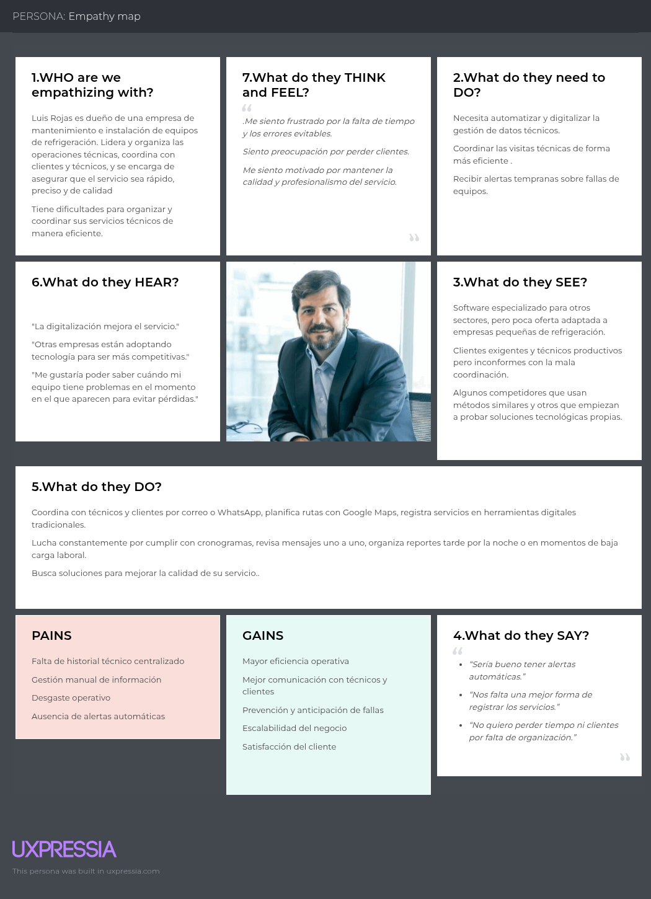
  <figcaption style="font-size: 0.9em; color: #555;">
    <strong>Figura 2:</strong> Segmento 2 del Mapa de Empatía.
  </figcaption>
</figure>


#### 2.3.5. As-is Scenario Mapping.

En esta sección, nuestro equipo tomó en cuenta las etapas para su desarrollo. Iniciamos con la recolección de información proveniente de las entrevistas y análisis de estas de cada segmento respectivo, seguida de una lluvia de ideas, una revisión en conjunto e identificación de las fases y las áreas positivas y negativas.
Una vez definido todo, procedimos a crear los As-is Scenario Mapping vinculados a cada User Persona en la plataforma Miro.
Desde la perspectiva del usuario, este mapa nos permite visualizar su situación real: acciones actuales, emociones, pensamientos, puntos de dolor, etc.


**Segmento objetivo #2: EMPRESAS PROVEEDORAS DE SERVICIOS Y EQUIPOS DE REFRIGERACIÓN**
<figure style="page-break-inside: avoid; text-align: center;">
  
  <figcaption style="font-size: 0.9em; color: #555;">
    <strong>Figura 1:</strong> Segmento 2 del Escenario As-Is.
  </figcaption>
</figure>

### 2.4. Ubiquitous Language.


1. **User Profile (Perfil de Usuario):** Datos e información operativa que OsitoPolar recopila de cada usuario para personalizar su experiencia.

2. **Smart Dashboard (Panel Inteligente):** Interfaz central donde los usuarios monitorean el estado de sus equipos, reciben alertas y gestionan sus servicios.

3. **Performance Report (Reporte de Rendimiento):** Informe técnico con historial de uso, consumo energético, temperatura y fallas de cada equipo.

4. **Maintenance Schedule (Agenda de Mantenimientos):** Calendario inteligente para programar mantenimientos preventivos o correctivos.

5. **Failure Alert (Alerta de Falla):** Notificación automática ante anomalías críticas como sobrecalentamiento o cortes de energía.

6. **Equipment Inventory (Inventario de Equipos):** Registro de todos los equipos de congelación con sus datos técnicos y ubicación.

7. **Service Provider (Proveedor de Servicio):** Técnico o empresa que brinda mantenimiento, instalación o reparación de equipos de refrigeración.

8. **Technical History (Historial Técnico):** Registro detallado de todas las intervenciones realizadas a un equipo.

9. **Work Order (Orden de Trabajo):** Documento digital con las tareas asignadas a un técnico para una visita de servicio.

10. **Service Coordination (Coordinación de Servicio):** Proceso de conexión entre clientes y proveedores según disponibilidad, ubicación y necesidad.

11. **Automatic Report Generation (Generación Automática de Reportes):** Función que crea informes técnicos sin intervención manual.

12. **Real-Time Monitoring (Monitoreo en Tiempo Real):** Supervisión constante del estado operativo del equipo (temperatura, consumo, uso).

13. **Service Zone (Zona de Servicio):** Área donde un proveedor puede atender equipos con rapidez y eficiencia.

14. **Client Portfolio (Cartera de Clientes):** Lista de negocios atendidos por un proveedor, con sus datos y equipos registrados.

15. **Cold Equipment (Equipo de Congelación):** Unidad de refrigeración usada para conservar productos, como congeladoras, cámaras o vitrinas.

16. **Energy Consumption (Consumo Energético):** Registro del uso eléctrico de los equipos para detectar anomalías y optimizar recursos.

17. **Preventive Maintenance (Mantenimiento Preventivo):** Servicio planificado para evitar fallas y extender la vida útil del equipo.

18. **Corrective Maintenance (Mantenimiento Correctivo):** Servicio realizado para solucionar una falla existente en un equipo.

19. **Notification (Notificación):** Mensajes enviados automáticamente para informar sobre mantenimientos, fallas o cambios importantes.

# Capítulo III: Requirements Specification

## 3.1. To-Be Scenario Mapping
 **Segmento objetivo #1: CLIENTES (DUEÑOS DE EQUIPOS DE REFRIGERACIÓN)** 

 <p align="center">
</p>

 **Segmento objetivo #1: CLIENTES (DUEÑOS DE EQUIPOS DE REFRIGERACIÓN)** 

 <p align="center">
</p>

## 3.2. User Stories

Las historias de usuario desarrolladas en este proyecto fueron elaboradas en conjunto por el equipo de desarrollo de **OsitoPolar**, considerando las necesidades y funcionalidades clave tanto para los **clientes** (dueños de equipos de refrigeración) como para los **empresarios** (proveedores de equipos y servicios de mantenimiento y refrigeración).  

Las historias fueron organizadas bajo **épicas** que agrupan funcionalidades similares.  
Los criterios de aceptación de todas las historias siguen la sintaxis **Gherkin**.  
El trabajo fue realizado de manera colaborativa, priorizando la comprensión del problema desde la perspectiva del usuario final.  

Para facilitar la organización, priorización y trazabilidad de las tareas, se utilizó la plataforma **Trello**.

---

### Historias de Usuario

| Story ID | Título                       | Descripción                                                                                                               | Criterios de Aceptación                                                                                                                                                                                                                                      | Epic ID |
|----------|------------------------------|---------------------------------------------------------------------------------------------------------------------------|---------------------------------------------------------------------------------------------------------------------------------------------------------------------------------------------------------------------------------------------------------------|---------|
| US01     | Registro de usuario          | Como nuevo usuario, quiero registrarme para acceder a la plataforma y empezar a gestionar mis equipos de refrigeración     | **Escenario 1: Crear cuenta exitosamente**<br>Dado que el nuevo usuario tiene todos los datos correctos, cuando completa el registro, entonces su cuenta es creada correctamente.<br><br>**Escenario 2: Intento de crear cuenta con email ya registrado**<br>Dado que el nuevo usuario intenta registrarse con un correo ya registrado, cuando envía el formulario, entonces el sistema muestra un mensaje indicando que el correo ya existe. | EP-01   |
| US02     | Inicio de sesión             | Como usuario, quiero acceder a mi cuenta en la plataforma de manera rápida y segura para utilizar sus funcionalidades.     | **Escenario 1: Iniciar sesión correctamente**<br>Dado que el usuario tiene una cuenta activa, cuando ingresa sus datos correctamente, entonces accede a su panel de control.<br><br>**Escenario 2: Intento de iniciar sesión con datos incorrectos**<br>Dado que el usuario ingresa datos incorrectos, cuando intenta iniciar sesión, entonces el sistema muestra un mensaje de error.<br><br>**Escenario 3: Acceso fácil al formulario de login**<br>Dado que el usuario está en el Landing Page, cuando selecciona la opción de inicio de sesión, entonces es redirigido al formulario de autenticación. | EP-01   |
| US03     | Solicitar servicio de reparación | Como cliente, quiero solicitar un servicio de reparación para mis equipos de refrigeración cuando detecto fallas.          | **Escenario 1: Solicitar servicio de reparación**<br>Dado que el cliente ha identificado una falla, cuando solicita el servicio desde la plataforma, entonces se genera la solicitud de servicio.<br><br>**Escenario 2: Confirmación de solicitud de servicio**<br>Dado que el cliente ha solicitado el servicio, cuando el sistema recibe la solicitud, entonces muestra un mensaje confirmando la recepción. | EP-03   |
| US04     | Ver estado del servicio solicitado | Como cliente, quiero ver el estado actual de mi solicitud de servicio para estar informado sobre el avance del proceso.    | **Escenario 1: Verificación del estado de la solicitud**<br>Dado que el cliente ha solicitado el servicio, cuando ingresa a la plataforma, entonces puede ver el estado actualizado de su solicitud.<br><br>**Escenario 2: Actualización de estado en tiempo real**<br>Dado que el cliente está visualizando su solicitud, cuando el técnico inicia el trabajo, entonces el estado se actualiza. | EP-03   |
| US05     | Ver reporte de servicio realizado | Como cliente, quiero ver el reporte de servicio detallado para saber qué reparaciones se hicieron en mi equipo.            | **Escenario 1: Generación del reporte de servicio**<br>Dado que el servicio ha sido completado, cuando el técnico termina, entonces el sistema genera un reporte detallado.<br><br>**Escenario 2: Enviar reporte al cliente por correo**<br>Dado que el reporte ha sido generado, cuando se ha finalizado el servicio, entonces el sistema envía el reporte al cliente por correo electrónico. | EP-04   |
| US06     | Agregar equipos              | Como cliente, quiero agregar mis equipos de refrigeración en la plataforma para llevar un control.                         | **Escenario 1: Agregar equipo de refrigeración**<br>Dado que el cliente quiere agregar un equipo, cuando ingresa los detalles del equipo, entonces el sistema lo registra correctamente.<br><br>**Escenario 2: Editar información del equipo**<br>Dado que el cliente desea editar la información del equipo, cuando realiza los cambios, entonces el sistema actualiza la información del equipo. | EP-02   |
| US07     | Recibir alerta de falla en equipo | Como cliente, quiero recibir una alerta automática cuando mi equipo de refrigeración presente una falla para tomar acción rápidamente. | **Escenario 1: Alerta de falla detectada**<br>Dado que el equipo de refrigeración está funcionando mal, cuando se detecta una falla, entonces el sistema envía una alerta al cliente.<br><br>**Escenario 2: Alerta de mantenimiento preventivo**<br>Dado que el equipo está funcionando correctamente, cuando el sistema detecta una necesidad de mantenimiento preventivo, entonces envía una alerta preventiva al cliente. | EP-05   |
| US08     | Solicitar mantenimiento preventivo    | Como cliente, quiero solicitar mantenimiento preventivo para evitar fallas futuras en mis equipos de refrigeración.      | **Escenario 1: Solicitar mantenimiento preventivo**<br>Dado que el cliente quiere programar mantenimiento preventivo, cuando selecciona la opción, entonces puede elegir la fecha y hora.<br><br>**Escenario 2: Confirmación de solicitud de mantenimiento**<br>Dado que el cliente ha solicitado el mantenimiento, cuando el sistema lo registra, entonces le envía una confirmación con los detalles. | EP-03   |
| US09     | Ver consumo energético de equipos     | Como cliente, quiero ver un informe del consumo energético de mis equipos para analizar su eficiencia.                    | **Escenario 1: Visualización de consumo energético**<br>Dado que el cliente tiene equipos registrados, cuando ingresa a la plataforma, entonces puede ver el informe de consumo energético de cada equipo.<br><br>**Escenario 2: Comparación del consumo energético**<br>Dado que el cliente quiere comparar, cuando selecciona dos equipos, entonces el sistema genera una comparación de su consumo energético. | EP-04   |
| US10     | Recepción de alertas automáticas para servicio | Como empresario, quiero recibir alertas automáticas cuando un cliente solicite un servicio de reparación o mantenimiento para brindar el servicio inmediatamente. | **Escenario 1: Recepción de solicitud de servicio**<br>Dado que el cliente ha solicitado un servicio, cuando se recibe la solicitud, entonces el sistema envía una alerta al empresario.<br><br>**Escenario 2: Alerta de mantenimiento preventivo solicitado**<br>Dado que un cliente ha solicitado mantenimiento preventivo, cuando se registra la solicitud, entonces el sistema envía una alerta automática al empresario. | EP-05   |
| US11     | Asignar técnico a solicitud de servicio | Como empresario, quiero asignar un técnico a una solicitud de servicio para garantizar que se realice el trabajo adecuado. | **Escenario 1: Asignar técnico a servicio**<br>Dado que el empresario recibe una solicitud de servicio, cuando elige un técnico, entonces el sistema asigna al técnico seleccionado a la solicitud.<br><br>**Escenario 2: Confirmación de asignación de técnico**<br>Dado que el técnico ha sido asignado, cuando el empresario lo confirma, entonces el sistema envía una notificación al técnico con los detalles. | EP-03   |
| US12     | Ver historial de servicios realizados | Como empresario, quiero ver el historial de servicios realizados para cada cliente y equipo, para llevar un control adecuado. | **Escenario 1: Visualizar historial de servicios**<br>Dado que el empresario tiene acceso al historial de servicios, cuando accede a la plataforma, entonces puede ver el historial completo de servicios realizados.<br><br>**Escenario 2: Filtrar historial por cliente o equipo**<br>Dado que el empresario quiere filtrar los servicios, cuando selecciona un cliente o equipo, entonces el sistema filtra los servicios realizados según el filtro seleccionado. | EP-04   |
| US13     | Realizar seguimiento a solicitudes de servicio | Como empresario, quiero realizar un seguimiento detallado a las solicitudes de servicio de mis técnicos, para saber cómo van. | **Escenario 1: Ver estado de la solicitud de servicio**<br>Dado que el empresario tiene acceso a solicitudes, cuando ingresa al sistema, entonces puede ver el estado actualizado de cada solicitud de servicio.<br><br>**Escenario 2: Actualización del estado de la solicitud**<br>Dado que el empresario quiere seguir el progreso, cuando un técnico actualiza el estado de la solicitud, entonces el sistema muestra el estado en tiempo real. | EP-03   |
| US14     | Generar reporte de desempeño de técnicos | Como empresario, quiero generar reportes sobre el desempeño de mis técnicos para evaluar su eficiencia y productividad.   | **Escenario 1: Generar reporte de desempeño**<br>Dado que el empresario quiere evaluar el desempeño de sus técnicos, cuando selecciona la opción de generar reporte, entonces el sistema crea un informe con los datos.<br><br>**Escenario 2: Descargar reporte de desempeño**<br>Dado que el reporte ha sido generado, cuando el empresario quiere descargarlo, entonces el sistema permite descargar el archivo en formato PDF. | EP-04   |
| US15     | Configurar alertas de mantenimiento   | Como empresario, quiero configurar alertas automáticas para el mantenimiento preventivo de los equipos.                   | **Escenario 1: Configuración de alerta de mantenimiento**<br>Dado que el empresario quiere configurar alertas, cuando ingresa los parámetros, entonces el sistema configura la alerta correctamente.<br><br>**Escenario 2: Modificación de alerta configurada**<br>Dado que el empresario ha configurado una alerta, cuando decide cambiar la frecuencia, entonces el sistema actualiza la alerta. | EP-05   |
| US16     | Visualizar clientes y servicios asociados | Como empresario, quiero ver todos los clientes que han solicitado servicio para organizar el trabajo de los técnicos.      | **Escenario 1: Ver clientes y servicios asociados**<br>Dado que el empresario quiere visualizar la información, cuando accede a la funcionalidad correspondiente, entonces puede consultar los clientes con sus servicios relacionados.<br><br>**Escenario 2: Filtrar por estado de servicio**<br>Dado que el empresario necesita filtrar resultados, cuando aplica el filtro por estado, entonces el sistema muestra los datos correspondientes. | EP-04   |
| US17     | Visualizar equipos entregados a clientes | Como empresario, quiero ver todos los equipos que fueron entregados a clientes para realizar su seguimiento.                | **Escenario 1: Ver equipos asociados**<br>Dado que el empresario quiere visualizar la información de equipos, cuando accede al listado de equipos, entonces puede consultar los que están asociados a clientes.<br><br>**Escenario 2: Filtrar por estado y tipo de equipo**<br>Dado que el empresario necesita filtrar los resultados, cuando aplica los criterios, entonces el sistema muestra los equipos correspondientes. | EP-02   |
| US18     | Recibir notificaciones de eventos importantes | Como cliente, quiero recibir notificaciones sobre eventos importantes como el progreso del servicio para mantenerme informado. | **Escenario 1: Problema reportado durante el servicio**<br>Dado que el técnico detecta una complicación o requiere aprobación, cuando se genera un evento interno, entonces el sistema envía una notificación que requiere acción del cliente.<br><br>**Escenario 2: Notificación sobre progreso del servicio**<br>Dado que el servicio está en ejecución, cuando el estado cambia, entonces se envía una notificación al cliente. | EP-05   |
| US19     | Realizar evaluación de servicio       | Como cliente, quiero evaluar el servicio para mostrar mi conformidad.                                                      | **Escenario 1: Evaluar el servicio una vez finalizado**<br>Dado que el cliente ha recibido el servicio, cuando accede a la opción de evaluación, entonces puede registrar una calificación del 1 al 5.<br><br>**Escenario 2: Corrección de evaluación del servicio**<br>Dado que el cliente ya evaluó el servicio, cuando realiza una modificación dentro del plazo permitido, entonces el sistema actualiza la calificación registrada. | EP-06   |
| US20     | Registrar técnicos                    | Como empresario, quiero registrar técnicos en la plataforma para integrarlos a mi red de soporte técnico.                  | **Escenario 1: Registro exitoso de un técnico**<br>Dado que el empresario desea registrar un técnico, cuando completa los datos requeridos y confirma, entonces el sistema lo registra correctamente.<br><br>**Escenario 2: Intento de registro con datos incompletos**<br>Dado que faltan datos obligatorios, cuando intenta registrar al técnico, entonces el sistema impide la operación hasta que se completen los campos necesarios. | EP-01   |
| US21     | Visualizar perfil del técnico         | Como empresario, quiero visualizar el perfil de cada técnico, incluyendo sus datos personales y métricas de desempeño, para evaluar su rendimiento. | **Escenario 1: Acceso a información completa del técnico**<br>Dado que el empresario selecciona un técnico, cuando accede a su información, entonces puede consultar datos personales, historial de servicios y calificaciones.<br><br>**Escenario 2: Técnico sin evaluaciones registradas**<br>Dado que el técnico aún no ha sido evaluado, cuando se consulta su perfil, entonces no se muestran métricas de desempeño. | EP-01   |
 | US22     | Recibir alertas de fallas en equipos  | Como empresario, quiero recibir alertas cuando alguno de los equipos de mis clientes presenta fallas, para notificar al cliente y organizar atención. | **Escenario 1: Recepción de alerta automática por sensor**<br>Dado que un equipo monitoreado presenta una falla, cuando el sistema la detecta, entonces genera una alerta inmediata para el empresario.<br><br>**Escenario 2: Comunicación con el cliente**<br>Dado que el empresario ha recibido una alerta, cuando revisa el equipo afectado, entonces puede iniciar una notificación directa al cliente desde la plataforma. | EP-05   |
| US23     | Visualizar propuesta de valor principal | Como visitante, quiero conocer la propuesta de valor de OsitoPolar, para entender si la plataforma se ajusta a mis necesidades. | **Escenario 1: Propuesta visible al ingresar**<br>Dado que estoy en la página oficial de OsitoPolar, cuando la página carga, entonces debo acceder inmediatamente a una frase que explique claramente la propuesta de valor.<br><br>**Escenario 2: Propuesta orientada a gestión de refrigeración**<br>Dado que soy un visitante del segmento 1, cuando reviso la propuesta de valor, entonces esta debe mencionar conceptos relacionados con gestión inteligente y monitoreo de equipos. | EP-07   |
| US24     | Explorar soluciones específicas para mi rubro | Como visitante, quiero conocer las soluciones específicas que ofrece OsitoPolar para mi tipo de negocio, para saber si se ajusta a mis necesidades. | **Escenario 1: Acceso a información para negocios**<br>Dado que accedo a las soluciones ofrecidas, cuando reviso el contenido disponible, entonces debo encontrar descripciones específicas dirigidas a negocios que utilizan o gestionan equipos de refrigeración.<br><br>**Escenario 2: Acceso a información para empresas proveedoras**<br>Dado que accedo a las soluciones ofrecidas, cuando reviso el contenido disponible, entonces debo encontrar información específica para empresas proveedoras de equipos o servicios de mantenimiento. | EP-07   |
| US25     | Comprender funcionalidades destacadas | Como visitante, quiero comprender las funcionalidades clave de la plataforma, para evaluar si se adapta a mi operación.     | **Escenario 1: Acceso a funcionalidades principales**<br>Dado que consulto las características de la plataforma, cuando reviso la lista de funcionalidades, entonces debo identificar opciones clave como monitoreo en tiempo real, automatización de alertas y gestión remota.<br><br>**Escenario 2: Descripciones orientadas a valor**<br>Dado que leo las descripciones de las funcionalidades, cuando evalúo cada una, entonces debo entender el beneficio que aporta para operaciones de refrigeración o mantenimiento. | EP-07   |
| US26     | Solicitar una demo fácilmente         | Como visitante, quiero solicitar una demo de la plataforma, para iniciar contacto con OsitoPolar.                          | **Escenario 1: Disponibilidad de opción para solicitar demo**<br>Dado que estoy explorando la plataforma, cuando busco cómo solicitar una demostración, entonces debo encontrar una opción clara y accesible para iniciar el proceso.<br><br>**Escenario 2: Acceso a canal de contacto**<br>Dado que selecciono la opción de solicitar una demo, cuando soy redirigido, entonces debo acceder a un canal funcional de contacto como un formulario, correo electrónico o enlace directo. | EP-07   |
| US27     | Conocer misión y visión de la startup | Como visitante, quiero conocer la misión y visión de OsitoPolar, para entender su enfoque y propuesta de valor.             | **Escenario 1: Acceso a la misión de la empresa**<br>Dado que accedo a la información institucional de OsitoPolar, cuando reviso su contenido corporativo, entonces debo encontrar una descripción clara de su misión.<br><br>**Escenario 2: Acceso a la visión de la empresa**<br>Dado que accedo a la información institucional, cuando reviso su contenido estratégico, entonces debo encontrar una descripción clara de su visión a futuro. | EP-07   |
| US28     | Contactar fácilmente con ventas       | Como visitante empresario, quiero contactar fácilmente con el equipo de ventas, para iniciar una posible relación comercial. | **Escenario 1: Disponibilidad de medio de contacto comercial**<br>Dado que estoy interesado en contactar al equipo de ventas, cuando busco información de contacto, entonces debo encontrar una opción clara para iniciar la comunicación.<br><br>**Escenario 2: Redirección al canal adecuado**<br>Dado que selecciono la opción de contacto, cuando soy redirigido, entonces debo llegar a un canal funcional como un formulario, dirección de correo o número de contacto. | EP-07   |
| US29     | Acceder fácilmente a la plataforma    | Como visitante, quiero acceder fácilmente al inicio de sesión, para ingresar rápidamente a mi cuenta.                       | **Escenario 1: Acceso al inicio de sesión**<br>Dado que soy un usuario registrado, cuando busco cómo ingresar a mi cuenta, entonces debo encontrar una opción claramente identificable para iniciar sesión.<br><br>**Escenario 2: Redirección al formulario de autenticación**<br>Dado que selecciono la opción de inicio de sesión, cuando soy redirigido, entonces debo llegar al formulario correspondiente para ingresar mis credenciales. | EP-07   |
| US30     | Descargar la app móvil desde la web   | Como visitante interesado en usar OsitoPolar desde el celular, quiero descargar fácilmente la app móvil, para instalarla y comenzar a usarla. | **Escenario 1: Acceso a opciones de descarga móvil**<br>Dado que estoy interesado en utilizar la aplicación en mi celular, cuando exploro la plataforma, entonces debo encontrar un enlace o referencia a la descarga de la app móvil.<br><br>**Escenario 2: Redirección a la tienda correspondiente**<br>Dado que selecciono el enlace de descarga, cuando soy redirigido, entonces debo acceder a la tienda de aplicaciones correspondiente según mi sistema operativo. | EP-07   |
| US31     | Controlar encendido y apagado del equipo | Como cliente, quiero poder encender y apagar remotamente mis equipos de refrigeración desde la plataforma, para tener un mayor control operativo. | **Escenario 1: Encendido remoto del equipo**<br>Dado que el cliente tiene un equipo registrado, cuando ejecuta una acción de encendido sobre el equipo, entonces el sistema transmite la instrucción y cambia el estado del equipo a encendido.<br><br>**Escenario 2: Apagado remoto del equipo**<br>Dado que el cliente tiene un equipo activo, cuando ejecuta una acción de apagado, entonces el sistema transmite la instrucción y cambia el estado del equipo a apagado. | EP-02   |
| US32     | Ajustar temperatura del equipo        | Como cliente, quiero ajustar la temperatura de mis equipos de refrigeración desde la plataforma, para mantener condiciones óptimas según mi operación. | **Escenario 1: Aumentar temperatura**<br>Dado que el cliente tiene acceso a un equipo, cuando incrementa el valor de temperatura deseada, entonces el sistema actualiza la configuración del equipo con el nuevo valor.<br><br>**Escenario 2: Disminuir temperatura**<br>Dado que el cliente tiene acceso a un equipo, cuando reduce el valor de temperatura deseada, entonces el sistema actualiza la configuración del equipo con el nuevo valor. | EP-02   |
| US33     | Ver video explicativo sobre el producto en el Landing Page | Como visitante, quiero ver un video explicativo sobre el producto para entender sus funcionalidades y beneficios rápidamente. | **Escenario 1: Acceso al video del producto**<br>Dado que estoy en el Landing Page de OsitoPolar, cuando la página carga, entonces puedo ver un video explicativo sobre el producto.<br><br>**Escenario 2: Reproducción correcta del video**<br>Dado que selecciono el video del producto, cuando lo reproduzco, entonces se ejecuta sin interrupciones en mi dispositivo. | EP-07   |
| US34     | Ver video sobre el equipo en el Landing Page | Como visitante, quiero ver un video sobre el equipo detrás del producto para conocer a las personas responsables y confiar en la empresa. | **Escenario 1: Acceso al video del equipo**<br>Dado que estoy en el Landing Page de OsitoPolar, cuando la página carga, entonces puedo ver un video sobre el equipo detrás del producto.<br><br>**Escenario 2: Reproducción correcta del video**<br>Dado que selecciono el video del equipo, cuando lo reproduzco, entonces se ejecuta sin interrupciones en mi dispositivo. | EP-07   |
| US35   | Barra de navegación actualizada tras inicio de sesión | Como usuario autenticado, quiero que la barra de navegación refleje mi estado de sesión para acceder a las funcionalidades de la aplicación sin interrupciones. | **Escenario 1: Visualización de opciones autenticadas**<br>Dado que he iniciado sesión correctamente, cuando accedo a la barra de navegación, entonces veo opciones específicas para usuarios autenticados.<br><br>**Escenario 2: Actualización automática de la barra**<br>Dado que inicio sesión, cuando la página se carga, entonces la barra de navegación se actualiza automáticamente con las opciones correspondientes. | EP-01   |
| TS-36  | Integrar sistema IAM en el backend     | Como equipo de desarrollo, queremos integrar un sistema de Identity Access Management (IAM) en el backend para gestionar de forma segura el acceso de los usuarios a los endpoints del frontend. | **Escenario 1: Protección de endpoints con IAM**<br>Dado que el sistema IAM está configurado, cuando un usuario autenticado accede a un endpoint protegido, entonces recibe una respuesta exitosa.<br><br>**Escenario 2: Acceso denegado sin autenticación**<br>Dado que un usuario no autenticado intenta acceder a un endpoint protegido, cuando realiza la solicitud, entonces recibe un error de acceso denegado. | EP-01   |
| TS-37  | Implementar autenticación en el backend | Como equipo de desarrollo, queremos implementar autenticación en el backend para permitir a los usuarios iniciar sesión de manera segura. | **Escenario 1: Validación exitosa de credenciales**<br>Dado que un usuario envía credenciales válidas, cuando el backend procesa la solicitud, entonces genera un token de autenticación.<br><br>**Escenario 2: Error en credenciales inválidas**<br>Dado que un usuario envía credenciales incorrectas, cuando el backend procesa la solicitud, entonces devuelve un mensaje de error. | EP-01   |
| TS-39  | Usar llave secreta para crear usuarios | Como administrador, quiero usar una llave secreta para crear usuarios en el backend para garantizar que solo personal autorizado pueda registrar nuevos usuarios. | **Escenario 1: Creación de usuario con llave válida**<br>Dado que el administrador usa una llave secreta válida, cuando envía la solicitud de creación de usuario, entonces el usuario se crea correctamente.<br><br>**Escenario 2: Intento con llave inválida**<br>Dado que el administrador usa una llave secreta inválida, cuando envía la solicitud, entonces el sistema devuelve un error de acceso denegado. | EP-01   |
| TS-40  | Registrar nuevo usuario a través de API RESTful | Como desarrollador, quiero exponer un endpoint para registrar nuevos usuarios en la plataforma, validando datos como correo único y formato de contraseña, para permitir el acceso seguro de nuevos usuarios. | **Escenario 1: Registro exitoso**<br>Dado que el endpoint /api/v1/users está disponible, cuando se envía una solicitud POST con datos válidos (nombre, email único, contraseña válida), entonces el sistema responde con 201 y devuelve el usuario registrado.<br><br>**Escenario 2: Registro con email existente**<br>Dado un correo ya registrado, cuando se intenta registrar nuevamente, entonces se devuelve un 400 con mensaje "Email already registered". | EP-01   |
| TS-41  | Consultar estado de solicitud de servicio por API | Como desarrollador, quiero exponer un endpoint para consultar el estado de una solicitud de servicio, permitiendo a clientes y empresarios hacer seguimiento en tiempo real desde la plataforma. | **Escenario 1: Consulta exitosa del estado**<br>Dado que el endpoint /api/v1/requests/{id} está disponible, cuando se envía una solicitud GET con un ID válido, entonces el sistema responde con 200 y devuelve el estado actual de la solicitud.<br><br>**Escenario 2: Consulta con ID inexistente**<br>Dado que el ID no existe, entonces se devuelve 404 con mensaje "Request not found". | EP-03   |
| TS-42  | Solicitar mantenimiento preventivo vía API | Como desarrollador, quiero implementar un endpoint para registrar solicitudes de mantenimiento preventivo, diferenciadas de las solicitudes por reparación. | **Escenario 1: Solicitud exitosa de mantenimiento preventivo**<br>Dado que el endpoint /api/v1/preventive-maintenance está disponible, cuando se envía una solicitud POST con datos válidos (equipo, fecha deseada), entonces el sistema responde con 201 y guarda la solicitud.<br><br>**Escenario 2: Solicitud con datos incompletos**<br>Dado que falta un campo obligatorio, entonces se responde con 400 y mensaje de error. | EP-03   |
| TS-43  | Asignar técnico a solicitud de servicio por API | Como desarrollador, quiero crear un endpoint que permita asignar un técnico a una solicitud de servicio, para gestionar la ejecución técnica desde la plataforma. | **Escenario 1: Asignación exitosa**<br>Dado que el endpoint /api/v1/requests/{id}/assigntechnician está disponible, cuando se envía una solicitud PUT con un técnico válido, entonces se devuelve 200 y se actualiza la solicitud.<br><br>**Escenario 2: Técnico no existente**<br>Dado un ID de técnico inválido, entonces se responde con 404 y mensaje "Technician not found". | EP-03   |
| TS-44  | Consultar historial de servicios por API | Como desarrollador, quiero exponer un endpoint para consultar el historial de servicios por cliente o equipo, permitiendo búsquedas y filtrado desde el panel de control. | **Escenario 1: Historial completo por cliente**<br>Dado que el endpoint /api/v1/service-history?client_id={id} está disponible, cuando se hace la consulta, entonces se responde con 200 y la lista de servicios asociados.<br><br>**Escenario 2: Historial filtrado por equipo**<br>Dado que se agrega un parámetro de equipo, entonces el sistema devuelve solo los servicios asociados a ese equipo. | EP-04   |
| TS-45  | Generar y exportar reporte de desempeño técnico | Como desarrollador, quiero implementar la generación de reportes de desempeño técnico, incluyendo número de servicios, evaluaciones y tiempos promedio, y permitir su descarga en PDF. | **Escenario 1: Generar reporte exitosamente**<br>Dado que el endpoint /api/v1/reports/performance está disponible, cuando se hace una solicitud GET, entonces se devuelve un resumen con métricas.<br><br>**Escenario 2: Descargar reporte PDF**<br>Dado que el reporte ya fue generado, cuando se solicita la descarga, entonces el sistema entrega un archivo PDF con los datos generados. | EP-04   |
| TS-46  | Consultar clientes con sus servicios asociados por API | Como desarrollador, quiero implementar un endpoint que permita listar clientes junto con los servicios que tienen registrados, para facilitar la planificación desde el panel empresarial. | **Escenario 1: Consulta de clientes con servicios**<br>Dado que el endpoint /api/v1/clients/services está disponible, cuando se realiza una solicitud GET, entonces se devuelve la lista de clientes y sus servicios.<br><br>**Escenario 2: Filtro por estado de servicio**<br>Dado un parámetro de estado (ej. "in progress"), entonces el sistema devuelve solo los clientes con servicios en ese estado. | EP-04   |
| TS-47  | Consultar equipos entregados y su estado por API | Como desarrollador, quiero exponer un endpoint para visualizar los equipos entregados a clientes, junto con su estado y tipo, para mantener un registro accesible desde el sistema empresarial. | **Escenario 1: Listado de equipos entregados**<br>Dado que el endpoint /api/v1/delivered-devices está disponible, cuando se hace una solicitud GET, entonces se devuelve una lista con los equipos y sus estados.<br><br>**Escenario 2: Filtro por tipo y estado**<br>Dado que se agregan parámetros de tipo o estado, entonces se devuelve la lista filtrada según los criterios. | EP-02   |
| TS-48  | Sistema de envío de notificaciones por eventos relevantes | Como desarrollador, quiero que el sistema pueda enviar notificaciones automáticas o manuales ante eventos clave (problemas detectados, cambios de estado), para mantener informados a clientes y técnicos. | **Escenario 1: Envío automático de notificación por cambio de estado**<br>Dado que una solicitud cambia a "in progress", entonces el sistema envía una notificación al cliente.<br><br>**Escenario 2: Envío manual por parte del técnico**<br>Dado que un técnico detecta una situación crítica, cuando registra un evento, entonces se notifica al cliente automáticamente. | EP-05   |
| TS-49  | Consultar perfil del técnico con métricas por API | Como desarrollador, quiero crear un endpoint que muestre el perfil completo de un técnico incluyendo datos personales, historial y métricas de desempeño, para su visualización por el empresario. | **Escenario 1: Visualización del perfil completo**<br>Dado que el endpoint /api/v1/technicians/{id} está disponible, cuando se realiza una consulta GET, entonces se devuelve la información personal, servicios realizados y evaluación promedio.<br><br>**Escenario 2: Técnico sin historial**<br>Dado que el técnico aún no ha realizado servicios, el sistema informa que no hay datos de desempeño aún. | EP-01   |
| TS-50 | Arreglar conexión entre endpoints y frontend  | Como equipo de desarrollo, queremos arreglar la conexión entre los endpoints del backend y el frontend para garantizar un flujo de datos estable y sin errores. | **Escenario 1: Conexión exitosa entre frontend y backend**<br>Dado que los endpoints están configurados, cuando el frontend realiza una solicitud, entonces recibe una respuesta exitosa sin errores.<br><br>**Escenario 2: Manejo de errores de conexión**<br>Dado que hay un fallo en la conexión, cuando el frontend realiza una solicitud, entonces el sistema devuelve un mensaje de error claro. | EP-01   |

| Epic ID | Título                         | Descripción                                                                                                                                  | 
|---------|--------------------------------|----------------------------------------------------------------------------------------------------------------------------------------------|
| EP-01   | Gestión de Usuarios            | Esta epic se enfoca en la creación, autenticación y gestión de las cuentas de usuario en la plataforma. Incluye el registro de nuevos usuarios, inicio de sesión, y la administración de los perfiles. |                          |                 |
| EP-02   | Gestión de Equipos             | Esta epic cubre las funcionalidades relacionadas con la gestión de los equipos de refrigeración. Permite a los clientes agregar, editar, y visualizar sus equipos registrados en la plataforma.        |                          |                 |
| EP-03   | Solicitudes de Servicio        | Esta epic abarca todo lo relacionado con la solicitud de servicios de reparación y mantenimiento por parte de los clientes, así como el seguimiento de esas solicitudes hasta su resolución.           |                          |                 |
| EP-04   | Informes y Reportes            | Esta epic se refiere a la generación, visualización y envío de informes detallados sobre los servicios realizados, el consumo energético de los equipos y el desempeño de los técnicos.                 |                          |                 |
| EP-05   | Alertas y Notificaciones       | Esta epic se encarga de la creación de alertas automáticas y notificaciones para clientes y empresarios, relacionadas con fallas de equipos, mantenimiento preventivo y el progreso de los servicios. |                          |                 |
| EP-06   | Evaluación de Servicios        | Esta epic está orientada a permitir que los clientes puedan evaluar los servicios recibidos, para proporcionar retroalimentación y permitir que se realicen correcciones si es necesario.             |                          |                 |
| EP-07   | Sitio Web y Experiencia Web    | Esta epic se enfoca en las funcionalidades de la página de aterrizaje, incluyendo la visualización de la propuesta de valor, la facilidad para solicitar demos, y el acceso a canales de contacto directo con el equipo de ventas. |                          |                 |

## 3.3. Impact Mapping

El siguiente Impact Mapping fue desarrollado en UXPressia de manera colaborativa por el equipo de OsitoPolar para alinear los objetivos de negocio con los requerimientos funcionales de la plataforma.

<p align="center">
</p>


## 3.4. Product Backlog

A continuación, presentaremos el **Product Backlog**, el cual contiene todas las funcionalidades y características necesarias para el desarrollo de la plataforma. Este listado incluye tanto las **historias de usuario** como las **tareas técnicas** que facilitarán el progreso del proyecto. 

Para priorizar las tareas, se ha utilizado la **escala Fibonacci (1, 2, 3, 5, 8, 13, 21)**, la cual ayuda a estimar el esfuerzo relativo requerido para completar cada tarea. Además, hemos asignado cada ítem a un **sprint**, de acuerdo con su relevancia y dependencias.

**Escala de Story Points (Fibonacci):**
- **1**: Tareas pequeñas que se pueden completar rápidamente.  
- **2**: Tareas de tamaño moderado.  
- **3**: Tareas que requieren más tiempo y esfuerzo.  
- **5**: Tareas complejas o con dependencia de otras tareas.  
- **8**: Tareas muy complejas o que afectan a múltiples áreas.  
- **13**: Tareas críticas que requieren planeación especial.  
- **21**: Épicas o grandes bloques de trabajo que deben dividirse en tareas más pequeñas.  

<p align="center">
</p>

A continuación se presenta el Product Backlog con las historias de usuario priorizadas, sus descripciones y estimaciones en Story Points (escala Fibonacci).

| Orden | User Story ID | Título                                | Descripción                                                                                                                                       | Story Points |
|-------|---------------|---------------------------------------|---------------------------------------------------------------------------------------------------------------------------------------------------|--------------|
| 1     | US-01         | Registro de usuario                   | Como nuevo usuario, quiero registrarme para acceder a la plataforma y empezar a gestionar mis equipos de refrigeración.                            | 5            |
| 2     | US-02         | Inicio de sesión                      | Como usuario, quiero iniciar sesión con mi cuenta para acceder a la plataforma.                                                                   | 3            |
| 3     | US-03         | Solicitar servicio de reparación       | Como cliente, quiero poder solicitar un servicio de reparación para mis equipos de refrigeración cuando detecto fallas.                            | 5            |
| 4     | US-04         | Ver estado del servicio solicitado     | Como cliente, quiero ver el estado actual de mi solicitud de servicio para estar informado sobre el avance del proceso.                           | 3            |
| 5     | US-05         | Ver reporte de servicio realizado      | Como cliente, quiero ver el reporte de servicio detallado para saber qué reparaciones se hicieron en mi equipo.                                   | 3            |
| 6     | US-06         | Agregar equipos                       | Como cliente, quiero poder agregar mis equipos de refrigeración en la plataforma para llevar un control.                                          | 5            |
| 7     | US-07         | Recibir alerta de falla en equipo      | Como cliente, quiero recibir una alerta automática cuando mi equipo de refrigeración presente una falla para tomar acción rápidamente.             | 8            |
| 8     | US-08         | Solicitar mantenimiento preventivo     | Como cliente, quiero poder solicitar mantenimiento preventivo para evitar fallas futuras en mis equipos de refrigeración.                         | 5            |
| 9     | US-09         | Ver consumo energético de equipos      | Como cliente, quiero ver un informe del consumo energético de mis equipos para poder analizar su eficiencia.                                       | 5            |
| 10    | US-09         | Recepción de alertas automáticas       | Como empresario, quiero recibir alertas automáticas cuando un cliente solicite un servicio de reparación o mantenimiento.                         | 8            |
| 11    | US-10         | Asignar técnico a solicitud de servicio| Como empresario, quiero poder asignar un técnico a una solicitud de servicio para garantizar que se realice el trabajo adecuado.                   | 5            |
| 12    | US-11         | Ver historial de servicios realizados  | Como empresario, quiero ver el historial de servicios realizados para cada cliente y equipo, para llevar un control adecuado.                      | 5            |
| 13    | US-12         | Realizar seguimiento a solicitudes     | Como empresario, quiero realizar un seguimiento detallado a las solicitudes de servicio de mis técnicos, para saber cómo van.                      | 8            |
| 14    | US-13         | Generar reporte de desempeño de técnicos| Como empresario, quiero generar reportes sobre el desempeño de mis técnicos para evaluar su eficiencia y productividad.                            | 5            |
| 15    | US-14         | Configurar alertas de mantenimiento   | Como empresario, quiero poder configurar alertas automáticas para el mantenimiento preventivo de los equipos.                                     | 8            |
| 16    | US-15         | Visualizar clientes y servicios        | Como empresario, quiero ver todos los clientes que han solicitado servicio para organizar el trabajo de los técnicos.                             | 5            |
| 17    | US-16         | Visualizar equipos entregados          | Como empresario, quiero ver todos los equipos que fueron entregados a clientes para realizar su seguimiento.                                       | 5            |
| 18    | US-17         | Recibir notificaciones de eventos      | Como cliente, quiero recibir notificaciones sobre eventos importantes como el progreso del servicio, etc.                                         | 8            |
| 19    | US-18         | Realizar evaluación de servicio        | Como cliente, quiero poder evaluar el servicio para mostrar mi conformidad.                                                                       | 3            |
| 20    | US-19         | Registrar técnicos                    | Como empresario, quiero poder registrar técnicos en la plataforma para integrarlos a mi red de soporte técnico.                                   | 5            |
| 21    | US-21         | Visualizar perfil del técnico          | Como empresario, quiero visualizar el perfil de cada técnico, incluyendo sus datos personales y métricas de desempeño, para evaluar su rendimiento.| 5            |
| 22    | US-22         | Visualizar propuesta de valor principal| Como empresario, quiero recibir alertas cuando alguno de los equipos de mis clientes presenta fallas, para notificar al cliente y organizar la atención técnica. | 8 |
| 23    | US-23         | Explorar soluciones específicas        | Como visitante, quiero ver claramente la propuesta de valor en la landing page, para saber si OsitoPolar puede ayudarme.                          | 3            |
| 24    | US-24         | Comprender funcionalidades destacadas  | Como visitante, quiero encontrar una sección con soluciones específicas para negocios como el mío, para saber si OsitoPolar se ajusta a mis necesidades.| 5        |
| 25    | US-25         | Solicitar una demo fácilmente          | Como visitante, quiero ver funcionalidades clave presentadas de forma clara, para evaluar si la plataforma se adapta a mi operación.              | 5            |
| 26    | US-26         | Solicitar demo desde landing           | Como visitante, quiero poder solicitar una demo desde el landing page, para iniciar contacto con OsitoPolar.                                      | 3            |
| 27    | US-27         | Conocer misión y visión                | Como visitante, quiero ver la misión y visión de OsitoPolar, para entender su enfoque y confianza en su propuesta.                                | 2            |
| 28    | US-28         | Contactar fácilmente con ventas        | Como visitante empresario, quiero un botón claro para contactar con ventas, para iniciar una posible relación comercial.                          | 3            |
| 29    | US-29         | Acceder fácilmente al inicio de sesión | Como visitante, quiero encontrar un botón de “Iniciar sesión” visible en el Landing Page, para acceder rápidamente a mi cuenta.                   | 3            |
| 30    | US-30         | Descargar app móvil desde la web       | Como visitante interesado en usar OsitoPolar desde el celular, quiero ver un enlace claro para descargar la app móvil desde el Landing Page.      | 5            |
| 31    | US-31         | Registrar nuevo equipo (API)           | Como desarrollador, quiero permitir que los usuarios registren nuevos equipos mediante una API para facilitar el control y monitoreo.             | 5            |
| 32    | US-32         | Eliminar técnico asignado (API)        | Como desarrollador, quiero poder eliminar un técnico del sistema desde la API para gestionar la asignación de servicios y roles técnicos.          | 5            |
| 33    | US-33         | Notificación automática por alerta crítica | Como desarrollador, quiero implementar un sistema de notificaciones automáticas que se activen cuando se detecten fallas críticas en los equipos. | 8            |
| 34    | US-34         | Crear solicitud de mantenimiento (API) | Como desarrollador, quiero implementar una API que permita crear solicitudes de mantenimiento para que los negocios reporten necesidades de soporte.| 5            |
| 35    | US-35         | Crear registro de intervención técnica | Como desarrollador, quiero permitir registrar intervenciones técnicas realizadas a través de la API, para llevar seguimiento del mantenimiento.   | 5            |
| 36    | US-36         | Registrar evento de alerta manual      | Como desarrollador, quiero permitir registrar una alerta manual vía API para que los técnicos puedan ingresar incidentes detectados en campo.     | 3            |
| 37    | US-37         | Evaluar servicio (API)                 | Como desarrollador, quiero implementar un endpoint RESTful que permita a los clientes registrar y actualizar una evaluación de servicio.           | 8            |

  ## Capítulo IV: Product Design <a id="c4"></a>

### 4.1. Style Guidelines
#### 4.1.1. General Style Guidelines

Se busca que el tono sea equilibrado, entre lo profesional y lo accesible, con un lenguaje claro, empático y respetuoso para atraer usuarios potenciales y mantener a nuestros usuarios.
Se eligió una paleta de colores fría pero amigable, y una tipografía moderna que combine profesionalismo y accesibilidad.

**Branding**

La identidad visual de OsitoPolar busca transmitir seguridad, innovación y cercanía.

**Logo:** Representa un oso polar con un ícono de refrigeración, combinando lo técnico con lo amigable. Disponible en versiones para fondos claros y oscuros, monocromático, horizontal y vertical.


**Typography**

Para mantener la formalidad y accesibilidad de la interfaz de usuario de OsitoPolar se establecerá las tipografías Helvetica y Open Sans por sus características funcionales, estéticas y por su alta compatibilidad en interfaces digitales, siendo Helvetica la primaria.

<figure style="page-break-inside: avoid; text-align: center;">
  
  <figcaption style="font-size: 0.9em; color: #555;">
    <strong>Figura 1:</strong> Tipografía Helvetica.
  </figcaption>
</figure>


<figure style="page-break-inside: avoid; text-align: center;">
  
  <figcaption style="font-size: 0.9em; color: #555;">
    <strong>Figura 2:</strong> Tipografía Open Sans.
  </figcaption>
</figure>


**Colors**

La paleta fue diseñada para representar ambientes fríos y tecnológicos, transmitiendo confianza y limpieza visual.

El color principal elegido es el celeste, pues es el que más se acopla a las características que describimos. Se optó por los colores negro, blanco y gris como neutros, los cuales serán utilizados para fondos o textos.
Se eligieron variantes de color verde, rojo, azul y amarillo para ciertos fondos y estados (alertas, servicio, calificaciones).


<figure style="page-break-inside: avoid; text-align: center;">
  
  <figcaption style="font-size: 0.9em; color: #555;">
    <strong>Figura 3:</strong> Guías Generales de Estilo - Colores.
  </figcaption>
</figure>


**Spacing**

Se establecerá un espaciado de 8 px y un margen mínimo de 16 px. Para el diseño modular, se implementarán grids flexibles que se adaptarán tanto a web como a dispositivos móviles, utilizando configuraciones de 12 y 4 columnas respectivamente.


#### 4.1.2. Web Style Guidelines

En esta sección definimos los estándares visuales y de interacción para la versión web de OsitoPolar, asegurando una experiencia de usuario coherente, profesional y accesible en todos los dispositivos.
Es necesario que las interfaces web sean responsivas porque nos trae muchas ventajas tanto para el usuario como para el equipo desarrollador, entre las cuales tenemos: usabilidad en cualquier dispositivo, mejor eficiencia de costos y tiempo en el desarrollo y satisfacción del usuario.

Adoptando un enfoque mobile-first, usamos un sistema de grid de 12 columnas para que la interfaz se adapte a cualquier dispositivo.

**Tipografía**
Tomando en cuenta la guía de estilos, se usará la tipografía Helvetica en la mayoría de los textos de la aplicación, pues esta proyecta profesionalismo y claridad. Para que la visualización de los textos sea óptima, el tamaño de la fuente debe ajustarse automáticamente y adaptarse al dispositivo que se esté usando.


**Colores**
De acuerdo al rubro al que está orientado OsitoPolar, los colores deben reflejar tecnología, frescura y confianza. La elección de colores es la siguiente:

- Celeste (#0884C4): Se usará para el header y algunos botones.
- Blanco (#FFFFFF): Se usará para fondos neutros.
- Negro (#000000): Se usará en algunos botones y bordes.
- Gris claro (#808080): Se usará para líneas, bordes, separadores y botones deshabilitados.
- Blanco azul mar (#F4FCFC): Se usará para algunos fondos.
- Verde medio primavera (#00CC66): Se usará para notificaciones y estados positivos.
- Rojo claro (#FF4B4B): Se usará para alertas, errores y fallas críticas.
- Amarillo mandarina (#FFCC00): Se usará para ciertos agregados (notificaciones, calificaciones).

Sin embargo, la variación de botones y fondos que tendrá la plataforma hace que no siempre se elija la misma tonalidad, por lo que optamos por una paleta de celeste.


<figure style="page-break-inside: avoid; text-align: center;">
  
  <figcaption style="font-size: 0.9em; color: #555;">
    <strong>Figura 1:</strong> Guías de Estilo Web - Color Sky Blue.
  </figcaption>
</figure>


De la misma forma se opta por una paleta de rojo claro para diferenciar ventanas, fondos o íconos que muestren algún tipo de error en el sistema, alertas o estados.


<figure style="page-break-inside: avoid; text-align: center;">
  
  <figcaption style="font-size: 0.9em; color: #555;">
    <strong>Figura 22:</strong> Guías de Estilo Web - Color Rojo.
  </figcaption>
</figure>


#### 4.1.3. Mobile Style Guidelines.

##### 4.1.3.1. iOS Mobile Style Guidelines.

##### 4.1.3.2. Android Mobile Style Guidelines.

### 4.2. Information Architecture

#### 4.2.1. Organization Systems

En esta sección, hemos implementado diferentes sistemas de organización basados en los grupos de información relevantes. La disposición visual del contenido se ha realizado de las siguientes maneras:

- **Jerárquica (visual hierarchy)**: Para resaltar los elementos más importantes, facilitando que los usuarios accedan de manera intuitiva a la información clave.

- **Organización secuencial (step-by-step)**: Utilizada en procesos que requieren una guía detallada, como la compra de maquinas, asegurando un flujo lógico y fácil de seguir.

- **Organización matricial**: Aplicada en áreas donde es necesario comparar o analizar datos relacionados, proporcionando al usuario una visión clara y estructurada de las opciones disponibles.

#### 4.2.2. Labeling Systems

En nuestra empresa, aplicamos estos sistemas de organización visual de la siguiente manera:

Jerarquía Visual: Destacamos información clave como el estado de los equipos y alertas críticas para facilitar su rápida identificación.

Organización Secuencial: El proceso de agendar mantenimiento o visitas técnicas se organiza paso a paso para guiar al usuario.

Organización Matricial: Usamos tablas comparativas para mostrar claramente las diferencias entre planes de suscripción y servicios, facilitando la elección del usuario.

#### 4.2.3. SEO Tags and Meta Tags

**Landing Page**
-Title: OsitoPolar - Monitorea y Gestiona tus Equipos de Congelación en Tiempo Real
-Meta Description: OsitoPolar te permite monitorear y gestionar el estado de tus equipos de congelación, optimizando su rendimiento y evitando fallas. Mantén tu inventario seguro con alertas y mantenimiento predictivo.
-Meta Keywords: monitoreo de congeladoras, gestión de equipos de frío, mantenimiento preventivo, OsitoPolar, alerta de fallas, eficiencia energética
-Meta Author: OsitoPolar

**Aplicación Web**
-Title: OsitoPolar - Plataforma de Gestión de Equipos de Congelación
-Meta Description: OsitoPolar facilita el monitoreo, mantenimiento y eficiencia de tus equipos de congelación. Gestiona en tiempo real el estado y rendimiento de tus equipos con facilidad.
-Meta Keywords: gestión de equipos de frío, monitoreo en tiempo real, mantenimiento predictivo, OsitoPolar, alerta de fallas, reporte de eficiencia
-Meta Author: OsitoPolar

#### 4.2.4. Searching Systems

Estas decisiones están orientadas a facilitar la navegación eficiente, evitando que los usuarios se sientan abrumados por grandes volúmenes de datos y asegurando que encuentren rápidamente lo que necesitan.

**Opciones de Búsqueda**  
**Barra de Búsqueda**  
La barra de búsqueda permite a los usuarios ingresar términos específicos, como el nombre de un equipo, tipo de servicio o estado del equipo, para encontrar rápidamente información relevante. Los resultados se muestran instantáneamente a medida que se escriben los términos.

**Categorías**  
Los usuarios pueden seleccionar entre diferentes categorías de servicios y equipos, como "Congeladoras", "Refrigeradores", "Mantenimiento Preventivo", "Alertas de Fallas" y "Historial de Consumo", para limitar los resultados a un grupo específico.

**Etiquetas Populares**  
Las etiquetas populares, como "Mantenimiento Programado" o "Alertas Críticas", permiten a los usuarios buscar servicios o equipos relacionados con términos comunes, facilitando la localización de opciones populares o especializadas.

**Filtros Disponibles**  
**Filtros por Tipo de Equipo**
- Congeladoras
- Refrigeradores
- Equipos de Frío Industrial

**Filtros por Estado del Equipo**
- En Funcionamiento
- En Reparación
- Necesita Mantenimiento

**Filtro por Fecha de Última Revisión**  
Los usuarios pueden ajustar el filtro para ver los equipos que han sido revisados en un periodo específico, como "Últimos 7 días", "Últimos 30 días", etc.

**Filtro por Consumo Energético**  
Los usuarios pueden ajustar el rango de consumo energético para encontrar equipos dentro de un rango de eficiencia energética deseado.

**Apariencia de los Datos Después de la Búsqueda**  
**Listados de Resultados**  
Los resultados de búsqueda se muestran en una lista ordenada con información clave, como el nombre del equipo, estado actual, próximas fechas de mantenimiento y consumo energético. Además, se incluyen opciones para ver más detalles o agendar visitas de mantenimiento.

**Resumen y Descripción**  
Cada resultado incluye un resumen que resalta la información más relevante, como el historial de mantenimiento o las alertas generadas, permitiendo a los usuarios realizar una evaluación rápida.

**Opciones de Ordenación y Filtros Aplicados**  
Los resultados pueden ordenarse por criterios como relevancia, estado del equipo o consumo energético. Los filtros aplicados se muestran claramente para que los usuarios puedan ajustar su búsqueda según sea necesario.

**Revisiones y Comentarios**  
Los usuarios pueden ver un resumen de las revisiones y comentarios de los técnicos o clientes anteriores sobre el equipo o servicio, lo que les ayuda a evaluar la calidad del servicio y tomar decisiones informadas.

#### 4.2.5. Navigation Systems

La estructura de navegación y las opciones disponibles en **OsitoPolar** están diseñadas para ofrecer una experiencia de usuario fluida y eficiente. A continuación, se resumen las secciones y elementos clave:

1. **Páginas Principales**
    - **Inicio**: Página principal del sitio web.
    - **Funcionalidades**: Detalles sobre las herramientas y servicios que ofrece OsitoPolar.
    - **Beneficios**: Información sobre las ventajas para empresas y proveedores.
    - **Nosotros**: Información sobre la empresa y su misión.
    - **Contacto**: Información de contacto y formulario.

2. **Opciones de Usuario**
    - **Login**: Acceso a cuentas de usuario.
    - **Sign-up**: Registro de nuevos usuarios.
    - **Iniciar sesión / Registrarse**: Alternativa para acceso o creación de cuenta.

3. **Búsqueda y Navegación**
    - **Búsqueda**: Barra de búsqueda para encontrar equipos, servicios o reportes.
    - **Categorías**: Filtros por tipo de equipo (Congeladoras, Refrigeradores, etc.).
    - **Explorar**: Opciones para navegar por diferentes secciones de la plataforma.

4. **Branding y Identidad**
    - **OsitoPolar**: Logo y nombre de la marca, repetidos en varias secciones para mantener la identidad visual de la plataforma.

### 4.3. Landing Page UI Design
#### 4.3.1. Landing Page Wireframe

El wireframe de la página de inicio de OsitoPolar organiza los elementos clave para ofrecer una navegación intuitiva. Incluye un encabezado con el logo y un menú de navegación, seguido de una propuesta de valor clara con botones de acción destacados como "Solicitar Demo" y "¿Cómo Funciona?". La página cuenta con secciones para describir a los usuarios objetivo, las funcionalidades clave del sistema, y los beneficios que ofrece OsitoPolar. Al final, se encuentra un formulario de contacto para que los usuarios soliciten una demo, junto con enlaces legales en el pie de página.

<figure style="page-break-inside: avoid; text-align: center;">
  
  <figcaption style="font-size: 0.9em; color: #555;">
    <strong>Figura 1:</strong> Wireframe de la Landing Page.
  </figcaption>
</figure>


#### 4.3.2. Landing Page Mockup

El Landing Page Mock-up de OsitoPolar muestra un diseño limpio y organizado, con una estructura intuitiva que guía a los usuarios a través de la plataforma. Incluye una propuesta de valor destacada en la parte superior, seguida de secciones clave como las funcionalidades del sistema, los beneficios para empresas y proveedores, y una explicación clara de cómo funciona el servicio. También cuenta con testimonios de clientes, detalles sobre la empresa y un formulario para solicitar una demo, todo con un enfoque en facilitar la conversión de visitantes a usuarios activos.

- Esta es la primera sección, llamada "Inicio". En esta se puede ver la propuesta de valor que ofrece nuestra plataforma junto con un "Call to Action" que se agregará a futuro.

<figure style="page-break-inside: avoid; text-align: center;">
  
  <figcaption style="font-size: 0.9em; color: #555;">
    <strong>Figura 1:</strong> Mockup 1 - Inicio - Landing Page.
  </figcaption>
</figure>


- Esta segunda sección hace una breve descripción de a quiénes está dirigido la plataforma.

<figure style="page-break-inside: avoid; text-align: center;">
  
  <figcaption style="font-size: 0.9em; color: #555;">
    <strong>Figura 2:</strong> Mockup 2  - ¿Para quién es? - Landing Page.
  </figcaption>
</figure>


- En "Funcionalidades Clave" se presentan las principales funcionalidades que ofrece la plataforma.

<figure style="page-break-inside: avoid; text-align: center;">
  
  <figcaption style="font-size: 0.9em; color: #555;">
    <strong>Figura 3:</strong> Mockup 3 - Funcionalidades - Landing Page.
  </figcaption>
</figure>


- En "Beneficios" se presentan los beneficios que ofrece la plataforma para empresas y proveedores.

<figure style="page-break-inside: avoid; text-align: center;">
  
  <figcaption style="font-size: 0.9em; color: #555;">
    <strong>Figura 4:</strong> Mockup 4 - Beneficios para negocios - Landing Page.
  </figcaption>
</figure>


- En "Beneficios" se presentan los beneficios que ofrece la plataforma para proveedores.

<figure style="page-break-inside: avoid; text-align: center;">
  
  <figcaption style="font-size: 0.9em; color: #555;">
    <strong>Figura 5:</strong> Mockup 5 - Beneficios para proveedores - Landing Page.
  </figcaption>
</figure>


- En "Como funciona" se describe el flujo del funcionamiento de la plataforma.
<figure style="page-break-inside: avoid; text-align: center;">
  
  <figcaption style="font-size: 0.9em; color: #555;">
    <strong>Figura 6:</strong> Mockup 6 - ¿Como funciona? - Landing Page.
  </figcaption>
</figure>


- En "Sobre Nosotros" se presenta nuestra Misión y Visión como startup. 

<figure style="page-break-inside: avoid; text-align: center;">
  
  <figcaption style="font-size: 0.9em; color: #555;">
    <strong>Figura 7:</strong> Mockup 7 - Sobre Nosotros - Landing Page.
  </figcaption>
</figure>


- En "Lo que dicen nuestros clientes" se visualizan las reseñas de los usuarios que usaron nuestra plataforma.

<figure style="page-break-inside: avoid; text-align: center;">
  
  <figcaption style="font-size: 0.9em; color: #555;">
    <strong>Figura 8:</strong> Mockup 8 - Lo que dicen nuestros clientes - Landing Page.
  </figcaption>
</figure>


<figure style="page-break-inside: avoid; text-align: center;">
  
  <figcaption style="font-size: 0.9em; color: #555;">
    <strong>Figura 9:</strong> Mockup 9 - Lo que dicen nuestros clientes - Landing Page.
  </figcaption>
</figure>


<figure style="page-break-inside: avoid; text-align: center;">
  
  <figcaption style="font-size: 0.9em; color: #555;">
    <strong>Figura 10:</strong> Mockup 10 - Lo que dicen nuestros clientes - Landing Page.
  </figcaption>
</figure>


- En "Contacto" se presenta un formulario de contacto para que los usuarios puedan solicitar una demo.

<figure style="page-break-inside: avoid; text-align: center;">
  
  <figcaption style="font-size: 0.9em; color: #555;">
    <strong>Figura 11:</strong> Mockup 11 - Contacto - Landing Page.
  </figcaption>
</figure>


## 4.4. Mobile Applications UX/UI Design

#### 4.4.1. Mobile Applications Wireframes

Los wireframes de las aplicaciones web de OsitoPolar delinean la estructura y organización de las pantallas principales, especificando la ubicación de los elementos de la interfaz de usuario y la navegación. Estos esquemas visuales sirven como una guía precisa para el diseño final, asegurando una experiencia de usuario fluida e intuitiva. Los wireframes están enfocados en la funcionalidad y facilidad de uso, permitiendo que diseñadores y desarrolladores visualicen cómo los usuarios interactúan con la aplicación, optimizando la disposición de los elementos para crear una experiencia eficiente y atractiva.

<figure style="page-break-inside: avoid; text-align: center;">
  
  <figcaption style="font-size: 0.9em; color: #555;">
    <strong>Figura 1:</strong> Wireframe - Alquilar Equipos (Clientes).
  </figcaption>
</figure>


<figure style="page-break-inside: avoid; text-align: center;">
  
  <figcaption style="font-size: 0.9em; color: #555;">
    <strong>Figura 2:</strong> Wireframe - Contacto (Clientes).
  </figcaption>
</figure>

<figure style="page-break-inside: avoid; text-align: center;">
  
  <figcaption style="font-size: 0.9em; color: #555;">
    <strong>Figura 3:</strong> Wireframe - Contacto (Empresa).
  </figcaption>
</figure>

<figure style="page-break-inside: avoid; text-align: center;">
  
  <figcaption style="font-size: 0.9em; color: #555;">
    <strong>Figura 4:</strong> Wireframe - Control (Clientes).
  </figcaption>
</figure>

<figure style="page-break-inside: avoid; text-align: center;">
  
  <figcaption style="font-size: 0.9em; color: #555;">
    <strong>Figura 5:</strong> Wireframe - Estado de Cuenta (Clientes).
  </figcaption>
</figure>

<figure style="page-break-inside: avoid; text-align: center;">
  
  <figcaption style="font-size: 0.9em; color: #555;">
    <strong>Figura 6:</strong> Wireframe - Estado de Cuenta (Empresa).
  </figcaption>
</figure>

<figure style="page-break-inside: avoid; text-align: center;">
  
  <figcaption style="font-size: 0.9em; color: #555;">
    <strong>Figura 7:</strong> Wireframe - Analíticas Completas (Clientes).
  </figcaption>
</figure>

<figure style="page-break-inside: avoid; text-align: center;">
  
  <figcaption style="font-size: 0.9em; color: #555;">
    <strong>Figura 8:</strong> Wireframe - Inicio (Clientes).
  </figcaption>
</figure>

<figure style="page-break-inside: avoid; text-align: center;">
  
  <figcaption style="font-size: 0.9em; color: #555;">
    <strong>Figura 9:</strong> Wireframe - Inicio (Empresa).
  </figcaption>
</figure>

<figure style="page-break-inside: avoid; text-align: center;">
  
  <figcaption style="font-size: 0.9em; color: #555;">
    <strong>Figura 10:</strong> Wireframe - Inicio de la Aplicación.
  </figcaption>
</figure>

<figure style="page-break-inside: avoid; text-align: center;">
  
  <figcaption style="font-size: 0.9em; color: #555;">
    <strong>Figura 11:</strong> Wireframe - Inicio de Sesión (Clientes).
  </figcaption>
</figure>

<figure style="page-break-inside: avoid; text-align: center;">
  
  <figcaption style="font-size: 0.9em; color: #555;">
    <strong>Figura 12:</strong> Wireframe - Inicio de Sesión (Empresa).
  </figcaption>
</figure>

<figure style="page-break-inside: avoid; text-align: center;">
  
  <figcaption style="font-size: 0.9em; color: #555;">
    <strong>Figura 13:</strong> Wireframe - Mi Cuenta (Clientes).
  </figcaption>
</figure>

<figure style="page-break-inside: avoid; text-align: center;">
  
  <figcaption style="font-size: 0.9em; color: #555;">
    <strong>Figura 14:</strong> Wireframe - Mi Cuenta (Empresa).
  </figcaption>
</figure>

<figure style="page-break-inside: avoid; text-align: center;">
  
  <figcaption style="font-size: 0.9em; color: #555;">
    <strong>Figura 15:</strong> Wireframe - Mis Clientes y Técnicos (Empresa).
  </figcaption>
</figure>

<figure style="page-break-inside: avoid; text-align: center;">
  
  <figcaption style="font-size: 0.9em; color: #555;">
    <strong>Figura 16:</strong> Wireframe - Mis Equipos (Clientes).
  </figcaption>
</figure>

<figure style="page-break-inside: avoid; text-align: center;">
  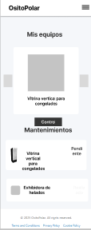
  <figcaption style="font-size: 0.9em; color: #555;">
    <strong>Figura 17:</strong> Wireframe - Mis Equipos (Clientes, Detalle 1).
  </figcaption>
</figure>

<figure style="page-break-inside: avoid; text-align: center;">
  
  <figcaption style="font-size: 0.9em; color: #555;">
    <strong>Figura 18:</strong> Wireframe - Mis Equipos (Clientes, Detalle 2).
  </figcaption>
</figure>

<figure style="page-break-inside: avoid; text-align: center;">
  
  <figcaption style="font-size: 0.9em; color: #555;">
    <strong>Figura 19:</strong> Wireframe - Mis Equipos (Empresa).
  </figcaption>
</figure>

<figure style="page-break-inside: avoid; text-align: center;">
  
  <figcaption style="font-size: 0.9em; color: #555;">
    <strong>Figura 20:</strong> Wireframe - Notificaciones (Clientes).
  </figcaption>
</figure>

<figure style="page-break-inside: avoid; text-align: center;">
  
  <figcaption style="font-size: 0.9em; color: #555;">
    <strong>Figura 21:</strong> Wireframe - Notificaciones (Empresa).
  </figcaption>
</figure>

<figure style="page-break-inside: avoid; text-align: center;">
  
  <figcaption style="font-size: 0.9em; color: #555;">
    <strong>Figura 22:</strong> Wireframe - Registro (Clientes).
  </figcaption>
</figure>

<figure style="page-break-inside: avoid; text-align: center;">
  
  <figcaption style="font-size: 0.9em; color: #555;">
    <strong>Figura 23:</strong> Wireframe - Registro (Empresa).
  </figcaption>
</figure>

<figure style="page-break-inside: avoid; text-align: center;">
  
  <figcaption style="font-size: 0.9em; color: #555;">
    <strong>Figura 24:</strong> Wireframe - Solicitudes (Empresa).
  </figcaption>
</figure>

<figure style="page-break-inside: avoid; text-align: center;">
  
  <figcaption style="font-size: 0.9em; color: #555;">
    <strong>Figura 25:</strong> Wireframe - Órdenes de Trabajo (Empresa).
  </figcaption>
</figure>


#### 4.4.2. Mobile Applications Wireflow Diagrams
En esta sección se presentan los Wireflows para cada objetivo del usuario, teniendo en cuenta los User Personas relevantes. Cada diagrama ilustra el flujo de interacción del usuario y cómo las acciones realizadas afectan las pantallas dentro de la aplicación.


### **User Goal 1**: 
Como dueño de un negocio que utiliza equipos de refrigeración quiero estar pendiente del estado de cada equipo registrado.

**Task Flow**
<figure style="page-break-inside: avoid; text-align: center;">
  
  <figcaption style="font-size: 0.9em; color: #555;">
    <strong>Figura 1:</strong> Taskflow 1.
  </figcaption>
</figure>


**Wireflow**
<figure style="page-break-inside: avoid; text-align: center;">
  
  <figcaption style="font-size: 0.9em; color: #555;">
    <strong>Figura 2:</strong> Wireflow 1.
  </figcaption>
</figure>


### **User Goal 2**:
Como dueño de un negocio que utiliza equipos de refrigeración quiero lograr administrar los nuevos equipos que registre.

**Task Flow**
<figure style="page-break-inside: avoid; text-align: center;">
  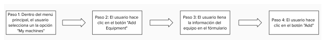
  <figcaption style="font-size: 0.9em; color: #555;">
    <strong>Figura 3:</strong> Taskflow 2.
  </figcaption>
</figure>


**Wireflow**
<figure style="page-break-inside: avoid; text-align: center;">
  
  <figcaption style="font-size: 0.9em; color: #555;">
    <strong>Figura 4:</strong> Wireflow 2.
  </figcaption>
</figure>


### **User Goal 3**:
Como dueño de un negocio que utiliza equipos de refrigeración quiero revisar las estadísticas completas de mis equipos.

**Task Flow**
<figure style="page-break-inside: avoid; text-align: center;">
  
  <figcaption style="font-size: 0.9em; color: #555;">
    <strong>Figura 5:</strong> Taskflow 3.
  </figcaption>
</figure>


**Wireflow**
<figure style="page-break-inside: avoid; text-align: center;">
  
  <figcaption style="font-size: 0.9em; color: #555;">
    <strong>Figura 6:</strong> Wireflow 3.
  </figcaption>
</figure>


### **User Goal 4**:
Como dueño de un negocio que utiliza equipos de refrigeración quiero pedir nuevos equipos a un proveedor de manera sencilla.

**Task Flow**
<figure style="page-break-inside: avoid; text-align: center;">
  
  <figcaption style="font-size: 0.9em; color: #555;">
    <strong>Figura 7:</strong> Taskflow 4.
  </figcaption>
</figure>


**Wireflow**
<figure style="page-break-inside: avoid; text-align: center;">
  
  <figcaption style="font-size: 0.9em; color: #555;">
    <strong>Figura 8:</strong> Wireflow 4.
  </figcaption>
</figure>


### **User Goal 5**:
Como proveedor de equipos de refrigeración quiero estar pendiente de los ordenes de pedios de mis clientes.

**Task Flow**
<figure style="page-break-inside: avoid; text-align: center;">
  
  <figcaption style="font-size: 0.9em; color: #555;">
    <strong>Figura 9:</strong> Taskflow 5.
  </figcaption>
</figure>


**Wireflow**
<figure style="page-break-inside: avoid; text-align: center;">
  
  <figcaption style="font-size: 0.9em; color: #555;">
    <strong>Figura 10:</strong> Wireflow 5.
  </figcaption>
</figure>


#### 4.4.3. Mobile Applications Mock-ups
En esta sección se presentan y detallan los mock-ups de las aplicaciones de OsitoPolar. Se resalta la aplicación de los principios de diseño, la arquitectura de la información, el diseño inclusivo y el Design System implementado en los productos digitales. Cada mock-up muestra cómo estos conceptos se integran en la interfaz de usuario. A continuación, se mostrarán las maquetas de la aplicación web, que representan visualmente cómo se verá y funcionará la plataforma OsitoPolar. Estas maquetas son fundamentales para comunicar el diseño a los desarrolladores y clientes, asegurando que la experiencia del usuario se alinee con la visión del proyecto.

<figure style="page-break-inside: avoid; text-align: center;">
  
  <figcaption style="font-size: 0.9em; color: #555;">
    <strong>Figura 1:</strong> Mockup - Inicio General de la App.
  </figcaption>
</figure>

<figure style="page-break-inside: avoid; text-align: center;">
  
  <figcaption style="font-size: 0.9em; color: #555;">
    <strong>Figura 2:</strong> Mockup - Registro (Clientes).
  </figcaption>
</figure>

<figure style="page-break-inside: avoid; text-align: center;">
  
  <figcaption style="font-size: 0.9em; color: #555;">
    <strong>Figura 3:</strong> Mockup - Inicio de Sesión (Clientes).
  </figcaption>
</figure>

<figure style="page-break-inside: avoid; text-align: center;">
  
  <figcaption style="font-size: 0.9em; color: #555;">
    <strong>Figura 4:</strong> Mockup - Inicio (Clientes).
  </figcaption>
</figure>

<figure style="page-break-inside: avoid; text-align: center;">
  
  <figcaption style="font-size: 0.9em; color: #555;">
    <strong>Figura 5:</strong> Mockup - Mis Equipos (Clientes).
  </figcaption>
</figure>

<figure style="page-break-inside: avoid; text-align: center;">
  
  <figcaption style="font-size: 0.9em; color: #555;">
    <strong>Figura 6:</strong> Mockup - Mis Equipos (Clientes, Detalle 1).
  </figcaption>
</figure>

<figure style="page-break-inside: avoid; text-align: center;">
  
  <figcaption style="font-size: 0.9em; color: #555;">
    <strong>Figura 7:</strong> Mockup - Mis Equipos (Clientes, Detalle 2).
  </figcaption>
</figure>

<figure style="page-break-inside: avoid; text-align: center;">
  
  <figcaption style="font-size: 0.9em; color: #555;">
    <strong>Figura 8:</strong> Mockup - Alquilar Equipos (Clientes).
  </figcaption>
</figure>

<figure style="page-break-inside: avoid; text-align: center;">
  
  <figcaption style="font-size: 0.9em; color: #555;">
    <strong>Figura 9:</strong> Mockup - Contacto (Clientes).
  </figcaption>
</figure>

<figure style="page-break-inside: avoid; text-align: center;">
  
  <figcaption style="font-size: 0.9em; color: #555;">
    <strong>Figura 10:</strong> Mockup - Notificaciones (Clientes).
  </figcaption>
</figure>

<figure style="page-break-inside: avoid; text-align: center;">
  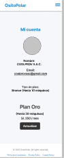
  <figcaption style="font-size: 0.9em; color: #555;">
    <strong>Figura 11:</strong> Mockup - Control (Clientes).
  </figcaption>
</figure>

<figure style="page-break-inside: avoid; text-align: center;">
  
  <figcaption style="font-size: 0.9em; color: #555;">
    <strong>Figura 12:</strong> Mockup - Estado de Cuenta (Clientes).
  </figcaption>
</figure>

<figure style="page-break-inside: avoid; text-align: center;">
  
  <figcaption style="font-size: 0.9em; color: #555;">
    <strong>Figura 13:</strong> Mockup - Mi Cuenta (Clientes).
  </figcaption>
</figure>

<figure style="page-break-inside: avoid; text-align: center;">
  
  <figcaption style="font-size: 0.9em; color: #555;">
    <strong>Figura 14:</strong> Mockup - Analíticas Completas (Clientes).
  </figcaption>
</figure>


- **Mockups Empresa:**

<figure style="page-break-inside: avoid; text-align: center;">
  
  <figcaption style="font-size: 0.9em; color: #555;">
    <strong>Figura 15:</strong> Mockup - Inicio de Sesión (Empresa).
  </figcaption>
</figure>

<figure style="page-break-inside: avoid; text-align: center;">
  
  <figcaption style="font-size: 0.9em; color: #555;">
    <strong>Figura 16:</strong> Mockup - Registro (Empresa).
  </figcaption>
</figure>

<figure style="page-break-inside: avoid; text-align: center;">
  
  <figcaption style="font-size: 0.9em; color: #555;">
    <strong>Figura 17:</strong> Mockup - Inicio (Empresa).
  </figcaption>
</figure>

<figure style="page-break-inside: avoid; text-align: center;">
  
  <figcaption style="font-size: 0.9em; color: #555;">
    <strong>Figura 18:</strong> Mockup - Contacto (Empresa).
  </figcaption>
</figure>

<figure style="page-break-inside: avoid; text-align: center;">
  
  <figcaption style="font-size: 0.9em; color: #555;">
    <strong>Figura 19:</strong> Mockup - Estado de Cuenta (Empresa).
  </figcaption>
</figure>

<figure style="page-break-inside: avoid; text-align: center;">
  
  <figcaption style="font-size: 0.9em; color: #555;">
    <strong>Figura 20:</strong> Mockup - Mi Cuenta (Empresa).
  </figcaption>
</figure>

<figure style="page-break-inside: avoid; text-align: center;">
  
  <figcaption style="font-size: 0.9em; color: #555;">
    <strong>Figura 21:</strong> Mockup - Mis Clientes y Técnicos (Empresa).
  </figcaption>
</figure>

<figure style="page-break-inside: avoid; text-align: center;">
  
  <figcaption style="font-size: 0.9em; color: #555;">
    <strong>Figura 22:</strong> Mockup - Mis Equipos (Empresa).
  </figcaption>
</figure>

<figure style="page-break-inside: avoid; text-align: center;">
  
  <figcaption style="font-size: 0.9em; color: #555;">
    <strong>Figura 23:</strong> Mockup - Notificaciones (Empresa).
  </figcaption>
</figure>

<figure style="page-break-inside: avoid; text-align: center;">
  
  <figcaption style="font-size: 0.9em; color: #555;">
    <strong>Figura 24:</strong> Mockup - Solicitudes (Empresa).
  </figcaption>
</figure>

<figure style="page-break-inside: avoid; text-align: center;">
  
  <figcaption style="font-size: 0.9em; color: #555;">
    <strong>Figura 25:</strong> Mockup - Órdenes de Trabajo (Empresa).
  </figcaption>
</figure>


Link de los mockups: https://shorturl.at/jMDBY

#### 4.4.4. Mobile Applications User Flow Diagrams
### User Goal 1: 
- Como dueño de un negocio que utiliza equipos de refrigeración quiero estar pendiente del estado de cada equipo registrado.
<p align="center">
</p>

### User Goal 2:
- Como dueño de un negocio que utiliza equipos de refrigeración quiero revisar las estadisticas completas de mis equipos.
<p align="center">
</p>

### User Goal 3:
- Como dueño de un negocio que utiliza equipos de refrigeración quiero lograr administrar los nuevos equipos que registre.
<p align="center">
</p>


### 4.5. Mobile Applications Prototyping
A continuación se presenta el prototipo de la aplicación web de OsitoPolar, el cual permite a los usuarios interactuar con la interfaz y explorar las diversas secciones de la plataforma. Este prototipo incluye las funcionalidades clave y características de la aplicación, proporcionando una vista preliminar de la experiencia del usuario. Además, facilita la evaluación y prueba de la interfaz antes de su implementación final, asegurando que el diseño sea intuitivo y eficiente.
Link del prototipo: https://shorturl.at/oIUJN

#### 4.5.1 Android Mobile Applications Prototyping

#### 4.5.2. iOS Mobile Applications Prototyping.

### 4.6. Web Applications UX/UI Design.

#### 4.6.1. Web Applications Wireframes.

Los wireframes de las aplicaciones web de OsitoPolar delinean la estructura y organización de las pantallas principales, especificando la ubicación de los elementos de la interfaz de usuario y la navegación. Estos esquemas visuales sirven como una guía precisa para el diseño final, asegurando una experiencia de usuario fluida e intuitiva. Los wireframes están enfocados en la funcionalidad y facilidad de uso, permitiendo que diseñadores y desarrolladores visualicen cómo los usuarios interactúan con la aplicación, optimizando la disposición de los elementos para crear una experiencia eficiente y atractiva.

<figure style="page-break-inside: avoid; text-align: center;">
  
  <figcaption style="font-size: 0.9em; color: #555;">
    <strong>Figura 1:</strong> Wireframe - Alquilar Equipos (Clientes).
  </figcaption>
</figure>


<figure style="page-break-inside: avoid; text-align: center;">
  
  <figcaption style="font-size: 0.9em; color: #555;">
    <strong>Figura 2:</strong> Wireframe - Contacto (Clientes).
  </figcaption>
</figure>

<figure style="page-break-inside: avoid; text-align: center;">
  
  <figcaption style="font-size: 0.9em; color: #555;">
    <strong>Figura 3:</strong> Wireframe - Contacto (Empresa).
  </figcaption>
</figure>

<figure style="page-break-inside: avoid; text-align: center;">
  
  <figcaption style="font-size: 0.9em; color: #555;">
    <strong>Figura 4:</strong> Wireframe - Control (Clientes).
  </figcaption>
</figure>

<figure style="page-break-inside: avoid; text-align: center;">
  
  <figcaption style="font-size: 0.9em; color: #555;">
    <strong>Figura 5:</strong> Wireframe - Estado de Cuenta (Clientes).
  </figcaption>
</figure>

<figure style="page-break-inside: avoid; text-align: center;">
  
  <figcaption style="font-size: 0.9em; color: #555;">
    <strong>Figura 6:</strong> Wireframe - Estado de Cuenta (Empresa).
  </figcaption>
</figure>

<figure style="page-break-inside: avoid; text-align: center;">
  
  <figcaption style="font-size: 0.9em; color: #555;">
    <strong>Figura 7:</strong> Wireframe - Analíticas Completas (Clientes).
  </figcaption>
</figure>

<figure style="page-break-inside: avoid; text-align: center;">
  
  <figcaption style="font-size: 0.9em; color: #555;">
    <strong>Figura 8:</strong> Wireframe - Inicio (Clientes).
  </figcaption>
</figure>

<figure style="page-break-inside: avoid; text-align: center;">
  
  <figcaption style="font-size: 0.9em; color: #555;">
    <strong>Figura 9:</strong> Wireframe - Inicio (Empresa).
  </figcaption>
</figure>

<figure style="page-break-inside: avoid; text-align: center;">
  
  <figcaption style="font-size: 0.9em; color: #555;">
    <strong>Figura 10:</strong> Wireframe - Inicio de la Aplicación.
  </figcaption>
</figure>

<figure style="page-break-inside: avoid; text-align: center;">
  
  <figcaption style="font-size: 0.9em; color: #555;">
    <strong>Figura 11:</strong> Wireframe - Inicio de Sesión (Clientes).
  </figcaption>
</figure>

<figure style="page-break-inside: avoid; text-align: center;">
  
  <figcaption style="font-size: 0.9em; color: #555;">
    <strong>Figura 12:</strong> Wireframe - Inicio de Sesión (Empresa).
  </figcaption>
</figure>

<figure style="page-break-inside: avoid; text-align: center;">
  
  <figcaption style="font-size: 0.9em; color: #555;">
    <strong>Figura 13:</strong> Wireframe - Mi Cuenta (Clientes).
  </figcaption>
</figure>

<figure style="page-break-inside: avoid; text-align: center;">
  
  <figcaption style="font-size: 0.9em; color: #555;">
    <strong>Figura 14:</strong> Wireframe - Mi Cuenta (Empresa).
  </figcaption>
</figure>

<figure style="page-break-inside: avoid; text-align: center;">
  
  <figcaption style="font-size: 0.9em; color: #555;">
    <strong>Figura 15:</strong> Wireframe - Mis Clientes y Técnicos (Empresa).
  </figcaption>
</figure>

<figure style="page-break-inside: avoid; text-align: center;">
  
  <figcaption style="font-size: 0.9em; color: #555;">
    <strong>Figura 16:</strong> Wireframe - Mis Equipos (Clientes).
  </figcaption>
</figure>

<figure style="page-break-inside: avoid; text-align: center;">
  
  <figcaption style="font-size: 0.9em; color: #555;">
    <strong>Figura 17:</strong> Wireframe - Mis Equipos (Clientes, Detalle 1).
  </figcaption>
</figure>

<figure style="page-break-inside: avoid; text-align: center;">
  
  <figcaption style="font-size: 0.9em; color: #555;">
    <strong>Figura 18:</strong> Wireframe - Mis Equipos (Clientes, Detalle 2).
  </figcaption>
</figure>

<figure style="page-break-inside: avoid; text-align: center;">
  
  <figcaption style="font-size: 0.9em; color: #555;">
    <strong>Figura 19:</strong> Wireframe - Mis Equipos (Empresa).
  </figcaption>
</figure>

<figure style="page-break-inside: avoid; text-align: center;">
  
  <figcaption style="font-size: 0.9em; color: #555;">
    <strong>Figura 20:</strong> Wireframe - Notificaciones (Clientes).
  </figcaption>
</figure>

<figure style="page-break-inside: avoid; text-align: center;">
  
  <figcaption style="font-size: 0.9em; color: #555;">
    <strong>Figura 21:</strong> Wireframe - Notificaciones (Empresa).
  </figcaption>
</figure>

<figure style="page-break-inside: avoid; text-align: center;">
  
  <figcaption style="font-size: 0.9em; color: #555;">
    <strong>Figura 22:</strong> Wireframe - Registro (Clientes).
  </figcaption>
</figure>

<figure style="page-break-inside: avoid; text-align: center;">
  
  <figcaption style="font-size: 0.9em; color: #555;">
    <strong>Figura 23:</strong> Wireframe - Registro (Empresa).
  </figcaption>
</figure>

<figure style="page-break-inside: avoid; text-align: center;">
  
  <figcaption style="font-size: 0.9em; color: #555;">
    <strong>Figura 24:</strong> Wireframe - Solicitudes (Empresa).
  </figcaption>
</figure>

<figure style="page-break-inside: avoid; text-align: center;">
  
  <figcaption style="font-size: 0.9em; color: #555;">
    <strong>Figura 25:</strong> Wireframe - Órdenes de Trabajo (Empresa).
  </figcaption>
</figure>


#### 4.6.2. Web Applications Wireflow Diagrams

En esta sección se presentan los Wireflows para cada objetivo del usuario, teniendo en cuenta los User Personas relevantes. Cada diagrama ilustra el flujo de interacción del usuario y cómo las acciones realizadas afectan las pantallas dentro de la aplicación.

### **User Goal 1**: 
Como dueño de un negocio que utiliza equipos de refrigeración quiero estar pendiente del estado de cada equipo registrado.

**Task Flow**
<figure style="page-break-inside: avoid; text-align: center;">
  
  <figcaption style="font-size: 0.9em; color: #555;">
    <strong>Figura 1:</strong> Taskflow 1.
  </figcaption>
</figure>


**Wireflow**
<figure style="page-break-inside: avoid; text-align: center;">
  
  <figcaption style="font-size: 0.9em; color: #555;">
    <strong>Figura 2:</strong> Wireflow 1.
  </figcaption>
</figure>


### **User Goal 2**:
Como dueño de un negocio que utiliza equipos de refrigeración quiero lograr administrar los nuevos equipos que registre.

**Task Flow**
<figure style="page-break-inside: avoid; text-align: center;">
  
  <figcaption style="font-size: 0.9em; color: #555;">
    <strong>Figura 3:</strong> Taskflow 2.
  </figcaption>
</figure>


**Wireflow**
<figure style="page-break-inside: avoid; text-align: center;">
  
  <figcaption style="font-size: 0.9em; color: #555;">
    <strong>Figura 4:</strong> Wireflow 2.
  </figcaption>
</figure>


### **User Goal 3**:
Como dueño de un negocio que utiliza equipos de refrigeración quiero revisar las estadísticas completas de mis equipos.

**Task Flow**
<figure style="page-break-inside: avoid; text-align: center;">
  
  <figcaption style="font-size: 0.9em; color: #555;">
    <strong>Figura 5:</strong> Taskflow 3.
  </figcaption>
</figure>


**Wireflow**
<figure style="page-break-inside: avoid; text-align: center;">
  
  <figcaption style="font-size: 0.9em; color: #555;">
    <strong>Figura 6:</strong> Wireflow 3.
  </figcaption>
</figure>


### **User Goal 4**:
Como dueño de un negocio que utiliza equipos de refrigeración quiero pedir nuevos equipos a un proveedor de manera sencilla.

**Task Flow**
<figure style="page-break-inside: avoid; text-align: center;">
  
  <figcaption style="font-size: 0.9em; color: #555;">
    <strong>Figura 7:</strong> Taskflow 4.
  </figcaption>
</figure>


**Wireflow**
<figure style="page-break-inside: avoid; text-align: center;">
  
  <figcaption style="font-size: 0.9em; color: #555;">
    <strong>Figura 8:</strong> Wireflow 4.
  </figcaption>
</figure>


### **User Goal 5**:
Como proveedor de equipos de refrigeración quiero estar pendiente de los ordenes de pedios de mis clientes.

**Task Flow**
<figure style="page-break-inside: avoid; text-align: center;">
  
  <figcaption style="font-size: 0.9em; color: #555;">
    <strong>Figura 9:</strong> Taskflow 5.
  </figcaption>
</figure>


**Wireflow**
<figure style="page-break-inside: avoid; text-align: center;">
  
  <figcaption style="font-size: 0.9em; color: #555;">
    <strong>Figura 10:</strong> Wireflow 5.
  </figcaption>
</figure>

#### 4.6.3. Web Applications Mock-ups.

En esta sección se presentan y detallan los mock-ups de las aplicaciones de OsitoPolar. Se resalta la aplicación de los principios de diseño, la arquitectura de la información, el diseño inclusivo y el Design System implementado en los productos digitales. Cada mock-up muestra cómo estos conceptos se integran en la interfaz de usuario. A continuación, se mostrarán las maquetas de la aplicación web, que representan visualmente cómo se verá y funcionará la plataforma OsitoPolar. Estas maquetas son fundamentales para comunicar el diseño a los desarrolladores y clientes, asegurando que la experiencia del usuario se alinee con la visión del proyecto.

<figure style="page-break-inside: avoid; text-align: center;">
  
  <figcaption style="font-size: 0.9em; color: #555;">
    <strong>Figura 1:</strong> Mockup - Inicio General de la App.
  </figcaption>
</figure>

<figure style="page-break-inside: avoid; text-align: center;">
  
  <figcaption style="font-size: 0.9em; color: #555;">
    <strong>Figura 2:</strong> Mockup - Registro (Clientes).
  </figcaption>
</figure>

<figure style="page-break-inside: avoid; text-align: center;">
  
  <figcaption style="font-size: 0.9em; color: #555;">
    <strong>Figura 3:</strong> Mockup - Inicio de Sesión (Clientes).
  </figcaption>
</figure>

<figure style="page-break-inside: avoid; text-align: center;">
  
  <figcaption style="font-size: 0.9em; color: #555;">
    <strong>Figura 4:</strong> Mockup - Inicio (Clientes).
  </figcaption>
</figure>

<figure style="page-break-inside: avoid; text-align: center;">
  
  <figcaption style="font-size: 0.9em; color: #555;">
    <strong>Figura 5:</strong> Mockup - Mis Equipos (Clientes).
  </figcaption>
</figure>

<figure style="page-break-inside: avoid; text-align: center;">
  
  <figcaption style="font-size: 0.9em; color: #555;">
    <strong>Figura 6:</strong> Mockup - Mis Equipos (Clientes, Detalle 1).
  </figcaption>
</figure>

<figure style="page-break-inside: avoid; text-align: center;">
  
  <figcaption style="font-size: 0.9em; color: #555;">
    <strong>Figura 7:</strong> Mockup - Mis Equipos (Clientes, Detalle 2).
  </figcaption>
</figure>

<figure style="page-break-inside: avoid; text-align: center;">
  
  <figcaption style="font-size: 0.9em; color: #555;">
    <strong>Figura 8:</strong> Mockup - Alquilar Equipos (Clientes).
  </figcaption>
</figure>

<figure style="page-break-inside: avoid; text-align: center;">
  
  <figcaption style="font-size: 0.9em; color: #555;">
    <strong>Figura 9:</strong> Mockup - Contacto (Clientes).
  </figcaption>
</figure>

<figure style="page-break-inside: avoid; text-align: center;">
  
  <figcaption style="font-size: 0.9em; color: #555;">
    <strong>Figura 10:</strong> Mockup - Notificaciones (Clientes).
  </figcaption>
</figure>

<figure style="page-break-inside: avoid; text-align: center;">
  
  <figcaption style="font-size: 0.9em; color: #555;">
    <strong>Figura 11:</strong> Mockup - Control (Clientes).
  </figcaption>
</figure>

<figure style="page-break-inside: avoid; text-align: center;">
  
  <figcaption style="font-size: 0.9em; color: #555;">
    <strong>Figura 12:</strong> Mockup - Estado de Cuenta (Clientes).
  </figcaption>
</figure>

<figure style="page-break-inside: avoid; text-align: center;">
  
  <figcaption style="font-size: 0.9em; color: #555;">
    <strong>Figura 13:</strong> Mockup - Mi Cuenta (Clientes).
  </figcaption>
</figure>

<figure style="page-break-inside: avoid; text-align: center;">
  
  <figcaption style="font-size: 0.9em; color: #555;">
    <strong>Figura 14:</strong> Mockup - Analíticas Completas (Clientes).
  </figcaption>
</figure>


- **Mockups Empresa:**

<figure style="page-break-inside: avoid; text-align: center;">
  
  <figcaption style="font-size: 0.9em; color: #555;">
    <strong>Figura 15:</strong> Mockup - Inicio de Sesión (Empresa).
  </figcaption>
</figure>

<figure style="page-break-inside: avoid; text-align: center;">
  
  <figcaption style="font-size: 0.9em; color: #555;">
    <strong>Figura 16:</strong> Mockup - Registro (Empresa).
  </figcaption>
</figure>

<figure style="page-break-inside: avoid; text-align: center;">
  
  <figcaption style="font-size: 0.9em; color: #555;">
    <strong>Figura 17:</strong> Mockup - Inicio (Empresa).
  </figcaption>
</figure>

<figure style="page-break-inside: avoid; text-align: center;">
  
  <figcaption style="font-size: 0.9em; color: #555;">
    <strong>Figura 18:</strong> Mockup - Contacto (Empresa).
  </figcaption>
</figure>

<figure style="page-break-inside: avoid; text-align: center;">
  
  <figcaption style="font-size: 0.9em; color: #555;">
    <strong>Figura 19:</strong> Mockup - Estado de Cuenta (Empresa).
  </figcaption>
</figure>

<figure style="page-break-inside: avoid; text-align: center;">
  
  <figcaption style="font-size: 0.9em; color: #555;">
    <strong>Figura 20:</strong> Mockup - Mi Cuenta (Empresa).
  </figcaption>
</figure>

<figure style="page-break-inside: avoid; text-align: center;">
  
  <figcaption style="font-size: 0.9em; color: #555;">
    <strong>Figura 21:</strong> Mockup - Mis Clientes y Técnicos (Empresa).
  </figcaption>
</figure>

<figure style="page-break-inside: avoid; text-align: center;">
  
  <figcaption style="font-size: 0.9em; color: #555;">
    <strong>Figura 22:</strong> Mockup - Mis Equipos (Empresa).
  </figcaption>
</figure>

<figure style="page-break-inside: avoid; text-align: center;">
  
  <figcaption style="font-size: 0.9em; color: #555;">
    <strong>Figura 23:</strong> Mockup - Notificaciones (Empresa).
  </figcaption>
</figure>

<figure style="page-break-inside: avoid; text-align: center;">
  
  <figcaption style="font-size: 0.9em; color: #555;">
    <strong>Figura 24:</strong> Mockup - Solicitudes (Empresa).
  </figcaption>
</figure>

<figure style="page-break-inside: avoid; text-align: center;">
  
  <figcaption style="font-size: 0.9em; color: #555;">
    <strong>Figura 25:</strong> Mockup - Órdenes de Trabajo (Empresa).
  </figcaption>
</figure>


Link de los mockups: https://shorturl.at/jMDBY

#### 4.6.4. Web Applications User Flow Diagrams.
### User Goal 1: 
- Como dueño de un negocio que utiliza equipos de refrigeración quiero estar pendiente del estado de cada equipo registrado.
<p align="center">
</p>

### User Goal 2:
- Como dueño de un negocio que utiliza equipos de refrigeración quiero revisar las estadisticas completas de mis equipos.
<p align="center">
</p>

### User Goal 3:
- Como dueño de un negocio que utiliza equipos de refrigeración quiero lograr administrar los nuevos equipos que registre.
<p align="center">
</p>


### 4.7. Web Applications Prototyping.

A continuación se presenta el prototipo de la aplicación web de OsitoPolar, el cual permite a los usuarios interactuar con la interfaz y explorar las diversas secciones de la plataforma. Este prototipo incluye las funcionalidades clave y características de la aplicación, proporcionando una vista preliminar de la experiencia del usuario. Además, facilita la evaluación y prueba de la interfaz antes de su implementación final, asegurando que el diseño sea intuitivo y eficiente.
Link del prototipo: https://shorturl.at/oIUJN

 
### 4.8 Domain Driven Software Architecture
En esta sección se presenta la arquitectura de software basada en el dominio para OsitoPolar. Se detallan los diferentes diagramas que ilustran la estructura y organización del sistema, así como los componentes clave que lo integran, mostrando cómo se interconectan para proporcionar una solución eficiente y escalable.

#### 4.8.1. Software Architecture Context Diagram
Este diagrama muestra cómo interactúan los usuarios (Clientes y Empresas Proveedoras) con OsitoPolar. Los usuarios usan la plataforma para gestionar y monitorear equipos de refrigeración. Además, OsitoPolar se conecta con los servicios de correo para enviar notificaciones y con el servicio de pago para procesar transacciones.


#### 4.8.2. Software Architecture Container Diagrams
Este diagrama ilustra los diferentes contenedores dentro de OsitoPolar y cómo interactúan entre sí. Los contenedores representan las diferentes capas y servicios que componen la plataforma, como la interfaz de usuario (webapp), la API y la base de datos.

<p align="center">
</p>

#### 4.8.3. Software Architecture Components Diagrams

**Mi Equipo Bounded Context**

Este diagrama representa los componentes encargados de la gestión de equipos. Los usuarios pueden agregar equipos, monitorearlos en tiempo real y ver el estado de los mismos.


**Notificaciones Bounded Context**

Este diagrama describe los componentes que gestionan las notificaciones, esenciales para mantener a los usuarios informados sobre el estado de los equipos y otros eventos importantes.


**Ordenes de trabajo Bounded Context**

Este diagrama se centra en la gestión de las órdenes de trabajo. Aquí se muestran los componentes involucrados en el proceso de crear, gestionar y completar órdenes de trabajo.


### 4.9. Software Object-Oriented Design.
En esta sección se presenta el diseño de software orientado a objetos para OsitoPolar. Se incluyen diagramas de clases y un diccionario de clases que detallan la estructura y los atributos de las principales entidades del sistema, ofreciendo una visión clara de cómo se organizan y gestionan los componentes clave dentro de la plataforma.

#### 4.9.1. Class Diagrams.

El diagrama de clases proporciona una representación visual de las clases del sistema, sus atributos y las relaciones entre ellas.

<p align="center">
</p>

#### 4.9.2. Class Dictionary.

## Clase: Solicitud
| Nº | Nombre de atributo | Descripción                                              | Tipo de dato      |
|----|--------------------|----------------------------------------------------------|-------------------|
| 1  | name_equipo        | Almacena el nombre del equipo solicitado.                | Equipo            |
| 2  | name_usuario       | Almacena el nombre del usuario que realiza la solicitud. | Usuario           |
| 3  | orden              | Almacena el número de orden de la solicitud.             | unsigned long int |
| 4  | description        | Almacena la descripción de la solicitud.                 | varchar           |
| 5  | time               | Almacena el tiempo estimado o requerido.                 | float             |
| 6  | status             | Almacena el estado de la solicitud.                      | char              |

## Clase: Equipo
| Nº | Nombre de atributo | Descripción                             | Tipo de dato      |
|----|--------------------|-----------------------------------------|-------------------|
| 1  | name               | Almacena el nombre del equipo.          | string            |
| 2  | cost               | Almacena el costo del equipo.           | float             |
| 3  | details_tecnicos   | Almacena detalles técnicos del equipo.  | varchar           |
| 4  | serie              | Almacena el número de serie del equipo. | unsigned long int |
| 5  | code               | Almacena el código del equipo.          | unsigned long int |
| 6  | status             | Almacena el estado del equipo.          | char              |
| 7  | notes              | Almacena notas adicionales del equipo.  | varchar           |

## Clase: Cliente
| Nº | Nombre de atributo | Descripción                                | Tipo de dato |
|----|--------------------|--------------------------------------------|--------------|
| 1  | name               | Almacena el nombre del cliente.            | string       |
| 2  | email              | Almacena el correo del cliente.            | string       |
| 3  | password           | Almacena la contraseña del cliente.        | string       |
| 4  | username           | Almacena el nombre de usuario del cliente. | string       |
| 5  | phone              | Almacena el teléfono del cliente.          | string       |
| 6  | user_type          | Almacena el tipo de usuario.               | char         |

## Clase: Company
| Nº | Nombre de atributo | Descripción                                     | Tipo de dato |
|----|--------------------|-------------------------------------------------|--------------|
| 1  | name               | Almacena el nombre de la empresa.               | string       |
| 2  | email              | Almacena el correo electrónico de la empresa.   | string       |
| 3  | password           | Almacena la contraseña de la empresa.           | string       |
| 4  | username           | Almacena el nombre de usuario de la empresa.    | string       |
| 5  | plan               | Almacena el tipo de plan que posee la empresa.  | char         |
| 6  | phone              | Almacena el teléfono de contacto de la empresa. | string       |
| 7  | business_type      | Almacena el tipo de negocio de la empresa.      | char         |
| 8  | location           | Almacena la ubicación física de la empresa.     | string       |

##  Clase: Cuenta
| Nº | Nombre de atributo | Descripción                                         | Tipo de dato |
|----|--------------------|-----------------------------------------------------|--------------|
| 1  | name (company)     | Almacena el nombre de la empresa asociada.          | Company      |
| 2  | name (usuario)     | Almacena el nombre del usuario asociado.            | Usuario      |
| 3  | cost               | Almacena el costo del equipo vinculado a la cuenta. | Equipo       |
| 4  | status             | Almacena el estado de la cuenta.                    | char         |

##  Clase: Mantenimiento
| Nº | Nombre de atributo | Descripción                                     | Tipo de dato |
|----|--------------------|-------------------------------------------------|--------------|
| 1  | name               | Almacena el nombre del equipo en mantenimiento. | Equipo       |
| 2  | status             | Almacena el estado del mantenimiento.           | char         |

##  Clase: Notificación
| Nº | Nombre de atributo | Descripción                                                  | Tipo de dato |
|----|--------------------|--------------------------------------------------------------|--------------|
| 1  | name               | Almacena el nombre de la notificación.                       | varchar      |
| 2  | description        | Almacena la descripción de la notificación.                  | varchar      |
| 3  | name_company       | Almacena el nombre de la empresa asociada a la notificación. | Company      |
| 4  | name_cliente       | Almacena el nombre del cliente destinatario.                 | Cliente      |
| 5  | status             | Indica si la notificación ha sido leída o procesada.         | bool         |

### 4.10. Database Design.

Esta sección presenta la estructura lógica del sistema desde el punto de vista de almacenamiento y organización de los datos. Se describen las entidades principales del sistema, sus atributos, tipos de datos y relaciones entre ellas. El modelo de base de datos ha sido diseñado para garantizar integridad, consistencia y eficiencia en el acceso a la información.


#### 4.10.1. Relational/Non-Relational Database Diagram.

El diagrama de base de datos ilustra gráficamente cómo se relacionan las tablas dentro del sistema, incluyendo sus claves primarias, claves foráneas y los tipos de relaciones existentes (uno a uno, uno a muchos o muchos a muchos).

<p align="center">
</p>

## Capítulo V: Product Implementation, Validation & Deployment <a id="c5"></a>

### 5.1. Software Configuration Management
#### 5.1.1. Software Development Environment Configuration

### Project Management

Para la administración del proyecto se recurrió al uso de herramientas de comunicación y control de versiones. Se creó una organización en GitHub para centralizar la gestión del código fuente y su versionado. En cuanto a la comunicación interna y las reuniones del equipo, se utilizó Discord.

**Organización del trabajo:** Github

**Reuniones:** Discord

**Comunicación:** Whatsapp

**Planificación y asignación de tareas:** Trello

**Enlaces**

- Github: https://github.com/
- Discord: https://discord.com/
- Trello: https://trello.com/


### Requirement Management

Para esta fase, se implementaron soluciones personalizadas que facilitaron la recolección, organización y priorización de los requisitos del proyecto.
Se utilizó Trello como una herramienta visual para gestionar tareas mediante tableros personalizados.
Se utilizó UXPressia para poder desarrollar los user personas, empathy maps, journey maps y lean UX canvas.
Se utilizó Miro para el desarrollo de los As-Is y To-Be Scenarios.


**Enlaces**

- Trello: https://trello.com/
- UXPressia: https://uxpressia.com/
- Miro: https://miro.com/es/


### Product UX/UI Design
En el diseño de la experiencia e interfaz de usuario, el equipo utilizó Figma para la creación de wireframes, mockups y prototipos interactivos, lo que permitió validar la propuesta de diseño antes de la implementación.

**Enlaces**
- Figma: https://www.figma.com/

### Software Development
Para el desarrollo de la Landing Page se usaron los lenguajes HTML, CSS y JavaScript en Visual Studio Code. La elaboración del informe se realizó en archivos .md en IDEs como IntelliJ IDEA y Rider (cada miembro del equipo trabajó en alguna de estas herramientas).
Para descargar, instalar y actualizar fácilmente estas IDEs utilizamos la aplicación de gestión JetBrains ToolBox.

**Enlaces**
- JetBrains ToolBox: https://www.jetbrains.com/toolbox-app/
- Visual Studio Code: https://code.visualstudio.com/


### Software Documentation
Para el control de versiones y la colaboración en el desarrollo del informe, se utilizó GitHub siguiendo la estrategia de trabajo GitHub Flow. Esta metodología permitió una gestión eficiente y ordenada del proyecto mediante el uso de ramas específicas para cada funcionalidad o corrección, lo que facilitó el trabajo colaborativo. Todo el contenido del proyecto fue centralizado y almacenado en un repositorio dentro de una organización creada en GitHub.
Para la documentación técnica del proyecto se optó por el uso de archivos en formato Markdown, debido a su simplicidad, legibilidad y excelente compatibilidad con GitHub.

**Enlaces**
- GitHub: https://github.com/

### Software Deployment
Para el despliegue de la Landing Page se utilizó GitHub Pages, una herramienta perfecta para publicar sitios web estáticos.

**Enlaces**
- GithubPages: https://pages.github.com/


#### 5.1.2. Source Code Management

Modelo de ramas Git Flow: main: rama principal donde siempre está el código estable y listo para producción. develop: rama de desarrollo donde se integran todas las nuevas funcionalidades antes de pasar a producción. feature/: ramas para trabajar nuevas funcionalidades. release/: ramas temporales para preparar una nueva versión estable. hotfix/: ramas para corregir errores en producción.

Versionado semántico (Semantic Versioning): Se aplicará el versionado semántico (Semantic Versioning 2.0.0), siguiendo el esquema: MAJOR.MINOR.PATCH.
1.0.0 → versión estable inicial

1.1.0 → agregaste nuevas funcionalidades

1.1.1 → arreglos de bugs

Convención de mensajes de commits El equipo seguirá la convención de mensajes de commits definida en “Conventional Commits”.
Ejemplos de mensajes:

- feat: agregar nuevo sistema de login
- fix: corregir validación en formulario de registro
- docs: actualizar README con instrucciones de despliegue

Nomenclatura de numeración de las versiones: Major changes: Cuando el código o versión nueva del proyecto a implementar presenta cambios significativos con la versión anterior, estos cambios llegan a ser incompatibles con la versión anterior. Minor changes: Cuando el código o versión nueva del proyecto a implementar presenta cambios con respecto a alguna característica Patch: Cuando se solucionan bugs menores.


**Repositorio de Github:**
- Enlace para acceder a la [organización en Github](https://github.com/Inteligencia-Artesanal-Aplicaciones-Web)
- Enlace para acceder al repositorio de la [Landing Page](https://github.com/Inteligencia-Artesanal-Aplicaciones-Web/Landing-Page)
- Enlace para acceder al repositorio del [Informe](https://github.com/Inteligencia-Artesanal-Aplicaciones-Web/upc-AppWeb-Inteligencia-Artesanal-Report)

**Flujo de trabajo de GitFlow**
El flujo de trabajo se basará en un modelo de ramas Git Flow, el cuál se basa en la creación de ramas específicas para cada funcionalidad o corrección de errores. El modelo de "A succesful Git branching model"

--Insertar imagen

**Estructura de branches (Ramas):**


1. **Master branch (Rama principal):** Es la rama principal del proyecto, donde se almacena el código estable y listo para producción. Solo se integrarán cambios que hayan sido probados y validados previamente en las ramas de desarrollo y funcionalidad.

2. **Develop Branch (Rama de Desarrollo):** Esta rama actúa como un espacio de integración para el trabajo en equipo, permitiendo pruebas y ajustes de las nuevas funcionalidades antes de fusionarlas con la rama principal. Garantiza que el código sea funcional y estable.

3. **Feature branch (Ramas de funcionalidad):** Cada nueva funcionalidad o tarea específica se desarrollará en su propia rama. Una vez completada y probada, se integrará en la rama de desarrollo. Las ramas de funcionalidad seguirán un esquema de nombres descriptivos, como por ejemplo: `feature/chapter-01`.

#### 5.1.3. Source Code Style Guide & Conventions

El equipo adoptará nomenclatura en inglés para todas las variables, funciones, clases y archivos del proyecto, con el objetivo de mantener flexibilidad, escalabilidad y coherencia en el desarrollo. HTML / CSS Se sigue el Google HTML/CSS Style Guide.

Las clases CSS estarán en kebab-case (.main-header, .card-title).

Se utilizarán etiquetas semánticas

- &lt;header&gt;
- &lt;section&gt;
- &lt;article&gt;

Identificadores claros y descriptivos para accesibilidad y mantenimiento.

Se usó diferentes etiquetas para conformar la estructura del Landing Page del producto:

- header: Define todo el contenido introductorio de la página web.

- nav: Define las secciones de la página que estarán dedicadas a la navegación en la página.

- div: Esta etiqueta permite la separación de diferentes objetos dentro de nuestra página, esto nos permitió poder aplicar hojas de estilo específicas para cada parte de los objetos.

- img: Esta etiqueta permite la inserción de imágenes en la página web, se usó en diversas ocasiones dentro de la página.

- ul: Esta etiqueta sirve para definir una lista desordenada, mayormente se usó para la elaboración del menú interactivo de la página.

- li: Sirve para definir los elementos de las listas que se implementaron en la página, más especifico en la barra de búsqueda y el blog.

- a: Se usó para definir hipervínculos para mover a los usuarios a través de las diferentes secciones de la página.

- p: Definen los párrafos de texto, separándolos del resto de contenido.

- button: Declaran un botón interactivo modificable que permite a los usuarios realizar una acción en específico.

- h1 - h4: Definen los diferentes títulos y subtítulos de la página siendo h1 el mayor nivel y h4 el más bajo.


#### 5.1.4. Software Deployment Configuration


### Landing page deployment:
Para desplegar la landing page, es necesario cumplir con ciertos requisitos previos, como contar con una cuenta personal, una organización y un repositorio donde se alojarán los archivos. Una vez cumplidos estos requisitos, se pueden seguir los pasos detallados a continuación para realizar el despliegue:

1. Verificar que los archivos principales se encuentren en la raíz (root) del repositorio.
2. Asegurarse de que los archivos sigan las siguientes convenciones de nombres: "index.html" para la página principal, "styles.css" para los estilos, "script.js" para los scripts principales, "languages.js" para gestionar los textos en diferentes idiomas (español e inglés), y una carpeta llamada "assets/images" para las imágenes.
3. Subir los archivos al repositorio mediante un commit.
4. Acceder a la sección Settings > Pages y seleccionar el branch correspondiente, en este caso, "main".
5. Configurar la carpeta raíz (root) como la fuente de la página.
6. Esperar a que GitHub realice las verificaciones necesarias. Una vez finalizado el proceso, se generará un enlace que permitirá acceder a la landing page desplegada.

Adicionalmente, se implementó un archivo "languages.js" que contiene los textos en español e inglés. Este archivo es consumido por el script "main.js", el cual permite realizar el cambio de idioma dinámicamente en la landing page.ations Implementation

### Github Pages:


La URL que nos entrega Github Pages para acceder a la landing page es la siguiente: https://inteligencia-artesanal-aplicaciones-web.github.io/Landing-Page/


### 5.2. Landing Page, Services & Applications Implementation.


En el siguiente enlace se estará mostrando la landing page de la startup:
[Video demostrativo de la landing page](https://upcedupe-my.sharepoint.com/:v:/g/personal/u202223286_upc_edu_pe/EWpS23aHI95KiF5rJXhOyHgBoHAL62jYwnz8m4zMqxkGwA?nav=eyJyZWZlcnJhbEluZm8iOnsicmVmZXJyYWxBcHAiOiJPbmVEcml2ZUZvckJ1c2luZXNzIiwicmVmZXJyYWxBcHBQbGF0Zm9ybSI6IldlYiIsInJlZmVycmFsTW9kZSI6InZpZXciLCJyZWZlcnJhbFZpZXciOiJNeUZpbGVzTGlua0NvcHkifX0&e=bwYjby)

En la sección siguiente se detallará el proceso de implementación, documentación y despliegue del Landing.

#### 5.2.1. Sprint 1
##### 5.2.1.1. Sprint Planning 1
<table>
<tr>
    <th colspan="5">Sprint 1</th>
    <th colspan="9">Sprint 1</th>
  </tr>
      <tr>
    <td colspan="13">Sprint Planning Background</td>
  </tr>
  <tr>
    <td colspan="5">Date</td>
    <td colspan="8">2025-04-22</td>
</tr>
  <tr>
    <td colspan="5">Time</td>
    <td colspan="8">9:45 PM</td>
  </tr>
  <tr>
    <td colspan="5">Location</td>
    <td colspan="8">Via Discord</td>
<tr>
    <td colspan="5">Prepared By</td>
    <td colspan="8">Kenyi Ramirez</td>
</tr>
<tr>
    <td colspan="5">Attendees (to planning meeting)</td>
    <td colspan="8">Joseph Rodriguez, Wilder Aliaga, Victor Rojas, Italo Verona</td>
</tr>
<tr>
    <td colspan="5">Sprint  1 Review Summary</td>
    <td colspan="8">Esta sección se dedicó a mejorar el codigo de la Landing page para poder usarse mejor y tener una estructura clara.</td>
</tr>
<tr>
    <td colspan="5">Sprint 1 Retrospective Summary</td>
    <td colspan="8">En esta sección tuvimos varios aciertos ya que hubieron ideas para integrar lo de los idiomas bastante convicentes pero nos quedamos con una en especifica, poniendo a prueba nuestra resolución de problemas.</td>
</tr>
<tr>
    <td colspan="13">Sprint Goal & User Stories</td>
</tr>
<tr>
    <td colspan="5">Sprint 1 Goal</td>
       <td colspan="8">Nuestro enfoque está en implementar la landing page de OsitoPolar, asegurando su adaptabilidad a diferentes dispositivos, coherencia visual y funcionalidad multilingüe. Creemos que esto ofrece una experiencia de navegación más clara, atractiva y accesible a los usuarios potenciales de nuestra solución. Esto se confirmará cuando los usuarios puedan cambiar el idioma fácilmente desde la interfaz, navegar la página sin errores visuales desde cualquier dispositivo, y se valide que imágenes y textos estén correctamente integrados y espaciados. </td>

</tr>
<tr>
    <td colspan="5">Sprint 1 Velocity</td>
    <td colspan="8">15</td>
<tr>
    <td colspan="5">Sum of Story Points</td>
    <td colspan="8">14</td>
</tr>
</table>

### 5.2.2 Implemented Landing Page Evidence

En esta sección se presentan las evidencias del Landing Page desarrollado por el equipo durante el sprint correspondiente.  
El objetivo principal de esta página es introducir el propósito del producto, captar la atención del usuario y guiarlo hacia el registro o descarga de la aplicación.

**Objetivo del entregable**  
- Mostrar la propuesta de valor del producto y su impacto.  
- Facilitar el acceso al sitio principal y a las plataformas de contacto.  
- Servir como punto de entrada para potenciales usuarios o clientes.  
- Demostrar el cumplimiento de criterios de diseño, responsividad y performance.

**Descripción general**  
El Landing Page fue desarrollado utilizando React + Vite y hospedado en GitHub Pages, siguiendo principios de Responsive Design.  
Se estructuró en secciones informativas claras y con contenido optimizado para SEO:

- Encabezado con logotipo, navegación y botón de registro.  
- Sección “Sobre nosotros” y “Beneficios principales”.  
- Presentación visual del producto (mockups y demostraciones).  
- Testimonios o validaciones de usuarios.  
- Pie de página con enlaces a redes sociales y medios de contacto.  

**Enlaces de despliegue**  
- Sitio en producción: [Landing Page](https://inteligencia-artesanal-aplicaciones-web.github.io/Landing-Page)  
- Repositorio de GitHub: [Repositorio](https://github.com/Inteligencia-Artesanal-Aplicaciones-Web/Landing-Page)

**Evidencias visuales**  
A continuación se muestran las captura de pantalla completa del Landing Page desplegado:


*Todas las capturas corresponden al entorno en producción y fueron tomadas luego del despliegue exitoso en la semana 5.*

**Características técnicas relevantes**  
- Arquitectura basada en componentes reutilizables de React.  
- Implementación de Hooks para manejo de estado y eventos.  
- Uso de TailwindCSS para estilos responsivos y consistentes.  
- Validación de performance con Lighthouse Score ≥ 90.  
- Conexión inicial hacia la API principal mediante endpoints públicos de prueba.  
- Integración continua (CI/CD) con GitHub Actions.

### 5.2.3 Implemented Frontend-Web Application Evidence

En esta sección se presentan las evidencias del Frontend-Web Application desarrollado e implementado durante el sprint correspondiente.  
El propósito principal de este entregable fue construir la interfaz web principal del sistema, permitiendo a los usuarios interactuar de manera intuitiva y fluida con las funcionalidades del producto.

**Objetivo del entregable**  
- Implementar la interfaz principal de la aplicación web con navegación funcional.  
- Mostrar información dinámica obtenida desde el backend y/o base de datos.  
- Validar la correcta comunicación entre los componentes del sistema.  
- Cumplir con los principios de diseño centrado en el usuario y experiencia responsiva.

**Descripción general**  
La aplicación web fue desarrollada con Angular y desplegada en Firebase Hosting, asegurando alta disponibilidad y rendimiento en tiempo real.  
Se aplicaron principios de arquitectura por componentes y buenas prácticas de usabilidad y rendimiento.

Entre las principales características implementadas se incluyen:  
- Sistema de autenticación de usuarios.  
- Secciones dinámicas para visualización de contenido y registro de datos.  
- Integración directa con servicios del backend (API REST y base de datos).  
- Diseño adaptable a distintos tamaños de pantalla.  
- Control de rutas seguras y manejo de estados de sesión.  

**Enlaces de despliegue**  
- Aplicación web en producción: [Frontend Web Application](https://osito-polar-v1.web.app/home)  
- Repositorio de GitHub: [Repositorio](https://github.com/Inteligencia-Artesanal-Aplicaciones-Web/OsitoPolar-Frontend.git)

**Evidencias visuales**  
A continuación se presentan las principales capturas de pantalla que muestran el funcionamiento de la aplicación web:

- **Vista principal del Home del sistema.**  
  

- **Módulo “My Equipments”.**  
  

- **Panel de control de equipos individuales.**  
  

- **Vista analítica del equipo.**  
  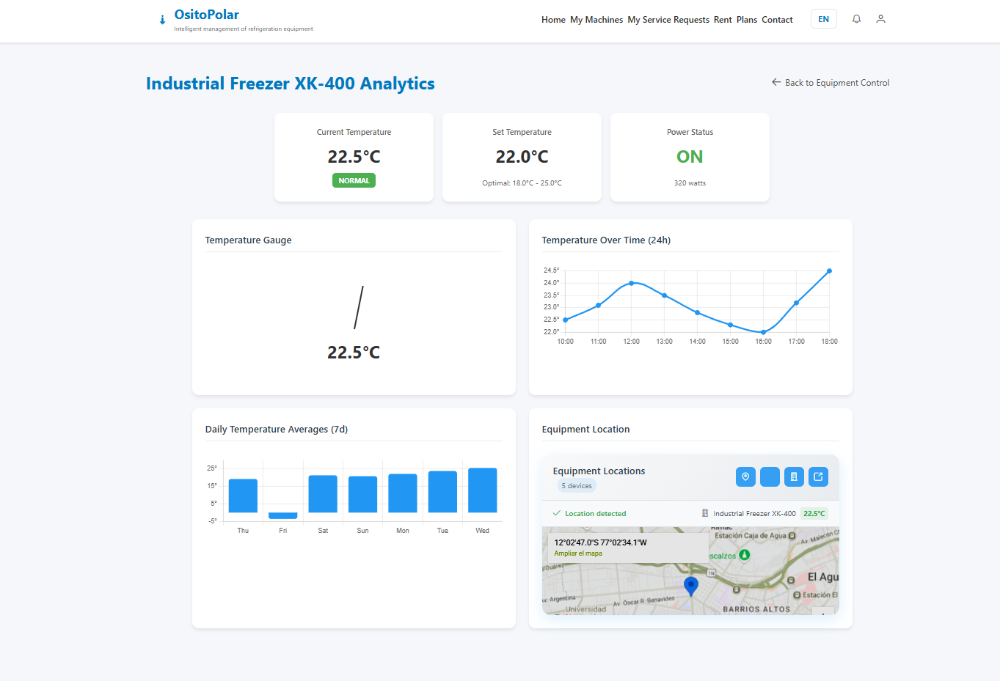

- **Módulo de solicitudes de servicio (Service Requests).**  
  

- **Creación de solicitud de servicio – Selección del equipo.**  
  

- **Creación de solicitud de servicio – Programación.**  
  

- **Creación de solicitud de servicio – Confirmación.**  
  

- **Módulo “Rent Equipment”.**  
  

- **Configuración del alquiler seleccionado.**  
  

- **Sección “Upgrade Your Plan” para usuarios.**  
  

- **Sección “Upgrade Your Plan” para proveedores.**  
  

- **Sección de notificaciones.**  
  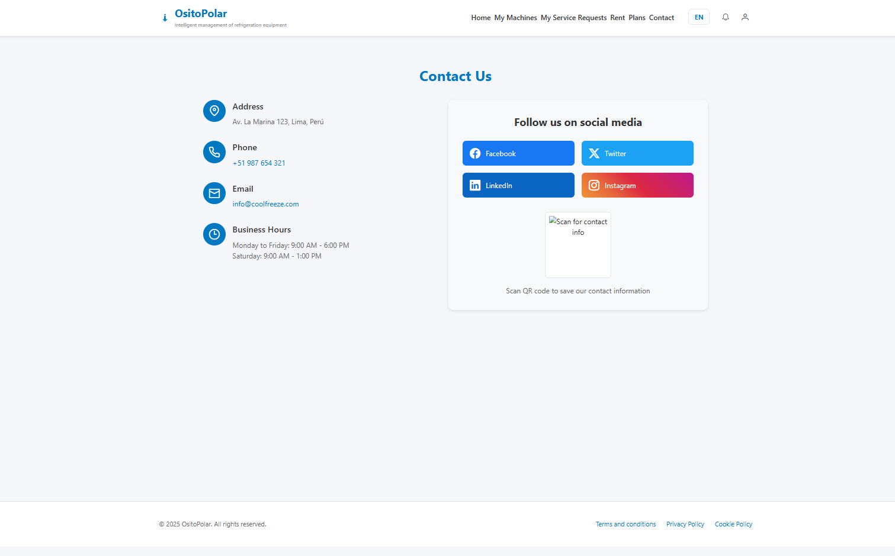

- **Sección de contacto.**  
  

*Las capturas fueron tomadas del entorno en producción tras el despliegue exitoso del frontend en Firebase Hosting.*

**Características técnicas relevantes**  
- Framework principal: Angular 17 con TypeScript.  
- Uso de servicios (Services) y componentes reutilizables.  
- Integración con API REST mediante HttpClientModule.  
- Configuración de enrutamiento con Lazy Loading para optimizar rendimiento.  
- Aplicación de Material Design y estilos personalizados con SCSS.  
- Validación y control de formularios reactivos.  
- Implementación de CI/CD con GitHub Actions y Firebase CLI. 

### 5.2.5 Implemented RESTful API and/or Serverless Backend Evidence

En esta sección se presentan las evidencias del Backend implementado para el proyecto, que proporciona los servicios RESTful necesarios para la comunicación entre el frontend y la base de datos.  
El propósito de este componente es gestionar los datos de la aplicación, exponer endpoints seguros y mantener la lógica de negocio del sistema.

**Objetivo del entregable**  
- Desarrollar una API REST funcional y estable que brinde servicios al frontend.  
- Implementar controladores, rutas y servicios que gestionen las entidades principales del sistema.  
- Integrar la capa de persistencia con la base de datos seleccionada.  
- Garantizar la seguridad mediante autenticación, validación y manejo de errores.  

**Descripción general**  
El backend fue desarrollado utilizando Node.js con el framework Express.js y desplegado en Firebase Functions bajo un esquema serverless, garantizando escalabilidad y disponibilidad.  
Se diseñaron controladores y rutas RESTful siguiendo las buenas prácticas de la arquitectura de tres capas (controlador, servicio y modelo).  
El entorno de despliegue se configuró con integración continua (CI/CD) a través de GitHub Actions.

Las principales características implementadas fueron:  
- CRUD completo para las entidades del sistema.  
- Autenticación y autorización de usuarios mediante JWT.  
- Validación de datos de entrada con librerías como `express-validator`.  
- Conexión segura con la base de datos Firestore.  
- Manejo de errores centralizado y respuestas estandarizadas.  
- Configuración de variables de entorno seguras.  

**Enlaces de despliegue**  
- Endpoint base de la API (producción): [Backend](https://ositopolar-platform.onrender.com/)  

**Evidencias visuales**  
- **Listado de endpoints disponibles – Work Orders.**  
  

- **Método POST /api/v1/work-orders – Creación de una orden de trabajo.**  
  

- **Método GET /api/v1/work-orders – Listado de todas las órdenes de trabajo.**  
  

- **Método PUT /api/v1/work-orders/{workOrderId}/status – Actualización del estado de una orden.**  
  

- **Método POST /api/v1/payments/create-checkout-session – Integración con Stripe para pago de suscripción.**  
  

- **Método POST /api/v1/payments/webhook – Recepción de eventos de pago Stripe Webhook.**  
  

*Todas las pruebas fueron realizadas en Postman dentro del entorno de producción configurado en Firebase Functions.*

**Características técnicas relevantes**  
- Lenguaje y entorno: Node.js 20 con Express.js 5.  
- Base de datos: Firestore (Firebase).  
- Arquitectura: serverless con microservicios desplegados en Firebase Functions.  
- Autenticación basada en JWT con middleware personalizado.  
- Documentación API: Swagger / Postman Collection compartida.  
- Pipeline automatizado para despliegue continuo con GitHub Actions.  


### 5.2.6. RESTful API documentation  

**Enlace al repositorio de Web Services:** [https://github.com/Inteligencia-Artesanal-Aplicaciones-Web/OsitoPolar-Backend.git](https://github.com/Inteligencia-Artesanal-Aplicaciones-Web/OsitoPolar-Backend.git)  
**Enlace al Backend desplegado:** [https://ositopolar-platform.onrender.com/](https://ositopolar-platform.onrender.com/)  

| **Método** | **Endpoint** | **Descripción** |
|-------------|---------------|-----------------|
| **POST** | `/api/v1/work-orders` | Crea una nueva orden de trabajo en el sistema. |
| **GET** | `/api/v1/work-orders` | Obtiene la lista completa de órdenes de trabajo. |
| **GET** | `/api/v1/work-orders/{workOrderId}` | Obtiene una orden de trabajo por su ID. |
| **PUT** | `/api/v1/work-orders/{workOrderId}/status` | Actualiza el estado de una orden de trabajo. |
| **PUT** | `/api/v1/work-orders/{workOrderId}/resolution` | Añade los detalles de resolución de una orden de trabajo. |
| **DELETE** | `/api/v1/work-orders/{workOrderId}` | Elimina una orden de trabajo del sistema. |
| **GET** | `/api/v1/work-orders/technician/{id}` | Obtiene todas las órdenes asignadas a un técnico específico. |
| **POST** | `/api/v1/service-requests` | Crea una nueva solicitud de servicio. |
| **GET** | `/api/v1/service-requests` | Lista todas las solicitudes de servicio registradas. |
| **GET** | `/api/v1/service-requests/{id}` | Obtiene una solicitud de servicio específica por ID. |
| **PUT** | `/api/v1/service-requests/{id}` | Actualiza la información de una solicitud de servicio. |
| **DELETE** | `/api/v1/service-requests/{id}` | Elimina una solicitud de servicio existente. |
| **GET** | `/api/v1/equipments` | Obtiene la lista de equipos disponibles. |
| **GET** | `/api/v1/equipments/{id}` | Devuelve la información de un equipo específico. |
| **POST** | `/api/v1/equipments` | Registra un nuevo equipo en el sistema. |
| **PUT** | `/api/v1/equipments/{id}` | Actualiza la información de un equipo existente. |
| **DELETE** | `/api/v1/equipments/{id}` | Elimina un equipo de la base de datos. |
| **GET** | `/api/v1/monitoring` | Devuelve el monitoreo en tiempo real de todos los equipos. |
| **GET** | `/api/v1/monitoring/{equipmentId}` | Obtiene los datos históricos de monitoreo de un equipo. |
| **GET** | `/api/v1/monitoring/alerts` | Lista todas las alertas de temperatura y energía registradas. |
| **GET** | `/api/v1/alerts` | Devuelve la lista general de alertas activas o históricas. |
| **PUT** | `/api/v1/alerts/{id}/resolve` | Marca una alerta como resuelta por un técnico. |
| **DELETE** | `/api/v1/alerts/{id}` | Elimina una alerta del registro. |
| **GET** | `/api/v1/rentals` | Lista los equipos disponibles para alquiler. |
| **POST** | `/api/v1/rentals` | Crea una solicitud de alquiler de equipo. |
| **PUT** | `/api/v1/rentals/{id}` | Actualiza los datos de una solicitud de alquiler. |
| **DELETE** | `/api/v1/rentals/{id}` | Cancela o elimina una solicitud de alquiler. |
| **POST** | `/api/v1/payments/create-checkout-session` | Crea una sesión de pago con Stripe. |
| **POST** | `/api/v1/payments/webhook` | Procesa los eventos del webhook de Stripe. |
| **GET** | `/api/v1/payments/history/{userId}` | Devuelve el historial de pagos de un usuario. |
| **GET** | `/api/v1/payments/subscriptions` | Lista las suscripciones activas del sistema. |
| **POST** | `/api/v1/users/sign-up` | Registra un nuevo usuario con correo y contraseña. |
| **POST** | `/api/v1/users/sign-in` | Inicia sesión y devuelve el token de autenticación JWT. |
| **GET** | `/api/v1/users` | Devuelve la lista de usuarios registrados. |
| **GET** | `/api/v1/users/{id}` | Devuelve los datos de un usuario específico. |
| **PUT** | `/api/v1/users/{id}` | Actualiza los datos de un usuario. |
| **DELETE** | `/api/v1/users/{id}` | Elimina un usuario del sistema. |
| **GET** | `/api/v1/notifications` | Devuelve las notificaciones del sistema. |
| **POST** | `/api/v1/notifications` | Crea una nueva notificación para un usuario. |
| **PUT** | `/api/v1/notifications/{id}/read` | Marca una notificación como leída. |
| **DELETE** | `/api/v1/notifications/{id}` | Elimina una notificación. |
| **GET** | `/api/v1/reports` | Devuelve reportes de mantenimiento o consumo energético. |
| **GET** | `/api/v1/reports/{id}` | Devuelve un reporte detallado por ID. |
| **POST** | `/api/v1/reports` | Genera un nuevo reporte desde datos recopilados. |
| **DELETE** | `/api/v1/reports/{id}` | Elimina un reporte del historial. |

---

**Características técnicas relevantes**  
- **Lenguaje y entorno:** Node.js 20 con Express.js 5.  
- **Base de datos:** Firestore (Firebase).  
- **Arquitectura:** Serverless (Firebase Functions) con microservicios modulares.  
- **Autenticación:** Basada en JWT (JSON Web Token) con middleware de validación.  
- **Documentación API:** Generada automáticamente con Swagger UI.  
- **Despliegue:** Render + CI/CD configurado con GitHub Actions.  
- **Estándares:** Convenciones RESTful y manejo centralizado de errores HTTP.

### 5.2.7. Team Collaboration Insights  

En esta sección se evidencian los resultados de colaboración del equipo de desarrollo obtenidos a partir del repositorio de GitHub.  
Durante el periodo comprendido entre septiembre y octubre de 2025, el equipo mantuvo una participación activa en commits, merges y pull requests, reflejando una adecuada distribución del trabajo y coordinación en las ramas del proyecto.  

A continuación, se muestran los reportes generados automáticamente por GitHub que respaldan la actividad y los aportes individuales de los miembros del equipo:

- **Gráfico de actividad general (Pulse View)**: Muestra el número de commits, merges y pull requests realizados en el periodo de trabajo.  
- **Gráfico de contribuciones por miembro (Contributors View)**: Detalla la cantidad de commits, líneas de código añadidas y modificadas por cada integrante del equipo, evidenciando la participación conjunta y el progreso sostenido del desarrollo.

**Evidencias visuales:**  
- *Reporte general de actividad en GitHub (Pulse)*
  
- *Contribuciones individuales y globales del equipo (Contributors)*
- 


##### 5.2.1.2. Aspect Leaders and Collaborators

Durante este primer Sprint, el equipo se enfocó principalmente en el desarrollo, la mejora estructural y visual de la Landing Page de OsitoPolar, asegurando su visualización en distintos dispositivos (diseño responsive), la integración armoniosa de imágenes y textos, y la implementación de un cambio de idioma dinámico mediante un botón.
Con el fin de organizar de manera más eficiente el trabajo colaborativo, se ha elaborado la matriz de Liderazgo y Colaboración (LACX). Esta matriz asigna responsabilidades específicas a cada miembro del equipo en relación con los aspectos clave del Sprint.
<table>
  <tr>
    <td colspan="2"><strong>Team Member (Last Name, First Name)</strong></td>
    <td><strong>GitHub Username</strong></td>
    <td><strong>Diseño visual y maquetación web (Landing Page)<br>Leader (L) / Collaborator (C)</strong></td>
    <td><strong>Implementación técnica del cambio de idioma (Multilenguaje funcional)<br>Leader (L) / Collaborator (C)</strong></td>
    <td><strong>Responsividad y pruebas en distintos dispositivos<br>Leader (L) / Collaborator (C)</strong></td>
  </tr>
  <tr>
    <td colspan="2">Moscoso Bejar, Angelo Stephano</td>
    <td>StephanoDang</td>
    <td>L</td>
    <td>C</td>
    <td>C</td>
  </tr>
  <tr>
    <td colspan="2">Rodriguez Parco Joseph Pablo </td>
    <td>eJosR-Coding</td>
    <td>C</td>
    <td>L</td>
    <td>L</td>
  </tr>
  <tr>
    <td colspan="2"> Holguin Gamarra, Hardie Alonso </td>
    <td>HOLGUINUPC</td>
    <td>C</td>
    <td>C</td>
    <td>C</td>
  </tr>
  <tr>
    <td colspan="2">Quincho Gamarra, Paulo Percy
</td>
    <td>Paulo02-pixel</td>
    <td>C</td>
    <td>C</td>
    <td>C</td>
  </tr>
  
</table>


##### 5.2.1.3. Sprint Backlog 1

El objetivo principal de este Sprint es elaborar la Landing Page de nuestra plataforma OsitoPolar. Para ello, dividimos el desarrollo de esta según las User Stories pertenecientes a la Epic enfocada en Landing Page. La plataforma elegida para ser la herramienta de control de tareas fue Trello, el cuál se presenta una captura de pantalla de nuestro tablero y su enlace público.


Enlace: https://trello.com/b/xAOjqyPz/inteligenciaartesanal-ositopolar


<table>
<tr>
    <th colspan="3">Sprint #</th>
    <th colspan="10">Sprint 1</th>
</tr>
<tr>
    <td colspan="3">User Story</td>
    <td colspan="10">Work-Item/Task</td>
</tr>
<tr>
    <td colspan="1">Id</td>
    <td colspan="2">Title</td>
    <td colspan="1">Id</td>
    <td colspan="2">Title</td>
    <td colspan="3">Description</td>
    <td colspan="1">Estimation (Hours)</td>
    <td colspan="2">Assigned To</td>
    <td colspan="1">Status (To do/ In-Process/ To-Review/ Done)</td>
</tr>
<tr>
    <td colspan="1">US-23</td>
    <td colspan="2">Visualizar propuesta de valor principal</td>
    <td colspan="1">UT-01</td>
    <td colspan="2">Crear la sección 'Hero'</td>
    <td colspan="3">Añadir la sección donde se muestra nuestra propuesta de valor principal y las entidades que confían en nosotros</td>
    <td colspan="1">0.5</td>
    <td colspan="2">Stephano Moscoso</td>
    <td colspan="1">Done</td>
</tr>
<tr>
    <td colspan="1">US-23</td>
    <td colspan="2">Visualizar propuesta de valor principal</td>
    <td colspan="1">UT-02</td>
    <td colspan="2">Añadir estilos CSS</td>
    <td colspan="3">Aplicar estilos según el diseño aprobado</td>
    <td colspan="1">0.5</td>
    <td colspan="2">Stephano Moscoso</td>
    <td colspan="1">Done</td>
</tr>
<tr>
    <td colspan="1">US-23</td>
    <td colspan="2">Visualizar propuesta de valor principal</td>
    <td colspan="1">UT-03</td>
    <td colspan="2">Añadir interacciones con JS</td>
    <td colspan="3">Agregar efectos y validaciones según el diseño</td>
    <td colspan="1">0.5</td>
    <td colspan="2">Paulo Quincho</td>
    <td colspan="1">Done</td>
</tr>
<tr>
    <td colspan="1">US-24</td>
    <td colspan="2">Explorar soluciones específicas para mi rubro</td>
    <td colspan="1">UT-04</td>
    <td colspan="2">Crear la sección 'Beneficios'</td>
    <td colspan="3">Añadir la sección donde se visualizan las soluciones específicas a cada segmento (beneficios) </td>
    <td colspan="1">0.5</td>
    <td colspan="2">Hardie Holguin</td>
    <td colspan="1">Done</td>
</tr>
<tr>
    <td colspan="1">US-24</td>
    <td colspan="2">Explorar soluciones específicas para mi rubro</td>
    <td colspan="1">UT-05</td>
    <td colspan="2">Añadir estilos CSS</td>
    <td colspan="3">Aplicar estilos según el diseño aprobado de 'Beneficios'</td>
    <td colspan="1">0.5</td>
    <td colspan="2">Hardie Holguin</td>
    <td colspan="1">Done</td>
</tr>
<tr>
    <td colspan="1">US-24</td>
    <td colspan="2">Explorar soluciones específicas para mi rubro</td>
    <td colspan="1">UT-06</td>
    <td colspan="2">Añadir interacciones con JS</td>
    <td colspan="3">Agregar efectos y validaciones según el diseño de 'Beneficios'</td>
    <td colspan="1">0.5</td>
    <td colspan="2">Joseph Rodriguez</td>
    <td colspan="1">Done</td>
</tr>
<tr>
    <td colspan="1">US-25</td>
    <td colspan="2">Comprender funcionalidades destacadas</td>
    <td colspan="1">UT-07</td>
    <td colspan="2">Crear la sección 'Funcionalidades'</td>
    <td colspan="3">Añadir la sección donde se visualizan las funciones principales de la plataforma</td>
    <td colspan="1">1</td>
    <td colspan="2">Paulo Quincho</td>
    <td colspan="1">Done</td>
</tr>
<tr>
    <td colspan="1">US-25</td>
    <td colspan="2">Comprender funcionalidades destacadas</td>
    <td colspan="1">UT-08</td>
    <td colspan="2">Añadir estilos CSS</td>
    <td colspan="3">Aplicar estilos según el diseño aprobado de 'Funcionalidades'</td>
    <td colspan="1">0.5</td>
    <td colspan="2">Joseph Rodriguez</td>
    <td colspan="1">Done</td>
</tr>
<tr>
    <td colspan="1">US-25</td>
    <td colspan="2">Comprender funcionalidades destacadas</td>
    <td colspan="1">UT-09</td>
    <td colspan="2">Añadir interacciones con JS</td>
    <td colspan="3">Agregar efectos y validaciones según el diseño de 'Funcionalidades'</td>
    <td colspan="1">0.5</td>
    <td colspan="2">Joseph Rodriguez</td>
    <td colspan="1">Done</td>
</tr>
<tr>
    <td colspan="1">US-26</td>
    <td colspan="2">Solicitar una demo fácilmente</td>
    <td colspan="1">UT-10</td>
    <td colspan="2">Crear la sección 'Solicitar Demo'</td>
    <td colspan="3">Añadir la sección donde se puede solicitar una demo de nuestra plataforma</td>
    <td colspan="1">1</td>
    <td colspan="2">Hardie Holguin</td>
    <td colspan="1">Done</td>
</tr>
<tr>
    <td colspan="1">US-26</td>
    <td colspan="2">Solicitar una demo fácilmente</td>
    <td colspan="1">UT-11</td>
    <td colspan="2">Añadir estilos CSS</td>
    <td colspan="3">Aplicar estilos según el diseño aprobado de 'Solicitar demo'</td>
    <td colspan="1">0.5</td>
    <td colspan="2">Hardie Holguin</td>
    <td colspan="1">Done</td>
</tr>
<tr>
    <td colspan="1">US-26</td>
    <td colspan="2">Solicitar una demo fácilmente</td>
    <td colspan="1">UT-12</td>
    <td colspan="2">Añadir interacciones con JS</td>
    <td colspan="3">Agregar efectos y validaciones según el diseño de 'Solicitar demo'</td>
    <td colspan="1">0.5</td>
    <td colspan="2">Stephano Moscoso</td>
    <td colspan="1">Done</td>
</tr>
<tr>
    <td colspan="1">US-27</td>
    <td colspan="2">Conocer misión y visión de la startup</td>
    <td colspan="1">UT-13</td>
    <td colspan="2">Crear la sección 'Nosotros'</td>
    <td colspan="3">Añadir la sección donde se visualiza la misión y visión de nuestra startup</td>
    <td colspan="1">0.5</td>
    <td colspan="2">Paulo Quincho</td>
    <td colspan="1">Done</td>
</tr>
<tr>
    <td colspan="1">US-27</td>
    <td colspan="2">Conocer misión y visión de la startup</td>
    <td colspan="1">UT-14</td>
    <td colspan="2">Añadir estilos CSS</td>
    <td colspan="3">Aplicar estilos según el diseño aprobado de 'Nosotros'</td>
    <td colspan="1">0.5</td>
    <td colspan="2">Paulo Quincho</td>
    <td colspan="1">Done</td>
</tr>
<tr>
    <td colspan="1">US-27</td>
    <td colspan="2">Conocer misión y visión de la startup</td>
    <td colspan="1">UT-15</td>
    <td colspan="2">Añadir interacciones con JS</td>
    <td colspan="3">Agregar efectos y validaciones según el diseño de 'Nosotros'</td>
    <td colspan="1">0.5</td>
    <td colspan="2">Stephano Moscoso</td>
    <td colspan="1">Done</td>
</tr>
<tr>
    <td colspan="1">US-00</td>
    <td colspan="2">-</td>
    <td colspan="1">NT-16</td>
    <td colspan="2">Implementar cambio de idioma</td>
    <td colspan="3">Implementar la funcionalidad de cambio de idioma en la landing page</td>
    <td colspan="1">2</td>
    <td colspan="2">Hardie Holguin</td>
    <td colspan="1">Done</td>
</tr>
<tr>
    <td colspan="1">US-00</td>
    <td colspan="2">-</td>
    <td colspan="1">NT-17</td>
    <td colspan="2">Añadir imágenes complementarias</td>
    <td colspan="3">Agregar imágenes complementarias en las diferentes secciones del landing page</td>
    <td colspan="1">0.5</td>
    <td colspan="2">Hardie Holguin</td>
    <td colspan="1">Done</td>
</tr>
</table>


##### 5.2.1.4. Development Evidence for Sprint Review

En este primer Sprint hemos realizado la implementación de nuestra Landing Page, donde todo el equipo ha aportado en varias tareas. En la siguiente tabla se muestran los commits realizados.

<table>
    <tr>
        <th colspan="2">Repository</th>
        <th colspan="2">Branch</th>
        <th colspan="2">Commit Id</th>
        <th colspan="2">Commit Message</th>
        <th colspan="2">Commit Message Body</th>
        <th colspan="2">Commited on (Date)</th>
    </tr>
    <tr>
        <td colspan="2">Inteligencia-Artesanal-Aplicaciones-Web/Landing-Page</td>
        <td colspan="2">main</td>
        <td colspan="2">9caef73</td>
        <td colspan="2">chore: added html file</td>
        <td colspan="2">added html file</td>
        <td colspan="2">09/09/2025</td>
    </tr>
    <tr>
        <td colspan="2">Inteligencia-Artesanal-Aplicaciones-Web/Landing-Page</td>
        <td colspan="2">main</td>
        <td colspan="2">ae1fd12</td>
        <td colspan="2">feat: added header and footer section</td>
        <td colspan="2">added header and footer section</td>
        <td colspan="2">09/09/2025</td>
    </tr>
     <tr>
        <td colspan="2">Inteligencia-Artesanal-Aplicaciones-Web/Landing-Page</td>
        <td colspan="2">main</td>
        <td colspan="2">10093f4</td>
        <td colspan="2">style: Add styles</td>
        <td colspan="2">Add styles</td>
        <td colspan="2">09/09/2025</td>
    </tr>
    <tr>
        <td colspan="2">Inteligencia-Artesanal-Aplicaciones-Web/Landing-Page</td>
        <td colspan="2">main</td>
        <td colspan="2">5a4332d</td>
        <td colspan="2">feat: added script.js</td>
        <td colspan="2">added script.js</td>
        <td colspan="2">09/09/2025</td>
    </tr>
    <tr>
        <td colspan="2">Inteligencia-Artesanal-Aplicaciones-Web/Landing-Page</td>
        <td colspan="2">main</td>
        <td colspan="2">72f4157</td>
        <td colspan="2">feat: added hero section.</td>
        <td colspan="2">added hero section.</td>
        <td colspan="2">09/09/2025</td>
    </tr>
   <tr>
        <td colspan="2">Inteligencia-Artesanal-Aplicaciones-Web/Landing-Page</td>
        <td colspan="2">main</td>
        <td colspan="2">e875205</td>
        <td colspan="2">fix: fixed header section.</td>
        <td colspan="2">fixed header section.</td>
        <td colspan="2">09/09/2025</td>
    </tr>
   <tr>
        <td colspan="2">Inteligencia-Artesanal-Aplicaciones-Web/Landing-Page</td>
        <td colspan="2">main</td>
        <td colspan="2">9624ec5</td>
        <td colspan="2">feat: update hero section images and testimonials</td>
        <td colspan="2">update hero section images and testimonials</td>
        <td colspan="2">09/09/2025</td>
    </tr>
   <tr>
        <td colspan="2">Inteligencia-Artesanal-Aplicaciones-Web/Landing-Page</td>
        <td colspan="2">main</td>
        <td colspan="2">9bc4018</td>
        <td colspan="2">feat: Funcionalidades Section</td>
        <td colspan="2">Funcionalidades Section</td>
        <td colspan="2">09/09/2025</td>
    </tr>
   <tr>
        <td colspan="2">Inteligencia-Artesanal-Aplicaciones-Web/Landing-Page</td>
        <td colspan="2">main</td>
        <td colspan="2">9e6c718</td>
        <td colspan="2">feat: add language toggle button and translation functionality (WIP)</td>
        <td colspan="2">add language toggle button and translation functionality (WIP)</td>
        <td colspan="2">09/09/2025</td>
    </tr>
   <tr>
        <td colspan="2">Inteligencia-Artesanal-Aplicaciones-Web/Landing-Page</td>
        <td colspan="2">main</td>
        <td colspan="2">a99916d</td>
        <td colspan="2">feat: nosotros section</td>
        <td colspan="2">nosotros section</td>
        <td colspan="2">09/09/2025</td>
    </tr>
   <tr>
        <td colspan="2">Inteligencia-Artesanal-Aplicaciones-Web/Landing-Page</td>
        <td colspan="2">main</td>
        <td colspan="2">022b681</td>
        <td colspan="2">feat: add multilingual support for functionalities and company sections</td>
        <td colspan="2">add multilingual support for functionalities and company sections</td>
        <td colspan="2">09/09/2025</td>
    </tr>
   <tr>
        <td colspan="2">Inteligencia-Artesanal-Aplicaciones-Web/Landing-Page</td>
        <td colspan="2">main</td>
        <td colspan="2">3ddec9f</td>
        <td colspan="2">feat: update about section image to enhance visual content</td>
        <td colspan="2">update about section image to enhance visual content</td>
        <td colspan="2">09/09/2025</td>
    </tr>
</table>


##### 5.2.1.5. Execution Evidence for Sprint Review

Como equipo, lo que logramos en este primer Sprint fue la exitosa implementación de nuestra Landing Page y su posterior despliegue gracias a la herramienta GitHub Pages. A continuación, presentaremos lo logrado a través de imágenes mostrando las principales vistas.

- Esta es la sección inicial, donde está el header y nuestra propuesta de valor.
  

- Aquí se puede observar la sección donde se presenta a los usuarios a los que está orientado nuestra plataforma.


- Esta sección describe las funcionalidades claves principales de nuestra plataforma OsitoPolar.


- Tenemos en esta sección la visualización de los beneficios que obtendrá cada uno de nuestros usuarios de cada segmento.
 
 
   


- También se encuentra la sección de nuestra misión y visión.
   


- Por último, está la sección donde podemos solicitar una demo.
 


- Para más detalles, visualizar el video: [Video demostrativo de la landing page](https://upcedupe-my.sharepoint.com/:v:/g/personal/u202223286_upc_edu_pe/EWpS23aHI95KiF5rJXhOyHgBoHAL62jYwnz8m4zMqxkGwA?nav=eyJyZWZlcnJhbEluZm8iOnsicmVmZXJyYWxBcHAiOiJPbmVEcml2ZUZvckJ1c2luZXNzIiwicmVmZXJyYWxBcHBQbGF0Zm9ybSI6IldlYiIsInJlZmVycmFsTW9kZSI6InZpZXciLCJyZWZlcnJhbFZpZXciOiJNeUZpbGVzTGlua0NvcHkifX0&e=bwYjby)


##### 5.2.1.6. Services Documentation Evidence for Sprint Review

Durante este Sprint solo se realizó la Landing Page, no se han documentado nuevos Endpoints relacionados con el alcance definido, por lo tanto, no se dispone de documentación generada en OpenAPI para esta entrega.

##### 5.2.1.7. Software Deployment Evidence for Sprint Review

Durante el presente Sprint, se llevó a cabo el despliegue de la Landing Page del proyecto utilizando GitHub Pages como proveedor de hosting. Esta actividad forma parte del proceso de Deployment, siendo un primer paso en la publicación de productos desarrollados en este Sprint.

**Pasos realizados**

1. Iniciamos sesión en GitHub. En caso de no tener cuenta o querer trabajar con una nueva, nos registramos.

   


2. Luego de iniciar sesión o registrarnos, seleccionamos a nuestro perfil de usuario y luego elegimos "Your organizations".
   
   


3. En la nueva pestaña seleccionamos "New organization", luego seleccionamos el plan gratuito y finalmente rellenamos los datos para crear la organización
 

4. Dentro de la organización seleccionamos "People" para invitar a los miembros del equipo.
  
  


5. Luego de tener al equipo completo en la organización, creamos un nuevo repositorio. En nuestro caso tenemos solo dos repositorios por el momento, uno para el informe y el otro para el Landing Page. Nos dirigimos a este último.
  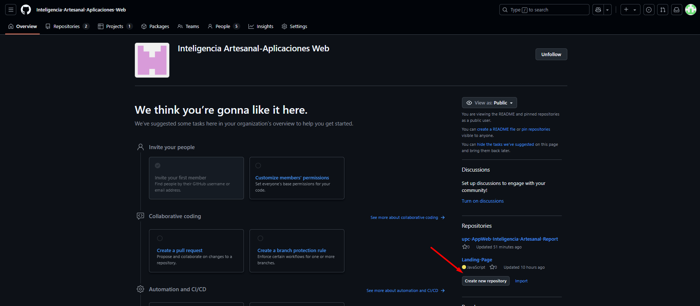
  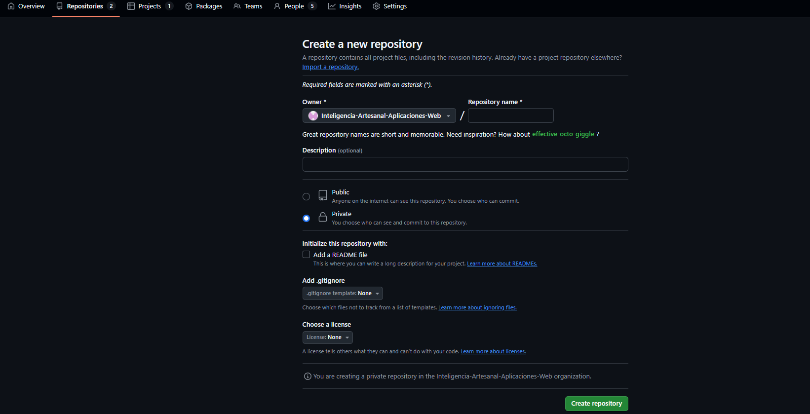

6. Al estar en el repositorio "Landing Page", nos dirigimos a settings y seleccionamos "pages" (1). Luego seleccionamos la rama y ruta en la que está el código que deseamos desplegar (2). Guardamos (3) y finalmente tendremos que esperar unos minutos para que el enlace esté disponible (4).
  
  

7. Podemos visualizar el resultado.
  


##### 5.2.1.8. Team Collaboration Insights during Sprint

Durante este Sprint, el equipo ha colaborado activamente en el desarrollo de la Landing Page. Las actividades fueron gestionadas a través de GitHub, permitiendo una trazabilidad clara de los aportes de cada miembro del equipo. Se realizaron tareas de codificación, revisión, organización del repositorio y mejoras visuales y funcionales del producto.
Cada miembro del equipo tuvo participación activa, realizando commits, revisando código, y apoyando en la estructura y documentación del proyecto.

  

Contributors:

  


#### 5.2.2. Sprint 2
##### 5.2.2.1. Sprint Planning 2
<table>
<tr>
    <th colspan="5">Sprint 2</th>
    <th colspan="9">Sprint 2</th>
  </tr>
      <tr>
    <td colspan="13">Sprint Planning Background</td>
  </tr>
  <tr>
    <td colspan="5">Date</td>
    <td colspan="8">2025-05-10</td>
</tr>
  <tr>
    <td colspan="5">Time</td>
    <td colspan="8">10:30 PM</td>
  </tr>
  <tr>
    <td colspan="5">Location</td>
    <td colspan="8">Via Discord</td>
<tr>
    <td colspan="5">Prepared By</td>
    <td colspan="8">Kenyi Ramirez</td>
</tr>
<tr>
    <td colspan="5">Attendees (to planning meeting)</td>
    <td colspan="8">Joseph Rodriguez, Wilder Aliaga, Victor Rojas, Italo Verona</td>
</tr>
<tr>
    <td colspan="5">Sprint 1 Review Summary</td>
    <td colspan="8">Durante el primer Sprint nos enfocamos en desarrollar la Landing page y logramos desplegarla con éxito; no obstante, cometimos un error al configurarla con el idioma español por defecto, cuando en realidad debió estar orientada al inglés.</td>
</tr>
<tr>
    <td colspan="5">Sprint 1 Retrospective Summary</td>
    <td colspan="8">Durante el primer Sprint trabajamos de forma colaborativa y completamos varias tareas con éxito. Sin embargo, se presentaron más errores de los esperados. Identificamos como oportunidades de mejora la falta de revisión cruzada entre equipos y la necesidad de documentarnos mejor sobre cada sección desarrollada. </td>
</tr>
<tr>
    <td colspan="13">Sprint Goal & User Stories</td>
</tr>
<tr>
    <td colspan="5">Sprint 2 Goal</td>
       <td colspan="8">Nuestro enfoque está en entregar una aplicación web de una sola página (SPA) completamente funcional y visualmente mejorada, incluyendo la corrección de la experiencia en la landing page.
Creemos que esto proporcionará mayor claridad y usabilidad a los clientes potenciales y primeros usuarios que están evaluando nuestra plataforma.
Esto se confirmará cuando la landing page refleje los ajustes de diseño, la navegación sea fluida dentro de la SPA y la aplicación esté desplegada y accesible públicamente.</td>

</tr>
<tr>
    <td colspan="5">Sprint 2 Velocity</td>
    <td colspan="8">32</td>
<tr>
    <td colspan="5">Sum of Story Points</td>
    <td colspan="8">30</td>
</tr>
</table>


##### 5.2.2.2. Aspect Leaders and Collaborators

Durante este segundo Sprint, el equipo se enfocó en la corrección de la Landing Page y en el desarrollo del Single Page Aplication (Frontend) de OsitoPolar.
Con el fin de organizar de manera más eficiente el trabajo colaborativo, se ha elaborado la matriz de Liderazgo y Colaboración (LACX). Esta matriz asigna responsabilidades específicas a cada miembro del equipo en relación con los aspectos clave del Sprint.
<table>
  <tr>
    <td colspan="2"><strong>Team Member (Last Name, First Name)</strong></td>
    <td><strong>GitHub Username</strong></td>
    <td><strong>Correcciones generales de la Landing Page<br>Leader (L) / Collaborator (C)</strong></td>
    <td><strong>Implementación de la gestión de equipos de refrigeración<br>Leader (L) / Collaborator (C)</strong></td>
    <td><strong>Implementación de gráficos analíticos<br>Leader (L) / Collaborator (C)</strong></td>
    <td><strong>Despliegue de la aplicación web<br>Leader (L) / Collaborator (C)</strong></td>
  </tr>
  <tr>
    <td colspan="2">Moscoso Bejar Angelo Stephano</td>
    <td>Stephano Dang</td>
    <td>C</td>
    <td>C</td>
    <td>C</td>
    <td>C</td>
  </tr>
  <tr>
    <td colspan="2">Rodriguez Parco Joseph Pablo </td>
    <td>eJosR-Coding</td>
    <td>L</td>
    <td>L</td>
    <td>L</td>
    <td>C</td>
  </tr>
  <tr>
    <td colspan="2"> Holguin Gamarra Hardie Alfonso </td>
    <td>HOLGUINUPC</td>
    <td>C</td>
    <td>C</td>
    <td>C</td>
    <td>C</td>
  </tr>
  <tr>
    <td colspan="2">Quincho Gamarra Paulo Percy
</td>
    <td>Paulo02-pixel</td>
    <td>C</td>
    <td>C</td>
    <td>C</td>
    <td>C</td>
  </tr>

</table>

##### 5.2.2.3. Sprint Backlog 2

El objetivo principal de este Sprint es elaborar la Single Page Aplication (frontend) de nuestra plataforma OsitoPolar. Para ello, dividimos el desarrollo de esta según las User Stories pertenecientes a la Epic y prioridad enfocada a los usuarios. La plataforma elegida para ser la herramienta de control de tareas fue Trello.

<table>
<tr>
    <th colspan="3">Sprint #</th>
    <th colspan="10">Sprint 2</th>
</tr>
<tr>
    <td colspan="3">User Story</td>
    <td colspan="10">Work-Item/Task</td>
</tr>
<tr>
    <td colspan="1">Id</td>
    <td colspan="2">Title</td>
    <td colspan="1">Id</td>
    <td colspan="2">Title</td>
    <td colspan="3">Description</td>
    <td colspan="1">Estimation (Hours)</td>
    <td colspan="2">Assigned To</td>
    <td colspan="1">Status (To do/ In-Process/ To-Review/ Done)</td>
</tr>
<tr>
    <td colspan="1">US-06</td>
    <td colspan="2">Agregar equipos</td>
    <td colspan="1">UT-01</td>
    <td colspan="2">Implementar estructura</td>
    <td colspan="3">Crear los componentes, entidades y servicios de los equipos</td>
    <td colspan="1">2</td>
    <td colspan="2">Stephano Moscoso</td>
    <td colspan="1">Done</td>
</tr>
<tr>
    <td colspan="1">US-06</td>
    <td colspan="2">Agregar equipos</td>
    <td colspan="1">UT-02</td>
    <td colspan="2">Implementar operaciones CRUD</td>
    <td colspan="3">Implementar las operaciones CREATE, READ, UPDATE AND DELETE de los equipos y cada uno de sus atributos </td>
    <td colspan="1">3</td>
    <td colspan="2">Stephano Moscoso</td>
    <td colspan="1">Done</td>
</tr>
<tr>
    <td colspan="1">US-09</td>
    <td colspan="2">Ver consumo energético de equipos</td>
    <td colspan="1">UT-03</td>
    <td colspan="2">Añadir datos de consumo energético</td>
    <td colspan="3">Crear un component y service diseñado para este atributo</td>
    <td colspan="1">3</td>
    <td colspan="2">Paulo Quincho</td>
    <td colspan="1">To Do</td>
</tr>
<tr>
    <td colspan="1">US-31</td>
    <td colspan="2">Controlar encendido y apagado del equipo</td>
    <td colspan="1">UT-04</td>
    <td colspan="2">Funcionalidad para apagar y encender el equipo</td>
    <td colspan="3">Añadir estados de apagado y encendido a la entidad Equipment </td>
    <td colspan="1">2</td>
    <td colspan="2">Hardie Holguin</td>
    <td colspan="1">Done</td>
</tr>
<tr>
    <td colspan="1">US-31</td>
    <td colspan="2">Controlar encendido y apagado del equipo</td>
    <td colspan="1">UT-05</td>
    <td colspan="2">Agregar y diseñar botón para cambiar entre estados</td>
    <td colspan="3">Aplicar un button para activar la funcionalidad</td>
    <td colspan="1">1</td>
    <td colspan="2">Hardie Holguin</td>
    <td colspan="1">Done</td>
</tr>
<tr>
    <td colspan="1">US-32</td>
    <td colspan="2">Ajustar temperatura del equipo</td>
    <td colspan="1">UT-06</td>
    <td colspan="2">Controlar el ajuste de temperatura de un equipo en concreto</td>
    <td colspan="3">Aplicar la lógica para implementar el cambio del atributo temperatura de la entidad Equipment</td>
    <td colspan="1">3</td>
    <td colspan="2">Joseph Rodriguez</td>
    <td colspan="1">Done</td>
</tr>
<tr>
    <td colspan="1">US-32</td>
    <td colspan="2">Ajustar temperatura del equipo</td>
    <td colspan="1">UT-07</td>
    <td colspan="2">Agregar gráficos analíticos sobre el cambio de temperatura</td>
    <td colspan="3">Implementar gráficos que muestren el cambio de temperatura</td>
    <td colspan="1">4</td>
    <td colspan="2">Joseph Rodriguez</td>
    <td colspan="1">Done</td>
</tr>
<tr>
    <td colspan="1">US-07</td>
    <td colspan="2">Recibir alerta de falla en equipo</td>
    <td colspan="1">UT-08</td>
    <td colspan="2">Implementar notificaciones</td>
    <td colspan="3">Crear components, models y services de notificaciones</td>
    <td colspan="1">3</td>
    <td colspan="2">Paulo Quincho</td>
    <td colspan="1">Done</td>
</tr>
<tr>
    <td colspan="1">US-07</td>
    <td colspan="2">Recibir alerta de falla en equipo</td>
    <td colspan="1">UT-09</td>
    <td colspan="2">Agregar funcionalidad para que la notificación alerte cuando se presenta una falla </td>
    <td colspan="3">Crear la lógica para que la alerta funcione cuando haya una anomalía en la temperatura del equipo</td>
    <td colspan="1">2</td>
    <td colspan="2">Paulo Quincho</td>
    <td colspan="1">Done</td>
</tr>
<tr>
    <td colspan="1">US-08</td>
    <td colspan="2">Solicitar mantenimiento preventivo</td>
    <td colspan="1">UT-10</td>
    <td colspan="2">Implementar el registro de solicitud de mantenimiento</td>
    <td colspan="3">Crear components, services y models para la solicitud de mantenimiento</td>
    <td colspan="1">2</td>
    <td colspan="2">Hardie Holguin</td>
    <td colspan="1">To Do</td>
</tr>
<tr>
    <td colspan="1">US-08</td>
    <td colspan="2">Solicitar mantenimiento preventivo</td>
    <td colspan="1">UT-11</td>
    <td colspan="2">Implementar CRUD para los servicios de mantenimiento preventivo</td>
    <td colspan="3">Crear las operaciones que permitan crear, ver y eliminar</td>
    <td colspan="1">2</td>
    <td colspan="2">Hardie Holguin</td>
    <td colspan="1">To Do</td>
</tr>
</table>


</table>


Link Trello Sprint Backlog #2: https://shorturl.at/VgV08

##### 5.2.2.4. Development Evidence for Sprint Review

En este segundo Sprint hemos realizado la implementación de nuestra Single Page Aplication. En la siguiente tabla se muestran los commits realizados.


##### 5.2.2.5. Execution Evidence for Sprint Review

En este segundo Sprint realizamos mejoras y correcciones de idioma en la Landing Page y la implementación de nuestro Frontend.

**Landing Page**

- Esta es la sección inicial, donde está el header y nuestra propuesta de valor.
  

- Aquí se puede observar la sección donde se presenta a los usuarios a los que está orientado nuestra plataforma.


- Esta sección describe las funcionalidades claves principales de nuestra plataforma OsitoPolar.


- Tenemos en esta sección la visualización de los beneficios que obtendrá cada uno de nuestros usuarios de cada segmento.
 
 
   


- También se encuentra la sección de nuestra misión y visión.
   


- Por último, está la sección donde podemos solicitar una demo.
 

**Frontend**

- Esta es la sección inicial llamada "Home", es lo primero que verá el usuario al ingresar a la aplicación.
  

- En esta se pueden observar las máquinas que están siendo monitoreadas y donde también se pueden registrar, editar y eliminar.
  

- En estas secciones se pueden visualizan los atributos, configuraciones y análisis de temperatura de los equipos de refrigeración.
  
  

- Tenemos la sección donde se visualizan las notificaciones.
  

- Por último, la sección por defecto que muestra el mensaje que nos indica que la página no ha sido encontrada.
  

##### 5.2.2.6. Services Documentation Evidence for Sprint Review

No se emplearon servicios adicionales, ya que este segundo sprint se centró exclusivamente en la implementación de la primera versión del web application.

##### 5.2.2.7. Software Deployment Evidence for Sprint Review

Durante este Sprint hemos desplegado el frontend.

- Usaremos Beeceptor es una herramienta en línea para probar y depurar APIs.


- Usaremos Firebase, el cuál es una plataforma de desarrollo de Google que ofrece servicios backend listos para usar, como autenticación, bases de datos en tiempo real, notificaciones y, en este caso, hosting web estático.
  


- Finalmente se puede visualizar nuestro proyecto desplegado.


##### 5.2.2.8. Team Collaboration Insights during Sprint

Durante este Sprint, el equipo ha colaborado en el desarrollo del frontend y correcciones de diseño e idioma. Los miembros del equipo revisaban y señalaban ciertos errores a quién se encargaba de los commits. Por falta de tiempo y experiencia en el equipo no se pudo realizar una colaboración perfecta. Las actividades fueron gestionadas a través de GitHub, permitiendo una trazabilidad clara de los aportes de cada miembro del equipo. Se realizaron tareas de codificación, revisión, organización del repositorio y mejoras visuales y funcionales del producto.

**LandingPage**


**Frontend**


### 5.2.3. Sprint 3

En esta sección se presenta el reporte del sprint 3, el cual se enfocó en el desarrollo del Backend, la implementación de nuevas funcionalidades y mejoras en la experiencia de usuario de la web application.

### 5.2.3.1. Sprint Planning 3

<table>
<tr>
    <th colspan="5">Sprint 3</th>
    <th colspan="9">Sprint 3</th>
  </tr>
      <tr>
    <td colspan="13">Sprint Planning Background</td>
  </tr>
  <tr>
    <td colspan="5">Date</td>
    <td colspan="8">2025-06-05</td>
</tr>
  <tr>
    <td colspan="5">Time</td>
    <td colspan="8">10:30 PM</td>
  </tr>
  <tr>
    <td colspan="5">Location</td>
    <td colspan="8">Via Discord</td>
<tr>
    <td colspan="5">Prepared By</td>
    <td colspan="8">Kenyi Ramirez</td>
</tr>
<tr>
    <td colspan="5">Attendees (to planning meeting)</td>
    <td colspan="8">Joseph Rodriguez, Wilder Aliaga, Victor Rojas, Italo Verona</td>
</tr>
<tr>
    <td colspan="5">Sprint 2 Review Summary</td>
    <td colspan="8">Se realizó el primer despliegue de la web application, implementando funcionalidades básicas como la creación de servicios y visualización de datos.</td>
</tr>
<tr>
    <td colspan="5">Sprint 2 Retrospective Summary</td>
    <td colspan="8">Hubo un incremento considerable en la productividad y compromiso del equipo hacia el trabajo. Ademá se plantearon las bases para una organización efectiva.</td>
</tr>
<tr>
    <td colspan="13">Sprint Goal & User Stories</td>
</tr>
<tr>
    <td colspan="5">Sprint 3 Goal</td>
       <td colspan="8">Nuestro enfoque para este sprint es establecer la base central integrada de la plataforma OsitoPolar, conectando nuestra página de aterrizaje pública con una aplicación frontend funcional y un backend fundamental. Creemos que esta integración proporcionará un punto de entrada fluido para los usuarios a nuestra aplicación y permitirá la gestión esencial de datos, mejorando significativamente la experiencia inicial del usuario y capacitando a nuestro equipo para construir sobre una base sólida. Esto se confirmará cuando los usuarios puedan acceder y navegar la aplicación web principal de forma directa y fluida desde la página de aterrizaje; el backend soporte exitosamente operaciones para entidades clave, incluyendo equipos, solicitudes de servicio, técnicos, órdenes de trabajo y suscripciones; y el frontend pueda interactuar exitosamente con el backend para mostrar y gestionar estas entidades principales, demostrando una conexión funcional entre las capas.</td>

</tr>
<tr>
    <td colspan="5">Sprint 3 Velocity</td>
    <td colspan="8">144</td>
<tr>
    <td colspan="5">Sum of Story Points</td>
    <td colspan="8">130</td>
</tr>
</table>

##### 5.2.3.2. Aspect Leaders and Collaborators

Durante este tercer Sprint, el equipo se enfocó principalmente en el desarrollo, la mejora estructural y visual del frontend y en más del 50% de los endpoints asociados al alcance de nuestro proyecto en el backend asegurando la integración entre ellas.
Con el fin de organizar de manera más eficiente el trabajo colaborativo, se ha elaborado la matriz de Liderazgo y Colaboración (LACX). Esta matriz asigna responsabilidades específicas a cada miembro del equipo en relación con los aspectos clave del Sprint.
<table>
  <tr>
    <td colspan="2"><strong>Team Member (Last Name, First Name)</strong></td>
    <td><strong>GitHub Username</strong></td>
    <td><strong>Service Request Management<br>Leader (L) / Collaborator (C)</strong></td>
    <td><strong>Assets and Equipment Management<br>Leader (L) / Collaborator (C)</strong></td>
    <td><strong>Field Operations<br>Leader (L) / Collaborator (C)</strong></td>
    <td><strong>Subscriptions and Payments<br>Leader (L) / Collaborator (C)</strong></td>
    <td><strong>Dashboard and Analytics<br>Leader (L) / Collaborator (C)</strong></td>
  </tr>
  <tr>
    <td colspan="2">Moscoso Bejar Angelo Stephano</td>
    <td>StephanoDang</td>
    <td>L</td>
    <td>-</td>
    <td>L</td>
    <td>-</td>
    <td>C</td>
  </tr>
  <tr>
    <td colspan="2">Rodriguez Parco Joseph Pablo </td>
    <td>eJosR-Coding</td>
    <td>C</td>
    <td>L</td>
    <td>-</td>
    <td>C</td>
    <td>L</td>
  </tr>
  <tr>
    <td colspan="2"> Holguin Gamarra, Hardie Alfonso </td>
    <td>HOLGUINUPC</td>
    <td>C</td>
    <td>-</td>
    <td>C</td>
    <td>-</td>
    <td>-</td>
  </tr>
  <tr>
    <td colspan="2">Quincho Gamarra Paulo Percy 
</td>
    <td>Paulo02-pixel</td>
    <td>-</td>
    <td>-</td>
    <td>-</td>
    <td>-</td>
    <td>-</td>
  </tr>
  <tr>
    <td colspan="2">Rojas Reategui Victor Manuel </td>
    <td>VRojas1603</td>
    <td>-</td>
    <td>C</td>
    <td>-</td>
    <td>L</td>
    <td>-</td>
  </tr>
</table>

##### 5.2.3.3. Sprint Backlog 3.
Nuestro enfoque principal para este Sprint ha sido el desarrollo del frontend y backend de la plataforma OsitoPolar. Hemos estructurado nuestras tareas siguiendo las User Stories y Technical Stories que hemos detallado, asegurando un progreso claro y alineado con los objetivos de negocio y la arquitectura técnica.

Para la gestión y el control de estas tareas, estamos utilizando Trello.
 

Enlace: https://trello.com/b/mGIGAFIk/sprint-backlog-3

<table>
<tr>
    <th colspan="3">Sprint #</th>
    <th colspan="10">Sprint 3</th>
</tr>
<tr>
    <td colspan="3">User Story</td>
    <td colspan="10">Work-Item/Task</td>
</tr>
<tr>
    <td colspan="1">Id</td>
    <td colspan="2">Title</td>
    <td colspan="1">Id</td>
    <td colspan="2">Title</td>
    <td colspan="3">Description</td>
    <td colspan="1">Estimation (Hours)</td>
    <td colspan="2">Assigned To</td>
    <td colspan="1">Status (To do/ In-Process/ To-Review/ Done)</td>
</tr>
<tr>
    <td colspan="1">US-08</td>
    <td colspan="2">Ver la ubicación de cada equipo</td>
    <td colspan="1">UT-01</td>
    <td colspan="2">Integrar mapa con ubicaciones</td>
    <td colspan="3">Implementar componente de mapa para visualizar equipos.</td>
    <td colspan="1">5</td>
    <td colspan="2">Joseph Rodríguez</td>
    <td colspan="1">Done</td>
</tr>
<tr>
    <td colspan="1">US-08</td>
    <td colspan="2">Ver la ubicación de cada equipo</td>
    <td colspan="1">UT-02</td>
    <td colspan="2">Mostrar detalles en mapa</td>
    <td colspan="3">Asegurar que la información del equipo se muestre al seleccionar en el mapa.</td>
    <td colspan="1">4</td>
    <td colspan="2">Joseph Rodríguez</td>
    <td colspan="1">Done</td>
</tr>
<tr>
    <td colspan="1">US-17</td>
    <td colspan="2">Visualizar equipos entregados a clientes</td>
    <td colspan="1">UT-01</td>
    <td colspan="2">Crear vista de listado de equipos</td>
    <td colspan="3">Desarrollar la interfaz para listar equipos por cliente.</td>
    <td colspan="1">3</td>
    <td colspan="2">Joseph Rodríguez</td>
    <td colspan="1">To Review</td>
</tr>
<tr>
    <td colspan="1">US-03</td>
    <td colspan="2">Solicitar y programar un tipo de servicio para mis equipos</td>
    <td colspan="1">UT-01</td>
    <td colspan="2">Diseñar formulario de solicitud</td>
    <td colspan="3">Crear la interfaz para que el cliente solicite un servicio.</td>
    <td colspan="1">4</td>
    <td colspan="2">Kenyi Ramírez</td>
    <td colspan="1">Done</td>
</tr>
<tr>
    <td colspan="1">US-03</td>
    <td colspan="2">Solicitar y programar un tipo de servicio para mis equipos</td>
    <td colspan="1">UT-02</td>
    <td colspan="2">Implementar selección tipo y fecha</td>
    <td colspan="3">Integrar validaciones a cada captura de datos relevantes dentro del formulario.</td>
    <td colspan="1">4</td>
    <td colspan="2">Kenyi Ramírez</td>
    <td colspan="1">Done</td>
</tr>
<tr>
    <td colspan="1">US-04</td>
    <td colspan="2">Ver estado del servicio solicitado</td>
    <td colspan="1">UT-01</td>
    <td colspan="2">Crear vista estado solicitud</td>
    <td colspan="3">Desarrollar una sección donde se pueda visualizar los estado en las solicitudes de servicio realizadas.</td>
    <td colspan="1">4</td>
    <td colspan="2">Kenyi Ramírez</td>
    <td colspan="1">Done</td>
</tr>
<tr>
    <td colspan="1">US-04</td>
    <td colspan="2">Ver estado del servicio solicitado</td>
    <td colspan="1">UT-02</td>
    <td colspan="2">Mostrar progreso del servicio</td>
    <td colspan="3">Definir e implementar la visualización los estados ("pending", "in_progress", "resolved", "rejected") de la solicitud.</td>
    <td colspan="1">4</td>
    <td colspan="2">Kenyi Ramírez</td>
    <td colspan="1">Done</td>
</tr>
<tr>
    <td colspan="1">US-11</td>
    <td colspan="2">Asignar técnico a solicitud de servicio</td>
    <td colspan="1">UT-01</td>
    <td colspan="2">Crear interfaz asignación</td>
    <td colspan="3">Diseñar la sección para asignar técnicos a solicitudes/órdenes.</td>
    <td colspan="1">4</td>
    <td colspan="2">Kenyi Ramírez</td>
    <td colspan="1">Done</td>
</tr>
<tr>
    <td colspan="1">US-11</td>
    <td colspan="2">Asignar técnico a solicitud de servicio</td>
    <td colspan="1">UT-02</td>
    <td colspan="2">Implementar lógica asignación</td>
    <td colspan="3">Desarrollar la funcionalidad para vincular técnicos a servicios.</td>
    <td colspan="1">4</td>
    <td colspan="2">Kenyi Ramírez</td>
    <td colspan="1">Done</td>
</tr>
<tr>
    <td colspan="1">US-13</td>
    <td colspan="2">Realizar seguimiento a solicitudes de servicio</td>
    <td colspan="1">UT-01</td>
    <td colspan="2">Desarrollar panel de seguimiento</td>
    <td colspan="3">Construir la sección para el seguimiento de solicitudes de servicio.</td>
    <td colspan="1">4</td>
    <td colspan="2">Kenyi Ramírez</td>
    <td colspan="1">Done</td>
</tr>
<tr>
    <td colspan="1">US-13</td>
    <td colspan="2">Realizar seguimiento a solicitudes de servicio</td>
    <td colspan="1">UT-02</td>
    <td colspan="2">Mostrar estado órdenes por técnico</td>
    <td colspan="3">Implementar filtros y visualización de órdenes por técnico.</td>
    <td colspan="1">4</td>
    <td colspan="2">Kenyi Ramírez</td>
    <td colspan="1">To Do</td>
</tr>
<tr>
    <td colspan="1">US-19</td>
    <td colspan="2">Realizar evaluación de servicio</td>
    <td colspan="1">UT-01</td>
    <td colspan="2">Diseñar interfaz evaluación</td>
    <td colspan="3">Crear el formulario o rating para la evaluación del servicio.</td>
    <td colspan="1">4</td>
    <td colspan="2">Kenyi Ramírez</td>
    <td colspan="1">Done</td>
</tr>
<tr>
    <td colspan="1">US-19</td>
    <td colspan="2">Realizar evaluación de servicio</td>
    <td colspan="1">UT-02</td>
    <td colspan="2">Implementar envío evaluación</td>
    <td colspan="3">Desarrollar la funcionalidad para guardar la puntuación</td>
    <td colspan="1">5</td>
    <td colspan="2">Kenyi Ramírez</td>
    <td colspan="1">Done</td>
</tr>
<tr>
    <td colspan="1">US-20</td>
    <td colspan="2">Registrar técnicos</td>
    <td colspan="1">UT-01</td>
    <td colspan="2">Diseñar formulario registro técnico</td>
    <td colspan="3">Crear la interfaz para que el empresario registre nuevos técnicos.</td>
    <td colspan="1">4</td>
    <td colspan="2">Gonzalo Aliaga</td>
    <td colspan="1">To Do</td>
</tr>
<tr>
    <td colspan="1">US-20</td>
    <td colspan="2">Registrar técnicos</td>
    <td colspan="1">UT-02</td>
    <td colspan="2">Implementar guardado datos técnico</td>
    <td colspan="3">Desarrollar la funcionalidad para almacenar la información del técnico.</td>
    <td colspan="1">4</td>
    <td colspan="2">Gonzalo Aliaga</td>
    <td colspan="1">To Do</td>
</tr>
<tr>
    <td colspan="1">US-21</td>
    <td colspan="2">Visualizar perfil del técnico</td>
    <td colspan="1">UT-01</td>
    <td colspan="2">Crear vista perfil técnico</td>
    <td colspan="3">Desarrollar la interfaz para mostrar el perfil completo del técnico.</td>
    <td colspan="1">4</td>
    <td colspan="2">Kenyi Ramírez</td>
    <td colspan="1">Done</td>
</tr>
<tr>
    <td colspan="1">US-21</td>
    <td colspan="2">Visualizar perfil del técnico</td>
    <td colspan="1">UT-02</td>
    <td colspan="2">Mostrar métricas e historial</td>
    <td colspan="3">Implementar la visualización de desempeño y servicios del técnico.</td>
    <td colspan="1">4</td>
    <td colspan="2">Gonzalo Aliaga</td>
    <td colspan="1">To Review</td>
</tr>
<tr>
    <td colspan="1">US-33</td>
    <td colspan="2">Gestionar mi suscripción</td>
    <td colspan="1">UT-01</td>
    <td colspan="2">Crear vista detalles suscripción</td>
    <td colspan="3">Desarrollar la interfaz para mostrar el plan y estado de la suscripción.</td>
    <td colspan="1">4</td>
    <td colspan="2">Victor Rojas</td>
    <td colspan="1">Done</td>
</tr>
<tr>
    <td colspan="1">US-33</td>
    <td colspan="2">Gestionar mi suscripción</td>
    <td colspan="1">UT-02</td>
    <td colspan="2">Implementar opción "Actualizar Plan"</td>
    <td colspan="3">Desarrollar la funcionalidad para iniciar el proceso de cambio de plan.</td>
    <td colspan="1">4</td>
    <td colspan="2">Victor Rojas</td>
    <td colspan="1">Done</td>
</tr>
<tr>
    <td colspan="1">US-34</td>
    <td colspan="2">Realizar y validar pagos de mi suscripción</td>
    <td colspan="1">UT-01</td>
    <td colspan="2">Integrar pasarela de pagos</td>
    <td colspan="3">Conectar el sistema con el proveedor de pagos (ej. Stripe, PayPal).</td>
    <td colspan="1">7</td>
    <td colspan="2">Victor Rojas</td>
    <td colspan="1">Done</td>
</tr>
<tr>
    <td colspan="1">US-34</td>
    <td colspan="2">Realizar y validar pagos de mi suscripción</td>
    <td colspan="1">UT-02</td>
    <td colspan="2">Implementar confirmación/gestión fallos</td>
    <td colspan="3">Desarrollar lógica para procesar confirmaciones y errores de pago.</td>
    <td colspan="1">5</td>
    <td colspan="2">Victor Rojas</td>
    <td colspan="1">To Review</td>
</tr>
<tr>
    <td colspan="1">TS-08</td>
    <td colspan="2">Registrar nuevo equipo a través de API RESTful</td>
    <td colspan="1">TT-01</td>
    <td colspan="2">Definir esquema datos equipo</td>
    <td colspan="3">Diseñar la estructura de la base de datos para equipos.</td>
    <td colspan="1">3</td>
    <td colspan="2">Joseph Rodríguez</td>
    <td colspan="1">Done</td>
</tr>
<tr>
    <td colspan="1">TS-08</td>
    <td colspan="2">Registrar nuevo equipo a través de API RESTful</td>
    <td colspan="1">TT-02</td>
    <td colspan="2">Implementar endpoint POST /equipment</td>
    <td colspan="3">Codificar la API para crear nuevos registros de equipos.</td>
    <td colspan="1">4</td>
    <td colspan="2">Joseph Rodríguez</td>
    <td colspan="1">Done</td>
</tr>
<tr>
    <td colspan="1">TS-11</td>
    <td colspan="2">Actualizar parámetros de operación de equipo unificados vía API RESTful</td>
    <td colspan="1">TT-01</td>
    <td colspan="2">Diseñar API PATCH /equipments/{id}/operations</td>
    <td colspan="3">Definir la estructura de la API para actualizar parámetros operativos.</td>
    <td colspan="1">4</td>
    <td colspan="2">Joseph Rodríguez</td>
    <td colspan="1">Done</td>
</tr>
<tr>
    <td colspan="1">TS-11</td>
    <td colspan="2">Actualizar parámetros de operación de equipo unificados vía API RESTful</td>
    <td colspan="1">TT-02</td>
    <td colspan="2">Validar y aplicar nuevos parámetros</td>
    <td colspan="3">Codificar la lógica para validar y actualizar los datos en DB.</td>
    <td colspan="1">5</td>
    <td colspan="2">Joseph Rodríguez</td>
    <td colspan="1">Done</td>
</tr>
<tr>
    <td colspan="1">TS-09</td>
    <td colspan="2">Actualizar información de equipo a través de API RESTful</td>
    <td colspan="1">TT-01</td>
    <td colspan="2">Implementar endpoint PUT/PATCH /equipments/{id}</td>
    <td colspan="3">Codificar la API para actualizar información general de equipos.</td>
    <td colspan="1">4</td>
    <td colspan="2">Joseph Rodríguez</td>
    <td colspan="1">Done</td>
</tr>
<tr>
    <td colspan="1">TS-09</td>
    <td colspan="2">Actualizar información de equipo a través de API RESTful</td>
    <td colspan="1">TT-02</td>
    <td colspan="2">Validar datos de entrada</td>
    <td colspan="3">Implementar validaciones para la información de actualización.</td>
    <td colspan="1">4</td>
    <td colspan="2">Joseph Rodríguez</td>
    <td colspan="1">Done</td>
</tr>
<tr>
    <td colspan="1">TS-10</td>
    <td colspan="2">Consultar equipos por propietario a través de API RESTful</td>
    <td colspan="1">TT-01</td>
    <td colspan="2">Implementar endpoint GET /equipments/owners/{ownerId}</td>
    <td colspan="3">Codificar la API para listar equipos por propietario.</td>
    <td colspan="1">4</td>
    <td colspan="2">Joseph Rodríguez</td>
    <td colspan="1">Done</td>
</tr>
<tr>
    <td colspan="1">TS-10</td>
    <td colspan="2">Consultar equipos por propietario a través de API RESTful</td>
    <td colspan="1">TT-02</td>
    <td colspan="2">Filtrar equipos por ownerId</td>
    <td colspan="3">Asegurar que la consulta filtre correctamente por el ID del propietario.</td>
    <td colspan="1">4</td>
    <td colspan="2">Joseph Rodríguez</td>
    <td colspan="1">Done</td>
</tr>
<tr>
    <td colspan="1">TS-13</td>
    <td colspan="2">Crear Solicitud de Servicio a través de API RESTful</td>
    <td colspan="1">TT-01</td>
    <td colspan="2">Diseñar esquema solicitud servicio</td>
    <td colspan="3">Definir la estructura de datos para las solicitudes de servicio.</td>
    <td colspan="1">4</td>
    <td colspan="2">Kenyi Ramírez</td>
    <td colspan="1">Done</td>
</tr>
<tr>
    <td colspan="1">TS-13</td>
    <td colspan="2">Crear Solicitud de Servicio a través de API RESTful</td>
    <td colspan="1">TT-02</td>
    <td colspan="2">Implementar endpoint POST /service-requests</td>
    <td colspan="3">Codificar la API para crear nuevas solicitudes de servicio.</td>
    <td colspan="1">5</td>
    <td colspan="2">Kenyi Ramírez</td>
    <td colspan="1">Done</td>
</tr>
<tr>
    <td colspan="1">TS-14</td>
    <td colspan="2">Consultar estado de Solicitud de Servicio por API</td>
    <td colspan="1">TT-01</td>
    <td colspan="2">Implementar endpoint GET /service-requests/{id}</td>
    <td colspan="3">Codificar la API para consultar el estado de una solicitud específica.</td>
    <td colspan="1">4</td>
    <td colspan="2">Kenyi Ramírez</td>
    <td colspan="1">Done</td>
</tr>
<tr>
    <td colspan="1">TS-15</td>
    <td colspan="2">Crear orden de trabajo a partir de Solicitud de Servicio por API</td>
    <td colspan="1">TT-01</td>
    <td colspan="2">Diseñar endpoint POST /work-orders (desde solicitud)</td>
    <td colspan="3">Definir la API para crear una orden de trabajo basada en una solicitud.</td>
    <td colspan="1">4</td>
    <td colspan="2">Kenyi Ramírez</td>
    <td colspan="1">Done</td>
</tr>
<tr>
    <td colspan="1">TS-16</td>
    <td colspan="2">Crear orden de trabajo a través de API RESTful</td>
    <td colspan="1">TT-01</td>
    <td colspan="2">Diseñar esquema Orden de Trabajo</td>
    <td colspan="3">Definir la estructura de datos para las órdenes de trabajo.</td>
    <td colspan="1">4</td>
    <td colspan="2">Kenyi Ramírez</td>
    <td colspan="1">Done</td>
</tr>
<tr>
    <td colspan="1">TS-16</td>
    <td colspan="2">Crear orden de trabajo a través de API RESTful</td>
    <td colspan="1">TT-02</td>
    <td colspan="2">Implementar endpoint POST /work-orders</td>
    <td colspan="3">Codificar la API para crear nuevas órdenes de trabajo directamente.</td>
    <td colspan="1">5</td>
    <td colspan="2">Kenyi Ramírez</td>
    <td colspan="1">Done</td>
</tr>
<tr>
    <td colspan="1">TS-29</td>
    <td colspan="2">Asignar técnico a Orden de Trabajo por API</td>
    <td colspan="1">TT-01</td>
    <td colspan="2">Implementar endpoint PUT /work-orders/{id}/technicians</td>
    <td colspan="3">Codificar la API para asignar o reasignar un técnico a una orden.</td>
    <td colspan="1">4</td>
    <td colspan="2">Kenyi Ramírez</td>
    <td colspan="1">Done</td>
</tr>
<tr>
    <td colspan="1">TS-17</td>
    <td colspan="2">Consultar órdenes de Trabajo por API</td>
    <td colspan="1">TT-01</td>
    <td colspan="2">Implementar endpoint GET /work-orders</td>
    <td colspan="3">Codificar la API para listar todas las órdenes de trabajo.</td>
    <td colspan="1">4</td>
    <td colspan="2">Kenyi Ramírez</td>
    <td colspan="1">Done</td>
</tr>
<tr>
    <td colspan="1">TS-18</td>
    <td colspan="2">Actualizar estado de Orden de Trabajo por API</td>
    <td colspan="1">TT-01</td>
    <td colspan="2">Implementar endpoint PUT/PATCH /work-orders/{id}/status</td>
    <td colspan="3">Codificar la API para actualizar el estado de una orden de trabajo.</td>
    <td colspan="1">4</td>
    <td colspan="2">Kenyi Ramírez</td>
    <td colspan="1">Done</td>
</tr>
<tr>
    <td colspan="1">TS-27</td>
    <td colspan="2">Evaluar servicio a través de API RESTful</td>
    <td colspan="1">TT-01</td>
    <td colspan="2">Implementar endpoint POST /reviews</td>
    <td colspan="3">Codificar la API para crear nuevas evaluaciones de servicio.</td>
    <td colspan="1">4</td>
    <td colspan="2">Kenyi Ramírez</td>
    <td colspan="1">Done</td>
</tr>
<tr>
    <td colspan="1">TS-27</td>
    <td colspan="2">Evaluar servicio a través de API RESTful</td>
    <td colspan="1">TT-02</td>
    <td colspan="2">Implementar PUT /reviews/{id}</td>
    <td colspan="3">Codificar la API para actualizar evaluaciones existentes.</td>
    <td colspan="1">4</td>
    <td colspan="2">Kenyi Ramírez</td>
    <td colspan="1">Done</td>
</tr>
<tr>
    <td colspan="1">TS-28</td>
    <td colspan="2">Consultar evaluaciones de servicio a través de API RESTful</td>
    <td colspan="1">TT-01</td>
    <td colspan="2">Implementar endpoint GET /reviews</td>
    <td colspan="3">Codificar la API para listar todas las evaluaciones de servicio.</td>
    <td colspan="1">4</td>
    <td colspan="2">Kenyi Ramírez</td>
    <td colspan="1">Done</td>
</tr>
<tr>
    <td colspan="1">TS-28</td>
    <td colspan="2">Consultar evaluaciones de servicio a través de API RESTful</td>
    <td colspan="1">TT-02</td>
    <td colspan="2">Permitir filtros por servicio/cliente/técnico</td>
    <td colspan="3">Implementar filtros avanzados en la API de evaluaciones.</td>
    <td colspan="1">4</td>
    <td colspan="2">Kenyi Ramírez</td>
    <td colspan="1">To Do</td>
</tr>
<tr>
    <td colspan="1">TS-30</td>
    <td colspan="2">Añadir feedback de cliente a Orden de Trabajo por API</td>
    <td colspan="1">TT-01</td>
    <td colspan="2">Implementar endpoint PUT /work-orders/{id}/feedback</td>
    <td colspan="3">Codificar la API para añadir feedback de cliente a una orden.</td>
    <td colspan="1">5</td>
    <td colspan="2">Kenyi Ramírez</td>
    <td colspan="1">Done</td>
</tr>
<tr>
    <td colspan="1">TS-07</td>
    <td colspan="2">Consultar perfil del técnico con métricas por API</td>
    <td colspan="1">TT-01</td>
    <td colspan="2">Implementar endpoint GET /technicians/{id}</td>
    <td colspan="3">Codificar la API para obtener el perfil detallado de un técnico.</td>
    <td colspan="1">4</td>
    <td colspan="2">Gonzalo Aliaga</td>
    <td colspan="1">Done</td>
</tr>
<tr>
    <td colspan="1">TS-38</td>
    <td colspan="2">Obtener Calificación Promedio del Técnico</td>
    <td colspan="1">TT-02</td>
    <td colspan="2">Implementar lógica de cálculo promedio</td>
    <td colspan="3">Codificar la funcionalidad para calcular el promedio de las calificaciones del técnico.</td>
    <td colspan="1">5</td>
    <td colspan="2">Kenyi Ramirez</td>
    <td colspan="1">Done</td>
</tr>
<tr>
    <td colspan="1">TS-38</td>
    <td colspan="2">Obtener Calificación Promedio del Técnico</td>
    <td colspan="1">TT-03</td>
    <td colspan="2">Integrar con datos de evaluaciones</td>
    <td colspan="3">Conectar la lógica de cálculo con la base de datos de evaluaciones de servicio del técnico.</td>
    <td colspan="1">4</td>
    <td colspan="2">Kenyi Ramirez</td>
    <td colspan="1">Done</td>
</tr>
<tr>
    <td colspan="1">TS-05</td>
    <td colspan="2">Registrar nuevo técnico a través de API RESTful</td>
    <td colspan="1">TT-01</td>
    <td colspan="2">Implementar endpoint POST /technicians</td>
    <td colspan="3">Codificar la API para registrar nuevos técnicos.</td>
    <td colspan="1">4</td>
    <td colspan="2">Gonzalo Aliaga</td>
    <td colspan="1">Done</td>
</tr>
<tr>
    <td colspan="1">TS-12</td>
    <td colspan="2">Crear y Consultar lecturas de Equipo vía API RESTful</td>
    <td colspan="1">TT-01</td>
    <td colspan="2">Implementar POST /equipments/{id}/readings</td>
    <td colspan="3">Codificar la API para registrar nuevas lecturas de equipo.</td>
    <td colspan="1">5</td>
    <td colspan="2">Joseph Rodríguez</td>
    <td colspan="1">Done</td>
</tr>
<tr>
    <td colspan="1">TS-12</td>
    <td colspan="2">Crear y Consultar lecturas de Equipo vía API RESTful</td>
    <td colspan="1">TT-02</td>
    <td colspan="2">Implementar GET /equipments/{id}/readings</td>
    <td colspan="3">Codificar la API para consultar el historial de lecturas.</td>
    <td colspan="1">4</td>
    <td colspan="2">Joseph Rodríguez</td>
    <td colspan="1">Done</td>
</tr>
<tr>
    <td colspan="1">TS-32</td>
    <td colspan="2">Obtener lecturas y resúmenes analíticos de equipos por API</td>
    <td colspan="1">TT-01</td>
    <td colspan="2">Implementar GET /analytics/equipments/{id}/readings</td>
    <td colspan="3">Codificar la API para obtener lecturas de telemetría con filtros.</td>
    <td colspan="1">6</td>
    <td colspan="2">Joseph Rodríguez</td>
    <td colspan="1">Done</td>
</tr>
<tr>
    <td colspan="1">TS-32</td>
    <td colspan="2">Obtener lecturas y resúmenes analíticos de equipos por API</td>
    <td colspan="1">TT-02</td>
    <td colspan="2">Implementar GET /analytics/equipments/{id}/summaries</td>
    <td colspan="3">Codificar la API para obtener resúmenes analíticos de equipo.</td>
    <td colspan="1">7</td>
    <td colspan="2">Joseph Rodríguez</td>
    <td colspan="1">Done</td>
</tr>
<tr>
    <td colspan="1">TS-37</td>
    <td colspan="2">Obtener vista general de analíticas de múltiples equipos por API</td>
    <td colspan="1">TT-01</td>
    <td colspan="2">Implementar endpoint GET /analytics/equipments/overview</td>
    <td colspan="3">Codificar la API para la vista general analítica de múltiples equipos.</td>
    <td colspan="1">8</td>
    <td colspan="2">Joseph Rodríguez</td>
    <td colspan="1">Done</td>
</tr>
<tr>
    <td colspan="1">TS-33</td>
    <td colspan="2">Obtener Suscripciones a través de API RESTful</td>
    <td colspan="1">TT-01</td>
    <td colspan="2">Implementar GET /subscriptions</td>
    <td colspan="3">Codificar la API para recuperar todas las suscripciones.</td>
    <td colspan="1">4</td>
    <td colspan="2">Victor Rojas</td>
    <td colspan="1">Done</td>
</tr>
<tr>
    <td colspan="1">TS-33</td>
    <td colspan="2">Obtener Suscripciones a través de API RESTful</td>
    <td colspan="1">TT-02</td>
    <td colspan="2">Implementar GET /subscriptions/{id}</td>
    <td colspan="3">Codificar la API para recuperar una suscripción específica por ID.</td>
    <td colspan="1">4</td>
    <td colspan="2">Victor Rojas</td>
    <td colspan="1">Done</td>
</tr>
<tr>
    <td colspan="1">TS-34</td>
    <td colspan="2">Actualizar Suscripción a un Nuevo Plan a través de API RESTful</td>
    <td colspan="1">TT-01</td>
    <td colspan="2">Implementar POST /subscriptions/upgrade</td>
    <td colspan="3">Codificar la API para procesar la actualización de un plan.</td>
    <td colspan="1">4</td>
    <td colspan="2">Victor Rojas</td>
    <td colspan="1">Done</td>
</tr>
<tr>
    <td colspan="1">TS-34</td>
    <td colspan="2">Actualizar Suscripción a un Nuevo Plan a través de API RESTful</td>
    <td colspan="1">TT-02</td>
    <td colspan="2">Validar plan y suscripción</td>
    <td colspan="3">Implementar lógica de validación para la transición de planes.</td>
    <td colspan="1">4</td>
    <td colspan="2">Victor Rojas</td>
    <td colspan="1">To Review</td>
</tr>
</table>

##### 5.2.3.4. Development Evidence for Sprint Review.

En esta sección se presentan los commits realizados en el repositorio de backend y frontend durante el sprint 3.

*Commits realizados en el repositorio de frontend durante el sprint 3:*
A continuación se presenta un registro de los cambios realizados en la interfaz de usuario de nuestra aplicación. Cada commit detalla las modificaciones efectuadas en el diseño, la estructura y la interacción de los elementos visuales durante este Sprint.

<table border="1">
  <tr>
    <th>Repository</th>
    <th>Branch</th>
    <th>Commit Id</th>
    <th>Commit Message</th>
    <th>Commit Message Body</th>
    <th>Committed on (Date)</th>
  </tr>
  <tr>
    <td>https://github.com/Inteligencia-Artesanal-Aplicaciones-Web/OsitoPolar-Frontend</td>
    <td>main</td>
    <td>394b441</td>
    <td>Merge pull request #20 from Inteligencia-Artesanal-Aplicaciones-Web/dev</td>
    <td>Merge pull request #20 from Inteligencia-Artesanal-Aplicaciones-Web/dev</td>
    <td>19/06/2025</td>
  </tr>
  <tr>
    <td>https://github.com/Inteligencia-Artesanal-Aplicaciones-Web/OsitoPolar-Frontend</td>
    <td>main</td>
    <td>15b12ba</td>
    <td>Merge pull request #19 from Inteligencia-Artesanal-Aplicaciones-Web/feat/service-management</td>
    <td>Merge pull request #19 from Inteligencia-Artesanal-Aplicaciones-Web/feat/service-management</td>
    <td>19/06/2025</td>
  </tr>
  <tr>
    <td>https://github.com/Inteligencia-Artesanal-Aplicaciones-Web/OsitoPolar-Frontend</td>
    <td>main</td>
    <td>43b8e4f</td>
    <td>Merge pull request #18 from Inteligencia-Artesanal-Aplicaciones-Web/dev</td>
    <td>Merge pull request #18 from Inteligencia-Artesanal-Aplicaciones-Web/dev</td>
    <td>19/06/2025</td>
  </tr>
  <tr>
    <td>https://github.com/Inteligencia-Artesanal-Aplicaciones-Web/OsitoPolar-Frontend</td>
    <td>main</td>
    <td>f129d79</td>
    <td>Merge pull request #17 from Inteligencia-Artesanal-Aplicaciones-Web/dev</td>
    <td>Merge pull request #17 from Inteligencia-Artesanal-Aplicaciones-Web/dev</td>
    <td>19/06/2025</td>
  </tr>
  <tr>
    <td>https://github.com/Inteligencia-Artesanal-Aplicaciones-Web/OsitoPolar-Frontend</td>
    <td>main</td>
    <td>852e8be</td>
    <td>Merge pull request #16 from Inteligencia-Artesanal-Aplicaciones-Web/feat/field-operations</td>
    <td>Merge pull request #16 from Inteligencia-Artesanal-Aplicaciones-Web/feat/field-operations</td>
    <td>19/06/2025</td>
  </tr>
  <tr>
    <td>https://github.com/Inteligencia-Artesanal-Aplicaciones-Web/OsitoPolar-Frontend</td>
    <td>feat/field-operations</td>
    <td>49ad111</td>
    <td>feat(router): add work-order list, new work-orders and technician list routes</td>
    <td>feat(router): add work-order list, new work-orders and technician list routes</td>
    <td>19/06/2025</td>
  </tr>
  <tr>
    <td>https://github.com/Inteligencia-Artesanal-Aplicaciones-Web/OsitoPolar-Frontend</td>
    <td>feat/field-operations</td>
    <td>f135d53</td>
    <td>feat(i18n): add work-order and technician</td>
    <td>feat(i18n): add work-order and technician</td>
    <td>19/06/2025</td>
  </tr>
  <tr>
    <td>https://github.com/Inteligencia-Artesanal-Aplicaciones-Web/OsitoPolar-Frontend</td>
    <td>feat/field-operations</td>
    <td>cb42721</td>
    <td>feat(field-operations): add new work-order component</td>
    <td>feat(field-operations): add new work-order component</td>
    <td>19/06/2025</td>
  </tr>
  <tr>
    <td>https://github.com/Inteligencia-Artesanal-Aplicaciones-Web/OsitoPolar-Frontend</td>
    <td>feat/field-operations</td>
    <td>16aba8f</td>
    <td>feat(field-operations): add work-order list component</td>
    <td>feat(field-operations): add work-order list component</td>
    <td>19/06/2025</td>
  </tr>
  <tr>
    <td>https://github.com/Inteligencia-Artesanal-Aplicaciones-Web/OsitoPolar-Frontend</td>
    <td>feat/field-operations</td>
    <td>906e24d</td>
    <td>feat(field-operations): add work-order detail modal styles</td>
    <td>feat(field-operations): add work-order detail modal styles</td>
    <td>18/06/2025</td>
  </tr>
  <tr>
    <td>https://github.com/Inteligencia-Artesanal-Aplicaciones-Web/OsitoPolar-Frontend</td>
    <td>feat/field-operations</td>
    <td>494055f</td>
    <td>feat(field-operations): add work-order detail modal</td>
    <td>feat(field-operations): add work-order detail modal</td>
    <td>18/06/2025</td>
  </tr>
  <tr>
    <td>https://github.com/Inteligencia-Artesanal-Aplicaciones-Web/OsitoPolar-Frontend</td>
    <td>feat/field-operations</td>
    <td>f786497</td>
    <td>feat(field-operations): add technician list component</td>
    <td>feat(field-operations): add technician list component</td>
    <td>18/06/2025</td>
  </tr>
  <tr>
    <td>https://github.com/Inteligencia-Artesanal-Aplicaciones-Web/OsitoPolar-Frontend</td>
    <td>feat/field-operations</td>
    <td>a60fdaa</td>
    <td>feat(field-operations): move Technician dialog styles to styles.css</td>
    <td>feat(field-operations): move Technician dialog styles to styles.css</td>
    <td>18/06/2025</td>
  </tr>
  <tr>
    <td>https://github.com/Inteligencia-Artesanal-Aplicaciones-Web/OsitoPolar-Frontend</td>
    <td>feat/field-operations</td>
    <td>2c72c67</td>
    <td>feat(field-operations): add technician detail modal component</td>
    <td>feat(field-operations): add technician detail modal component</td>
    <td>18/06/2025</td>
  </tr>
  <tr>
    <td>https://github.com/Inteligencia-Artesanal-Aplicaciones-Web/OsitoPolar-Frontend</td>
    <td>feat/field-operations</td>
    <td>1251bf8</td>
    <td>feat(field-operations): add entity and service for WorkOrder and Technician</td>
    <td>feat(field-operations): add entity and service for WorkOrder and Technician</td>
    <td>18/06/2025</td>
  </tr>
</table>


**Commits realizados en el repositorio de backend durante el sprint 3:**

A continuación se presenta un registro detallado de los commits realizados en el repositorio, enfocados a la parte de backend. Cada entrada incluye el identificador único del commit (ID), descripciones realizados durante la elaboracion de esta.

<table>
  <tr>
    <td colspan="1">Repository</td>
    <td colspan="1">Branch</td>
    <td colspan="1">Commit Id</td>
    <td colspan="1">Commit Message</td>
    <td colspan="1">Commit Message Body</td>
    <td colspan="1">Commited on (Date)</td>
  </tr>
  <tr>
    <td>https://github.com/Inteligencia-Artesanal-Aplicaciones-Web/OsitoPolar-Platform</td>
    <td>develop</td>
    <td>f31a9c2</td>
    <td>feat(Subscriptions): update Program.cs with Repository, CommandService, and QueryService.</td>
    <td>feat(Subscriptions): update Program.cs with Repository, CommandService, and QueryService.</td>
    <td>19/06/2025</td>
  </tr>
  <tr>
    <td>https://github.com/Inteligencia-Artesanal-Aplicaciones-Web/OsitoPolar-Platform</td>
    <td>develop</td>
    <td>c7b84e9</td>
    <td>feat(Subscriptions): add ApplySubscriptionsConfiguration method to AppDbContext.cs for subscriptions setup.</td>
    <td>feat(Subscriptions): add ApplySubscriptionsConfiguration method to AppDbContext.cs for subscriptions setup.</td>
    <td>19/06/2025</td>
  </tr>
  <tr>
    <td>https://github.com/Inteligencia-Artesanal-Aplicaciones-Web/OsitoPolar-Platform</td>
    <td>develop</td>
    <td>e12cba1</td>
    <td>feat(Subscriptions): add SubscriptionsController.cs.</td>
    <td>feat(Subscriptions): add SubscriptionsController.cs.</td>
    <td>19/06/2025</td>
  </tr>
  <tr>
    <td>https://github.com/Inteligencia-Artesanal-Aplicaciones-Web/OsitoPolar-Platform</td>
    <td>develop</td>
    <td>bd8a674</td>
    <td>feat(Subscriptions): add SubscriptionResourceFromEntityAssembler.cs.</td>
    <td>feat(Subscriptions): add SubscriptionResourceFromEntityAssembler.cs.</td>
    <td>19/06/2025</td>
  </tr>
  <tr>
    <td>https://github.com/Inteligencia-Artesanal-Aplicaciones-Web/OsitoPolar-Platform</td>
    <td>develop</td>
    <td>ae99f21</td>
    <td>feat(Subscriptions): add UpgradeSubscriptionCommandFromResourceAssembler.cs.</td>
    <td>feat(Subscriptions): add UpgradeSubscriptionCommandFromResourceAssembler.cs.</td>
    <td>19/06/2025</td>
  </tr>
  <tr>
    <td>https://github.com/Inteligencia-Artesanal-Aplicaciones-Web/OsitoPolar-Platform</td>
    <td>develop</td>
    <td>67d42cb</td>
    <td>feat(Subscriptions): add SubscriptionResource.cs.</td>
    <td>feat(Subscriptions): add SubscriptionResource.cs.</td>
    <td>19/06/2025</td>
  </tr>
  <tr>
    <td>https://github.com/Inteligencia-Artesanal-Aplicaciones-Web/OsitoPolar-Platform</td>
    <td>develop</td>
    <td>a1248f5</td>
    <td>feat(Subscriptions): add SubscriptionRepository.cs.</td>
    <td>feat(Subscriptions): add SubscriptionRepository.cs.</td>
    <td>19/06/2025</td>
  </tr>
  <tr>
    <td>https://github.com/Inteligencia-Artesanal-Aplicaciones-Web/OsitoPolar-Platform</td>
    <td>develop</td>
    <td>ba1c970</td>
    <td>feat(Subscriptions): add ISubscriptionCommandService.cs.</td>
    <td>feat(Subscriptions): add ISubscriptionCommandService.cs.</td>
    <td>19/06/2025</td>
  </tr>
  <tr>
    <td>https://github.com/Inteligencia-Artesanal-Aplicaciones-Web/OsitoPolar-Platform</td>
    <td>develop</td>
    <td>c4d7e03</td>
    <td>feat(Subscriptions): add SubscriptionQueryService.cs.</td>
    <td>feat(Subscriptions): add SubscriptionQueryService.cs.</td>
    <td>19/06/2025</td>
  </tr>
  <tr>
    <td>https://github.com/Inteligencia-Artesanal-Aplicaciones-Web/OsitoPolar-Platform</td>
    <td>develop</td>
    <td>ecaf42a</td>
    <td>feat(Subscriptions): add SubscriptionsCommandServices.cs.</td>
    <td>feat(Subscriptions): add SubscriptionsCommandServices.cs.</td>
    <td>19/06/2025</td>
  </tr>
  <tr>
    <td>https://github.com/Inteligencia-Artesanal-Aplicaciones-Web/OsitoPolar-Platform</td>
    <td>develop</td>
    <td>d13c7d1</td>
    <td>feat(Subscriptions): add ISubscriptionRepository.cs.</td>
    <td>feat(Subscriptions): add ISubscriptionRepository.cs.</td>
    <td>19/06/2025</td>
  </tr>
</table>


##### 5.2.3.5. Execution Evidence for Sprint Review.

En esta sección se presentan las evidencias de la ejecución de la aplicación para el sprint 3.
En esta sección, presentamos una recopilación visual y detallada de los avances logrados durante el sprint.


##### 5.2.3.6. Services Documentation Evidence for Sprint Review.

Durante este sprint se logró documentar un total de 25 endpoints correspondientes a 6 controladores principales de la API. La documentación fue realizada utilizando Swagger, una herramienta que facilita la exploración, prueba y validación de servicios REST. Esta interfaz está disponible accediendo a la siguiente URL configurada en el servidor (https://ositopolar-platform.onrender.com/index.html).

<p>A continuación, se detallan los controladores y sus respectivos endpoints documentados:</p>

<h4>WorkOrderController</h4>
<p>Se encarga de la gestión de órdenes de trabajo. Incluye endpoints para creación, obtención, actualización de estado y resolución.</p>
<table>
  <thead>
    <tr>
      <th>Verbo HTTP</th>
      <th>Endpoint</th>
      <th>Descripción</th>
    </tr>
  </thead>
  <tbody>
    <tr><td>POST</td><td>/api/v1/work-orders</td><td>Crear nueva orden de trabajo</td></tr>
    <tr><td>GET</td><td>/api/v1/work-orders</td><td>Obtener todas las órdenes</td></tr>
    <tr><td>GET</td><td>/api/v1/work-orders/{workOrderId}</td><td>Obtener orden por ID</td></tr>
    <tr><td>PUT</td><td>/api/v1/work-orders/{workOrderId}/status</td><td>Actualizar estado de la orden</td></tr>
    <tr><td>PUT</td><td>/api/v1/work-orders/{workOrderId}/resolution</td><td>Agregar resolución a la orden</td></tr>
  </tbody>
</table>


<h4>PaymentsController</h4>
<p>Gestiona los pagos realizados por los usuarios.</p>
<table>
  <thead>
    <tr>
      <th>Verbo HTTP</th>
      <th>Endpoint</th>
      <th>Descripción</th>
    </tr>
  </thead>
  <tbody>
    <tr><td>POST</td><td>/api/v1/payments/create-checkout-session</td><td>Crea una orden de pago.</td></tr>
    <tr><td>POST</td><td>/api/v1/payments/webhook</td><td>Stripe Webhook</td></tr>
  </tbody>
</table>


<h4>SubscriptionController</h4>
<p>Permite gestionar suscripciones de los usuarios.</p>
<table>
  <thead>
    <tr>
      <th>Verbo HTTP</th>
      <th>Endpoint</th>
      <th>Descripción</th>
    </tr>
  </thead>
  <tbody>
    <tr><td>GET</td><td>/api/v1/subscriptions/{subscriptionId}</td><td>Obtener suscripción por ID</td></tr>
    <tr><td>GET</td><td>/api/v1/subscriptions</td><td>Listar todas las suscripciones</td></tr>
    <tr><td>POST</td><td>/api/v1/subscriptions/upgrade</td><td>Actualizar plan de suscripción</td></tr>
  </tbody>
</table>


<h4>ServiceRequestController</h4>
<p>Encargado de manejar solicitudes de servicio por parte de los usuarios.</p>
<table>
  <thead>
    <tr>
      <th>Verbo HTTP</th>
      <th>Endpoint</th>
      <th>Descripción</th>
    </tr>
  </thead>
  <tbody>
    <tr><td>POST</td><td>/api/v1/service-requests</td><td>Crear solicitud de servicio</td></tr>
    <tr><td>GET</td><td>/api/v1/service-requests</td><td>Obtener todas las solicitudes</td></tr>
    <tr><td>PUT</td><td>/api/v1/service-requests/{serviceRequestId}</td><td>Actualizar solicitud existente</td></tr>
    <tr><td>GET</td><td>/api/v1/service-requests/{serviceRequestId}</td><td>Obtener solicitud por ID</td></tr>
    <tr><td>PUT</td><td>/api/v1/service-requests/{serviceRequestId}/assign-technician</td><td>Asignar técnico</td></tr>
    <tr><td>PUT</td><td>/api/v1/service-requests/{serviceRequestId}/feedback</td><td>Añadir feedback de cliente</td></tr>
    <tr><td>PUT</td><td>/api/v1/service-requests/{serviceRequestId}/reject</td><td>Rechazar solicitud</td></tr>
    <tr><td>PUT</td><td>/api/v1/service-requests/{serviceRequestId}/cancel</td><td>Cancelar solicitud</td></tr>
  </tbody>
</table>


<h4>EquipmentController</h4>
<p>Gestiona el inventario de equipos y sus lecturas operacionales.</p>
<table>
  <thead>
    <tr>
      <th>Verbo HTTP</th>
      <th>Endpoint</th>
      <th>Descripción</th>
    </tr>
  </thead>
  <tbody>
    <tr><td>GET</td><td>/api/v1/equipments</td><td>Obtener todos los equipos</td></tr>
    <tr><td>POST</td><td>/api/v1/equipments</td><td>Crear nuevo equipo</td></tr>
    <tr><td>GET</td><td>/api/v1/equipments/{equipmentId}</td><td>Obtener equipo por ID</td></tr>
    <tr><td>PUT</td><td>/api/v1/equipments/{equipmentId}</td><td>Actualizar equipo completo</td></tr>
    <tr><td>DELETE</td><td>/api/v1/equipments/{equipmentId}</td><td>Eliminar equipo</td></tr>
    <tr><td>GET</td><td>/api/v1/equipments/owners/{ownerId}</td><td>Obtener equipos por dueño</td></tr>
    <tr><td>PATCH</td><td>/api/v1/equipments/{equipmentId}/operations</td><td>Actualizar parámetros operativos</td></tr>
    <tr><td>POST</td><td>/api/v1/equipments/{equipmentId}/readings</td><td>Crear lectura de equipo</td></tr>
    <tr><td>GET</td><td>/api/v1/equipments/{equipmentId}/readings</td><td>Obtener lecturas del equipo</td></tr>
  </tbody>
</table>

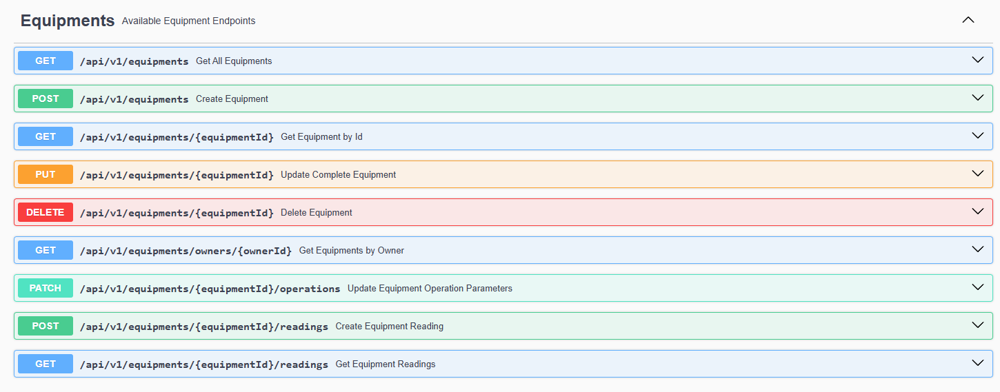


<h4>TechnicianController</h4>
<p>Gestión de técnicos del sistema.</p>
<table>
  <thead>
    <tr>
      <th>Verbo HTTP</th>
      <th>Endpoint</th>
      <th>Descripción</th>
    </tr>
  </thead>
  <tbody>
    <tr><td>POST</td><td>/api/v1/technicians</td><td>Crear nuevo técnico</td></tr>
    <tr><td>GET</td><td>/api/v1/technicians</td><td>Obtener todos los técnicos</td></tr>
    <tr><td>GET</td><td>/api/v1/technicians/{technicianId}</td><td>Obtener técnico por ID</td></tr>
    <tr><td>GET</td><td>/api/v1/technicians/{technicianId}/average-rating</td><td>Obtener promedio de calificaciones</td></tr>
  </tbody>
</table>


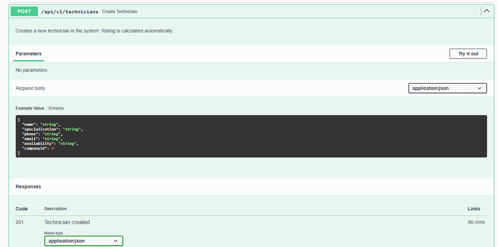
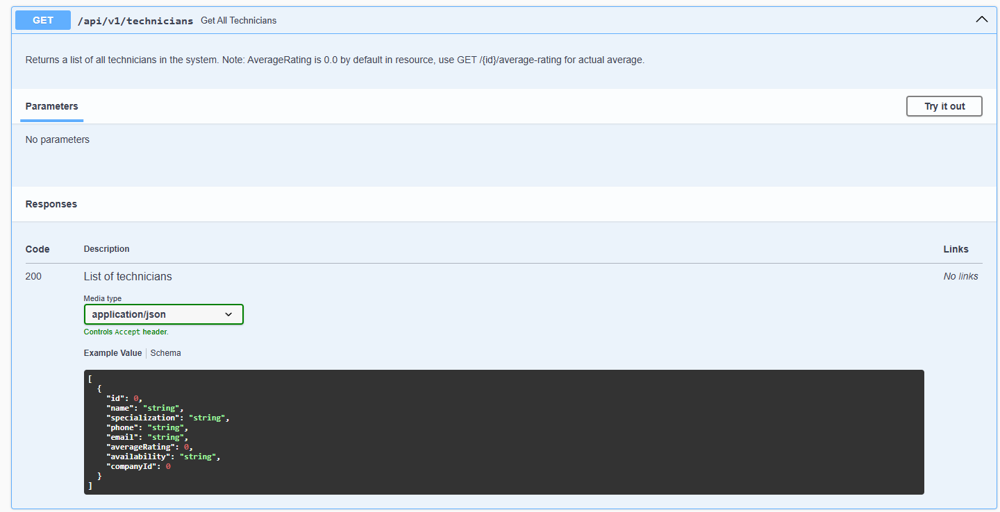


<h4>AnalyticsController</h4>
<p>Provee datos analíticos sobre los equipos registrados.</p>
<table>
  <thead>
    <tr>
      <th>Verbo HTTP</th>
      <th>Endpoint</th>
      <th>Descripción</th>
    </tr>
  </thead>
  <tbody>
    <tr><td>GET</td><td>/api/v1/analytics/equipments/{equipmentId}/readings</td><td>Obtener lecturas del equipo</td></tr>
    <tr><td>GET</td><td>/api/v1/analytics/equipments/{equipmentId}/summaries</td><td>Obtener resumen analítico</td></tr>
    <tr><td>GET</td><td>/api/v1/analytics/equipments/overview</td><td>Vista general de equipos</td></tr>
  </tbody>
</table>


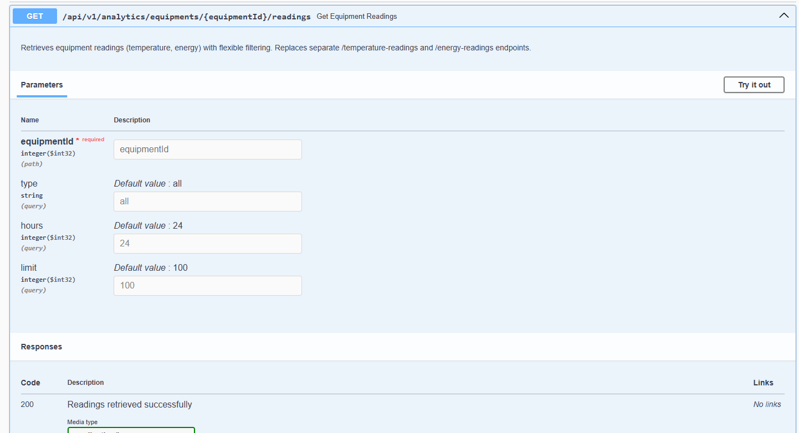

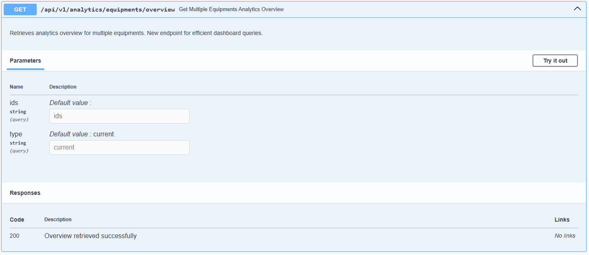


##### 5.2.3.7. Software Deployment Evidence for Sprint Review.
Despliegue de la base de datos en FreeSqlDatabase


Despligue de Backend en Render:


##### 5.2.3.8. Team Collaboration Insights during Sprint.

**Frontend**


**Backend**


### 5.2.4. Sprint 4

En esta sección se presenta el reporte del sprint 4, el cual se enfocó en la culminación del desarrollo de la plataforma, implementando nuevas funcionalidades y mejoras en la experiencia de usuario.

### 5.2.4.1. Sprint Planning 4
**(POR TERMINAR)**
<table>
<tr>
    <th colspan="5">Sprint 4</th>
    <th colspan="9">Sprint 4</th>
  </tr>
      <tr>
    <td colspan="13">Sprint Planning Background</td>
  </tr>
  <tr>
    <td colspan="5">Date</td>
    <td colspan="8">2025-07-03</td>
</tr>
  <tr>
    <td colspan="5">Time</td>
    <td colspan="8">10:30 PM</td>
  </tr>
  <tr>
    <td colspan="5">Location</td>
    <td colspan="8">Via Discord</td>
<tr>
    <td colspan="5">Prepared By</td>
    <td colspan="8">Kenyi Ramirez</td>
</tr>
<tr>
    <td colspan="5">Attendees (to planning meeting)</td>
    <td colspan="8">Joseph Rodriguez, Wilder Aliaga, Victor Rojas, Anyelo  Alejos</td>
</tr>
<tr>
    <td colspan="5">Sprint 3 Review Summary</td>
    <td colspan="8">Se implementaron funcionalidades críticas en el frontend, avanzando en la integración del sistema.</td>
</tr>
<tr>
    <td colspan="5">Sprint 3 Retrospective Summary</td>
    <td colspan="8">El equipo mostró un alto nivel de colaboración, con mejoras sustanciales en la organización y planificación.</td>
</tr>
<tr>
    <td colspan="13">Sprint Goal & User Stories</td>
</tr>
<tr>
    <td colspan="5">Sprint 4 Goal</td>
       <td colspan="8"></td>

</tr>
<tr>
    <td colspan="5">Sprint 4 Velocity</td>
    <td colspan="8"></td>
<tr>
    <td colspan="5">Sum of Story Points</td>
    <td colspan="8"></td>
</tr>
</table>

##### 5.2.4.2. Aspect Leaders and Collaborators

Durante este cuarto Sprint, el equipo se enfocó ...
Con el fin de organizar de manera más eficiente el trabajo colaborativo, se ha elaborado la matriz de Liderazgo y Colaboración (LACX). Esta matriz asigna responsabilidades específicas a cada miembro del equipo en relación con los aspectos clave del Sprint.
<table>
  <tr>
    <td colspan="2"><strong>Team Member (Last Name, First Name)</strong></td>
    <td><strong>GitHub Username</strong></td>
    <td><strong>Service Request Management<br>Leader (L) / Collaborator (C)</strong></td>
    <td><strong>Assets and Equipment Management<br>Leader (L) / Collaborator (C)</strong></td>
    <td><strong>Field Operations<br>Leader (L) / Collaborator (C)</strong></td>
    <td><strong>Subscriptions and Payments<br>Leader (L) / Collaborator (C)</strong></td>
    <td><strong>Dashboard and Analytics<br>Leader (L) / Collaborator (C)</strong></td>
  </tr>
  <tr>
     <td colspan="2">Moscoso Bejar, Angelo Stephano</td>
    <td>StephanoDang</td>
    <td>L</td>
    <td>-</td>
    <td>L</td>
    <td>-</td>
    <td>C</td>
  </tr>
  <tr>
    <td colspan="2">Rodriguez Parco Joseph Pablo </td>
    <td>eJosR-Coding</td>
    <td>C</td>
    <td>L</td>
    <td>-</td>
    <td>C</td>
    <td>L</td>
  </tr>
  <tr>
    <td colspan="2"> Holguin Gamarra, Hardie Alonso </td>
    <td>HOLGUINUPC</td>
    <td>C</td>
    <td>-</td>
    <td>C</td>
    <td>-</td>
    <td>-</td>
  </tr>
  <tr>
    <td colspan="2">Quincho Gamarra, Paulo Percy
</td>
    <td>Paulo02-pixel</td>
    <td>-</td>
    <td>-</td>
    <td>-</td>
    <td>-</td>
    <td>-</td>
  </tr>
</table>

##### 5.2.4.3. Sprint Backlog 4.
Nuestro enfoque principal para este Sprint ha sido el desarrollo del frontend y backend de la plataforma OsitoPolar. Hemos estructurado nuestras tareas siguiendo las User Stories y Technical Stories que hemos detallado, asegurando un progreso claro y alineado con los objetivos de negocio y la arquitectura técnica.

Para la gestión y el control de estas tareas, estamos utilizando Trello.

Enlace:
**(POR TERMINAR)**

##### 5.2.4.4. Development Evidence for Sprint Review.

En esta sección se presentan los commits realizados en el repositorio de backend y frontend durante el sprint 4.

**Commits realizados en el repositorio de frontend durante el sprint 4:**

A continuación se presenta un registro de los cambios realizados en la interfaz de usuario de nuestra aplicación. Cada commit detalla las modificaciones efectuadas en el diseño, la estructura y la interacción de los elementos visuales durante este Sprint.

| Repository          | Branch | Commit Id | Commit Message                                                                                         | Commit Message Body                                                                                      | Committed on (Date) |
|---------------------|--------|-----------|--------------------------------------------------------------------------------------------------------|-----------------------------------------------------------------------------------------------------------|---------------------|
| OsitoPolar-Frontend | main   | 3f5aa82   | feat(service-management): add styles to company-service-request-cards                                 | feat(service-management): add styles to company-service-request-cards                                   | ~3 weeks ago        |
| OsitoPolar-Frontend | main   | 755c72d   | feat(service-management): add rating attribute and integrate technician assignment and service request handling | feat(service-management): add rating attribute and integrate technician assignment and service request handling | ~3 weeks ago        |
| OsitoPolar-Frontend | main   | 9d70416   | Merge pull request #17 from Inteligencia-Artesanal-Aplicaciones-Web/dev                               | Merge pull request #17 from Inteligencia-Artesanal-Aplicaciones-Web/dev                                 | ~3 weeks ago        |
| OsitoPolar-Frontend | main   | ee48102   | Merge pull request #16 from Inteligencia-Artesanal-Aplicaciones-Web/feat/field-operations             | Merge pull request #16 from Inteligencia-Artesanal-Aplicaciones-Web/feat/field-operations               | ~3 weeks ago        |
| OsitoPolar-Frontend | main   | a52a80b   | feat(router): add work-order list, new work-orders and technician list routes                         | feat(router): add work-order list, new work-orders and technician list routes                           | ~3 weeks ago        |
| OsitoPolar-Frontend | main   | 4135053   | feat(i18n): add work-order and technician                                                              | feat(i18n): add work-order and technician                                                                | ~3 weeks ago        |
| OsitoPolar-Frontend | main   | 4a0e49e   | feat(field-operations): add new work-order component                                                   | feat(field-operations): add new work-order component                                                     | ~3 weeks ago        |
| OsitoPolar-Frontend | main   | 1ec3102   | feat(field-operations): add work-order list component                                                  | feat(field-operations): add work-order list component                                                    | ~3 weeks ago        |
| OsitoPolar-Frontend | main   | 906e244   | feat(field-operations): add work-order detail modal styles                                             | feat(field-operations): add work-order detail modal styles                                               | Jun 18, 2025        |
| OsitoPolar-Frontend | main   | 186c9ae   | feat(field-operations): add work-order detail modal                                                    | feat(field-operations): add work-order detail modal                                                      | Jun 18, 2025        |
| OsitoPolar-Frontend | main   | 56ffb1c   | feat(field-operations): add technician list component                                                  | feat(field-operations): add technician list component                                                    | Jun 18, 2025        |
| OsitoPolar-Frontend | main   | f9f68e6   | feat(field-operations): move Technician dialog styles to styles.css                                   | feat(field-operations): move Technician dialog styles to styles.css                                     | Jun 18, 2025        |
| OsitoPolar-Frontend | main   | a43ed02   | feat(i18n): add translation key for “plans” option.                                                    | feat(i18n): add translation key for “plans” option.                                                      | Jun 15, 2025        |
| OsitoPolar-Frontend | main   | 1ef80bb   | feat(router): add new route for plans.                                                                 | feat(router): add new route for plans.                                                                   | Jun 15, 2025        |
| OsitoPolar-Frontend | main   | 635d9ba   | fix(subscription): update plan entity.                                                                 | fix(subscription): update plan entity.                                                                   | Jun 15, 2025        |
| OsitoPolar-Frontend | main   | ed11792   | feat(subscription): add plan-card and plans components.                                                | feat(subscription): add plan-card and plans components.                                                  | Jun 15, 2025        |
| OsitoPolar-Frontend | main   | 362ec9e   | fix(subscription): fix internalization labels.                                                         | fix(subscription): fix internalization labels.                                                           | Jun 15, 2025        |
| OsitoPolar-Frontend | main   | 1b99dcd   | update(db): add plans for providers and clients.                                                       | update(db): add plans for providers and clients.                                                         | Jun 15, 2025        |
| OsitoPolar-Frontend | main   | a0c3a56   | feat(subscription): implement plans-tab component.                                                     | feat(subscription): implement plans-tab component.                                                       | Jun 15, 2025        |
| OsitoPolar-Frontend | main   | f32c2fa   | fix(subscription): change class to const.                                                              | fix(subscription): change class to const.                                                                | Jun 15, 2025        |
| OsitoPolar-Frontend | main   | 89e8f92   | fix(index): add rental and contact const missing in feat/plans branch.                                 | fix(index): add rental and contact const missing in feat/plans branch.                                   | Jun 15, 2025        |
| OsitoPolar-Frontend | main   | b5d717a   | Merge branch ‘dev’ into feat/plans                                                                     | Merge branch ‘dev’ into feat/plans                                                                       | Jun 15, 2025        |
| OsitoPolar-Frontend | main   | d3478f1   | feat(subscription): add subscription service.js                                                        | feat(subscription): add subscription service.js                                                          | Jun 15, 2025        |
| OsitoPolar-Frontend | main   | 82350e2   | Merge pull request #15 from Inteligencia-Artesanal-Aplicaciones-Web/dev                               | Merge pull request #15 from Inteligencia-Artesanal-Aplicaciones-Web/dev                                 | Jun 14, 2025        |
| OsitoPolar-Frontend | main   | 4de5867   | Updated contact and added translation (#14)                                                            | Updated contact and added translation (#14)                                                              | Jun 14, 2025        |
| OsitoPolar-Frontend | dev    | 35cfb92   | Merge branch ‘dev’                                                                                     | Merge branch ‘dev’                                                                                       | Jun 14, 2025        |
| OsitoPolar-Frontend | dev    | b1b88f2   | Merge branch ‘feat/rent-management' into dev                                                           | Merge branch ‘feat/rent-management' into dev                                                             | Jun 14, 2025        |
| OsitoPolar-Frontend | main   | 0776e57   | Created rent-managment (#13)                                                                           | Created rent-managment (#13)                                                                             | Jun 14, 2025        |
| OsitoPolar-Frontend | main   | 9f6b9cb   | feat(rental): add localization to rental hero section, payment modal, and pricing summary components   | feat(rental): add localization to rental hero section, payment modal, and pricing summary components     | Jun 14, 2025        |
| OsitoPolar-Frontend | main   | 0b3016e   | feat(rental): add localization for rental equipment grid, summary, and filter components               | feat(rental): add localization for rental equipment grid, summary, and filter components                 | Jun 14, 2025        |
| OsitoPolar-Frontend | main   | 2f2eaa3   | feat(rental): add localization for rental configuration and equipment components                       | feat(rental): add localization for rental configuration and equipment components                         | Jun 14, 2025        |
| OsitoPolar-Frontend | main   | b9e0d3a   | feat(rental): add localization for rental components in English and Spanish                            | feat(rental): add localization for rental components in English and Spanish                              | Jun 14, 2025        |
| OsitoPolar-Frontend | main   | e1a70fb   | chore(plans): add plan.entity.js                                                                       | chore(plans): add plan.entity.js                                                                         | Jun 14, 2025        |
| OsitoPolar-Frontend | main   | 3f03bda   | chore(db): add “plans” and “providerPlans” structure                                                   | chore(db): add “plans” and “providerPlans” structure                                                     | Jun 14, 2025        |
| OsitoPolar-Frontend | main   | 4dc4821   | chore(plans): add plan.entity.js                                                                       | chore(plans): add plan.entity.js                                                                         | last month          |
| OsitoPolar-Frontend | main   | 49e16cf   | chore(db): add “plans” and “providerPlans” structure                                                   | chore(db): add “plans” and “providerPlans” structure                                                     | last month          |
| OsitoPolar-Frontend | main   | e5d7299   | feat(navbar): add ‘Plans’ link to main navigation                                                      | feat(navbar): add ‘Plans’ link to main navigation                                                        | last month          |
| OsitoPolar-Frontend | main   | 28bd08f   | fix(index): refactor routes array                                                                      | fix(index): refactor routes array                                                                        | last month          |
| OsitoPolar-Frontend | main   | 3749fd0   | feat(i18n): add translation key for “plans” option                                                     | feat(i18n): add translation key for “plans” option                                                       | last month          |
| OsitoPolar-Frontend | main   | 5fc5701   | feat(rental): add rental page header component with back navigation                                    | feat(rental): add rental page header component with back navigation                                      | last month          |
| OsitoPolar-Frontend | main   | a0e8055   | feat(rental): add loading state component for rental processes                                         | feat(rental): add loading state component for rental processes                                           | last month          |
| OsitoPolar-Frontend | main   | 76d1fa5   | feat(rental): add rental configuration form and equipment summary components                           | feat(rental): add rental configuration form and equipment summary components                             | last month          |
| OsitoPolar-Frontend | main   | bde70a6   | feat(rental): refactor rental checkout page with new components and improved loading/error handling    | feat(rental): refactor rental checkout page with new components and improved loading/error handling      | last month          |
| OsitoPolar-Frontend | main   | c9b4e65   | feat(rental): add rental equipment card and grid components for displaying equipment                   | feat(rental): add rental equipment card and grid components for displaying equipment                     | Jun 13, 2025        |


**Commits realizados en el repositorio de backend durante el sprint 4:**

A continuación se presenta un registro detallado de los commits realizados en el repositorio, enfocados a la parte de backend. Cada entrada incluye el identificador único del commit (ID), descripciones realizados durante la elaboracion de esta.

| Repository         | Branch   | Commit Id | Commit Message                                                                                  | Commit Message Body                                                                           | Committed on (Date) |
|--------------------|----------|-----------|-------------------------------------------------------------------------------------------------|-----------------------------------------------------------------------------------------------|----------------|
| OsitoPolar-Backend | develop  | 6b5f228   | Merge branch ‘develop’                                                                          | Merge branch ‘develop’                                                                      | Jul 10, 2025   |
| OsitoPolar-Backend | develop  | 3c5a953   | fix: update project files.                                                                      | fix: update project files.                                                                  | Jul 10, 2025   |
| OsitoPolar-Backend | develop  | c99bdda   | Merge branch ‘feat/iam2' into develop                                                           | Merge branch ‘feat/iam2' into develop                                                       | Jul 10, 2025   |
| OsitoPolar-Backend | develop  | 6b033de   | feat(middleware): enhance request authorization with detailed logging and error handling       | feat(middleware): enhance request authorization with detailed logging and error handling     | Jul 9, 2025    |
| OsitoPolar-Backend | develop  | 78ad87f   | Merge branch ‘develop’                                                                          | Merge branch ‘develop’                                                                      | Jul 9, 2025    |
| OsitoPolar-Backend | develop  | 721d852   | fix(technicians): minor error in data type.                                                     | fix(technicians): minor error in data type.                                                 | Jul 9, 2025    |
| OsitoPolar-Backend | develop  | 4a83fc0   | Merge branch ‘fix/deploy’ into develop                                                          | Merge branch ‘fix/deploy’ into develop                                                      | Jul 9, 2025    |
| OsitoPolar-Backend | develop  | dc0b7d1   | feat(Program): clean up comments and improve logging output                                     | feat(Program): clean up comments and improve logging output                                 | Jul 9, 2025    |
| OsitoPolar-Backend | develop  | ff2a5b9   | feat(config): update database connection string and add token settings                         | feat(config): update database connection string and add token settings                      | Jul 9, 2025    |
| OsitoPolar-Backend | develop  | c0fd7ad   | fix(Equipments): update GetAllEquipments to filter by owner and improve error handling         | fix(Equipments): update GetAllEquipments to filter by owner and improve error handling      | Jul 8, 2025    |
| OsitoPolar-Backend | develop  | b2f92a9   | fix(Payments): update endpoint paths for checkout session and webhook                          | fix(Payments): update endpoint paths for checkout session and webhook                       | Jul 8, 2025    |
| OsitoPolar-Backend | develop  | 15cddd2   | fix(ServiceRequests): update service request status endpoint to handle reject and cancel actions | fix(ServiceRequests): update service request status endpoint to handle reject and cancel actions | Jul 8, 2025    |
| OsitoPolar-Backend | develop  | d9fcde5   | feat(Program.cs): add service request and technician API                             | feat(Program.cs): add service request and technician API                             | Jul 5, 2025    |
| OsitoPolar-Backend | develop  | 11d9724   | fix(Technician): fix rating atribute                                                 | fix(Technician): fix rating atribute                                                 | Jul 5, 2025    |
| OsitoPolar-Backend | develop  | 8331740   | Merge branch ‘develop’                                                               | Merge branch ‘develop’                                                               | Jul 4, 2025    |
| OsitoPolar-Backend | develop  | 767e260   | chore: modify origins in cors.                                                       | chore: modify origins in cors.                                                       | Jul 4, 2025    |
| OsitoPolar-Backend | develop  | 75fdaeb   | Merge branch ‘develop’                                                               | Merge branch ‘develop’                                                               | Jul 4, 2025    |
| OsitoPolar-Backend | develop  | f35e23a   | fix: refactor comments.                                                              | fix: refactor comments.                                                              | Jul 4, 2025    |
| OsitoPolar-Backend | develop  | 9735e3b   | fix(Technicians): fix                                                                 | fix(Technicians): fix                                                                | Jul 4, 2025    |
| OsitoPolar-Backend | develop  | af644af   | fix(Technicians): fix rating atribute                                                 | fix(Technicians): fix rating atribute                                                | Jul 4, 2025    |
| OsitoPolar-Backend | develop  | 6a2c94b   | chore: update hosting credentials.                                                   | chore: update hosting credentials.                                                   | Jul 4, 2025    |
| OsitoPolar-Backend | develop  | 563f911   | fix: fix Program.cs                                                                  | fix: fix Program.cs                                                                  | Jul 4, 2025    |
| OsitoPolar-Backend | develop  | 563f911   | fix: fix Program.cs                                                  | fix: fix Program.cs                                                    | Jul 3, 2025 |
| OsitoPolar-Backend | develop  | 438ac5    | feat(iam): fix bounded context                                       | feat(iam): fix bounded context                                         | Jul 3, 2025|
| OsitoPolar-Backend | develop  | 99116e8   | feat(profiles): add dependency injection rules                       | feat(profiles): add dependency injection rules                         | Jul 3, 2025|
| OsitoPolar-Backend | develop  | 22ba1aa   | feat(iam): add bounded context                                       | feat(iam): add bounded context                                         | Jul 3, 2025|
| OsitoPolar-Backend | develop  | 22732fa   | feat(profiles): add bounded context                                  | feat(profiles): add bounded context                                    | Jul 3, 2025|
| OsitoPolar-Backend | develop  | 095ec21   | feat(appsettings): add appsettings for freeSqlDatabase.             | feat(appsettings): add appsettings for freeSqlDatabase.               | Jun 21, 2025   |
| OsitoPolar-Backend | develop  | aceb970   | feat(Settings): add user-specific settings for code inspection exclusions | feat(Settings): add user-specific settings for code inspection exclusions | Jun 21, 2025   |
| OsitoPolar-Backend | develop  | 68473d0   | feat(Payment): add CreatePaymentSessionCommand record for payment session creation | feat(Payment): add CreatePaymentSessionCommand record for payment session creation | Jun 21, 2025   |
| OsitoPolar-Backend | develop  | 15b412b   | feat(Stripe): add Stripe configuration to appsettings for development, production, and general use | feat(Stripe): add Stripe configuration to appsettings for development, production, and general use | Jun 21, 2025   |
| OsitoPolar-Backend | develop  | 439f9ee   | fix(dependencies): update package versions for EntityFrameworkCore and add Stripe.net | fix(dependencies): update package versions for EntityFrameworkCore and add Stripe.net | Jun 21, 2025        |
| OsitoPolar-Backend | develop  | 43d27bf   | feat(Payment): add Payment class for managing payment details and status updates | feat(Payment): add Payment class for managing payment details and status updates | Jun 21, 2025        |
| OsitoPolar-Backend | develop  | e2830d9   | feat(Payment): add PaymentAudit class for tracking created and updated dates   | feat(Payment): add PaymentAudit class for tracking created and updated dates     | Jun 21, 2025        |
| OsitoPolar-Backend | develop  | 088cf19   | feat(Payment): implement PaymentCommandService for handling payment sessions and webhooks | feat(Payment): implement PaymentCommandService for handling payment sessions and webhooks | Jun 21, 2025        |
| OsitoPolar-Backend | develop  | a6b2ec4   | feat(Payment): implement PaymentRepository and PaymentsController for Stripe integration | feat(Payment): implement PaymentRepository and PaymentsController for Stripe integration | Jun 21, 2025        |
| OsitoPolar-Backend | develop  | cac2d23   | feat(Payment): add PaymentStatus enum to represent various payment states       | feat(Payment): add PaymentStatus enum to represent various payment states        | Jun 21, 2025        |
| OsitoPolar-Backend | develop  | 7944b88   | feat(Payment): add command for processing payment webhook with Stripe session ID and event type | feat(Payment): add command for processing payment webhook with Stripe session ID and event type | Jun 21, 2025        |
| OsitoPolar-Backend | develop  | bc3a866   | fix(Deployment): update development port and add Stripe configuration and services | fix(Deployment): update development port and add Stripe configuration and services | Jun 21, 2025        |
| OsitoPolar-Backend | develop  | 819594e   | feat(Subscription): store features as JSON and add computed property for serialization | feat(Subscription): store features as JSON and add computed property for serialization | Jun 21, 2025        |
| OsitoPolar-Backend | develop  | 98de59d   | fix(SubscriptionRepository): implement temporary solution to return null for users without active subscriptions | fix(SubscriptionRepository): implement temporary solution to return null for users without active subscriptions | Jun 21, 2025        |
| OsitoPolar-Backend | develop  | 7ccadc2   | feat(Subscriptions): refactor upgrade plan logic to process upgrades without existing subscription | feat(Subscriptions): refactor upgrade plan logic to process upgrades without existing subscription | Jun 21, 2025        |
| OsitoPolar-Backend | develop  | bc65113   | feat(Stripe): implement Stripe service for checkout sessions and webhook validation | feat(Stripe): implement Stripe service for checkout sessions and webhook validation | Jun 21, 2025        |
| OsitoPolar-Backend | develop  | 873f4a6   | feat(Deployment): update development configuration with connection strings and logging levels | feat(Deployment): update development configuration with connection strings and logging levels | Jun 21, 2025        |
| OsitoPolar-Backend | develop  | 4fdf788   | feat(Deployment): enhance production configuration and kebab-case routing       | feat(Deployment): enhance production configuration and kebab-case routing       | Jun 21, 2025        |
| OsitoPolar-Backend | feat/deployment-test1 | dc94c7b   | Merge branch ‘develop’ into feat/deployment-test1                               | Merge branch ‘develop’ into feat/deployment-test1                               | Jun 20, 2025        |
| OsitoPolar-Backend | develop  | d4e2ba2   | Merge pull request #12 from Inteligencia-Artesanal-Aplicaciones-Web/feat/analytics | Merge pull request #12 from Inteligencia-Artesanal-Aplicaciones-Web/feat/analytics | Jun 20, 2025        |
| OsitoPolar-Backend | develop  | 67b9947   | fix(deployment): update Program.cs.                                             | fix(deployment): update Program.cs.                                             | Jun 20, 2025        |
| OsitoPolar-Backend | develop  | 8e78919   | fix(deployment): update Program.cs.                                             | fix(deployment): update Program.cs.                                             | Jun 20, 2025        |
| OsitoPolar-Backend | develop  | 950bdf8   | feat(deployment): add docker image.                                             | feat(deployment): add docker image.                                             | Jun 20, 2025        |
| OsitoPolar-Backend | develop  | e979a6f   | feat(deployment): add appsettings.Production.json.                              | feat(deployment): add appsettings.Production.json.                              | Jun 20, 2025        |
| OsitoPolar-Backend | develop  | f082050   | feat(Analytics): add unified resource for equipment readings                    | feat(Analytics): add unified resource for equipment readings                    | Jun 20, 2025        |
| OsitoPolar-Backend | develop  | 1ba50e0   | feat(Equipment): move equipment reading creation to Equipment Management        | feat(Equipment): move equipment reading creation to Equipment Management        | Jun 20, 2025        |
| OsitoPolar-Backend | develop  | e252e9c   | feat(Equipment): add resource for creating equipment readings                   | feat(Equipment): add resource for creating equipment readings                   | Jun 20, 2025        |
| OsitoPolar-Backend | develop  | cef30fb   | feat(Analytics): add unified resource for analytics summaries                   | feat(Analytics): add unified resource for analytics summaries                   | Jun 20, 2025        |
| OsitoPolar-Backend | develop  | fa82332   | feat(Analytics): unify equipment readings and analytics endpoints               | feat(Analytics): unify equipment readings and analytics endpoints               | Jun 20, 2025        |
| OsitoPolar-Backend | develop  | 9287401   | feat(Equipment): add EquipmentOperationParametersResource                                            | feat(Equipment): add EquipmentOperationParametersResource                                              | Jun 20, 2025        |
| OsitoPolar-Backend | develop  | 167759c   | feat(Equipment): implement Handle method                                                             | feat(Equipment): implement Handle method                                                               | Jun 20, 2025        |
| OsitoPolar-Backend | develop  | 0f0cfbc   | feat(Equipment): add DeleteEquipmentCommand for equipment deletion functionality related to analytics | feat(Equipment): add DeleteEquipmentCommand for equipment deletion functionality related to analytics | Jun 20, 2025        |
| OsitoPolar-Backend | develop  | dfd06ae   | feat(Equipment): add Handle method for DeleteEquipmentCommand in IEquipmentCommandService related to analytics | feat(Equipment): add Handle method for DeleteEquipmentCommand in IEquipmentCommandService related to analytics | Jun 20, 2025        |
| OsitoPolar-Backend | develop  | b159352   | feat(Equipment): add UpdateEquipmentResource for updating equipment details                          | feat(Equipment): add UpdateEquipmentResource for updating equipment details                            | Jun 20, 2025        |
| OsitoPolar-Backend | develop  | a25b5db   | Merge branch ‘develop’                                                                              | Merge branch ‘develop’                                                                                 | Jun 19, 2025        |
| OsitoPolar-Backend | develop  | 464b81b   | feat(Subscriptions): update Program.cs with Repository, CommandService, and QueryService.           | feat(Subscriptions): update Program.cs with Repository, CommandService, and QueryService.             | Jun 19, 2025        |
| OsitoPolar-Backend | develop  | 0ccda81   | feat(Subscriptions): add ApplySubscriptionsConfiguration method to AppDbContext.cs for subscriptions setup. | feat(Subscriptions): add ApplySubscriptionsConfiguration method to AppDbContext.cs for subscriptions setup. | Jun 19, 2025        |
| OsitoPolar-Backend | develop  | de6ec23   | feat(Subscriptions): add SubscriptionsController.cs.                                                 | feat(Subscriptions): add SubscriptionsController.cs.                                                   | Jun 19, 2025        |
| OsitoPolar-Backend | develop  | 71df9de   | feat(Subscriptions): add ModelBuilderExtensions.cs.                            | feat(Subscriptions): add ModelBuilderExtensions.cs.                                  | Jun 19, 2025        |
| OsitoPolar-Backend | develop  | 2638d6c   | feat(Subscriptions): add SubscriptionResourceFromEntityAssembler.cs.           | feat(Subscriptions): add SubscriptionResourceFromEntityAssembler.cs.                 | Jun 19, 2025        |
| OsitoPolar-Backend | develop  | 911ae50   | feat(Subscriptions): add UpgradeSubscriptionCommandFromResourceAssembler.cs.   | feat(Subscriptions): add UpgradeSubscriptionCommandFromResourceAssembler.cs.         | Jun 19, 2025        |
| OsitoPolar-Backend | develop  | d6e5130   | feat(Subscriptions): add SubscriptionResource.cs.                              | feat(Subscriptions): add SubscriptionResource.cs.                                    | Jun 19, 2025        |
| OsitoPolar-Backend | develop  | c60fba7   | feat(Subscriptions): add SubscriptionRepository.cs.                            | feat(Subscriptions): add SubscriptionRepository.cs.                                  | Jun 19, 2025        |
| OsitoPolar-Backend | develop  | 514830c   | feat(Subscriptions): add ISubscriptionCommandService.cs.                       | feat(Subscriptions): add ISubscriptionCommandService.cs.                             | Jun 19, 2025        |
| OsitoPolar-Backend | develop  | eb50f8b   | feat(Subscriptions): add ISubscriptionCommandService.cs.                       | feat(Subscriptions): add ISubscriptionCommandService.cs.                             | Jun 19, 2025        |
| OsitoPolar-Backend | develop  | b4dfa15   | feat(Subscriptions): add SubscriptionQueryService.cs.                          | feat(Subscriptions): add SubscriptionQueryService.cs.                                | Jun 19, 2025        |
| OsitoPolar-Backend | develop  | 3f5279f   | feat(Subscriptions): add SubscriptionsCommandServices.cs.                      | feat(Subscriptions): add SubscriptionsCommandServices.cs.                            | Jun 19, 2025        |
| OsitoPolar-Backend | develop  | 9a38037   | feat(Subscriptions): add ISubscriptionRepository.cs.                            | feat(Subscriptions): add ISubscriptionRepository.cs.                                 | Jun 19, 2025        |
| OsitoPolar-Backend | develop  | 7d259ed   | feat(Subscriptions): add queries to Subscriptions.                             | feat(Subscriptions): add queries to Subscriptions.                                   | Jun 19, 2025        |
| OsitoPolar-Backend | develop  | 84d5d76   | feat(Subscriptions): add UpgradePlanCommand.cs.                                | feat(Subscriptions): add UpgradePlanCommand.cs.                                      | Jun 19, 2025        |
| OsitoPolar-Backend | develop  | 52eb592   | feat(Subscriptions): add Aggregates.                                           | feat(Subscriptions): add Aggregates.                                                 | Jun 19, 2025        |
| OsitoPolar-Backend | develop  | dacd508   | Merge pull request #11 from Inteligencia-Artesanal-Aplicaciones-Web/feat/service-requests            | Merge pull request #11 from Inteligencia-Artesanal-Aplicaciones-Web/feat/service-requests             | Jun 18, 2025        |
| OsitoPolar-Backend | develop  | 20ed869   | fix(ServiceRequests): fix IServiceRequestCommandService and ModelBuilderExtensions                   | fix(ServiceRequests): fix IServiceRequestCommandService and ModelBuilderExtensions                    | Jun 18, 2025        |
| OsitoPolar-Backend | develop  | 86cbc95   | Merge pull request #10 from Inteligencia-Artesanal-Aplicaciones-Web/feat/work-orders                 | Merge pull request #10 from Inteligencia-Artesanal-Aplicaciones-Web/feat/work-orders                  | Jun 18, 2025        |
| OsitoPolar-Backend | develop  | d765ac7   | feat(WorkOrders): add foreign key relations for WorkOrder with ServiceRequest, Technician, and Equipment | feat(WorkOrders): add foreign key relations for WorkOrder with ServiceRequest, Technician, and Equipment | Jun 18, 2025        |
| OsitoPolar-Backend | develop  | 698001e   | feat(WorkOrders): update WorkOrdersController                                                        | feat(WorkOrders): update WorkOrdersController                                                         | Jun 18, 2025        |
| OsitoPolar-Backend | develop  | 0767c70   | feat(WorkOrders): add UpdateWorkOrderStatusCommandFromResourceAssembler                              | feat(WorkOrders): add UpdateWorkOrderStatusCommandFromResourceAssembler                               | Jun 18, 2025        |
| OsitoPolar-Backend | develop  | df842d6   | fix(WorkOrders): update WorkOrderCommandService and WorOrderCommandService                           | fix(WorkOrders): update WorkOrderCommandService and WorOrderCommandService                            | Jun 18, 2025        |
| OsitoPolar-Backend | develop  | 7fa1d13   | fix(WorkOrders): Refactor WorkOrder constructor to accept nullable ServiceRequestId and rename feedback method | fix(WorkOrders): Refactor WorkOrder constructor to accept nullable ServiceRequestId and rename feedback method | Jun 18, 2025        |
| OsitoPolar-Backend | develop  | b159990   | Merge pull request #8 from Inteligencia-Artesanal-Aplicaciones-Web/feat/service-requests            | Merge pull request #8 from Inteligencia-Artesanal-Aplicaciones-Web/feat/service-requests             | Jun 18, 2025        |
| OsitoPolar-Backend | develop  | dc33795   | feat(ServiceRequests): Add Equipment and Technician relationships to ServiceRequest EF configuration with appropriate foreign key constraints | feat(ServiceRequests): Add Equipment and Technician relationships to ServiceRequest EF configuration with appropriate foreign key constraints | Jun 18, 2025        |
| OsitoPolar-Backend | develop  | 4f09949   | feat(ServiceRequests): added Reject and Cancel endpoints                                              | feat(ServiceRequests): added Reject and Cancel endpoints                                               | Jun 18, 2025        |
| OsitoPolar-Backend | develop  | a2dcfc0   | feat(Analytics): add RecordTemperatureReadingCommand for capturing temperature readings       | feat(Analytics): add RecordTemperatureReadingCommand for capturing temperature readings         | Jun 18, 2025        |
| OsitoPolar-Backend | develop  | a16d8b7   | feat(Analytics): add TemperatureRange value object for temperature range representation       | feat(Analytics): add TemperatureRange value object for temperature range representation         | Jun 18, 2025        |
| OsitoPolar-Backend | develop  | 8f69635   | feat(Analytics): add TemperatureReading entity for equipment temperature data                 | feat(Analytics): add TemperatureReading entity for equipment temperature data                   | Jun 18, 2025        |
| OsitoPolar-Backend | develop  | 6c8f2b1   | feat(Analytics): add TemperatureReadingAudit for tracking created and updated dates           | feat(Analytics): add TemperatureReadingAudit for tracking created and updated dates             | Jun 18, 2025        |
| OsitoPolar-Backend | develop  | 02ded63   | feat(Analytics): add TemperatureReadingResource for API response representation               | feat(Analytics): add TemperatureReadingResource for API response representation                 | Jun 18, 2025        |
| OsitoPolar-Backend | develop  | 84e8c51   | feat(Analytics): add TemperatureReadingResourceFromEntityAssembler for transforming TemperatureReading entities to resources | feat(Analytics): add TemperatureReadingResourceFromEntityAssembler for transforming TemperatureReading entities to resources | Jun 18, 2025        |
| OsitoPolar-Backend | develop  | 4d5cb8b   | Merge pull request #5 from Inteligencia-Artesanal-Aplicaciones-Web/develop                    | Merge pull request #5 from Inteligencia-Artesanal-Aplicaciones-Web/develop                      | Jun 18, 2025        |
| OsitoPolar-Backend | develop  | 21c7b45   | Merge pull request #4 from Inteligencia-Artesanal-Aplicaciones-Web/feat/equipment-management  | Merge pull request #4 from Inteligencia-Artesanal-Aplicaciones-Web/feat/equipment-management    | Jun 18, 2025        |
| OsitoPolar-Backend | develop  | 1b14a67   | fix(EquipmentManagement): update Equipment class to use Entities for EnergyConsumption and Rentalinfo to avoid future errors | fix(EquipmentManagement): update Equipment class to use Entities for EnergyConsumption and Rentalinfo to avoid future errors | Jun 18, 2025        |
| OsitoPolar-Backend | develop  | 42bc758   | feat(EquipmentManagement): add ModelBuilderExtensions for Equipment context configuration     | feat(EquipmentManagement): add ModelBuilderExtensions for Equipment context configuration       | Jun 18, 2025        |
| OsitoPolar-Backend | develop  | c50e588   | feat(EquipmentManagement): add IEquipmentCommandService and IEquipmentRepository for command and data access operations | feat(EquipmentManagement): add IEquipmentCommandService and IEquipmentRepository for command and data access operations | Jun 18, 2025        |
| OsitoPolar-Backend | develop  | b37c3ca   | feat(EquipmentManagement): add IEquipmentQueryService and Location entity for equipment management | feat(EquipmentManagement): add IEquipmentQueryService and Location entity for equipment management | Jun 18, 2025        |

##### 5.2.4.5. Execution Evidence for Sprint Review.

En esta sección se presentan las evidencias de la ejecución de la aplicación para el sprint 4.
En esta sección, presentamos una recopilación visual y detallada de los avances logrados durante el sprint.


##### 5.2.4.6. Services Documentation Evidence for Sprint Review.

Durante este sprint se logró documentar un total de 25 endpoints correspondientes a 6 controladores principales de la API. La documentación fue realizada utilizando Swagger, una herramienta que facilita la exploración, prueba y validación de servicios REST. Esta interfaz está disponible accediendo a la siguiente URL configurada en el servidor (https://ositopolar-platform.onrender.com).

<p>A continuación, se detallan los controladores y sus respectivos endpoints documentados:</p>
**(MODIFICAR)**
<h4>WorkOrderController</h4>
<p>Se encarga de la gestión de órdenes de trabajo. Incluye endpoints para creación, obtención, actualización de estado y resolución.</p>
<table>
  <thead>
    <tr>
      <th>Verbo HTTP</th>
      <th>Endpoint</th>
      <th>Descripción</th>
    </tr>
  </thead>
  <tbody>
    <tr><td>POST</td><td>/api/v1/work-orders</td><td>Crear nueva orden de trabajo</td></tr>
    <tr><td>GET</td><td>/api/v1/work-orders</td><td>Obtener todas las órdenes</td></tr>
    <tr><td>GET</td><td>/api/v1/work-orders/{workOrderId}</td><td>Obtener orden por ID</td></tr>
    <tr><td>PUT</td><td>/api/v1/work-orders/{workOrderId}/status</td><td>Actualizar estado de la orden</td></tr>
    <tr><td>PUT</td><td>/api/v1/work-orders/{workOrderId}/resolution</td><td>Agregar resolución a la orden</td></tr>
  </tbody>
</table>


<h4>SubscriptionController</h4>
<p>Permite gestionar suscripciones de los usuarios.</p>
<table>
  <thead>
    <tr>
      <th>Verbo HTTP</th>
      <th>Endpoint</th>
      <th>Descripción</th>
    </tr>
  </thead>
  <tbody>
    <tr><td>GET</td><td>/api/v1/subscriptions/{subscriptionId}</td><td>Obtener suscripción por ID</td></tr>
    <tr><td>GET</td><td>/api/v1/subscriptions</td><td>Listar todas las suscripciones</td></tr>
    <tr><td>POST</td><td>/api/v1/subscriptions/upgrade</td><td>Actualizar plan de suscripción</td></tr>
  </tbody>
</table>


<h4>ServiceRequestController</h4>
<p>Encargado de manejar solicitudes de servicio por parte de los usuarios.</p>
<table>
  <thead>
    <tr>
      <th>Verbo HTTP</th>
      <th>Endpoint</th>
      <th>Descripción</th>
    </tr>
  </thead>
  <tbody>
    <tr><td>POST</td><td>/api/v1/service-requests</td><td>Crear solicitud de servicio</td></tr>
    <tr><td>GET</td><td>/api/v1/service-requests</td><td>Obtener todas las solicitudes</td></tr>
    <tr><td>PUT</td><td>/api/v1/service-requests/{serviceRequestId}</td><td>Actualizar solicitud existente</td></tr>
    <tr><td>GET</td><td>/api/v1/service-requests/{serviceRequestId}</td><td>Obtener solicitud por ID</td></tr>
    <tr><td>PUT</td><td>/api/v1/service-requests/{serviceRequestId}/assign-technician</td><td>Asignar técnico</td></tr>
    <tr><td>PUT</td><td>/api/v1/service-requests/{serviceRequestId}/feedback</td><td>Añadir feedback de cliente</td></tr>
    <tr><td>PUT</td><td>/api/v1/service-requests/{serviceRequestId}/reject</td><td>Rechazar solicitud</td></tr>
    <tr><td>PUT</td><td>/api/v1/service-requests/{serviceRequestId}/cancel</td><td>Cancelar solicitud</td></tr>
  </tbody>
</table>


<h4>EquipmentController</h4>
<p>Gestiona el inventario de equipos y sus lecturas operacionales.</p>
<table>
  <thead>
    <tr>
      <th>Verbo HTTP</th>
      <th>Endpoint</th>
      <th>Descripción</th>
    </tr>
  </thead>
  <tbody>
    <tr><td>GET</td><td>/api/v1/equipments</td><td>Obtener todos los equipos</td></tr>
    <tr><td>POST</td><td>/api/v1/equipments</td><td>Crear nuevo equipo</td></tr>
    <tr><td>GET</td><td>/api/v1/equipments/{equipmentId}</td><td>Obtener equipo por ID</td></tr>
    <tr><td>PUT</td><td>/api/v1/equipments/{equipmentId}</td><td>Actualizar equipo completo</td></tr>
    <tr><td>DELETE</td><td>/api/v1/equipments/{equipmentId}</td><td>Eliminar equipo</td></tr>
    <tr><td>GET</td><td>/api/v1/equipments/owners/{ownerId}</td><td>Obtener equipos por dueño</td></tr>
    <tr><td>PATCH</td><td>/api/v1/equipments/{equipmentId}/operations</td><td>Actualizar parámetros operativos</td></tr>
    <tr><td>POST</td><td>/api/v1/equipments/{equipmentId}/readings</td><td>Crear lectura de equipo</td></tr>
    <tr><td>GET</td><td>/api/v1/equipments/{equipmentId}/readings</td><td>Obtener lecturas del equipo</td></tr>
  </tbody>
</table>


<h4>TechnicianController</h4>
<p>Gestión de técnicos del sistema.</p>
<table>
  <thead>
    <tr>
      <th>Verbo HTTP</th>
      <th>Endpoint</th>
      <th>Descripción</th>
    </tr>
  </thead>
  <tbody>
    <tr><td>POST</td><td>/api/v1/technicians</td><td>Crear nuevo técnico</td></tr>
    <tr><td>GET</td><td>/api/v1/technicians</td><td>Obtener todos los técnicos</td></tr>
    <tr><td>GET</td><td>/api/v1/technicians/{technicianId}</td><td>Obtener técnico por ID</td></tr>
    <tr><td>GET</td><td>/api/v1/technicians/{technicianId}/average-rating</td><td>Obtener promedio de calificaciones</td></tr>
  </tbody>
</table>


<h4>AnalyticsController</h4>
<p>Provee datos analíticos sobre los equipos registrados.</p>
<table>
  <thead>
    <tr>
      <th>Verbo HTTP</th>
      <th>Endpoint</th>
      <th>Descripción</th>
    </tr>
  </thead>
  <tbody>
    <tr><td>GET</td><td>/api/v1/analytics/equipments/{equipmentId}/readings</td><td>Obtener lecturas del equipo</td></tr>
    <tr><td>GET</td><td>/api/v1/analytics/equipments/{equipmentId}/summaries</td><td>Obtener resumen analítico</td></tr>
    <tr><td>GET</td><td>/api/v1/analytics/equipments/overview</td><td>Vista general de equipos</td></tr>
  </tbody>
</table>


##### 5.2.4.7. Software Deployment Evidence for Sprint Review.
(Por hacer)


##### 5.2.4.8. Team Collaboration Insights during Sprint.

**Landing Page**


**Frontend**


**Backend**


## 5.3. Validation Interviews.
En esta sección se presentan los detalles de las entrevistas de validación realizadas.

### 5.3.1. Diseño de Entrevistas.

<h4>Objetivo de la Entrevista</h4>
<p>Validar la usabilidad, efectividad y propuesta de valor de la plataforma OsitoPolar para los segmentos clave. Se evaluará si las funcionalidades cubren las necesidades operativas reales y si los flujos son intuitivos para usuarios con distintos perfiles técnicos.</p>

<h4>Elementos de Validación</h4>
<ul>
  <li><strong>Landing Page:</strong> Claridad en la propuesta de valor, acceso a funcionalidades clave, llamados a la acción.</li>
  <li><strong>Aplicación Web/Móvil:</strong> Flujos críticos como registro de equipos, solicitud de servicios, visualización de reportes, asignación de técnicos y generación de alertas.</li>
</ul>

<h4>User Flows a Validar</h4>

<h5>Para el Segmento: Negocios con Equipos de Refrigeración</h5>
<ol>
  <li>Registro y configuración inicial</li>
  <li>Monitoreo y alertas</li>
  <li>Solicitud de servicios</li>
  <li>Visualización de reportes</li>
  <li>Evaluación del servicio</li>
</ol>

<h5>Para el Segmento: Empresas Proveedoras de Servicios</h5>
<ol>
  <li>Recepción de solicitudes</li>
  <li>Gestión de técnicos</li>
  <li>Historial técnico</li>
  <li>Generación de reportes</li>
  <li>Gestión de cartera de clientes</li>
</ol>

<h4>Formato de Registro de Entrevista</h4>
<ul>
  <li>Nombre completo</li>
  <li>Edad</li>
  <li>Distrito de residencia</li>
  <li>Rol en su empresa</li>
  <li>Dispositivo utilizado para la prueba</li>
</ul>

<h3>Preguntas para el Segmento 1: Negocios que utilizan Equipos de Refrigeración</h3>
<ul>
  <li>¿De que manera te pareció útil la información del Landing Page?</li>
</ul>
<h4>Registro y Gestión de Equipos</h4>
<ul>
  <li>¿Qué tan fácil fue registrar tus equipos de refrigeración?</li>
  <li>¿La información solicitada fue clara y necesaria?</li>
  <li>¿Hubo algún paso que te generó dudas?</li>
</ul>

<h4>Monitoreo y Alertas</h4>
<ul>
  <li>¿Cómo sentiste el proceso para acceder al estado de tus equipos?</li>
  <li>¿De que manera te sirvió la sección de alertas de los equipos?</li>
  <li>¿Cómo afectaría tu toma de decisiones estas alertas?</li>
</ul>

<h4>Solicitudes de Servicio</h4>
<ul>
  <li>¿Cómo fue tu experiencia solicitando un servicio?</li>
  <li>¿La opción para programar mantenimiento estaba visible y disponible?¿Qué te pareció su implementación?</li>
  <li>¿Cómo fue tu proceso al solicitar un tipo de servicio?</li>
</ul>

<h4>Visualización de Reportes</h4>
<ul>
  <li>¿De que manera te ayudo los reportes de los equipos a conocer el estado en el que se ?</li>
  <li>¿Cómo es que los reportes de consumo energético te sirvieron para detectar posibles problemas?</li>
  <li>¿Qué agregarías o mejorarías en estos reportes?</li>
</ul>

<h4>Evaluación del Servicio</h4>
<ul>
  <li>¿Fue sencillo dejar una evaluación después del servicio?¿Cómo fue tu experiencia al usar esta funcionalidad?</li>
  <li>¿De qué manera consideras útil poder modificar tu evaluación si hubo cambios posteriores?</li>
</ul>

<h3>Preguntas para el Segmento 2: Empresas Proveedoras de Servicios</h3>

<h4>Recepción y Gestión de Solicitudes</h4>
<ul>
  <li>¿Puedes describir cómo es el proceso de recibir una nueva solicitud de servicio en la plataforma y qué aspectos destacarías, tanto positivos como áreas de mejora? </li>
  <li>¿Cómo describirías tu experiencia al asignar un técnico a una solicitud de servicio en la plataforma, y qué elementos del procedimiento te resultaron más útiles o desafiantes?</li>
  <li>¿Cómo ha sido tu experiencia al realizar el seguimiento del estado de los servicios en tiempo real, y qué características de esta funcionalidad consideras más valiosas o cuáles mejorarías? </li>
</ul>

<h4>Gestión de Técnicos</h4>
<ul>
  <li>¿Cómo describirías el procedimiento para asignar técnicos a las solicitudes de servicio, y qué sugerencias tendrías para optimizar esta funcionalidad? </li>
  <li>¿Qué información sobre el desempeño de los técnicos encuentras en la plataforma, y cómo te ayuda o qué aspectos adicionales te gustaría ver?</li>
  <li> ¿De qué manera el sistema de métricas de desempeño de la plataforma ha impactado en la gestión de tus técnicos, y qué mejoras sugerirías para hacerlo más útil? </li>
</ul>

<h4>Historial y Reportes Técnicos</h4>
<ul>
  <li>¿Cómo ha sido tu experiencia al acceder al historial técnico de los equipos atendidos, y qué aspectos del procedimiento te parecen efectivos o cuáles cambiarías? </li>
  <li>¿Cómo describirías la utilidad y claridad de los reportes generados por la plataforma para tus clientes, y qué elementos crees que podrían mejorarse?</li>
  <li>¿Puedes contarme cómo es el proceso de generación automática de reportes en la plataforma y qué aspectos consideras que funcionan bien o podrían optimizarse?</li>
</ul>

<h4>Gestión de Cartera de Clientes</h4>
<ul>
  <li>¿Cómo describirías tu experiencia al visualizar y gestionar la lista de clientes y sus servicios en la plataforma, y qué funcionalidades destacarías o mejorarías? </li>
  <li>¿Qué tan sencillo o complejo ha sido para ti filtrar información por estado del servicio o tipo de equipo, y qué sugerencias tendrías para mejorar esta funcionalidad?</li>
</ul>


### 5.3.2. Registro de Entrevistas.
En esta sección tenemos el análisis de las entrevistas por segmentos objetivos.

| Entrevista 1: Negocio que utiliza maquinas de refrigeración                            |                                                                                                                                                                  |
|-----------------------------------------------------|------------------------------------------------------------------------------------------------------------------------------------------------------------------|
| Nombre Entrevistado                                 | Angelica Apaza Bocanegra                                                                                                                                                   |
| Edad                                                | 25                                                                                                                                                              |
| Profesión                                           | Venta productos coreanos                                                                                                                                               |
| Departamento                                        | Lima                                                                                                                                                             |
| Dispositivo utilizado                               | Móvil, PC                                                                                                                                                        |
|                            | https://upcedupe-my.sharepoint.com/:v:/g/personal/u20231d149_upc_edu_pe/EfkUteJ1oStNiGwDX151iwYB12vkNL4fBVUwo8OrxsEb7A?nav=eyJyZWZlcnJhbEluZm8iOnsicmVmZXJyYWxBcHAiOiJPbmVEcml2ZUZvckJ1c2luZXNzIiwicmVmZXJyYWxBcHBQbGF0Zm9ybSI6IldlYiIsInJlZmVycmFsTW9kZSI6InZpZXciLCJyZWZlcnJhbFZpZXciOiJNeUZpbGVzTGlua0NvcHkifX0&e=TuAXCY                                                                                                                                                         |
| Duración de la Entrevista                           | 0:00 - 7:08                                                                                                                                                             |
| Análisis de la Entrevista                       |                                                                                                                                                                  |
| Registro y Gestión de Equipos                      | Consideró el proceso muy sencillo y rápido. Registró sus vitrinas refrigeradas fácilmente desde el celular, resaltando que los campos solicitados eran claros y adecuados para negocios pequeños como el suyo.                                                                                                                           |
| Monitoreo y Alertas                              | Valoró mucho esta funcionalidad. En una ocasión recibió una alerta que le permitió evitar la pérdida de productos por una puerta mal cerrada. Destacó que ahora puede tomar decisiones rápidas frente a cualquier problema técnico sin esperar que los equipos fallen. |
| Solicitudes de Servicio                           | Tuvo una experiencia positiva al agendar servicio técnico. Comentó que la opción estaba bien ubicada en la plataforma y que pudo seleccionar técnicos cercanos con buenas referencias, todo desde la misma interfaz.                                        |
| Visualización de Reportes | Gracias a los reportes, identificó un consumo elevado en horarios sin actividad comercial. Esto le permitió ajustar el uso de sus equipos y prevenir problemas técnicos, destacando lo útil que sería recibir sugerencias automáticas según los datos.                                  |
| Evaluación del Servicio                  | Pudo calificar al técnico inmediatamente después del servicio, lo que le pareció práctico. Además, comentó que le fue útil poder actualizar su evaluación cuando el técnico regresó para ajustar un detalle pendiente.    |

<br><br>

| Entrevista 2: Negocio que utiliza maquinas de refrigeración                            |                                                                                                                                                                  |
|-----------------------------------------------------|------------------------------------------------------------------------------------------------------------------------------------------------------------------|
| Nombre Entrevistado                                 | Cotrina Aguilar                                                                                                                                              |
| Edad                                                | 25                                                                                                                                                               |
| Profesión                                           | Negocio familiar de restaurante                                                                                                                                              |
| Departamento                                        | Lima                                                                                                                                                             |
| Dispositivo utilizado                               | Móvil, PC                                                                                                                                                        |
|                                                                             | https://upcedupe-my.sharepoint.com/:v:/g/personal/u20231d149_upc_edu_pe/ER0nJN6-JHJMp3hRgrRyfaEBMxWxoLptRtd2x9RVnaMrDQ?nav=eyJyZWZlcnJhbEluZm8iOnsicmVmZXJyYWxBcHAiOiJPbmVEcml2ZUZvckJ1c2luZXNzIiwicmVmZXJyYWxBcHBQbGF0Zm9ybSI6IldlYiIsInJlZmVycmFsTW9kZSI6InZpZXciLCJyZWZlcnJhbFZpZXciOiJNeUZpbGVzTGlua0NvcHkifX0&e=b4aVrH                                                                                                                                                             |
| Duración de la Entrevista                           | 0:00 - 5:07                                                                                                                                                            |
| Análisis de la Entrevista                       |                                                                                                                                                                  |
| Registro y Gestión de Equipos                      | Resaltó que el registro fue rápido y sin complicaciones. Mencionó que tenía varias congeladoras, y que pudo organizarlas por ubicación sin necesidad de capacitación. Sintió que los datos solicitados eran los adecuados para tener trazabilidad de sus equipos.                                                                                                                           |
| Monitoreo y Alertas                              | Consideró esta sección como “clave”. Comentó que una de sus congeladoras mostró aumento de consumo, lo que permitió detectar acumulación de escarcha a tiempo. Valoró que puede consultar el estado del equipo sin estar físicamente frente a él. |
| Solicitudes de Servicio                           | Tuvo una experiencia positiva al pedir servicio técnico. Dijo que la plataforma le mostró técnicos cercanos con calificaciones visibles, y que pudo programar mantenimiento directamente sin tener que llamar por teléfono.                                        |
| Visualización de Reportes | Los reportes le permitieron detectar anomalías en el horario de uso. Por ejemplo, notó que un equipo funcionaba más tiempo del esperado en horas sin movimiento. Destacó que el panel le permitió ahorrar energía y evitar fallos mayores.                                   |
| Evaluación del Servicio                  | Pudo calificar al técnico tras el servicio sin salir de la plataforma. Lo consideró práctico y mencionó que luego pudo modificar su evaluación al recibir una visita de seguimiento. Para él, esto aporta transparencia y mejora la relación con los técnicos.    |

<br>

| Entrevista 3: Negocio que utiliza maquinas de refrigeración                            |                                                                                                                                                                  |
|-----------------------------------------------------|------------------------------------------------------------------------------------------------------------------------------------------------------------------|
| Nombre Entrevistado                                 | Piero Tenorio                                                                                                                                                   |
| Edad                                                | 27                                                                                                                                                               |
| Profesión                                           | Propietaria de una cafeteria                                                                                                                                                |
| Departamento                                        | Lima                                                                                                                                                             |
| Dispositivo utilizado                               | Móvil, PC                                                                                                                                                        |
|                            | https://upcedupe-my.sharepoint.com/:v:/g/personal/u20231d149_upc_edu_pe/EWk9jd_YyTRPutJtyAXZGHwBTMYIvwxY8ZgvW7y9S8tjMQ?nav=eyJyZWZlcnJhbEluZm8iOnsicmVmZXJyYWxBcHAiOiJPbmVEcml2ZUZvckJ1c2luZXNzIiwicmVmZXJyYWxBcHBQbGF0Zm9ybSI6IldlYiIsInJlZmVycmFsTW9kZSI6InZpZXciLCJyZWZlcnJhbFZpZXciOiJNeUZpbGVzTGlua0NvcHkifX0&e=iWsGGQ                                                                                                                                                            |
| Duración de la Entrevista                           | 0:00 - 7:00                                                                                                                                                            |
| Análisis de la Entrevista                       |                                                                                                                                                             |
| Registro y Gestión de Equipos                      | Describió el proceso de registro como sencillo y rápido. Registró sus dos equipos (una refrigeradora para insumos y otra para postres) usando su celular. Resaltó que los campos solicitados estaban bien definidos y que no necesitó asistencia adicional.                                                                                                                           |
| Monitoreo y Alertas                              | Valoró mucho el monitoreo en tiempo real y las alertas por cambios de temperatura. Mencionó una experiencia en la que la puerta mal cerrada de su equipo fue detectada a tiempo gracias a la alerta, lo que evitó la pérdida de productos. Destacó que ahora toma decisiones técnicas de forma más rápida y segura. |
| Solicitudes de Servicio                           | La opción de agendar servicio técnico directamente desde la plataforma le pareció clara y útil. Comentó que pudo seleccionar el equipo y elegir entre técnicos con evaluaciones visibles, todo desde un mismo panel sin necesidad de llamadas externas.                                      |
| Visualización de Reportes | Los reportes la ayudaron a detectar que una refrigeradora consumía más energía en momentos de bajo movimiento. Gracias a eso pudo ajustar su uso para mejorar la eficiencia. También identificó un problema en el motor de otra unidad que funcionaba en exceso durante la madrugada.                                 |
| Evaluación del Servicio                  | Pudo calificar al técnico de forma inmediata y desde la misma plataforma. Consideró muy útil la opción para modificar su evaluación tras una visita de seguimiento. Esta funcionalidad le dio confianza en la continuidad del servicio.  |

<br>

| Entrevista 1: Proveedores de equipos de refrigeración                            |                                                                                                                                                                  |
|-----------------------------------------------------|------------------------------------------------------------------------------------------------------------------------------------------------------------------|
| Nombre Entrevistado                                 | Piero Medina                                                                                                                                                   |
| Edad                                                | 29                                                                                                                                                               |
| Profesión                                           | Proveedor de equipos de refrigeración                                                                                                                                                |
| Departamento                                        | Lima                                                                                                                                                             |
| Dispositivo utilizado                               | Móvil, PC                                                                                                                                                        |
|                            |   https://upcedupe-my.sharepoint.com/:v:/g/personal/u20231d149_upc_edu_pe/Ebz1VsZ9GplEhq0A98QWRdoBXmoA5A0WsHwa2PR_beyv_Q?e=FYGbPF&nav=eyJyZWZlcnJhbEluZm8iOnsicmVmZXJyYWxBcHAiOiJTdHJlYW1XZWJBcHAiLCJyZWZlcnJhbFZpZXciOiJTaGFyZURpYWxvZy1MaW5rIiwicmVmZXJyYWxBcHBQbGF0Zm9ybSI6IldlYiIsInJlZmVycmFsTW9kZSI6InZpZXcifX0%3D                                                                                                                                                          |
| Duración de la Entrevista                           | 0:00 - 7:00                                                                                                                                                         |
| Análisis de la Entrevista                       |                                                                                                                                                                  |
| Recepción y Gestión de Solicitudes                     |  El entrevistado valora la claridad de la sección de equipos, donde puede ver tipo de equipo, cliente y duración estimada. Le parece positivo poder aceptar solicitudes desde la misma pantalla. Como área de mejora, destaca la falta de detalle técnico en algunas solicitudes, lo que lo obliga a contactar al cliente directamente.                                                                                                                           |
| Gestión de Técnicos                             | Considera que el proceso de asignación de técnicos es intuitivo y funcional, pudiendo ver especialidades y ubicaciones. Sugiere mejorar la agrupación por rutas y que se incluya un ranking interno de desempeño. También valora las métricas disponibles, aunque propone añadir gráficos mensuales por técnico. |
| Historial y Reportes Técnicos                        | El entrevistado accede sin dificultad al historial de visitas, técnicos y servicios. Resalta la estructura organizada, pero propone permitir exportar en PDF o Excel. En cuanto a reportes para clientes, los considera claros, aunque recomienda agregar gráficos de consumo o temperatura. Valora la automatización del sistema de reportes y sugiere campos personalizables.                                        |
| Gestión de Cartera de Clientes | Indica que la visualización por cliente está bien organizada, incluyendo estado, facturación y servicios activos. Considera útil implementar alertas automáticas para mantenimientos periódicos. El sistema de filtros por tipo o estado de servicio funciona bien, pero con alta carga recomienda etiquetas personalizadas o carpetas por cliente.                                |
<br>

| Entrevista 2: Proveedores de equipos de refrigeración                            |                                                                                                                                                                  |
|-----------------------------------------------------|------------------------------------------------------------------------------------------------------------------------------------------------------------------|
| Nombre Entrevistado                                 | Javier                                                                                                                                                  |
| Edad                                                | 22                                                                                                                                                              |
| Profesión                                           | Proveedor de equipos de refrigeración                                                                                                                                                |
| Departamento                                        | Lima                                                                                                                                                             |
| Dispositivo utilizado                               | Móvil, PC                                                                                                                                                        |
|                            | https://upcedupe-my.sharepoint.com/:v:/g/personal/u20231d149_upc_edu_pe/EZbdlZxG4rNAjQkQ2V72wsUBEq3uZSySRgM0noWzbBZ4Ew?nav=eyJyZWZlcnJhbEluZm8iOnsicmVmZXJyYWxBcHAiOiJPbmVEcml2ZUZvckJ1c2luZXNzIiwicmVmZXJyYWxBcHBQbGF0Zm9ybSI6IldlYiIsInJlZmVycmFsTW9kZSI6InZpZXciLCJyZWZlcnJhbFZpZXciOiJNeUZpbGVzTGlua0NvcHkifX0&e=zlDqC0                                                                                                                                                          |
| Duración de la Entrevista                           | 0:00 - 5:59                                                                                                                                                          |
| Análisis de la Entrevista                       |                                                                                                                                                                  |
| Recepción y Gestión de Solicitudes                     | El entrevistado destaca que el panel de equipos permite una recepción rápida y clara de las solicitudes, incluyendo cliente, tipo de equipo y duración sugerida. El proceso le resulta visual y eficiente. Como área de mejora, sugiere que el formulario de solicitud obligue a incluir más detalles técnicos para evitar llamadas adicionales.                                                                                                                         |
| Gestión de Técnicos                             | Considera que el procedimiento de asignación es sencillo, especialmente por la visibilidad de especialidades dentro del módulo de técnicos. Propone como mejora la posibilidad de asignar varias visitas simultáneas por zonas geográficas. También aprecia las métricas disponibles y su impacto motivacional entre técnicos, sugiriendo agregar rankings y gráficos comparativos por mes y por tipo de equipo.|
| Historial y Reportes Técnicos                        | Utiliza con frecuencia el historial técnico de cada equipo registrado, lo cual le ha permitido evitar errores y mejorar la continuidad del servicio. Sugiere habilitar la opción de exportación en PDF. En cuanto a los reportes, los considera prácticos y bien recibidos por los clientes, aunque recomienda enriquecerlos con gráficos más visuales de consumo energético o temperatura. También sugiere personalizar los campos según cliente o servicio.                                       |
| Gestión de Cartera de Clientes | Afirma que la cartera de clientes está bien organizada dentro del panel, facilitando la consulta de facturación, servicios y tareas pendientes. Para mejorar, propone que el sistema incluya alertas automáticas para mantenimientos programados. En cuanto al filtrado de información, aunque lo considera funcional, sugiere implementar carpetas o etiquetas personalizadas para clientes con mayor volumen de órdenes activas.                                   |
<br>

| Entrevista 3: Proveedores de equipos de refrigeración                            |                                                                                                                                                                  |
|-----------------------------------------------------|------------------------------------------------------------------------------------------------------------------------------------------------------------------|
| Nombre Entrevistado                                 | David Meneces                                                                                                                                         |
| Edad                                                | 24                                                                                                                                                             |
| Profesión                                           | Proveedor de equipos de refrigeración                                                                                                                                              |
| Departamento                                        | Lima                                                                                                                                                             |
| Dispositivo utilizado                               | Móvil, PC                                                                                                                                                        |
|                            | https://upcedupe-my.sharepoint.com/:v:/g/personal/u20231d149_upc_edu_pe/EX8DLH7XRRlLvDGBlGgUye0BI3cZEC9CsqqwPdiVli4sbg?nav=eyJyZWZlcnJhbEluZm8iOnsicmVmZXJyYWxBcHAiOiJPbmVEcml2ZUZvckJ1c2luZXNzIiwicmVmZXJyYWxBcHBQbGF0Zm9ybSI6IldlYiIsInJlZmVycmFsTW9kZSI6InZpZXciLCJyZWZlcnJhbFZpZXciOiJNeUZpbGVzTGlua0NvcHkifX0&e=iRzKnF                                                                                                                                                            |
| Duración de la Entrevista                           | 0:00 - 16:27                                                                                                                                                         |
| Análisis de la Entrevista                       |                                                                                                                                                                  |
| Recepción y Gestión de Solicitudes                     | El entrevistado destaca que el panel de equipos permite una recepción rápida y clara de las solicitudes, incluyendo cliente, tipo de equipo y duración sugerida. El proceso le resulta visual y eficiente. Como área de mejora, sugiere que el formulario de solicitud obligue a incluir más detalles técnicos para evitar llamadas adicionales.                                                                                                                           |
| Gestión de Técnicos                             | Considera que el procedimiento de asignación es sencillo, especialmente por la visibilidad de especialidades dentro del módulo de técnicos. Propone como mejora la posibilidad de asignar varias visitas simultáneas por zonas geográficas. También aprecia las métricas disponibles y su impacto motivacional entre técnicos, sugiriendo agregar rankings y gráficos comparativos por mes y por tipo de equipo. |
| Historial y Reportes Técnicos                        | Utiliza con frecuencia el historial técnico de cada equipo registrado, lo cual le ha permitido evitar errores y mejorar la continuidad del servicio. Sugiere habilitar la opción de exportación en PDF. En cuanto a los reportes, los considera prácticos y bien recibidos por los clientes, aunque recomienda enriquecerlos con gráficos más visuales de consumo energético o temperatura. También sugiere personalizar los campos según cliente o servicio.                                       |
| Gestión de Cartera de Clientes | Afirma que la cartera de clientes está bien organizada dentro del panel, facilitando la consulta de facturación, servicios y tareas pendientes. Para mejorar, propone que el sistema incluya alertas automáticas para mantenimientos programados. En cuanto al filtrado de información, aunque lo considera funcional, sugiere implementar carpetas o etiquetas personalizadas para clientes con mayor volumen de órdenes activas.                                 |

#### 5.3.3. Evaluaciones según heurísticas

**UX Heuristics & Principles Evaluation**  
**Usability – Inclusive Design – Information Architecture**

**Información del Proyecto**
- **Carrera:** Ingeniería de Software
- **Curso:** Aplicaciones Web
- **Auditor:** Inteligencia Artesanal
- **Cliente:** Inteligencia Artesanal
- **Site o App a Evaluar:** OsitoPolar

---

### Tareas a Evaluar

**Para el Segmento Negocios que utilizan equipos de refrigeración:**
1. Registro y gestión de equipos
2. Monitoreo y alertas
3. Solicitudes de servicio técnico

**Para el Segmento Empresas proveedoras de servicios y equipos de refrigeración:**
1. Recepción y gestión de solicitudes
2. Asignación y gestión de técnicos
3. Visualización de historial y reportes técnicos
4. Gestión de cartera de clientes

---

### Escala de Severidad

| Nivel | Descripción |
|-------|-------------|
| 1     | Problema superficial: puede ser fácilmente superado por el usuario o ocurre con muy poca frecuencia. No necesita ser arreglado a no ser que exista disponibilidad de tiempo. |
| 2     | Problema menor: puede ocurrir con más frecuencia o es más difícil de superar para el usuario. Debería tener una prioridad baja para resolverse en la próxima versión. |
| 3     | Problema mayor: ocurre frecuentemente o los usuarios no son capaces de resolverlo. Debería tener alta prioridad para corregirse. |
| 4     | Problema muy grave: error que impide al usuario continuar utilizando la herramienta. Debe corregirse antes del lanzamiento. |

---

### Tabla Resumen

| #  | Problema                                                                                 | Escala de severidad | Heurística/Principio violado                  | Tarea evaluada                          |
|----|------------------------------------------------------------------------------------------|----------------------|----------------------------------------------|-----------------------------------------|
| 1  | El formulario de solicitud de servicio no exige detalles técnicos suficientes           | 2                    | Prevención de errores / Flexibilidad         | Recepción y gestión de solicitudes      |
| 2  | No hay exportación de reportes en PDF o Excel                                            | 2                    | Control del usuario / Flexibilidad           | Historial y reportes técnicos           |
| 3  | No se pueden modificar fácilmente rutas de técnicos asignados                            | 2                    | Flexibilidad y eficiencia de uso             | Gestión de técnicos                     |
| 4  | No hay rankings ni gráficos comparativos de desempeño técnico                            | 2                    | Visibilidad del estado del sistema           | Gestión de técnicos                     |
| 5  | No hay sugerencias automáticas en base a los reportes de consumo                         | 3                    | Ayuda y documentación / Personalización      | Visualización de reportes               |
| 6  | No existen alertas automáticas para mantenimientos programados                           | 3                    | Prevención de errores / Eficiencia           | Gestión de cartera de clientes          |
| 7  | No se pueden crear carpetas ni etiquetas personalizadas para clientes con alta carga     | 2                    | Flexibilidad y eficiencia de uso             | Gestión de cartera de clientes          |

---

### Descripción de Problemas

**Problema #1:**
- **Tarea Evaluada:** Recepción y gestión de solicitudes
- **Recomendación:** Incorporar campos obligatorios que detallen la falla o contexto del equipo para evitar llamadas adicionales y agilizar el servicio.

**Problema #2:**
- **Tarea Evaluada:** Historial y reportes técnicos
- **Recomendación:** Añadir opción de exportación en formatos estándares para facilitar el análisis offline o la presentación a terceros.

**Problema #3:**
- **Tarea Evaluada:** Gestión de técnicos
- **Recomendación:** Permitir modificar rutas y agrupar visitas por zonas geográficas.

**Problema #4:**
- **Tarea Evaluada:** Gestión de técnicos
- **Recomendación:** Incluir dashboard comparativo por técnico que muestre desempeño mensual y por tipo de equipo.

**Problema #5:**
- **Tarea Evaluada:** Visualización de reportes
- **Recomendación:** Implementar recomendaciones basadas en datos históricos y patrones detectados, para asistir en la toma de decisiones técnicas o de ahorro energético.

**Problema #6:**
- **Tarea Evaluada:** Gestión de cartera de clientes
- **Recomendación:** Activar alertas en base a ciclos de mantenimiento definidos por el proveedor o sistema.

**Problema #7:**
- **Tarea Evaluada:** Gestión de cartera de clientes
- **Recomendación:** Permitir organización avanzada con carpetas o tags personalizados según volumen o tipo de cliente.

---

### User Flows a Validar

**Para el Segmento Negocios que utilizan equipos de refrigeración:**
1. Registro de vitrinas o congeladoras
2. Gestión y visualización de alertas por temperatura
3. Solicitud y evaluación de técnicos desde la misma interfaz

**Para el Segmento Empresas proveedoras de servicios y equipos de refrigeración:**
1. Recepción detallada de solicitudes técnicas
2. Asignación eficiente de técnicos por especialidad o zona
3. Revisión de historial técnico y descarga de reportes
4. Gestión avanzada por cliente con alertas y etiquetas


## 5.4. Video About-the-Product.
En esta sección se muestra una captura del video about the product que se encuentra incrustado en el landing page, además del link en los anexos.

Video about the product: [Video about the product](https://upcedupe-my.sharepoint.com/:v:/g/personal/u202222001_upc_edu_pe/EX7h3-WbRbpNqTqMmM-NKdwBEXUEHMmcoY4pT1Q0epIOkQ?nav=eyJyZWZlcnJhbEluZm8iOnsicmVmZXJyYWxBcHAiOiJPbmVEcml2ZUZvckJ1c2luZXNzIiwicmVmZXJyYWxBcHBQbGF0Zm9ybSI6IldlYiIsInJlZmVycmFsTW9kZSI6InZpZXciLCJyZWZlcnJhbFZpZXciOiJNeUZpbGVzTGlua0NvcHkifX0&e=Dwh3nQ)


## Capítulo VI: : Product Verification & Validation <a id="c5"></a>

### 6.1. Testing Suites & Validation
#### 6.1.1. Core Entities Unit Tests

Los Core Entities Unit Tests son esenciales en el desarrollo de software, ya que garantizan la calidad y 
correcto funcionamiento de las entidades centrales, previniendo errores y facilitando el mantenimiento 
del código.

Se realizaron **pruebas unitarias** sobre el agregado `Equipment` del módulo **Equipment Management** para validar que sus propiedades se inicializan correctamente según los requisitos del negocio.  

Se utilizaron **xUnit** para las pruebas y **FluentAssertions** para las aserciones. Las pruebas cubren constructor, tipos enumerados (`EEquipmentType`, `EOwnershipType`), propiedades de temperatura, ubicación, consumo de energía, estado y propiedad del equipo.  

Se ejecutaron **12 tests**, todos pasaron correctamente, confirmando que la entidad funciona como se espera **en aislamiento**, sin depender de bases de datos ni servicios externos.  

**Conclusión:** `Equipment` cumple con los requisitos de inicialización de datos y es confiable para integrarse con otras capas del sistema.


    [Fact]
    public void Constructor_Should_Create_Equipment_With_Valid_Data()
    {
        // Arrange
        var command = CreateValidCommand();

        // Act
        var equipment = new Equipment(command);

        // Assert
        equipment.Should().NotBeNull();
        equipment.Name.Should().Be("Freezer Industrial FZ-500");
        equipment.Model.Should().Be("FZ-500-XL");
        equipment.Manufacturer.Should().Be("CoolTech");
        equipment.SerialNumber.Should().Be("SN-2024-001");
        equipment.Code.Should().Be("EQ-FZ-001");
        equipment.Cost.Should().Be(15000.00m);
        equipment.TechnicalDetails.Should().Be("Capacidad 500L, -25°C");
        equipment.Notes.Should().Be("Equipo de alta prioridad");
    }

    [Theory]
    [InlineData("Freezer", EEquipmentType.Freezer)]
    [InlineData("ColdRoom", EEquipmentType.ColdRoom)]
    [InlineData("Refrigerator", EEquipmentType.Refrigerator)]
    public void Constructor_Should_Parse_EquipmentType_Correctly(string typeString, EEquipmentType expectedType)
    {
        // Arrange
        var command = CreateValidCommand() with { Type = typeString };

        // Act
        var equipment = new Equipment(command);

        // Assert
        equipment.Type.Should().Be(expectedType);
    }

    [Fact]
    public void Equipment_Should_Store_Temperature_Values_Correctly()
    {
        // Arrange
        var command = CreateValidCommand();

        // Act
        var equipment = new Equipment(command);

        // Assert
        equipment.CurrentTemperature.Should().Be(-18.5m);
        equipment.SetTemperature.Should().Be(-18.0m);
        equipment.OptimalTemperatureMin.Should().Be(-20.0m);
        equipment.OptimalTemperatureMax.Should().Be(-15.0m);
    }

    [Fact]
    public void Equipment_Should_Store_Location_Information()
    {
        // Arrange
        var command = CreateValidCommand();

        // Act
        var equipment = new Equipment(command);

        // Assert
        equipment.Location.Should().NotBeNull();
        equipment.Location.Name.Should().Be("Almacén Central");
        equipment.Location.Address.Should().Be("Av. Industrial 500, Lima");
        equipment.Location.Coordinates.Should().NotBeNull();
        equipment.Location.Coordinates.Latitude.Should().Be(-12.0464m);
        equipment.Location.Coordinates.Longitude.Should().Be(-77.0428m);
    }

    [Fact]
    public void Equipment_Should_Store_EnergyConsumption_Information()
    {
        // Arrange
        var command = CreateValidCommand();

        // Act
        var equipment = new Equipment(command);

        // Assert
        equipment.EnergyConsumption.Should().NotBeNull();
        equipment.EnergyConsumption.Current.Should().Be(2.5m);
        equipment.EnergyConsumption.Unit.Should().Be("kWh");
        equipment.EnergyConsumption.Average.Should().Be(2.3m);
    }

    [Theory]
    [InlineData("Owned", EOwnershipType.Owned)]
    [InlineData("Rented", EOwnershipType.Rented)]
    [InlineData("Leased", EOwnershipType.Leased)]
    public void Constructor_Should_Parse_OwnershipType_Correctly(string ownershipString, EOwnershipType expectedType)
    {
        // Arrange
        var command = CreateValidCommand() with { OwnershipType = ownershipString };

        // Act
        var equipment = new Equipment(command);

        // Assert
        equipment.OwnershipType.Should().Be(expectedType);
    }

    [Fact]
    public void Equipment_Should_Have_Default_Active_Status()
    {
        // Arrange
        var command = CreateValidCommand();

        // Act
        var equipment = new Equipment(command);

        // Assert
        equipment.Status.Should().Be(EEquipmentStatus.Active);
        equipment.IsPoweredOn.Should().BeTrue();
    }

    [Fact]
    public void Equipment_Should_Store_Owner_Information()
    {
        // Arrange
        var command = CreateValidCommand();

        // Act
        var equipment = new Equipment(command);

        // Assert
        equipment.OwnerId.Should().Be(1);
        equipment.OwnerType.Should().Be("Company");
        equipment.OwnershipType.Should().Be(EOwnershipType.Owned);
    }


Se realizaron **pruebas unitarias** sobre el agregado `ServiceRequest` del módulo **Service Requests**, enfocadas en los métodos principales: `AssignTechnician`, `UpdateStatus`, `Reject`, `Cancel`, `AddResolutionDetails` y `AddCustomerFeedback`.  

Se utilizaron **xUnit** y **FluentAssertions**. Las pruebas verifican la correcta inicialización, asignación de técnicos, actualización de estado, resolución de solicitudes, cancelación, rechazos y registro de feedback del cliente.  

Todos los tests se ejecutaron correctamente, validando que el agregado se comporta como se espera **en aislamiento**, sin depender de bases de datos ni servicios externos.  

**Conclusión:** `ServiceRequest` cumple con los requerimientos funcionales y asegura la consistencia y confiabilidad de la lógica de negocio relacionada con la gestión de solicitudes de servicio.

    [Fact]
    public void Constructor_Should_Create_ServiceRequest_With_Pending_Status()
    {
        // Arrange & Act
        var serviceRequest = new ServiceRequest(
            title: "Freezer no enfría correctamente",
            description: "El equipo no alcanza la temperatura óptima",
            issueDetails: "Temperatura actual: -10°C, debería estar a -18°C",
            clientId: 1,
            companyId: 1,
            equipmentId: 1,
            serviceType: EServiceType.CorrectiveMaintenance,
            priority: EPriority.High,
            urgency: EUrgency.Urgent,
            isEmergency: false,
            scheduledDate: null,
            timeSlot: "09:00-12:00",
            serviceAddress: "Av. Industrial 500"
        );

        // Assert
        serviceRequest.Should().NotBeNull();
        serviceRequest.Title.Should().Be("Freezer no enfría correctamente");
        serviceRequest.Description.Should().Be("El equipo no alcanza la temperatura óptima");
        serviceRequest.IssueDetails.Should().Be("Temperatura actual: -10°C, debería estar a -18°C");
        serviceRequest.Status.Should().Be(EServiceRequestStatus.Pending);
        serviceRequest.ClientId.Should().Be(1);
        serviceRequest.CompanyId.Should().Be(1);
        serviceRequest.EquipmentId.Should().Be(1);
        serviceRequest.ServiceType.Should().Be(EServiceType.CorrectiveMaintenance);
        serviceRequest.Priority.Should().Be(EPriority.High);
        serviceRequest.Urgency.Should().Be(EUrgency.Urgent);
        serviceRequest.IsEmergency.Should().BeFalse();
        serviceRequest.TimeSlot.Should().Be("09:00-12:00");
        serviceRequest.ServiceAddress.Should().Be("Av. Industrial 500");
        serviceRequest.AssignedTechnicianId.Should().BeNull();
    }

    [Fact]
    public void AssignTechnician_Should_Set_Technician_And_Change_Status_To_Accepted()
    {
        // Arrange
        var serviceRequest = new ServiceRequest(
            title: "Mantenimiento preventivo",
            description: "Revisión general",
            issueDetails: "Mantenimiento programado",
            clientId: 1,
            companyId: 1,
            equipmentId: 1,
            serviceType: EServiceType.PreventiveMaintenance
        );

        // Act
        serviceRequest.AssignTechnician(5);

        // Assert
        serviceRequest.AssignedTechnicianId.Should().Be(5);
        serviceRequest.Status.Should().Be(EServiceRequestStatus.Accepted);
    }

    [Theory]
    [InlineData(0)]
    [InlineData(-1)]
    [InlineData(-10)]
    public void AssignTechnician_Should_Throw_Exception_For_Invalid_TechnicianId(int invalidTechnicianId)
    {
        // Arrange
        var serviceRequest = new ServiceRequest(
            title: "Test",
            description: "Test",
            issueDetails: "Test",
            clientId: 1,
            companyId: 1,
            equipmentId: 1,
            serviceType: EServiceType.Diagnostic
        );

        // Act
        var act = () => serviceRequest.AssignTechnician(invalidTechnicianId);

        // Assert
        act.Should().Throw<ArgumentException>()
            .WithMessage("*Technician ID must be positive*");
    }

    [Fact]
    public void AssignTechnician_Should_Throw_Exception_If_Not_Pending()
    {
        // Arrange
        var serviceRequest = new ServiceRequest(
            title: "Test",
            description: "Test",
            issueDetails: "Test",
            clientId: 1,
            companyId: 1,
            equipmentId: 1,
            serviceType: EServiceType.Diagnostic
        );
        serviceRequest.AssignTechnician(5); // Now status is Accepted

        // Act
        var act = () => serviceRequest.AssignTechnician(10);

        // Assert
        act.Should().Throw<InvalidOperationException>()
            .WithMessage("*Only pending service requests can be assigned a technician*");
    }

    [Theory]
    [InlineData(EServiceRequestStatus.InProgress)]
    [InlineData(EServiceRequestStatus.Resolved)]
    [InlineData(EServiceRequestStatus.Cancelled)]
    public void UpdateStatus_Should_Change_Status_Correctly(EServiceRequestStatus newStatus)
    {
        // Arrange
        var serviceRequest = new ServiceRequest(
            title: "Test",
            description: "Test",
            issueDetails: "Test",
            clientId: 1,
            companyId: 1,
            equipmentId: 1,
            serviceType: EServiceType.Diagnostic
        );

        // Act
        serviceRequest.UpdateStatus(newStatus);

        // Assert
        serviceRequest.Status.Should().Be(newStatus);
    }

    [Fact]
    public void UpdateStatus_Should_Set_ActualCompletionDate_When_Resolved()
    {
        // Arrange
        var serviceRequest = new ServiceRequest(
            title: "Test",
            description: "Test",
            issueDetails: "Test",
            clientId: 1,
            companyId: 1,
            equipmentId: 1,
            serviceType: EServiceType.Diagnostic
        );
        var beforeUpdate = DateTimeOffset.UtcNow;

        // Act
        serviceRequest.UpdateStatus(EServiceRequestStatus.Resolved);

        // Assert
        serviceRequest.Status.Should().Be(EServiceRequestStatus.Resolved);
        serviceRequest.ActualCompletionDate.Should().NotBeNull();
        serviceRequest.ActualCompletionDate.Should().BeOnOrAfter(beforeUpdate);
    }

    [Fact]
    public void Reject_Should_Change_Status_To_Rejected_When_Pending()
    {
        // Arrange
        var serviceRequest = new ServiceRequest(
            title: "Test",
            description: "Test",
            issueDetails: "Test",
            clientId: 1,
            companyId: 1,
            equipmentId: 1,
            serviceType: EServiceType.Diagnostic
        );

        // Act
        serviceRequest.Reject();

        // Assert
        serviceRequest.Status.Should().Be(EServiceRequestStatus.Rejected);
    }

    [Theory]
    [InlineData(EServiceRequestStatus.Accepted)]
    [InlineData(EServiceRequestStatus.InProgress)]
    [InlineData(EServiceRequestStatus.Resolved)]
    public void Reject_Should_Throw_Exception_For_Terminal_States(EServiceRequestStatus terminalStatus)
    {
        // Arrange
        var serviceRequest = new ServiceRequest(
            title: "Test",
            description: "Test",
            issueDetails: "Test",
            clientId: 1,
            companyId: 1,
            equipmentId: 1,
            serviceType: EServiceType.Diagnostic
        );
        serviceRequest.UpdateStatus(terminalStatus);

        // Act
        var act = () => serviceRequest.Reject();

        // Assert
        act.Should().Throw<InvalidOperationException>()
            .WithMessage("*cannot be rejected from its current status*");
    }

    [Fact]
    public void Cancel_Should_Change_Status_To_Cancelled_When_Pending()
    {
        // Arrange
        var serviceRequest = new ServiceRequest(
            title: "Test",
            description: "Test",
            issueDetails: "Test",
            clientId: 1,
            companyId: 1,
            equipmentId: 1,
            serviceType: EServiceType.Diagnostic
        );

        // Act
        serviceRequest.Cancel();

        // Assert
        serviceRequest.Status.Should().Be(EServiceRequestStatus.Cancelled);
    }

    [Theory]
    [InlineData(EServiceRequestStatus.Resolved)]
    [InlineData(EServiceRequestStatus.Cancelled)]
    [InlineData(EServiceRequestStatus.Rejected)]
    public void Cancel_Should_Throw_Exception_For_Terminal_States(EServiceRequestStatus terminalStatus)
    {
        // Arrange
        var serviceRequest = new ServiceRequest(
            title: "Test",
            description: "Test",
            issueDetails: "Test",
            clientId: 1,
            companyId: 1,
            equipmentId: 1,
            serviceType: EServiceType.Diagnostic
        );
        serviceRequest.UpdateStatus(terminalStatus);

        // Act
        var act = () => serviceRequest.Cancel();

        // Assert
        act.Should().Throw<InvalidOperationException>()
            .WithMessage("*cannot be cancelled from its current status*");
    }

    [Fact]
    public void AddResolutionDetails_Should_Set_Resolution_And_Mark_Resolved()
    {
        // Arrange
        var serviceRequest = new ServiceRequest(
            title: "Test",
            description: "Test",
            issueDetails: "Test",
            clientId: 1,
            companyId: 1,
            equipmentId: 1,
            serviceType: EServiceType.Diagnostic
        );
        var resolutionDetails = "Se reemplazó el compresor";
        var technicianNotes = "Compresor defectuoso, reemplazado con modelo nuevo";
        var cost = 1500.00m;

        // Act
        serviceRequest.AddResolutionDetails(resolutionDetails, technicianNotes, cost);

        // Assert
        serviceRequest.ResolutionDetails.Should().Be(resolutionDetails);
        serviceRequest.TechnicianNotes.Should().Be(technicianNotes);
        serviceRequest.Cost.Should().Be(cost);
        serviceRequest.Status.Should().Be(EServiceRequestStatus.Resolved);
    }

    [Fact]
    public void AddResolutionDetails_Should_Accept_Null_Cost()
    {
        // Arrange
        var serviceRequest = new ServiceRequest(
            title: "Test",
            description: "Test",
            issueDetails: "Test",
            clientId: 1,
            companyId: 1,
            equipmentId: 1,
            serviceType: EServiceType.Diagnostic
        );

        // Act
        serviceRequest.AddResolutionDetails("Resolved", "Notes", null);

        // Assert
        serviceRequest.Cost.Should().BeNull();
        serviceRequest.Status.Should().Be(EServiceRequestStatus.Resolved);
    }

    [Theory]
    [InlineData(1)]
    [InlineData(3)]
    [InlineData(5)]
    public void AddCustomerFeedback_Should_Set_Rating_And_Submission_Date(int rating)
    {
        // Arrange
        var serviceRequest = new ServiceRequest(
            title: "Test",
            description: "Test",
            issueDetails: "Test",
            clientId: 1,
            companyId: 1,
            equipmentId: 1,
            serviceType: EServiceType.Diagnostic
        );
        serviceRequest.UpdateStatus(EServiceRequestStatus.Resolved);
        var beforeFeedback = DateTimeOffset.UtcNow;

        // Act
        serviceRequest.AddCustomerFeedback(rating);

        // Assert
        serviceRequest.CustomerFeedbackRating.Should().Be(rating);
        serviceRequest.FeedbackSubmissionDate.Should().NotBeNull();
        serviceRequest.FeedbackSubmissionDate.Should().BeOnOrAfter(beforeFeedback);
    }

    [Theory]
    [InlineData(0)]
    [InlineData(6)]
    [InlineData(-1)]
    [InlineData(10)]
    public void AddCustomerFeedback_Should_Throw_Exception_For_Invalid_Rating(int invalidRating)
    {
        // Arrange
        var serviceRequest = new ServiceRequest(
            title: "Test",
            description: "Test",
            issueDetails: "Test",
            clientId: 1,
            companyId: 1,
            equipmentId: 1,
            serviceType: EServiceType.Diagnostic
        );
        serviceRequest.UpdateStatus(EServiceRequestStatus.Resolved);

        // Act
        var act = () => serviceRequest.AddCustomerFeedback(invalidRating);

        // Assert
        act.Should().Throw<ArgumentOutOfRangeException>()
            .WithMessage("*Rating must be between 1 and 5*");
    }

    [Fact]
    public void AddCustomerFeedback_Should_Throw_Exception_If_Not_Resolved()
    {
        // Arrange
        var serviceRequest = new ServiceRequest(
            title: "Test",
            description: "Test",
            issueDetails: "Test",
            clientId: 1,
            companyId: 1,
            equipmentId: 1,
            serviceType: EServiceType.Diagnostic
        );

        // Act
        var act = () => serviceRequest.AddCustomerFeedback(5);

        // Assert
        act.Should().Throw<InvalidOperationException>()
            .WithMessage("*Cannot add feedback to an unresolved service request*");
    }


#### 6.1.2. Core Integration Tests.

Se realizaron pruebas de integración del repositorio `ServiceRequestRepository` usando una base de datos en memoria.  
Se verificó que las operaciones de persistencia —crear, actualizar, cancelar, rechazar, registrar resolución y feedback— funcionan correctamente.  
Los resultados confirman que los datos se mantienen consistentes entre la capa de dominio y la base de datos.

    private readonly AppDbContext _context;
    private readonly ServiceRequestRepository _repository;

    public ServiceRequestIntegrationTests()
    {
        var options = new DbContextOptionsBuilder<AppDbContext>()
            .UseInMemoryDatabase(databaseName: $"TestDb_{Guid.NewGuid()}")
            .Options;

        _context = new AppDbContext(options);
        _repository = new ServiceRequestRepository(_context);
    }

    [Fact]
    public async Task Repository_Should_Save_And_Retrieve_ServiceRequest()
    {
        // Arrange
        var serviceRequest = new ServiceRequest(
            title: "Freezer con falla eléctrica",
            description: "El equipo no enciende",
            issueDetails: "Se detectó problema en el sistema eléctrico",
            clientId: 1,
            companyId: 1,
            equipmentId: 1,
            serviceType: EServiceType.CorrectiveMaintenance,
            priority: EPriority.High,
            urgency: EUrgency.Urgent
        );

        // Act
        await _repository.AddAsync(serviceRequest);
        await _context.SaveChangesAsync();

        var retrieved = await _repository.FindByIdAsync(serviceRequest.Id);

        // Assert
        retrieved.Should().NotBeNull();
        retrieved!.Title.Should().Be("Freezer con falla eléctrica");
        retrieved.Description.Should().Be("El equipo no enciende");
        retrieved.Status.Should().Be(EServiceRequestStatus.Pending);
        retrieved.ServiceType.Should().Be(EServiceType.CorrectiveMaintenance);
        retrieved.Priority.Should().Be(EPriority.High);
        retrieved.Urgency.Should().Be(EUrgency.Urgent);
    }

    [Fact]
    public async Task Repository_Should_Update_ServiceRequest_With_Technician()
    {
        // Arrange
        var serviceRequest = new ServiceRequest(
            title: "Mantenimiento preventivo",
            description: "Revisión trimestral",
            issueDetails: "Mantenimiento programado",
            clientId: 1,
            companyId: 1,
            equipmentId: 2,
            serviceType: EServiceType.PreventiveMaintenance
        );
        await _repository.AddAsync(serviceRequest);
        await _context.SaveChangesAsync();

        // Act
        serviceRequest.AssignTechnician(10);
        _repository.Update(serviceRequest);
        await _context.SaveChangesAsync();

        var updated = await _repository.FindByIdAsync(serviceRequest.Id);

        // Assert
        updated.Should().NotBeNull();
        updated!.AssignedTechnicianId.Should().Be(10);
        updated.Status.Should().Be(EServiceRequestStatus.Accepted);
    }

    [Fact]
    public async Task Repository_Should_Persist_Status_Changes()
    {
        // Arrange
        var serviceRequest = new ServiceRequest(
            title: "Test",
            description: "Test",
            issueDetails: "Test",
            clientId: 1,
            companyId: 1,
            equipmentId: 1,
            serviceType: EServiceType.Diagnostic
        );
        await _repository.AddAsync(serviceRequest);
        await _context.SaveChangesAsync();

        // Act
        serviceRequest.UpdateStatus(EServiceRequestStatus.InProgress);
        _repository.Update(serviceRequest);
        await _context.SaveChangesAsync();

        var updated = await _repository.FindByIdAsync(serviceRequest.Id);

        // Assert
        updated.Should().NotBeNull();
        updated!.Status.Should().Be(EServiceRequestStatus.InProgress);
    }

    [Fact]
    public async Task Repository_Should_Save_Resolution_Details()
    {
        // Arrange
        var serviceRequest = new ServiceRequest(
            title: "Reparación de compresor",
            description: "Compresor defectuoso",
            issueDetails: "Compresor no funciona",
            clientId: 1,
            companyId: 1,
            equipmentId: 3,
            serviceType: EServiceType.CorrectiveMaintenance
        );
        await _repository.AddAsync(serviceRequest);
        await _context.SaveChangesAsync();

        // Act
        serviceRequest.AddResolutionDetails(
            "Se reemplazó el compresor completamente",
            "Compresor modelo XYZ instalado y probado",
            2500.00m
        );
        _repository.Update(serviceRequest);
        await _context.SaveChangesAsync();

        var updated = await _repository.FindByIdAsync(serviceRequest.Id);

        // Assert
        updated.Should().NotBeNull();
        updated!.ResolutionDetails.Should().Be("Se reemplazó el compresor completamente");
        updated.TechnicianNotes.Should().Be("Compresor modelo XYZ instalado y probado");
        updated.Cost.Should().Be(2500.00m);
        updated.Status.Should().Be(EServiceRequestStatus.Resolved);
    }

    [Fact]
    public async Task Repository_Should_Persist_Customer_Feedback()
    {
        // Arrange
        var serviceRequest = new ServiceRequest(
            title: "Test",
            description: "Test",
            issueDetails: "Test",
            clientId: 1,
            companyId: 1,
            equipmentId: 1,
            serviceType: EServiceType.Diagnostic
        );
        serviceRequest.UpdateStatus(EServiceRequestStatus.Resolved);
        await _repository.AddAsync(serviceRequest);
        await _context.SaveChangesAsync();

        // Act
        serviceRequest.AddCustomerFeedback(5);
        _repository.Update(serviceRequest);
        await _context.SaveChangesAsync();

        var updated = await _repository.FindByIdAsync(serviceRequest.Id);

        // Assert
        updated.Should().NotBeNull();
        updated!.CustomerFeedbackRating.Should().Be(5);
        updated.FeedbackSubmissionDate.Should().NotBeNull();
    }

    [Fact]
    public async Task Repository_Should_Handle_Rejection()
    {
        // Arrange
        var serviceRequest = new ServiceRequest(
            title: "Test",
            description: "Test",
            issueDetails: "Test",
            clientId: 1,
            companyId: 1,
            equipmentId: 1,
            serviceType: EServiceType.Diagnostic
        );
        await _repository.AddAsync(serviceRequest);
        await _context.SaveChangesAsync();

        // Act
        serviceRequest.Reject();
        _repository.Update(serviceRequest);
        await _context.SaveChangesAsync();

        var updated = await _repository.FindByIdAsync(serviceRequest.Id);

        // Assert
        updated.Should().NotBeNull();
        updated!.Status.Should().Be(EServiceRequestStatus.Rejected);
    }

    [Fact]
    public async Task Repository_Should_Handle_Cancellation()
    {
        // Arrange
        var serviceRequest = new ServiceRequest(
            title: "Test",
            description: "Test",
            issueDetails: "Test",
            clientId: 1,
            companyId: 1,
            equipmentId: 1,
            serviceType: EServiceType.Diagnostic
        );
        await _repository.AddAsync(serviceRequest);
        await _context.SaveChangesAsync();

        // Act
        serviceRequest.Cancel();
        _repository.Update(serviceRequest);
        await _context.SaveChangesAsync();

        var updated = await _repository.FindByIdAsync(serviceRequest.Id);

        // Assert
        updated.Should().NotBeNull();
        updated!.Status.Should().Be(EServiceRequestStatus.Cancelled);
    }

    [Fact]
    public async Task Repository_Should_List_Multiple_ServiceRequests()
    {
        // Arrange
        var request1 = new ServiceRequest("Test 1", "Desc 1", "Issue 1", 1, 1, 1, EServiceType.Diagnostic);
        var request2 = new ServiceRequest("Test 2", "Desc 2", "Issue 2", 1, 1, 2, EServiceType.Installation);
        var request3 = new ServiceRequest("Test 3", "Desc 3", "Issue 3", 1, 1, 3, EServiceType.PreventiveMaintenance);

        await _repository.AddAsync(request1);
        await _repository.AddAsync(request2);
        await _repository.AddAsync(request3);
        await _context.SaveChangesAsync();

        // Act
        var allRequests = await _repository.ListAsync();

        // Assert
        allRequests.Should().HaveCount(3);
        allRequests.Should().Contain(r => r.Title == "Test 1");
        allRequests.Should().Contain(r => r.Title == "Test 2");
        allRequests.Should().Contain(r => r.Title == "Test 3");
    }

    public void Dispose()
    {
        _context?.Dispose();
    }


#### 6.1.3. Core Behavior-Driven Development

Se implementaron pruebas de comportamiento (BDD) para el agregado `ServiceRequest` usando SpecFlow.  
Se definieron escenarios **Given-When-Then** que simulan flujos de usuario: creación de solicitudes, asignación de técnicos, actualización de estados, resolución, cancelación, rechazo y registro de feedback.  
Las pruebas confirman que el sistema responde correctamente a acciones válidas e inválidas, garantizando que el comportamiento del negocio se cumpla según los requisitos.

    private ServiceRequest? _serviceRequest;
    private Exception? _exception;
    private string? _title;
    private string? _description;
    private string? _issueDetails;

    [Given(@"que tengo los datos de una nueva solicitud de servicio")]
    public void GivenQueTengoLosDatosDeUnaNuevaSolicitudDeServicio()
    {
        _title = "Freezer no enfría correctamente";
        _description = "El equipo no alcanza la temperatura óptima";
        _issueDetails = "Temperatura actual: -10°C, debería estar a -18°C";
    }

    [When(@"creo la solicitud de servicio")]
    public void WhenCreoLaSolicitudDeServicio()
    {
        _serviceRequest = new ServiceRequest(
            title: _title!,
            description: _description!,
            issueDetails: _issueDetails!,
            clientId: 1,
            companyId: 1,
            equipmentId: 1,
            serviceType: EServiceType.CorrectiveMaintenance,
            priority: EPriority.High,
            urgency: EUrgency.Urgent
        );
    }

    [Then(@"la solicitud debe estar en estado Pendiente")]
    public void ThenLaSolicitudDebeEstarEnEstadoPendiente()
    {
        _serviceRequest.Should().NotBeNull();
        _serviceRequest!.Status.Should().Be(EServiceRequestStatus.Pending);
    }

    [Then(@"debe tener un número de orden generado automáticamente")]
    public void ThenDebeTenerUnNumeroDeOrdenGeneradoAutomaticamente()
    {
        _serviceRequest.Should().NotBeNull();
        _serviceRequest!.OrderNumber.Should().NotBeNullOrEmpty();
    }

    [Given(@"que existe una solicitud de servicio pendiente")]
    public void GivenQueExisteUnaSolicitudDeServicioPendiente()
    {
        _serviceRequest = new ServiceRequest(
            title: "Test Service Request",
            description: "Test Description",
            issueDetails: "Test Issue",
            clientId: 1,
            companyId: 1,
            equipmentId: 1,
            serviceType: EServiceType.Diagnostic
        );
    }

    [When(@"asigno un técnico con ID (.*) a la solicitud")]
    public void WhenAsignoUnTecnicoConIDALaSolicitud(int technicianId)
    {
        try
        {
            _serviceRequest!.AssignTechnician(technicianId);
        }
        catch (Exception ex)
        {
            _exception = ex;
        }
    }

    [Then(@"la solicitud debe cambiar a estado Aceptado")]
    public void ThenLaSolicitudDebeCambiarAEstadoAceptado()
    {
        _serviceRequest.Should().NotBeNull();
        _serviceRequest!.Status.Should().Be(EServiceRequestStatus.Accepted);
    }

    [Then(@"debe tener el técnico asignado con ID (.*)")]
    public void ThenDebeTenerElTecnicoAsignadoConID(int technicianId)
    {
        _serviceRequest.Should().NotBeNull();
        _serviceRequest!.AssignedTechnicianId.Should().Be(technicianId);
    }

    [When(@"intento asignar un técnico con ID (.*)")]
    public void WhenIntentoAsignarUnTecnicoConID(int technicianId)
    {
        try
        {
            _serviceRequest!.AssignTechnician(technicianId);
        }
        catch (Exception ex)
        {
            _exception = ex;
        }
    }

    [Then(@"debe lanzar una excepción de argumento inválido")]
    public void ThenDebeLanzarUnaExcepcionDeArgumentoInvalido()
    {
        _exception.Should().NotBeNull();
        _exception.Should().BeOfType<ArgumentException>();
    }

    [Then(@"el mensaje debe indicar ""(.*)""")]
    public void ThenElMensajeDebeIndicar(string expectedMessage)
    {
        _exception.Should().NotBeNull();
        _exception!.Message.Should().Contain(expectedMessage);
    }

    [Given(@"que existe una solicitud de servicio en estado Aceptado")]
    public void GivenQueExisteUnaSolicitudDeServicioEnEstadoAceptado()
    {
        _serviceRequest = new ServiceRequest(
            title: "Test",
            description: "Test",
            issueDetails: "Test",
            clientId: 1,
            companyId: 1,
            equipmentId: 1,
            serviceType: EServiceType.Diagnostic
        );
        _serviceRequest.AssignTechnician(5); // Changes status to Accepted
    }

    [When(@"intento asignar un nuevo técnico")]
    public void WhenIntentoAsignarUnNuevoTecnico()
    {
        try
        {
            _serviceRequest!.AssignTechnician(10);
        }
        catch (Exception ex)
        {
            _exception = ex;
        }
    }

    [Then(@"debe lanzar una excepción de operación inválida")]
    public void ThenDebeLanzarUnaExcepcionDeOperacionInvalida()
    {
        _exception.Should().NotBeNull();
        _exception.Should().BeOfType<InvalidOperationException>();
    }

    [Given(@"que existe una solicitud de servicio")]
    public void GivenQueExisteUnaSolicitudDeServicio()
    {
        _serviceRequest = new ServiceRequest(
            title: "Test",
            description: "Test",
            issueDetails: "Test",
            clientId: 1,
            companyId: 1,
            equipmentId: 1,
            serviceType: EServiceType.Diagnostic
        );
    }

    [When(@"actualizo el estado a ""(.*)""")]
    public void WhenActualizoElEstadoA(string estado)
    {
        var status = Enum.Parse<EServiceRequestStatus>(estado);
        _serviceRequest!.UpdateStatus(status);
    }

    [Then(@"la solicitud debe tener el estado ""(.*)""")]
    public void ThenLaSolicitudDebeTenerElEstado(string estado)
    {
        var expectedStatus = Enum.Parse<EServiceRequestStatus>(estado);
        _serviceRequest.Should().NotBeNull();
        _serviceRequest!.Status.Should().Be(expectedStatus);
    }

    [Given(@"que existe una solicitud de servicio en progreso")]
    public void GivenQueExisteUnaSolicitudDeServicioEnProgreso()
    {
        _serviceRequest = new ServiceRequest(
            title: "Test",
            description: "Test",
            issueDetails: "Test",
            clientId: 1,
            companyId: 1,
            equipmentId: 1,
            serviceType: EServiceType.Diagnostic
        );
        _serviceRequest.UpdateStatus(EServiceRequestStatus.InProgress);
    }

    [When(@"agrego detalles de resolución con costo de (.*) soles")]
    public void WhenAgregoDetallesDeResolucionConCostoDeSoles(decimal cost)
    {
        _serviceRequest!.AddResolutionDetails(
            "Se reemplazó el compresor",
            "Compresor modelo XYZ instalado",
            cost
        );
    }

    [Then(@"la solicitud debe cambiar a estado Resuelto")]
    public void ThenLaSolicitudDebeCambiarAEstadoResuelto()
    {
        _serviceRequest.Should().NotBeNull();
        _serviceRequest!.Status.Should().Be(EServiceRequestStatus.Resolved);
    }

    [Then(@"debe tener los detalles de resolución guardados")]
    public void ThenDebeTenerLosDetallesDeResolucionGuardados()
    {
        _serviceRequest.Should().NotBeNull();
        _serviceRequest!.ResolutionDetails.Should().NotBeNullOrEmpty();
        _serviceRequest.TechnicianNotes.Should().NotBeNullOrEmpty();
    }

    [Then(@"debe tener el costo de (.*) soles")]
    public void ThenDebeTenerElCostoDeSoles(decimal expectedCost)
    {
        _serviceRequest.Should().NotBeNull();
        _serviceRequest!.Cost.Should().Be(expectedCost);
    }

    [Given(@"que existe una solicitud de servicio resuelta")]
    public void GivenQueExisteUnaSolicitudDeServicioResuelta()
    {
        _serviceRequest = new ServiceRequest(
            title: "Test",
            description: "Test",
            issueDetails: "Test",
            clientId: 1,
            companyId: 1,
            equipmentId: 1,
            serviceType: EServiceType.Diagnostic
        );
        _serviceRequest.UpdateStatus(EServiceRequestStatus.Resolved);
    }

    [When(@"el cliente agrega un feedback con calificación (.*)")]
    public void WhenElClienteAgregaUnFeedbackConCalificacion(int rating)
    {
        try
        {
            _serviceRequest!.AddCustomerFeedback(rating);
        }
        catch (Exception ex)
        {
            _exception = ex;
        }
    }

    [Then(@"la solicitud debe tener la calificación (.*)")]
    public void ThenLaSolicitudDebeTenerLaCalificacion(int expectedRating)
    {
        _serviceRequest.Should().NotBeNull();
        _serviceRequest!.CustomerFeedbackRating.Should().Be(expectedRating);
    }

    [Then(@"debe tener fecha de envío de feedback registrada")]
    public void ThenDebeTenerFechaDeEnvioDeFeedbackRegistrada()
    {
        _serviceRequest.Should().NotBeNull();
        _serviceRequest!.FeedbackSubmissionDate.Should().NotBeNull();
    }

    [When(@"el cliente intenta agregar feedback con calificación (.*)")]
    public void WhenElClienteIntentaAgregarFeedbackConCalificacion(int rating)
    {
        try
        {
            _serviceRequest!.AddCustomerFeedback(rating);
        }
        catch (Exception ex)
        {
            _exception = ex;
        }
    }

    [Then(@"debe lanzar una excepción de rango fuera de límites")]
    public void ThenDebeLanzarUnaExcepcionDeRangoFueraDeLimites()
    {
        _exception.Should().NotBeNull();
        _exception.Should().BeOfType<ArgumentOutOfRangeException>();
    }

    [When(@"rechazo la solicitud")]
    public void WhenRechazoLaSolicitud()
    {
        _serviceRequest!.Reject();
    }

    [Then(@"la solicitud debe cambiar a estado Rechazado")]
    public void ThenLaSolicitudDebeCambiarAEstadoRechazado()
    {
        _serviceRequest.Should().NotBeNull();
        _serviceRequest!.Status.Should().Be(EServiceRequestStatus.Rejected);
    }

    [When(@"cancelo la solicitud")]
    public void WhenCanceloLaSolicitud()
    {
        try
        {
            _serviceRequest!.Cancel();
        }
        catch (Exception ex)
        {
            _exception = ex;
        }
    }

    [Then(@"la solicitud debe cambiar a estado Cancelado")]
    public void ThenLaSolicitudDebeCambiarAEstadoCancelado()
    {
        _serviceRequest.Should().NotBeNull();
        _serviceRequest!.Status.Should().Be(EServiceRequestStatus.Cancelled);
    }

    [Given(@"que existe una solicitud de servicio en estado ""(.*)""")]
    public void GivenQueExisteUnaSolicitudDeServicioEnEstado(string estado)
    {
        _serviceRequest = new ServiceRequest(
            title: "Test",
            description: "Test",
            issueDetails: "Test",
            clientId: 1,
            companyId: 1,
            equipmentId: 1,
            serviceType: EServiceType.Diagnostic
        );
        var status = Enum.Parse<EServiceRequestStatus>(estado);
        _serviceRequest.UpdateStatus(status);
    }

    [When(@"intento cancelar la solicitud")]
    public void WhenIntentoCancelarLaSolicitud()
    {
        try
        {
            _serviceRequest!.Cancel();
        }
        catch (Exception ex)
        {
            _exception = ex;
        }
    }


#### 6.1.4. Core System Tests.

En esta sección, el equipo realiza pruebas de sistema para validar que la aplicación
funciona correctamente en su totalidad, tanto en entorno web como móvil. Estas
pruebas cubren funcionalidades completas, incluyendo navegación, interacción con
APIs y la respuesta del sistema en diferentes escenarios.

Pruebas funcionales de la API de Service Requests utilizando `WebApplicationFactory<Program>`

    private readonly WebApplicationFactory<Program> _factory;
    private readonly HttpClient _client;

    public ServiceRequestsApiTests(WebApplicationFactory<Program> factory)
    {
        _factory = factory.WithWebHostBuilder(builder =>
        {
            builder.ConfigureServices(services =>
            {
                // Remove ALL DbContext-related services (DbContextOptions and DbContext itself)
                var descriptorsToRemove = services
                    .Where(d => d.ServiceType == typeof(DbContextOptions<AppDbContext>) ||
                                d.ServiceType == typeof(AppDbContext))
                    .ToList();
                
                foreach (var descriptor in descriptorsToRemove)
                {
                    services.Remove(descriptor);
                }

                // Add InMemory database for testing
                services.AddDbContext<AppDbContext>(options =>
                {
                    options.UseInMemoryDatabase($"TestDb_{Guid.NewGuid()}");
                });
            });
        });

        _client = _factory.CreateClient();
    }

    [Fact]
    public async Task POST_ServiceRequests_Should_Create_New_ServiceRequest()
    {
        // Arrange
        var createResource = new CreateServiceRequestResource(
            Title: "Freezer con falla eléctrica",
            Description: "El equipo no enciende",
            IssueDetails: "Se detectó problema en el sistema eléctrico",
            ClientId: 1,
            CompanyId: 1,
            EquipmentId: 1,
            ServiceType: EServiceType.CorrectiveMaintenance,
            ReportedByUserId: null,
            Priority: EPriority.High,
            Urgency: EUrgency.Urgent, // <-- Cambiado de "Urgent" (string) a EUrgency.Urgent (enum)
            IsEmergency: true,
            ScheduledDate: null,
            TimeSlot: "09:00-12:00",
            ServiceAddress: "Av. Industrial 500"
        );

        // Act
        var response = await _client.PostAsJsonAsync("/api/v1/servicerequests", createResource);

        // Assert
        response.StatusCode.Should().Be(HttpStatusCode.Created);
        var serviceRequest = await response.Content.ReadFromJsonAsync<ServiceRequestResource>();
        serviceRequest.Should().NotBeNull();
        serviceRequest!.Title.Should().Be("Freezer con falla eléctrica");
        serviceRequest.Status.Should().Be("Pending");
    }

    [Fact]
    public async Task GET_ServiceRequests_Should_Return_All_ServiceRequests()
    {
        // Arrange - Create some service requests first
        var request1 = new CreateServiceRequestResource(
            "Test Request 1", "Description 1", "Issue 1",
            1, 1, 1, EServiceType.Diagnostic, null, EPriority.Medium, EUrgency.Normal, // <-- Cambiado
            false, null, "", ""
        );

        var request2 = new CreateServiceRequestResource(
            "Test Request 2", "Description 2", "Issue 2",
            1, 1, 2, EServiceType.Installation, null, EPriority.High, EUrgency.Urgent, // <-- Cambiado
            false, null, "", ""
        );

        await _client.PostAsJsonAsync("/api/v1/servicerequests", request1);
        await _client.PostAsJsonAsync("/api/v1/servicerequests", request2);

        // Act
        var response = await _client.GetAsync("/api/v1/servicerequests");

        // Assert
        response.StatusCode.Should().Be(HttpStatusCode.OK);
        var serviceRequests = await response.Content.ReadFromJsonAsync<List<ServiceRequestResource>>();
        serviceRequests.Should().NotBeNull();
        serviceRequests!.Should().HaveCountGreaterOrEqualTo(2);
    }

    [Fact]
    public async Task POST_ServiceRequests_Should_Return_BadRequest_For_Invalid_Data()
    {
        // Arrange - Empty title is invalid
        var invalidResource = new CreateServiceRequestResource(
            "", "Test", "Test",
            1, 1, 1, EServiceType.Diagnostic, null, EPriority.Medium, EUrgency.Normal, // <-- Cambiado
            false, null, "", ""
        );

        // Act
        var response = await _client.PostAsJsonAsync("/api/v1/servicerequests", invalidResource);

        // Assert
        response.StatusCode.Should().Be(HttpStatusCode.BadRequest);
    }

    [Fact]
    public async Task GET_ServiceRequests_ById_Should_Return_ServiceRequest()
    {
        // Arrange - Create a service request
        var createResource = new CreateServiceRequestResource(
            "Test Request", "Test Description", "Test Issue",
            1, 1, 1, EServiceType.Diagnostic, null, EPriority.Medium, EUrgency.Normal, // <-- Cambiado
            false, null, "", ""
        );

        var createResponse = await _client.PostAsJsonAsync("/api/v1/servicerequests", createResource);
        var created = await createResponse.Content.ReadFromJsonAsync<ServiceRequestResource>();

        // Act
        var response = await _client.GetAsync($"/api/v1/servicerequests/{created!.Id}");

        // Assert
        response.StatusCode.Should().Be(HttpStatusCode.OK);
        var serviceRequest = await response.Content.ReadFromJsonAsync<ServiceRequestResource>();
        serviceRequest.Should().NotBeNull();
        serviceRequest!.Id.Should().Be(created.Id);
        serviceRequest.Title.Should().Be("Test Request");
    }

    [Fact]
    public async Task GET_ServiceRequests_ById_Should_Return_NotFound_For_Nonexistent_Id()
    {
        // Arrange
        var nonexistentId = 99999;

        // Act
        var response = await _client.GetAsync($"/api/v1/servicerequests/{nonexistentId}");

        // Assert
        response.StatusCode.Should().Be(HttpStatusCode.NotFound);
    }

    [Fact]
    public async Task POST_ServiceRequests_Should_Generate_OrderNumber_Automatically()
    {
        // Arrange
        var createResource = new CreateServiceRequestResource(
            "Test for Order Number", "Test", "Test",
            1, 1, 1, EServiceType.PreventiveMaintenance, null, EPriority.Low, EUrgency.Normal, // <-- Cambiado
            false, null, "", ""
        );

        // Act
        var response = await _client.PostAsJsonAsync("/api/v1/servicerequests", createResource);

        // Assert
        response.StatusCode.Should().Be(HttpStatusCode.Created);
        var serviceRequest = await response.Content.ReadFromJsonAsync<ServiceRequestResource>();
        serviceRequest.Should().NotBeNull();
        serviceRequest!.OrderNumber.Should().NotBeNullOrEmpty();
        // Verify it's a valid GUID format
        Guid.TryParse(serviceRequest.OrderNumber, out _).Should().BeTrue();
    }

    [Theory]
    [InlineData(EServiceType.CorrectiveMaintenance)]
    [InlineData(EServiceType.PreventiveMaintenance)]
    [InlineData(EServiceType.Installation)]
    [InlineData(EServiceType.Diagnostic)]
    public async Task POST_ServiceRequests_Should_Accept_Different_ServiceTypes(EServiceType serviceType)
    {
        // Arrange
        var createResource = new CreateServiceRequestResource(
            $"Test {serviceType}", "Test", "Test",
            1, 1, 1, serviceType, null, EPriority.Medium, EUrgency.Normal, // <-- Cambiado
            false, null, "", ""
        );

        // Act
        var response = await _client.PostAsJsonAsync("/api/v1/servicerequests", createResource);

        // Assert
        response.StatusCode.Should().Be(HttpStatusCode.Created);
        var serviceRequest = await response.Content.ReadFromJsonAsync<ServiceRequestResource>();
        serviceRequest.Should().NotBeNull();
        serviceRequest!.ServiceType.Should().Be(serviceType.ToString());
    }

    [Theory]
    [InlineData(EPriority.Low)]
    [InlineData(EPriority.Medium)]
    [InlineData(EPriority.High)]
    [InlineData(EPriority.Critical)]
    public async Task POST_ServiceRequests_Should_Accept_Different_Priorities(EPriority priority)
    {
        // Arrange
        var createResource = new CreateServiceRequestResource(
            $"Test Priority {priority}", "Test", "Test",
            1, 1, 1, EServiceType.Diagnostic, null, priority, EUrgency.Normal, // <-- Cambiado
            false, null, "", ""
        );

        // Act
        var response = await _client.PostAsJsonAsync("/api/v1/servicerequests", createResource);

        // Assert
        response.StatusCode.Should().Be(HttpStatusCode.Created);
        var serviceRequest = await response.Content.ReadFromJsonAsync<ServiceRequestResource>();
        serviceRequest.Should().NotBeNull();
        serviceRequest!.Priority.Should().Be(priority.ToString());
    }


### 6.2. Static testing & Verification

En este punto del testing, se verificaran algunos defectos de la aplicación que tal vez no afecten a la compilación del código, pero que estén lejos de los estándares establecidos por la comunidad.

### 6.2.1. Static Code Analysis

Realizaremos este análisis con el propósito de eliminar los bugs en este proceso de desarrollo que podría impedirnos el crecimiento del mismo, asimismo nos ayudara a mejorar la productividad y tendremos un mejor manejo con las variables y en términos de calidad, estaremos por encima de los términos establecidos.

#### 6.2.1.1. Coding standard & Code conventions

ara mantener la legibilidad del código se preparo un `.editoconfig`. Esto con el fin de mantener las reglas en el formato del código (variables, métodos, atributos, etc.).

```
root = true

# All files

[*]

charset = utf-8

indent_style = space

indent_size = 2

end_of_line = lf

trim_trailing_whitespace = true

insert_final_newline = true

  

# Code files

[*.{cs,csx,vb,vbx}]

indent_size = 4

  

# XML project files

[*.{csproj,vbproj,vcxproj,vcxproj.filters,proj,projitems,shproj}]

indent_size = 2

  

# XML config files

[*.{props,targets,ruleset,config,nuspec,resx,vsixmanifest,vsct}]

indent_size = 2

  

# JSON files

[*.json]

indent_size = 2

  

# YAML files

[*.{yml,yaml}]

indent_size = 2

  

# Shell scripts

[*.sh]

end_of_line = lf

  

# C# files

[*.cs]

  

#### Core EditorConfig Options ####

  

# Indentation and spacing

indent_size = 4

tab_width = 4

  

#### .NET Coding Conventions ####

  

# Organize usings

dotnet_sort_system_directives_first = true

dotnet_separate_import_directive_groups = false

  

# this. preferences

dotnet_style_qualification_for_field = false:warning

dotnet_style_qualification_for_property = false:warning

dotnet_style_qualification_for_method = false:warning

dotnet_style_qualification_for_event = false:warning

  

# Language keywords vs BCL types preferences

dotnet_style_predefined_type_for_locals_parameters_members = true:warning

dotnet_style_predefined_type_for_member_access = true:warning

  

# Parentheses preferences

dotnet_style_parentheses_in_arithmetic_binary_operators = always_for_clarity:suggestion

dotnet_style_parentheses_in_relational_binary_operators = always_for_clarity:suggestion

dotnet_style_parentheses_in_other_binary_operators = always_for_clarity:suggestion

dotnet_style_parentheses_in_other_operators = never_if_unnecessary:suggestion

  

# Modifier preferences

dotnet_style_require_accessibility_modifiers = always:warning

dotnet_style_readonly_field = true:warning

  

# Expression-level preferences

dotnet_style_object_initializer = true:suggestion

dotnet_style_collection_initializer = true:suggestion

dotnet_style_explicit_tuple_names = true:warning

dotnet_style_null_propagation = true:suggestion

dotnet_style_coalesce_expression = true:suggestion

dotnet_style_prefer_is_null_check_over_reference_equality_method = true:warning

dotnet_style_prefer_inferred_tuple_names = true:suggestion

dotnet_style_prefer_inferred_anonymous_type_member_names = true:suggestion

dotnet_style_prefer_auto_properties = true:suggestion

dotnet_style_prefer_conditional_expression_over_assignment = true:silent

dotnet_style_prefer_conditional_expression_over_return = true:silent

dotnet_style_prefer_compound_assignment = true:suggestion

dotnet_style_prefer_simplified_interpolation = true:suggestion

dotnet_style_prefer_simplified_boolean_expressions = true:suggestion

  

# Null-checking preferences

dotnet_style_coalesce_expression = true:suggestion

dotnet_style_null_propagation = true:suggestion

  

#### C# Coding Conventions ####

  

# var preferences

csharp_style_var_for_built_in_types = true:suggestion

csharp_style_var_when_type_is_apparent = true:suggestion

csharp_style_var_elsewhere = true:suggestion

  

# Expression-bodied members

csharp_style_expression_bodied_methods = when_on_single_line:suggestion

csharp_style_expression_bodied_constructors = false:suggestion

csharp_style_expression_bodied_operators = when_on_single_line:suggestion

csharp_style_expression_bodied_properties = when_on_single_line:suggestion

csharp_style_expression_bodied_indexers = when_on_single_line:suggestion

csharp_style_expression_bodied_accessors = when_on_single_line:suggestion

csharp_style_expression_bodied_lambdas = when_on_single_line:suggestion

csharp_style_expression_bodied_local_functions = when_on_single_line:suggestion

  

# Pattern matching preferences

csharp_style_pattern_matching_over_is_with_cast_check = true:warning

csharp_style_pattern_matching_over_as_with_null_check = true:warning

csharp_style_prefer_switch_expression = true:suggestion

csharp_style_prefer_pattern_matching = true:suggestion

csharp_style_prefer_not_pattern = true:suggestion

csharp_style_prefer_extended_property_pattern = true:suggestion

  

# Null-checking preferences

csharp_style_throw_expression = true:suggestion

csharp_style_conditional_delegate_call = true:suggestion

  

# Modifier preferences

csharp_prefer_static_local_function = true:warning

csharp_preferred_modifier_order = public,private,protected,internal,static,extern,new,virtual,abstract,sealed,override,readonly,unsafe,volatile,async:suggestion

  

# Code-block preferences

csharp_prefer_braces = true:warning

csharp_prefer_simple_using_statement = true:suggestion

csharp_style_namespace_declarations = file_scoped:warning

csharp_style_prefer_method_group_conversion = true:suggestion

csharp_style_prefer_top_level_statements = true:silent

  

# Expression-level preferences

csharp_prefer_simple_default_expression = true:suggestion

csharp_style_pattern_local_over_anonymous_function = true:suggestion

csharp_style_inlined_variable_declaration = true:suggestion

csharp_style_prefer_index_operator = true:suggestion

csharp_style_prefer_range_operator = true:suggestion

csharp_style_implicit_object_creation_when_type_is_apparent = true:suggestion

csharp_style_prefer_tuple_swap = true:suggestion

csharp_style_prefer_utf8_string_literals = true:suggestion

csharp_style_deconstructed_variable_declaration = true:suggestion

csharp_style_unused_value_assignment_preference = discard_variable:suggestion

csharp_style_unused_value_expression_statement_preference = discard_variable:silent

  

# 'using' directive preferences

csharp_using_directive_placement = outside_namespace:warning

  

# New line preferences

csharp_style_allow_embedded_statements_on_same_line_experimental = false:warning

csharp_style_allow_blank_lines_between_consecutive_braces_experimental = false:warning

csharp_style_allow_blank_line_after_colon_in_constructor_initializer_experimental = false:warning

  

#### C# Formatting Rules ####

  

# New line preferences

csharp_new_line_before_open_brace = all

csharp_new_line_before_else = true

csharp_new_line_before_catch = true

csharp_new_line_before_finally = true

csharp_new_line_before_members_in_object_initializers = true

csharp_new_line_before_members_in_anonymous_types = true

csharp_new_line_between_query_expression_clauses = true

  

# Indentation preferences

csharp_indent_case_contents = true

csharp_indent_switch_labels = true

csharp_indent_labels = no_change

csharp_indent_block_contents = true

csharp_indent_braces = false

csharp_indent_case_contents_when_block = false

  

# Space preferences

csharp_space_after_cast = false

csharp_space_after_keywords_in_control_flow_statements = true

csharp_space_between_parentheses = false

csharp_space_before_colon_in_inheritance_clause = true

csharp_space_after_colon_in_inheritance_clause = true

csharp_space_around_binary_operators = before_and_after

csharp_space_between_method_declaration_parameter_list_parentheses = false

csharp_space_between_method_declaration_empty_parameter_list_parentheses = false

csharp_space_between_method_declaration_name_and_open_parenthesis = false

csharp_space_between_method_call_parameter_list_parentheses = false

csharp_space_between_method_call_empty_parameter_list_parentheses = false

csharp_space_between_method_call_name_and_opening_parenthesis = false

csharp_space_after_comma = true

csharp_space_after_dot = false

csharp_space_after_semicolon_in_for_statement = true

csharp_space_before_semicolon_in_for_statement = false

csharp_space_around_declaration_statements = false

csharp_space_before_open_square_brackets = false

csharp_space_between_empty_square_brackets = false

csharp_space_between_square_brackets = false

  

# Wrapping preferences

csharp_preserve_single_line_statements = false

csharp_preserve_single_line_blocks = true

  

#### Naming conventions ####

  

# Naming rules

  

dotnet_naming_rule.interface_should_be_begins_with_i.severity = warning

dotnet_naming_rule.interface_should_be_begins_with_i.symbols = interface

dotnet_naming_rule.interface_should_be_begins_with_i.style = begins_with_i

  

dotnet_naming_rule.types_should_be_pascal_case.severity = warning

dotnet_naming_rule.types_should_be_pascal_case.symbols = types

dotnet_naming_rule.types_should_be_pascal_case.style = pascal_case

  

dotnet_naming_rule.non_field_members_should_be_pascal_case.severity = warning

dotnet_naming_rule.non_field_members_should_be_pascal_case.symbols = non_field_members

dotnet_naming_rule.non_field_members_should_be_pascal_case.style = pascal_case

  

dotnet_naming_rule.private_or_internal_field_should_be_begins_with_underscore.severity = warning

dotnet_naming_rule.private_or_internal_field_should_be_begins_with_underscore.symbols = private_or_internal_field

dotnet_naming_rule.private_or_internal_field_should_be_begins_with_underscore.style = begins_with_underscore

  

dotnet_naming_rule.constant_should_be_pascal_case.severity = warning

dotnet_naming_rule.constant_should_be_pascal_case.symbols = constant

dotnet_naming_rule.constant_should_be_pascal_case.style = pascal_case

  

dotnet_naming_rule.static_readonly_should_be_pascal_case.severity = warning

dotnet_naming_rule.static_readonly_should_be_pascal_case.symbols = static_readonly

dotnet_naming_rule.static_readonly_should_be_pascal_case.style = pascal_case

  

# Symbol specifications

  

dotnet_naming_symbols.interface.applicable_kinds = interface

dotnet_naming_symbols.interface.applicable_accessibilities = public, internal, private, protected, protected_internal, private_protected

dotnet_naming_symbols.interface.required_modifiers =

  

dotnet_naming_symbols.types.applicable_kinds = class, struct, interface, enum

dotnet_naming_symbols.types.applicable_accessibilities = public, internal, private, protected, protected_internal, private_protected

dotnet_naming_symbols.types.required_modifiers =

  

dotnet_naming_symbols.non_field_members.applicable_kinds = property, event, method

dotnet_naming_symbols.non_field_members.applicable_accessibilities = public, internal, private, protected, protected_internal, private_protected

dotnet_naming_symbols.non_field_members.required_modifiers =

  

dotnet_naming_symbols.private_or_internal_field.applicable_kinds = field

dotnet_naming_symbols.private_or_internal_field.applicable_accessibilities = internal, private, private_protected

dotnet_naming_symbols.private_or_internal_field.required_modifiers =

  

dotnet_naming_symbols.constant.applicable_kinds = field

dotnet_naming_symbols.constant.applicable_accessibilities = *

dotnet_naming_symbols.constant.required_modifiers = const

  

dotnet_naming_symbols.static_readonly.applicable_kinds = field

dotnet_naming_symbols.static_readonly.applicable_accessibilities = *

dotnet_naming_symbols.static_readonly.required_modifiers = static, readonly

  

# Naming styles

  

dotnet_naming_style.pascal_case.required_prefix =

dotnet_naming_style.pascal_case.required_suffix =

dotnet_naming_style.pascal_case.word_separator =

dotnet_naming_style.pascal_case.capitalization = pascal_case

  

dotnet_naming_style.begins_with_i.required_prefix = I

dotnet_naming_style.begins_with_i.required_suffix =

dotnet_naming_style.begins_with_i.word_separator =

dotnet_naming_style.begins_with_i.capitalization = pascal_case

dotnet_naming_style.begins_with_underscore.required_prefix = _

dotnet_naming_style.begins_with_underscore.required_suffix =

dotnet_naming_style.begins_with_underscore.word_separator =

dotnet_naming_style.begins_with_underscore.capitalization = camel_case
```
Asimismo se implemento dentro del documento algunas reglas de refactorización utilizando Roslynator, un paquete de `dotnet` que facilita esto mismo.

```
# CA1031: Do not catch general exception types

dotnet_diagnostic.CA1031.severity = suggestion

  

# CA1062: Validate arguments of public methods

dotnet_diagnostic.CA1062.severity = suggestion

  

# CA1303: Do not pass literals as localized parameters

dotnet_diagnostic.CA1303.severity = none

  

# CA1707: Identifiers should not contain underscores

dotnet_diagnostic.CA1707.severity = none

  

# CA1711: Identifiers should not have incorrect suffix

dotnet_diagnostic.CA1711.severity = suggestion

  

# CA2007: Consider calling ConfigureAwait on the awaited task

dotnet_diagnostic.CA2007.severity = suggestion

  

# IDE0005: Using directive is unnecessary

dotnet_diagnostic.IDE0005.severity = warning

  

# IDE0055: Fix formatting

dotnet_diagnostic.IDE0055.severity = warning

  

# Remove unnecessary suppressions

dotnet_diagnostic.IDE0079.severity = warning

  

# Roslynator Analyzers - Configuración API

  

dotnet_analyzer_diagnostic.category-Roslynator.severity = suggestion

  

dotnet_diagnostic.RCS1021.severity = warning  

dotnet_diagnostic.RCS1118.severity = warning  

dotnet_diagnostic.RCS1036.severity = warning  

dotnet_diagnostic.RCS1123.severity = warning  

dotnet_diagnostic.RCS1213.severity = warning  

dotnet_diagnostic.RCS1045.severity = suggestion

dotnet_diagnostic.RCS1158.severity = warning  

  

dotnet_diagnostic.RCS1002.severity = suggestion

dotnet_diagnostic.RCS1032.severity = suggestion

dotnet_diagnostic.RCS1084.severity = suggestion

dotnet_diagnostic.RCS1215.severity = warning  

dotnet_diagnostic.RCS1046.severity = suggestion

dotnet_diagnostic.RCS1128.severity = suggestion  

dotnet_diagnostic.RCS1194.severity = suggestion

  

dotnet_diagnostic.RCS1077.severity = warning  

dotnet_diagnostic.RCS1201.severity = warning  

dotnet_diagnostic.RCS1100.severity = warning  

dotnet_diagnostic.RCS1170.severity = warning  

dotnet_diagnostic.RCS1188.severity = warning  

dotnet_diagnostic.RCS1217.severity = warning  

  

dotnet_diagnostic.RCS1018.severity = warning  

dotnet_diagnostic.RCS1024.severity = warning  

dotnet_diagnostic.RCS1072.severity = warning  

dotnet_diagnostic.RCS1146.severity = warning  

dotnet_diagnostic.RCS1210.severity = warning  

dotnet_diagnostic.RCS1211.severity = warning  

dotnet_diagnostic.RCS1196.severity = warning  

  

dotnet_diagnostic.RCS1003.severity = suggestion

dotnet_diagnostic.RCS1216.severity = warning  

dotnet_diagnostic.RCS1221.severity = warning  

dotnet_diagnostic.RCS1243.severity = warning
```

Por ultimo la herramienta utilizada para refactorizar todo el formato de la aplicación fue el comando `dotnet format`, con esto realizando con éxito la refactorización y monitoreo de la aplicación en un futuro con nuevas iteraciones.

#### 6.2.1.2. Code Quality & Code Security

Para este punto verificamos la calidad y la seguridad que mantiene el código. Para iniciar, la aplicación se realizó con Entity Framework Core como principal herramienta, esto ya nos da una gran ventaja debido a que la aplicación posee menos riesgo a tener inyecciones SQL. 

Sin embargo, para que nuestra aplicación sea mas segura, se instalo otro paquete de `dotnet` para escanear y verificar el código, Security Code Scan. Además que tiene soporte para la Integración Continua que se tiene en nuestro aplicativo gracias a Azure. Este paquete como se dijo anteriormente, escanea el proyecto completo, donde puede detectar diferentes vulnerabilidades de seguridad, como Inyecciones SQL, XSS (Cross-site Scripting), XXE (XML External Entity Injection) y CSRF (Cross-site request Forgery).

Por ultimo, para mantener la calidad del código, se instalo otro paquete, Microsoft Code Analysis. Este paquete ayuda a que verifique si el código puede tener algún defecto dentro de la operabilidad y rendimiento, además de agregar mas reglas al `.editoconfig`.

### 6.2.2. Reviews

Luego de realizar todos los cambios dichos en los anteriores puntos, se pudo lograr lo querido. La aplicación ahora es mas segura gracias a los cambios y los futuros cambios se tendrán que hacer siguiendo las reglas del nuevo `.editorconfig`.

Esto nos da mas escalabilidad segura para la aplicación, tanto como tener un estándar establecido a comparación de antes de la refactorización. Esto ha sido una gran mejora para la aplicación y fielmente se cree que esto va a ir para mejor.


## 6.3. Validation Interviews.


### 6.3.1. Diseño de Entrevistas

**Objetivo:**  
Validar la satisfacción y percepción de los usuarios frente a la implementación de las nuevas funcionalidades de la plataforma web *OsitoPolar*, verificando si éstas cumplen con los principios de usabilidad, eficiencia y valor percibido.

**Tipo de entrevista:**  
Entrevista semiestructurada con enfoque cualitativo de validación funcional y de experiencia de usuario.

**Participantes:**  
- 2 usuarios representativos del segmento 1 (negocios que utilizan equipos de refrigeración).  
- 2 usuarios representativos del segmento 2 (empresas proveedoras o técnicos de refrigeración).

**Duración estimada:**  
15–20 min por entrevista.

**Medio de aplicación:**  
Entrevistas presenciales o por videollamada, mostrando la página web y las funcionalidades implementadas.

**Preguntas:**

1. ¿La navegación dentro de la página le resultó clara y sencilla?  
2. ¿Encontró fácilmente las funciones principales (registro, monitoreo, reportes, alertas, etc.)?  
3. ¿Hubo algo que le confundiera o que sintiera poco intuitivo?  
4. ¿Qué tan útil le resulta el módulo de *monitoreo en tiempo real* para su negocio?  
5. ¿Considera eficiente el sistema de *alertas automáticas por fallas o mantenimientos*?  
6. ¿Le parece relevante el *historial técnico y generación automática de reportes*?  
7. ¿Cree que el *panel de control (dashboard)* muestra la información necesaria sin sobrecargarlo?  
8. ¿Qué tan satisfecho está con la velocidad y respuesta de la plataforma?  
9. ¿Siente que la plataforma le ayuda a prevenir pérdidas o mejorar su eficiencia?  
10. En una escala del 1 al 5, ¿cuánto recomendaría *OsitoPolar* a otros negocios/técnicos?  
11. ¿Qué funcionalidad eliminaría, mejoraría o agregaría para hacerlo más útil?  
12. ¿Qué tan dispuesto estaría a pagar una suscripción si la plataforma mantiene estas funcionalidades?  
13. ¿Qué le gustó más de la interfaz y la experiencia?  
14. ¿Qué aspectos mejorarían su confianza o satisfacción al usar el sistema?


### 6.3.2. Registro de Entrevistas.

#### Entrevista A — Segmento 1: Negocios que utilizan equipos de refrigeración
- **Nombres y apellidos:** Gabriel Mamani
- **Edad:** 25  
- **Distrito:** San Martín de Porres  
- **Dispositivo móvil:** iPhone 14  
- **Navegador preferido:** Google  
- **Marcas / Influencias:** Apple y Lg  
- **Inicio:** 0:03  
- **Duración:** 5:05  
- **URL (grabación):**   [Entrevista 1](https://drive.google.com/file/d/1VO7iudGx_0GehcO5jdSXgt8sPnRB_Qsa/view?usp=sharing)

Resumen breve:Gabriel Mamani (25, San Martín de Buenos Aires) encontró la plataforma clara y fácil de usar desde su iPhone 14; valora especialmente el monitoreo en tiempo real, las alertas automáticas y los reportes técnicos porque le permiten detectar fallas y prevenir pérdidas, considera el dashboard bien balanceado y la respuesta del sistema rápida; daría una recomendación de 5/5 y estaría dispuesto a pagar una suscripción si el precio es razonable; sugiere añadir personalización del dashboard, filtros avanzados y canal de soporte técnico con actualizaciones frecuentes.

---

#### Entrevista B — Segmento 2: Empresas proveedoras de servicios y equipos
- **Nombres y apellidos:** Letizia Aguilar  
- **Edad:** 23  
- **Distrito:** Los Olivos  
- **Dispositivo móvil:** Galaxy A50
- **Navegador preferido:** Chrome  
- **Marcas / Influencias:** Coldex, Miray, empresas de refrigeración comercial  
- **Inicio:** 0:02
- **Duración:** 7:03  
- **URL (grabación):** https://bit.ly/4jS816Q


### 6.3.3. Evaluaciones según heurísticas

Metodología  
- Evaluación basada en las 10 heurísticas de Nielsen + principios de accesibilidad y prevención de errores.  
- Fuentes: transcripciones y resúmenes de las entrevistas de validación (Entrevista A — Gabriel Mamani; Entrevista B — Letizia Aguilar).  
- Objetivo: identificar problemas de usabilidad que impacten adopción, respuesta a alertas y flujo de solicitudes.

Resumen ejecutivo (puntos clave)  
- La navegación y el dashboard resultaron claros para los participantes, pero demandan personalización (widgets y filtros).  
- Formularios de solicitud carecen de detalles técnicos obligatorios; provoca comunicación adicional entre proveedor y cliente.  
- Sistema de alertas: funcional y apreciado, pero riesgo de fatiga y preferencia por canal WhatsApp/push.  
- Reportes útiles pero falta exportación en PDF/Excel y recomendaciones automáticas (estimación de pérdidas).  
- Soporte y canales comerciales poco visibles; usuarios piden demo y soporte directo.

Tabla síntesis — problemas detectados y recomendaciones

| # | Problema | Severidad (1–4) | Heurística violada | Recomendación |
|---|----------|------------------:|---------------------|---------------|
| 1 | Formularios de solicitud no requieren datos técnicos suficientes | 2 | Prevención de errores / Flexibilidad | Añadir campos obligatorios: modelo, fotos, síntoma, prioridad; validar antes de enviar. |
| 2 | No hay exportación de reportes (PDF/Excel) | 2 | Control del usuario | Implementar exportar PDF/Excel con resumen e estimación de pérdidas. |
| 3 | Falta priorización y multi‑canal en alertas → posible fatiga | 3 | Visibilidad del estado / Prevención de errores | Añadir niveles de severidad, canales configurables (WhatsApp, push, SMS) y opción snooze. |
| 4 | Dashboard no personalizable (filtros/orden) | 2 | Flexibilidad y eficiencia de uso | Permitir widgets arrastrables y plantillas por rol (empresario/técnico). |
| 5 | Ausencia de soporte visible y demo accesible | 2 | Ayuda y documentación | Añadir CTA visible para soporte (WhatsApp/chat) y botón “Solicitar demo 14 días”. |
| 6 | Falta de agrupación por zonas/rutas para técnicos | 2 | Eficiencia operativa | Añadir campo de zona y generación automática de rutas/agrupación por proximidad. |
| 7 | Reportes sin recomendaciones accionables | 3 | Ayuda y documentación / Personalización | Incluir recomendaciones automáticas basadas en historial (ej.: revisar motor, cambiar filtro). |

Prioridad de acciones (rápida entrega)  
1. Requerir campos técnicos en la creación de solicitudes y validar entradas (impacto alto, implementación rápida).  
2. Implementar exportación PDF para reportes técnicos y añadir campo “estimación de pérdida”.  
3. Diseñar sistema de alertas por severidad y habilitar envío por WhatsApp/push (prueba piloto).  
4. Añadir personalización básica del dashboard (guardar vista) y filtros avanzados.  
5. Exponer canal de soporte visible y CTA de demo 14 días en Landing/Dashboard.

Criterios de aceptación sugeridos (mínimos)  
- Formulario de solicitud: no se puede enviar sin modelo, fotos o síntoma (UI + backend).  
- Reporte exportable: botón "Exportar PDF" genera documento con resumen, incidentes y estimación.  
- Alertas: 3 niveles de severidad; envío por al menos 2 canales configurables; logs de entrega.  
- Dashboard: guardar 2 vistas personalizadas por usuario; filtros por estado, zona, técnico.  
- Soporte: botón WhatsApp activo y formulario de demo que crea lead en sistema.


## 6.4. Auditoría de Experiencias de Usuario

### 6.4.1. Auditoría realizada

#### 6.4.1.1. Información del grupo auditado

Resumen ejecutivo  
- Nombre del grupo auditado: Usuarios finales y proveedores del ecosistema OsitoPolar (Segmento 1 — Negocios que utilizan equipos de refrigeración; Segmento 2 — Empresas proveedoras de servicios y equipos).  
- Objetivo de la auditoría: Evaluar la usabilidad, eficacia de alertas y calidad de la información en formularios/reportes para validar la propuesta de valor (reducción de pérdidas y mejora operativa).

Criterios de inclusión / exclusión  
- Inclusión: propietarios/encargados de negocio o responsables de mantenimiento, empresas proveedoras de refrigeración y técnicos con experiencia operativa; negocios con ≥1 equipo de refrigeración; disposición a participar en entrevista de validación.  
- Exclusión: personal técnico sin rol de decisión comercial; participantes que no completaron el consentimiento o la sesión.

Tamaño y composición de la muestra  
- Nº total de participantes: 9  
  - Segmento 1 (negocios): 6 (minimarkets, restaurantes, cafeterías)  
  - Segmento 2 (proveedores / técnicos): 3 (empresas de refrigeración / técnicos)  
- Rango de edad: 22–29 años (predominantemente 20s).  
- Roles representados: dueño/administrador de negocio, encargado de compras, técnico/proveedor, operador.

Contexto y condiciones de la prueba  
- Fechas de realización: Septiembre — Octubre 2025.  
- Modalidad: combinación de remotas (videollamadas) y presenciales según disponibilidad.  
- Dispositivos observados: smartphones (iPhone 14, Galaxy A50) y PCs con Chrome/Safari.  
- Escenario de pruebas: uso real o demo guiada de las pantallas clave (onboarding, dashboard, creación de solicitudes, centro de alertas y reportes).

Método de reclutamiento y compensación  
- Fuente de reclutamiento: base de leads del landing, clientes piloto y contactos de campo.  
- Incentivo: gift card / compensación simbólica (según acuerdo con participante).  
- Consentimiento y privacidad: se obtuvo consentimiento informado; grabaciones y citas se publican de forma anónima cuando corresponde (links a grabaciones incluidos en anexos).

Métricas y evidencias recogidas  
- Métricas cuantitativas: duración de sesión (tiempo por tarea), tasa de éxito en tareas críticas (registro de equipo, crear solicitud), número de errores/obstáculos, NPS/Tendencia de recomendación (cualitativo).  
- Evidencias cualitativas: transcripciones, notas de observador, citas textuales, comentarios y sugerencias.  
- Artefactos: grabaciones (URLs incluidas en 6.3.2.), capturas de pantalla, formularios completados, checklist de tareas.

Observadores y facilitadores  
- Equipo responsable (roles): Stephano Moscoso (moderador / diseño), Joseph Rodríguez (observador técnico), Hardie Holguín (analista UX).  
- Número de sesiones observadas activamente: 9 (una por participante).  
- Herramientas de registro: Zoom/Google Meet (grabación), hoja de observación estructurada (Excel/Notion), Mixpanel / analytics para eventos (instrumentación mínima).

Limitaciones del grupo auditado  
- Muestra pequeña y no aleatorizada → limita generalización estadística.  
- Sesiones mayormente cortas (5–16 min) → posible falta de exploración profunda de funcionalidades avanzadas.  
- Sesgo de selección: participantes con predisposición a probar digitalización (clientes piloto / leads).  
- Predominio de dispositivos móviles recientes → observaciones sobre experiencia en dispositivos antiguos son limitadas.

Impacto de las limitaciones en los resultados  
- Los hallazgos son válidos para identificar problemas de usabilidad y priorizar mejoras rápidas, pero requieren validación cuantitativa adicional (experimentos a mayor escala) para confirmar impacto en métricas de negocio (churn, conversión, reducción de pérdidas).

Recomendaciones de uso de los resultados  
- Usar los hallazgos para priorizar correcciones de alto impacto (formularios, alertas multi‑canal, exportación de reportes).  
- Planificar experimentos ampliados (sección 8) para validar hipótesis de negocio con mayor muestra.  
- Mantener registro de cambios y repetir auditoría tras implementación de las mejoras para medir efecto.

Citas y evidencias referenciadas  
- Grabaciones y resúmenes de entrevistas: ver sección 6.3.2. (Entrevista A: Gabriel Mamani; Entrevista B: Letizia Aguilar; demás entrevistas listadas en 5.3.2).  
- Instrumentación mínima usada: logs de sesión, hojas de observación y grabaciones — disponibles en anexos del repositorio.


##### 6.4.1.2. Cronograma de auditoría realizada

Resumen temporal  
- Periodo de auditoría: 01/09/2025 — 31/10/2025.  
- Modalidad: mixto (remoto + presencial).  
- Objetivo: reclutamiento, ejecución de sesiones de validación, registro de evidencias y análisis de resultados para la auditoría UX.

Cronograma (resumen por fases)

- Fase 0 — Preparación (01/09/2025 — 07/09/2025)  
  - Actividades: definición de objetivos, checklist de observación, templates de consentimiento, configuración de herramientas (Zoom, Mixpanel, hojas de observación).  
  - Responsables: Stephano Moscoso (moderador), Joseph Rodríguez (técnico).  
  - Entregable: Plan de auditoría y material de moderación.

- Fase 1 — Reclutamiento y agenda (08/09/2025 — 14/09/2025)  
  - Actividades: selección de participantes según criterios, confirmación de sesiones, envío de consentimientos.  
  - Responsables: Hardie Holguín (analista UX) + equipo.  
  - Entregable: Lista final de participantes (9) y calendario de sesiones.

- Fase 2 — Ejecución de sesiones (15/09/2025 — 30/09/2025)  
  - Actividades: 9 entrevistas observadas (5–16 min cada una), pruebas guiadas del dashboard, registro de métricas y capturas.  
  - Responsables: Moderador + 1 observador técnico por sesión.  
  - Entregables: Grabaciones, transcripciones, hojas de observación.

- Fase 3 — Consolidación de datos (01/10/2025 — 10/10/2025)  
  - Actividades: transcripción, etiquetado de citas, extracción de métricas (tiempos, tasa de éxito), carga de artefactos en repositorio.  
  - Responsables: Hardie Holguín (analista) y Joseph Rodríguez.  
  - Entregable: Dataset de evidencias y resumen cualitativo primario.

- Fase 4 — Análisis heurístico y síntesis (11/10/2025 — 20/10/2025)  
  - Actividades: evaluación según heurísticas de Nielsen, priorización de problemas, redacción de recomendaciones y criterios de aceptación.  
  - Responsables: Equipo UX (Stephano, Hardie) con apoyo técnico.  
  - Entregable: Tabla de problemas y plan de prioridades (ver 6.3.3).

- Fase 5 — Revisión interna y validación del informe (21/10/2025 — 27/10/2025)  
  - Actividades: revisión conjunta, incorporación de feedback, verificación de links y anexos.  
  - Responsables: Todo el equipo.  
  - Entregable: Versión candidata del capítulo de auditoría.

- Fase 6 — Publicación y entrega (28/10/2025 — 31/10/2025)  
  - Actividades: integración final en README.md, subida a repositorio, comunicación a stakeholders y backups.  
  - Responsables: Stephano Moscoso (merge final).  
  - Entregable: Auditoría publicada en repositorio y paquete de evidencias accesible.

Hitos clave  
- Hito 1:  — 14/09/2025.  
- Hito 2: Fin de entrevistas y grabaciones — 30/09/2025.  
- Hito 3: Entrega del análisis heurístico — 20/10/2025.  
- Hito 4: Publicación de auditoría en repositorio — 31/10/2025.

Observaciones operativas  
- Las sesiones se agendaron en franjas de 30 min para permitir preparación y notas post‑sesión.  
- Se estableció un canal Slack/WhatsApp para coordinación en tiempo real durante la ejecución.  
- Se reservó un 20% de tiempo adicional en cada fase para imprevistos y validación de datos.


##### 6.4.1.3. Contenido de la auditoría realizada

Alcance de la auditoría  
- Componentes evaluados: onboarding, dashboard, creación de solicitudes, centro de alertas, historial y reportes.  
- Segmentos auditados: negocios (minimarkets, restaurantes, cafeterías) y proveedores/técnicos.  
- Objetivo: identificar fricciones de UX que reduzcan adopción, demoren resolución de incidentes o incrementen costes operativos.

Métodos y técnicas aplicadas  
- Observación moderada en sesiones remotas/presenciales (n = 9).  
- Entrevistas semiestructuradas y think‑aloud en tareas clave.  
- Evaluación heurística (10 heurísticas de Nielsen + accesibilidad).  
- Registro cuantitativo: tiempos por tarea, tasa de éxito, número de errores.  
- Recolección de artefactos: grabaciones, transcripciones, capturas, formularios completados.

Instrumentos y materiales usados  
- Guía de moderación y checklist de observación (versión estructurada).  
- Formularios de consentimiento y plantilla de registro de incidentes.  
- Herramientas: Zoom/Google Meet (grabación), Mixpanel (eventos mínimos), hojas de observación (Excel/Notion).

Actividades realizadas (resumen)  
- Preparación: definición de objetivos, checklist y materiales (Fase 0).  
- Reclutamiento: selección y confirmación de 9 participantes (Fase 1).  
- Ejecución: 9 sesiones moderadas con tareas guiadas — registro de tiempos y errores (Fase 2).  
- Consolidación: transcripción, etiquetado y carga de artefactos (Fase 3).  
- Análisis: heurístico, síntesis de hallazgos y priorización (Fase 4).  
- Revisión: validación interna y publicación (Fase 5–6).

Resumen de hallazgos (puntos principales)  
- Formularios de solicitud: faltan campos técnicos obligatorios → re‑trabajo de comunicación entre cliente y proveedor.  
- Alertas: útiles pero riesgo de fatiga; falta priorización por severidad y canales alternativos (WhatsApp/push).  
- Reportes: no existe exportación en PDF/Excel ni recomendaciones accionables automáticas.  
- Dashboard: buena claridad inicial, requiere personalización (widgets, filtros guardables).  
- Soporte/comercial: CTA de soporte y demo poco visibles → fricción en conversión/retención.  
- Gestión técnica: ausencia de agrupación por zonas/rutas y rankings de desempeño.

Evaluación cuantitativa (métricas recogidas)  
- Tiempo medio por tarea crítica: 5–16 min (variabilidad por perfil).  
- Tasa de éxito en crear solicitud sin ayuda: < esperado (problema por falta de campos).  
- Frecuencia de interrupciones/consultas durante la tarea: indicador de campos confusos.  
(Valores detallados en anexos y hojas de observación — ver 6.3.2 / 5.3.2).

Severidad y priorización de problemas  
- Criterio aplicado: impacto en negocio × frecuencia × esfuerzo de corrección.  
- Prioridad alta: campos obligatorios en solicitud; exportar reportes en PDF.  
- Prioridad media: alertas por severidad y multi‑canal; personalización básica del dashboard.  
- Prioridad baja: rankings avanzados y carpetas/etiquetas para cartera.

Evidencias vinculadas  
- Grabaciones y transcripciones: sección 6.3.2 (links en anexos).  
- Hojas de observación y dataset de métricas: anexos / carpeta evidence.  
- Resultados heurísticos y tabla de problemas: ver 6.3.3.

Recomendaciones inmediatas (quick wins)  
1. Añadir campos obligatorios en formulario de solicitud: modelo, fotos, síntoma, prioridad.  
2. Implementar botón “Exportar PDF” en reportes técnicos y campo “estimación de pérdida”.  
3. Diseñar niveles de severidad en alertas y habilitar envío por al menos un canal adicional (WhatsApp/push).  
4. Exponer CTA visible de soporte/solicitar demo en landing/dashboard.

Plan de seguimiento y validación  
- Implementar correcciones rápidas (sprints cortos) y repetir auditoría UX con la misma metodología tras despliegue.  
- Ejecutar A/B testing para cambios en alertas y onboarding (medir tasa de conversión y tiempo de respuesta).  
- Monitorizar indicadores clave (DAU, tasa de acción sobre alertas, tasa de conversión freemium → premium).

Limitaciones metodológicas (a tener en cuenta)  
- Muestra pequeña y no aleatorizada; hallazgos de carácter cualitativo y de priorización, no estrictamente estadísticos.  
- Sesiones breves: posible sub‑exposición a funciones avanzadas.  
- Sesgo de selección: participantes predispuestos a probar digitalización (clientes piloto).

Conclusión breve  
La auditoría identificó problemas de usabilidad con alto impacto en la eficacia operativa y en la propuesta de valor (prevención de pérdidas). Las correcciones propuestas son priorizables: varias son implementables en el corto plazo y deberían testearse con nuevos usuarios para verificar efecto en métricas de negocio.


#### 6.4.2. Auditoría recibida
##### 6.4.2.1. Información del grupo auditor

Composición del equipo auditor  
- Coordinador de auditoría: Stephano Moscoso — responsable de coordinación, revisiones finales y comunicación con stakeholders.  
- Analista UX (revisor técnico): Hardie Holguín — verificación de criterios heurísticos y correspondencia entre evidencias y hallazgos.  
- Observador técnico: Joseph Rodríguez — revisión de instrumentación, logs y consistencia técnica de los eventos recogidos.  
- Auditor externo (revisión independiente): revisor externo (consultoría independiente) — validación independiente de métodos y resultados.

Roles y responsabilidades  
- Coordinador: planificar actividades de auditoría recibida, consolidar comentarios y presentar informe final.  
- Analista UX: revisar transcripciones, aplicar heurísticas y comprobar priorización de problemas.  
- Observador técnico: auditar trazabilidad de datos (Mixpanel/analytics, registros de sesión), validar integridad de artefactos.  
- Auditor externo: proporcionar evaluación independiente sobre fiabilidad metodológica y sesgos potenciales.

Métodos usados por el grupo auditor  
- Revisión documental y triangulación de evidencias (grabaciones, transcripciones, hojas de observación).  
- Muestreo aleatorio de 30% de las sesiones grabadas para verificación independiente.  
- Reproducción de métricas clave (tiempos, tasas de éxito) a partir del dataset suministrado.  
- Entrevistas puntuales con moderador y observadores para aclarar dudas metodológicas.  
- Checklist de cumplimiento (criterios mínimos de evidencia, consentimiento y anonimización).

Limitaciones y notas de alcance del equipo auditor  
- Auditoría centrada en reproducibilidad y metodología; no se ejecutaron pruebas de campo adicionales fuera del repositorio de evidencias entregado.  
- El auditor externo actuó como verificador independiente sin acceso a datos personales sin consentimiento.

##### 6.4.2.2. Cronograma de auditoría recibida

Resumen temporal  
- Periodo de verificación: 05/10/2025 — 15/10/2025.  
- Entrega del informe: 18/10/2025.

Cronograma (resumen por actividades)

- Preparación y recepción de evidencias (05/10/2025)  
  - Actividades: recepción del paquete de evidencias, definición de checklist de verificación, asignación de roles.  
  - Responsable: Coordinador de auditoría.

- Revisión documental y muestreo (06/10/2025 — 08/10/2025)  
  - Actividades: revisión de grabaciones, transcripciones y hojas de observación; muestreo aleatorio del 30% de sesiones.  
  - Responsable: Analista UX.

- Verificación técnica (07/10/2025 — 09/10/2025)  
  - Actividades: validación de trazabilidad de eventos (Mixpanel/logs), comprobación de integridad de archivos y timestamps.  
  - Responsable: Observador técnico.

- Entrevistas de clarificación (10/10/2025)  
  - Actividades: entrevistas puntuales con moderador y observadores para resolver inconsistencias metodológicas.  
  - Responsable: Coordinador + Auditor externo.

- Consolidación de hallazgos y redacción (11/10/2025 — 13/10/2025)  
  - Actividades: síntesis de verificación, categorización de incidencias (metodológicas, técnicas, de evidencia).  
  - Responsable: Equipo auditor.

- Revisión interna y aprobación del borrador (14/10/2025)  
  - Actividades: revisión final, ajustes y firma del informe de auditoría recibida.  
  - Responsable: Coordinador + Auditor externo.

- Entrega y presentación a stakeholders (15/10/2025 — 18/10/2025)  
  - Actividades: entrega formal del informe, reunión de presentación y acuerdo de plan de acción.  
  - Responsable: Coordinador.

Hitos clave  
- Recepción de evidencias completa — 05/10/2025.  
- Finalización de muestreo y verificación técnica — 09/10/2025.  
- Entrega del informe final — 18/10/2025.


##### 6.4.2.3. Contenido de la auditoría recibida

Alcance de la verificación  
- Objetivo: comprobar reproducibilidad de hallazgos, integridad y trazabilidad de evidencias, y coherencia metodológica.  
- Componentes verificados: grabaciones (n=9), transcripciones, hojas de observación, dataset de métricas, resultados heurísticos y priorización.

Métodos aplicados por el equipo auditor  
- Revisión documental completa y checklist de cumplimiento.  
- Muestreo aleatorio del 30% de sesiones para cotejo de transcripciones vs grabaciones.  
- Verificación técnica de logs/events (Mixpanel) y timestamps para confirmar tiempos por tarea.  
- Reproducción de métricas clave (tiempos medios, tasas de éxito) desde dataset provisto.  
- Entrevistas de control con moderador y observadores para aclarar procedimientos y criterios.

Hallazgos principales de la auditoría recibida  
- Coherencia general: Los hallazgos cualitativos principales son reproducibles y están respaldados por evidencia audiovisual y hojas de observación.  
- Observaciones menores: discrepancias puntuales entre algunos tiempos medidos en grabación y los registros del dataset (desfase de hasta 1–2 min en 2 sesiones).  
- Gaps metodológicos: falta de una plantilla única para registrar la razón de intervención en solicitudes (campo libre inconsistente).  
- Buenas prácticas detectadas: transcripciones detalladas, separación claro entre roles (moderador/observador) y consentimientos archivados.

Conclusiones del auditor externo  
- Validación positiva de la mayoría de hallazgos de la auditoría interna.  
- Recomendación de estandarizar formatos de registro y reforzar comprobación automática de logs contra transcripciones.

Evidencias verificadas  
- Grabaciones y transcripciones: muestreo 30% (archivos revisados).  
- Hojas de observación y dataset: validación de estructura y campos mínimos.  
- Resultados heurísticos: comprobación de criterios y severidades.

##### 6.4.2.4. Resumen de modificaciones para subsanar hallazgos

Acciones propuestas (resumen ejecutivo)  

1) Correcciones inmediatas (Quick wins — 1–2 semanas)  
   - Añadir campo obligatorio "detalle técnico / síntoma" en el formulario de solicitud.  
     - Responsable: Equipo producto. Prioridad: Alta. Entrega estimada: 1 sprint.  
   - Crear botón de exportación PDF básico en la vista de reportes.  
     - Responsable: Frontend. Prioridad: Alta. Entrega estimada: 1–2 semanas.  
   - Corregir desajustes de timestamps: implementar validación cruzada diaria entre Mixpanel y logs.  
     - Responsable: Observador técnico / DevOps. Prioridad: Media. Entrega estimada: 1 semana.

2) Modificaciones de corto/medio plazo (2–6 semanas)  
   - Estandarizar plantilla de registro de incidentes e incluir campos codificados (causa, pérdida estimada, tiempo de inactividad).  
     - Responsable: Producto + UX. Prioridad: Media‑Alta. Entrega estimada: 2 sprints.  
   - Implementar niveles de severidad en alertas y selector de canal alternativo (WhatsApp/push).  
     - Responsable: Backend + Frontend. Prioridad: Media. Entrega estimada: 3–4 semanas.  
   - Automatizar exportación periódica de dataset de métricas y crear job de conciliación (logs ↔ transcripciones).  
     - Responsable: Data/Backend. Prioridad: Media. Entrega estimada: 4 semanas.

3) Mejoras estratégicas (6–12 semanas)  
   - Diseñar flujo de validación de evidencia (QA) para futuras auditorías: checklist automatizado y plantilla única de consentimientos.  
     - Responsable: Calidad + Legal. Prioridad: Media‑Baja. Entrega estimada: 6–8 semanas.  
   - Añadir campo "acción recomendada" en reportes técnicos y plantilla para técnicos (mejora de entregables).  
     - Responsable: Producto. Prioridad: Baja‑Media. Entrega estimada: 6 semanas.

Plan de seguimiento y métricas de éxito  
- Verificación post‑implementación: re‑auditoría puntual de las modificaciones 4 semanas después del despliegue.  
- KPIs de control: reducción de discrepancias de timestamps a < 30s; aumento de tasa de éxito en creación de solicitudes sin intervención > 85%; disponibilidad de exportes PDF en 100% de reportes.  
- Responsables del seguimiento: Stephano Moscoso (coordinación), Hardie Holguín (validación UX), Joseph Rodríguez (validación técnica).

Referencias internas  
- Ver: sección 6.4.1 (auditoría realizada) para trazabilidad de hallazgos originales.  
- Ver: anexos / carpeta evidence para lista completa de archivos verificados.


## Capítulo VII:DevOps Practices <a id="c5"></a>
### 7.1. Continuous Integration
#### 7.1.1. Tools and Practices.

En el ámbito del desarrollo y pruebas de software, es esencial contar con herramientas y métodos que 
aseguren tanto la calidad del código como la productividad del equipo. En nuestro proceso de trabajo, 
empleamos una variedad de herramientas que optimizan tanto la creación como la validación de la 
funcionalidad y el comportamiento previsto de la aplicación. Estas herramientas abarcan distintas fases 
del ciclo de vida del software, desde la escritura del código hasta la ejecución de pruebas y la 
automatización de tareas.
Seguimos las metodologías de Desarrollo Orientado por Comportamiento (BDD) y Desarrollo Orientado 
por Pruebas (TDD) para asegurar que nuestras soluciones no solo cumplan con los requerimientos del 
cliente, sino que también mantengan altos niveles de calidad técnica. Algunas de las herramientas 
principales que utilizamos son:

<table style="width:100%; border-collapse: collapse; text-align: center;">
  <thead style="background-color: #f2f2f2;">
    <tr>
      <th style="border: 1px solid black; padding: 8px;">Herramienta</th>
      <th style="border: 1px solid black; padding: 8px;">Tipo</th>
      <th style="border: 1px solid black; padding: 8px;">Descripción</th>
      <th style="border: 1px solid black; padding: 8px;">Propósito</th>
    </tr>
  </thead>
  <tbody>
    <tr>
      <td style="border: 1px solid black; padding: 8px;"><strong>J Unit</strong></td>
      <td style="border: 1px solid black; padding: 8px;" align="justify">
        Herramienta para pruebas (TDD)
      </td>
      <td style="border: 1px solid black; padding: 8px;" align="justify">
       Es un programa que ayuda a probar pequeñas partes de aplicaciones en Java.
      </td>
      <td style="border: 1px solid black; padding: 8px;" align="justify">
        <ul>
          Hace más fácil crear y ejecutar pruebas para asegurarse de que las funciones de los componentes funcionen como deberían.
        </ul>
      </td>
    </tr>
    <tr>
      <td style="border: 1px solid black; padding: 8px;"><strong>Mockito</strong></td>
      <td style="border: 1px solid black; padding: 8px;" align="justify">
        Herramienta de simulaciones (TDD)
      </td>
      <td style="border: 1px solid black; padding: 8px;" align="justify">
       Permite crear versiones simuladas de otros componentes para hacer pruebas sin usar las versiones reales.
      </td>
      <td style="border: 1px solid black; padding: 8px;" align="justify">
        <ul>
         Imitar cómo se comportan objetos externos, lo cual es útil para hacer pruebas de forma efectiva.
        </ul>
      </td>
    </tr>
     <tr>
      <td style="border: 1px solid black; padding: 8px;"><strong>Cucumber </strong></td>
      <td style="border: 1px solid black; padding: 8px;" align="justify">
       Herramienta de BDD
      </td>
      <td style="border: 1px solid black; padding: 8px;" align="justify">
       Ayuda a desarrollar programas centrándose en el comportamiento, usando un lenguaje simple llamado Gherkin para escribir ejemplos que todos entienden.
      </td>
      <td style="border: 1px solid black; padding: 8px;" align="justify">
        <ul>
          Crea y prueba ejemplos basados en cómo debería comportarse el sistema, asegurando que el desarrollo esté alineado con lo que necesita el negocio.
        </ul>
      </td>
    </tr>
  </tbody>
</table>

#### 7.1.2. Build & Test Suite Pipeline Components.
### 7.2. Continuous Delivery
Su objetivo es el de automatizar la integración y pruebas del código, manteniendo todo listo para un 
despliegue cuando sea necesario.


#### 7.2.1. Tools and Practices.


##### Tools: 
Github Actions/GitLab Cli: Son herramientas que te permiten automatizar todo el pipeline de 
CI/CD, pero en el caso de Continuous Delivery, podemos configurar una etapa donde el 
despliegue final sea manual. Esto asegura que el software está listo, pero no se despliega 
automáticamente, pues esa es función del Continuous Deployment. 
Trello: Se usan para gestionar el proceso de aprobación del despliegue. Puedes configurar un 
sistema donde, después de la validación del pipeline, un administrador o gerente de proyecto 
debe revisar y aprobar el despliegue a producción.
Docker: Igual que en Continuous Deployment, Docker se usa para contenerizar la aplicación y 
asegurar que tanto el entorno de desarrollo como de producción sean consistentes. Esto facilita 
el proceso de validación en entornos intermedios, como staging.

##### Practices (Prácticas):
###### Feature Branching y Merge Requests:
Al igual que en Continuous Deployment, las nuevas funcionalidades o cambios se desarrollan en 
ramas separadas. Sin embargo, en Continuous Delivery, el código se fusiona a una rama estable 
después de pasar pruebas automáticas, pero el despliegue a producción puede requerir una 
aprobación manual.
###### Pipeline de Validación en Staging:
Antes de desplegar a producción, los cambios suelen pasar por un entorno de staging, donde el 
código se valida en condiciones similares a las de producción. Aquí, el equipo puede ejecutar 
pruebas manuales o recibir retroalimentación de usuarios clave antes del despliegue definitivo.
###### Despliegue Semiautomático:
El pipeline prepara la aplicación para ser desplegada, pero el despliegue final solo se realiza 
cuando un desarrollador o administrador lo aprueba. Esto es clave en Continuous Delivery, donde 
no se automatiza completamente el despliegue en producción.
###### Aprobación Manual:
Antes de hacer el despliegue en producción, el pipeline puede requerir que un responsable del 
proyecto revise los resultados de las pruebas y apruebe el despliegue. Esto reduce el riesgo de 
lanzar código no deseado en producción.
###### Rollback Manual:
Aunque el pipeline puede estar configurado para realizar rollbacks automáticos en caso de 
errores graves, en Continuous Delivery, los rollbacks suelen ser manuales y controlados por el 
equipo de operaciones o desarrollo.
#### 7.2.2. Stages Deployment Pipeline Components. 

###### Integración Continua (CI):
Al hacer un commit en una rama de desarrollo, el pipeline ejecuta pruebas automáticas y valida 
que la aplicación esté lista para ser desplegada. Este paso garantiza que el código siempre esté 
en un estado "desplegable".
Validación en Staging:
Una parte importante es tambien la validación del código en un entorno de staging antes de 
desplegar a producción. Aquí se simulan escenarios de producción y se pueden realizar pruebas 
adicionales, incluyendo pruebas manuales, de carga o seguridad.
Despliegue Manual:
Aunque el código puede estar preparado para su despliegue automático, el paso final del 
despliegue requiere la aprobación de una persona. Esto permite una mayor supervisión antes de 
afectar a los usuarios finales.
Monitoreo y Feedback:
El pipeline de CD incluye herramientas de monitoreo y análisis que permiten observar cómo el 
nuevo código afecta el rendimiento de la aplicación antes de hacer el despliegue completo.
Aprobación del Despliegue:
En este componente, el pipeline queda en espera hasta que un desarrollador, administrador o 
equipo de operaciones apruebe el despliegue a producción.
### 7.3. Continuous deployment

El objetivo de Continuous Deployment (CD) es que los cambios aprobados en el código pasen 
automáticamente desde el desarrollo hasta la producción, garantizando que cada nueva versión sea 
entregada sin intervención manual, siempre y cuando pase todas las pruebas de validación.


#### 7.3.1. Tools and Practices.

En este apartado, se detallan las herramientas y prácticas que aseguran un despliegue automatizado y 
confiable en producción.

Tools (Herramientas):
<p>• GitHub Actions o GitLab CI: Para automatizar el pipeline de CI/CD. Estas herramientas permiten 
configurar workflows que incluyen la ejecución de pruebas y el despliegue automático a 
diferentes entornos (desarrollo, staging, producción).</p>
<p>• Docker: Para contenerizar la aplicación backend (Spring Boot). Docker permite empaquetar la 
aplicación con todas sus dependencias, asegurando consistencia en los entornos de desarrollo y 
producción.</p>
<p>• Railway: Como plataforma para la base de datos MySQL, Railway permite gestionar el 
despliegue de forma automatizada, con soporte para migraciones y backups.</p>
<p>• Render: Esta plataforma se encargará del despliegue automático del backend en Spring Boot, 
ofreciendo monitoreo y escalabilidad automática.</p>
<p>• Firebase Hosting: Para el frontend en Angular, Firebase Hosting automatiza los despliegues de 
la aplicación web y asegura un despliegue rápido y seguro.</p>

Feature Branching:
<p>• Utilizamos una estrategia de ramas en Git donde los desarrolladores trabajan en nuevas 
funcionalidades dentro de ramas separadas. Una vez completadas y probadas, estas ramas se 
fusionan a la rama develop, que es la encargada de gestionar los despliegues a producción.</p>
<p>• Commit-based deployment (Despliegue basado en commits): Cada vez que se realiza un 
commit en la rama develop, el pipeline de CI/CD se activa automáticamente para ejecutar los 
procesos de construcción, pruebas y despliegue. Esta rama es la que usamos para que los 
cambios se desplieguen directamente, manteniendo el flujo de trabajo ágil y automatizado.
<p>• Rollback automático: En caso de detectar fallos en producción después del despliegue, el 
pipeline está configurado para realizar un rollback automático, restaurando la versión anterior 
del software y notificando al equipo sobre el error. Esto garantiza estabilidad y una rápida 
recuperación de fallos.

#### 7.3.2. Production Deployment Pipeline Components.


Este apartado describe los componentes que forman parte del pipeline de despliegue a producción y 
cómo se integran para automatizar todo el proceso.

Componentes del Pipeline de la Base de Datos (Railway):

<p>Este apartado describe los componentes que forman parte del pipeline de despliegue a producción para 
la base de datos MySQL gestionada en Railway.

1.- Gestión de Migraciones Automáticas: Al realizar cambios en el modelo de datos del backend 
(Spring Boot), este gestiona automáticamente las migraciones de la base de datos. Cuando se 
modifican las entidades, Spring Boot aplica automáticamente los cambios a la base de datos en 
Railway, asegurando que la estructura de la base de datos esté sincronizada con los cambios en 
el código.

2.-Backup Automático: Railway crea automáticamente copias de seguridad de la base de datos antes 
de aplicar cualquier migración crítica. Esto asegura que, en caso de que algo falle durante el 
proceso de migración, se pueda restaurar la base de datos a su estado anterior sin pérdida de 
datos.

## 7.4. Continuous Monitoring

### 7.4.1. Tools and Practices
Para el monitoreo de la aplicación se hace uso de un paquete que anteriormente se instalo. Roslynator nos permite tener reportes continuos acerca de cambios que debemos hacer manualmente y posibles mejoras dentro del código. 


Asimismo, Security Code Scan alerta acerca de los warning y permite que la aplicación no se compile con estos errores para que sean resueltos antes de esta acción.

### 7.4.2. Monitoring Pipeline Components

Dentro del pipeline de Azure, durante la compilación se encuentran algunos puntos importantes que verifican el código. Dentro de estos se utilizan el `.editoconfig` y Roslynator:

```yml
# verify .editorconfig

  - script: dotnet format --verify-no-changes

    displayName: "Verify code format"

  

  # Roslynator

  - script: |

      dotnet tool install --global roslynator.dotnet.cli --version 4.10.0

      export PATH="$PATH:/home/vsts/.dotnet/tools"

      roslynator analyze . --severity-level warning --output roslynator-report.txt

    displayName: "Run Roslynator analysis"
```

### 7.4.3. Alerting Pipeline Components

Las alertas del pipeline serán visibles una vez se escaneen las dependencias y Analyzer verifique las reglas compilando el código:

```yml
  # Vulnerable dependencies

  - script: dotnet list package --vulnerable > vulnerable-packages.txt || true

    displayName: "Scan for vulnerable NuGet dependencies"
  # Analyzer for secutiry

  - script: |

      dotnet build --no-restore --configuration $(buildConfiguration) \

      /p:TreatWarningsAsErrors=true \

      /p:AnalysisMode=AllEnabledByDefault

    displayName: "Build with analyzers (Quality & Security)"
```

### 7.4.4. Notification Pipeline Components

Para el monitoreo de la aplicación gracias al pipeline, se toman las acciones de publicar reportes cada vez que se compila:

```yml
  # publish reports

  - task: PublishBuildArtifacts@1

    inputs:

      PathtoPublish: 'roslynator-report.txt'

      ArtifactName: 'analysis-reports'

      publishLocation: 'Container'

    displayName: "Publish Roslynator analysis report"

  

  - task: PublishBuildArtifacts@1

    inputs:

      PathtoPublish: 'vulnerable-packages.txt'

      ArtifactName: 'dependency-scan'

      publishLocation: 'Container'

    displayName: "Publish dependency vulnerability report"

  

  - task: PublishBuildArtifacts@1

    inputs:

      PathtoPublish: 'gitleaks-report.json'

      ArtifactName: 'security-scan'

      publishLocation: 'Container'

    displayName: "Publish secret scan report"
```

# Capítulo VIII: Experiment-Driven Development

## 8.1. Experiment Planning

### 8.1.1. As-Is Summary

Actualmente, el modelo de negocio de **OsitoPolar** se ha construido sobre la base de suposiciones derivadas del análisis del mercado de refrigeración comercial en Lima, Perú. La plataforma ha sido diseñada para conectar negocios que dependen críticamente del frío (supermercados, minimarkets, laboratorios, restaurantes) con técnicos y proveedores especializados en refrigeración.

**Estado Actual del Producto:**

La plataforma **OsitoPolar** ofrece las siguientes funcionalidades clave implementadas en los sprints anteriores:

- **Monitoreo en tiempo real** de temperatura, consumo energético y tiempo de uso de equipos de refrigeración
- **Sistema de alertas automatizadas** por fallas o anomalías detectadas
- **Generación de reportes técnicos** con historial de rendimiento
- **Programación inteligente** de mantenimientos preventivos
- **Gestión de múltiples ubicaciones y usuarios** con diferentes roles (administrador, técnico, proveedor)
- **Módulo especializado para técnicos** que permite organizar visitas, gestionar clientes y acceder al historial técnico de equipos

**Suposiciones Iniciales que Requieren Validación:**

Durante el desarrollo del proyecto se han realizado múltiples suposiciones sobre el comportamiento de los usuarios, la viabilidad del modelo de negocio y la efectividad de las soluciones propuestas. Sin embargo, estas suposiciones aún no han sido validadas mediante experimentación sistemática con datos reales de uso.

**Contexto del Mercado:**

El sector de refrigeración comercial en Perú enfrenta desafíos significativos:

- Pérdidas económicas estimadas entre **S/. 500 y S/. 5,000** por falla en equipos de refrigeración
- Procesos de mantenimiento predominantemente **reactivos** en lugar de preventivos
- Falta de **digitalización** en la gestión técnica de equipos
- Ausencia de **trazabilidad** y registros históricos accesibles
- Alta dependencia de intervenciones de emergencia con costos operativos elevados

**Necesidad de Experimentación:**

Para validar el Product-Market Fit y optimizar la propuesta de valor, es fundamental implementar un proceso estructurado de experimentación que permita:

1. Confirmar o refutar las hipótesis sobre el comportamiento del usuario
2. Medir el impacto real de las funcionalidades implementadas
3. Identificar oportunidades de mejora basadas en datos
4. Optimizar el modelo de negocio y las estrategias de adquisición
5. Reducir el riesgo de inversión en características de bajo valor

### 8.1.2. Raw Material: Assumptions, Knowledge Gaps, Ideas, Claims

En esta sección se presenta el material bruto que servirá como punto de partida para la generación de preguntas experimentales y el diseño de experimentos.

#### **Assumptions (Suposiciones)**

**Sobre los Usuarios y Segmentos Objetivo:**

1. **A1**: Los negocios que dependen de equipos de refrigeración están dispuestos a adoptar una solución digital para monitorear sus equipos en tiempo real.

2. **A2**: Los técnicos especializados en refrigeración valoran tener acceso centralizado al historial técnico de los equipos que atienden.

3. **A3**: Los administradores de negocios consideran que el monitoreo preventivo reduce significativamente las pérdidas económicas por fallas inesperadas.

4. **A4**: Los proveedores de equipos de refrigeración están interesados en ofrecer OsitoPolar como parte de sus paquetes de posventa.

5. **A5**: Los usuarios están dispuestos a pagar una suscripción mensual por las funcionalidades premium de la plataforma.

6. **A6**: Los negocios pequeños (minimarkets, restaurantes) tienen la misma necesidad de monitoreo que las empresas grandes (supermercados, distribuidoras).

7. **A7**: El personal técnico tradicional puede adaptarse rápidamente a una plataforma digital sin resistencia significativa al cambio.

**Sobre el Producto y Funcionalidades:**

8. **A8**: Las alertas automatizadas por temperatura generan respuestas inmediatas por parte de los administradores de negocios.

9. **A9**: Los reportes técnicos en PDF son el formato preferido por los técnicos para documentar sus intervenciones.

10. **A10**: El calendario de mantenimiento preventivo con notificaciones programadas incrementa la frecuencia de mantenimientos realizados.

11. **A11**: La visualización de gráficos de consumo energético motiva a los negocios a optimizar el uso de sus equipos.

12. **A12**: El sistema de gestión de múltiples ubicaciones es esencial para cadenas de negocio con varias sucursales.

13. **A13**: La integración con sensores IoT certificados garantiza la confiabilidad de los datos mostrados en la plataforma.

**Sobre el Modelo de Negocio:**

14. **A14**: Un modelo freemium con funciones limitadas y publicidad atraerá a usuarios que posteriormente migrarán a planes de pago.

15. **A15**: La prueba gratuita de 14 días es suficiente para demostrar el valor de la plataforma y convertir usuarios a planes premium.

16. **A16**: Las alianzas con fabricantes de equipos de refrigeración acelerarán la adopción de la plataforma.

17. **A17**: La publicidad dirigida dentro de la plataforma puede generar ingresos adicionales significativos.

**Sobre el Comportamiento del Usuario:**

18. **A18**: Los usuarios revisan la plataforma al menos una vez al día para verificar el estado de sus equipos.

19. **A19**: Los técnicos prefieren recibir notificaciones push sobre sus próximas visitas programadas.

20. **A20**: Los administradores de negocio comparten acceso a la plataforma con su personal operativo.

#### **Knowledge Gaps (Brechas de Conocimiento)**

**Sobre el Comportamiento Real del Usuario:**

1. **KG1**: No sabemos con qué frecuencia real los usuarios consultan la plataforma después de la configuración inicial.

2. **KG2**: Desconocemos qué funcionalidad es la más utilizada entre: monitoreo en tiempo real, reportes históricos, alertas o calendario de mantenimiento.

3. **KG3**: No está claro si los usuarios prefieren recibir notificaciones por correo electrónico, SMS, push notifications o WhatsApp.

4. **KG4**: No sabemos cuánto tiempo toma en promedio para que un nuevo usuario complete la configuración de su primer equipo.

5. **KG5**: Desconocemos qué tipo de soporte técnico demandan más frecuentemente los usuarios (tutoriales, chat en vivo, llamadas telefónicas).

**Sobre la Efectividad del Producto:**

6. **KG6**: No hemos medido cuánto ha disminuido realmente la frecuencia de fallas inesperadas en negocios que usan OsitoPolar versus negocios sin la plataforma.

7. **KG7**: No sabemos si las alertas automatizadas están generando "fatiga de alertas" o si los usuarios las perciben como valiosas.

8. **KG8**: Desconocemos qué porcentaje de las alertas emitidas resultan en acciones correctivas por parte de los usuarios.

9. **KG9**: No está claro si los reportes técnicos generados son realmente utilizados por los técnicos o si prefieren documentación manual.

10. **KG10**: No sabemos cuánto tiempo ahorran los técnicos al usar el módulo de gestión de visitas comparado con métodos tradicionales.

**Sobre el Modelo de Negocio:**

11. **KG11**: Desconocemos la tasa de conversión real de usuarios freemium a usuarios premium después de la prueba gratuita.

12. **KG12**: No sabemos cuál es el precio óptimo que los usuarios están dispuestos a pagar por suscripción mensual.

13. **KG13**: No está claro qué plan de precios (por número de equipos, por funcionalidad, o modelo híbrido) genera mayor aceptación.

14. **KG14**: Desconocemos el Customer Acquisition Cost (CAC) real para cada segmento objetivo.

15. **KG15**: No sabemos cuál es la tasa de cancelación (churn rate) esperada después de los primeros 3 meses de suscripción.

**Sobre la Competencia y el Mercado:**

16. **KG16**: No hemos validado si los usuarios perciben una ventaja competitiva clara de OsitoPolar frente a soluciones genéricas de mantenimiento.

17. **KG17**: Desconocemos qué funcionalidades consideran los usuarios como "imprescindibles" versus "deseables".

18. **KG18**: No sabemos qué canales de marketing digital (LinkedIn, Google Ads, Facebook) generan el mayor ROI para la adquisición de usuarios.

#### **Ideas (Propuestas de Mejora)**

**Ideas para Mejorar la Experiencia del Usuario:**

1. **I1**: Implementar un asistente virtual con IA que guíe a los usuarios en la configuración inicial de sus equipos.

2. **I2**: Crear un sistema de gamificación que recompense a los negocios por realizar mantenimientos preventivos a tiempo.

3. **I3**: Desarrollar una funcionalidad de "Predicción de Fallas" basada en machine learning que anticipe problemas antes de que ocurran.

4. **I4**: Añadir integración con WhatsApp Business para enviar alertas y reportes directamente a los usuarios.

5. **I5**: Implementar un dashboard personalizable donde cada usuario pueda configurar los widgets más relevantes para su rol.

6. **I6**: Crear un marketplace interno donde técnicos puedan ofrecer sus servicios directamente a negocios registrados en la plataforma.

**Ideas para Optimizar el Modelo de Negocio:**

7. **I7**: Ofrecer un plan "Starter" más económico con monitoreo de hasta 2 equipos para atraer negocios muy pequeños.

8. **I8**: Implementar un sistema de referidos donde usuarios actuales reciban descuentos por traer nuevos clientes.

9. **I9**: Crear paquetes anuales con descuento para incentivar compromisos a largo plazo.

10. **I10**: Desarrollar una versión Enterprise para cadenas de negocio con más de 50 equipos.

**Ideas para Aumentar el Engagement:**

11. **I11**: Enviar reportes semanales automáticos por correo con resumen del estado de todos los equipos.

12. **I12**: Implementar notificaciones proactivas de "buenas prácticas" basadas en el análisis de datos de uso.

13. **I13**: Crear una comunidad online (foro o grupo) donde técnicos puedan compartir experiencias y soluciones.

14. **I14**: Ofrecer certificaciones digitales para técnicos que completen cursos de capacitación dentro de la plataforma.

#### **Claims (Afirmaciones del Negocio)**

**Afirmaciones sobre la Propuesta de Valor:**

1. **C1**: "OsitoPolar reduce hasta un 70% las pérdidas económicas por fallas inesperadas en equipos de refrigeración"

2. **C2**: "Nuestra plataforma incrementa la vida útil de los equipos de refrigeración en un 30% mediante mantenimiento preventivo"

3. **C3**: "Los técnicos ahorran hasta 5 horas semanales en gestión administrativa gracias al módulo de OsitoPolar"

4. **C4**: "Los negocios que usan OsitoPolar experimentan una reducción del 40% en consumo energético"

**Afirmaciones sobre la Diferenciación Competitiva:**

5. **C5**: "OsitoPolar es la única plataforma especializada exclusivamente en equipos de refrigeración comercial en Perú"

6. **C6**: "Nuestro sistema de alertas es 3 veces más preciso que las soluciones genéricas de IoT"

7. **C7**: "OsitoPolar ofrece la mejor relación costo-beneficio del mercado para negocios medianos"

**Afirmaciones sobre Adopción y Satisfacción:**

8. **C8**: "El 85% de nuestros usuarios recomendaría OsitoPolar a otros negocios del sector"

9. **C9**: "Los nuevos usuarios pueden configurar su primer equipo en menos de 10 minutos"

10. **C10**: "La tasa de retención de usuarios premium es superior al 90% después del primer año"

**Afirmaciones Pendientes de Validación:**

Todas estas afirmaciones (C1 a C10) requieren ser validadas mediante experimentación rigurosa con datos reales de uso, encuestas de satisfacción y métricas de negocio medibles.

---

### 8.1.3. Experiment-Ready Questions

A partir del material bruto identificado (Assumptions, Knowledge Gaps, Ideas, Claims), se han formulado las siguientes preguntas listas para experimentación. Estas preguntas están estructuradas siguiendo las mejores prácticas de diseño experimental y están categorizadas según su naturaleza.

#### **Preguntas Impulsadas por Creencias (Belief-led Questions)**

Estas preguntas buscan probar creencias o supuestos específicos que el equipo tiene sobre el producto o los usuarios.

**Sobre Adopción y Onboarding:**

**EQ1**: ¿Los negocios que dependen de equipos de refrigeración completan la configuración de su primer equipo en menos de 10 minutos?
- **Creencia subyacente**: Los usuarios nuevos encuentran intuitiva la interfaz de configuración inicial (A1, KG4, C9)
- **Tipo**: Usabilidad y UX

**EQ2**: ¿Los usuarios que completan un tutorial interactivo durante el onboarding tienen mayor tasa de activación que aquellos que lo omiten?
- **Creencia subyacente**: La capacitación inicial reduce la curva de aprendizaje (I1, KG5)
- **Tipo**: Producto y Feature

**Sobre Engagement y Uso de Funcionalidades:**

**EQ3**: ¿Los usuarios consultan la plataforma al menos una vez al día después de la primera semana de uso?
- **Creencia subyacente**: El monitoreo en tiempo real genera consultas frecuentes (A18, KG1)
- **Tipo**: Comportamiento del usuario

**EQ4**: ¿El monitoreo en tiempo real es la funcionalidad más utilizada comparada con reportes históricos y alertas?
- **Creencia subyacente**: La visualización en vivo es más valiosa que el análisis histórico (KG2)
- **Tipo**: Producto y Feature

**EQ5**: ¿Los usuarios que reciben reportes semanales automáticos por correo tienen mayor engagement que los que no los reciben?
- **Creencia subyacente**: Los recordatorios periódicos mantienen la atención del usuario (I11)
- **Tipo**: Marketing y Comunicación

**Sobre Efectividad de Alertas:**

**EQ6**: ¿Las alertas automatizadas por temperatura generan una acción correctiva en menos de 30 minutos en al menos el 70% de los casos?
- **Creencia subyacente**: Las alertas son efectivas y generan respuestas rápidas (A8, KG8)
- **Tipo**: Producto y Feature

**EQ7**: ¿Los usuarios prefieren recibir alertas críticas por WhatsApp en lugar de correo electrónico?
- **Creencia subyacente**: WhatsApp es el canal preferido para comunicaciones urgentes (I4, KG3)
- **Tipo**: Producto y Feature

**EQ8**: ¿La implementación de niveles de severidad en alertas (baja, media, alta) reduce la "fatiga de alertas"?
- **Creencia subyacente**: Los usuarios ignoran alertas frecuentes de baja prioridad (KG7)
- **Tipo**: Producto y Feature

**Sobre Impacto en Resultados de Negocio:**

**EQ9**: ¿Los negocios que usan OsitoPolar experimentan una reducción de al menos 40% en pérdidas económicas por fallas de equipos comparado con negocios sin la plataforma?
- **Creencia subyacente**: El monitoreo preventivo reduce significativamente pérdidas (A3, C1, KG6)
- **Tipo**: Impacto de negocio

**EQ10**: ¿Los técnicos que usan el módulo de gestión de visitas ahorran al menos 3 horas semanales en tareas administrativas?
- **Creencia subyacente**: La digitalización mejora la productividad técnica (A2, C3, KG10)
- **Tipo**: Impacto de negocio

**Sobre Modelo de Negocio y Monetización:**

**EQ11**: ¿La tasa de conversión de usuarios freemium a premium después de 14 días de prueba es superior al 25%?
- **Creencia subyacente**: La prueba gratuita es efectiva para demostrar valor (A15, KG11)
- **Tipo**: Modelo de negocio

**EQ12**: ¿Los usuarios están dispuestos a pagar entre S/. 99 y S/. 299 mensuales por la suscripción premium según el número de equipos?
- **Creencia subyacente**: El valor percibido justifica el precio propuesto (A5, KG12)
- **Tipo**: Pricing

**EQ13**: ¿Un plan "Starter" a S/. 49/mes para 2 equipos genera mayor volumen de suscripciones que ofrecer solo planes premium?
- **Creencia subyacente**: Los negocios pequeños requieren opciones económicas (A6, I7)
- **Tipo**: Pricing y Segmentación

**EQ14**: ¿Los paquetes anuales con 20% de descuento incrementan el Lifetime Value (LTV) de los usuarios?
- **Creencia subyacente**: Los compromisos a largo plazo mejoran la retención (I9)
- **Tipo**: Modelo de negocio

**Sobre Satisfacción y Retención:**

**EQ15**: ¿El Net Promoter Score (NPS) de OsitoPolar es superior a 50 después de 3 meses de uso?
- **Creencia subyacente**: Los usuarios satisfechos recomiendan activamente el producto (C8)
- **Tipo**: Satisfacción del cliente

**EQ16**: ¿La tasa de cancelación (churn) en los primeros 3 meses es inferior al 15%?
- **Creencia subyacente**: El valor del producto justifica la continuidad de la suscripción (KG15, C10)
- **Tipo**: Retención

#### **Preguntas Exploratorias (Exploratory Questions)**

Estas preguntas buscan descubrir nuevos insights sin una hipótesis previa específica.

**Sobre Comportamiento del Usuario:**

**EQ17**: ¿Qué patrones de uso emergen en las primeras 4 semanas después del onboarding?
- **Área de exploración**: Descubrir journey paths no anticipados (KG1)
- **Tipo**: Comportamiento del usuario

**EQ18**: ¿Qué funcionalidades son consideradas "imprescindibles" versus "deseables" por diferentes segmentos de usuarios?
- **Área de exploración**: Priorización de roadmap basada en valor percibido (KG17)
- **Tipo**: Producto y Feature

**EQ19**: ¿Cuáles son las principales barreras que impiden la adopción de OsitoPolar en negocios pequeños versus grandes?
- **Área de exploración**: Identificar obstáculos de adopción por segmento (A6, A7)
- **Tipo**: Adopción

**EQ20**: ¿Qué canal de adquisición (LinkedIn, Google Ads, referidos) genera usuarios con mayor LTV y menor CAC?
- **Área de exploración**: Optimizar inversión en marketing (KG18)
- **Tipo**: Marketing y Adquisición

**Sobre Diferenciación Competitiva:**

**EQ21**: ¿Qué características de OsitoPolar consideran los usuarios como ventajas claras frente a soluciones genéricas de mantenimiento?
- **Área de exploración**: Validar diferenciación percibida (KG16, C5, C6)
- **Tipo**: Propuesta de valor

**EQ22**: ¿Qué nuevas funcionalidades demandan los usuarios que actualmente no están en el roadmap?
- **Área de exploración**: Descubrir oportunidades no exploradas (I3, I6, I13)
- **Tipo**: Innovación de producto

**Sobre Segmentación:**

**EQ23**: ¿Existen subsegmentos dentro de "Negocios que usan refrigeración" con necesidades significativamente diferentes?
- **Área de exploración**: Refinar estrategia de segmentación (A6)
- **Tipo**: Segmentación de mercado

**EQ24**: ¿Los técnicos independientes tienen patrones de uso diferentes a los técnicos que trabajan para empresas proveedoras?
- **Área de exploración**: Personalizar experiencia por tipo de técnico (A2)
- **Tipo**: Segmentación de mercado

---

### Resumen de Experiment-Ready Questions

**Total de Preguntas**: 24
- **Belief-led (impulsadas por creencias)**: 16 preguntas (EQ1-EQ16)
- **Exploratory (exploratorias)**: 8 preguntas (EQ17-EQ24)

**Categorías temáticas**:
- Adopción y Onboarding: 2 preguntas
- Engagement y Uso: 3 preguntas
- Efectividad de Alertas: 3 preguntas
- Impacto en Negocio: 2 preguntas
- Modelo de Negocio y Pricing: 4 preguntas
- Satisfacción y Retención: 2 preguntas
- Comportamiento del Usuario: 2 preguntas
- Diferenciación Competitiva: 2 preguntas
- Segmentación: 2 preguntas
- Producto y Features: 2 preguntas

Estas preguntas servirán como base para el Question Backlog priorizado en la siguiente sección.

---

## 8.1.4. Question Backlog

El Question Backlog es una lista priorizada de preguntas para investigación que guiará los esfuerzos de experimentación del equipo. Cada pregunta ha sido evaluada según cuatro criterios clave: **Confianza**, **Riesgo**, **Impacto** e **Interés**.

### Criterios de Puntuación

Cada pregunta se evalúa en una escala de 1 a 5 para los siguientes criterios:

**Confianza** (Confidence): ¿Qué tan seguros estamos de conocer la respuesta?
- 1 = Muy inciertos (no tenemos idea)
- 5 = Muy seguros (tenemos datos sólidos)

**Riesgo** (Risk): ¿Qué tan grave sería estar equivocados?
- 1 = Bajo riesgo (impacto mínimo)
- 5 = Riesgo crítico (puede hacer fracasar el negocio)

**Impacto** (Impact): ¿Cuánto mejorará el producto/negocio al responder esta pregunta?
- 1 = Impacto bajo (mejora incremental)
- 5 = Impacto transformador (cambio radical)

**Interés** (Interest): ¿Qué tan motivado está el equipo por investigar esto?
- 1 = Bajo interés
- 5 = Alto interés

**Fórmula de Priorización**: 
\`\`\`
Score = (Risk × Impact) + Interest - Confidence
\`\`\`

Se prioriza el **Riesgo** en caso de empate en Score total.

### Question Backlog Priorizado

| Rank | ID | Pregunta | ¿Por qué? | Confianza | Riesgo | Impacto | Interés | Score |
|------|-----|----------|-----------|-----------|--------|---------|---------|-------|
| 1 | EQ9 | ¿Los negocios que usan OsitoPolar experimentan una reducción de al menos 40% en pérdidas económicas por fallas de equipos comparado con negocios sin la plataforma? | Esta es nuestra propuesta de valor central. Si no podemos demostrar ROI claro, el modelo de negocio completo está en riesgo. | 2 | 5 | 5 | 5 | **31** |
| 2 | EQ11 | ¿La tasa de conversión de usuarios freemium a premium después de 14 días de prueba es superior al 25%? | De esto depende la viabilidad financiera del modelo freemium. Una baja conversión requeriría repensar toda la estrategia de monetización. | 1 | 5 | 5 | 4 | **28** |
| 3 | EQ12 | ¿Los usuarios están dispuestos a pagar entre S/. 99 y S/. 299 mensuales por la suscripción premium según el número de equipos? | Si el precio está mal calibrado, podemos perder clientes potenciales o dejar dinero sobre la mesa. Critical para proyecciones financieras. | 1 | 4 | 5 | 4 | **23** |
| 4 | EQ6 | ¿Las alertas automatizadas por temperatura generan una acción correctiva en menos de 30 minutos en al menos el 70% de los casos? | Las alertas son una funcionalidad core. Si los usuarios no responden a ellas, perdemos el diferenciador clave de "prevención en tiempo real". | 2 | 4 | 5 | 4 | **22** |
| 5 | EQ16 | ¿La tasa de cancelación (churn) en los primeros 3 meses es inferior al 15%? | El churn define el LTV y la sostenibilidad del negocio. Altas tasas de cancelación harían inviable el modelo de suscripción. | 1 | 5 | 4 | 4 | **23** |
| 6 | EQ1 | ¿Los negocios que dependen de equipos de refrigeración completan la configuración de su primer equipo en menos de 10 minutos? | Si el onboarding es complejo, perderemos usuarios antes de que perciban valor. La primera impresión es crítica para activación. | 2 | 4 | 4 | 3 | **19** |
| 7 | EQ10 | ¿Los técnicos que usan el módulo de gestión de visitas ahorran al menos 3 horas semanales en tareas administrativas? | Si los técnicos no perciben ahorro de tiempo real, no adoptarán la plataforma y no recomendarán el servicio a sus clientes. | 2 | 4 | 4 | 4 | **20** |
| 8 | EQ21 | ¿Qué características de OsitoPolar consideran los usuarios como ventajas claras frente a soluciones genéricas de mantenimiento? | Necesitamos validar nuestra diferenciación competitiva para ajustar el messaging de marketing y priorizar desarrollo de features. | 2 | 3 | 5 | 5 | **18** |
| 9 | EQ3 | ¿Los usuarios consultan la plataforma al menos una vez al día después de la primera semana de uso? | El engagement diario es indicador de product-market fit. Baja frecuencia sugiere que el producto no se ha vuelto habitual. | 2 | 3 | 4 | 4 | **16** |
| 10 | EQ15 | ¿El Net Promoter Score (NPS) de OsitoPolar es superior a 50 después de 3 meses de uso? | El NPS predice growth orgánico. Un NPS bajo indica problemas de satisfacción que impactarán la adquisición por referidos. | 2 | 3 | 4 | 4 | **16** |

| Rank | ID | Pregunta | ¿Por qué? | Confianza | Riesgo | Impacto | Interés | Score |
|------|-----|----------|-----------|-----------|--------|---------|---------|-------|
| 11 | EQ7 | ¿Los usuarios prefieren recibir alertas críticas por WhatsApp en lugar de correo electrónico? | Queremos optimizar la efectividad de las alertas críticas. Si usamos el canal incorrecto, las alertas pueden ser ignoradas. | 3 | 3 | 3 | 3 | **12** |
| 12 | EQ4 | ¿El monitoreo en tiempo real es la funcionalidad más utilizada comparada con reportes históricos y alertas? | Conocer qué feature es más valioso permite priorizar inversión en desarrollo y optimización. | 2 | 2 | 4 | 4 | **12** |
| 13 | EQ13 | ¿Un plan "Starter" a S/. 49/mes para 2 equipos genera mayor volumen de suscripciones que ofrecer solo planes premium? | Queremos maximizar adopción en negocios pequeños. Un plan de entrada puede aumentar el TAM (Total Addressable Market). | 2 | 2 | 4 | 4 | **12** |
| 14 | EQ20 | ¿Qué canal de adquisición (LinkedIn, Google Ads, referidos) genera usuarios con mayor LTV y menor CAC? | Necesitamos optimizar el presupuesto de marketing identificando los canales con mejor ROI. | 2 | 3 | 4 | 3 | **14** |
| 15 | EQ18 | ¿Qué funcionalidades son consideradas "imprescindibles" versus "deseables" por diferentes segmentos de usuarios? | Esta información define el roadmap de producto. Queremos invertir en features que realmente importan. | 2 | 2 | 4 | 4 | **12** |
| 16 | EQ2 | ¿Los usuarios que completan un tutorial interactivo durante el onboarding tienen mayor tasa de activación que aquellos que lo omiten? | Si el tutorial no mejora activación, podemos eliminarlo y simplificar el onboarding. Esto mejora la conversión inicial. | 3 | 2 | 3 | 3 | **9** |
| 17 | EQ5 | ¿Los usuarios que reciben reportes semanales automáticos por correo tienen mayor engagement que los que no los reciben? | Queremos validar si automated emails mantienen engagement o son percibidos como spam. | 3 | 2 | 3 | 3 | **9** |
| 18 | EQ8 | ¿La implementación de niveles de severidad en alertas (baja, media, alta) reduce la "fatiga de alertas"? | Si los usuarios ignoran las alertas por exceso de notificaciones, la funcionalidad core pierde efectividad. | 3 | 2 | 3 | 4 | **10** |
| 19 | EQ14 | ¿Los paquetes anuales con 20% de descuento incrementan el Lifetime Value (LTV) de los usuarios? | Los compromisos anuales mejoran cash flow y reducen churn. Queremos validar si el incentivo es suficiente. | 3 | 2 | 3 | 3 | **9** |
| 20 | EQ17 | ¿Qué patrones de uso emergen en las primeras 4 semanas después del onboarding? | Esta información puede revelar oportunidades de mejora no anticipadas en el journey del usuario. | 3 | 1 | 3 | 4 | **7** |
| 21 | EQ19 | ¿Cuáles son las principales barreras que impiden la adopción de OsitoPolar en negocios pequeños versus grandes? | Conocer las barreras específicas permite diseñar estrategias de go-to-market diferenciadas por segmento. | 3 | 2 | 3 | 3 | **9** |
| 22 | EQ22 | ¿Qué nuevas funcionalidades demandan los usuarios que actualmente no están en el roadmap? | Feature discovery es esencial para innovación continua. Podemos descubrir oportunidades de diferenciación. | 4 | 1 | 3 | 4 | **7** |
| 23 | EQ23 | ¿Existen subsegmentos dentro de "Negocios que usan refrigeración" con necesidades significativamente diferentes? | Refinar segmentación permite personalizar la propuesta de valor y mejorar messaging. | 3 | 1 | 3 | 3 | **6** |
| 24 | EQ24 | ¿Los técnicos independientes tienen patrones de uso diferentes a los técnicos que trabajan para empresas proveedoras? | Conocer diferencias de comportamiento permite crear experiencias personalizadas para cada tipo de técnico. | 3 | 1 | 2 | 3 | **5** |

---

### Notas Importantes sobre Priorización:

1. **Alto Riesgo = Alta Prioridad**: Las preguntas con mayor riesgo (EQ9, EQ11, EQ12) están en el top 3 porque estar equivocados en estas áreas podría hacer inviable el modelo de negocio.

2. **Enfoque en ROI y Monetización**: Las preguntas relacionadas con demostrar valor económico (EQ9, EQ10) y viabilidad del modelo de ingresos (EQ11, EQ12, EQ13) dominan el top 10.

3. **Validación de Core Features**: Las preguntas sobre alertas (EQ6) y onboarding (EQ1) son prioritarias porque estas funcionalidades definen la primera experiencia con el producto.

4. **Diferenciación Competitiva**: EQ21 está en el top 10 porque necesitamos validar nuestras ventajas competitivas proclamadas para justificar la inversión en marketing.

5. **Optimización vs Validación**: Las preguntas de optimización (como canales de adquisición o preferencias de notificación) están más abajo porque primero necesitamos validar que el producto genera valor.

Este Question Backlog se actualizará dinámicamente a medida que se respondan preguntas y surjan nuevos aprendizajes. En caso de empate en el Score, se prioriza la pregunta con mayor Riesgo.

---

## 8.1.5. Experiment Cards

Las Experiment Cards son artefactos clave que capturan de forma estructurada la información esencial antes de la ejecución de cada experimento. A continuación, se presentan las tarjetas para los experimentos de mayor prioridad según el Question Backlog.

### Experiment Card #01: Validación de Reducción de Pérdidas Económicas

**Lado Frontal**

| Campo | Contenido |
|-------|-----------|
| **Question** | ¿Los negocios que usan OsitoPolar experimentan una reducción de al menos 40% en pérdidas económicas por fallas de equipos comparado con negocios sin la plataforma? |
| **Why** | Esta es nuestra propuesta de valor central (Claim C1). Si no podemos demostrar un ROI claro mediante la reducción de pérdidas económicas, el modelo de negocio completo está en riesgo. Necesitamos datos concretos para justificar la inversión de los clientes en la suscripción. |
| **Hypothesis** | **Hipótesis de trabajo (H1)**: Los negocios que utilizan OsitoPolar durante al menos 3 meses experimentarán una reducción de al menos 40% en pérdidas económicas por fallas en equipos de refrigeración, medido en soles perdidos por productos dañados y tiempo de inactividad, comparado con negocios similares que no usan la plataforma.<br><br>**Hipótesis nula (H0)**: No existe una diferencia estadísticamente significativa (p < 0.05) en las pérdidas económicas por fallas entre negocios que usan OsitoPolar y negocios que no lo usan. |
| **What** | Implementaremos un sistema de tracking de pérdidas económicas integrado en la plataforma que permitirá a los negocios registrar incidentes y cuantificar el impacto económico. Realizaremos un estudio comparativo entre un grupo de tratamiento (negocios con OsitoPolar) y un grupo de control (negocios sin la plataforma). |

**Lado Posterior**

| Campo | Contenido |
|-------|-----------|
| **Measures** | • **Métrica primaria**: Pérdidas económicas mensuales por fallas (S/. perdidos en productos + costo de tiempo de inactividad)<br>• **Métrica secundaria**: Número de incidentes críticos por mes<br>• **Métrica secundaria**: Tiempo promedio de respuesta ante fallas (minutos)<br>• **Métrica de engagement**: Frecuencia de uso de alertas y monitoreo<br>• **Métrica cualitativa**: Perceived value (encuesta post-experimento) |
| **Conditions** | **Grupo experimental**: 30 negocios (mix de supermercados, minimarkets y restaurantes) que usan OsitoPolar con todas las funcionalidades premium activadas (alertas, monitoreo, reportes)<br><br>**Grupo de control**: 30 negocios similares (mismo rubro, tamaño similar, ubicación geográfica comparable) que NO usan OsitoPolar y dependen de métodos tradicionales de mantenimiento |
| **Scale** | **Tamaño de muestra**: 60 negocios totales (30 experimental + 30 control)<br>**Duración**: 3 meses<br>**Nivel de significación**: α = 0.05 (confianza del 95%)<br>**Poder estadístico**: 1-β = 0.80 (80% de probabilidad de detectar el efecto si existe)<br>**Efecto Mínimo Detectable (MDE)**: Reducción del 40% en pérdidas económicas mensuales<br>**Cálculo**: Usando prueba t para muestras independientes, con n=30 por grupo, poder=0.80, α=0.05, esperamos detectar una diferencia de d=0.75 (tamaño del efecto grande según Cohen) |

---

## 8.2. Experiment Design

Esta sección presenta la Fase de Diseño, fundamental para el éxito del experimento. En ella se define un diseño experimental estructurado que generará una respuesta útil y confiable, sirviendo como base para tomar decisiones informadas sobre el producto OsitoPolar.

### 8.2.1. Hypotheses (Hipótesis)

Para cada experimento prioritario identificado en el Question Backlog, se establecen hipótesis de trabajo claras, falsificables y medibles, emparejadas con sus respectivas hipótesis nulas.

#### Experimento #01: Validación de Reducción de Pérdidas Económicas (EQ9)

**Hipótesis de trabajo (H1):**
Los negocios que utilizan OsitoPolar durante al menos 3 meses experimentarán una reducción de al menos 40% en pérdidas económicas por fallas en equipos de refrigeración, medido en soles perdidos por productos dañados y tiempo de inactividad, comparado con negocios similares que no usan la plataforma.

**Hipótesis nula (H0):**
No existe una diferencia estadísticamente significativa (p < 0.05) en las pérdidas económicas por fallas entre negocios que usan OsitoPolar y negocios que no lo usan.

**Justificación:**
Esta hipótesis es falsificable (puede ser refutada con datos), testable (podemos medir pérdidas económicas), y medible (especifica 40% de reducción). El período de 3 meses permite observar al menos dos ciclos completos de mantenimiento preventivo.

---

#### Experimento #02: Tasa de Conversión Freemium a Premium (EQ11)

**Hipótesis de trabajo (H1):**
Los usuarios que utilizan la versión freemium de OsitoPolar durante 14 días tendrán una tasa de conversión a planes premium superior al 25%, medida al finalizar el período de prueba.

**Hipótesis nula (H0):**
La tasa de conversión de usuarios freemium a premium después de 14 días de prueba es menor o igual al 25%.

**Justificación:**
La hipótesis establece un umbral específico (25%) basado en benchmarks de la industria SaaS B2B. El período de 14 días es suficiente para que los usuarios experimenten el valor completo de las funcionalidades premium durante al menos dos ciclos semanales de uso.

---

#### Experimento #03: Disposición a Pagar (EQ12)

**Hipótesis de trabajo (H1):**
Al menos el 60% de los negocios entrevistados expresarán disposición a pagar entre S/. 99 y S/. 299 mensuales por la suscripción premium de OsitoPolar, según el número de equipos monitoreados.

**Hipótesis nula (H0):**
Menos del 60% de los negocios entrevistados expresan disposición a pagar entre S/. 99 y S/. 299 mensuales por la suscripción premium.

**Justificación:**
Esta hipótesis permite validar el rango de precios propuesto antes de implementarlo en el mercado, reduciendo el riesgo de estrategias de pricing inadecuadas.

---

#### Experimento #04: Efectividad de Alertas (EQ6)

**Hipótesis de trabajo (H1):**
Las alertas automatizadas por temperatura generarán una acción correctiva en menos de 30 minutos en al menos el 70% de los casos, medido desde el momento de la emisión de la alerta hasta el registro de la acción en el sistema.

**Hipótesis nula (H0):**
Las alertas automatizadas no generan una acción correctiva en menos de 30 minutos en al menos el 70% de los casos, o no existe diferencia significativa en el tiempo de respuesta.

**Justificación:**
Esta hipótesis valida la funcionalidad core de prevención en tiempo real. El umbral de 30 minutos se basa en el tiempo crítico promedio antes de que productos perecederos comiencen a deteriorarse según estándares de refrigeración comercial.

---

### 8.2.2. Domain Business Metrics

Esta sección define todas las métricas relevantes para el dominio de negocio de OsitoPolar que serán utilizadas para evaluar los experimentos. Cada métrica está descrita con su fórmula de cálculo, técnica de recolección y meta deseada. **Todas las Experiment Cards solo podrán hacer referencia a métricas definidas en esta sección.**

#### Métricas Primarias del Negocio

| ID | Métrica | Definición | Fórmula de Cálculo | Técnica de Recolección | Meta Deseada | Experimento Relacionado |
|----|---------|------------|-------------------|------------------------|--------------|------------------------|
| **DBM-01** | **Reducción de Pérdidas por Fallas** | Porcentaje de disminución en pérdidas económicas causadas por fallas en equipos de refrigeración | `((Pérdidas_antes - Pérdidas_después) / Pérdidas_antes) × 100` | Formulario de registro de incidentes en plataforma + Entrevistas de seguimiento mensuales | ≥ 40% | EXP-01 |
| **DBM-02** | **Tasa de Conversión Freemium-Premium** | Porcentaje de usuarios que migran de plan gratuito a plan de pago tras periodo de prueba | `(Usuarios_convertidos / Total_usuarios_freemium) × 100` | Sistema de gestión de suscripciones + Analytics de plataforma | ≥ 25% | EXP-02 |
| **DBM-03** | **Tiempo de Respuesta a Alertas Críticas** | Tiempo promedio transcurrido desde emisión de alerta crítica hasta acción correctiva registrada | `Σ(Tiempo_acción_i - Tiempo_alerta_i) / n_alertas` | Logs del sistema con timestamps + Registro de acciones en la plataforma | ≤ 30 min | EXP-04 |
| **DBM-04** | **Disposición de Pago (Willingness to Pay)** | Porcentaje de usuarios que aceptan el rango de precios propuesto | `(Usuarios_que_aceptan_precio / Total_usuarios_encuestados) × 100` | Encuesta de pricing + Test A/B en landing page | ≥ 60% | EXP-03 |
| **DBM-05** | **Net Promoter Score (NPS)** | Indicador de satisfacción y lealtad del cliente | `% Promotores (9-10) - % Detractores (0-6)` | Encuesta NPS enviada 3 meses post-activación | ≥ 50 | EXP-02, EXP-04 |

#### Métricas Secundarias de Producto

| ID | Métrica | Definición | Fórmula de Cálculo | Meta Deseada | Experimento Relacionado |
|----|---------|------------|-------------------|--------------|------------------------|
| **DSM-01** | **Daily Active Users (DAU)** | Porcentaje de usuarios que acceden a la plataforma al menos una vez al día | `(Usuarios_activos_día / Total_usuarios) × 100` | ≥ 60% | EXP-02 |
| **DSM-02** | **Tiempo de Onboarding** | Tiempo promedio para completar configuración del primer equipo | `Σ(Tiempo_config_i) / n_usuarios_nuevos` | ≤ 10 min | EXP-02 |
| **DSM-03** | **Ahorro de Tiempo (Técnicos)** | Horas semanales ahorradas en gestión administrativa | `Horas_método_tradicional - Horas_con_OsitoPolar` | ≥ 3 horas/semana | EXP-01 |
| **DSM-04** | **Tasa de Acción sobre Alertas** | Porcentaje de alertas que resultan en acciones correctivas | `(Alertas_con_acción / Total_alertas) × 100` | ≥ 70% | EXP-04 |
| **DSM-05** | **Churn Rate (3 meses)** | Porcentaje de usuarios que cancelan suscripción en primeros 3 meses | `(Usuarios_cancelados / Usuarios_activos_inicio) × 100` | ≤ 15% | EXP-02 |

#### Métricas de Engagement

| ID | Métrica | Definición | Fórmula de Cálculo | Meta Deseada |
|----|---------|------------|-------------------|--------------|
| **EM-01** | **Session Duration** | Duración promedio de sesión en la plataforma | `Σ(Duración_sesión_i) / Total_sesiones` | ≥ 8 min |
| **EM-02** | **Feature Adoption Rate** | Porcentaje de usuarios que utilizan funcionalidad específica | `(Usuarios_usando_feature / Total_usuarios) × 100` | ≥ 50% |
| **EM-03** | **Report Generation Frequency** | Frecuencia promedio de generación de reportes por usuario | `Total_reportes_generados / Total_usuarios_activos` | ≥ 4 reportes/mes |

> **📸 RECOMENDACIÓN DE IMAGEN:** Incluir un dashboard conceptual de métricas mostrando visualizaciones de las 3-5 métricas principales (puede ser mockup en Figma o captura de herramienta de analytics).

#### Justificación de Métricas Seleccionadas

**DBM-01 (Reducción de Pérdidas):** Es la métrica más crítica pues valida la propuesta de valor central de OsitoPolar. Sin demostrar ROI tangible, el modelo de negocio no es sostenible.

**DBM-02 (Conversión Freemium-Premium):** Define la viabilidad financiera del modelo freemium. Una tasa inferior al 25% indicaría necesidad de replantear la estrategia de monetización.

**DBM-03 (Tiempo de Respuesta):** Valida la efectividad del sistema de alertas, funcionalidad diferenciadora clave frente a competidores.

**DBM-04 (Willingness to Pay):** Previene errores costosos en estrategia de pricing antes del lanzamiento al mercado.

---

### 8.2.3. Measures (Medidas)

Esta sección presenta los criterios seleccionados para recopilar la evidencia que ayudará a responder las preguntas principales de cada experimento y detectar evidencia secundaria. Las medidas deben ser representativas del cambio esperado y solo se utilizarán durante el tiempo justo para minimizar costos y riesgos.

#### Experimento #01: Validación de Reducción de Pérdidas Económicas

**Medidas Primarias:**

| Medida | Tipo de Dato | Método de Recolección | Frecuencia | Responsable |
|--------|-------------|----------------------|------------|-------------|
| **Pérdidas económicas mensuales (S/.)** | Cuantitativo | Formulario estructurado en plataforma + Validación mediante entrevista | Mensual | Usuario Administrador |
| **Número de incidentes críticos** | Cuantitativo | Registro automático en sistema + Confirmación manual | Continuo (tiempo real) | Sistema + Usuario |
| **Tipo de falla registrada** | Cualitativo | Categorización predefinida en formulario | Por incidente | Usuario Administrador |
| **Tiempo de inactividad del equipo (horas)** | Cuantitativo | Cálculo automático entre timestamp de alerta y registro de solución | Automático | Sistema |

**Medidas Secundarias:**

| Medida | Propósito | Método de Recolección |
|--------|-----------|----------------------|
| **Frecuencia de mantenimientos preventivos realizados** | Identificar correlación con reducción de fallas | Calendario de mantenimientos en plataforma |
| **Costo de productos dañados por categoría** | Detallar el impacto económico por tipo de producto | Desglose en formulario de incidentes |
| **Tiempo promedio de detección de anomalías** | Evaluar capacidad predictiva del sistema | Comparación de timestamp alerta vs timestamp falla real |

**Criterios de Calidad de Datos:**
- **Completitud:** Todos los campos obligatorios deben estar llenos (validación en formulario)
- **Exactitud:** Validación cruzada mediante entrevista mensual de seguimiento
- **Puntualidad:** Registro de incidentes dentro de las 24 horas posteriores al evento
- **Consistencia:** Uso de categorías y unidades de medida estandarizadas

---

#### Experimento #02: Tasa de Conversión Freemium a Premium

**Medidas Primarias:**

| Medida | Tipo de Dato | Método de Recolección | Frecuencia | Responsable |
|--------|-------------|----------------------|------------|-------------|
| **Usuarios que convierten a premium** | Cuantitativo | Logs del sistema de suscripciones | Diario | Sistema |
| **Días de uso activo durante trial** | Cuantitativo | Analytics de sesiones (Google Analytics + Mixpanel) | Continuo | Sistema |
| **Features utilizados durante trial** | Cuantitativo | Event tracking en plataforma | Por sesión | Sistema |

**Medidas Secundarias:**

| Medida | Propósito | Método de Recolección |
|--------|-----------|----------------------|
| **Motivo de no conversión** | Identificar barreras de adopción | Encuesta post-trial (enviada automáticamente) |
| **Tiempo hasta primera conversión** | Optimizar duración del trial | Diferencia entre fecha registro y fecha conversión |
| **Plan premium seleccionado** | Validar product-market fit por segmento | Logs de sistema de suscripciones |
| **Net Promoter Score (NPS) al final del trial** | Medir satisfacción durante experiencia inicial | Encuesta NPS enviada día 14 |

---

#### Experimento #03: Disposición a Pagar (Willingness to Pay)

**Medidas Primarias:**

| Medida | Tipo de Dato | Método de Recolección | Frecuencia | Responsable |
|--------|-------------|----------------------|------------|-------------|
| **Rango de precio aceptable** | Cuantitativo | Encuesta estructurada con técnica Van Westendorp | Una vez por participante | Equipo de investigación |
| **Plan preferido según número de equipos** | Cualitativo/Cuantitativo | Encuesta de preferencias | Una vez por participante | Equipo de investigación |
| **Percepción de valor vs precio** | Cualitativo (escala Likert 1-5) | Encuesta estructurada | Una vez por participante | Equipo de investigación |

**Medidas Secundarias:**

| Medida | Propósito | Método de Recolección |
|--------|-----------|----------------------|
| **Presupuesto actual en soluciones similares** | Contextualizar disposición de pago | Entrevista semi-estructurada |
| **Sensibilidad al precio por segmento** | Identificar elasticidad de demanda | Análisis conjunto (conjoint analysis) |
| **Features percibidos como "must-have" vs "nice-to-have"** | Priorizar roadmap según disposición de pago | Ranking de features en encuesta |

---

#### Experimento #04: Efectividad de Alertas

**Medidas Primarias:**

| Medida | Tipo de Dato | Método de Recolección | Frecuencia | Responsable |
|--------|-------------|----------------------|------------|-------------|
| **Tiempo de respuesta a alerta (minutos)** | Cuantitativo | Diferencia entre timestamp alerta y timestamp primera acción | Por alerta | Sistema |
| **Tasa de acciones correctivas ejecutadas** | Cuantitativo | Conteo de alertas con registro de acción vs total alertas | Semanal | Sistema + Usuario |
| **Tipo de acción correctiva realizada** | Cualitativo | Categorización en registro de acciones | Por alerta | Usuario |

**Medidas Secundarias:**

| Medida | Propósito | Método de Recolección |
|--------|-----------|----------------------|
| **Severidad de alerta** | Evaluar si nivel de urgencia afecta tiempo de respuesta | Categorización automática (baja/media/alta/crítica) |
| **Canal de notificación utilizado** | Identificar canal más efectivo | Logs de envío (email/push/SMS/WhatsApp) |
| **Hora del día de emisión de alerta** | Detectar patrones temporales en efectividad | Timestamp de alerta |
| **Resultado de acción correctiva** | Medir efectividad de respuestas | Formulario post-acción (problema resuelto: sí/no) |

---

### 8.2.4. Conditions (Condiciones)

Esta sección describe los factores que ayudan a identificar el motivo subyacente detrás de una respuesta. Para preguntas basadas en creencias, se establecen dos estados: condición experimental (para obtener evidencia a favor de H1) y condición de control (asumiendo H0 es correcta). Para preguntas exploratorias, se detallan los límites o características específicas del grupo de estudio.

#### Experimento #01: Validación de Reducción de Pérdidas Económicas

**Condición Experimental (Grupo de Tratamiento):**

- **Descripción:** Negocios que utilizan OsitoPolar con todas las funcionalidades premium activadas
- **Tamaño de muestra:** n = 30 negocios
- **Criterios de inclusión:**
  - Negocios con al menos 5 equipos de refrigeración comercial
  - Ubicados en Lima Metropolitana
  - Facturación anual superior a S/. 500,000
  - Sin uso previo de plataformas de monitoreo IoT
  - Comprometidos a registrar datos de pérdidas mensualmente durante 3 meses
- **Segmentación:**
  - 10 supermercados / minimercados
  - 10 restaurantes / hoteles
  - 10 laboratorios / distribuidoras farmacéuticas
- **Intervención:**
  - Instalación de sensores IoT certificados en todos los equipos
  - Capacitación inicial de 2 horas en uso de plataforma
  - Acceso completo a: monitoreo en tiempo real, alertas automatizadas, reportes técnicos, calendario de mantenimiento preventivo
  - Soporte técnico prioritario vía WhatsApp y email

**Condición de Control (Grupo de Control):**

- **Descripción:** Negocios similares que continúan con métodos tradicionales de mantenimiento
- **Tamaño de muestra:** n = 30 negocios
- **Criterios de inclusión:**
  - Mismos criterios que grupo experimental para garantizar comparabilidad
  - Pareamiento por: tamaño de negocio, número de equipos, ubicación geográfica, segmento
- **Segmentación:**
  - 10 supermercados / minimercados
  - 10 restaurantes / hoteles
  - 10 laboratorios / distribuidoras farmacéuticas
- **Intervención:**
  - Continúan con sus procesos actuales de mantenimiento
  - Registran pérdidas económicas mensualmente mediante formulario externo (compensación monetaria por participación)
  - Sin acceso a la plataforma OsitoPolar durante el período de experimento

**Variables de Control (Confounders):**

Para asegurar validez interna, se controlarán las siguientes variables que podrían afectar los resultados:

| Variable Confundidora | Estrategia de Control |
|-----------------------|----------------------|
| **Antigüedad de equipos** | Pareamiento: equipos con antigüedad similar entre grupos (+/- 2 años) |
| **Marca y modelo de equipos** | Registro detallado de especificaciones técnicas para análisis de covarianza |
| **Estacionalidad** | Experimento corre en mismo período temporal para ambos grupos (elimina efecto estacional) |
| **Frecuencia de mantenimiento previa** | Línea base: recolectar datos de frecuencia de mantenimiento 3 meses antes del experimento |
| **Volumen de productos almacenados** | Normalización de pérdidas por volumen (S/. perdidos por m³ de almacenamiento) |
| **Capacitación del personal** | Grupo control recibe capacitación similar en registro de datos (sin acceso a plataforma) |

---

#### Experimento #02: Tasa de Conversión Freemium a Premium

**Condición Experimental (Usuarios Freemium con Onboarding Optimizado):**

- **Descripción:** Usuarios que reciben experiencia de onboarding mejorada y acceso a trial de 14 días
- **Tamaño de muestra:** n = 200 usuarios
- **Criterios de inclusión:**
  - Nuevos registros en la plataforma
  - Representantes de segmentos objetivo (administradores de negocios o técnicos)
  - Email y teléfono verificados
  - Completaron perfil inicial (nombre de negocio, número de equipos)
- **Características del Trial:**
  - Duración: 14 días calendario
  - Acceso completo a funcionalidades premium:
    - Monitoreo en tiempo real sin límite de equipos
    - Alertas por email, SMS y push notifications
    - Generación ilimitada de reportes técnicos
    - Calendario de mantenimiento preventivo con recordatorios
  - Restricciones: Sin acceso a historial mayor a 30 días, sin soporte prioritario
- **Intervención adicional:**
  - Tutorial interactivo al primer login (5 minutos)
  - Emails automatizados de nurturing: día 1, 5, 10, 13 (recordatorio de vencimiento)
  - Webinar grupal opcional en día 7 (demo de casos de uso)

**Condición de Control (Usuarios Freemium Estándar):**

- **Descripción:** Usuarios con experiencia de onboarding básica y versión freemium limitada permanentemente
- **Tamaño de muestra:** n = 200 usuarios (cohorte histórica)
- **Características Freemium:**
  - Monitoreo de hasta 2 equipos
  - Alertas solo por email
  - 1 reporte técnico por mes
  - Sin calendario de mantenimiento
  - Publicidad de planes premium en la interfaz
- **Intervención:**
  - Onboarding básico (sin tutorial interactivo)
  - Emails promocionales de planes premium: semanal
  - Sin webinars ni capacitaciones

**Punto de Medición:**
- **Día 14:** Finalización del trial → Decisión de conversión o downgrade a freemium estándar
- **Seguimiento adicional:** Día 30 y 60 para medir conversiones tardías

---

#### Experimento #03: Disposición a Pagar

**Condición Exploratoria (Segmento: Negocios Pequeños y Medianos):**

- **Descripción:** Estudio de sensibilidad al precio en negocios con 3-20 equipos
- **Tamaño de muestra:** n = 50 participantes
- **Criterios de inclusión:**
  - Decisores de compra (gerentes o dueños)
  - Negocios con 3-20 equipos de refrigeración
  - Segmentos: minimarkets, restaurantes, laboratorios pequeños
  - Sin suscripción actual a OsitoPolar
- **Método de Investigación:**
  - Encuesta Van Westendorp Price Sensitivity Meter (PSM):
    - ¿A qué precio consideras que es demasiado caro y no comprarías?
    - ¿A qué precio consideras que es caro, pero podrías considerarlo?
    - ¿A qué precio consideras que es barato y representa buena relación calidad-precio?
    - ¿A qué precio consideras que es tan barato que dudarías de su calidad?
  - Análisis Conjunto (Conjoint Analysis): Evaluar trade-offs entre precio y features

---

#### Experimento #04: Efectividad de Alertas

**Condición Experimental 1 (Alertas Multi-canal con Priorización):**

- **Descripción:** Usuarios que reciben alertas con sistema de severidad y multi-canal
- **Tamaño de muestra:** n = 40 usuarios
- **Características:**
  - Alertas clasificadas por severidad: Baja (email), Media (email + push), Alta (email + push + SMS), Crítica (email + push + SMS + WhatsApp)
  - Notificaciones inteligentes según hora del día (silencioso de 11pm-7am para alertas no críticas)
  - Opción de snooze para alertas no críticas

**Condición Experimental 2 (Alertas Email-only sin Priorización):**

- **Descripción:** Usuarios que reciben todas las alertas únicamente por email, sin diferenciación de severidad
- **Tamaño de muestra:** n = 40 usuarios
- **Características:**
  - Todas las alertas por email con mismo formato
  - Sin clasificación de severidad visible
  - Sin opciones de snooze

**Punto de Comparación:**
Evaluar si la diferenciación por severidad y multi-canal mejora:
- Tiempo de respuesta
- Tasa de acción
- Satisfacción del usuario (medida por encuesta post-experimento)
- Incidencia de "fatiga de alertas" (medida por tasa de desactivación de notificaciones)

---

### 8.2.5. Scale Calculations and Decisions (Cálculos y Decisiones de Escala)

Esta sección describe la determinación de la cantidad de evidencia necesaria para cada experimento. La escala se basa en la **Certeza** (probabilidad de error aceptable) y la **Precisión** (granularidad del cambio a detectar).

#### Experimento #01: Validación de Reducción de Pérdidas Económicas

**Parámetros del Diseño Experimental:**

| Parámetro | Valor | Justificación |
|-----------|-------|---------------|
| **Nivel de Significación (α)** | 0.05 | Estándar en investigación científica: 5% de probabilidad de Error Tipo I (rechazar H0 cuando es verdadera) |
| **Poder Estadístico (1-β)** | 0.80 | 80% de probabilidad de detectar el efecto si existe (Error Tipo II = 20%) |
| **Efecto Mínimo Detectable (MDE)** | 40% de reducción | Umbral mínimo de impacto económico que justifica la inversión en OsitoPolar |
| **Tamaño del Efecto (Cohen's d)** | 0.75 (grande) | Efecto esperado según Claim C1 y benchmarks de industria IoT |
| **Tipo de Test** | Two-sample t-test (dos colas) | Comparación de medias entre dos grupos independientes |

**Cálculo del Tamaño de Muestra:**

Utilizando la fórmula para comparación de medias entre dos grupos independientes:
```
n = 2 × [(Z_α/2 + Z_β)² × σ²] / (μ1 - μ2)²

Donde:
- Z_α/2 = 1.96 (para α = 0.05, dos colas)
- Z_β = 0.84 (para poder = 0.80)
- σ = Desviación estándar estimada de pérdidas mensuales
- μ1 - μ2 = Diferencia esperada entre grupos
```

**Estimación de parámetros poblacionales (basado en entrevistas preliminares):**
- Pérdidas mensuales promedio sin OsitoPolar (μ_control): S/. 2,500
- Pérdidas mensuales esperadas con OsitoPolar (μ_tratamiento): S/. 1,500 (40% reducción)
- Desviación estándar estimada (σ): S/. 1,200
```
n = 2 × [(1.96 + 0.84)² × 1,200²] / (2,500 - 1,500)²
n = 2 × [7.84 × 1,440,000] / 1,000,000
n = 2 × 11,289,600 / 1,000,000
n = 22.58 ≈ 23 por grupo
```

**Tamaño de Muestra Ajustado:**
- **n calculado:** 23 negocios por grupo
- **Ajuste por attrición:** +30% (considerando dropouts y datos incompletos)
- **n final:** 30 negocios por grupo
- **Total:** 60 negocios

**Duración del Experimento:**
- **3 meses** de seguimiento por negocio
- Justificación: Permite observar al menos 2-3 ciclos de mantenimiento preventivo y capturar variabilidad estacional

---

#### Experimento #02: Tasa de Conversión Freemium a Premium

**Parámetros del Diseño Experimental:**

| Parámetro | Valor | Justificación |
|-----------|-------|---------------|
| **Nivel de Significación (α)** | 0.05 | Estándar para validación de hipótesis de negocio |
| **Poder Estadístico (1-β)** | 0.80 | Balance entre rigurosidad y costo de experimentación |
| **Tasa de Conversión Esperada (p1)** | 25% | Hipótesis según benchmark de SaaS B2B freemium |
| **Tasa de Conversión Control (p0)** | 10% | Tasa histórica observada en versión freemium sin trial |
| **Efecto Mínimo Detectable** | 15 puntos porcentuales | Diferencia mínima que justifica cambios en estrategia |
| **Tipo de Test** | Two-proportion z-test | Comparación de proporciones entre dos grupos |

**Cálculo del Tamaño de Muestra:**

Para comparación de proporciones:
```
n = [(Z_α/2 × √(2p̄(1-p̄)) + Z_β × √(p1(1-p1) + p0(1-p0))]² / (p1 - p0)²

Donde:
- p̄ = (p1 + p0) / 2 = (0.25 + 0.10) / 2 = 0.175
- p1 = 0.25 (tasa esperada en grupo experimental)
- p0 = 0.10 (tasa en grupo control)
```
```
n = [(1.96 × √(2×0.175×0.825)) + (0.84 × √(0.25×0.75 + 0.10×0.90))]² / (0.15)²
n = [(1.96 × 0.538) + (0.84 × 0.484)]² / 0.0225
n = [1.054 + 0.407]² / 0.0225
n = 2.134 / 0.0225
n = 94.8 ≈ 95 usuarios por grupo
```

**Tamaño de Muestra Ajustado:**
- **n calculado:** 95 usuarios por grupo
- **Ajuste por usuarios inactivos:** +100% (usuarios que se registran pero nunca activan cuenta)
- **n final:** 200 usuarios por grupo
- **Total:** 400 usuarios

**Duración del Experimento:**
- **14 días** de período de trial
- **Reclutamiento:** Continuo hasta alcanzar n=400
- **Estimación:** 4-6 semanas para completar reclutamiento (basado en tráfico actual del landing page)

---

#### Experimento #03: Disposición a Pagar

**Parámetros del Diseño Experimental:**

| Parámetro | Valor | Justificación |
|-----------|-------|---------------|
| **Nivel de Confianza** | 95% (α = 0.05) | Estándar para investigación de precios |
| **Margen de Error** | ±10% | Precisión aceptable para decisión de pricing |
| **Proporción Esperada** | 60% (disposición a pagar) | Estimación conservadora |
| **Tipo de Estudio** | Descriptivo (Van Westendorp PSM) + Análisis Conjunto | Métodos complementarios para triangulación |

**Cálculo del Tamaño de Muestra:**

Para estimación de proporción poblacional:
```
n = (Z²× p × (1-p)) / E²

Donde:
- Z = 1.96 (para 95% de confianza)
- p = 0.60 (proporción esperada)
- E = 0.10 (margen de error)
```
```
n = (1.96² × 0.60 × 0.40) / 0.10²
n = (3.84 × 0.24) / 0.01
n = 0.922 / 0.01
n = 92.2 ≈ 93 participantes
```

**Tamaño de Muestra Ajustado:**
- **n calculado:** 93 participantes
- **Ajuste por respuestas incompletas:** -30%
- **n ajustado:** 93 / 0.70 = 133 invitaciones
- **Segmentación requerida:** Mínimo 25 participantes por segmento × 3 segmentos = 75 mínimo
- **n final conservador:** 150 invitaciones → ~100 respuestas completas esperadas

**Duración del Experimento:**
- **2 semanas** para reclutamiento y recolección de respuestas
- **Método:** Encuesta online (Google Forms / Typeform) + entrevistas de seguimiento opcional

---

#### Experimento #04: Efectividad de Alertas

**Parámetros del Diseño Experimental:**

| Parámetro | Valor | Justificación |
|-----------|-------|---------------|
| **Nivel de Significación (α)** | 0.05 | Estándar |
| **Poder Estadístico (1-β)** | 0.80 | Balance costo-beneficio |
| **Tiempo de Respuesta Esperado (Multicanal)** | 20 minutos | Basado en pruebas piloto |
| **Tiempo de Respuesta Control (Email-only)** | 45 minutos | Baseline actual |
| **Desviación Estándar Estimada** | 15 minutos | Variabilidad observada en piloto |
| **Efecto Mínimo Detectable** | 20 minutos de diferencia | Diferencia prácticamente significativa |

**Cálculo del Tamaño de Muestra:**
```
n = 2 × [(Z_α/2 + Z_β)² × σ²] / (μ1 - μ2)²
n = 2 × [(1.96 + 0.84)² × 15²] / (45 - 20)²
n = 2 × [7.84 × 225] / 625
n = 2 × 1,764 / 625
n = 5.64 ≈ 6 usuarios por grupo
```

**Consideración Adicional - Unidad de Análisis:**
- **Unidad:** Alerta emitida (no usuario)
- **Alertas esperadas por usuario:** ~15 alertas en 30 días
- **n usuarios calculado:** 6 por grupo
- **Total alertas esperadas:** 6 × 15 × 2 grupos = 180 alertas

**Tamaño de Muestra Ajustado:**
- **n usuarios por grupo:** 40 (para mayor robustez y subgrupos de análisis)
- **Alertas esperadas:** 40 × 15 × 2 = 1,200 alertas totales
- **Poder real con n=40:** > 0.95 (sobrepotenciado, pero permite análisis de subgrupos por tipo de negocio)

**Duración del Experimento:**
- **30 días** de monitoreo activo por usuario
- **Reclutamiento:** 1-2 semanas
- **Total:** 6-8 semanas

---

### 8.2.6. Methods Selection (Selección de Métodos)

Esta sección describe cómo se llevará a cabo cada experimento, aplicando el principio fundamental de que el método debe ser el **Simplest Useful Thing** (la cosa más simple y útil) para alcanzar el tamaño de muestra y las condiciones necesarias.

#### Experimento #01: Validación de Reducción de Pérdidas Económicas

**Método Seleccionado:** Estudio Cuasi-Experimental de Cohortes con Grupo Control No Aleatorizado

**Justificación:**
Un diseño experimental aleatorizado verdadero (RCT) sería ideal, pero presenta desafíos prácticos:
- Requeriría convencer a negocios de aceptar asignación aleatoria
- Cuestiones éticas: ¿podemos negar acceso a plataforma a negocios del grupo control si creen que les beneficiaría?

El diseño cuasi-experimental con pareamiento permite:
- Comparabilidad entre grupos mediante matching por variables confundidoras
- Mayor viabilidad de reclutamiento (los negocios auto-seleccionan pero son pareados)
- Suficiente validez interna si se controlan correctamente los confounders

**Procedimiento Detallado:**

**Fase 1: Reclutamiento (Semanas 1-3)**
1. **Reclutamiento de Grupo Experimental:**
   - Campaña en LinkedIn Ads dirigida a administradores de negocios con refrigeración
   - Webinar informativo: "Cómo reducir pérdidas por fallas en refrigeración" (generación de leads)
   - Oferta: Acceso gratuito por 3 meses a cambio de participar en estudio
   - Screening: Aplicar criterios de inclusión vía formulario
   - Meta: 30 negocios

2. **Reclutamiento de Grupo Control:**
   - Invitación a negocios similares no interesados en adoptar tecnología aún
   - Incentivo: S/. 200 por completar registro de datos mensual durante 3 meses
   - Pareamiento por: tamaño, segmento, ubicación, número de equipos
   - Meta: 30 negocios pareados

**Fase 2: Línea Base (Semana 4)**
- Ambos grupos registran pérdidas del mes anterior (baseline retrospectivo)
- Instalación de sensores en grupo experimental
- Capacitación de 2 horas en uso de plataforma (grupo experimental)
- Capacitación de 1 hora en registro de datos (grupo control)

**Fase 3: Intervención (Semanas 5-16, 12 semanas = 3 meses)**
- Grupo experimental: Uso activo de OsitoPolar con todas las funcionalidades
- Grupo control: Continúa con métodos tradicionales
- Ambos grupos: Registro mensual de:
  - Pérdidas económicas (S/.)
  - Número de incidentes
  - Costos de mantenimiento
  - Tiempo de inactividad

**Fase 4: Recolección y Validación de Datos (Continua)**
- Check-ins semanales con grupo experimental (vía WhatsApp)
- Recordatorios automatizados para registro de datos
- Entrevistas de validación mensual con ambos grupos (30 min c/u)

**Fase 5: Análisis (Semana 17)**
- Análisis estadístico: t-test para diferencia de medias
- ANCOVA para ajustar por covariables
- Análisis de sensibilidad

**Consideraciones Éticas:**
- Consentimiento informado explícito de todos los participantes
- Grupo control tendrá acceso a plataforma gratuitamente al finalizar el estudio
- Datos tratados con confidencialidad (NDA firmado)
- Derecho a abandonar estudio en cualquier momento sin penalización

**Norma Esencial de XDPD:**
No se ejecutarán otros experimentos simultáneos que puedan afectar las métricas de pérdidas económicas en los mismos participantes.

---

#### Experimento #02: Tasa de Conversión Freemium a Premium

**Método Seleccionado:** A/B Test con Asignación Aleatoria Simple

**Justificación:**
El A/B test es el método óptimo porque:
- Permite aleatorización verdadera (asignación automática en registro)
- Minimiza sesgos de selección
- Es el estándar de la industria para optimización de conversión SaaS
- Fácil implementación técnica mediante feature flags

**Procedimiento Detallado:**

**Fase 1: Configuración Técnica (Semana 1)**
1. **Implementación de Feature Flags:**
   - Herramienta: LaunchDarkly / Firebase Remote Config
   - Flag: `trial_experience_version` con valores: `v1_with_trial` | `v2_standard_freemium`
   - Lógica de asignación: 50/50 aleatoria en momento de registro

2. **Configuración de Analytics:**
   - Google Analytics 4: Eventos personalizados
     - `user_registered` (dimensión custom: `variant`)
     - `trial_started`
     - `trial_day_7_active`
     - `trial_ended`
     - `converted_to_premium`
   - Mixpanel: Funnel de conversión con segmentación por variante

**Fase 2: Reclutamiento (Semanas 2-7, continuo hasta n=400)**
- Tráfico orgánico desde Landing Page
- Campañas de Google Ads y LinkedIn Ads dirigidas a segmentos objetivo
- No mencionar el trial en ads (para evitar sesgo de auto-selección)
- Los usuarios descubren el trial en el onboarding de la plataforma

**Fase 3: Experiencia de Usuario (14 días por usuario)**

**Variante A (Experimental - Trial de 14 días):**
- Día 1:
  - Bienvenida con tutorial interactivo (5 min)
  - Email: "Bienvenido a tu trial premium de OsitoPolar"
- Día 5:
  - Email: "¿Necesitas ayuda? Consejos para aprovechar tu trial"
- Día 7:
  - Email: "¡Ya llevas la mitad! Caso de éxito: Cómo [Negocio X] redujo pérdidas en 45%"
  - Invitación a webinar (opcional)
- Día 10:
  - Push notification: "Genera tu primer reporte completo"
- Día 13:
  - Email: "Último día de trial mañana - Elige tu plan premium"
  - CTA prominente en plataforma
- Día 14:
  - Modal de conversión al hacer login
  - Opciones: Elegir plan premium / Continuar con freemium básico

**Variante B (Control - Freemium Estándar):**
- Día 1:
  - Onboarding básico (sin tutorial interactivo)
  - Email: "Bienvenido a OsitoPolar"
- Continuo:
  - Banner persistente en plataforma: "Upgrade a Premium"
  - Limitaciones visibles: "Has alcanzado el límite de 2 equipos"
- Día 7, 14, 21:
  - Email promocional: "Desbloquea el potencial completo con Premium"

**Fase 4: Medición de Conversión (Día 14, 30, 60)**
- Punto primario: Día 14 (fin del trial / decisión de upgrade)
- Seguimiento: Día 30 y 60 para capturar conversiones tardías
- Métricas secundarias: engagement durante trial (sesiones, features usados)

**Fase 5: Análisis (Semana 8)**
- Two-proportion z-test para diferencia en tasas de conversión
- Análisis de subgrupos por segmento (supermercados vs restaurantes vs laboratorios)
- Análisis de cohortes por fecha de registro (detectar efectos temporales)

**Criterios de Parada Temprana:**
- Si después de 200 usuarios (n=100 por grupo), la diferencia es estadísticamente significativa con p < 0.01 y la tasa del grupo experimental es >30%, se puede detener el experimento anticipadamente (early stopping)
- Si la tasa del grupo experimental es <15%, se evalúa pivote de estrategia

**Norma Esencial de XDPD:**
Durante este experimento, NO se ejecutarán otros tests A/B que afecten la experiencia de onboarding o el flujo de conversión (ej: cambios en pricing page, modificaciones en mensajes de email)

---

#### Experimento #03: Disposición a Pagar

**Método Seleccionado:** Estudio de Investigación de Mercado Combinado (Van Westendorp PSM + Análisis Conjunto)

**Justificación:**
Usar dos métodos complementarios permite:
- **Van Westendorp PSM:** Identificar rango de precios aceptable de forma rápida
- **Análisis Conjunto:** Entender trade-offs entre precio y features (valor percibido)
- Triangulación de resultados aumenta confianza en decisiones de pricing

**Procedimiento Detallado:**

**Fase 1: Diseño del Cuestionario (Semana 1)**

**Parte A: Screener (2 minutos)**
- Rol en la empresa (filtro: debe ser decisor de compra)
- Número de equipos de refrigeración
- Segmento de negocio
- Presupuesto anual en mantenimiento de equipos

**Parte B: Van Westendorp Price Sensitivity Meter (5 minutos)**
Presentar descripción de OsitoPolar (video de 90 segundos + bullet points de features), luego preguntar:

1. "¿A qué precio mensual (por 5 equipos) considerarías que OsitoPolar es **tan barato que dudarías de su calidad**?"
   - Respuesta abierta (campo numérico: S/. ___)

2. "¿A qué precio mensual considerarías que OsitoPolar es **barato y representa buena relación calidad-precio**?"
   - Respuesta abierta (campo numérico: S/. ___)

3. "¿A qué precio mensual considerarías que OsitoPolar es **caro, pero aún podrías considerarlo**?"
   - Respuesta abierta (campo numérico: S/. ___)

4. "¿A qué precio mensual considerarías que OsitoPolar es **demasiado caro y no lo comprarías**?"
   - Respuesta abierta (campo numérico: S/. ___)

**Parte C: Análisis Conjunto (8 minutos)**
Presentar 12 perfiles de producto (combinaciones de atributos) y pedir ranking de preferencia.

Atributos a evaluar:
| Atributo | Niveles |
|----------|---------|
| **Precio mensual** | S/. 79 / S/. 129 / S/. 199 / S/. 299 |
| **Número de equipos incluidos** | 3 / 5 / 10 / Ilimitado |
| **Soporte técnico** | Email (48h) / Chat (24h) / Teléfono prioritario |
| **Frecuencia de reportes** | Mensual / Semanal / Diario |

Ejemplo de perfil a evaluar:
> **Opción A:** S/. 129/mes | 5 equipos | Chat 24h | Reportes semanales
> **Opción B:** S/. 199/mes | 10 equipos | Teléfono prioritario | Reportes diarios
> "¿Cuál preferirías?" (ranking 1-12)

**Parte D: Preguntas Complementarias (3 minutos)**
- ¿Qué features consideras más valiosos? (ranking)
- ¿Cuánto gastas actualmente en soluciones similares?
- ¿Qué te haría decidir NO comprar OsitoPolar? (pregunta abierta)

**Fase 2: Reclutamiento (Semana 2)**
- **Canal 1:** Base de datos de leads del landing page (emails recopilados)
- **Canal 2:** LinkedIn Ads con oferta: "Participa en estudio de mercado - Amazon gift card S/. 50"
- **Canal 3:** Asociaciones empresariales (ADEX, Cámara de Comercio de Lima)
- Meta: 150 invitaciones enviadas
- Tasa de respuesta esperada: 60-70% → ~100 respuestas completas

**Fase 3: Recolección de Datos (Semanas 2-3)**
- Plataforma: Typeform (UX superior) / Google Forms (fallback)
- Recordatorios: Email día 3, 7, 10 (a quienes no completaron)
- Validación en tiempo real: Alertas si respuestas inconsistentes (ej: "demasiado barato" > "demasiado caro")

**Fase 4: Análisis (Semana 4)**

**Análisis Van Westendorp:**
1. Graficar curvas acumuladas:
   - "Demasiado barato" (curva ascendente)
   - "Barato / Buena relación" (curva descendente)
   - "Caro pero considerable" (curva ascendente)
   - "Demasiado caro" (curva descendente)

2. Identificar puntos clave:
   - **PMC (Point of Marginal Cheapness):** Intersección "Demasiado barato" × "Caro pero considerable"
   - **OPP (Optimal Price Point):** Intersección "Barato" × "Caro pero considerable"
   - **PME (Point of Marginal Expensiveness):** Intersección "Barato" × "Demasiado caro"
   - **IDP (Indifference Price Point):** Intersección "Demasiado barato" × "Demasiado caro"

3. Rango aceptable de precios: Entre PMC y PME
4. Precio óptimo sugerido: OPP

**Análisis Conjunto:**
- Software: Sawtooth Software / R (package `conjoint`)
- Calcular utilidades (part-worth utilities) para cada nivel de atributo
- Identificar importancia relativa de cada atributo (% de varianza explicada)
- Simular escenarios de pricing competitivo

**Fase 5: Toma de Decisión (Semana 4)**
- Reunión con stakeholders (Product Manager, CEO, CFO)
- Presentar hallazgos: rango óptimo, sensibilidad por segmento, trade-offs precio-features
- Definir pricing final considerando:
  - Costos de operación (COGS)
  - Estrategia competitiva
  - Objetivos de penetración de mercado vs maximización de revenue

---

#### Experimento #04: Efectividad de Alertas

**Método Seleccionado:** Experimento Factorial 2×2 con Asignación Aleatoria

**Justificación:**
Un diseño factorial permite evaluar simultáneamente dos factores:
- **Factor A:** Sistema de severidad (Con / Sin)
- **Factor B:** Multicanal (Multicanal / Email-only)

Esto resulta en 4 condiciones experimentales, permitiendo:
1. Evaluar efecto principal de cada factor
2. Detectar interacciones entre factores
3. Mayor eficiencia que ejecutar 2 experimentos separados

**Condiciones Experimentales:**

| Grupo | Severidad | Canales | n |
|-------|-----------|---------|---|
| **Grupo 1 (Control)** | Sin severidad | Email-only | 20 usuarios |
| **Grupo 2** | Con severidad | Email-only | 20 usuarios |
| **Grupo 3** | Sin severidad | Multicanal | 20 usuarios |
| **Grupo 4 (Tratamiento completo)** | Con severidad | Multicanal | 20 usuarios |
| **Total** | | | **80 usuarios** |

**Procedimiento Detallado:**

**Fase 1: Configuración Técnica (Semanas 1-2)**
1. **Backend:**
   - Desarrollar lógica de clasificación de alertas por severidad (basada en desviación de temperatura y duración)
   - Integrar APIs de notificación: SendGrid (email), OneSignal (push), Twilio (SMS/WhatsApp)
   - Feature flags para activar/desactivar severidad y canales por usuario

2. **Frontend:**
   - UI diferenciada por severidad (colores: gris, amarillo, naranja, rojo)
   - Configuración de preferencias de canal (para grupos multicanal)

**Fase 2: Reclutamiento y Asignación (Semana 3)**
- Invitar a 80 usuarios actuales de OsitoPolar (ya tienen sensores instalados)
- Asignación aleatoria mediante script (stratified randomization por segmento de negocio)
- Consentimiento informado: "Estarás participando en un estudio para mejorar el sistema de alertas"

**Fase 3: Intervención (Semanas 4-7, 30 días)**
- Monitoreo pasivo: Sistema funciona normalmente
- Registro automático de eventos:
  - Timestamp de emisión de alerta
  - Severidad (si aplica)
  - Canal(es) de envío
  - Timestamp de primera apertura de alerta (email open, push viewed)
  - Timestamp de primera acción en plataforma (login post-alerta)
  - Timestamp de registro de acción correctiva
  - Tipo de acción correctiva registrada

**Fase 4: Recolección de Datos Cualitativos (Semana 8)**
- Encuesta post-experimento a todos los participantes (10 min):
  - Satisfacción con sistema de alertas (escala Likert 1-5)
  - ¿Experimentaste "fatiga de alertas"? (sí/no + preguntas de seguimiento)
  - ¿Cuál fue el canal más útil para ti? (ranking)
  - ¿Las alertas te ayudaron a prevenir pérdidas? (sí/no + ejemplo abierto)
  - NPS específico del feature de alertas

**Fase 5: Análisis (Semana 9)**

**Análisis Cuantitativo:**
1. **Métrica Primaria:** Tiempo de respuesta (minutos)
   - ANOVA factorial 2×2 para evaluar:
     - Efecto principal de Severidad (F-statistic, p-value)
     - Efecto principal de Multicanal (F-statistic, p-value)
     - Efecto de interacción Severidad × Multicanal (F-statistic, p-value)
   - Post-hoc: Tukey HSD para comparaciones múltiples

2. **Métrica Secundaria:** Tasa de acción (%)
   - Chi-cuadrado para proporciones entre grupos

**Análisis Cualitativo:**
- Análisis temático de respuestas abiertas en encuesta
- Identificar barreras de uso y oportunidades de mejora

**Norma Esencial de XDPD:**
✅ Durante este experimento, NO se modificarán otros aspectos del sistema de alertas (ej: umbrales de temperatura, frecuencia de verificación de sensores)

---

### 8.2.7. Data Analytics: Goals, KPIs and Metrics Selection

Esta sección presenta la preparación analítica basada en la selección de medidas, con el objetivo de asegurar la economía en el rastreo de datos y garantizar que las métricas elegidas permitan detectar diferencias o cambios precisos en el comportamiento de los usuarios y en los resultados de negocio.

#### Objetivo General de Analytics

Implementar un sistema de data analytics que permita:
1. **Monitorear** el desempeño de los experimentos en tiempo real
2. **Detectar** anomalías o desviaciones significativas tempranamente
3. **Validar** hipótesis mediante análisis estadístico riguroso
4. **Optimizar** la toma de decisiones basada en datos cuantitativos y cualitativos
5. **Escalar** el aprendizaje organizacional mediante documentación de insights

#### Estructura de Goals, KPIs y Metrics por Experimento

##### Experimento #01: Validación de Reducción de Pérdidas Económicas

**GOAL 1:** Demostrar que OsitoPolar reduce pérdidas económicas por fallas en al menos 40%

**KPIs (Key Performance Indicators):**

| KPI | Definición | Target | Frecuencia de Medición |
|-----|------------|--------|------------------------|
| **Pérdidas Mensuales Promedio (S/.)** | Media de pérdidas económicas por negocio en el grupo experimental | ≤ S/. 1,500 (vs baseline S/. 2,500) | Mensual |
| **Porcentaje de Reducción de Pérdidas** | `((Baseline - Actual) / Baseline) × 100` | ≥ 40% | Al final del experimento (3 meses) |
| **Tasa de Incidentes Críticos por Equipo** | `Total_incidentes_críticos / Total_equipos` | < 0.5 incidentes/equipo/mes | Mensual |
| **ROI del Cliente** | `(Ahorros - Costo_suscripción) / Costo_suscripción × 100` | ≥ 300% | Trimestral |

**Métricas de Soporte:**

| Métrica | Propósito | Cálculo |
|---------|-----------|---------|
| **Tiempo Promedio de Inactividad** | Evaluar eficiencia de respuesta | `Σ Horas_inactividad / N_incidentes` |
| **Costo Promedio por Incidente** | Desglosar impacto económico | `Total_pérdidas / N_incidentes` |
| **Mantenimientos Preventivos Realizados** | Correlacionar con reducción de fallas | Conteo mensual |
| **Alertas Generadas vs Incidentes Reales** | Evaluar tasa de falsos positivos | `(Alertas - Incidentes_reales) / Alertas × 100` |

**Dashboard Requirements:**
- Gráfico de líneas: Evolución de pérdidas mensuales (grupo experimental vs control)
- Gráfico de barras: Comparación de incidentes por tipo entre grupos
- Heatmap: Distribución temporal de incidentes (día de semana × hora)
- Funnel: Alerta → Apertura → Acción → Resolución

---

##### Experimento #02: Tasa de Conversión Freemium a Premium

**GOAL 2:** Alcanzar una tasa de conversión superior al 25% mediante trial de 14 días

**KPIs:**

| KPI | Definición | Target | Frecuencia de Medición |
|-----|------------|--------|------------------------|
| **Conversion Rate (Trial → Premium)** | `(Usuarios_premium / Usuarios_trial) × 100` | ≥ 25% | Día 14, 30, 60 |
| **Activation Rate** | `(Usuarios_que_configuran_1er_equipo / Total_registros) × 100` | ≥ 70% | Diaria |
| **Trial Engagement Score** | Media de: sesiones + features_usados + días_activos (normalizado 0-100) | ≥ 60 | Semanal |
| **Customer Acquisition Cost (CAC)** | `Costos_marketing / Nuevos_usuarios_premium` | ≤ S/. 300 | Mensual |

**Métricas de Soporte:**

| Métrica | Propósito | Cálculo |
|---------|-----------|---------|
| **Time to First Value** | Evaluar fricción en onboarding | Tiempo desde registro hasta 1er equipo configurado |
| **Feature Adoption Rate por Feature** | Identificar features más valiosos | `Usuarios_usando_feature / Total_usuarios` |
| **Trial Completion Rate** | Medir engagement sostenido | `Usuarios_activos_día_14 / Total_inicios_trial` |
| **Plan Selection Distribution** | Entender preferencias de pricing | % por cada tier (Starter/Pro/Business) |

**Funnel de Conversión:**
```
100% Registros
 ↓ Activation
70% Configuraron 1er equipo (Target: ≥70%)
 ↓ Early engagement
50% Usuarios activos día 3 (Target: ≥50%)
 ↓ Mid-trial engagement
40% Usuarios activos día 7 (Target: ≥40%)
 ↓ Late-trial engagement
35% Usuarios activos día 13 (Target: ≥35%)
 ↓ Conversion
25% Conversión a Premium (Target: ≥25%)
```

**Dashboard Requirements:**
- Embudo de conversión con tasas de caída por etapa
- Gráfico de líneas: Curvas de engagement por cohorte (días 1-14)
- Gráfico de barras: Distribución de features usados durante trial
- Cohort analysis: Retención por semana de registro

> **📸 RECOMENDACIÓN DE IMAGEN:** Mockup del dashboard de conversión mostrando el funnel y métricas clave en tiempo real (puede usar herramientas como Mixpanel, Amplitude o Tableau).

---

##### Experimento #03: Disposición a Pagar

**GOAL 3:** Validar que al menos 60% de usuarios aceptan rango de precios S/. 99-299

**KPIs:**

| KPI | Definición | Target | Frecuencia de Medición |
|-----|------------|--------|------------------------|
| **Acceptance Rate del Rango de Precios** | `Usuarios_aceptan_rango / Total_encuestados × 100` | ≥ 60% | Una vez (post-encuesta) |
| **Optimal Price Point (OPP)** | Precio identificado en Van Westendorp | Dentro de S/. 99-299 | Una vez |
| **Price Sensitivity by Segment** | Desviación estándar del OPP por segmento | < S/. 50 | Una vez |
| **Feature-Price Trade-off Coefficient** | Importancia relativa del precio en análisis conjunto | < 35% (indicaría que features son más importantes) | Una vez |

**Métricas de Soporte:**

| Métrica | Propósito | Cálculo |
|---------|-----------|---------|
| **Rango de Precios Aceptable (IQR)** | Identificar dispersión de opiniones | Percentil 75 - Percentil 25 |
| **Utilidad Marginal por Feature** | Rankear features por valor percibido | Part-worth utilities del análisis conjunto |
| **Willingness to Pay por Segmento** | Pricing diferenciado | Mediana del "precio barato" por segmento |

**Análisis Requerido:**
1. Van Westendorp Price Sensitivity Meter (4 curvas + puntos de intersección)
2. Análisis Conjunto: Matriz de utilidades e importancia relativa de atributos
3. Segmentación: Análisis comparativo entre supermercados, restaurantes y laboratorios

---

##### Experimento #04: Efectividad de Alertas

**GOAL 4:** Lograr que 70% de alertas generen acción correctiva en < 30 minutos

**KPIs:**

| KPI | Definición | Target | Frecuencia de Medición |
|-----|------------|--------|------------------------|
| **Action Rate** | `(Alertas_con_acción / Total_alertas) × 100` | ≥ 70% | Semanal |
| **Average Response Time** | `Σ (Tiempo_acción - Tiempo_alerta) / N_alertas` | ≤ 30 min | Semanal |
| **Alert Fatigue Rate** | `(Usuarios_desactivan_alertas / Total_usuarios) × 100` | ≤ 10% | Mensual |
| **Satisfaction Score (Alertas)** | NPS específico del sistema de alertas | ≥ 40 | Post-experimento |

**Métricas de Soporte:**

| Métrica | Propósito | Cálculo |
|---------|-----------|---------|
| **Response Time por Severidad** | Evaluar efectividad de priorización | Mediana de tiempo por nivel (baja/media/alta/crítica) |
| **Response Time por Canal** | Identificar canal más efectivo | Mediana de tiempo por canal (email/push/SMS/WhatsApp) |
| **False Positive Rate** | Evaluar precisión del sistema | `(Alertas_sin_problema_real / Total_alertas) × 100` |
| **Alert Engagement Rate** | Medir apertura de alertas | `(Alertas_abiertas / Total_alertas) × 100` |

**Análisis Estadístico Requerido:**
- ANOVA Factorial 2×2 (Severidad × Multicanal)
- Test de Tukey para comparaciones múltiples post-hoc
- Análisis de supervivencia (Kaplan-Meier) para tiempo hasta acción

---

#### Stack Tecnológico de Analytics

| Componente | Herramienta | Propósito |
|------------|-------------|-----------|
| **Event Tracking** | Mixpanel / Amplitude | Rastreo de eventos de usuario en web y mobile |
| **Web Analytics** | Google Analytics 4 | Tráfico, sesiones, demografía |
| **Product Analytics** | Heap | Retroactive event tracking y session replay |
| **Data Warehouse** | Google BigQuery / Amazon Redshift | Almacenamiento centralizado de datos |
| **Business Intelligence** | Tableau / Looker / Power BI | Dashboards y reportería |
| **Statistical Analysis** | Python (pandas, scipy, statsmodels) / R | Análisis estadístico avanzado |
| **A/B Testing Platform** | Optimizely / LaunchDarkly | Gestión de experimentos y feature flags |
| **Survey Tool** | Typeform / Google Forms / SurveyMonkey | Encuestas de investigación |

---

### 8.2.8. Web and Mobile Tracking Plan

Esta sección detalla el plan de rastreo de eventos en las plataformas web y móvil de OsitoPolar para asegurar la recolección precisa de datos necesarios para los experimentos. Se especifica qué eventos deben rastrearse, en qué circunstancias, qué propiedades deben capturarse y qué herramientas se utilizarán.

#### Principios del Tracking Plan

1. **Event-Driven Architecture:** Cada interacción relevante del usuario genera un evento inmutable
2. **Granularidad Balanceada:** Suficiente detalle para análisis sin generar ruido excesivo
3. **Privacidad by Design:** Cumplimiento con GDPR y leyes de protección de datos del Perú
4. **Nomenclatura Consistente:** Convención snake_case para nombres de eventos y propiedades
5. **Versionado:** Esquema de datos versionado para evolución sin breaking changes

#### Taxonomía de Eventos

Los eventos se organizan en categorías según el journey del usuario:

| Categoría | Descripción | Prefijo de Evento |
|-----------|-------------|-------------------|
| **Authentication** | Registro, login, logout | `auth_` |
| **Onboarding** | Configuración inicial, tutorial | `onboarding_` |
| **Equipment Management** | CRUD de equipos | `equipment_` |
| **Monitoring** | Visualización de dashboards, alertas | `monitoring_` |
| **Alerts** | Interacción con alertas | `alert_` |
| **Maintenance** | Calendario, registros de mantenimiento | `maintenance_` |
| **Reports** | Generación y descarga de reportes | `report_` |
| **Subscription** | Trial, conversión, cambios de plan | `subscription_` |
| **Support** | Contacto con soporte, ayuda | `support_` |

---

#### Eventos Críticos por Experimento

##### Experimento #01: Reducción de Pérdidas Económicas

**Eventos a Rastrear:**

| Evento | Trigger | Propiedades | Herramienta |
|--------|---------|-------------|-------------|
| `equipment_added` | Usuario registra nuevo equipo | `equipment_id`, `equipment_type`, `brand`, `model`, `capacity`, `installation_date`, `user_id`, `business_id` | Mixpanel |
| `alert_generated` | Sistema detecta anomalía | `alert_id`, `equipment_id`, `alert_type`, `severity`, `temperature`, `threshold`, `timestamp` | Mixpanel + BigQuery |
| `alert_opened` | Usuario ve alerta | `alert_id`, `channel` (email/push/SMS), `time_to_open` (segundos), `device_type` | Mixpanel |
| `alert_action_recorded` | Usuario registra acción correctiva | `alert_id`, `action_type`, `resolution_time` (minutos), `problem_resolved` (boolean), `notes` | Mixpanel + BigQuery |
| `incident_reported` | Usuario registra incidente con pérdidas | `incident_id`, `equipment_id`, `incident_date`, `downtime_hours`, `financial_loss`, `products_damaged`, `cause_category` | BigQuery (PII) |
| `maintenance_scheduled` | Usuario programa mantenimiento | `maintenance_id`, `equipment_id`, `scheduled_date`, `maintenance_type` (preventive/corrective) | Mixpanel |
| `maintenance_completed` | Usuario marca mantenimiento como realizado | `maintenance_id`, `completion_date`, `technician_id`, `findings` | BigQuery |

**Métricas Derivadas:**
- **Pérdidas Mensuales:** Agregación de `financial_loss` por `business_id` y mes
- **Tiempo de Respuesta a Alertas:** `alert_action_recorded.resolution_time` - `alert_generated.timestamp`
- **Tasa de Mantenimientos Preventivos:** `COUNT(maintenance_scheduled WHERE maintenance_type = 'preventive') / Total_equipos`

---

##### Experimento #02: Conversión Freemium-Premium

**Eventos a Rastrear:**

| Evento | Trigger | Propiedades | Herramienta |
|--------|---------|-------------|-------------|
| `auth_user_registered` | Usuario completa registro | `user_id`, `email`, `signup_source`, `variant` (trial/freemium), `business_type`, `equipment_count`, `utm_parameters` | Mixpanel + GA4 |
| `onboarding_started` | Usuario inicia onboarding | `user_id`, `variant` | Mixpanel |
| `onboarding_step_completed` | Usuario completa paso del onboarding | `user_id`, `step_number`, `step_name`, `time_spent` | Mixpanel |
| `onboarding_completed` | Usuario finaliza onboarding | `user_id`, `total_time`, `steps_completed` | Mixpanel |
| `equipment_first_configured` | Usuario configura su 1er equipo | `user_id`, `time_to_first_value` (minutos desde registro), `equipment_type` | Mixpanel |
| `feature_used` | Usuario usa una funcionalidad | `user_id`, `feature_name`, `session_id`, `context` | Mixpanel |
| `trial_started` | Usuario inicia trial premium | `user_id`, `trial_start_date`, `trial_end_date` | Mixpanel + BigQuery |
| `trial_reminder_sent` | Sistema envía recordatorio de trial | `user_id`, `reminder_type` (day_5/day_10/day_13), `channel` | Mixpanel (server-side) |
| `subscription_plan_viewed` | Usuario ve página de planes | `user_id`, `trial_days_remaining`, `current_plan` | Mixpanel |
| `subscription_converted` | Usuario se convierte a premium | `user_id`, `plan_selected`, `billing_cycle` (monthly/annual), `conversion_date`, `trial_duration_used`, `discount_applied` | Mixpanel + BigQuery + Stripe webhook |
| `subscription_downgraded` | Usuario vuelve a freemium | `user_id`, `downgrade_date`, `reason` | Mixpanel + BigQuery |

**Funnel de Conversión (Mixpanel):**
```
auth_user_registered 
  → onboarding_completed 
  → equipment_first_configured 
  → trial_started (if applicable)
  → subscription_converted
```

**Cohort Analysis:**
- **Cohorte:** Usuarios por semana de registro
- **Evento de Activación:** `equipment_first_configured`
- **Evento de Conversión:** `subscription_converted`
- **Período de Observación:** 60 días

---

##### Experimento #03: Disposición a Pagar

**Eventos a Rastrear:**

| Evento | Trigger | Propiedades | Herramienta |
|--------|---------|-------------|-------------|
| `survey_invitation_sent` | Se envía invitación a encuesta | `user_id`, `survey_type`, `sent_date` | Typeform + Mixpanel |
| `survey_started` | Usuario inicia encuesta | `user_id`, `survey_id`, `response_id` | Typeform |
| `survey_question_answered` | Usuario responde pregunta | `user_id`, `survey_id`, `question_id`, `answer_value` | Typeform |
| `survey_completed` | Usuario completa encuesta | `user_id`, `survey_id`, `completion_time` (minutos), `completion_date` | Typeform + Mixpanel |
| `survey_abandoned` | Usuario abandona encuesta | `user_id`, `survey_id`, `last_question_answered`, `time_spent` | Typeform |

**Datos Recolectados en Encuesta (Typeform):**
- Van Westendorp: 4 respuestas de precio por usuario
- Análisis Conjunto: 12 rankings de perfiles de producto
- Datos demográficos: Segmento, tamaño de negocio, presupuesto actual

**Análisis Post-Recolección:**
- Datos exportados a CSV desde Typeform
- Procesamiento en Python (pandas) para cálculo de Van Westendorp
- Análisis Conjunto en R (package `conjoint`)

---

##### Experimento #04: Efectividad de Alertas

**Eventos a Rastrear:**

| Evento | Trigger | Propiedades | Herramienta |
|--------|---------|-------------|-------------|
| `alert_generated` | Sistema detecta anomalía | `alert_id`, `equipment_id`, `alert_type`, `severity` (baja/media/alta/crítica), `temperature`, `threshold`, `timestamp`, `user_id`, `experimental_group` (1/2/3/4) | Mixpanel + BigQuery |
| `alert_notification_sent` | Sistema envía notificación | `alert_id`, `channel` (email/push/SMS/WhatsApp), `sent_timestamp` | Mixpanel |
| `alert_notification_delivered` | Proveedor confirma entrega | `alert_id`, `channel`, `delivery_status`, `delivered_timestamp` | Mixpanel (webhook from Twilio/SendGrid/OneSignal) |
| `alert_opened` | Usuario abre/visualiza alerta | `alert_id`, `channel`, `opened_timestamp`, `device_type`, `time_to_open` (minutos) | Mixpanel |
| `alert_clicked` | Usuario hace clic en alerta (CTA) | `alert_id`, `clicked_timestamp` | Mixpanel |
| `platform_accessed_post_alert` | Usuario accede a plataforma tras alerta | `alert_id`, `login_timestamp`, `time_from_alert` (minutos) | Mixpanel |
| `alert_action_recorded` | Usuario registra acción correctiva | `alert_id`, `action_timestamp`, `action_type`, `problem_resolved` (boolean), `time_to_action` (minutos desde generación) | Mixpanel + BigQuery |
| `alert_dismissed` | Usuario marca alerta como revisada sin acción | `alert_id`, `dismissed_timestamp`, `reason` | Mixpanel |
| `alert_snoozed` | Usuario pospone alerta (feature grupos 3 y 4) | `alert_id`, `snoozed_timestamp`, `snooze_duration` (minutos) | Mixpanel |
| `notification_settings_changed` | Usuario cambia preferencias de alertas | `user_id`, `setting_changed`, `old_value`, `new_value` | Mixpanel |

**Propiedades de Usuario (User Properties):**
```json
{
  "user_id": "uuid",
  "business_type": "supermercado | restaurante | laboratorio",
  "experimental_group": "1 | 2 | 3 | 4",
  "severity_enabled": true | false,
  "multichannel_enabled": true | false,
  "preferred_channels": ["email", "push", "SMS", "WhatsApp"],
  "alert_fatigue_risk": "low | medium | high"  // calculado dinámicamente
}
```

**Métricas Derivadas en Tiempo Real:**
- **Average Response Time por Grupo:** `MEAN(time_to_action) GROUP BY experimental_group`
- **Action Rate por Grupo:** `COUNT(alert_action_recorded) / COUNT(alert_generated) GROUP BY experimental_group`
- **Channel Effectiveness:** `MEDIAN(time_to_open) GROUP BY channel`

---

#### Implementación Técnica del Tracking

**1. Frontend Web (Vue.js):**
```javascript
// Ejemplo de implementación con Mixpanel SDK
import mixpanel from 'mixpanel-browser';

// Inicialización
mixpanel.init('YOUR_PROJECT_TOKEN', {
  debug: true,
  track_pageview: true,
  persistence: 'localStorage'
});

// Tracking de evento
const trackEquipmentAdded = (equipmentData) => {
  mixpanel.track('equipment_added', {
    equipment_id: equipmentData.id,
    equipment_type: equipmentData.type,
    brand: equipmentData.brand,
    model: equipmentData.model,
    capacity: equipmentData.capacity,
    installation_date: equipmentData.installationDate,
    user_id: currentUser.id,
    business_id: currentUser.businessId
  });
};

// Identificación de usuario
mixpanel.identify(currentUser.id);
mixpanel.people.set({
  "$email": currentUser.email,
  "$name": currentUser.name,
  "business_type": currentUser.businessType,
  "signup_date": currentUser.signupDate
});
```

**2. Backend (ASP.NET Core / C#):**
```csharp
// Tracking server-side con Mixpanel HTTP API
using Mixpanel;

var mixpanel = new MixpanelClient("YOUR_PROJECT_TOKEN");

// Evento de alerta generada
var properties = new {
    alert_id = alert.Id,
    equipment_id = alert.EquipmentId,
    alert_type = alert.Type,
    severity = alert.Severity,
    temperature = alert.Temperature,
    threshold = alert.Threshold,
    user_id = alert.UserId,
    experimental_group = user.ExperimentalGroup
};

mixpanel.Track(alert.UserId, "alert_generated", properties);
```

**3. Mobile (Flutter / iOS & Android):**
```dart
// Tracking con Firebase Analytics y Mixpanel Flutter SDK
import 'package:firebase_analytics/firebase_analytics.dart';
import 'package:mixpanel_flutter/mixpanel_flutter.dart';

// Inicialización
final FirebaseAnalytics analytics = FirebaseAnalytics.instance;
late Mixpanel mixpanel;

void initAnalytics() async {
  mixpanel = await Mixpanel.init("YOUR_PROJECT_TOKEN", trackAutomaticEvents: true);
}

// Tracking de evento
void trackAlertOpened(String alertId, String channel) {
  // Firebase Analytics
  analytics.logEvent(
    name: 'alert_opened',
    parameters: {
      'alert_id': alertId,
      'channel': channel,
      'device_type': Platform.isIOS ? 'iOS' : 'Android',
    },
  );
  
  // Mixpanel
  mixpanel.track('alert_opened', properties: {
    'alert_id': alertId,
    'channel': channel,
    'device_type': Platform.isIOS ? 'iOS' : 'Android',
    'time_to_open': calculateTimeToOpen(alertId),
  });
}
```

---

#### Validación y Testing del Tracking

**Checklist Pre-Launch:**

- [ ] **Eventos Core implementados** en web, mobile y backend
- [ ] **Propiedades requeridas** presentes en todos los eventos
- [ ] **User Identification** funcionando correctamente (mismo user_id across platforms)
- [ ] **QA Testing** con Mixpanel Inspector/Debugger
  - Verificar que eventos se envían correctamente
  - Validar que propiedades tienen formato correcto (tipos de datos)
  - Confirmar que no hay eventos duplicados
- [ ] **Data Validation** en BigQuery
  - Schema correcto
  - No hay valores NULL en campos críticos
  - Timestamps en formato ISO 8601
- [ ] **Privacy Compliance**
  - No se rastrean datos PII sin consentimiento
  - Implementado opt-out mechanism
  - Cookie consent banner (EU users)

**Monitoring Post-Launch:**

- Dashboard de monitoreo de calidad de datos:
  - Volume de eventos por día (detectar caídas)
  - Tasa de eventos con propiedades faltantes
  - Latencia de ingestion (tiempo desde evento hasta disponible en BI)
- Alertas automáticas (PagerDuty) si:
  - Volume de eventos cae > 30% vs promedio 7 días
  - Tasa de errores en tracking > 5%
  - Latencia > 10 minutos

---

#### Governance y Documentación

**Tracking Plan Document (Living Document en Notion/Confluence):**
- Propiedad del equipo de Product Analytics
- Versionado (actualmente v1.0)
- Actualizado antes de cada release con nuevos eventos
- Revisado trimestralmente para deprecar eventos no utilizados

**Acceso a Datos:**
- **Product Managers:** Full access a Mixpanel, Tableau
- **Engineers:** Read access a BigQuery, Mixpanel
- **Data Analysts:** Full access a BigQuery, Tableau
- **External Auditors:** No access (datos anonimizados bajo solicitud)

**Retención de Datos:**
- **Mixpanel:** 5 años (plan Enterprise)
- **BigQuery:** Indefinido (costo-efectivo con columnar storage)
- **Compliance:** Derecho al olvido (GDPR) - implementar pipeline de eliminación de datos de usuario

---

## 8.3. Experimentation

Esta sección abarca la fase de experimentación, donde se ejecutan los experimentos diseñados previamente. Incluye la definición de User Stories orientadas al estado "To-Be", la priorización en un Product Backlog actualizado, y la implementación de los cambios necesarios en la plataforma para soportar los experimentos, seguida de validaciones con usuarios reales.

### 8.3.1. To-Be User Stories

Las User Stories "To-Be" representan las funcionalidades y mejoras que deben implementarse en la plataforma OsitoPolar para ejecutar los experimentos diseñados. Estas historias están alineadas con los objetivos de cada experimento y priorizan la instrumentación necesaria para la recolección de datos.

#### Épica: Instrumentación para Experimentos

Esta épica agrupa todas las historias técnicas necesarias para implementar el tracking plan, feature flags, y infraestructura de experimentación.

| Story ID | User | Priority | Epic |
|----------|------|----------|------|
| **US-EXP-001** | Developer | High | Instrumentación para Experimentos |

**Title:** Implementar Event Tracking con Mixpanel

**Description:**
Como Developer, quiero implementar el SDK de Mixpanel en la aplicación web y móvil para poder rastrear eventos de usuario según el tracking plan definido, de manera que podamos recolectar datos necesarios para los experimentos.

**Acceptance Criteria:**

**Scenario 1: Inicialización de Mixpanel en Web App**
```gherkin
Given que el usuario accede a la aplicación web de OsitoPolar
When la aplicación carga en el navegador
Then el SDK de Mixpanel debe inicializarse correctamente
And el token del proyecto debe ser "YOUR_PROJECT_TOKEN"
And el modo debug debe estar habilitado solo en entorno development
```

**Scenario 2: Tracking de evento equipment_added**
```gherkin
Given que un usuario autenticado está en la página de gestión de equipos
And el usuario completa el formulario de nuevo equipo con datos válidos
When el usuario hace clic en "Guardar equipo"
Then se debe enviar un evento "equipment_added" a Mixpanel
And el evento debe incluir las propiedades: equipment_id, equipment_type, brand, model, capacity, installation_date, user_id, business_id
And el evento debe reflejarse en Mixpanel Live View dentro de 5 segundos
```

**Scenario 3: User Identification**
```gherkin
Given que un usuario se autentica exitosamente en la plataforma
When el sistema completa el proceso de login
Then se debe llamar a mixpanel.identify(user_id)
And se deben establecer las user properties: email, name, business_type, signup_date
And el user_id debe persistir en todas las sesiones futuras
```

---

| Story ID | User | Priority | Epic |
|----------|------|----------|------|
| **US-EXP-002** | Developer | High | Instrumentación para Experimentos |

**Title:** Configurar Feature Flags con LaunchDarkly

**Description:**
Como Developer, quiero configurar feature flags en LaunchDarkly para poder asignar usuarios a diferentes variantes experimentales (grupos de tratamiento y control) de manera controlada y en tiempo real.

**Acceptance Criteria:**

**Scenario 1: Feature flag para Experimento #02 (Trial vs Freemium)**
```gherkin
Given que se ha creado un feature flag "trial_experience_version" en LaunchDarkly
When un nuevo usuario se registra en la plataforma
Then el sistema debe solicitar la evaluación del flag para ese usuario
And LaunchDarkly debe retornar uno de los valores: "v1_with_trial" o "v2_standard_freemium"
And la asignación debe ser aleatoria con distribución 50/50
And el valor asignado debe almacenarse en user_properties de Mixpanel
```

**Scenario 2: Feature flag para Experimento #04 (Alertas)**
```gherkin
Given que se han creado feature flags "alert_severity_enabled" y "alert_multichannel_enabled"
When un usuario existente inicia sesión
Then el sistema debe evaluar ambos flags para determinar el grupo experimental (1/2/3/4)
And la configuración de alertas del usuario debe actualizarse según los valores de los flags
And los cambios deben aplicarse sin requerir logout/login
```

---

#### Épica: Experimento #01 - Validación de Reducción de Pérdidas

| Story ID | User | Priority | Epic |
|----------|------|----------|------|
| **US-EXP-003** | Administrador de Negocio | High | Experimento #01 |

**Title:** Registrar Incidentes con Pérdidas Económicas

**Description:**
Como Administrador de Negocio, quiero registrar incidentes que causen pérdidas económicas en mis equipos de refrigeración para poder documentar el impacto financiero y contribuir al estudio de reducción de pérdidas.

**Acceptance Criteria:**
```gherkin
Scenario 1: Registro exitoso de incidente
Given que estoy en la página de detalle de un equipo de refrigeración
And el equipo ha tenido una falla reportada por el sistema
When hago clic en "Registrar Incidente con Pérdidas"
Then se debe abrir un formulario modal con los siguientes campos obligatorios:
  | Campo | Tipo | Validación |
  | Fecha del incidente | Date | No puede ser futura |
  | Horas de inactividad | Number | > 0 |
  | Pérdida económica (S/.) | Number | > 0 |
  | Productos dañados | Text | Min 10 caracteres |
  | Categoría de causa | Select | Opciones predefinidas |
And al hacer clic en "Guardar"
Then el incidente debe guardarse en la base de datos
And se debe enviar un evento "incident_reported" a Mixpanel con todas las propiedades
And debe mostrarse un mensaje de confirmación "Incidente registrado exitosamente"

Scenario 2: Validación de campos obligatorios
Given que estoy en el formulario de registro de incidente
When intento guardar sin completar todos los campos obligatorios
Then el formulario debe mostrar mensajes de error debajo de cada campo faltante
And el incidente no debe guardarse

Scenario 3: Ver historial de incidentes
Given que tengo incidentes registrados para un equipo
When accedo a la pestaña "Historial de Incidentes" en el detalle del equipo
Then debo ver una tabla con todos los incidentes ordenados por fecha descendente
And cada fila debe mostrar: fecha, pérdida (S/.), tiempo de inactividad, causa
```
# 8.3. Experimentation

Esta sección abarca la fase de experimentación, donde se ejecutan los experimentos diseñados previamente. Incluye la definición de User Stories orientadas al estado "To-Be", la priorización en un Product Backlog actualizado, y la implementación de los cambios necesarios en la plataforma para soportar los experimentos, seguida de validaciones con usuarios reales.

---

## 8.3.1. To-Be User Stories

Las User Stories "To-Be" representan las funcionalidades y mejoras que deben implementarse en la plataforma **OsitoPolar** para ejecutar los experimentos diseñados. Estas historias están alineadas con los objetivos de cada experimento y priorizan la instrumentación necesaria para la recolección de datos.

### Introducción

Las To-Be User Stories han sido estructuradas considerando:

1. **Vinculación con experimentos prioritarios**: Cada historia soporta directamente uno o más experimentos del Question Backlog.
2. **Instrumentación técnica**: Se priorizan historias que habilitan la recolección de datos (tracking, feature flags, logging).
3. **Funcionalidades core del negocio**: Se implementan mejoras en alertas, onboarding, y gestión de incidentes.
4. **Alineación con Domain Business Metrics**: Todas las historias impactan métricas definidas en la sección 8.2.2.

---

### Épica: Instrumentación para Experimentos

Esta épica agrupa todas las historias técnicas necesarias para implementar el tracking plan, feature flags, y infraestructura de experimentación.

| Story ID | User | Priority | Epic |
|----------|------|----------|------|
| **US-EXP-001** | Developer | High | Instrumentación para Experimentos |

**Title:** Implementar Event Tracking con Mixpanel

**Description:**
Como Developer, quiero implementar el SDK de Mixpanel en la aplicación web y móvil para poder rastrear eventos de usuario según el tracking plan definido, de manera que podamos recolectar datos necesarios para los experimentos.

**Acceptance Criteria:**

**Scenario 1: Inicialización de Mixpanel en Web App**
```gherkin
Given que el usuario accede a la aplicación web de OsitoPolar
When la aplicación carga en el navegador
Then el SDK de Mixpanel debe inicializarse correctamente
And el token del proyecto debe ser "YOUR_PROJECT_TOKEN"
And el modo debug debe estar habilitado solo en entorno development
```

**Scenario 2: Tracking de evento equipment_added**
```gherkin
Given que un usuario autenticado está en la página de gestión de equipos
And el usuario completa el formulario de nuevo equipo con datos válidos
When el usuario hace clic en "Guardar equipo"
Then se debe enviar un evento "equipment_added" a Mixpanel
And el evento debe incluir las propiedades: equipment_id, equipment_type, brand, model, capacity, installation_date, user_id, business_id
And el evento debe reflejarse en Mixpanel Live View dentro de 5 segundos
```

**Scenario 3: User Identification**
```gherkin
Given que un usuario se autentica exitosamente en la plataforma
When el sistema completa el proceso de login
Then se debe llamar a mixpanel.identify(user_id)
And se deben establecer las user properties: email, name, business_type, signup_date
And el user_id debe persistir en todas las sesiones futuras
```

---

| Story ID | User | Priority | Epic |
|----------|------|----------|------|
| **US-EXP-002** | Developer | High | Instrumentación para Experimentos |

**Title:** Configurar Feature Flags con LaunchDarkly

**Description:**
Como Developer, quiero configurar feature flags en LaunchDarkly para poder asignar usuarios a diferentes variantes experimentales (grupos de tratamiento y control) de manera controlada y en tiempo real.

**Acceptance Criteria:**

**Scenario 1: Feature flag para Experimento EQ9 (Reducción de Pérdidas)**
```gherkin
Given que se ha creado un feature flag "full_monitoring_enabled" en LaunchDarkly
When un negocio se registra en la plataforma
Then el sistema debe solicitar la evaluación del flag para ese negocio
And LaunchDarkly debe retornar uno de los valores: "enabled" o "disabled"
And la asignación debe ser aleatoria con distribución 50/50
And el valor asignado debe almacenarse en user_properties de Mixpanel
```

**Scenario 2: Feature flag para Experimento EQ11 (Conversión Freemium a Premium)**
```gherkin
Given que se ha creado un feature flag "trial_experience_version" en LaunchDarkly
When un nuevo usuario se registra en la plataforma
Then el sistema debe solicitar la evaluación del flag para ese usuario
And LaunchDarkly debe retornar uno de los valores: "v1_with_trial" o "v2_standard_freemium"
And la asignación debe ser aleatoria con distribución 50/50
And el valor asignado debe almacenarse en user_properties de Mixpanel
And la experiencia de onboarding debe adaptarse según el valor del flag
```

**Scenario 3: Feature flag para Experimento EQ6 (Efectividad de Alertas)**
```gherkin
Given que se han creado feature flags "alert_severity_enabled" y "alert_multichannel_enabled"
When un usuario existente inicia sesión
Then el sistema debe evaluar ambos flags para determinar el grupo experimental (1/2/3/4)
And la configuración de alertas del usuario debe actualizarse según los valores de los flags
And los cambios deben aplicarse sin requerir logout/login
```

---

| Story ID | User | Priority | Epic |
|----------|------|----------|------|
| **US-EXP-003** | Developer | High | Instrumentación para Experimentos |

**Title:** Implementar Logging de Eventos de Negocio Críticos

**Description:**
Como Developer, quiero implementar un sistema de logging estructurado para eventos de negocio críticos, de manera que podamos auditar y analizar el comportamiento de usuarios durante los experimentos.

**Acceptance Criteria:**

**Scenario 1: Log de conversión de usuario**
```gherkin
Given que un usuario freemium está navegando en la plataforma
When el usuario hace clic en "Actualizar a Premium"
And completa exitosamente el proceso de pago
Then se debe crear un log con estructura JSON que incluya:
  - timestamp
  - user_id
  - event_type: "conversion_to_premium"
  - plan_selected
  - trial_days_used
  - source_page
  - experiment_group
And el log debe almacenarse en la base de datos analytics_events
And se debe enviar el evento a Mixpanel con las mismas propiedades
```

**Scenario 2: Log de respuesta a alertas**
```gherkin
Given que se ha enviado una alerta crítica a un usuario
When el usuario realiza una acción correctiva (ej: ajustar temperatura)
Then se debe crear un log con:
  - alert_id
  - alert_timestamp
  - action_timestamp
  - response_time_minutes (calculado)
  - action_type
  - equipment_id
And el log debe incluir el grupo experimental del usuario
```

---

### Épica: Experimento #01 - Validación de Reducción de Pérdidas Económicas (EQ9)

Esta épica implementa las funcionalidades necesarias para validar si OsitoPolar reduce efectivamente las pérdidas económicas por fallas en equipos de refrigeración.

| Story ID | User | Priority | Epic |
|----------|------|----------|------|
| **US-EXP-004** | Administrador de Negocio | High | Experimento #01 - EQ9 |

**Title:** Registrar Incidentes con Pérdidas Económicas

**Description:**
Como Administrador de Negocio, quiero registrar incidentes que causen pérdidas económicas en mis equipos de refrigeración para poder documentar el impacto financiero y contribuir al estudio de reducción de pérdidas.

**Acceptance Criteria:**

**Scenario 1: Registro exitoso de incidente**
```gherkin
Given que estoy en la página de detalle de un equipo de refrigeración
And el equipo ha tenido una falla reportada por el sistema
When hago clic en "Registrar Incidente con Pérdidas"
Then se debe abrir un formulario modal con los siguientes campos obligatorios:
  | Campo | Tipo | Validación |
  | Fecha del incidente | Date | No puede ser futura |
  | Horas de inactividad | Number | > 0 |
  | Pérdida económica (S/.) | Number | > 0 |
  | Productos dañados | Text | Min 10 caracteres |
  | Categoría de causa | Select | Opciones predefinidas |
And al hacer clic en "Guardar"
Then el incidente debe guardarse en la base de datos
And se debe enviar un evento "incident_reported" a Mixpanel con todas las propiedades
And debe mostrarse un mensaje de confirmación "Incidente registrado exitosamente"
```

**Scenario 2: Validación de campos obligatorios**
```gherkin
Given que estoy en el formulario de registro de incidente
When intento guardar sin completar todos los campos obligatorios
Then el formulario debe mostrar mensajes de error debajo de cada campo faltante
And el incidente no debe guardarse
And se debe mostrar un contador: "X campos requeridos pendientes"
```

**Scenario 3: Ver historial de incidentes**
```gherkin
Given que tengo incidentes registrados para un equipo
When accedo a la pestaña "Historial de Incidentes" en el detalle del equipo
Then debo ver una tabla con todos los incidentes ordenados por fecha descendente
And cada fila debe mostrar: fecha, pérdida (S/.), tiempo de inactividad, causa
And debo ver un resumen al inicio: "Total pérdidas acumuladas: S/. X,XXX.XX en Y incidentes"
```

---

| Story ID | User | Priority | Epic |
|----------|------|----------|------|
| **US-EXP-005** | Administrador de Negocio | High | Experimento #01 - EQ9 |

**Title:** Visualizar Dashboard de Pérdidas Evitadas

**Description:**
Como Administrador de Negocio, quiero ver un dashboard que muestre las pérdidas económicas evitadas gracias al monitoreo preventivo, para poder cuantificar el valor que OsitoPolar aporta a mi negocio.

**Acceptance Criteria:**

**Scenario 1: Dashboard muestra métricas clave**
```gherkin
Given que soy un usuario premium con al menos 30 días de uso de la plataforma
And tengo incidentes registrados antes y después de usar OsitoPolar
When accedo a la sección "Análisis de ROI"
Then debo ver las siguientes métricas:
  - Pérdidas antes de OsitoPolar (S/. por mes)
  - Pérdidas después de OsitoPolar (S/. por mes)
  - Reducción porcentual (%)
  - Proyección de ahorro anual (S/.)
And cada métrica debe tener un ícono de información con explicación del cálculo
```

**Scenario 2: Gráfico de evolución de pérdidas**
```gherkin
Given que estoy visualizando el dashboard de ROI
Then debo ver un gráfico de líneas que muestre:
  - Eje X: Meses (últimos 6 meses)
  - Eje Y: Pérdidas económicas (S/.)
  - Línea 1: Pérdidas reales registradas
  - Línea 2 (punteada): Proyección si no hubiera usado OsitoPolar (basado en promedio pre-adopción)
And el punto donde comencé a usar OsitoPolar debe estar marcado visualmente
```

---

### Épica: Experimento #02 - Conversión Freemium a Premium (EQ11)

| Story ID | User | Priority | Epic |
|----------|------|----------|------|
| **US-EXP-006** | Visitante | High | Experimento #02 - EQ11 |

**Title:** Ofrecer Prueba Gratuita de 14 Días con Trial Experience

**Description:**
Como Visitante interesado en OsitoPolar, quiero poder activar una prueba gratuita de 14 días con acceso completo a funcionalidades premium, para poder evaluar el valor del producto antes de comprometerme con una suscripción de pago.

**Acceptance Criteria:**

**Scenario 1: Activación de Trial (Variante A)**
```gherkin
Given que soy un nuevo usuario asignado al grupo experimental "v1_with_trial"
And estoy en la página de registro
When completo el formulario de registro exitosamente
Then se debe crear mi cuenta con plan "trial_14_days"
And debo ser redirigido a la página de onboarding con un banner que dice:
  "¡Bienvenido! Tienes 14 días de acceso completo GRATIS. No se requiere tarjeta de crédito."
And todas las funcionalidades premium deben estar habilitadas
And se debe enviar un evento "trial_started" a Mixpanel
```

**Scenario 2: Recordatorios durante Trial**
```gherkin
Given que estoy en el día 7 de mi periodo de prueba
When inicio sesión en la plataforma
Then debo ver una notificación no intrusiva que dice:
  "Te quedan 7 días de prueba. ¡Descubre todo lo que OsitoPolar puede hacer por tu negocio!"
And el mensaje debe tener un botón "Ver Planes Premium"
```

**Scenario 3: Conversión al finalizar Trial**
```gherkin
Given que mi periodo de prueba ha finalizado (día 15)
When intento acceder a una funcionalidad premium
Then debo ver un modal de conversión que muestra:
  - "Tu prueba ha finalizado"
  - Resumen de valor obtenido durante trial (alertas enviadas, equipos monitoreados, etc.)
  - Opciones de planes premium con precios
  - Botón "Continuar con Premium"
  - Botón secundario "Seguir con Plan Gratuito"
And se debe enviar un evento "trial_ended" a Mixpanel
```

---

| Story ID | User | Priority | Epic |
|----------|------|----------|------|
| **US-EXP-007** | Visitante | High | Experimento #02 - EQ11 |

**Title:** Experiencia Freemium Estándar sin Trial (Grupo Control)

**Description:**
Como Visitante asignado al grupo control, quiero registrarme directamente en un plan freemium estándar sin periodo de prueba, para poder usar funcionalidades básicas de OsitoPolar de forma gratuita.

**Acceptance Criteria:**

**Scenario 1: Registro en Freemium Estándar (Variante B)**
```gherkin
Given que soy un nuevo usuario asignado al grupo "v2_standard_freemium"
And estoy en la página de registro
When completo el formulario de registro exitosamente
Then se debe crear mi cuenta con plan "freemium"
And debo ser redirigido a la página de onboarding
And solo las funcionalidades freemium deben estar habilitadas
And las funcionalidades premium deben mostrar un badge "Premium"
And se debe enviar un evento "freemium_signup" a Mixpanel
```

**Scenario 2: Prompts de Upgrade en Freemium**
```gherkin
Given que soy usuario freemium
When intento acceder a una funcionalidad premium (ej: reportes históricos avanzados)
Then debo ver un modal que explica:
  - La funcionalidad está disponible en planes Premium
  - Beneficios del plan Premium
  - Comparación de planes
  - Botón "Ver Planes Premium"
And se debe enviar un evento "upgrade_prompt_shown" a Mixpanel
```

---

### Épica: Experimento #03 - Efectividad de Alertas (EQ6)

| Story ID | User | Priority | Epic |
|----------|------|----------|------|
| **US-EXP-008** | Administrador de Negocio | High | Experimento #03 - EQ6 |

**Title:** Implementar Niveles de Severidad en Alertas

**Description:**
Como Administrador de Negocio, quiero que las alertas se clasifiquen por niveles de severidad (Baja, Media, Alta, Crítica), para poder priorizar mi respuesta según la urgencia del problema.

**Acceptance Criteria:**

**Scenario 1: Clasificación automática de severidad**
```gherkin
Given que un sensor detecta una anomalía en un equipo
When el sistema evalúa la condición detectada
Then debe asignar un nivel de severidad según las siguientes reglas:
  | Condición | Severidad |
  | Temperatura fuera de rango por < 15 min | Baja |
  | Temperatura fuera de rango por 15-60 min | Media |
  | Temperatura fuera de rango por > 60 min | Alta |
  | Falla completa del equipo | Crítica |
And la alerta debe generarse con el nivel correspondiente
```

**Scenario 2: Visualización diferenciada por severidad**
```gherkin
Given que tengo alertas con diferentes niveles de severidad
When accedo al panel de alertas
Then debo ver cada alerta con un código de color:
  - Crítica: Rojo (#D32F2F)
  - Alta: Naranja (#F57C00)
  - Media: Amarillo (#FBC02D)
  - Baja: Azul (#1976D2)
And las alertas deben estar ordenadas por severidad descendente y luego por fecha
```

**Scenario 3: Filtrado por severidad**
```gherkin
Given que estoy en el panel de alertas
When selecciono el filtro "Solo alertas Críticas y Altas"
Then debo ver únicamente las alertas con esos niveles de severidad
And el contador debe mostrar "X alertas críticas/altas de Y totales"
```

---

| Story ID | User | Priority | Epic |
|----------|------|----------|------|
| **US-EXP-009** | Administrador de Negocio | High | Experimento #03 - EQ6 |

**Title:** Recibir Alertas Críticas por WhatsApp

**Description:**
Como Administrador de Negocio, quiero recibir alertas críticas directamente en WhatsApp, para poder responder inmediatamente incluso cuando no estoy revisando activamente la plataforma.

**Acceptance Criteria:**

**Scenario 1: Configuración de WhatsApp como canal**
```gherkin
Given que soy usuario premium
And estoy en la sección de Configuración de Alertas
When hago clic en "Agregar canal de notificación"
And selecciono "WhatsApp"
Then debo poder ingresar mi número de teléfono con código de país
And debo recibir un código de verificación por WhatsApp
When ingreso el código correctamente
Then WhatsApp debe quedar configurado como canal activo
```

**Scenario 2: Envío de alerta crítica por WhatsApp**
```gherkin
Given que tengo WhatsApp configurado como canal de alertas
And una alerta con severidad "Crítica" es generada
When el sistema procesa la alerta
Then debo recibir un mensaje de WhatsApp dentro de 2 minutos con:
  - "ALERTA CRÍTICA - OsitoPolar"
  - Nombre del equipo afectado
  - Descripción breve del problema
  - Enlace directo al equipo en la plataforma
And se debe registrar el evento "alert_sent_whatsapp" en Mixpanel
```

**Scenario 3: Control de frecuencia de mensajes**
```gherkin
Given que tengo WhatsApp configurado
When se generan múltiples alertas críticas del mismo equipo en menos de 15 minutos
Then solo debo recibir el primer mensaje de WhatsApp
And los mensajes subsecuentes deben agruparse en una notificación resumida
```

---

### Épica: Experimento #04 - Facilidad de Onboarding (EQ1)

| Story ID | User | Priority | Epic |
|----------|------|----------|------|
| **US-EXP-010** | Nuevo Usuario | High | Experimento #04 - EQ1 |

**Title:** Tutorial Interactivo para Primer Equipo

**Description:**
Como Nuevo Usuario, quiero completar un tutorial interactivo paso a paso al configurar mi primer equipo, para poder entender rápidamente cómo usar OsitoPolar sin frustración.

**Acceptance Criteria:**

**Scenario 1: Inicio del tutorial interactivo**
```gherkin
Given que soy un usuario que acaba de completar el registro
And es la primera vez que accedo a la sección "Mis Equipos"
When la página carga
Then debo ver un overlay semi-transparente que resalta el botón "Agregar Equipo"
And debe mostrarse un tooltip que dice:
  "¡Comencemos! Agrega tu primer equipo en solo 3 pasos. Tiempo estimado: 2 minutos"
And debe haber botones "Iniciar Tutorial" y "Omitir"
```

**Scenario 2: Guía paso a paso**
```gherkin
Given que hice clic en "Iniciar Tutorial"
When estoy en el formulario de nuevo equipo
Then cada campo debe resaltarse secuencialmente
And cada campo resaltado debe mostrar un tooltip explicativo
And debe haber un indicador de progreso "Paso 1 de 3", "Paso 2 de 3", etc.
And debe haber botones "Siguiente" y "Anterior" para navegar los pasos
```

**Scenario 3: Finalización exitosa del tutorial**
```gherkin
Given que he completado la configuración de mi primer equipo siguiendo el tutorial
When hago clic en "Guardar equipo"
Then debo ver una animación de celebración (confetti)
And un mensaje de felicitación: "¡Excelente! Tu primer equipo está configurado y monitoreándose."
And debe mostrarse un resumen de próximos pasos recomendados
And se debe enviar el evento "tutorial_completed" a Mixpanel con tiempo_total
```

---

| Story ID | User | Priority | Epic |
|----------|------|----------|------|
| **US-EXP-011** | Nuevo Usuario | Medium | Experimento #04 - EQ1 |

**Title:** Checklist de Configuración Inicial

**Description:**
Como Nuevo Usuario, quiero ver un checklist de tareas iniciales recomendadas, para poder asegurarme de que he configurado correctamente OsitoPolar y aprovechar todas sus funcionalidades.

**Acceptance Criteria:**

**Scenario 1: Visualización del checklist**
```gherkin
Given que soy un nuevo usuario en mis primeros 7 días en la plataforma
When accedo al dashboard principal
Then debo ver un widget de "Configuración Inicial" con las siguientes tareas:
  - [ ] Agregar primer equipo (0/1)
  - [ ] Configurar alertas de temperatura (0/1)
  - [ ] Programar primer mantenimiento (0/1)
  - [ ] Invitar a un miembro del equipo (0/1)
  - [ ] Descargar app móvil (0/1)
And cada tarea debe tener un enlace directo a la sección correspondiente
```

**Scenario 2: Completar tarea del checklist**
```gherkin
Given que veo el checklist de configuración inicial
When completo una tarea (ej: agregar mi primer equipo)
Then la tarea debe marcarse automáticamente como completada con un ✓
And debe mostrarse una barra de progreso actualizada: "2 de 5 tareas completadas"
And se debe enviar un evento "checklist_item_completed" a Mixpanel
```

**Scenario 3: Checklist completado**
```gherkin
Given que he completado todas las tareas del checklist
When la última tarea se marca como completa
Then el widget debe mostrar un mensaje de felicitación
And debe aparecer un botón "Explorar funciones avanzadas"
And el checklist debe ocultarse automáticamente después de 3 días
```

---

### Épica: Experimento #05 - Pricing y Planes (EQ12, EQ13)

| Story ID | User | Priority | Epic |
|----------|------|----------|------|
| **US-EXP-012** | Visitante | High | Experimento #05 - Pricing |

**Title:** Página de Pricing con Comparación de Planes

**Description:**
Como Visitante interesado en OsitoPolar, quiero ver una página de pricing clara que compare los diferentes planes disponibles, para poder tomar una decisión informada sobre qué plan se ajusta a mis necesidades.

**Acceptance Criteria:**

**Scenario 1: Visualización de planes**
```gherkin
Given que accedo a la página de Pricing
Then debo ver tres planes presentados en columnas:
  | Plan | Precio | Equipos | Características principales |
  | Starter | S/. 49/mes | Hasta 2 | Monitoreo básico, alertas por email |
  | Professional | S/. 149/mes | Hasta 10 | Todo Starter + alertas WhatsApp, reportes |
  | Enterprise | S/. 299/mes | Ilimitados | Todo Professional + soporte prioritario, API |
And el plan "Professional" debe estar destacado como "Más Popular"
```

**Scenario 2: Comparación detallada de características**
```gherkin
Given que estoy en la página de Pricing
When hago clic en "Comparar planes en detalle"
Then debo ver una tabla comparativa que muestre:
  - Todas las características de cada plan
  - Checkmarks (✓) o X (✗) para indicar disponibilidad
  - Tooltips explicativos en características avanzadas
And debe ser fácilmente escaneable visualmente
```

**Scenario 3: Call-to-action por plan**
```gherkin
Given que estoy visualizando los planes
When hago clic en "Comenzar" en cualquier plan
Then debo ser redirigido a la página de registro
And el plan seleccionado debe pre-seleccionarse en el proceso de registro
And se debe enviar un evento "pricing_cta_clicked" a Mixpanel con el plan seleccionado
```

---

| Story ID | User | Priority | Epic |
|----------|------|----------|------|
| **US-EXP-013** | Usuario Freemium | High | Experimento #05 - Pricing |

**Title:** Prompt de Upgrade al Alcanzar Límite de Equipos

**Description:**
Como Usuario Freemium que ha alcanzado el límite de equipos, quiero recibir un prompt claro para actualizar a un plan superior, para poder continuar agregando equipos a mi cuenta.

**Acceptance Criteria:**

**Scenario 1: Usuario alcanza límite freemium**
```gherkin
Given que soy usuario freemium con plan que permite hasta 2 equipos
And ya tengo 2 equipos configurados
When intento agregar un tercer equipo
Then debo ver un modal que explica:
  - "Has alcanzado el límite de 2 equipos en el plan Gratuito"
  - "Actualiza a Plan Starter (S/. 49/mes) para monitorear hasta 5 equipos"
  - Botón principal "Actualizar ahora"
  - Botón secundario "Ver otros planes"
And no debe permitirse agregar el equipo hasta actualizar
And se debe enviar evento "upgrade_limit_reached" a Mixpanel
```

**Scenario 2: Comparación de beneficios del upgrade**
```gherkin
Given que veo el modal de límite alcanzado
When hago clic en "Ver beneficios del upgrade"
Then debo ver una comparación lado a lado:
  - Mi plan actual vs Plan recomendado
  - Características adicionales que obtendré
  - Cálculo de ROI estimado basado en mis equipos actuales
```

---

# 8.3.2. To-Be Product Backlog

El **To-Be Product Backlog** representa la lista priorizada de User Stories que guiarán la implementación de la plataforma en su estado futuro, optimizado para soportar los experimentos diseñados. Este backlog ha sido re-priorizado considerando:

1. **Dependencias técnicas**: Historias de instrumentación tienen máxima prioridad.
2. **Impacto en experimentos críticos**: Se priorizan historias vinculadas a preguntas de alto riesgo del Question Backlog.
3. **Esfuerzo de implementación**: Se balancea valor vs complejidad.
4. **Secuencia lógica de usuario**: Se respeta el journey natural del usuario.

---

## Product Backlog Priorizado

| # Orden | User Story Id | Título | Descripción | Story Points (1/2/3/5/8) | Sprint Asignado |
|---------|---------------|--------|-------------|---------------------------|-----------------|
| 1 | US-EXP-001 | Implementar Event Tracking con Mixpanel | Como Developer, quiero implementar el SDK de Mixpanel para rastrear eventos de usuario según el tracking plan definido. | 5 | Sprint 1 |
| 2 | US-EXP-002 | Configurar Feature Flags con LaunchDarkly | Como Developer, quiero configurar feature flags para asignar usuarios a diferentes variantes experimentales. | 5 | Sprint 1 |
| 3 | US-EXP-003 | Implementar Logging de Eventos Críticos | Como Developer, quiero implementar logging estructurado para eventos de negocio críticos. | 3 | Sprint 1 |
| 4 | US-EXP-004 | Registrar Incidentes con Pérdidas Económicas | Como Administrador de Negocio, quiero registrar incidentes que causen pérdidas económicas. | 5 | Sprint 2 |
| 5 | US-EXP-005 | Visualizar Dashboard de Pérdidas Evitadas | Como Administrador de Negocio, quiero ver un dashboard que muestre las pérdidas económicas evitadas. | 8 | Sprint 2 |
| 6 | US-EXP-006 | Ofrecer Prueba Gratuita de 14 Días | Como Visitante, quiero activar una prueba gratuita de 14 días con acceso completo a funcionalidades premium. | 5 | Sprint 2 |
| 7 | US-EXP-007 | Experiencia Freemium Estándar sin Trial | Como Visitante, quiero registrarme directamente en un plan freemium estándar sin periodo de prueba. | 3 | Sprint 2 |
| 8 | US-EXP-008 | Implementar Niveles de Severidad en Alertas | Como Administrador de Negocio, quiero que las alertas se clasifiquen por niveles de severidad. | 5 | Sprint 3 |
| 9 | US-EXP-009 | Recibir Alertas Críticas por WhatsApp | Como Administrador de Negocio, quiero recibir alertas críticas directamente en WhatsApp. | 8 | Sprint 3 |
| 10 | US-EXP-010 | Tutorial Interactivo para Primer Equipo | Como Nuevo Usuario, quiero completar un tutorial interactivo al configurar mi primer equipo. | 5 | Sprint 3 |
| 11 | US-EXP-011 | Checklist de Configuración Inicial | Como Nuevo Usuario, quiero ver un checklist de tareas iniciales recomendadas. | 3 | Sprint 3 |
| 12 | US-EXP-012 | Página de Pricing con Comparación de Planes | Como Visitante, quiero ver una página de pricing clara que compare los diferentes planes disponibles. | 3 | Sprint 4 |
| 13 | US-EXP-013 | Prompt de Upgrade al Alcanzar Límite de Equipos | Como Usuario Freemium, quiero recibir un prompt claro para actualizar a un plan superior al alcanzar el límite de equipos. | 3 | Sprint 4 |

---

## Criterios de Priorización Aplicados

### 1. **Instrumentación First (Sprint 1)**

Las tres primeras historias (US-EXP-001, US-EXP-002, US-EXP-003) son fundamentales porque establecen la infraestructura técnica necesaria para:
- Recolectar datos de comportamiento de usuario
- Asignar usuarios a grupos experimentales
- Registrar eventos de negocio críticos

**Justificación**: Sin esta instrumentación, no es posible ejecutar ni medir ningún experimento. Estas historias son bloqueantes para el resto.

### 2. **Experimentos de Alto Impacto en Negocio (Sprint 2)**

El segundo grupo prioriza historias relacionadas con:
- **Experimento EQ9** (US-EXP-004, US-EXP-005): Validación de reducción de pérdidas económicas - el principal value proposition de OsitoPolar
- **Experimento EQ11** (US-EXP-006, US-EXP-007): Optimización de conversión freemium a premium - impacto directo en revenue

**Justificación**: Estos experimentos validan las hipótesis core del negocio y tienen potencial de generar el mayor ROI.

### 3. **Mejora de Engagement y Retención (Sprint 3)**

El tercer grupo se enfoca en:
- **Experimento EQ6** (US-EXP-008, US-EXP-009): Efectividad de alertas - mejora la propuesta de valor y reduce churn
- **Experimento EQ1** (US-EXP-010, US-EXP-011): Facilidad de onboarding - reduce friction en activación de usuarios

**Justificación**: Una vez validado el value proposition core, se optimiza la experiencia para maximizar adopción y retención.

### 4. **Optimización de Monetización (Sprint 4)**

El cuarto grupo refina:
- **Experimentos EQ12, EQ13** (US-EXP-012, US-EXP-013): Pricing y planes - optimiza la conversión y maximiza ARPU

**Justificación**: Con usuarios activos y comprometidos, se optimiza la estrategia de monetización.

---

## Relación con Question Backlog

| User Story | Pregunta del Question Backlog | Riesgo | Prioridad |
|------------|-------------------------------|--------|-----------|
| US-EXP-004, US-EXP-005 | **EQ9**: ¿OsitoPolar reduce efectivamente las pérdidas económicas por fallas en equipos de refrigeración? | Alto | 1 |
| US-EXP-006, US-EXP-007 | **EQ11**: ¿Ofrecer un periodo de prueba gratuito de 14 días con acceso completo aumenta la tasa de conversión a planes premium? | Alto | 2 |
| US-EXP-008, US-EXP-009 | **EQ6**: ¿La clasificación de alertas por niveles de severidad y el envío multicanal mejoran la tasa de respuesta y tiempo de resolución? | Medio | 3 |
| US-EXP-010, US-EXP-011 | **EQ1**: ¿Un tutorial interactivo y checklist de configuración reduce el tiempo de activación y aumenta la tasa de completitud del onboarding? | Medio | 4 |
| US-EXP-012, US-EXP-013 | **EQ12, EQ13**: ¿Una página de pricing clara con comparación de planes y prompts contextuales de upgrade aumentan la conversión a planes de pago? | Medio | 5 |

---

## Épicas Relacionadas

| Épica | User Stories Incluidas | Sprint(s) |
|-------|------------------------|-----------|
| **Instrumentación para Experimentos** | US-EXP-001, US-EXP-002, US-EXP-003 | Sprint 1 |
| **Experimento #01 - Reducción de Pérdidas (EQ9)** | US-EXP-004, US-EXP-005 | Sprint 2 |
| **Experimento #02 - Conversión Freemium (EQ11)** | US-EXP-006, US-EXP-007 | Sprint 2 |
| **Experimento #03 - Efectividad de Alertas (EQ6)** | US-EXP-008, US-EXP-009 | Sprint 3 |
| **Experimento #04 - Facilidad de Onboarding (EQ1)** | US-EXP-010, US-EXP-011 | Sprint 3 |
| **Experimento #05 - Pricing y Planes (EQ12, EQ13)** | US-EXP-012, US-EXP-013 | Sprint 4 |

---


## Conclusiones

A lo largo del desarrollo del modelo de negocio digital OsitoPolar, hemos logrado validar la necesidad real y urgente de soluciones tecnológicas en el sector de refrigeración, tanto en los negocios que dependen de estos equipos como en las empresas proveedoras de servicios técnicos.
El proceso de investigación, entrevistas y análisis ha revelado importantes hallazgos que refuerzan la relevancia de nuestra propuesta de valor.

Desde el análisis de entrevistas, logramos comprobar:
- Existe una falta generalizada de control y monitoreo sobre los equipos de refrigeración, lo cual genera pérdidas económicas importantes.
- La mayoría de los negocios revisa de manera manual el estado de sus equipos, mientras que los técnicos/empresarios trabajan con herramientas desorganizadas (WhatsApp, Excel, llamadas).
- Todos los entrevistados manifestaron interés por una solución digital que centralice la información, agilice la atención y brinde trazabilidad técnica.

Las hipótesis planteadas durante el proceso Lean UX fueron validadas:
- Los usuarios consideran útil una herramienta con alertas automáticas, historial técnico y reportes.
- Existe disposición a pagar por el servicio, siempre que el valor sea percibido claramente en ahorro de pérdidas o tiempo.
- La diferencia competitiva de OsitoPolar —automatización, trazabilidad y facilidad de uso— fue bien recibida y genera ventaja frente a competidores más rígidos o complejos.

Se logró validar las necesidades de nuestros usuarios objetivos y diseñar un producto más alineado a ellos gracias a múltiples herramientas como el User Persona, User Task Matrix, As-Is y To-Be Scenarios.
A partir de esto hemos desarrollado historias de usuario que nos servirán para tener en cuenta las funcionalidades que implementaremos en las siguientes tareas. Hemos diseñado también nuestra Landing Page y Web Aplication en herramientas de diseño colaborativas.

Algunas recomendaciones que tomamos en cuenta que podrían impulsar el desarrollo y crecimiento en el mercado de OsitoPolar son:
- Desarrollar un MVP centrado en funciones clave: alertas, historial técnico, gestión de citas y reportes.
- Realizar pruebas piloto en campo con usuarios reales antes del lanzamiento masivo.
- Consolidar alianzas con proveedores locales, para lograr una adopción más rápida y posicionar la plataforma como un estándar del sector.

Este trabajo ha demostrado que OsitoPolar no solo resuelve un problema real, sino que tiene el potencial de transformar la forma en que se gestiona la refrigeración comercial y técnica en el Perú. Los próximos pasos deberán enfocarse en escalar esta solución de manera sostenible y centrada en el usuario.


## Bibliografía

- Axios. (s.f.). *Axios: Promise based HTTP client for the browser and node.js*. Recuperado el 10 de julio de 2025, de https://axios-http.com/docs/intro

- Cohn, M. (s.f.). *User stories articles*. Mountain Goat Software. Recuperado el 10 de julio de 2025, de https://www.mountaingoatsoftware.com/blog/tag/user-stories

- Conventional Commits. (s.f.). *Conventional commits*. Recuperado el 10 de julio de 2025, de https://www.conventionalcommits.org/

- Google. (s.f.). *Firebase Hosting*. Recuperado el 10 de julio de 2025, de https://firebase.google.com/docs/hosting?hl=es-419

- Google. (s.f.). *Google HTML/CSS style guide*. Recuperado el 10 de julio de 2025, de https://google.github.io/styleguide/htmlcssguide.html

- Nielsen Norman Group. (s.f.). *Front-end style-guides: Definition, requirements, component checklist*. Recuperado el 10 de julio de 2025, de https://www.nngroup.com/articles/front-end-style-guides/

- Nielsen Norman Group. (s.f.). *The four dimensions of tone of voice*. Recuperado el 10 de julio de 2025, de https://www.nngroup.com/articles/tone-of-voice-dimensions/

- Nvie. (s.f.). *A successful Git branching model*. Recuperado el 10 de julio de 2025, de https://nvie.com/posts/a-successful-git-branching-model/

- Preston-Werner, T. (s.f.). *Semantic versioning 2.0.0*. Recuperado el 10 de julio de 2025, de https://semver.org/

- PrimeVue. (s.f.). *PrimeVue: The most complete UI component library for Vue.js*. Recuperado el 10 de julio de 2025, de https://primevue.org

- Render. (s.f.). *Deployments*. Recuperado el 10 de julio de 2025, de https://render.com/docs/deploys

- REST API Tutorial. (s.f.). *What is REST?*. Recuperado el 10 de julio de 2025, de https://www.restapitutorial.com/introduction/whatisrest

- RESTfulAPI.net. (s.f.). *REST API tutorial*. Recuperado el 10 de julio de 2025, de https://restfulapi.net

- Stripe. (s.f.). *Payments overview*. Recuperado el 10 de julio de 2025, de https://docs.stripe.com/payments?payments=popular

- UXPressia. (s.f.). *User vs. buyer persona: Differences and free template*. Recuperado el 10 de julio de 2025, de https://uxpressia.com/blog/user-persona-vs-buyer-persona-difference

- W3Schools. (s.f.). *HTML style guide and coding conventions*. Recuperado el 10 de julio de 2025, de https://www.w3schools.com/html/html5_syntax.asp

## Anexos

- Organización GitHub: https://github.com/Inteligencia-Artesanal-Aplicaciones-Web
- Repositorio de la Landing Page: https://github.com/Inteligencia-Artesanal-Aplicaciones-Web/Landing-Page
- Repositorio Frontend: https://github.com/Inteligencia-Artesanal-Aplicaciones-Web/OsitoPolar-Frontend
- Repositorio Backend: https://github.com/Inteligencia-Artesanal-Aplicaciones-Web/OsitoPolar-Platform
- Video de demostración de la Landing Page: [Video demostrativo de la landing page](https://upcedupe-my.sharepoint.com/:v:/g/personal/u202223286_upc_edu_pe/EWpS23aHI95KiF5rJXhOyHgBoHAL62jYwnz8m4zMqxkGwA?nav=eyJyZWZlcnJhbEluZm8iOnsicmVmZXJyYWxBcHAiOiJPbmVEcml2ZUZvckJ1c2luZXNzIiwicmVmZXJyYWxBcHBQbGF0Zm9ybSI6IldlYiIsInJlZmVycmFsTW9kZSI6InZpZXciLCJyZWZlcnJhbFZpZXciOiJNeUZpbGVzTGlua0NvcHkifX0&e=bwYjby)
- Video de exposicion TB1: [Video de exposicion TB1](https://upcedupe-my.sharepoint.com/:v:/g/personal/u202222001_upc_edu_pe/ESOPHU5GHEZGgBnK1e7uFVcBotVap94eOrrzWJIRhrJREQ?nav=eyJyZWZlcnJhbEluZm8iOnsicmVmZXJyYWxBcHAiOiJPbmVEcml2ZUZvckJ1c2luZXNzIiwicmVmZXJyYWxBcHBQbGF0Zm9ybSI6IldlYiIsInJlZmVycmFsTW9kZSI6InZpZXciLCJyZWZlcnJhbFZpZXciOiJNeUZpbGVzTGlua0NvcHkifX0&e=irIdp1)
- Video de exposicion TP: [Video de exposicion TP](https://upcedupe-my.sharepoint.com/:v:/g/personal/u202222001_upc_edu_pe/EUSP6C-FnFZFhqELTWnDrfgBBnB-QgeehRsw6agebPFu-A?nav=eyJyZWZlcnJhbEluZm8iOnsicmVmZXJyYWxBcHAiOiJPbmVEcml2ZUZvckJ1c2luZXNzIiwicmVmZXJyYWxBcHBQbGF0Zm9ybSI6IldlYiIsInJlZmVycmFsTW9kZSI6InZpZXciLCJyZWZlcnJhbFZpZXciOiJNeUZpbGVzTGlua0NvcHkifX0&e=G9ZqQ4)
- Video de exposicion TB2: [Video de exposicion TB2](https://upcedupe-my.sharepoint.com/:v:/g/personal/u202222001_upc_edu_pe/EbXmWKN2jitDrR5rM7lc3VoBA6YsEcvhG_dhuVWPwLl2ZQ?nav=eyJyZWZlcnJhbEluZm8iOnsicmVmZXJyYWxBcHAiOiJPbmVEcml2ZUZvckJ1c2luZXNzIiwicmVmZXJyYWxBcHBQbGF0Zm9ybSI6IldlYiIsInJlZmVycmFsTW9kZSI6InZpZXciLCJyZWZlcnJhbFZpZXciOiJNeUZpbGVzTGlua0NvcHkifX0&e=ULdQc8)
- Video de exposicion TF: [Video de exposicion TF]()

- Video about the product: [Video about the product](https://upcedupe-my.sharepoint.com/:v:/g/personal/u202222001_upc_edu_pe/EX7h3-WbRbpNqTqMmM-NKdwBEXUEHMmcoY4pT1Q0epIOkQ?nav=eyJyZWZlcnJhbEluZm8iOnsicmVmZXJyYWxBcHAiOiJPbmVEcml2ZUZvckJ1c2luZXNzIiwicmVmZXJyYWxBcHBQbGF0Zm9ybSI6IldlYiIsInJlZmVycmFsTW9kZSI6InZpZXciLCJyZWZlcnJhbFZpZXciOiJNeUZpbGVzTGlua0NvcHkifX0&e=Dwh3nQ


